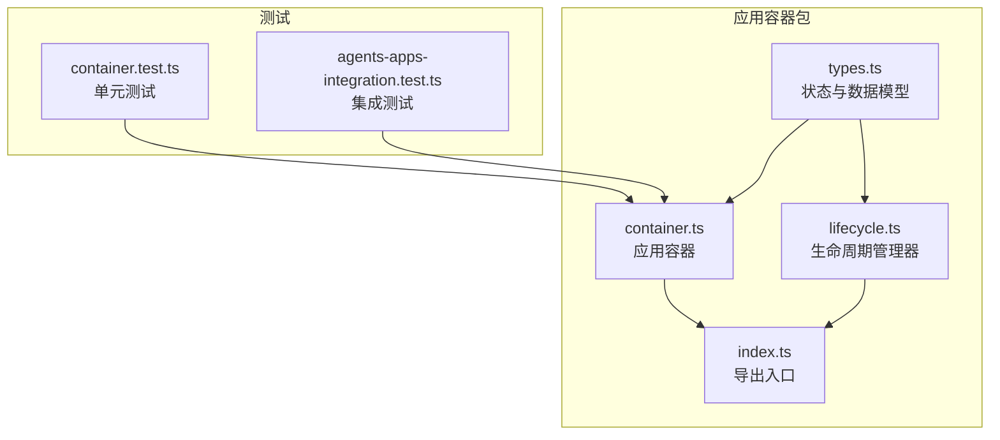
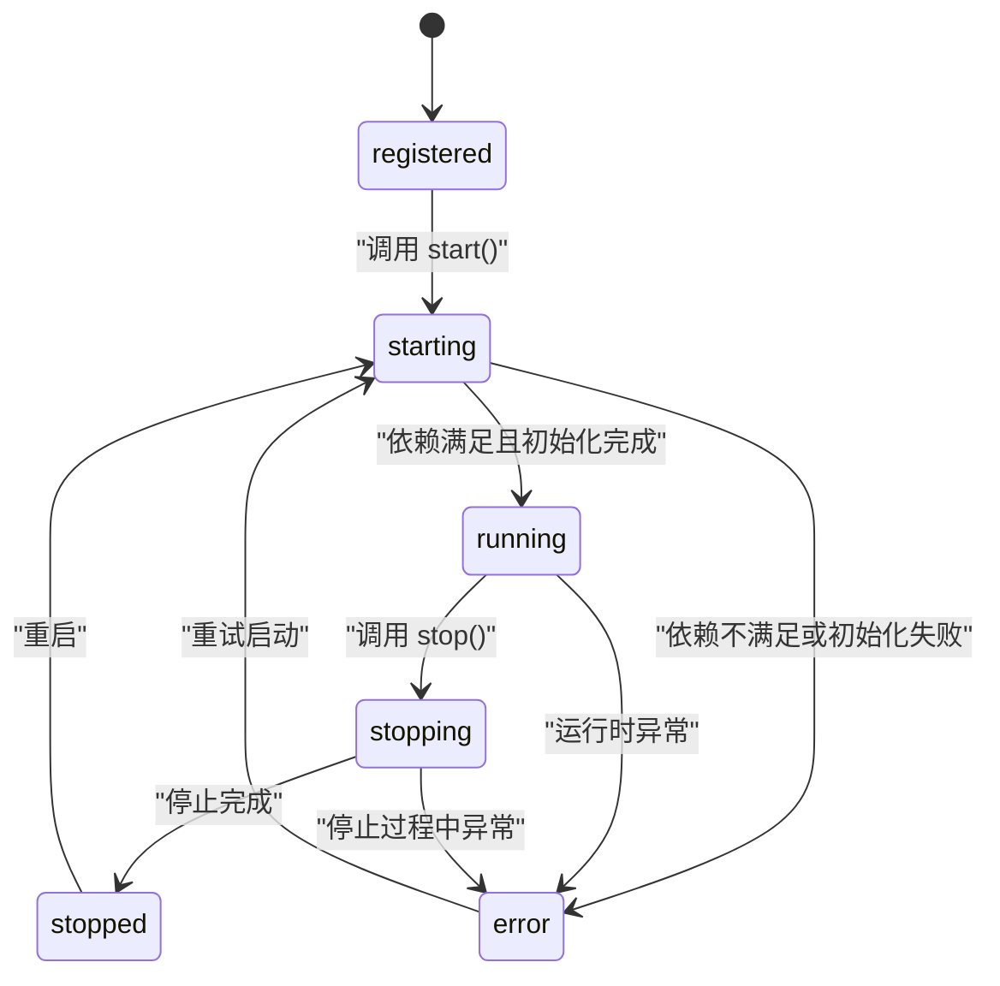
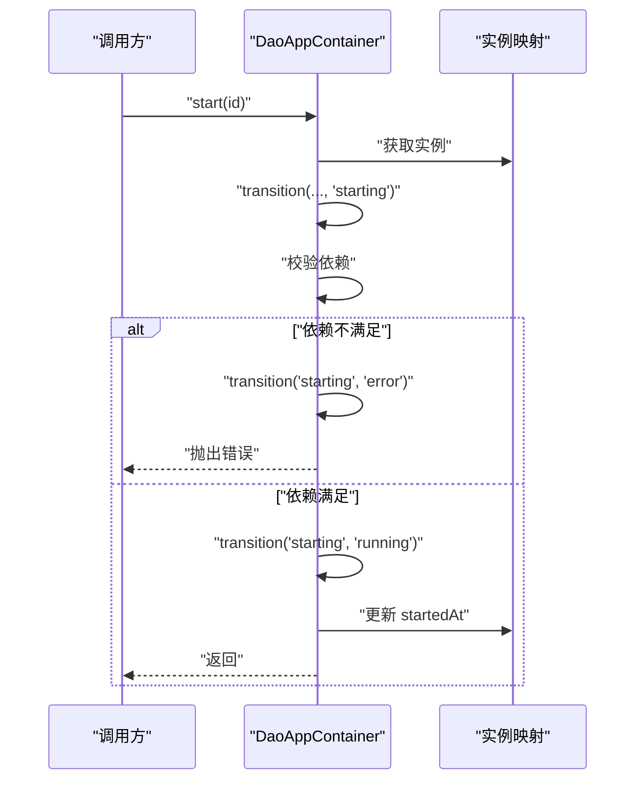
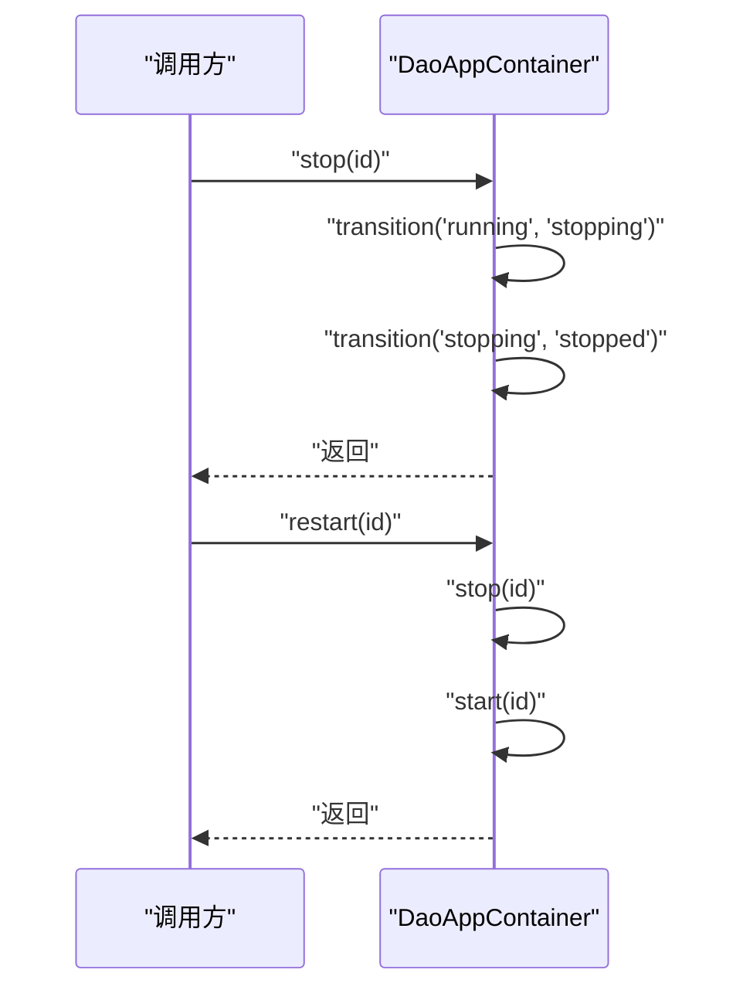
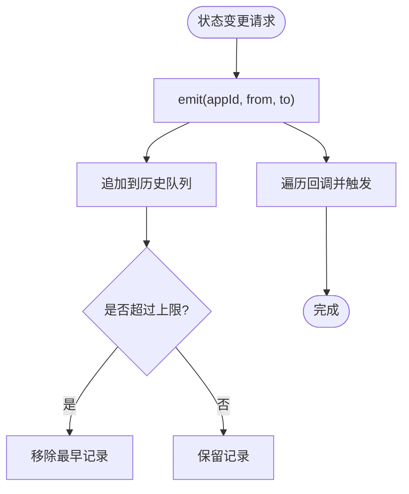
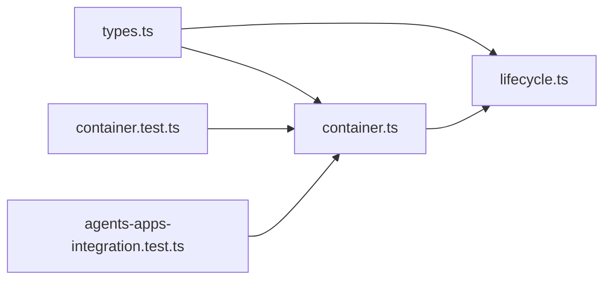
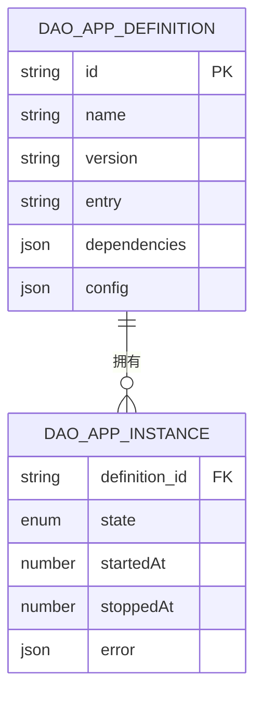

# 应用容器系统

<cite>
**本文引用的文件**
- [apps/DaoMind/packages/daoApps/src/types.ts](file://apps/DaoMind/packages/daoApps/src/types.ts)
- [apps/DaoMind/packages/daoApps/src/container.ts](file://apps/DaoMind/packages/daoApps/src/container.ts)
- [apps/DaoMind/packages/daoApps/src/lifecycle.ts](file://apps/DaoMind/packages/daoApps/src/lifecycle.ts)
- [apps/DaoMind/packages/daoApps/src/index.ts](file://apps/DaoMind/packages/daoApps/src/index.ts)
- [apps/DaoMind/packages/daoApps/src/__tests__/container.test.ts](file://apps/DaoMind/packages/daoApps/src/__tests__/container.test.ts)
- [apps/DaoMind/src/__tests__/integration/agents-apps-integration.test.ts](file://apps/DaoMind/src/__tests__/integration/agents-apps-integration.test.ts)
</cite>

## 目录
1. [简介](#简介)
2. [项目结构](#项目结构)
3. [核心组件](#核心组件)
4. [架构总览](#架构总览)
5. [详细组件分析](#详细组件分析)
6. [依赖关系分析](#依赖关系分析)
7. [性能考量](#性能考量)
8. [故障排查指南](#故障排查指南)
9. [结论](#结论)
10. [附录](#附录)

## 简介
本文件面向 DAO Collective 项目中的应用容器系统，系统性阐述应用容器的设计原理与实现机制，覆盖应用注册、启动、停止与卸载的完整生命周期管理；详解状态机设计（registered、starting、running、stopping、stopped、error）及状态转换规则；剖析依赖关系解析与管理（自动依赖检测、循环依赖处理）；分析应用实例化过程、配置管理与资源分配策略；并提供 API 接口说明、使用示例与最佳实践，以及状态流转图与组件关系图。

## 项目结构
应用容器系统位于 DaoMind 工作区的 daoApps 包中，采用清晰的分层组织：
- 类型定义：集中声明应用状态、应用定义与实例的数据结构
- 容器实现：负责应用注册、生命周期控制与状态机转换
- 生命周期管理器：提供状态变更监听与历史记录能力
- 导出入口：统一对外暴露类型与实例
- 测试：单元测试与集成测试验证行为正确性



图表来源
- [apps/DaoMind/packages/daoApps/src/types.ts:1-25](file://apps/DaoMind/packages/daoApps/src/types.ts#L1-L25)
- [apps/DaoMind/packages/daoApps/src/container.ts:1-108](file://apps/DaoMind/packages/daoApps/src/container.ts#L1-L108)
- [apps/DaoMind/packages/daoApps/src/lifecycle.ts:1-61](file://apps/DaoMind/packages/daoApps/src/lifecycle.ts#L1-L61)
- [apps/DaoMind/packages/daoApps/src/index.ts:1-8](file://apps/DaoMind/packages/daoApps/src/index.ts#L1-L8)
- [apps/DaoMind/packages/daoApps/src/__tests__/container.test.ts:1-233](file://apps/DaoMind/packages/daoApps/src/__tests__/container.test.ts#L1-L233)
- [apps/DaoMind/src/__tests__/integration/agents-apps-integration.test.ts:1-113](file://apps/DaoMind/src/__tests__/integration/agents-apps-integration.test.ts#L1-L113)

章节来源
- [apps/DaoMind/packages/daoApps/src/types.ts:1-25](file://apps/DaoMind/packages/daoApps/src/types.ts#L1-L25)
- [apps/DaoMind/packages/daoApps/src/container.ts:1-108](file://apps/DaoMind/packages/daoApps/src/container.ts#L1-L108)
- [apps/DaoMind/packages/daoApps/src/lifecycle.ts:1-61](file://apps/DaoMind/packages/daoApps/src/lifecycle.ts#L1-L61)
- [apps/DaoMind/packages/daoApps/src/index.ts:1-8](file://apps/DaoMind/packages/daoApps/src/index.ts#L1-L8)

## 核心组件
- 应用状态枚举：registered、starting、running、stopping、stopped、error
- 应用定义：包含 id、name、version、entry、dependencies、config 等字段
- 应用实例：包含 definition、state、startedAt、stoppedAt、error 等字段
- 应用容器：提供 register/unregister/start/stop/restart/get/listAll/listByState 等方法
- 生命周期管理器：提供 onStateChange、emit、getHistory 能力，支持监听与历史记录

章节来源
- [apps/DaoMind/packages/daoApps/src/types.ts:1-25](file://apps/DaoMind/packages/daoApps/src/types.ts#L1-L25)
- [apps/DaoMind/packages/daoApps/src/container.ts:16-103](file://apps/DaoMind/packages/daoApps/src/container.ts#L16-L103)
- [apps/DaoMind/packages/daoApps/src/lifecycle.ts:9-57](file://apps/DaoMind/packages/daoApps/src/lifecycle.ts#L9-L57)

## 架构总览
应用容器系统通过状态机驱动生命周期管理，并在启动阶段进行依赖校验；生命周期管理器提供事件订阅与历史记录能力，便于监控与审计。

```mermaid
classDiagram
class DaoAppContainer {
-definitions : Map<string, DaoAppDefinition>
-instances : Map<string, DaoAppInstance>
+register(definition)
+unregister(id)
+start(id)
+stop(id)
+restart(id)
+get(id)
+listAll()
+listByState(state)
-transition(id, from, to)
}
class DaoLifecycleManager {
-listeners : Map<string, Function[]>
-histories : Map<string, StateTransition[]>
-MAX_HISTORY : number
+onStateChange(appId, callback)
+emit(appId, from, to)
+getHistory(appId, limit?)
}
class AppState {
<<enumeration>>
"registered"
"starting"
"running"
"stopping"
"stopped"
"error"
}
DaoAppContainer --> AppState : "使用"
DaoAppContainer --> DaoLifecycleManager : "状态变更通知"
DaoLifecycleManager --> AppState : "记录状态"
```

图表来源
- [apps/DaoMind/packages/daoApps/src/container.ts:12-103](file://apps/DaoMind/packages/daoApps/src/container.ts#L12-L103)
- [apps/DaoMind/packages/daoApps/src/lifecycle.ts:9-57](file://apps/DaoMind/packages/daoApps/src/lifecycle.ts#L9-L57)
- [apps/DaoMind/packages/daoApps/src/types.ts:1-7](file://apps/DaoMind/packages/daoApps/src/types.ts#L1-L7)

## 详细组件分析

### 状态机设计与转换
状态机严格限定合法转换路径，确保状态演进的确定性与可追溯性：
- registered → starting
- starting → { running, error }
- running → { stopping, error }
- stopping → { stopped, error }
- stopped → starting
- error → starting

容器内部通过 transition 私有方法校验转换合法性，非法转换将抛出异常。



图表来源
- [apps/DaoMind/packages/daoApps/src/container.ts:3-10](file://apps/DaoMind/packages/daoApps/src/container.ts#L3-L10)
- [apps/DaoMind/packages/daoApps/src/container.ts:96-103](file://apps/DaoMind/packages/daoApps/src/container.ts#L96-L103)

章节来源
- [apps/DaoMind/packages/daoApps/src/container.ts:3-10](file://apps/DaoMind/packages/daoApps/src/container.ts#L3-L10)
- [apps/DaoMind/packages/daoApps/src/container.ts:96-103](file://apps/DaoMind/packages/daoApps/src/container.ts#L96-L103)

### 应用注册与实例化
- 注册：若 id 已存在则抛错；否则写入 definitions 与 instances，并将实例状态置为 registered
- 实例化：容器内部不直接加载 entry，仅维护状态与元数据；实际应用加载由上层业务或宿主环境负责

章节来源
- [apps/DaoMind/packages/daoApps/src/container.ts:16-25](file://apps/DaoMind/packages/daoApps/src/container.ts#L16-L25)

### 启动流程与依赖管理
- 启动前校验：若实例不存在，抛出“应用未注册”错误
- 依赖检查：遍历定义中的 dependencies，要求每个依赖必须存在且状态为 running；任一不满足则进入 error 并抛出“依赖未就绪”
- 状态推进：依赖满足后进入 running，并设置 startedAt（保证时间戳单调递增）
- 错误处理：任何环节异常均导致状态进入 error



图表来源
- [apps/DaoMind/packages/daoApps/src/container.ts:38-61](file://apps/DaoMind/packages/daoApps/src/container.ts#L38-L61)

章节来源
- [apps/DaoMind/packages/daoApps/src/container.ts:38-61](file://apps/DaoMind/packages/daoApps/src/container.ts#L38-L61)

### 停止与重启流程
- 停止：仅允许对 running 状态的应用执行；先 transition 到 stopping，再 transition 到 stopped，并设置 stoppedAt
- 重启：原子地执行 stop 与 start，确保状态回到 running



图表来源
- [apps/DaoMind/packages/daoApps/src/container.ts:63-78](file://apps/DaoMind/packages/daoApps/src/container.ts#L63-L78)

章节来源
- [apps/DaoMind/packages/daoApps/src/container.ts:63-78](file://apps/DaoMind/packages/daoApps/src/container.ts#L63-L78)

### 卸载与状态约束
- 仅当实例状态为 registered 或 stopped 时允许卸载；若处于 running 或 starting，则抛出“无法卸载运行中的应用”错误
- 卸载会同时移除 definitions 与 instances

章节来源
- [apps/DaoMind/packages/daoApps/src/container.ts:27-36](file://apps/DaoMind/packages/daoApps/src/container.ts#L27-L36)

### 查询与列表
- get：按 id 获取实例
- listAll：返回所有实例
- listByState：按状态过滤实例

章节来源
- [apps/DaoMind/packages/daoApps/src/container.ts:80-94](file://apps/DaoMind/packages/daoApps/src/container.ts#L80-L94)

### 生命周期管理器
- 订阅：onStateChange 为指定 appId 注册回调，返回取消函数
- 发布：emit 触发状态变更事件，同时维护最多 100 条的历史记录
- 查询：getHistory 支持按需限制历史长度



图表来源
- [apps/DaoMind/packages/daoApps/src/lifecycle.ts:29-47](file://apps/DaoMind/packages/daoApps/src/lifecycle.ts#L29-L47)

章节来源
- [apps/DaoMind/packages/daoApps/src/lifecycle.ts:9-57](file://apps/DaoMind/packages/daoApps/src/lifecycle.ts#L9-L57)

### API 接口说明
- 类型
  - AppState：应用状态枚举
  - DaoAppDefinition：应用定义（id/name/version/entry/dependencies/config）
  - DaoAppInstance：应用实例（definition/state/startedAt/stoppedAt/error）
- 容器
  - register(definition): void
  - unregister(id): boolean
  - start(id): Promise<void>
  - stop(id): Promise<void>
  - restart(id): Promise<void>
  - get(id): DaoAppInstance | undefined
  - listAll(): DaoAppInstance[]
  - listByState(state): DaoAppInstance[]
- 生命周期管理器
  - onStateChange(appId, callback): () => void
  - getHistory(appId, limit?): StateTransition[]

章节来源
- [apps/DaoMind/packages/daoApps/src/types.ts:1-25](file://apps/DaoMind/packages/daoApps/src/types.ts#L1-L25)
- [apps/DaoMind/packages/daoApps/src/container.ts:16-94](file://apps/DaoMind/packages/daoApps/src/container.ts#L16-L94)
- [apps/DaoMind/packages/daoApps/src/lifecycle.ts:14-57](file://apps/DaoMind/packages/daoApps/src/lifecycle.ts#L14-L57)
- [apps/DaoMind/packages/daoApps/src/index.ts:1-8](file://apps/DaoMind/packages/daoApps/src/index.ts#L1-L8)

### 使用示例与最佳实践
- 注册与启动
  - 先注册依赖应用，确保其状态为 running，再启动主应用
  - 使用 listByState 进行批量状态查询与编排
- 监听与审计
  - 使用 onStateChange 订阅关键应用的状态变化，结合 getHistory 进行回溯
- 错误处理
  - 对于“应用未注册/未运行/依赖未就绪”等错误，应捕获并进行降级或重试策略
- 性能建议
  - 控制历史记录数量，避免内存膨胀
  - 批量操作时尽量减少频繁的 get/list 调用

章节来源
- [apps/DaoMind/packages/daoApps/src/__tests__/container.test.ts:78-132](file://apps/DaoMind/packages/daoApps/src/__tests__/container.test.ts#L78-L132)
- [apps/DaoMind/src/__tests__/integration/agents-apps-integration.test.ts:82-112](file://apps/DaoMind/src/__tests__/integration/agents-apps-integration.test.ts#L82-L112)

## 依赖关系分析
- 容器对类型定义的依赖：状态机、实例结构、配置项
- 容器对生命周期管理器的依赖：状态变更通知与历史记录
- 测试对容器的依赖：覆盖注册、启动、停止、卸载、查询与依赖场景



图表来源
- [apps/DaoMind/packages/daoApps/src/types.ts:1-25](file://apps/DaoMind/packages/daoApps/src/types.ts#L1-L25)
- [apps/DaoMind/packages/daoApps/src/container.ts:1-108](file://apps/DaoMind/packages/daoApps/src/container.ts#L1-L108)
- [apps/DaoMind/packages/daoApps/src/lifecycle.ts:1-61](file://apps/DaoMind/packages/daoApps/src/lifecycle.ts#L1-L61)
- [apps/DaoMind/packages/daoApps/src/__tests__/container.test.ts:1-233](file://apps/DaoMind/packages/daoApps/src/__tests__/container.test.ts#L1-L233)
- [apps/DaoMind/src/__tests__/integration/agents-apps-integration.test.ts:1-113](file://apps/DaoMind/src/__tests__/integration/agents-apps-integration.test.ts#L1-L113)

章节来源
- [apps/DaoMind/packages/daoApps/src/container.ts:1-108](file://apps/DaoMind/packages/daoApps/src/container.ts#L1-L108)
- [apps/DaoMind/packages/daoApps/src/lifecycle.ts:1-61](file://apps/DaoMind/packages/daoApps/src/lifecycle.ts#L1-L61)

## 性能考量
- 状态存储：使用 Map 结构存储 definitions 与 instances，提供 O(1) 查找与更新
- 历史记录：限制最大历史长度，避免无限增长；必要时可考虑外部持久化
- 时间戳：启动时间戳在容器内保证唯一性，避免并发场景下的重复值
- 依赖检查：线性扫描 dependencies，复杂度 O(n)，建议在注册阶段做去重与预校验

## 故障排查指南
- “应用未注册”
  - 现象：调用 start/stop/restart/get 时抛出
  - 排查：确认是否已调用 register，或是否已被 unregister
- “无法卸载运行中的应用”
  - 现象：unregister 抛出
  - 排查：先 stop，确认状态为 stopped 或 registered 后再卸载
- “依赖未就绪”
  - 现象：启动主应用时报错
  - 排查：确认依赖应用已注册且状态为 running；使用 listByState 校验
- “应用未运行，无法停止”
  - 现象：stop 抛错
  - 排查：确认应用当前状态为 running
- “非法状态转换”
  - 现象：transition 抛错
  - 排查：检查调用顺序与前置条件，遵循状态机合法路径

章节来源
- [apps/DaoMind/packages/daoApps/src/container.ts:38-73](file://apps/DaoMind/packages/daoApps/src/container.ts#L38-L73)
- [apps/DaoMind/packages/daoApps/src/container.ts:96-103](file://apps/DaoMind/packages/daoApps/src/container.ts#L96-L103)

## 结论
应用容器系统以明确的状态机与严格的依赖检查为核心，提供了可靠的应用生命周期管理能力；配合生命周期管理器的事件与历史记录，能够满足监控、审计与可观测性的需求。通过规范的 API 与测试覆盖，系统具备良好的扩展性与可维护性。

## 附录
- 数据模型图



图表来源
- [apps/DaoMind/packages/daoApps/src/types.ts:9-24](file://apps/DaoMind/packages/daoApps/src/types.ts#L9-L24)