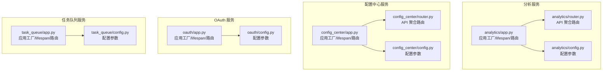
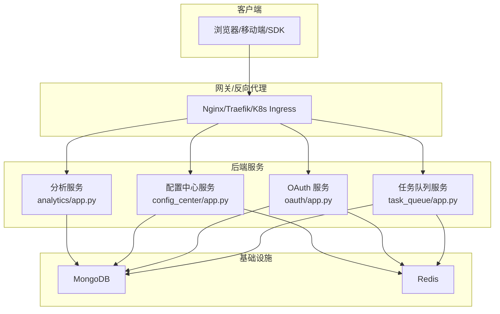
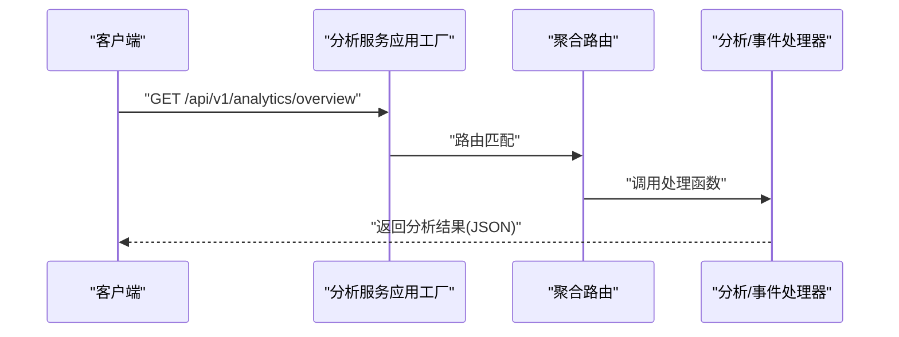
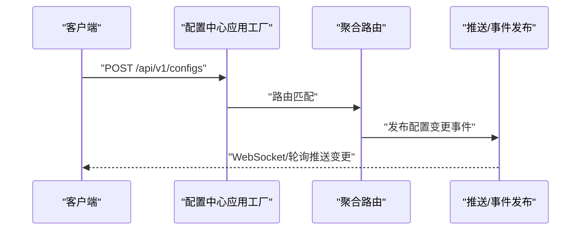
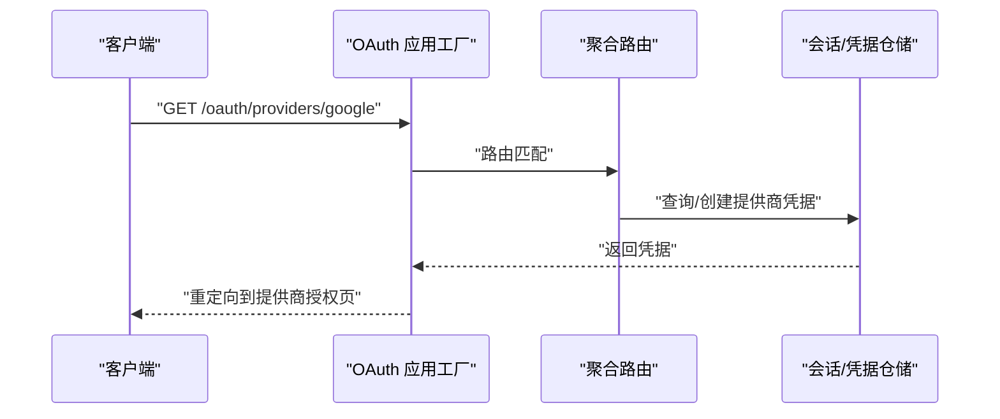
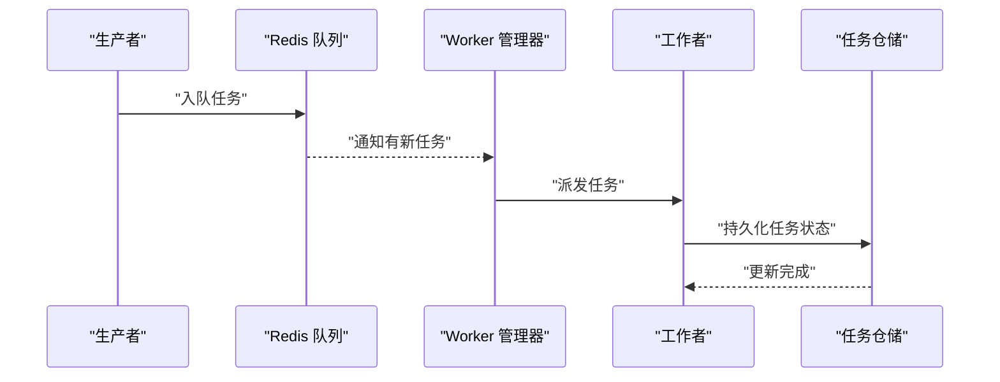
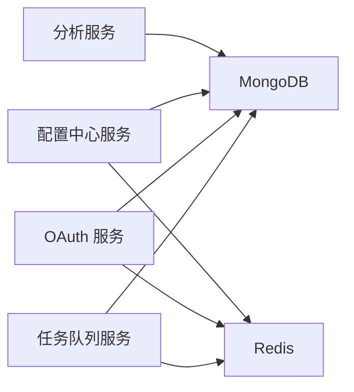

# 微服务架构

<cite>
**本文引用的文件**
- [analytics/app.py](file://tools/flexloop/src/taolib/testing/analytics/server/app.py)
- [config_center/app.py](file://tools/flexloop/src/taolib/testing/config_center/server/app.py)
- [oauth/app.py](file://tools/flexloop/src/taolib/testing/oauth/server/app.py)
- [task_queue/app.py](file://tools/flexloop/src/taolib/testing/task_queue/server/app.py)
- [analytics/router.py](file://tools/flexloop/src/taolib/testing/analytics/server/api/router.py)
- [config_center/router.py](file://tools/flexloop/src/taolib/testing/config_center/server/api/router.py)
- [analytics/config.py](file://tools/flexloop/src/taolib/testing/analytics/server/config.py)
- [config_center/config.py](file://tools/flexloop/src/taolib/testing/config_center/server/config.py)
- [oauth/config.py](file://tools/flexloop/src/taolib/testing/oauth/server/config.py)
- [task_queue/config.py](file://tools/flexloop/src/taolib/testing/task_queue/server/config.py)
</cite>

## 目录
1. [简介](#简介)
2. [项目结构](#项目结构)
3. [核心组件](#核心组件)
4. [架构总览](#架构总览)
5. [详细组件分析](#详细组件分析)
6. [依赖分析](#依赖分析)
7. [性能考虑](#性能考虑)
8. [故障排查指南](#故障排查指南)
9. [结论](#结论)
10. [附录](#附录)

## 简介
本文件面向 DAO Collective 项目的微服务架构，围绕基于 FastAPI 的服务拆分与接口设计进行系统化梳理。重点覆盖以下方面：
- 服务拆分原则：按业务域划分，职责单一，边界清晰
- 接口设计规范：RESTful 风格、资源命名、HTTP 方法与状态码约定
- 通信协议：同步 HTTP API、异步消息与事件驱动（Redis Pub/Sub）
- 服务发现与负载均衡：通过反向代理与容器编排实现
- 故障恢复：健康检查、超时与重试、可观测性
- 部署策略：容器化、多实例、滚动更新
- 监控与日志：指标采集、链路追踪、日志聚合
- 架构图、API 接口文档与集成示例

## 项目结构
本仓库采用多包多服务的组织方式，每个微服务以独立的 FastAPI 应用工厂模块为核心入口，并在各自目录下提供：
- 应用工厂与生命周期管理（lifespan）
- API 路由聚合
- 配置模块
- 数据库与中间件初始化
- 可选的前端仪表板（HTML）

图表来源
- [analytics/app.py:65-95](file://tools/flexloop/src/taolib/testing/analytics/server/app.py#L65-L95)
- [analytics/router.py:7-12](file://tools/flexloop/src/taolib/testing/analytics/server/api/router.py#L7-L12)
- [analytics/config.py](file://tools/flexloop/src/taolib/testing/analytics/server/config.py)
- [config_center/app.py:128-149](file://tools/flexloop/src/taolib/testing/config_center/server/app.py#L128-L149)
- [config_center/router.py:17-28](file://tools/flexloop/src/taolib/testing/config_center/server/api/router.py#L17-L28)
- [config_center/config.py](file://tools/flexloop/src/taolib/testing/config_center/server/config.py)
- [oauth/app.py:116-137](file://tools/flexloop/src/taolib/testing/oauth/server/app.py#L116-L137)
- [oauth/config.py](file://tools/flexloop/src/taolib/testing/oauth/server/config.py)
- [task_queue/app.py:70-97](file://tools/flexloop/src/taolib/testing/task_queue/server/app.py#L70-L97)
- [task_queue/config.py](file://tools/flexloop/src/taolib/testing/task_queue/server/config.py)

章节来源
- [analytics/app.py:65-95](file://tools/flexloop/src/taolib/testing/analytics/server/app.py#L65-L95)
- [config_center/app.py:128-149](file://tools/flexloop/src/taolib/testing/config_center/server/app.py#L128-L149)
- [oauth/app.py:116-137](file://tools/flexloop/src/taolib/testing/oauth/server/app.py#L116-L137)
- [task_queue/app.py:70-97](file://tools/flexloop/src/taolib/testing/task_queue/server/app.py#L70-L97)

## 核心组件
- 应用工厂与生命周期管理
  - 每个服务均通过工厂函数创建 FastAPI 实例，并在 lifespan 中完成数据库连接、索引建立、中间件注册等初始化工作
  - 生命周期结束时负责优雅关闭连接池与后台任务
- API 路由聚合
  - 统一前缀 /api/v1，按功能域拆分子路由，便于版本控制与扩展
- 配置模块
  - 通过 settings 对象集中管理数据库连接、CORS、Redis、TTL 等参数
- 中间件
  - 统一启用 CORS 中间件，支持跨域请求
- 可视化仪表板
  - 部分服务提供内置 HTML 仪表板，用于运行状态与指标展示

章节来源
- [analytics/app.py:19-56](file://tools/flexloop/src/taolib/testing/analytics/server/app.py#L19-L56)
- [config_center/app.py:27-105](file://tools/flexloop/src/taolib/testing/config_center/server/app.py#L27-L105)
- [oauth/app.py:22-66](file://tools/flexloop/src/taolib/testing/oauth/server/app.py#L22-L66)
- [task_queue/app.py:19-67](file://tools/flexloop/src/taolib/testing/task_queue/server/app.py#L19-L67)
- [analytics/router.py:7-12](file://tools/flexloop/src/taolib/testing/analytics/server/api/router.py#L7-L12)
- [config_center/router.py:17-28](file://tools/flexloop/src/taolib/testing/config_center/server/api/router.py#L17-L28)

## 架构总览
微服务采用“单体应用工厂 + 多服务模块”的组织方式，服务之间通过 HTTP API 同步交互，部分服务引入 Redis 进行事件发布/订阅与推送桥接，形成同步与异步混合的通信形态。

图表来源
- [analytics/app.py:24-26](file://tools/flexloop/src/taolib/testing/analytics/server/app.py#L24-L26)
- [config_center/app.py:34-40](file://tools/flexloop/src/taolib/testing/config_center/server/app.py#L34-L40)
- [oauth/app.py:28-36](file://tools/flexloop/src/taolib/testing/oauth/server/app.py#L28-L36)
- [task_queue/app.py:31-38](file://tools/flexloop/src/taolib/testing/task_queue/server/app.py#L31-L38)

## 详细组件分析

### 分析服务（Analytics）
- 功能定位：用户行为事件采集、会话管理、分析报表与可视化
- 数据模型与索引
  - 事件集合与会话集合分别建立复合索引与 TTL 索引，保障查询效率与数据生命周期管理
- 生命周期
  - 初始化 MongoDB 客户端与数据库；创建必要的索引；设置事件与会话的 TTL
- API 聚合
  - 事件、分析、健康检查等子路由统一挂载至 /api/v1 前缀
- 可视化
  - 提供内置 HTML 仪表板，支持概览、漏斗、路径、留存等维度的可视化

图表来源
- [analytics/app.py:65-95](file://tools/flexloop/src/taolib/testing/analytics/server/app.py#L65-L95)
- [analytics/router.py:7-12](file://tools/flexloop/src/taolib/testing/analytics/server/api/router.py#L7-L12)

章节来源
- [analytics/app.py:19-56](file://tools/flexloop/src/taolib/testing/analytics/server/app.py#L19-L56)
- [analytics/router.py:7-12](file://tools/flexloop/src/taolib/testing/analytics/server/api/router.py#L7-L12)

### 配置中心服务（Config Center）
- 功能定位：集中式配置管理、审计日志、RBAC、推送与事件发布
- 生命周期
  - 初始化 MongoDB 与 Redis；创建索引；启动推送管理器与 Pub/Sub 桥接；初始化系统角色
- 通信
  - 通过 Redis 实现事件发布与 WebSocket 推送桥接
- API 聚合
  - 包含认证、配置、版本、审计、用户、角色、推送等子路由

图表来源
- [config_center/app.py:27-105](file://tools/flexloop/src/taolib/testing/config_center/server/app.py#L27-L105)
- [config_center/router.py:17-28](file://tools/flexloop/src/taolib/testing/config_center/server/api/router.py#L17-L28)

章节来源
- [config_center/app.py:27-105](file://tools/flexloop/src/taolib/testing/config_center/server/app.py#L27-L105)
- [config_center/router.py:17-28](file://tools/flexloop/src/taolib/testing/config_center/server/api/router.py#L17-L28)

### OAuth 服务（OAuth）
- 功能定位：第三方登录与会话管理，支持 Google/GitHub 等提供商
- 生命周期
  - 初始化 MongoDB 与 Redis；创建索引；从环境变量引导提供商凭据
- 通信
  - 使用加密存储提供商密钥，回调地址动态生成

图表来源
- [oauth/app.py:22-66](file://tools/flexloop/src/taolib/testing/oauth/server/app.py#L22-L66)

章节来源
- [oauth/app.py:22-66](file://tools/flexloop/src/taolib/testing/oauth/server/app.py#L22-L66)

### 任务队列服务（Task Queue）
- 功能定位：后台任务队列管理、任务调度与监控
- 生命周期
  - 初始化 MongoDB 与 Redis；创建索引；启动 Worker 管理器与多个工作者
- 通信
  - 通过 Redis 队列进行任务入队与出队；支持优先级与重试
- 可视化
  - 内置仪表板，展示队列深度、运行中与失败任务

图表来源
- [task_queue/app.py:19-67](file://tools/flexloop/src/taolib/testing/task_queue/server/app.py#L19-L67)

章节来源
- [task_queue/app.py:19-67](file://tools/flexloop/src/taolib/testing/task_queue/server/app.py#L19-L67)

## 依赖分析
- 数据库层
  - MongoDB：各服务均使用 Motor 异步客户端连接，按集合建立索引，保障查询性能与数据生命周期
- 缓存与消息
  - Redis：配置中心与 OAuth 服务用于推送与事件发布；任务队列服务用于队列与工作者协调
- 中间件
  - CORS：统一允许跨域请求，便于前端直连
- 配置
  - 各服务通过 settings 集中管理数据库、缓存、TTL、CORS 等参数

图表来源
- [analytics/app.py:24-26](file://tools/flexloop/src/taolib/testing/analytics/server/app.py#L24-L26)
- [config_center/app.py:34-40](file://tools/flexloop/src/taolib/testing/config_center/server/app.py#L34-L40)
- [oauth/app.py:28-36](file://tools/flexloop/src/taolib/testing/oauth/server/app.py#L28-L36)
- [task_queue/app.py:31-38](file://tools/flexloop/src/taolib/testing/task_queue/server/app.py#L31-L38)

章节来源
- [analytics/config.py](file://tools/flexloop/src/taolib/testing/analytics/server/config.py)
- [config_center/config.py](file://tools/flexloop/src/taolib/testing/config_center/server/config.py)
- [oauth/config.py](file://tools/flexloop/src/taolib/testing/oauth/server/config.py)
- [task_queue/config.py](file://tools/flexloop/src/taolib/testing/task_queue/server/config.py)

## 性能考虑
- 数据库优化
  - 为高频查询字段建立复合索引；利用 TTL 索引自动清理过期数据
- 缓存与消息
  - Redis 用于事件发布与推送，降低数据库压力；队列按优先级分层，避免阻塞
- 并发与弹性
  - FastAPI 异步特性提升 I/O 密集型场景吞吐；工作者数量可配置
- 监控与告警
  - 仪表板提供实时指标；建议接入外部监控系统（如 Prometheus/Grafana）与日志聚合平台

## 故障排查指南
- 健康检查
  - 各服务均提供 /api/v1/health 路由，用于快速判断服务可用性
- 日志与追踪
  - 在生命周期中打印启动/关闭信息，便于定位异常
- 常见问题
  - 数据库连接失败：检查连接字符串与网络权限
  - Redis 连接失败：确认地址与密码；查看连接池状态
  - 队列无工作者：检查工作者数量与任务类型注册

章节来源
- [analytics/router.py](file://tools/flexloop/src/taolib/testing/analytics/server/api/router.py#L11)
- [config_center/router.py](file://tools/flexloop/src/taolib/testing/config_center/server/api/router.py#L20)
- [task_queue/app.py:92-97](file://tools/flexloop/src/taolib/testing/task_queue/server/app.py#L92-L97)

## 结论
DAO Collective 的微服务以 FastAPI 为基础，结合 MongoDB 与 Redis，实现了事件分析、配置管理、认证与任务队列等核心能力。通过统一的路由前缀、生命周期管理与中间件配置，确保了服务的一致性与可维护性。建议在生产环境中完善服务发现、负载均衡、熔断限流与全链路监控体系，进一步提升稳定性与可观测性。

## 附录

### RESTful API 设计规范
- 资源命名
  - 使用名词复数形式，如 /configs、/users、/versions
- HTTP 方法
  - GET：获取资源或列表
  - POST：创建资源
  - PUT/PATCH：更新资源
  - DELETE：删除资源
- 状态码
  - 200：成功
  - 201：已创建
  - 400：请求错误
  - 401/403：未授权/禁止访问
  - 404：资源不存在
  - 500：服务器内部错误

### 服务间通信方式
- 同步调用
  - 通过 HTTP API 直接调用，适用于强一致与低延迟场景
- 异步消息与事件驱动
  - 通过 Redis 发布/订阅实现事件解耦；任务队列服务支持优先级与重试

### 部署策略与运维
- 容器化
  - 每个服务打包为独立镜像，通过 Docker Compose 或 Kubernetes 编排
- 负载均衡
  - 使用反向代理或云负载均衡对多实例进行流量分发
- 滚动更新
  - 逐步替换实例，配合健康检查与灰度发布
- 监控与日志
  - 指标采集、链路追踪、日志聚合与告警联动

### API 接口文档（示例）
- 分析服务
  - GET /api/v1/analytics/overview
  - GET /api/v1/analytics/features
  - GET /api/v1/analytics/paths
  - GET /api/v1/analytics/retention
  - GET /api/v1/analytics/funnel
  - GET /api/v1/analytics/drop-off
  - GET /api/v1/events
  - GET /api/v1/health
- 配置中心服务
  - GET /api/v1/configs
  - POST /api/v1/configs
  - PUT /api/v1/configs/{id}
  - DELETE /api/v1/configs/{id}
  - GET /api/v1/versions
  - GET /api/v1/audit
  - GET /api/v1/users
  - GET /api/v1/roles
  - GET /api/v1/push
  - GET /api/v1/health
- OAuth 服务
  - GET /api/v1/oauth/providers
  - GET /api/v1/oauth/callback/{provider}
  - GET /api/v1/oauth/sessions
  - GET /api/v1/health
- 任务队列服务
  - GET /api/v1/stats
  - GET /api/v1/tasks
  - POST /api/v1/tasks/retry/{id}
  - GET /api/v1/tasks/{id}
  - GET /api/v1/health

章节来源
- [analytics/router.py:10-12](file://tools/flexloop/src/taolib/testing/analytics/server/api/router.py#L10-L12)
- [config_center/router.py:20-28](file://tools/flexloop/src/taolib/testing/config_center/server/api/router.py#L20-L28)
- [oauth/app.py:116-137](file://tools/flexloop/src/taolib/testing/oauth/server/app.py#L116-L137)
- [task_queue/app.py:70-97](file://tools/flexloop/src/taolib/testing/task_queue/server/app.py#L70-L97)