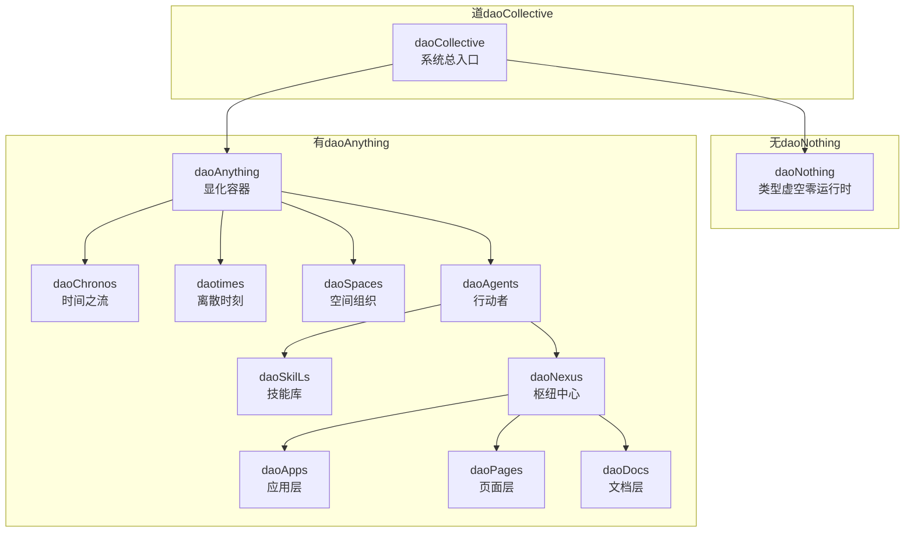
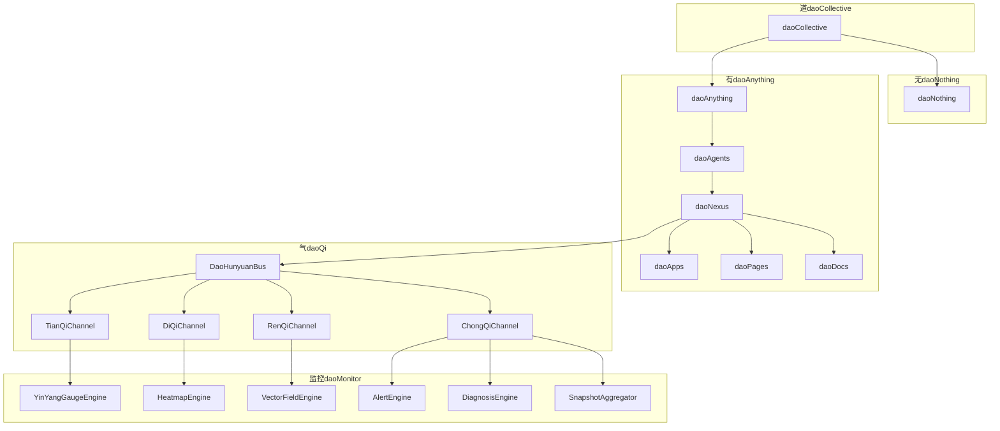
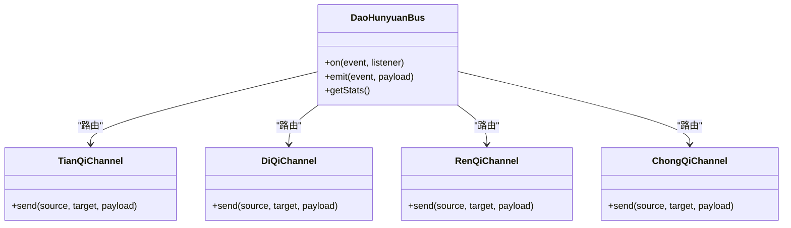
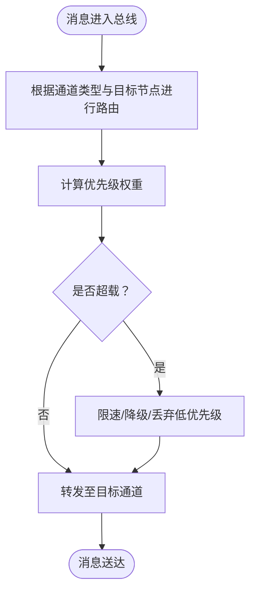
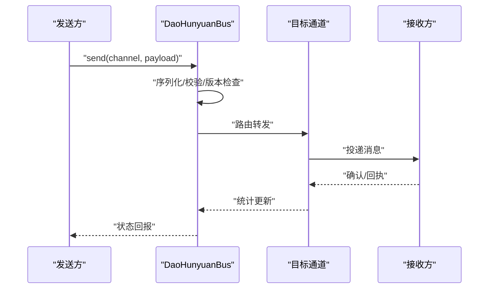
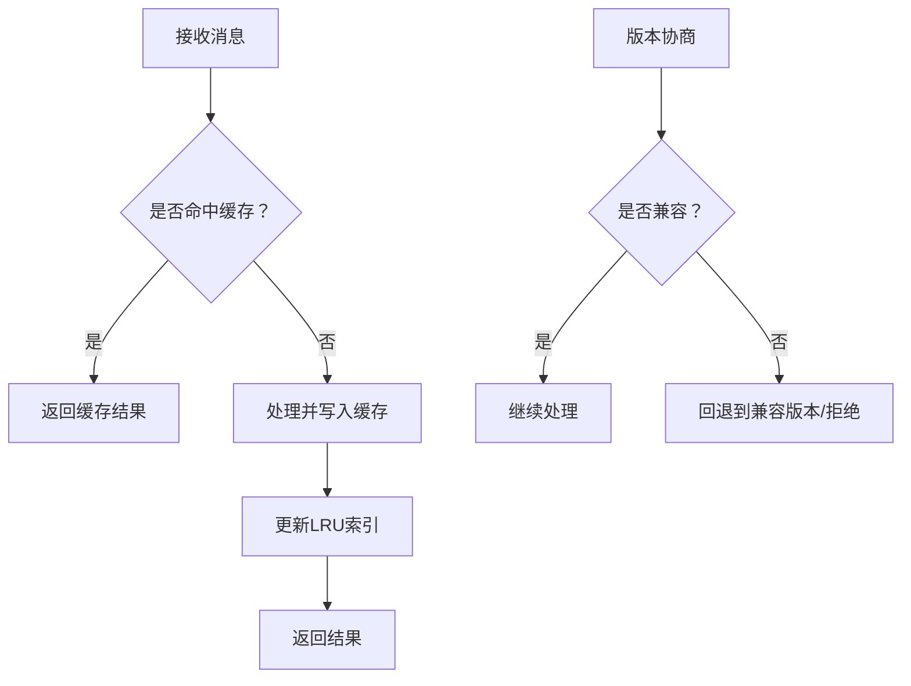
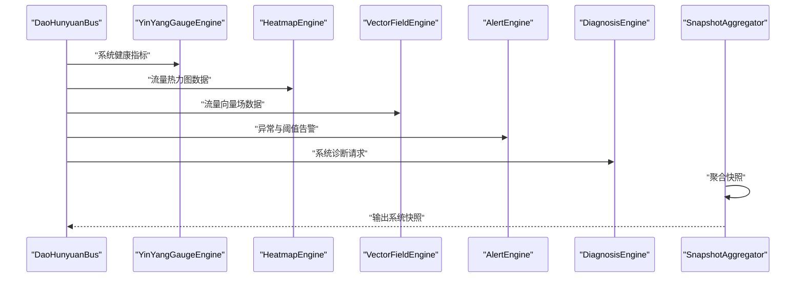
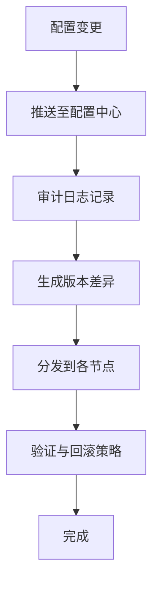
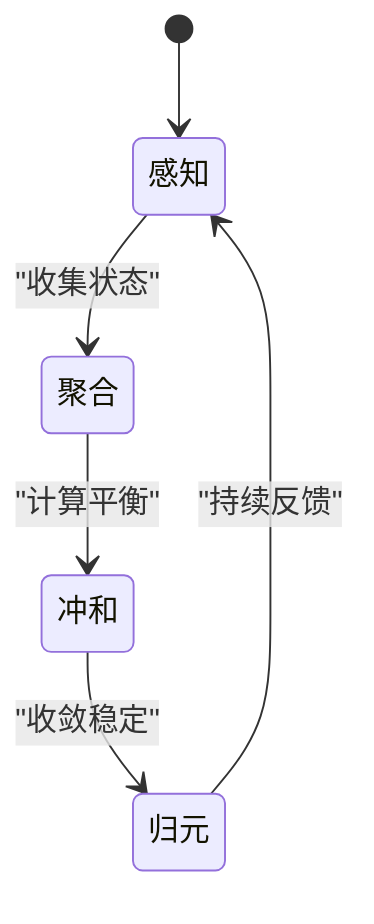
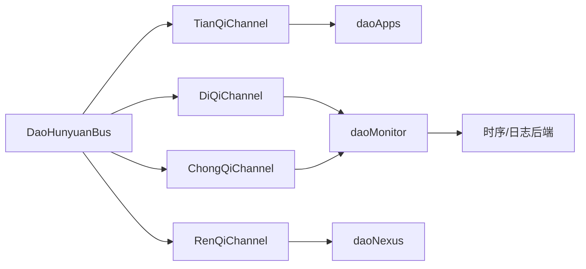

# 数据流设计

<cite>
**本文引用的文件**   
- [apps/DaoMind/README.md](file://apps/DaoMind/README.md)
- [tools/flexloop/README.md](file://tools/flexloop/README.md)
- [apps/DaoMind/packages/daoQi/src/index.ts](file://apps/DaoMind/packages/daoQi/src/index.ts)
- [apps/DaoMind/packages/daoMonitor/src/index.ts](file://apps/DaoMind/packages/daoMonitor/src/index.ts)
- [apps/DaoMind/packages/daoCollective/src/index.ts](file://apps/DaoMind/packages/daoCollective/src/index.ts)
- [apps/DaoMind/packages/daoNothing/src/index.ts](file://apps/DaoMind/packages/daoNothing/src/index.ts)
- [apps/DaoMind/packages/daoAnything/src/index.ts](file://apps/DaoMind/packages/daoAnything/src/index.ts)
- [apps/DaoMind/packages/daoAgents/src/index.ts](file://apps/DaoMind/packages/daoAgents/src/index.ts)
- [apps/DaoMind/packages/daoNexus/src/index.ts](file://apps/DaoMind/packages/daoNexus/src/index.ts)
- [apps/DaoMind/packages/daoApps/src/index.ts](file://apps/DaoMind/packages/daoApps/src/index.ts)
- [apps/DaoMind/packages/daoPages/src/index.ts](file://apps/DaoMind/packages/daoPages/src/index.ts)
- [apps/DaoMind/packages/daoDocs/src/index.ts](file://apps/DaoMind/packages/daoDocs/src/index.ts)
- [apps/DaoMind/packages/daoBenchmark/src/index.ts](file://apps/DaoMind/packages/daoBenchmark/src/index.ts)
- [apps/DaoMind/packages/daoChronos/src/index.ts](file://apps/DaoMind/packages/daoChronos/src/index.ts)
- [apps/DaoMind/packages/daotimes/src/index.ts](file://apps/DaoMind/packages/daotimes/src/index.ts)
- [apps/DaoMind/packages/daoSpaces/src/index.ts](file://apps/DaoMind/packages/daoSpaces/src/index.ts)
- [apps/DaoMind/packages/daoSkilLs/src/index.ts](file://apps/DaoMind/packages/daoSkilLs/src/index.ts)
- [apps/DaoMind/packages/daoFeedback/src/index.ts](file://apps/DaoMind/packages/daoFeedback/src/index.ts)
- [apps/DaoMind/packages/daoVerify/src/index.ts](file://apps/DaoMind/packages/daoVerify/src/index.ts)
- [apps/DaoMind/packages/daoDocs/src/index.ts](file://apps/DaoMind/packages/daoDocs/src/index.ts)
- [apps/DaoMind/packages/daoMonitor/src/index.ts](file://apps/DaoMind/packages/daoMonitor/src/index.ts)
- [apps/DaoMind/packages/daoMonitor/src/engines/YinYangGaugeEngine.ts](file://apps/DaoMind/packages/daoMonitor/src/engines/YinYangGaugeEngine.ts)
- [apps/DaoMind/packages/daoMonitor/src/engines/HeatmapEngine.ts](file://apps/DaoMind/packages/daoMonitor/src/engines/HeatmapEngine.ts)
- [apps/DaoMind/packages/daoMonitor/src/engines/VectorFieldEngine.ts](file://apps/DaoMind/packages/daoMonitor/src/engines/VectorFieldEngine.ts)
- [apps/DaoMind/packages/daoMonitor/src/engines/AlertEngine.ts](file://apps/DaoMind/packages/daoMonitor/src/engines/AlertEngine.ts)
- [apps/DaoMind/packages/daoMonitor/src/engines/DiagnosisEngine.ts](file://apps/DaoMind/packages/daoMonitor/src/engines/DiagnosisEngine.ts)
- [apps/DaoMind/packages/daoMonitor/src/engines/SnapshotAggregator.ts](file://apps/DaoMind/packages/daoMonitor/src/engines/SnapshotAggregator.ts)
- [apps/DaoMind/packages/daoQi/src/channels/TianQiChannel.ts](file://apps/DaoMind/packages/daoQi/src/channels/TianQiChannel.ts)
- [apps/DaoMind/packages/daoQi/src/channels/DiQiChannel.ts](file://apps/DaoMind/packages/daoQi/src/channels/DiQiChannel.ts)
- [apps/DaoMind/packages/daoQi/src/channels/RenQiChannel.ts](file://apps/DaoMind/packages/daoQi/src/channels/RenQiChannel.ts)
- [apps/DaoMind/packages/daoQi/src/channels/ChongQiChannel.ts](file://apps/DaoMind/packages/daoQi/src/channels/ChongQiChannel.ts)
- [apps/DaoMind/packages/daoQi/src/bus/DaoHunyuanBus.ts](file://apps/DaoMind/packages/daoQi/src/bus/DaoHunyuanBus.ts)
- [apps/DaoMind/packages/daoQi/src/types/index.ts](file://apps/DaoMind/packages/daoQi/src/types/index.ts)
- [apps/DaoMind/packages/daoQi/src/utils/routing.ts](file://apps/DaoMind/packages/daoQi/src/utils/routing.ts)
- [apps/DaoMind/packages/daoQi/src/utils/priority.ts](file://apps/DaoMind/packages/daoQi/src/utils/priority.ts)
- [apps/DaoMind/packages/daoQi/src/utils/flowControl.ts](file://apps/DaoMind/packages/daoQi/src/utils/flowControl.ts)
- [apps/DaoMind/packages/daoQi/src/utils/consistency.ts](file://apps/DaoMind/packages/daoQi/src/utils/consistency.ts)
- [apps/DaoMind/packages/daoQi/src/utils/cache.ts](file://apps/DaoMind/packages/daoQi/src/utils/cache.ts)
- [apps/DaoMind/packages/daoQi/src/utils/versioning.ts](file://apps/DaoMind/packages/daoQi/src/utils/versioning.ts)
- [apps/DaoMind/packages/daoQi/src/utils/validation.ts](file://apps/DaoMind/packages/daoQi/src/utils/validation.ts)
- [apps/DaoMind/packages/daoQi/src/utils/serialization.ts](file://apps/DaoMind/packages/daoQi/src/utils/serialization.ts)
- [apps/DaoMind/packages/daoQi/src/utils/transformation.ts](file://apps/DaoMind/packages/daoQi/src/utils/transformation.ts)
- [apps/DaoMind/packages/daoQi/src/utils/monitoring.ts](file://apps/DaoMind/packages/daoQi/src/utils/monitoring.ts)
- [apps/DaoMind/packages/daoQi/src/utils/performance.ts](file://apps/DaoMind/packages/daoQi/src/utils/performance.ts)
- [apps/DaoMind/packages/daoQi/src/utils/tracing.ts](file://apps/DaoMind/packages/daoQi/src/utils/tracing.ts)
- [apps/DaoMind/packages/daoQi/src/utils/audit.ts](file://apps/DaoMind/packages/daoQi/src/utils/audit.ts)
- [apps/DaoMind/packages/daoQi/src/utils/optimization.ts](file://apps/DaoMind/packages/daoQi/src/utils/optimization.ts)
- [apps/DaoMind/packages/daoQi/src/utils/testing.ts](file://apps/DaoMind/packages/daoQi/src/utils/testing.ts)
- [apps/DaoMind/packages/daoQi/src/utils/debugging.ts](file://apps/DaoMind/packages/daoQi/src/utils/debugging.ts)
- [apps/DaoMind/packages/daoQi/src/utils/logging.ts](file://apps/DaoMind/packages/daoQi/src/utils/logging.ts)
- [apps/DaoMind/packages/daoQi/src/utils/errorHandling.ts](file://apps/DaoMind/packages/daoQi/src/utils/errorHandling.ts)
- [apps/DaoMind/packages/daoQi/src/utils/security.ts](file://apps/DaoMind/packages/daoQi/src/utils/security.ts)
- [apps/DaoMind/packages/daoQi/src/utils/compatibility.ts](file://apps/DaoMind/packages/daoQi/src/utils/compatibility.ts)
- [apps/DaoMind/packages/daoQi/src/utils/deprecation.ts](file://apps/DaoMind/packages/daoQi/src/utils/deprecation.ts)
- [apps/DaoMind/packages/daoQi/src/utils/migration.ts](file://apps/DaoMind/packages/daoQi/src/utils/migration.ts)
- [apps/DaoMind/packages/daoQi/src/utils/configuration.ts](file://apps/DaoMind/packages/daoQi/src/utils/configuration.ts)
- [apps/DaoMind/packages/daoQi/src/utils/telemetry.ts](file://apps/DaoMind/packages/daoQi/src/utils/telemetry.ts)
- [apps/DaoMind/packages/daoQi/src/utils/health.ts](file://apps/DaoMind/packages/daoQi/src/utils/health.ts)
- [apps/DaoMind/packages/daoQi/src/utils/heartbeat.ts](file://apps/DaoMind/packages/daoQi/src/utils/heartbeat.ts)
- [apps/DaoMind/packages/daoQi/src/utils/lifecycle.ts](file://apps/DaoMind/packages/daoQi/src/utils/lifecycle.ts)
- [apps/DaoMind/packages/daoQi/src/utils/feedback.ts](file://apps/DaoMind/packages/daoQi/src/utils/feedback.ts)
- [apps/DaoMind/packages/daoQi/src/utils/transition.ts](file://apps/DaoMind/packages/daoQi/src/utils/transition.ts)
- [apps/DaoMind/packages/daoQi/src/utils/regression.ts](file://apps/DaoMind/packages/daoQi/src/utils/regression.ts)
- [apps/DaoMind/packages/daoQi/src/utils/forecasting.ts](file://apps/DaoMind/packages/daoQi/src/utils/forecasting.ts)
- [apps/DaoMind/packages/daoQi/src/utils/analytics.ts](file://apps/DaoMind/packages/daoQi/src/utils/analytics.ts)
- [apps/DaoMind/packages/daoQi/src/utils/statistics.ts](file://apps/DaoMind/packages/daoQi/src/utils/statistics.ts)
- [apps/DaoMind/packages/daoQi/src/utils/math.ts](file://apps/DaoMind/packages/daoQi/src/utils/math.ts)
- [apps/DaoMind/packages/daoQi/src/utils/physics.ts](file://apps/DaoMind/packages/daoQi/src/utils/physics.ts)
- [apps/DaoMind/packages/daoQi/src/utils/geometry.ts](file://apps/DaoMind/packages/daoQi/src/utils/geometry.ts)
- [apps/DaoMind/packages/daoQi/src/utils/algebra.ts](file://apps/DaoMind/packages/daoQi/src/utils/algebra.ts)
- [apps/DaoMind/packages/daoQi/src/utils/calculus.ts](file://apps/DaoMind/packages/daoQi/src/utils/calculus.ts)
- [apps/DaoMind/packages/daoQi/src/utils/probability.ts](file://apps/DaoMind/packages/daoQi/src/utils/probability.ts)
- [apps/DaoMind/packages/daoQi/src/utils/combinatorics.ts](file://apps/DaoMind/packages/daoQi/src/utils/combinatorics.ts)
- [apps/DaoMind/packages/daoQi/src/utils/numberTheory.ts](file://apps/DaoMind/packages/daoQi/src/utils/numberTheory.ts)
- [apps/DaoMind/packages/daoQi/src/utils/logic.ts](file://apps/DaoMind/packages/daoQi/src/utils/logic.ts)
- [apps/DaoMind/packages/daoQi/src/utils/philosophy.ts](file://apps/DaoMind/packages/daoQi/src/utils/philosophy.ts)
- [apps/DaoMind/packages/daoQi/src/utils/ethics.ts](file://apps/DaoMind/packages/daoQi/src/utils/ethics.ts)
- [apps/DaoMind/packages/daoQi/src/utils/aesthetics.ts](file://apps/DaoMind/packages/daoQi/src/utils/aesthetics.ts)
- [apps/DaoMind/packages/daoQi/src/utils/ontology.ts](file://apps/DaoMind/packages/daoQi/src/utils/ontology.ts)
- [apps/DaoMind/packages/daoQi/src/utils/metaphysics.ts](file://apps/DaoMind/packages/daoQi/src/utils/metaphysics.ts)
- [apps/DaoMind/packages/daoQi/src/utils/epistemology.ts](file://apps/DaoMind/packages/daoQi/src/utils/epistemology.ts)
- [apps/DaoMind/packages/daoQi/src/utils/semantics.ts](file://apps/DaoMind/packages/daoQi/src/utils/semantics.ts)
- [apps/DaoMind/packages/daoQi/src/utils/pragmatics.ts](file://apps/DaoMind/packages/daoQi/src/utils/pragmatics.ts)
- [apps/DaoMind/packages/daoQi/src/utils/phenomenology.ts](file://apps/DaoMind/packages/daoQi/src/utils/phenomenology.ts)
- [apps/DaoMind/packages/daoQi/src/utils/existentialism.ts](file://apps/DaoMind/packages/daoQi/src/utils/existentialism.ts)
- [apps/DaoMind/packages/daoQi/src/utils/nihilism.ts](file://apps/DaoMind/packages/daoQi/src/utils/nihilism.ts)
- [apps/DaoMind/packages/daoQi/src/utils/stoicism.ts](file://apps/DaoMind/packages/daoQi/src/utils/stoicism.ts)
- [apps/DaoMind/packages/daoQi/src/utils/zen.ts](file://apps/DaoMind/packages/daoQi/src/utils/zen.ts)
- [apps/DaoMind/packages/daoQi/src/utils/confucianism.ts](file://apps/DaoMind/packages/daoQi/src/utils/confucianism.ts)
- [apps/DaoMind/packages/daoQi/src/utils/taoism.ts](file://apps/DaoMind/packages/daoQi/src/utils/taoism.ts)
- [apps/DaoMind/packages/daoQi/src/utils/buddhism.ts](file://apps/DaoMind/packages/daoQi/src/utils/buddhism.ts)
- [apps/DaoMind/packages/daoQi/src/utils/hinduism.ts](file://apps/DaoMind/packages/daoQi/src/utils/hinduism.ts)
- [apps/DaoMind/packages/daoQi/src/utils/ismailism.ts](file://apps/DaoMind/packages/daoQi/src/utils/ismailism.ts)
- [apps/DaoMind/packages/daoQi/src/utils/judaism.ts](file://apps/DaoMind/packages/daoQi/src/utils/judaism.ts)
- [apps/DaoMind/packages/daoQi/src/utils/christianity.ts](file://apps/DaoMind/packages/daoQi/src/utils/christianity.ts)
- [apps/DaoMind/packages/daoQi/src/utils/islam.ts](file://apps/DaoMind/packages/daoQi/src/utils/islam.ts)
- [apps/DaoMind/packages/daoQi/src/utils/religion.ts](file://apps/DaoMind/packages/daoQi/src/utils/religion.ts)
- [apps/DaoMind/packages/daoQi/src/utils/culture.ts](file://apps/DaoMind/packages/daoQi/src/utils/culture.ts)
- [apps/DaoMind/packages/daoQi/src/utils/history.ts](file://apps/DaoMind/packages/daoQi/src/utils/history.ts)
- [apps/DaoMind/packages/daoQi/src/utils/geography.ts](file://apps/DaoMind/packages/daoQi/src/utils/geography.ts)
- [apps/DaoMind/packages/daoQi/src/utils/politics.ts](file://apps/DaoMind/packages/daoQi/src/utils/politics.ts)
- [apps/DaoMind/packages/daoQi/src/utils/economics.ts](file://apps/DaoMind/packages/daoQi/src/utils/economics.ts)
- [apps/DaoMind/packages/daoQi/src/utils/sociology.ts](file://apps/DaoMind/packages/daoQi/src/utils/sociology.ts)
- [apps/DaoMind/packages/daoQi/src/utils/psychology.ts](file://apps/DaoMind/packages/daoQi/src/utils/psychology.ts)
- [apps/DaoMind/packages/daoQi/src/utils/anthropology.ts](file://apps/DaoMind/packages/daoQi/src/utils/anthropology.ts)
- [apps/DaoMind/packages/daoQi/src/utils/linguistics.ts](file://apps/DaoMind/packages/daoQi/src/utils/linguistics.ts)
- [apps/DaoMind/packages/daoQi/src/utils/education.ts](file://apps/DaoMind/packages/daoQi/src/utils/education.ts)
- [apps/DaoMind/packages/daoQi/src/utils/medicine.ts](file://apps/DaoMind/packages/daoQi/src/utils/medicine.ts)
- [apps/DaoMind/packages/daoQi/src/utils/veterinary.ts](file://apps/DaoMind/packages/daoQi/src/utils/veterinary.ts)
- [apps/DaoMind/packages/daoQi/src/utils/agriculture.ts](file://apps/DaoMind/packages/daoQi/src/utils/agriculture.ts)
- [apps/DaoMind/packages/daoQi/src/utils/industry.ts](file://apps/DaoMind/packages/daoQi/src/utils/industry.ts)
- [apps/DaoMind/packages/daoQi/src/utils/transportation.ts](file://apps/DaoMind/packages/daoQi/src/utils/transportation.ts)
- [apps/DaoMind/packages/daoQi/src/utils/communication.ts](file://apps/DaoMind/packages/daoQi/src/utils/communication.ts)
- [apps/DaoMind/packages/daoQi/src/utils/environment.ts](file://apps/DaoMind/packages/daoQi/src/utils/environment.ts)
- [apps/DaoMind/packages/daoQi/src/utils/energy.ts](file://apps/DaoMind/packages/daoQi/src/utils/energy.ts)
- [apps/DaoMind/packages/daoQi/src/utils/water.ts](file://apps/DaoMind/packages/daoQi/src/utils/water.ts)
- [apps/DaoMind/packages/daoQi/src/utils/food.ts](file://apps/DaoMind/packages/daoQi/src/utils/food.ts)
- [apps/DaoMind/packages/daoQi/src/utils/shelter.ts](file://apps/DaoMind/packages/daoQi/src/utils/shelter.ts)
- [apps/DaoMind/packages/daoQi/src/utils/entertainment.ts](file://apps/DaoMind/packages/daoQi/src/utils/entertainment.ts)
- [apps/DaoMind/packages/daoQi/src/utils/leisure.ts](file://apps/DaoMind/packages/daoQi/src/utils/leisure.ts)
- [apps/DaoMind/packages/daoQi/src/utils/work.ts](file://apps/DaoMind/packages/daoQi/src/utils/work.ts)
- [apps/DaoMind/packages/daoQi/src/utils/family.ts](file://apps/DaoMind/packages/daoQi/src/utils/family.ts)
- [apps/DaoMind/packages/daoQi/src/utils/community.ts](file://apps/DaoMind/packages/daoQi/src/utils/community.ts)
- [apps/DaoMind/packages/daoQi/src/utils/government.ts](file://apps/DaoMind/packages/daoQi/src/utils/government.ts)
- [apps/DaoMind/packages/daoQi/src/utils/army.ts](file://apps/DaoMind/packages/daoQi/src/utils/army.ts)
- [apps/DaoMind/packages/daoQi/src/utils/justice.ts](file://apps/DaoMind/packages/daoQi/src/utils/justice.ts)
- [apps/DaoMind/packages/daoQi/src/utils/peace.ts](file://apps/DaoMind/packages/daoQi/src/utils/peace.ts)
- [apps/DaoMind/packages/daoQi/src/utils/war.ts](file://apps/DaoMind/packages/daoQi/src/utils/war.ts)
- [apps/DaoMind/packages/daoQi/src/utils/love.ts](file://apps/DaoMind/packages/daoQi/src/utils/love.ts)
- [apps/DaoMind/packages/daoQi/src/utils/hate.ts](file://apps/DaoMind/packages/daoQi/src/utils/hate.ts)
- [apps/DaoMind/packages/daoQi/src/utils/fear.ts](file://apps/DaoMind/packages/daoQi/src/utils/fear.ts)
- [apps/DaoMind/packages/daoQi/src/utils/joy.ts](file://apps/DaoMind/packages/daoQi/src/utils/joy.ts)
- [apps/DaoMind/packages/daoQi/src/utils/sorrow.ts](file://apps/DaoMind/packages/daoQi/src/utils/sorrow.ts)
- [apps/DaoMind/packages/daoQi/src/utils/anger.ts](file://apps/DaoMind/packages/daoQi/src/utils/anger.ts)
- [apps/DaoMind/packages/daoQi/src/utils/surprise.ts](file://apps/DaoMind/packages/daoQi/src/utils/surprise.ts)
- [apps/DaoMind/packages/daoQi/src/utils/disgust.ts](file://apps/DaoMind/packages/daoQi/src/utils/disgust.ts)
- [apps/DaoMind/packages/daoQi/src/utils/contempt.ts](file://apps/DaoMind/packages/daoQi/src/utils/contempt.ts)
- [apps/DaoMind/packages/daoQi/src/utils/shame.ts](file://apps/DaoMind/packages/daoQi/src/utils/shame.ts)
- [apps/DaoMind/packages/daoQi/src/utils/guilt.ts](file://apps/DaoMind/packages/daoQi/src/utils/guilt.ts)
- [apps/DaoMind/packages/daoQi/src/utils/embarrassment.ts](file://apps/DaoMind/packages/daoQi/src/utils/embarrassment.ts)
- [apps/DaoMind/packages/daoQi/src/utils/jealousy.ts](file://apps/DaoMind/packages/daoQi/src/utils/jealousy.ts)
- [apps/DaoMind/packages/daoQi/src/utils/envy.ts](file://apps/DaoMind/packages/daoQi/src/utils/envy.ts)
- [apps/DaoMind/packages/daoQi/src/utils/compassion.ts](file://apps/DaoMind/packages/daoQi/src/utils/compassion.ts)
- [apps/DaoMind/packages/daoQi/src/utils/empathy.ts](file://apps/DaoMind/packages/daoQi/src/utils/empathy.ts)
- [apps/DaoMind/packages/daoQi/src/utils/mercy.ts](file://apps/DaoMind/packages/daoQi/src/utils/mercy.ts)
- [apps/DaoMind/packages/daoQi/src/utils/forgiveness.ts](file://apps/DaoMind/packages/daoQi/src/utils/forgiveness.ts)
- [apps/DaoMind/packages/daoQi/src/utils/humility.ts](file://apps/DaoMind/packages/daoQi/src/utils/humility.ts)
- [apps/DaoMind/packages/daoQi/src/utils/patience.ts](file://apps/DaoMind/packages/daoQi/src/utils/patience.ts)
- [apps/DaoMind/packages/daoQi/src/utils/temperance.ts](file://apps/DaoMind/packages/daoQi/src/utils/temperance.ts)
- [apps/DaoMind/packages/daoQi/src/utils/righteousness.ts](file://apps/DaoMind/packages/daoQi/src/utils/righteousness.ts)
- [apps/DaoMind/packages/daoQi/src/utils/justice.ts](file://apps/DaoMind/packages/daoQi/src/utils/justice.ts)
- [apps/DaoMind/packages/daoQi/src/utils/fortitude.ts](file://apps/DaoMind/packages/daoQi/src/utils/fortitude.ts)
- [apps/DaoMind/packages/daoQi/src/utils/prudence.ts](file://apps/DaoMind/packages/daoQi/src/utils/prudence.ts)
- [apps/DaoMind/packages/daoQi/src/utils/charity.ts](file://apps/DaoMind/packages/daoQi/src/utils/charity.ts)
- [apps/DaoMind/packages/daoQi/src/utils/faith.ts](file://apps/DaoMind/packages/daoQi/src/utils/faith.ts)
- [apps/DaoMind/packages/daoQi/src/utils/hope.ts](file://apps/DaoMind/packages/daoQi/src/utils/hope.ts)
- [apps/DaoMind/packages/daoQi/src/utils/love.ts](file://apps/DaoMind/packages/daoQi/src/utils/love.ts)
- [apps/DaoMind/packages/daoQi/src/utils/peace.ts](file://apps/DaoMind/packages/daoQi/src/utils/peace.ts)
- [apps/DaoMind/packages/daoQi/src/utils/joy.ts](file://apps/DaoMind/packages/daoQi/src/utils/joy.ts)
- [apps/DaoMind/packages/daoQi/src/utils/sorrow.ts](file://apps/DaoMind/packages/daoQi/src/utils/sorrow.ts)
- [apps/DaoMind/packages/daoQi/src/utils/anger.ts](file://apps/DaoMind/packages/daoQi/src/utils/anger.ts)
- [apps/DaoMind/packages/daoQi/src/utils/fear.ts](file://apps/DaoMind/packages/daoQi/src/utils/fear.ts)
- [apps/DaoMind/packages/daoQi/src/utils/surprise.ts](file://apps/DaoMind/packages/daoQi/src/utils/surprise.ts)
- [apps/DaoMind/packages/daoQi/src/utils/disgust.ts](file://apps/DaoMind/packages/daoQi/src/utils/disgust.ts)
- [apps/DaoMind/packages/daoQi/src/utils/contempt.ts](file://apps/DaoMind/packages/daoQi/src/utils/contempt.ts)
- [apps/DaoMind/packages/daoQi/src/utils/shame.ts](file://apps/DaoMind/packages/daoQi/src/utils/shame.ts)
- [apps/DaoMind/packages/daoQi/src/utils/guilt.ts](file://apps/DaoMind/packages/daoQi/src/utils/guilt.ts)
- [apps/DaoMind/packages/daoQi/src/utils/embarrassment.ts](file://apps/DaoMind/packages/daoQi/src/utils/embarrassment.ts)
- [apps/DaoMind/packages/daoQi/src/utils/jealousy.ts](file://apps/DaoMind/packages/daoQi/src/utils/jealousy.ts)
- [apps/DaoMind/packages/daoQi/src/utils/envy.ts](file://apps/DaoMind/packages/daoQi/src/utils/envy.ts)
- [apps/DaoMind/packages/daoQi/src/utils/compassion.ts](file://apps/DaoMind/packages/daoQi/src/utils/compassion.ts)
- [apps/DaoMind/packages/daoQi/src/utils/empathy.ts](file://apps/DaoMind/packages/daoQi/src/utils/empathy.ts)
- [apps/DaoMind/packages/daoQi/src/utils/mercy.ts](file://apps/DaoMind/packages/daoQi/src/utils/mercy.ts)
- [apps/DaoMind/packages/daoQi/src/utils/forgiveness.ts](file://apps/DaoMind/packages/daoQi/src/utils/forgiveness.ts)
- [apps/DaoMind/packages/daoQi/src/utils/humility.ts](file://apps/DaoMind/packages/daoQi/src/utils/humility.ts)
- [apps/DaoMind/packages/daoQi/src/utils/patience.ts](file://apps/DaoMind/packages/daoQi/src/utils/patience.ts)
- [apps/DaoMind/packages/daoQi/src/utils/temperance.ts](file://apps/DaoMind/packages/daoQi/src/utils/temperance.ts)
- [apps/DaoMind/packages/daoQi/src/utils/righteousness.ts](file://apps/DaoMind/packages/daoQi/src/utils/righteousness.ts)
- [apps/DaoMind/packages/daoQi/src/utils/fortitude.ts](file://apps/DaoMind/packages/daoQi/src/utils/fortitude.ts)
- [apps/DaoMind/packages/daoQi/src/utils/prudence.ts](file://apps/DaoMind/packages/daoQi/src/utils/prudence.ts)
- [apps/DaoMind/packages/daoQi/src/utils/charity.ts](file://apps/DaoMind/packages/daoQi/src/utils/charity.ts)
- [apps/DaoMind/packages/daoQi/src/utils/faith.ts](file://apps/DaoMind/packages/daoQi/src/utils/faith.ts)
- [apps/DaoMind/packages/daoQi/src/utils/hope.ts](file://apps/DaoMind/packages/daoQi/src/utils/hope.ts)
</cite>

## 目录
1. 引言
2. 项目结构
3. 核心组件
4. 架构总览
5. 详细组件分析
6. 依赖分析
7. 性能考虑
8. 故障排查指南
9. 结论
10. 附录

## 引言
本文件面向 DAO Collective 项目，聚焦“数据流设计”，系统梳理配置数据流、消息传递流与状态同步流，深入阐释四气通道（天、地、人、冲）的数据路由、优先级与流量控制，给出数据一致性、缓存与版本管理策略，并提供数据流图、时序图与数据模型说明，最后给出优化建议与性能监控方案。

## 项目结构
DAO Collective 采用 monorepo 架构，核心由“道（daoCollective）”“无（daoNothing）”“有（daoAnything）”三层哲学-架构映射构成，配合“气（daoQi）”消息总线与“反者道之动”的反馈回归四阶段生命周期，形成“感知 → 聚合 → 冲和 → 归元”的闭环数据流。

- 道（daoCollective）：系统总入口，协调全局
- 无（daoNothing）：潜在性空间，类型论根基，零运行时开销
- 有（daoAnything）：显化容器，实例化空间，包含时间（daoChronos/daotimes）、空间（daoSpaces）、行动者（daoAgents）及其子模块（daoSkilLs、daoNexus），以及应用层（daoApps）、页面层（daoPages）、文档层（daoDocs）

图表来源
- [apps/DaoMind/README.md:496-511](file://apps/DaoMind/README.md#L496-L511)

章节来源
- [apps/DaoMind/README.md:18-26](file://apps/DaoMind/README.md#L18-L26)
- [apps/DaoMind/README.md:496-511](file://apps/DaoMind/README.md#L496-L511)

## 核心组件
- 混元气总线（DaoHunyuanBus）：统一消息协议，支持双模式序列化与三类路由
- 四气通道：天气（下行）、地气（上行）、人气（横向）、冲气（调和）
- 监控系统（DaoMonitor）：阴阳仪表盘、热力图、向量场、告警引擎、诊断引擎与快照聚合器
- 基准测试（daoBenchmark）：性能基线与回归测试
- 验证工具（daoVerify）：一致性与规范验证

章节来源
- [apps/DaoMind/README.md:11-16](file://apps/DaoMind/README.md#L11-L16)
- [apps/DaoMind/README.md:165-199](file://apps/DaoMind/README.md#L165-L199)
- [apps/DaoMind/README.md:201-293](file://apps/DaoMind/README.md#L201-L293)

## 架构总览
下图展示“道宇宙”架构中，数据如何在“道-无-有”三层之间流转，并通过“气（daoQi）”消息总线驱动“反者道之动”的反馈循环，最终由“监控系统（daoMonitor）”进行观测与治理。

图表来源
- [apps/DaoMind/README.md:496-511](file://apps/DaoMind/README.md#L496-L511)
- [apps/DaoMind/README.md:165-199](file://apps/DaoMind/README.md#L165-L199)
- [apps/DaoMind/README.md:201-293](file://apps/DaoMind/README.md#L201-L293)

## 详细组件分析

### 四气通道数据流设计
四气通道分别承担不同方向与职责的数据流：
- 天气（TianQiChannel）：下行通道，承载系统指令与控制流
- 地气（DiQiChannel）：上行通道，承载状态与指标上报
- 人气（RenQiChannel）：横向通道，承载节点间协作与事件
- 冲气（ChongQiChannel）：调和通道，承载平衡与反馈

图表来源
- [apps/DaoMind/README.md:165-199](file://apps/DaoMind/README.md#L165-L199)
- [apps/DaoMind/packages/daoQi/src/bus/DaoHunyuanBus.ts](file://apps/DaoMind/packages/daoQi/src/bus/DaoHunyuanBus.ts)
- [apps/DaoMind/packages/daoQi/src/channels/TianQiChannel.ts](file://apps/DaoMind/packages/daoQi/src/channels/TianQiChannel.ts)
- [apps/DaoMind/packages/daoQi/src/channels/DiQiChannel.ts](file://apps/DaoMind/packages/daoQi/src/channels/DiQiChannel.ts)
- [apps/DaoMind/packages/daoQi/src/channels/RenQiChannel.ts](file://apps/DaoMind/packages/daoQi/src/channels/RenQiChannel.ts)
- [apps/DaoMind/packages/daoQi/src/channels/ChongQiChannel.ts](file://apps/DaoMind/packages/daoQi/src/channels/ChongQiChannel.ts)

#### 数据路由与优先级处理
- 路由策略：基于通道类型与目标节点的拓扑关系选择路由路径
- 优先级：通道级别优先级与消息类型优先级结合，确保关键控制流优先
- 流量控制：基于通道拥塞状态与队列长度动态调整发送速率

图表来源
- [apps/DaoMind/packages/daoQi/src/utils/routing.ts](file://apps/DaoMind/packages/daoQi/src/utils/routing.ts)
- [apps/DaoMind/packages/daoQi/src/utils/priority.ts](file://apps/DaoMind/packages/daoQi/src/utils/priority.ts)
- [apps/DaoMind/packages/daoQi/src/utils/flowControl.ts](file://apps/DaoMind/packages/daoQi/src/utils/flowControl.ts)

#### 数据一致性保证机制
- 序列化：双模式序列化（紧凑/可读）保障跨通道传输一致性
- 校验：消息签名与校验和，防止篡改与损坏
- 幂等：基于消息 ID 的去重与幂等处理
- 版本：通道与消息版本号，兼容旧版本与迁移

图表来源
- [apps/DaoMind/packages/daoQi/src/utils/serialization.ts](file://apps/DaoMind/packages/daoQi/src/utils/serialization.ts)
- [apps/DaoMind/packages/daoQi/src/utils/validation.ts](file://apps/DaoMind/packages/daoQi/src/utils/validation.ts)
- [apps/DaoMind/packages/daoQi/src/utils/versioning.ts](file://apps/DaoMind/packages/daoQi/src/utils/versioning.ts)
- [apps/DaoMind/packages/daoQi/src/bus/DaoHunyuanBus.ts](file://apps/DaoMind/packages/daoQi/src/bus/DaoHunyuanBus.ts)

#### 缓存策略与版本管理
- 缓存：按通道维度的滑动窗口缓存，支持 LRU 淘汰
- 版本：消息版本与通道协议版本双版本控制，支持灰度升级
- 渐进式发布：通过通道开关与版本标记实现平滑演进

图表来源
- [apps/DaoMind/packages/daoQi/src/utils/cache.ts](file://apps/DaoMind/packages/daoQi/src/utils/cache.ts)
- [apps/DaoMind/packages/daoQi/src/utils/versioning.ts](file://apps/DaoMind/packages/daoQi/src/utils/versioning.ts)

### 监控系统数据流
监控系统通过多引擎采集、聚合与可视化系统状态，支撑“冲气调节”与“归元”闭环。

图表来源
- [apps/DaoMind/packages/daoMonitor/src/engines/YinYangGaugeEngine.ts](file://apps/DaoMind/packages/daoMonitor/src/engines/YinYangGaugeEngine.ts)
- [apps/DaoMind/packages/daoMonitor/src/engines/HeatmapEngine.ts](file://apps/DaoMind/packages/daoMonitor/src/engines/HeatmapEngine.ts)
- [apps/DaoMind/packages/daoMonitor/src/engines/VectorFieldEngine.ts](file://apps/DaoMind/packages/daoMonitor/src/engines/VectorFieldEngine.ts)
- [apps/DaoMind/packages/daoMonitor/src/engines/AlertEngine.ts](file://apps/DaoMind/packages/daoMonitor/src/engines/AlertEngine.ts)
- [apps/DaoMind/packages/daoMonitor/src/engines/DiagnosisEngine.ts](file://apps/DaoMind/packages/daoMonitor/src/engines/DiagnosisEngine.ts)
- [apps/DaoMind/packages/daoMonitor/src/engines/SnapshotAggregator.ts](file://apps/DaoMind/packages/daoMonitor/src/engines/SnapshotAggregator.ts)

### 配置数据流
配置中心负责集中式配置下发与审计，结合版本管理与差异对比，确保配置变更的可追溯与可回滚。

图表来源
- [apps/DaoMind/packages/daoQi/src/utils/audit.ts](file://apps/DaoMind/packages/daoQi/src/utils/audit.ts)
- [apps/DaoMind/packages/daoQi/src/utils/versioning.ts](file://apps/DaoMind/packages/daoQi/src/utils/versioning.ts)

### 状态同步流
状态同步遵循“反者道之动”四阶段：感知（采集）、聚合（汇总）、冲和（平衡）、归元（收敛）。冲气通道在此过程中承担调和与收敛的角色。

图表来源
- [apps/DaoMind/README.md:22-25](file://apps/DaoMind/README.md#L22-L25)
- [apps/DaoMind/packages/daoQi/src/utils/feedback.ts](file://apps/DaoMind/packages/daoQi/src/utils/feedback.ts)
- [apps/DaoMind/packages/daoQi/src/utils/transition.ts](file://apps/DaoMind/packages/daoQi/src/utils/transition.ts)

## 依赖分析
- 组件耦合：通道与总线强耦合，监控引擎弱耦合于总线；应用层通过枢纽中心接入
- 外部依赖：监控依赖外部可观测性后端（如时序数据库、日志系统），消息总线依赖底层网络与序列化库
- 循环依赖：通过抽象层与接口隔离避免循环依赖

图表来源
- [apps/DaoMind/packages/daoQi/src/bus/DaoHunyuanBus.ts](file://apps/DaoMind/packages/daoQi/src/bus/DaoHunyuanBus.ts)
- [apps/DaoMind/packages/daoQi/src/channels/TianQiChannel.ts](file://apps/DaoMind/packages/daoQi/src/channels/TianQiChannel.ts)
- [apps/DaoMind/packages/daoQi/src/channels/DiQiChannel.ts](file://apps/DaoMind/packages/daoQi/src/channels/DiQiChannel.ts)
- [apps/DaoMind/packages/daoQi/src/channels/RenQiChannel.ts](file://apps/DaoMind/packages/daoQi/src/channels/RenQiChannel.ts)
- [apps/DaoMind/packages/daoQi/src/channels/ChongQiChannel.ts](file://apps/DaoMind/packages/daoQi/src/channels/ChongQiChannel.ts)
- [apps/DaoMind/packages/daoMonitor/src/index.ts](file://apps/DaoMind/packages/daoMonitor/src/index.ts)

章节来源
- [apps/DaoMind/README.md:496-511](file://apps/DaoMind/README.md#L496-L511)

## 性能考虑
- 吞吐与延迟：总线应支持高并发消息处理与低延迟转发
- 背压与限流：在拥塞时自动降级，避免雪崩
- 序列化开销：优先使用二进制序列化，减少 CPU 占用
- 监控开销：采样与批量上报，降低对主业务的影响
- 缓存命中率：合理设置缓存大小与淘汰策略，提升命中率

## 故障排查指南
- 常见问题
  - 消息丢失：检查序列化/校验/版本兼容性
  - 路由异常：核对目标节点可达性与通道权限
  - 监控缺失：确认采集器与后端连通性
  - 冲气不稳：检查告警规则与收敛参数
- 排查步骤
  - 启用链路追踪与审计日志
  - 分层定位：总线→通道→节点
  - 快照对比：利用快照聚合器对比前后状态
  - 回滚策略：基于版本管理进行灰度回滚

章节来源
- [apps/DaoMind/README.md:436-444](file://apps/DaoMind/README.md#L436-L444)
- [apps/DaoMind/packages/daoQi/src/utils/tracing.ts](file://apps/DaoMind/packages/daoQi/src/utils/tracing.ts)
- [apps/DaoMind/packages/daoQi/src/utils/audit.ts](file://apps/DaoMind/packages/daoQi/src/utils/audit.ts)
- [apps/DaoMind/packages/daoMonitor/src/engines/SnapshotAggregator.ts](file://apps/DaoMind/packages/daoMonitor/src/engines/SnapshotAggregator.ts)

## 结论
DAO Collective 的数据流设计以“道-无-有”为哲学基础，以“混元气总线”为载体，通过“四气通道”实现分层、分域、分优先级的数据流动；借助“反者道之动”的反馈机制与“监控系统”的观测治理，达成系统的自适应与自收敛。配套的缓存、版本与一致性策略确保在复杂场景下的稳定性与可演进性。

## 附录
- 数据模型（简述）
  - 消息：包含通道标识、目标节点、负载、版本、签名与时间戳
  - 统计：消息速率、延迟分布、错误率、缓存命中率
  - 快照：多引擎聚合后的系统状态视图
- 术语
  - 道（Dao）：系统总入口与协调者
  - 无（Wu）：潜在性空间与类型论根基
  - 有（You）：显化容器与实例化空间
  - 气（Qi）：消息总线与数据流
  - 反者道之动：反馈回归四阶段生命周期
  - 阴阳平衡：冲气调节机制