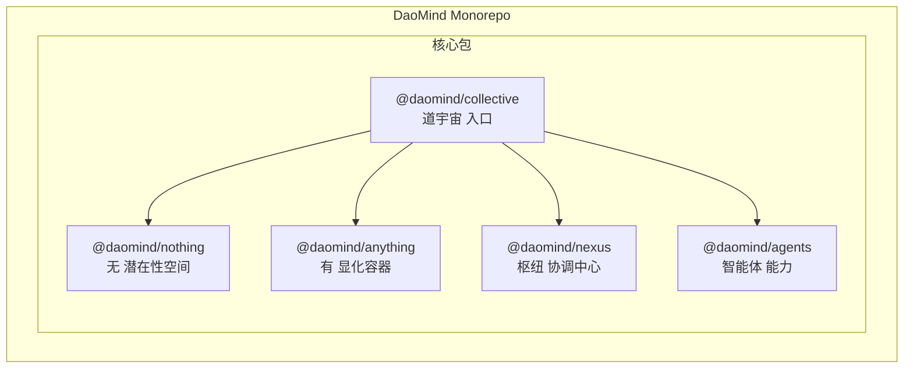
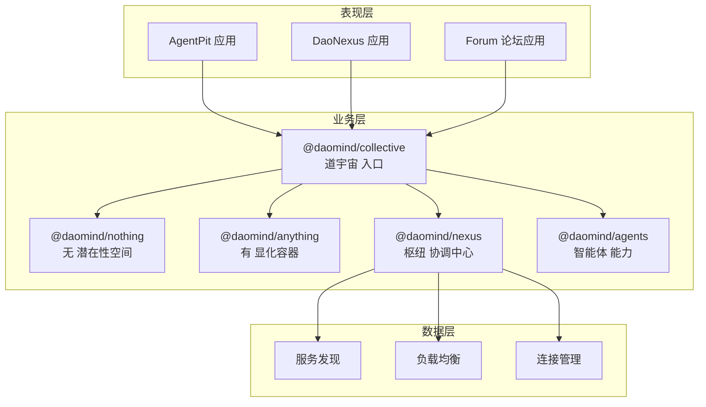
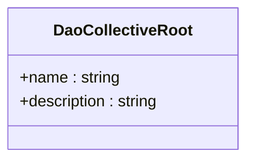
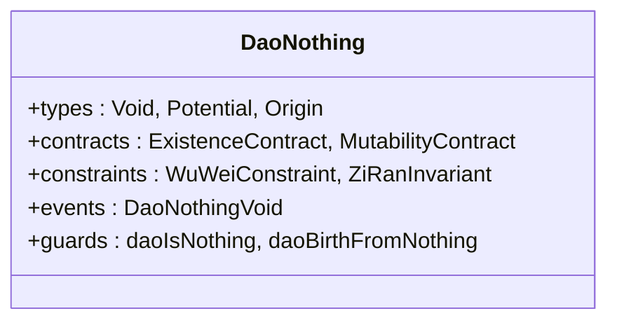
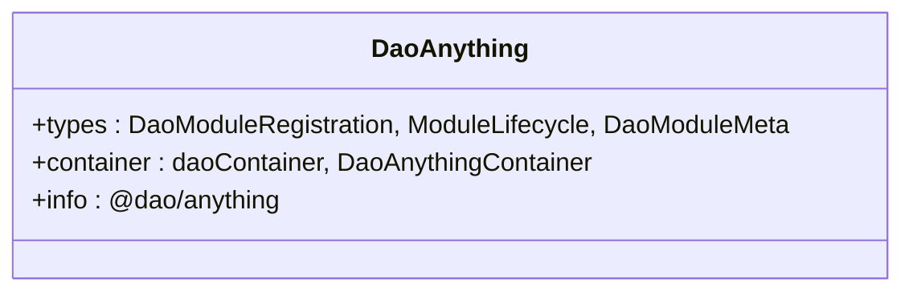
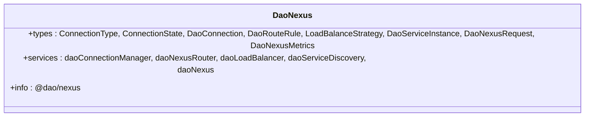
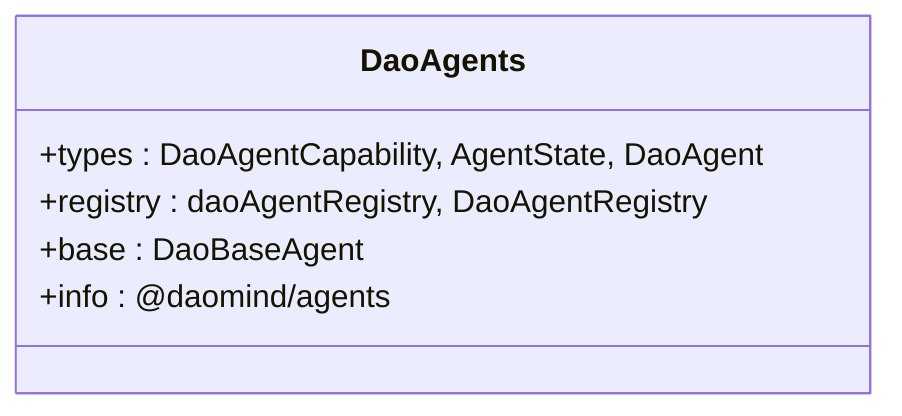
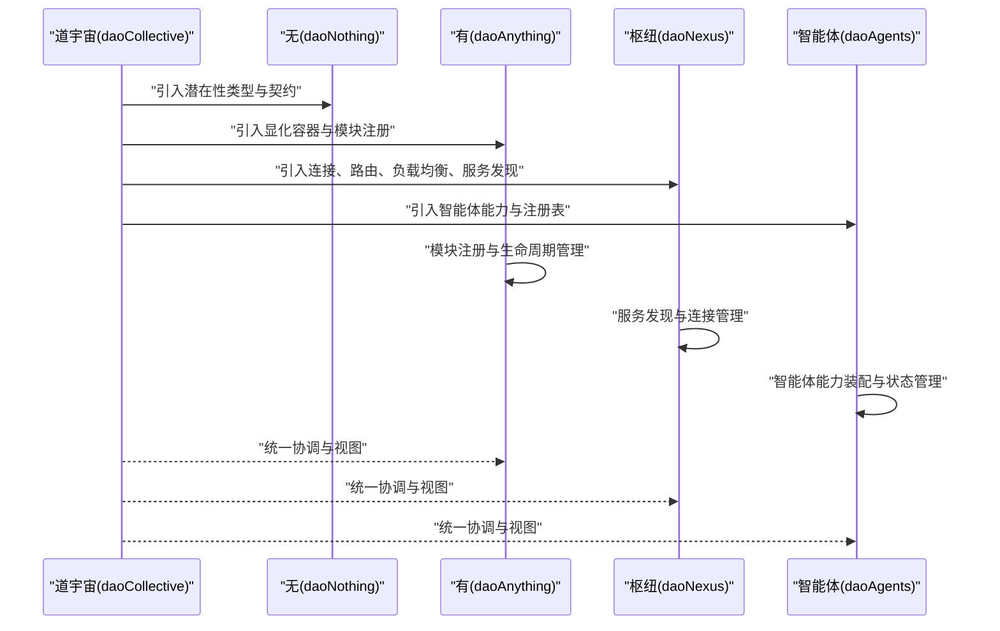
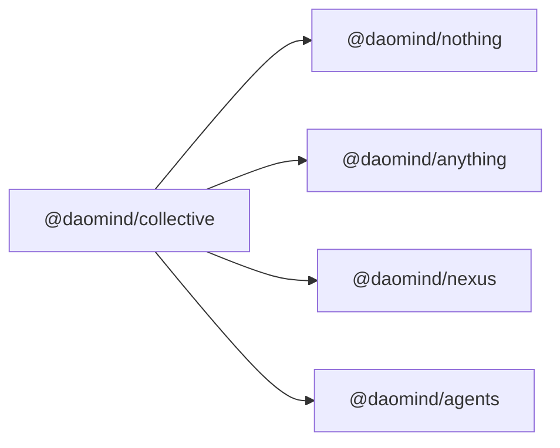

# 整体架构设计

<cite>
**本文引用的文件**
- [apps/DaoMind/packages/daoCollective/src/index.ts](file://apps/DaoMind/packages/daoCollective/src/index.ts)
- [apps/DaoMind/packages/daoNothing/src/index.ts](file://apps/DaoMind/packages/daoNothing/src/index.ts)
- [apps/DaoMind/packages/daoAnything/src/index.ts](file://apps/DaoMind/packages/daoAnything/src/index.ts)
- [apps/DaoMind/packages/daoNexus/src/index.ts](file://apps/DaoMind/packages/daoNexus/src/index.ts)
- [apps/DaoMind/packages/daoAgents/src/index.ts](file://apps/DaoMind/packages/daoAgents/src/index.ts)
- [apps/DaoMind/package.json](file://apps/DaoMind/package.json)
- [apps/DaoMind/packages/daoCollective/package.json](file://apps/DaoMind/packages/daoCollective/package.json)
- [apps/DaoMind/packages/daoNothing/package.json](file://apps/DaoMind/packages/daoNothing/package.json)
- [apps/DaoMind/packages/daoAnything/package.json](file://apps/DaoMind/packages/daoAnything/package.json)
- [apps/DaoMind/packages/daoNexus/package.json](file://apps/DaoMind/packages/daoNexus/package.json)
- [apps/DaoMind/packages/daoAgents/package.json](file://apps/DaoMind/packages/daoAgents/package.json)
</cite>

## 目录
1. [引言](#引言)
2. [项目结构](#项目结构)
3. [核心组件](#核心组件)
4. [架构总览](#架构总览)
5. [详细组件分析](#详细组件分析)
6. [依赖分析](#依赖分析)
7. [性能考虑](#性能考虑)
8. [故障排查指南](#故障排查指南)
9. [结论](#结论)
10. [附录](#附录)

## 引言
本架构设计文档面向 DAO Collective 项目，围绕“道家哲学”思想构建系统架构，提出三大核心概念：
- 道宇宙（daoCollective）：系统根节点与整体架构入口，承载全局治理与统一视图。
- 无（daoNothing）：潜在性空间，定义一切可能性的类型、契约与约束，不直接产生运行时实例。
- 有（daoAnything）：显化容器，承载模块注册、生命周期与运行时装配。

同时，系统采用微服务化与模块化理念，通过去中心化的协调机制（Nexus）实现连接、路由、负载均衡与服务发现；并以分层架构（表现层、业务层、数据层）明确职责边界，确保可扩展性与可维护性。

## 项目结构
项目采用 monorepo 结构，核心包位于 apps/DaoMind/packages 下，围绕“道”思想进行模块化组织：
- daoCollective：系统根节点与入口
- daoNothing：潜在性空间（类型、契约、约束）
- daoAnything：显化容器（模块注册、生命周期、容器）
- daoNexus：枢纽协调（连接、路由、负载均衡、服务发现）
- daoAgents：智能体能力与注册表

图表来源
- [apps/DaoMind/packages/daoCollective/src/index.ts:1-5](file://apps/DaoMind/packages/daoCollective/src/index.ts#L1-L5)
- [apps/DaoMind/packages/daoNothing/src/index.ts:1-13](file://apps/DaoMind/packages/daoNothing/src/index.ts#L1-L13)
- [apps/DaoMind/packages/daoAnything/src/index.ts:1-13](file://apps/DaoMind/packages/daoAnything/src/index.ts#L1-L13)
- [apps/DaoMind/packages/daoNexus/src/index.ts:1-27](file://apps/DaoMind/packages/daoNexus/src/index.ts#L1-L27)
- [apps/DaoMind/packages/daoAgents/src/index.ts:1-9](file://apps/DaoMind/packages/daoAgents/src/index.ts#L1-L9)

章节来源
- [apps/DaoMind/package.json:1-1](file://apps/DaoMind/package.json#L1-L1)
- [apps/DaoMind/packages/daoCollective/package.json:1-1](file://apps/DaoMind/packages/daoCollective/package.json#L1-L1)
- [apps/DaoMind/packages/daoNothing/package.json:1-1](file://apps/DaoMind/packages/daoNothing/package.json#L1-L1)
- [apps/DaoMind/packages/daoAnything/package.json:1-1](file://apps/DaoMind/packages/daoAnything/package.json#L1-L1)
- [apps/DaoMind/packages/daoNexus/package.json:1-1](file://apps/DaoMind/packages/daoNexus/package.json#L1-L1)
- [apps/DaoMind/packages/daoAgents/package.json:1-1](file://apps/DaoMind/packages/daoAgents/package.json#L1-L1)

## 核心组件
- 道宇宙（daoCollective）
  - 角色：系统根节点与整体架构入口
  - 职责：统一命名、描述与对外暴露的根对象
  - 关键点：作为其他模块的聚合入口，承担全局治理与视图统一
- 无（daoNothing）
  - 角色：潜在性空间
  - 职责：导出类型、契约与约束，定义一切可能但不实现具体行为
  - 关键点：纯类型与守卫函数，确保“无为而治”的抽象边界
- 有（daoAnything）
  - 角色：显化容器
  - 职责：模块注册、生命周期管理、容器装配
  - 关键点：通过容器与注册表实现模块化装配与运行时调度
- 枢纽（daoNexus）
  - 角色：协调中心
  - 职责：连接管理、路由规则、负载均衡、服务发现与指标度量
  - 关键点：提供去中心化协调与统一的内外贯通能力
- 智能体（daoAgents）
  - 角色：自主行动实体
  - 职责：能力建模、状态管理、注册与基类抽象
  - 关键点：通过注册表与基类实现可插拔的智能体能力体系

章节来源
- [apps/DaoMind/packages/daoCollective/src/index.ts:1-5](file://apps/DaoMind/packages/daoCollective/src/index.ts#L1-L5)
- [apps/DaoMind/packages/daoNothing/src/index.ts:1-13](file://apps/DaoMind/packages/daoNothing/src/index.ts#L1-L13)
- [apps/DaoMind/packages/daoAnything/src/index.ts:1-13](file://apps/DaoMind/packages/daoAnything/src/index.ts#L1-L13)
- [apps/DaoMind/packages/daoNexus/src/index.ts:1-27](file://apps/DaoMind/packages/daoNexus/src/index.ts#L1-L27)
- [apps/DaoMind/packages/daoAgents/src/index.ts:1-9](file://apps/DaoMind/packages/daoAgents/src/index.ts#L1-L9)

## 架构总览
系统采用“道—无—有”三层哲学架构，并结合微服务与模块化设计：
- 表现层：各应用（如 AgentPit、DaoNexus、Forum 等）负责用户界面与交互
- 业务层：daoCollective 作为根节点，协调 daoNothing、daoAnything、daoNexus、daoAgents 的协作
- 数据层：通过 daoNexus 的服务发现与连接管理，实现跨服务的数据与状态协同

图表来源
- [apps/DaoMind/packages/daoCollective/src/index.ts:1-5](file://apps/DaoMind/packages/daoCollective/src/index.ts#L1-L5)
- [apps/DaoMind/packages/daoNothing/src/index.ts:1-13](file://apps/DaoMind/packages/daoNothing/src/index.ts#L1-L13)
- [apps/DaoMind/packages/daoAnything/src/index.ts:1-13](file://apps/DaoMind/packages/daoAnything/src/index.ts#L1-L13)
- [apps/DaoMind/packages/daoNexus/src/index.ts:1-27](file://apps/DaoMind/packages/daoNexus/src/index.ts#L1-L27)
- [apps/DaoMind/packages/daoAgents/src/index.ts:1-9](file://apps/DaoMind/packages/daoAgents/src/index.ts#L1-L9)

## 详细组件分析

### 组件 A：道宇宙（daoCollective）
- 设计要点
  - 作为系统根节点，统一对外暴露名称与描述
  - 与其他核心包形成聚合关系，承担全局治理职责
- 接口与职责
  - 对外提供统一标识与描述信息
  - 作为其他模块的协调入口

图表来源
- [apps/DaoMind/packages/daoCollective/src/index.ts:1-5](file://apps/DaoMind/packages/daoCollective/src/index.ts#L1-L5)

章节来源
- [apps/DaoMind/packages/daoCollective/src/index.ts:1-5](file://apps/DaoMind/packages/daoCollective/src/index.ts#L1-L5)

### 组件 B：无（daoNothing）
- 设计要点
  - 导出类型、契约与约束，定义潜在性空间
  - 提供守卫函数与事件模型，确保“无为而治”的抽象边界
- 接口与职责
  - 类型导出：Void、Potential、Origin 等
  - 契约导出：ExistenceContract、MutabilityContract 等
  - 约束导出：WuWeiConstraint、ZiRanInvariant 等
  - 守卫与事件：daoIsNothing、daoBirthFromNothing、DaoNothingVoid 等

图表来源
- [apps/DaoMind/packages/daoNothing/src/index.ts:1-13](file://apps/DaoMind/packages/daoNothing/src/index.ts#L1-L13)

章节来源
- [apps/DaoMind/packages/daoNothing/src/index.ts:1-13](file://apps/DaoMind/packages/daoNothing/src/index.ts#L1-L13)

### 组件 C：有（daoAnything）
- 设计要点
  - 作为显化容器，承载模块注册与生命周期
  - 提供容器与类型导出，实现模块化装配
- 接口与职责
  - 类型导出：DaoModuleRegistration、ModuleLifecycle、DaoModuleMeta
  - 容器导出：daoContainer、DaoAnythingContainer
  - 描述信息：@dao/anything 的名称与描述

图表来源
- [apps/DaoMind/packages/daoAnything/src/index.ts:1-13](file://apps/DaoMind/packages/daoAnything/src/index.ts#L1-L13)

章节来源
- [apps/DaoMind/packages/daoAnything/src/index.ts:1-13](file://apps/DaoMind/packages/daoAnything/src/index.ts#L1-L13)

### 组件 D：枢纽（daoNexus）
- 设计要点
  - 聚合连接管理、路由、负载均衡与服务发现
  - 提供统一的协调能力与指标度量
- 接口与职责
  - 类型导出：ConnectionType、ConnectionState、DaoConnection、DaoRouteRule、LoadBalanceStrategy、DaoServiceInstance、DaoNexusRequest、DaoNexusMetrics
  - 实例导出：daoConnectionManager、daoNexusRouter、daoLoadBalancer、daoServiceDiscovery、daoNexus
  - 描述信息：@dao/nexus 的名称与描述

图表来源
- [apps/DaoMind/packages/daoNexus/src/index.ts:1-27](file://apps/DaoMind/packages/daoNexus/src/index.ts#L1-L27)

章节来源
- [apps/DaoMind/packages/daoNexus/src/index.ts:1-27](file://apps/DaoMind/packages/daoNexus/src/index.ts#L1-L27)

### 组件 E：智能体（daoAgents）
- 设计要点
  - 提供智能体能力建模与注册表
  - 通过基类实现可插拔的智能体能力体系
- 接口与职责
  - 类型导出：DaoAgentCapability、AgentState、DaoAgent
  - 注册表导出：daoAgentRegistry、DaoAgentRegistry
  - 基类导出：DaoBaseAgent
  - 描述信息：@daomind/agents 的名称与描述

图表来源
- [apps/DaoMind/packages/daoAgents/src/index.ts:1-9](file://apps/DaoMind/packages/daoAgents/src/index.ts#L1-L9)

章节来源
- [apps/DaoMind/packages/daoAgents/src/index.ts:1-9](file://apps/DaoMind/packages/daoAgents/src/index.ts#L1-L9)

### 组件交互序列：模块装配与运行
该序列展示从“无”到“有”，再到“枢纽”与“智能体”的装配与运行流程。

图表来源
- [apps/DaoMind/packages/daoCollective/src/index.ts:1-5](file://apps/DaoMind/packages/daoCollective/src/index.ts#L1-L5)
- [apps/DaoMind/packages/daoNothing/src/index.ts:1-13](file://apps/DaoMind/packages/daoNothing/src/index.ts#L1-L13)
- [apps/DaoMind/packages/daoAnything/src/index.ts:1-13](file://apps/DaoMind/packages/daoAnything/src/index.ts#L1-L13)
- [apps/DaoMind/packages/daoNexus/src/index.ts:1-27](file://apps/DaoMind/packages/daoNexus/src/index.ts#L1-L27)
- [apps/DaoMind/packages/daoAgents/src/index.ts:1-9](file://apps/DaoMind/packages/daoAgents/src/index.ts#L1-L9)

## 依赖分析
- 组件耦合与内聚
  - daoCollective 作为根节点，对其他核心包存在聚合依赖，但保持高内聚与低耦合
  - daoNothing 专注于潜在性抽象，不直接依赖运行时实现
  - daoAnything 通过容器与注册表实现模块化装配，降低跨模块耦合
  - daoNexus 提供去中心化协调能力，减少集中式控制点
  - daoAgents 通过注册表与基类实现可插拔能力，提升内聚性
- 外部依赖与集成点
  - 各应用（AgentPit、DaoNexus、Forum 等）通过 daoCollective 进行统一协调
  - daoNexus 作为集成点，向上对接业务层，向下对接数据层的服务发现与连接管理
- 循环依赖风险
  - 当前结构通过“无—有—枢纽—智能体”的单向依赖避免循环依赖
  - daoCollective 作为聚合入口，不直接依赖具体实现，降低循环风险

图表来源
- [apps/DaoMind/packages/daoCollective/src/index.ts:1-5](file://apps/DaoMind/packages/daoCollective/src/index.ts#L1-L5)
- [apps/DaoMind/packages/daoNothing/src/index.ts:1-13](file://apps/DaoMind/packages/daoNothing/src/index.ts#L1-L13)
- [apps/DaoMind/packages/daoAnything/src/index.ts:1-13](file://apps/DaoMind/packages/daoAnything/src/index.ts#L1-L13)
- [apps/DaoMind/packages/daoNexus/src/index.ts:1-27](file://apps/DaoMind/packages/daoNexus/src/index.ts#L1-L27)
- [apps/DaoMind/packages/daoAgents/src/index.ts:1-9](file://apps/DaoMind/packages/daoAgents/src/index.ts#L1-L9)

章节来源
- [apps/DaoMind/packages/daoCollective/src/index.ts:1-5](file://apps/DaoMind/packages/daoCollective/src/index.ts#L1-L5)
- [apps/DaoMind/packages/daoNothing/src/index.ts:1-13](file://apps/DaoMind/packages/daoNothing/src/index.ts#L1-L13)
- [apps/DaoMind/packages/daoAnything/src/index.ts:1-13](file://apps/DaoMind/packages/daoAnything/src/index.ts#L1-L13)
- [apps/DaoMind/packages/daoNexus/src/index.ts:1-27](file://apps/DaoMind/packages/daoNexus/src/index.ts#L1-L27)
- [apps/DaoMind/packages/daoAgents/src/index.ts:1-9](file://apps/DaoMind/packages/daoAgents/src/index.ts#L1-L9)

## 性能考虑
- 模块化与按需加载
  - 通过 daoAnything 的容器与注册表实现模块化装配，支持按需加载与延迟初始化
- 去中心化协调
  - daoNexus 的服务发现与负载均衡减少集中式瓶颈，提升整体吞吐
- 抽象与约束
  - daoNothing 的契约与约束确保行为一致性，降低运行时错误与回退成本
- 可观测性
  - daoNexus 的指标度量与连接管理为性能监控与问题定位提供基础

## 故障排查指南
- 潜在性空间问题
  - 若出现类型或契约相关错误，优先检查 daoNothing 的类型导出与守卫函数
- 显化容器问题
  - 若模块注册或生命周期异常，检查 daoAnything 的容器与注册表配置
- 协调中心问题
  - 若连接、路由或负载均衡异常，检查 daoNexus 的连接管理与服务发现
- 智能体问题
  - 若智能体能力未生效或状态异常，检查 daoAgents 的注册表与基类实现

章节来源
- [apps/DaoMind/packages/daoNothing/src/index.ts:1-13](file://apps/DaoMind/packages/daoNothing/src/index.ts#L1-L13)
- [apps/DaoMind/packages/daoAnything/src/index.ts:1-13](file://apps/DaoMind/packages/daoAnything/src/index.ts#L1-L13)
- [apps/DaoMind/packages/daoNexus/src/index.ts:1-27](file://apps/DaoMind/packages/daoNexus/src/index.ts#L1-L27)
- [apps/DaoMind/packages/daoAgents/src/index.ts:1-9](file://apps/DaoMind/packages/daoAgents/src/index.ts#L1-L9)

## 结论
DAO Collective 项目以“道家哲学”为指导，构建了“道—无—有”的分层架构，并通过 daoCollective 作为根节点、daoNothing 作为潜在性抽象、daoAnything 作为显化容器、daoNexus 作为去中心化协调中心、daoAgents 作为智能体能力体系，实现了高内聚、低耦合、可扩展且可维护的整体系统设计。该架构既满足现代微服务与模块化需求，又体现了“无为而治”的哲学智慧。

## 附录
- 分层架构说明
  - 表现层：各应用负责用户交互与界面展示
  - 业务层：核心包负责领域逻辑与模块协调
  - 数据层：通过 daoNexus 的服务发现与连接管理实现跨服务协同
- 架构决策的技术考量
  - 以类型与契约驱动的抽象层（daoNothing）确保一致性与可演进性
  - 以容器与注册表为核心的装配层（daoAnything）提升模块化程度
  - 以去中心化协调为核心的运行层（daoNexus）增强弹性与可扩展性
- 性能优化策略
  - 模块化装配与按需加载
  - 去中心化协调与负载均衡
  - 抽象约束与可观测性指标
- 可扩展性设计
  - 通过 daoAgents 的可插拔能力与 daoAnything 的容器机制，支持新模块快速接入
  - 通过 daoNexus 的服务发现与连接管理，支持动态扩缩容与多实例部署