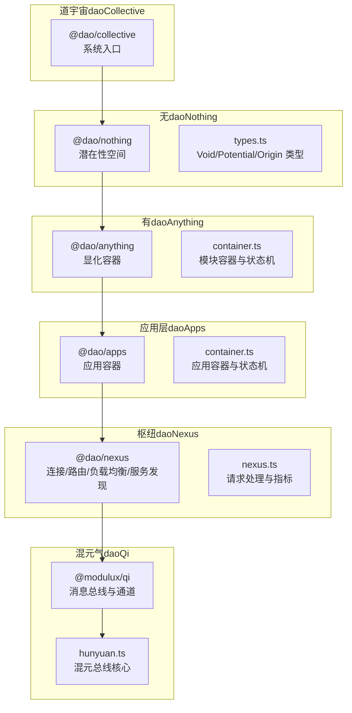
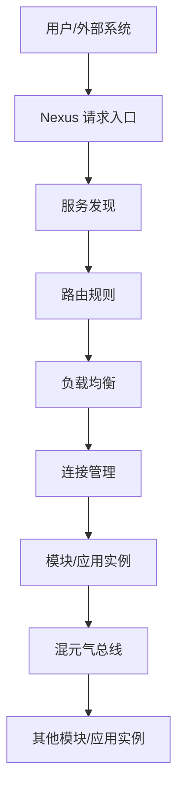
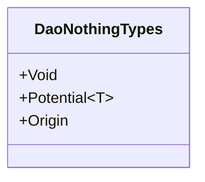
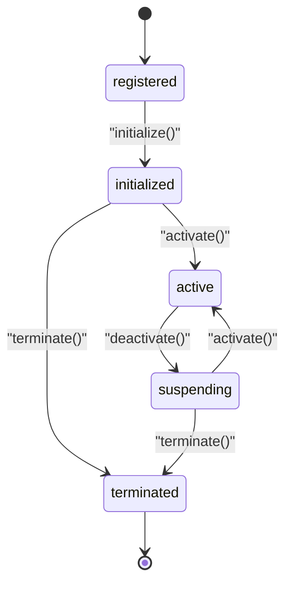
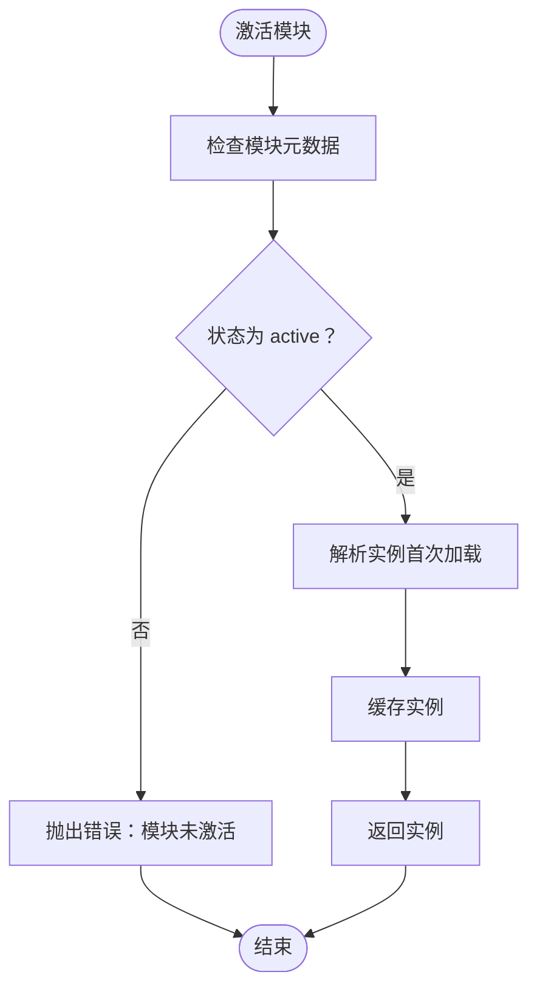
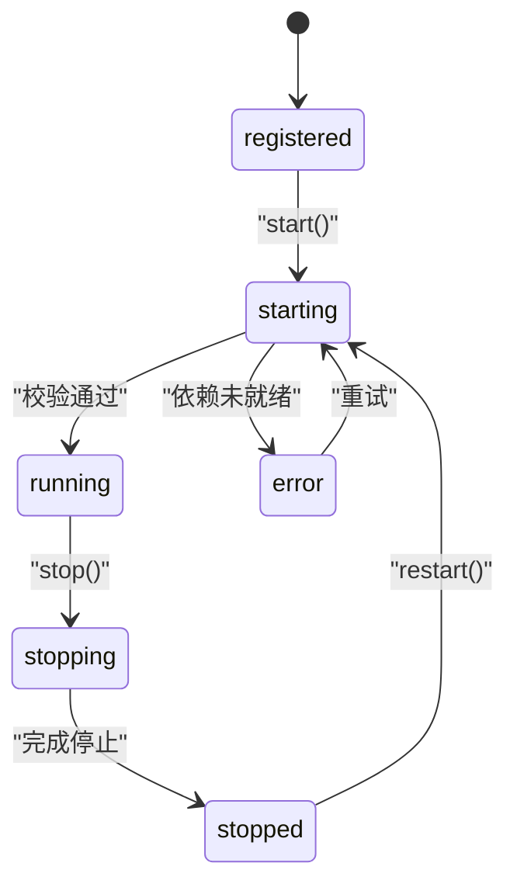
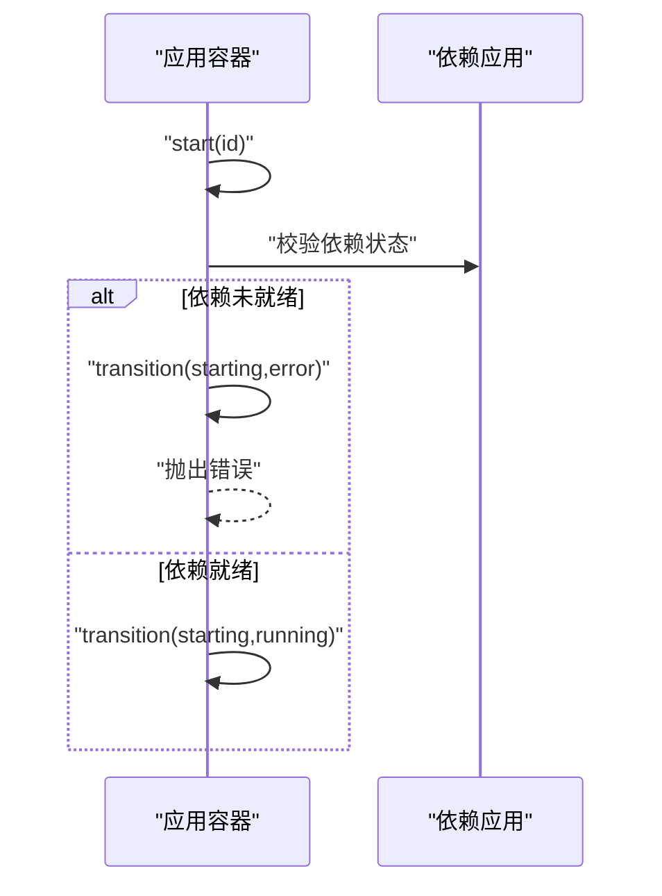
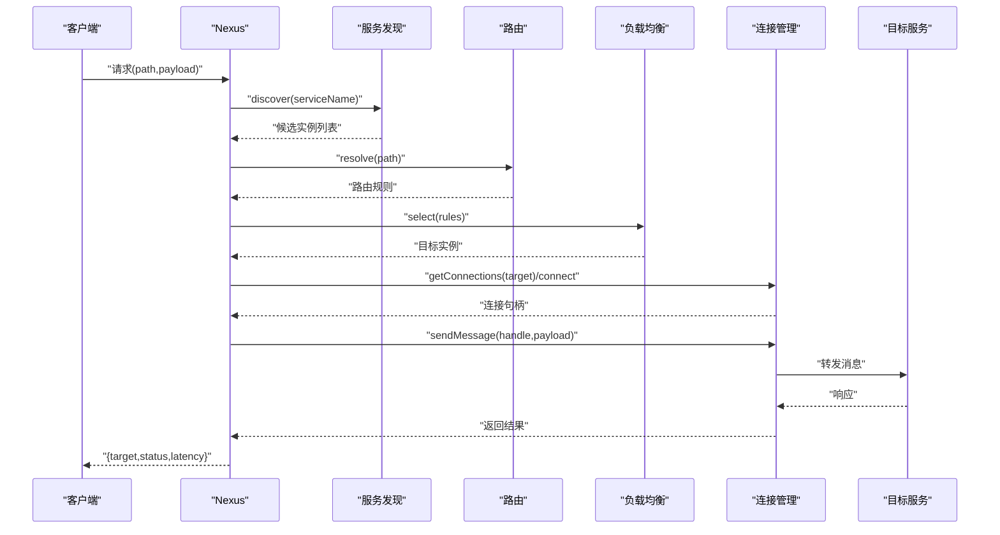
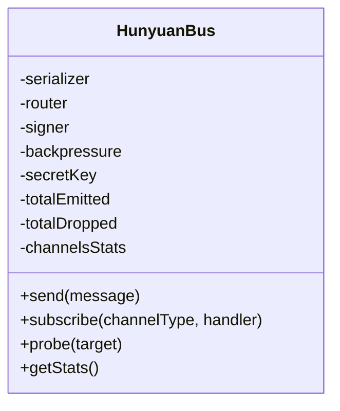
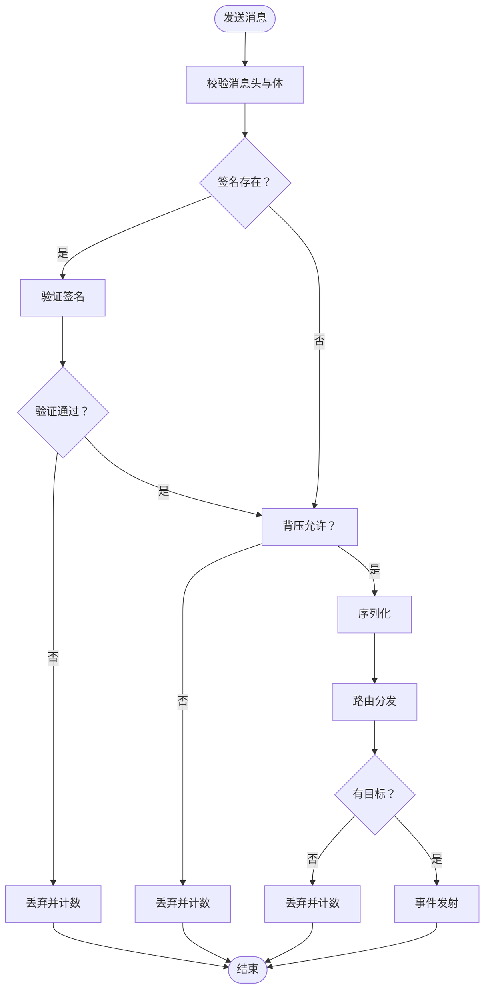

# 架构设计

<cite>
**本文引用的文件**
- [apps/DaoMind/packages/daoCollective/src/index.ts](file://apps/DaoMind/packages/daoCollective/src/index.ts)
- [apps/DaoMind/packages/daoNothing/src/index.ts](file://apps/DaoMind/packages/daoNothing/src/index.ts)
- [apps/DaoMind/packages/daoNothing/src/types.ts](file://apps/DaoMind/packages/daoNothing/src/types.ts)
- [apps/DaoMind/packages/daoAnything/src/index.ts](file://apps/DaoMind/packages/daoAnything/src/index.ts)
- [apps/DaoMind/packages/daoAnything/src/container.ts](file://apps/DaoMind/packages/daoAnything/src/container.ts)
- [apps/DaoMind/packages/daoApps/src/index.ts](file://apps/DaoMind/packages/daoApps/src/index.ts)
- [apps/DaoMind/packages/daoApps/src/container.ts](file://apps/DaoMind/packages/daoApps/src/container.ts)
- [apps/DaoMind/packages/daoNexus/src/index.ts](file://apps/DaoMind/packages/daoNexus/src/index.ts)
- [apps/DaoMind/packages/daoNexus/src/nexus.ts](file://apps/DaoMind/packages/daoNexus/src/nexus.ts)
- [apps/DaoMind/packages/daoQi/src/index.ts](file://apps/DaoMind/packages/daoQi/src/index.ts)
- [apps/DaoMind/packages/daoQi/src/hunyuan.ts](file://apps/DaoMind/packages/daoQi/src/hunyuan.ts)
- [apps/DaoMind/packages/daoCollective/package.json](file://apps/DaoMind/packages/daoCollective/package.json)
- [apps/DaoMind/packages/daoNothing/package.json](file://apps/DaoMind/packages/daoNothing/package.json)
- [apps/DaoMind/packages/daoAnything/package.json](file://apps/DaoMind/packages/daoAnything/package.json)
- [apps/DaoMind/packages/daoApps/package.json](file://apps/DaoMind/packages/daoApps/package.json)
- [apps/DaoMind/packages/daoNexus/package.json](file://apps/DaoMind/packages/daoNexus/package.json)
- [apps/DaoMind/packages/daoQi/package.json](file://apps/DaoMind/packages/daoQi/package.json)
</cite>

## 目录
1. [引言](#引言)
2. [项目结构](#项目结构)
3. [核心组件](#核心组件)
4. [架构总览](#架构总览)
5. [详细组件分析](#详细组件分析)
6. [依赖分析](#依赖分析)
7. [性能考量](#性能考量)
8. [故障排查指南](#故障排查指南)
9. [结论](#结论)
10. [附录](#附录)

## 引言
本架构设计文档面向 DAO Collective 项目，围绕“微服务架构、模块化设计与去中心化协调”的总体原则展开，结合道家哲学对系统进行概念映射：以 daoCollective 为道宇宙总入口，daoNothing 为无（潜在性空间），daoAnything 为有（显化容器），daoApps 为应用层，daoNexus 为枢纽协调，daoQi 为混元气总线（消息与数据流传输层）。文档旨在帮助技术与非技术读者理解系统如何通过容器化状态机与消息总线实现解耦、可扩展与稳定运行，并给出系统上下文与组件分解图示。

## 项目结构
DAO Collective 采用多包（monorepo）组织方式，核心包包括：
- daoCollective：系统根入口与命名标识
- daoNothing：类型与契约层，定义潜在性与约束
- daoAnything：模块容器与生命周期管理
- daoApps：应用容器与应用生命周期管理
- daoNexus：连接、路由、负载均衡与服务发现的枢纽
- daoQi：消息编解码、签名、背压与混元总线

图表来源
- [apps/DaoMind/packages/daoCollective/src/index.ts:1-5](file://apps/DaoMind/packages/daoCollective/src/index.ts#L1-L5)
- [apps/DaoMind/packages/daoNothing/src/types.ts:1-12](file://apps/DaoMind/packages/daoNothing/src/types.ts#L1-L12)
- [apps/DaoMind/packages/daoAnything/src/container.ts:1-99](file://apps/DaoMind/packages/daoAnything/src/container.ts#L1-L99)
- [apps/DaoMind/packages/daoApps/src/container.ts:1-108](file://apps/DaoMind/packages/daoApps/src/container.ts#L1-L108)
- [apps/DaoMind/packages/daoNexus/src/nexus.ts:1-103](file://apps/DaoMind/packages/daoNexus/src/nexus.ts#L1-L103)
- [apps/DaoMind/packages/daoQi/src/hunyuan.ts:1-125](file://apps/DaoMind/packages/daoQi/src/hunyuan.ts#L1-L125)

章节来源
- [apps/DaoMind/packages/daoCollective/package.json:1-1](file://apps/DaoMind/packages/daoCollective/package.json#L1-L1)
- [apps/DaoMind/packages/daoNothing/package.json:1-1](file://apps/DaoMind/packages/daoNothing/package.json#L1-L1)
- [apps/DaoMind/packages/daoAnything/package.json:1-1](file://apps/DaoMind/packages/daoAnything/package.json#L1-L1)
- [apps/DaoMind/packages/daoApps/package.json:1-1](file://apps/DaoMind/packages/daoApps/package.json#L1-L1)
- [apps/DaoMind/packages/daoNexus/package.json:1-1](file://apps/DaoMind/packages/daoNexus/package.json#L1-L1)
- [apps/DaoMind/packages/daoQi/package.json:1-1](file://apps/DaoMind/packages/daoQi/package.json#L1-L1)

## 核心组件
- 道宇宙（daoCollective）：系统总入口与命名标识，作为顶层抽象与品牌化入口。
- 无（daoNothing）：纯类型与契约层，定义 Void/Potential/Origin 等潜在性类型，不导出运行时实例，确保“无为”与最小实现。
- 有（daoAnything）：显化容器，提供模块注册、生命周期状态机与按需解析加载，支持模块在受控状态下激活与终止。
- 应用层（daoApps）：应用容器，负责应用定义、依赖校验、启动/停止/重启与状态统计，保障应用级生命周期可控。
- 枢纽（daoNexus）：统一请求处理中枢，整合连接管理、路由解析、负载均衡与服务发现，提供指标与可观测性。
- 混元气（daoQi）：消息总线与通道体系，提供编解码、签名验证、背压控制与事件分发，支撑跨模块通信。

章节来源
- [apps/DaoMind/packages/daoCollective/src/index.ts:1-5](file://apps/DaoMind/packages/daoCollective/src/index.ts#L1-L5)
- [apps/DaoMind/packages/daoNothing/src/index.ts:1-13](file://apps/DaoMind/packages/daoNothing/src/index.ts#L1-L13)
- [apps/DaoMind/packages/daoAnything/src/index.ts:1-13](file://apps/DaoMind/packages/daoAnything/src/index.ts#L1-L13)
- [apps/DaoMind/packages/daoApps/src/index.ts:1-9](file://apps/DaoMind/packages/daoApps/src/index.ts#L1-L9)
- [apps/DaoMind/packages/daoNexus/src/index.ts:1-27](file://apps/DaoMind/packages/daoNexus/src/index.ts#L1-L27)
- [apps/DaoMind/packages/daoQi/src/index.ts:1-28](file://apps/DaoMind/packages/daoQi/src/index.ts#L1-L28)

## 架构总览
系统遵循“无生一、一生二、二生三、三生万物”的道家演化路径：
- 无（daoNothing）：抽象潜在性与契约，定义一切可能性的边界
- 有（daoAnything）：将潜在性显化为具体模块，通过容器与状态机管理生命周期
- 应用层（daoApps）：在模块之上构建具体应用，按依赖顺序与状态机驱动运行
- 枢纽（daoNexus）：对外请求进入枢纽，内部模块间通过混元气总线通信
- 混元气（daoQi）：承载消息、签名、背压与路由，形成稳定的数据流通道

图表来源
- [apps/DaoMind/packages/daoNexus/src/nexus.ts:17-66](file://apps/DaoMind/packages/daoNexus/src/nexus.ts#L17-L66)
- [apps/DaoMind/packages/daoQi/src/hunyuan.ts:45-92](file://apps/DaoMind/packages/daoQi/src/hunyuan.ts#L45-L92)

## 详细组件分析

### 无（daoNothing）：潜在性空间
- 设计原则：不导出运行时实例，仅导出类型、契约与守卫，体现“无为”与最小实现
- 关键点：Void/Potential/Origin 类型定义，作为系统潜在性的抽象上界与可能集合

图表来源
- [apps/DaoMind/packages/daoNothing/src/types.ts:4-11](file://apps/DaoMind/packages/daoNothing/src/types.ts#L4-L11)

章节来源
- [apps/DaoMind/packages/daoNothing/src/index.ts:1-13](file://apps/DaoMind/packages/daoNothing/src/index.ts#L1-L13)
- [apps/DaoMind/packages/daoNothing/src/types.ts:1-12](file://apps/DaoMind/packages/daoNothing/src/types.ts#L1-L12)

### 有（daoAnything）：显化容器与模块状态机
- 容器职责：注册模块、初始化、激活、暂停、终止；按需动态解析模块实例
- 状态机：registered → initialized → active/suspending → terminated，严格的状态转换约束
- 解析策略：首次激活时动态导入模块，默认导出或默认属性作为实例缓存

图表来源
- [apps/DaoMind/packages/daoAnything/src/container.ts:5-11](file://apps/DaoMind/packages/daoAnything/src/container.ts#L5-L11)
- [apps/DaoMind/packages/daoAnything/src/container.ts:85-94](file://apps/DaoMind/packages/daoAnything/src/container.ts#L85-L94)

图表来源
- [apps/DaoMind/packages/daoAnything/src/container.ts:68-83](file://apps/DaoMind/packages/daoAnything/src/container.ts#L68-L83)

章节来源
- [apps/DaoMind/packages/daoAnything/src/index.ts:1-13](file://apps/DaoMind/packages/daoAnything/src/index.ts#L1-L13)
- [apps/DaoMind/packages/daoAnything/src/container.ts:1-99](file://apps/DaoMind/packages/daoAnything/src/container.ts#L1-L99)

### 应用层（daoApps）：应用容器与生命周期
- 容器职责：注册应用、校验依赖、启动/停止/重启、按状态查询
- 状态机：registered → starting → running/stopping → stopped/error，错误态可回退到 starting
- 依赖约束：启动前校验依赖是否已运行，否则置为 error 并抛错

图表来源
- [apps/DaoMind/packages/daoApps/src/container.ts:3-10](file://apps/DaoMind/packages/daoApps/src/container.ts#L3-L10)
- [apps/DaoMind/packages/daoApps/src/container.ts:96-103](file://apps/DaoMind/packages/daoApps/src/container.ts#L96-L103)

图表来源
- [apps/DaoMind/packages/daoApps/src/container.ts:38-54](file://apps/DaoMind/packages/daoApps/src/container.ts#L38-L54)

章节来源
- [apps/DaoMind/packages/daoApps/src/index.ts:1-9](file://apps/DaoMind/packages/daoApps/src/index.ts#L1-L9)
- [apps/DaoMind/packages/daoApps/src/container.ts:1-108](file://apps/DaoMind/packages/daoApps/src/container.ts#L1-L108)

### 枢纽（daoNexus）：统一协调与请求处理
- 职责：接收请求、服务发现、路由解析、负载均衡、连接管理与消息发送
- 指标：总请求数、成功数、失败数、平均延迟
- 流程：根据路径解析服务名，查找候选实例，选择规则，建立或复用连接，发送消息并记录指标

图表来源
- [apps/DaoMind/packages/daoNexus/src/nexus.ts:17-66](file://apps/DaoMind/packages/daoNexus/src/nexus.ts#L17-L66)

章节来源
- [apps/DaoMind/packages/daoNexus/src/index.ts:1-27](file://apps/DaoMind/packages/daoNexus/src/index.ts#L1-L27)
- [apps/DaoMind/packages/daoNexus/src/nexus.ts:1-103](file://apps/DaoMind/packages/daoNexus/src/nexus.ts#L1-L103)

### 混元气（daoQi）：消息总线与通道
- 职责：消息校验、签名验证、背压控制、序列化、路由分发与订阅
- 通道：天、地、人、冲四类通道，支持按通道类型订阅
- 指标：发出总数、丢弃总数（含路由丢弃）、各类通道统计

图表来源
- [apps/DaoMind/packages/daoQi/src/hunyuan.ts:15-43](file://apps/DaoMind/packages/daoQi/src/hunyuan.ts#L15-L43)

图表来源
- [apps/DaoMind/packages/daoQi/src/hunyuan.ts:45-92](file://apps/DaoMind/packages/daoQi/src/hunyuan.ts#L45-L92)

章节来源
- [apps/DaoMind/packages/daoQi/src/index.ts:1-28](file://apps/DaoMind/packages/daoQi/src/index.ts#L1-L28)
- [apps/DaoMind/packages/daoQi/src/hunyuan.ts:1-125](file://apps/DaoMind/packages/daoQi/src/hunyuan.ts#L1-L125)

## 依赖分析
- 包导出与版本：各包通过独立 package.json 管理版本与导出入口，便于独立构建与发布
- 组件耦合：daoQi 作为传输层被上层模块复用；daoNexus 依赖服务发现、路由与负载均衡；daoAnything 与 daoApps 提供容器与状态机基础能力
- 外部依赖：混元总线基于 EventEmitter，具备良好的事件模型与订阅能力

图表来源
- [apps/DaoMind/packages/daoCollective/package.json:1-1](file://apps/DaoMind/packages/daoCollective/package.json#L1-L1)
- [apps/DaoMind/packages/daoNothing/package.json:1-1](file://apps/DaoMind/packages/daoNothing/package.json#L1-L1)
- [apps/DaoMind/packages/daoAnything/package.json:1-1](file://apps/DaoMind/packages/daoAnything/package.json#L1-L1)
- [apps/DaoMind/packages/daoApps/package.json:1-1](file://apps/DaoMind/packages/daoApps/package.json#L1-L1)
- [apps/DaoMind/packages/daoNexus/package.json:1-1](file://apps/DaoMind/packages/daoNexus/package.json#L1-L1)
- [apps/DaoMind/packages/daoQi/package.json:1-1](file://apps/DaoMind/packages/daoQi/package.json#L1-L1)

章节来源
- [apps/DaoMind/packages/daoCollective/package.json:1-1](file://apps/DaoMind/packages/daoCollective/package.json#L1-L1)
- [apps/DaoMind/packages/daoNothing/package.json:1-1](file://apps/DaoMind/packages/daoNothing/package.json#L1-L1)
- [apps/DaoMind/packages/daoAnything/package.json:1-1](file://apps/DaoMind/packages/daoAnything/package.json#L1-L1)
- [apps/DaoMind/packages/daoApps/package.json:1-1](file://apps/DaoMind/packages/daoApps/package.json#L1-L1)
- [apps/DaoMind/packages/daoNexus/package.json:1-1](file://apps/DaoMind/packages/daoNexus/package.json#L1-L1)
- [apps/DaoMind/packages/daoQi/package.json:1-1](file://apps/DaoMind/packages/daoQi/package.json#L1-L1)

## 性能考量
- 背压控制：混元总线内置背压策略，防止过载导致的消息积压与丢弃
- 路由与负载均衡：Nexus 的路由规则与负载均衡选择策略影响请求延迟与吞吐
- 指标监控：Nexus 提供请求总量、成功率与平均延迟，便于容量规划与性能优化
- 模块按需加载：daoAnything 在激活时才动态解析模块，降低启动成本与内存占用
- 应用依赖前置：daoApps 启动前校验依赖，减少运行期异常与重试开销

## 故障排查指南
- 模块状态非法：当状态转换不在允许集内会抛错，检查调用顺序与前置状态
- 模块未注册/未激活：激活前需先注册并初始化，否则抛出对应错误
- 应用依赖未就绪：启动应用前确保依赖应用处于 running 状态
- 消息无效或签名失败：混元总线对消息结构与签名进行校验，不符合条件将被丢弃
- 路由无目标：若路由表为空且无候选服务，请求将失败，检查服务发现与路由配置

章节来源
- [apps/DaoMind/packages/daoAnything/src/container.ts:85-94](file://apps/DaoMind/packages/daoAnything/src/container.ts#L85-L94)
- [apps/DaoMind/packages/daoApps/src/container.ts:38-54](file://apps/DaoMind/packages/daoApps/src/container.ts#L38-L54)
- [apps/DaoMind/packages/daoQi/src/hunyuan.ts:45-92](file://apps/DaoMind/packages/daoQi/src/hunyuan.ts#L45-L92)
- [apps/DaoMind/packages/daoNexus/src/nexus.ts:25-44](file://apps/DaoMind/packages/daoNexus/src/nexus.ts#L25-L44)

## 结论
DAO Collective 通过“无—有—应用—枢纽—混元气”的分层设计，实现了从潜在性到显化、从模块到应用、从请求到消息的完整闭环。该架构强调最小实现、状态机驱动与消息总线传输，既满足微服务解耦与可扩展性需求，又契合道家“无为而治”的协调理念。建议在实际部署中结合指标监控与灰度发布策略，持续优化路由与负载均衡策略，确保系统在高并发场景下的稳定性与可维护性。

## 附录
- 道家哲学映射
  - 无（daoNothing）：潜在性空间，定义一切可能但不实现任何可能
  - 有（daoAnything）：显化容器，承载模块生命周期与按需解析
  - 应用层（daoApps）：具体业务实现，按依赖与状态机运行
  - 枢纽（daoNexus）：内外贯通的统一协调中心
  - 混元气（daoQi）：模块间数据流与消息总线的传输层