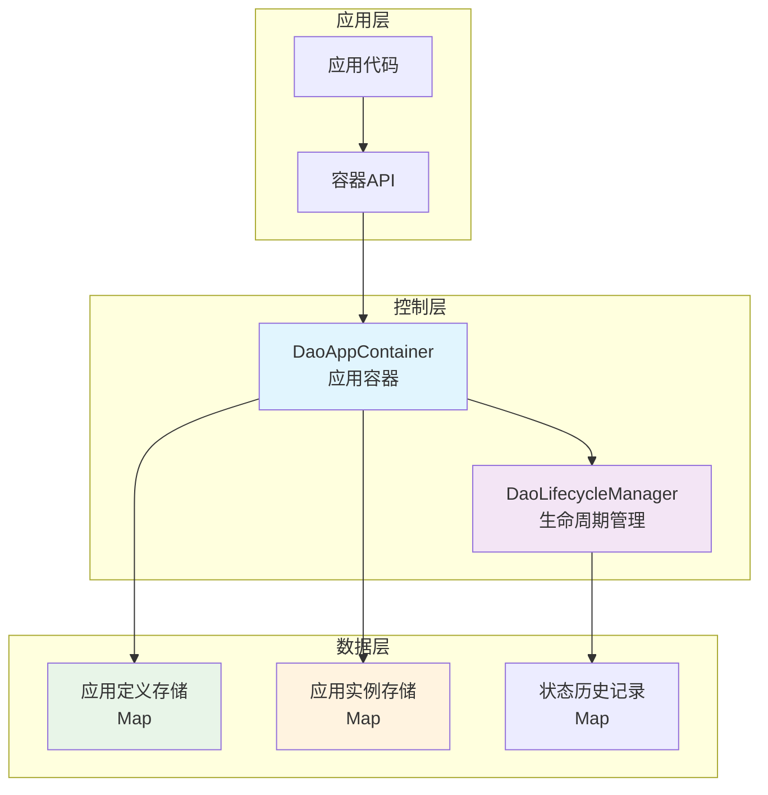
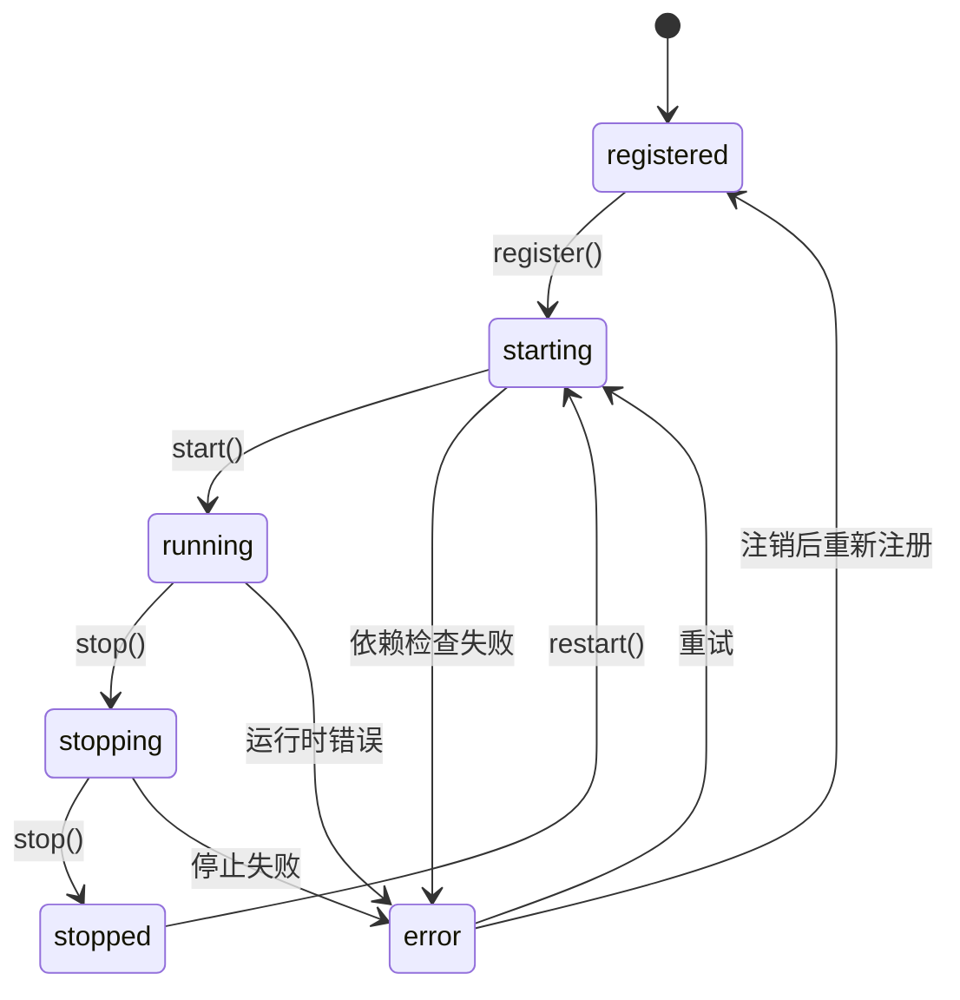
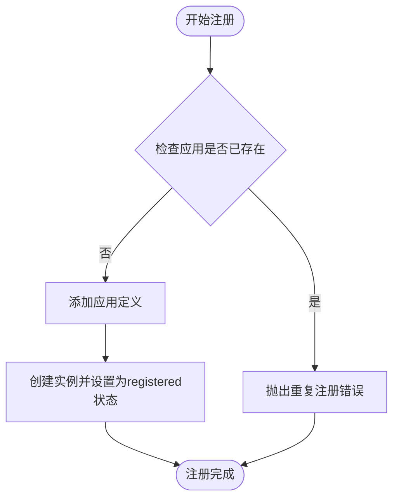
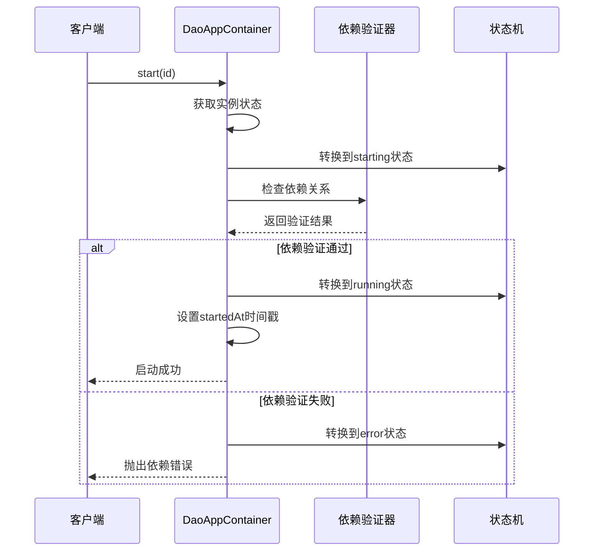
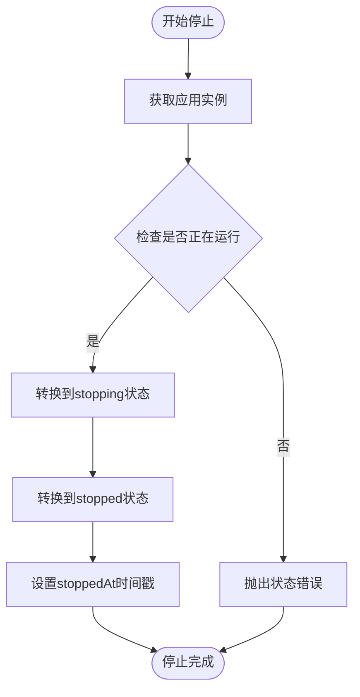
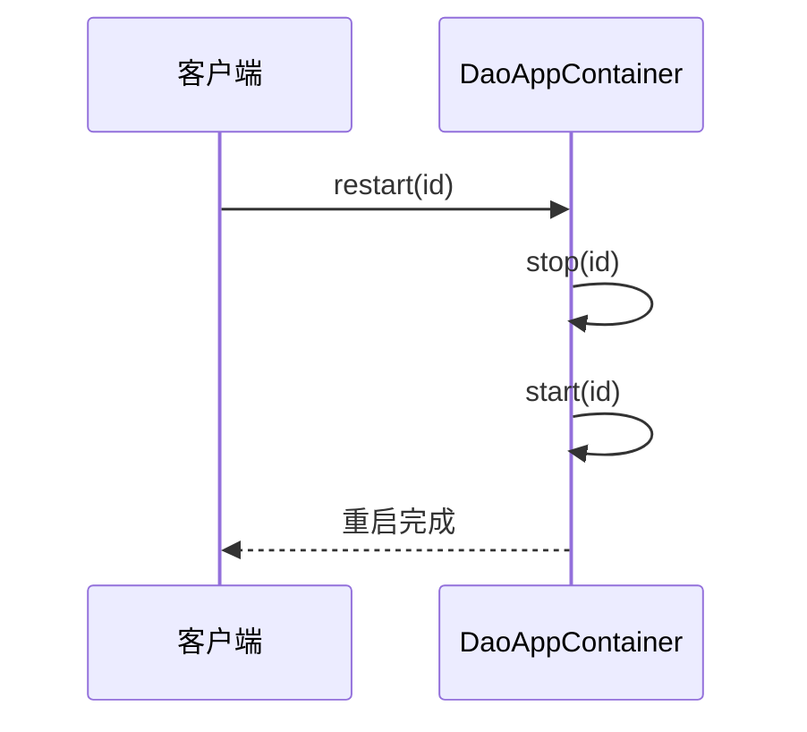
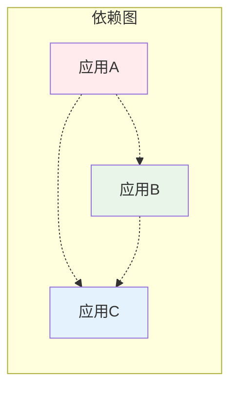
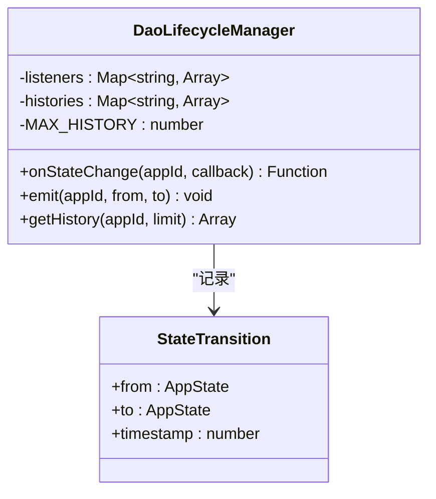
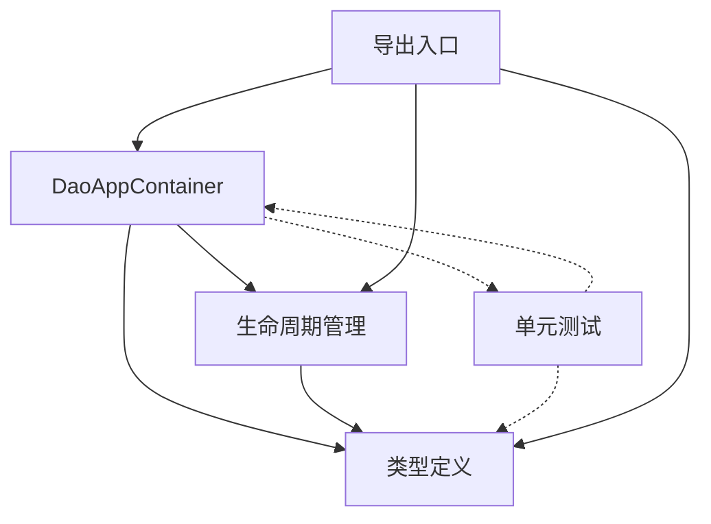

# 应用容器系统

<cite>
**本文档引用的文件**
- [container.ts](file://apps/DaoMind/packages/daoApps/src/container.ts)
- [types.ts](file://apps/DaoMind/packages/daoApps/src/types.ts)
- [lifecycle.ts](file://apps/DaoMind/packages/daoApps/src/lifecycle.ts)
- [container.test.ts](file://apps/DaoMind/packages/daoApps/src/__tests__/container.test.ts)
- [index.ts](file://apps/DaoMind/packages/daoApps/src/index.ts)
</cite>

## 目录
1. [简介](#简介)
2. [项目结构](#项目结构)
3. [核心组件](#核心组件)
4. [架构概览](#架构概览)
5. [详细组件分析](#详细组件分析)
6. [依赖分析](#依赖分析)
7. [性能考虑](#性能考虑)
8. [故障排除指南](#故障排除指南)
9. [结论](#结论)
10. [附录](#附录)

## 简介

应用容器系统是一个轻量级的应用生命周期管理系统，基于状态机模式设计，为分布式应用提供统一的注册、启动、停止和重启管理能力。该系统采用类型安全的 TypeScript 实现，提供了完整的应用生命周期控制和状态监控功能。

系统的核心设计目标是：
- 提供简单易用的应用生命周期管理接口
- 确保状态转换的合法性验证
- 支持应用间依赖关系管理
- 提供状态变更事件通知机制
- 实现高性能的状态查询和管理

## 项目结构

应用容器系统采用模块化设计，主要包含以下核心文件：

```mermaid
graph TB
subgraph "应用容器系统"
A[container.ts<br/>核心容器实现]
B[types.ts<br/>类型定义]
C[lifecycle.ts<br/>生命周期管理]
D[index.ts<br/>导出入口]
E[container.test.ts<br/>单元测试]
end
subgraph "外部依赖"
F[Map<br/>JavaScript内置]
G[Error<br/>JavaScript内置]
H[Date.now()<br/>时间戳管理]
end
A --> B
A --> C
C --> B
D --> A
D --> C
D --> B
E --> A
E --> B
E --> C
```

**图表来源**
- [container.ts:1-108](file://apps/DaoMind/packages/daoApps/src/container.ts#L1-L108)
- [types.ts:1-25](file://apps/DaoMind/packages/daoApps/src/types.ts#L1-L25)
- [lifecycle.ts:1-61](file://apps/DaoMind/packages/daoApps/src/lifecycle.ts#L1-L61)

**章节来源**
- [container.ts:1-108](file://apps/DaoMind/packages/daoApps/src/container.ts#L1-L108)
- [types.ts:1-25](file://apps/DaoMind/packages/daoApps/src/types.ts#L1-L25)
- [lifecycle.ts:1-61](file://apps/DaoMind/packages/daoApps/src/lifecycle.ts#L1-L61)

## 核心组件

### DaoAppContainer 类

DaoAppContainer 是应用容器系统的核心类，负责管理所有应用实例的生命周期。它维护两个主要的数据结构：

1. **definitions Map**: 存储应用定义信息（只读）
2. **instances Map**: 存储当前应用实例状态

该类提供了完整的 CRUD 操作和生命周期管理方法。

### AppState 状态枚举

系统定义了六种核心状态：
- `registered`: 已注册但未启动
- `starting`: 正在启动过程中
- `running`: 应用正在运行
- `stopping`: 正在停止过程中
- `stopped`: 已停止
- `error`: 发生错误

### DaoAppDefinition 和 DaoAppInstance

- **DaoAppDefinition**: 应用的静态定义信息，包含标识符、名称、版本、入口点等
- **DaoAppInstance**: 应用的动态实例状态，包含当前状态和时间戳信息

**章节来源**
- [container.ts:12-104](file://apps/DaoMind/packages/daoApps/src/container.ts#L12-L104)
- [types.ts:1-25](file://apps/DaoMind/packages/daoApps/src/types.ts#L1-L25)

## 架构概览

应用容器系统采用分层架构设计，实现了清晰的关注点分离：



**图表来源**
- [container.ts:12-104](file://apps/DaoMind/packages/daoApps/src/container.ts#L12-L104)
- [lifecycle.ts:9-57](file://apps/DaoMind/packages/daoApps/src/lifecycle.ts#L9-L57)

### 状态机设计

系统实现了严格的有限状态机（FSM）设计，确保应用状态转换的合法性：



**图表来源**
- [container.ts:3-10](file://apps/DaoMind/packages/daoApps/src/container.ts#L3-L10)

**章节来源**
- [container.ts:3-10](file://apps/DaoMind/packages/daoApps/src/container.ts#L3-L10)

## 详细组件分析

### DaoAppContainer 类详细分析

#### 数据结构设计

容器使用两个 Map 来维护应用状态：
- `definitions`: 存储应用的静态配置信息
- `instances`: 存储应用的动态运行状态

这种设计确保了数据的隔离性和访问效率。

#### 核心方法实现

##### 注册方法 (register)


**图表来源**
- [container.ts:16-25](file://apps/DaoMind/packages/daoApps/src/container.ts#L16-L25)

##### 启动方法 (start)
启动过程包含完整的依赖检查和状态转换：



**图表来源**
- [container.ts:38-61](file://apps/DaoMind/packages/daoApps/src/container.ts#L38-L61)

##### 停止方法 (stop)
停止过程确保应用能够优雅地关闭：



**图表来源**
- [container.ts:63-73](file://apps/DaoMind/packages/daoApps/src/container.ts#L63-L73)

##### 重启方法 (restart)
重启是停止和启动操作的组合：



**图表来源**
- [container.ts:75-78](file://apps/DaoMind/packages/daoApps/src/container.ts#L75-L78)

#### 依赖关系管理

系统支持应用间的依赖关系管理，通过 `dependencies` 字段指定：



**图表来源**
- [container.ts:43-52](file://apps/DaoMind/packages/daoApps/src/container.ts#L43-L52)

**章节来源**
- [container.ts:16-104](file://apps/DaoMind/packages/daoApps/src/container.ts#L16-L104)

### DaoLifecycleManager 类分析

生命周期管理器提供了状态变更事件监听和历史记录功能：

#### 事件监听机制



**图表来源**
- [lifecycle.ts:9-57](file://apps/DaoMind/packages/daoApps/src/lifecycle.ts#L9-L57)

#### 状态历史管理

生命周期管理器维护每个应用的状态历史，支持限制历史记录数量以控制内存使用。

**章节来源**
- [lifecycle.ts:9-57](file://apps/DaoMind/packages/daoApps/src/lifecycle.ts#L9-L57)

### 类型系统设计

系统使用 TypeScript 的类型系统确保编译时的安全性：

```mermaid
classDiagram
class AppState {
<<enumeration>>
"registered"
"starting"
"running"
"stopping"
"stopped"
"error"
}
class DaoAppDefinition {
+id : string
+name : string
+version : string
+entry : string
+dependencies : string[]
+config : Record~string, unknown~
}
class DaoAppInstance {
+definition : DaoAppDefinition
+state : AppState
+startedAt : number
+stoppedAt : number
+error : Error
}
DaoAppInstance --> DaoAppDefinition : "包含"
DaoAppInstance --> AppState : "使用"
```

**图表来源**
- [types.ts:1-25](file://apps/DaoMind/packages/daoApps/src/types.ts#L1-L25)

**章节来源**
- [types.ts:1-25](file://apps/DaoMind/packages/daoApps/src/types.ts#L1-L25)

## 依赖分析

### 内部依赖关系

应用容器系统内部的依赖关系相对简单，主要体现了关注点分离的设计原则：



**图表来源**
- [container.ts:1](file://apps/DaoMind/packages/daoApps/src/container.ts#L1)
- [lifecycle.ts:1](file://apps/DaoMind/packages/daoApps/src/lifecycle.ts#L1)
- [index.ts:1-9](file://apps/DaoMind/packages/daoApps/src/index.ts#L1-L9)

### 外部依赖

系统仅依赖 JavaScript 的原生特性：
- `Map`: 用于高效的数据存储和检索
- `Error`: 标准错误处理机制
- `Date.now()`: 时间戳生成

这种最小化的外部依赖确保了系统的轻量化和跨平台兼容性。

**章节来源**
- [container.ts:1-108](file://apps/DaoMind/packages/daoApps/src/container.ts#L1-L108)
- [lifecycle.ts:1-61](file://apps/DaoMind/packages/daoApps/src/lifecycle.ts#L1-L61)

## 性能考虑

### 时间复杂度分析

- **注册操作**: O(1) - 使用 Map 的常数时间插入和查找
- **启动操作**: O(n) - n 为依赖应用数量，需要逐一验证依赖状态
- **停止操作**: O(1) - 直接的状态转换和时间戳更新
- **查询操作**: O(1) - Map 的常数时间访问
- **列表操作**: O(m) - m 为实例总数，需要遍历所有实例

### 内存优化策略

1. **弱引用设计**: 使用 Map 结构避免循环引用
2. **历史记录限制**: 生命周期管理器限制历史记录数量（默认 100 条）
3. **延迟初始化**: 应用定义和实例按需创建
4. **不可变数据**: 状态转换创建新对象而非修改现有对象

### 并发安全性

系统采用同步操作设计，避免了并发访问的复杂性。对于需要异步操作的场景，建议在上层应用中实现适当的锁机制。

## 故障排除指南

### 常见错误类型

#### 应用未注册错误
当对不存在的应用执行操作时抛出：
- 错误信息：`应用未注册: {id}`
- 触发条件：访问不存在的应用 ID
- 解决方案：先调用 `register()` 方法注册应用

#### 重复注册错误
当尝试注册已存在的应用时抛出：
- 错误信息：`应用已注册: {id}`
- 触发条件：对同一 ID 重复调用 `register()`
- 解决方案：使用唯一的应用 ID 或先调用 `unregister()`

#### 运行中应用卸载错误
当尝试卸载正在运行或启动中的应用时抛出：
- 错误信息：`无法卸载运行中的应用: {id} (当前状态: {state})`
- 触发条件：应用状态为 `running` 或 `starting`
- 解决方案：先调用 `stop()` 或等待应用启动完成

#### 依赖未就绪错误
当应用依赖的其他应用未运行时抛出：
- 错误信息：`依赖未就绪: {id} 依赖 {depId} (状态: {state})`
- 触发条件：依赖应用状态不是 `running`
- 解决方案：先启动依赖的应用

#### 非法状态转换错误
当尝试进行不被允许的状态转换时抛出：
- 错误信息：`非法状态转换: {id} 从 "{from}" 到 "{to}"`
- 触发条件：违反预定义的状态转换规则
- 解决方案：按照正确的顺序执行操作

### 调试技巧

1. **状态检查**: 使用 `get()` 方法检查应用的当前状态
2. **历史追踪**: 使用 `getHistory()` 方法查看状态变更历史
3. **事件监听**: 使用 `onStateChange()` 方法监听状态变化
4. **日志记录**: 在关键操作前后记录调试信息

**章节来源**
- [container.ts:17-50](file://apps/DaoMind/packages/daoApps/src/container.ts#L17-L50)
- [container.ts:65-68](file://apps/DaoMind/packages/daoApps/src/container.ts#L65-L68)
- [lifecycle.ts:29-47](file://apps/DaoMind/packages/daoApps/src/lifecycle.ts#L29-L47)

## 结论

应用容器系统通过简洁而强大的设计，为分布式应用提供了可靠的生命周期管理能力。其核心优势包括：

1. **类型安全**: 完整的 TypeScript 类型系统确保编译时的安全性
2. **状态机设计**: 严格的有限状态机确保状态转换的合法性
3. **依赖管理**: 内置的应用间依赖关系验证机制
4. **事件驱动**: 灵活的状态变更事件监听系统
5. **性能优化**: 高效的数据结构和算法设计

该系统适用于各种规模的应用场景，从小型工具应用到复杂的微服务架构都能提供稳定的支持。通过合理的错误处理和监控机制，可以确保应用的可靠运行。

## 附录

### API 使用示例

#### 基本使用流程

```typescript
// 1. 注册应用
daoAppContainer.register({
  id: 'my-app',
  name: 'My Application',
  version: '1.0.0',
  entry: './app.js'
});

// 2. 启动应用
await daoAppContainer.start('my-app');

// 3. 监听状态变化
const unsubscribe = daoAppContainer.onStateChange('my-app', (from, to) => {
  console.log(`应用状态从 ${from} 变更为 ${to}`);
});

// 4. 停止应用
await daoAppContainer.stop('my-app');

// 5. 卸载应用
daoAppContainer.unregister('my-app');
```

#### 依赖应用示例

```typescript
// 先注册依赖应用
daoAppContainer.register({
  id: 'database',
  name: 'Database Service',
  version: '1.0.0',
  entry: './database.js'
});

// 注册主应用，声明依赖
daoAppContainer.register({
  id: 'web-server',
  name: 'Web Server',
  version: '1.0.0',
  entry: './server.js',
  dependencies: ['database']
});

// 启动依赖应用
await daoAppContainer.start('database');

// 启动主应用（会自动验证依赖）
await daoAppContainer.start('web-server');
```

#### 错误处理最佳实践

```typescript
try {
  await daoAppContainer.start('my-app');
} catch (error) {
  if (error.message.includes('依赖未就绪')) {
    // 处理依赖问题
    console.error('请先启动依赖的应用');
  } else if (error.message.includes('应用未注册')) {
    // 处理注册问题
    console.error('应用尚未注册');
  }
}
```

### 最佳实践指南

1. **应用 ID 设计**: 使用有意义且唯一的应用 ID，避免冲突
2. **依赖管理**: 明确应用间的依赖关系，按正确的顺序启动
3. **错误处理**: 始终包装异步操作，妥善处理各种异常情况
4. **资源清理**: 在应用停止时释放所有占用的资源
5. **监控告警**: 实现状态变更事件监听，及时发现和处理异常
6. **版本管理**: 为应用提供版本信息，便于升级和回滚
7. **配置管理**: 使用 `config` 字段传递应用配置，支持动态调整

### 扩展建议

1. **持久化存储**: 添加应用状态的持久化机制
2. **集群支持**: 实现多节点协调的分布式状态管理
3. **健康检查**: 添加应用健康状态的自动检测机制
4. **批量操作**: 提供应用组的批量管理功能
5. **权限控制**: 实现基于角色的应用访问控制