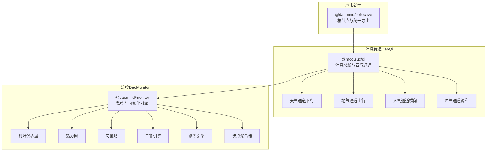
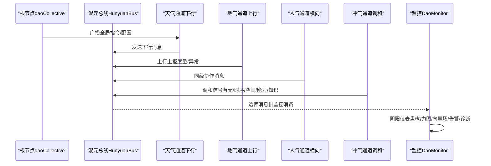
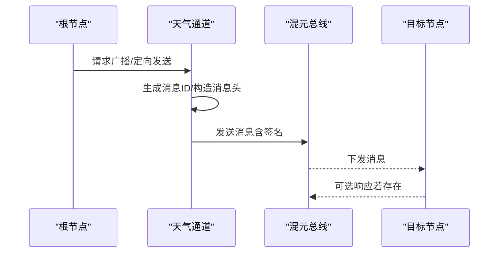
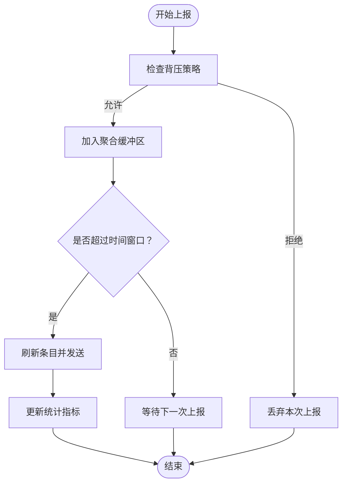
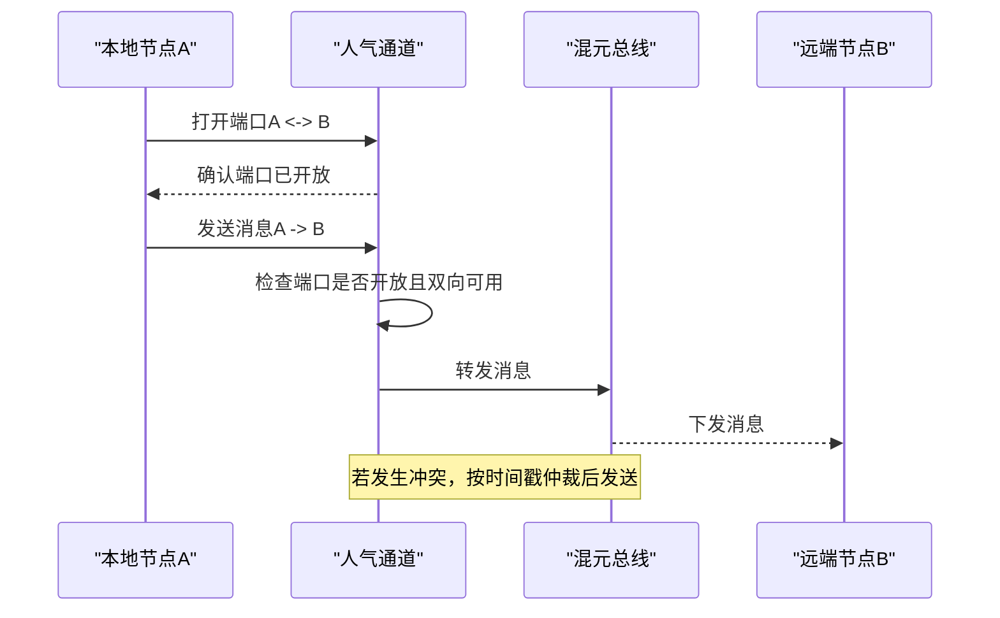
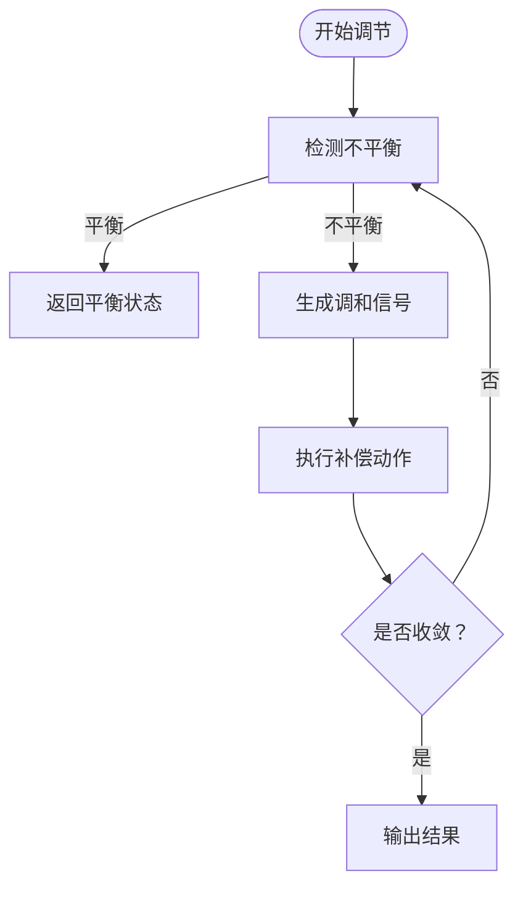
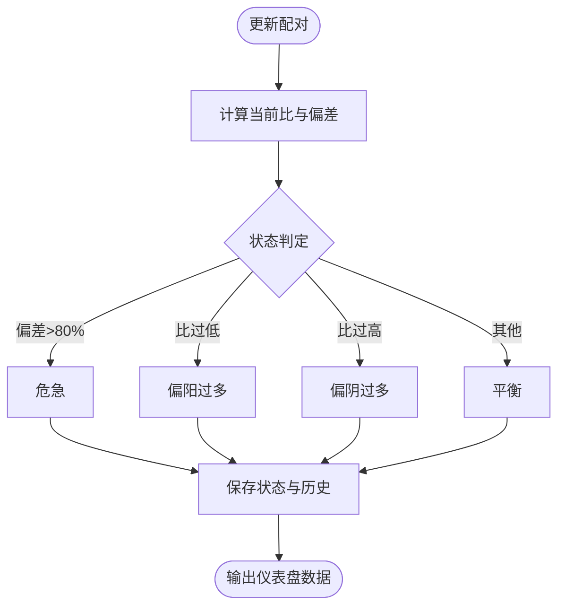
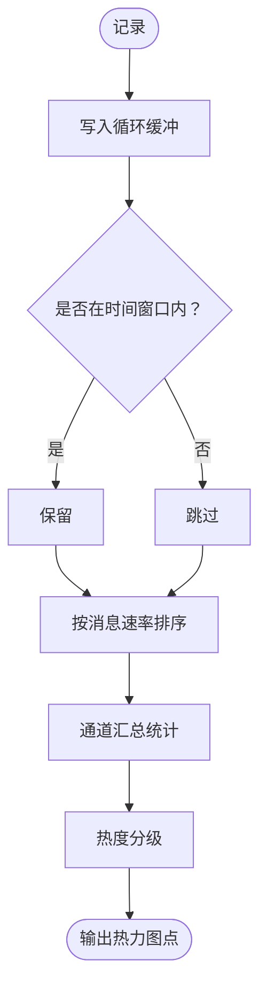
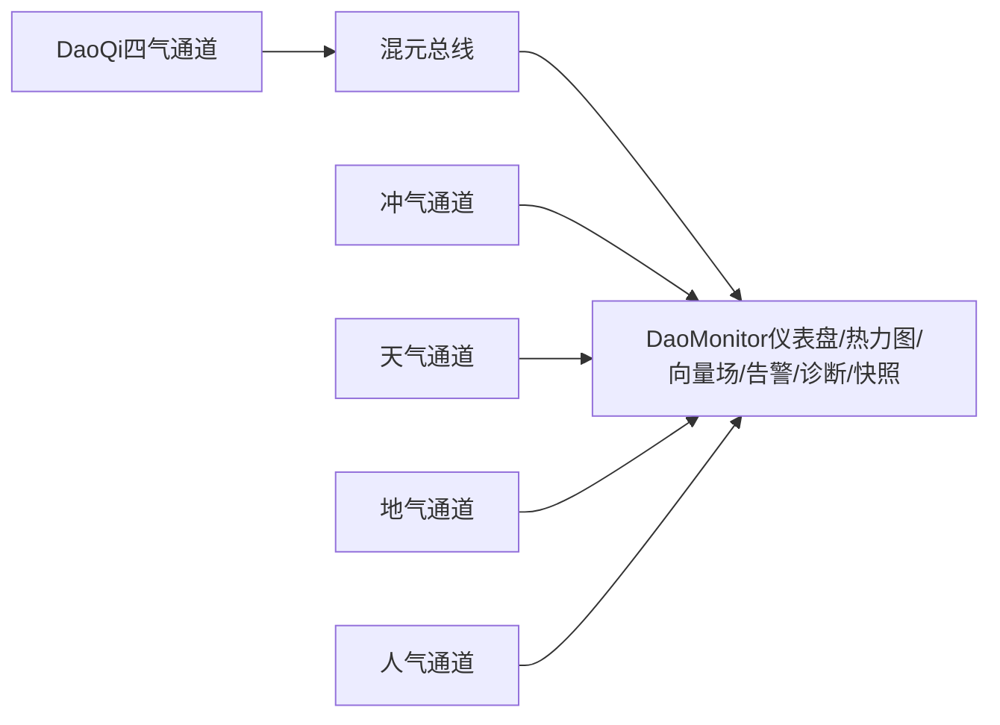

# 核心组件

<cite>
**本文引用的文件**
- [daoCollective 包：package.json](file://apps/DaoMind/packages/daoCollective/package.json)
- [daoCollective 包：src/index.ts](file://apps/DaoMind/packages/daoCollective/src/index.ts)
- [daoQi 包：package.json](file://apps/DaoMind/packages/daoQi/package.json)
- [daoQi 包：src/index.ts](file://apps/DaoMind/packages/daoQi/src/index.ts)
- [daoQi 天气通道：src/channels/tian-qi.ts](file://apps/DaoMind/packages/daoQi/src/channels/tian-qi.ts)
- [daoQi 地气通道：src/channels/di-qi.ts](file://apps/DaoMind/packages/daoQi/src/channels/di-qi.ts)
- [daoQi 人气通道：src/channels/ren-qi.ts](file://apps/DaoMind/packages/daoQi/src/channels/ren-qi.ts)
- [daoQi 冲气通道：src/channels/chong-qi.ts](file://apps/DaoMind/packages/daoQi/src/channels/chong-qi.ts)
- [daoMonitor 包：package.json](file://apps/DaoMind/packages/daoMonitor/package.json)
- [daoMonitor 包：src/index.ts](file://apps/DaoMind/packages/daoMonitor/src/index.ts)
- [daoMonitor 阴阳仪表盘：src/gauge.ts](file://apps/DaoMind/packages/daoMonitor/src/gauge.ts)
- [daoMonitor 热力图：src/heatmap.ts](file://apps/DaoMind/packages/daoMonitor/src/heatmap.ts)
- [daoMonitor 向量场：src/vector-field.ts](file://apps/DaoMind/packages/daoMonitor/src/vector-field.ts)
- [daoMonitor 告警引擎：src/alerts.ts](file://apps/DaoMind/packages/daoMonitor/src/alerts.ts)
- [daoMonitor 诊断引擎：src/diagnosis.ts](file://apps/DaoMind/packages/daoMonitor/src/diagnosis.ts)
- [daoMonitor 快照聚合器：src/snapshot.ts](file://apps/DaoMind/packages/daoMonitor/src/snapshot.ts)
</cite>

## 目录
1. [简介](#简介)
2. [项目结构](#项目结构)
3. [核心组件](#核心组件)
4. [架构总览](#架构总览)
5. [详细组件分析](#详细组件分析)
6. [依赖关系分析](#依赖关系分析)
7. [性能考虑](#性能考虑)
8. [故障排除指南](#故障排除指南)
9. [结论](#结论)
10. [附录](#附录)

## 简介
本文件聚焦 DAO Collective 的三大核心子系统：应用容器系统、消息传递系统（DaoQi）与监控系统（DaoMonitor）。其中：
- 应用容器系统以“道宇宙”为根节点，作为整体架构入口，负责统一导出与组织各子域模块。
- 消息传递系统（DaoQi）采用“四气通道”架构：天气（下行）、地气（上行）、人气（横向）、冲气（调和），形成从根到叶、从叶回流、同级协作与动态平衡的完整信息闭环。
- 监控系统（DaoMonitor）基于中医经络哲学，提供阴阳仪表盘、热力图、向量场、告警引擎与诊断引擎，实现对系统运行状态的可视化与自动化治理。

## 项目结构
本仓库采用 monorepo 结构，核心位于 apps/DaoMind/packages 下：
- daoCollective：根节点与统一导出入口
- daoQi：消息总线与四气通道
- daoMonitor：监控与可视化引擎

图表来源
- [daoCollective 包：package.json:1-1](file://apps/DaoMind/packages/daoCollective/package.json#L1-L1)
- [daoCollective 包：src/index.ts:1-5](file://apps/DaoMind/packages/daoCollective/src/index.ts#L1-L5)
- [daoQi 包：package.json:1-1](file://apps/DaoMind/packages/daoQi/package.json#L1-L1)
- [daoQi 包：src/index.ts:1-28](file://apps/DaoMind/packages/daoQi/src/index.ts#L1-L28)
- [daoMonitor 包：package.json:1-1](file://apps/DaoMind/packages/daoMonitor/package.json#L1-L1)
- [daoMonitor 包：src/index.ts:1-17](file://apps/DaoMind/packages/daoMonitor/src/index.ts#L1-L17)

章节来源
- [daoCollective 包：package.json:1-1](file://apps/DaoMind/packages/daoCollective/package.json#L1-L1)
- [daoCollective 包：src/index.ts:1-5](file://apps/DaoMind/packages/daoCollective/src/index.ts#L1-L5)
- [daoQi 包：package.json:1-1](file://apps/DaoMind/packages/daoQi/package.json#L1-L1)
- [daoQi 包：src/index.ts:1-28](file://apps/DaoMind/packages/daoQi/src/index.ts#L1-L28)
- [daoMonitor 包：package.json:1-1](file://apps/DaoMind/packages/daoMonitor/package.json#L1-L1)
- [daoMonitor 包：src/index.ts:1-17](file://apps/DaoMind/packages/daoMonitor/src/index.ts#L1-L17)

## 核心组件
- 应用容器系统（@daomind/collective）
  - 作用：作为“道宇宙”根节点，统一导出与组织各子域模块，承担整体架构入口职责。
  - 关键点：通过单一导出对象暴露名称与描述，便于上层应用统一接入。
- 消息传递系统（@modulux/qi）
  - 作用：提供模块间数据流与消息总线的传输层，支持四气通道协同工作。
  - 统一导出：消息类型、通道类型、编解码器、路由、签名、背压控制、混元总线与四气通道。
- 监控系统（@daomind/monitor）
  - 作用：基于中医经络哲学的系统监控与可视化引擎，提供多维观测与治理能力。
  - 统一导出：监控类型与各引擎类，便于按需组合使用。

章节来源
- [daoCollective 包：src/index.ts:1-5](file://apps/DaoMind/packages/daoCollective/src/index.ts#L1-L5)
- [daoQi 包：src/index.ts:1-28](file://apps/DaoMind/packages/daoQi/src/index.ts#L1-L28)
- [daoMonitor 包：src/index.ts:1-17](file://apps/DaoMind/packages/daoMonitor/src/index.ts#L1-L17)

## 架构总览
DaoQi 四气通道与 DaoMonitor 的交互关系如下：

图表来源
- [daoQi 包：src/index.ts:1-28](file://apps/DaoMind/packages/daoQi/src/index.ts#L1-L28)
- [daoQi 天气通道：src/channels/tian-qi.ts:1-105](file://apps/DaoMind/packages/daoQi/src/channels/tian-qi.ts#L1-L105)
- [daoQi 地气通道：src/channels/di-qi.ts:1-128](file://apps/DaoMind/packages/daoQi/src/channels/di-qi.ts#L1-L128)
- [daoQi 人气通道：src/channels/ren-qi.ts:1-130](file://apps/DaoMind/packages/daoQi/src/channels/ren-qi.ts#L1-L130)
- [daoQi 冲气通道：src/channels/chong-qi.ts:1-387](file://apps/DaoMind/packages/daoQi/src/channels/chong-qi.ts#L1-L387)
- [daoMonitor 包：src/index.ts:1-17](file://apps/DaoMind/packages/daoMonitor/src/index.ts#L1-L17)

## 详细组件分析

### 应用容器系统（@daomind/collective）
- 设计要点
  - 单一导出对象承载项目标识与描述，便于跨模块引用与展示。
  - 作为根节点，与其他子系统（DaoQi、DaoMonitor）通过统一入口集成。
- 使用模式
  - 在上层应用中引入该导出对象，用于初始化或注册根节点服务。
- 最佳实践
  - 将版本与描述固化，避免频繁变更；如需扩展能力，通过子包导出而非修改根节点。

章节来源
- [daoCollective 包：src/index.ts:1-5](file://apps/DaoMind/packages/daoCollective/src/index.ts#L1-L5)

### 消息传递系统（DaoQi）——四气通道架构

#### 天气通道（下行通道）
- 角色与职责
  - 承载来自根节点的全局性指令、配置变更与元数据更新，向下分发至各叶节点。
- 关键行为
  - 广播与定向发送：支持全局广播与节点定向发送，携带签名、优先级与 TTL。
  - 去重与幂等：通过消息 ID 集合避免重复发送。
  - 签名与安全：使用根密钥对消息头进行签名，确保来源可信。
- 典型流程

图表来源
- [daoQi 天气通道：src/channels/tian-qi.ts:30-95](file://apps/DaoMind/packages/daoQi/src/channels/tian-qi.ts#L30-L95)

章节来源
- [daoQi 天气通道：src/channels/tian-qi.ts:1-105](file://apps/DaoMind/packages/daoQi/src/channels/tian-qi.ts#L1-L105)

#### 地气通道（上行通道）
- 角色与职责
  - 承载叶节点的度量数据、异常报告与需求信号，向上汇聚至根节点。
- 关键行为
  - 聚合与压缩：在时间窗口内聚合多次上报，计算增量差异，降低带宽与存储压力。
  - 背压感知：在聚合前检查背压策略，避免过载。
  - 流式发送：将聚合结果封装为消息发送，记录统计指标。
- 典型流程

图表来源
- [daoQi 地气通道：src/channels/di-qi.ts:34-107](file://apps/DaoMind/packages/daoQi/src/channels/di-qi.ts#L34-L107)

章节来源
- [daoQi 地气通道：src/channels/di-qi.ts:1-128](file://apps/DaoMind/packages/daoQi/src/channels/di-qi.ts#L1-L128)

#### 人气通道（横向通道）
- 角色与职责
  - 支持同级模块间直接通信，减少中间层耦合，提升协作效率。
- 关键行为
  - 端口管理：仅允许预定义的合法配对建立双向端口。
  - 冲突仲裁：当双向冲突发生时，依据时间戳进行仲裁，保证一致性。
  - 消息封装：自动添加消息头并交由总线转发。
- 典型流程

图表来源
- [daoQi 人气通道：src/channels/ren-qi.ts:47-95](file://apps/DaoMind/packages/daoQi/src/channels/ren-qi.ts#L47-L95)

章节来源
- [daoQi 人气通道：src/channels/ren-qi.ts:1-130](file://apps/DaoMind/packages/daoQi/src/channels/ren-qi.ts#L1-L130)

#### 冲气通道（调和通道）
- 角色与职责
  - 在阴阳对偶节点之间维持动态平衡，生成调和信号并执行补偿动作，防止系统失衡。
- 关键行为
  - 阴阳配对：内置多组默认配对（如“有无/一切”、“时间/离散”、“空间/主体”、“能力/枢纽”、“文档/应用”）。
  - 不平衡检测：根据理想比与阈值计算偏差与方向。
  - 信号生成：依据偏差与敏感度生成补偿动作（补/泻/不动），并设置紧急度与 TTL。
  - 迭代收敛：支持多次迭代收敛，避免振荡，记录调整历史与快照。
- 典型流程

图表来源
- [daoQi 冲气通道：src/channels/chong-qi.ts:111-155](file://apps/DaoMind/packages/daoQi/src/channels/chong-qi.ts#L111-L155)

章节来源
- [daoQi 冲气通道：src/channels/chong-qi.ts:1-387](file://apps/DaoMind/packages/daoQi/src/channels/chong-qi.ts#L1-L387)

### 监控系统（DaoMonitor）——阴阳仪表盘与可视化

#### 阴阳仪表盘（DaoYinYangGaugeEngine）
- 功能概述
  - 实时计算每对节点的阴阳比与偏差，判定状态（平衡/偏阳/偏阴/危急），并维护历史窗口。
- 关键行为
  - 更新配对：输入 yin/yang 值与理想比，更新状态与历史。
  - 查询接口：获取全部/失衡/危急配对，便于前端渲染与告警触发。
- 典型流程

图表来源
- [daoMonitor 阴阳仪表盘：src/gauge.ts:17-62](file://apps/DaoMind/packages/daoMonitor/src/gauge.ts#L17-L62)

章节来源
- [daoMonitor 阴阳仪表盘：src/gauge.ts:1-104](file://apps/DaoMind/packages/daoMonitor/src/gauge.ts#L1-L104)

#### 热力图（DaoHeatmapEngine）
- 功能概述
  - 记录通道维度的流量、延迟与错误率，支持窗口查询与通道汇总。
- 关键行为
  - 循环缓冲：固定容量循环数组记录最近 N 条记录。
  - 窗口过滤：按时间窗口筛选热点通道。
  - 热度分级：根据消息速率划分冷/温/热/灼热等级。
- 典型流程

图表来源
- [daoMonitor 热力图：src/heatmap.ts:24-91](file://apps/DaoMind/packages/daoMonitor/src/heatmap.ts#L24-L91)

章节来源
- [daoMonitor 热力图：src/heatmap.ts:1-100](file://apps/DaoMind/packages/daoMonitor/src/heatmap.ts#L1-L100)

#### 向量场（DaoVectorField）
- 功能概述
  - 基于通道与节点的流向与速率，构建向量场以直观展示消息流动趋势与瓶颈。
- 使用模式
  - 与热力图结合：先识别高流量通道，再用向量场定位流向与异常路径。
- 最佳实践
  - 与 DaoQi 的通道类型枚举保持一致，确保数据语义统一。

章节来源
- [daoMonitor 向量场：src/vector-field.ts](file://apps/DaoMind/packages/daoMonitor/src/vector-field.ts)

#### 告警引擎（DaoAlertEngine）
- 功能概述
  - 基于规则对监控指标进行阈值判断，触发告警并支持规则配置。
- 使用模式
  - 与 DaoYinYangGaugeEngine、DaoHeatmapEngine 输出联动，形成“仪表盘/热力图 -> 告警”的闭环。
- 最佳实践
  - 分层告警：低/中/高/危急不同级别对应不同处理流程与通知渠道。

章节来源
- [daoMonitor 告警引擎：src/alerts.ts](file://apps/DaoMind/packages/daoMonitor/src/alerts.ts)

#### 诊断引擎（DaoDiagnosisEngine）
- 功能概述
  - 对失衡与异常进行根因分析，给出可执行的诊断建议与修复路径。
- 使用模式
  - 与冲气通道联动：当系统出现持续失衡时，诊断引擎可辅助定位问题节点与补偿策略。
- 最佳实践
  - 与快照聚合器配合，形成“采集 -> 聚合 -> 诊断 -> 告警”的全链路闭环。

章节来源
- [daoMonitor 诊断引擎：src/diagnosis.ts](file://apps/DaoMind/packages/daoMonitor/src/diagnosis.ts)

#### 快照聚合器（DaoSnapshotAggregator）
- 功能概述
  - 聚合多个监控源的快照，形成统一视图，便于跨域对比与趋势分析。
- 使用模式
  - 与 DaoYinYangGaugeEngine、DaoHeatmapEngine、DaoVectorField 输出整合，支撑仪表盘与报表。
- 最佳实践
  - 控制聚合窗口与采样频率，避免内存与计算开销过大。

章节来源
- [daoMonitor 快照聚合器：src/snapshot.ts](file://apps/DaoMind/packages/daoMonitor/src/snapshot.ts)

## 依赖关系分析
- DaoQi 与 DaoMonitor 的耦合
  - DaoQi 通过混元总线将消息透传给 DaoMonitor，后者消费消息并生成可视化与治理输出。
  - DaoQi 的冲气通道与 DaoMonitor 的诊断引擎形成“感知-决策-执行”的闭环。
- 组件内聚与解耦
  - 四气通道各自职责清晰，通过统一总线解耦；监控引擎亦通过统一类型与接口与消息层解耦。
- 外部依赖
  - 消息签名依赖根密钥；背压控制依赖外部策略；热力图与向量场依赖通道类型枚举与节点标识。

图表来源
- [daoQi 包：src/index.ts:1-28](file://apps/DaoMind/packages/daoQi/src/index.ts#L1-L28)
- [daoMonitor 包：src/index.ts:1-17](file://apps/DaoMind/packages/daoMonitor/src/index.ts#L1-L17)

章节来源
- [daoQi 包：src/index.ts:1-28](file://apps/DaoMind/packages/daoQi/src/index.ts#L1-L28)
- [daoMonitor 包：src/index.ts:1-17](file://apps/DaoMind/packages/daoMonitor/src/index.ts#L1-L17)

## 性能考虑
- 消息聚合与压缩
  - 地气通道的时间窗口聚合与增量差异计算显著降低上行带宽与存储压力，建议根据业务峰值合理设置窗口大小。
- 背压控制
  - 地气通道在聚合前检查背压策略，避免在下游拥塞时继续上报，建议结合下游处理能力动态调整。
- 冲气通道收敛
  - 提供最大迭代次数与敏感度参数，避免过度震荡；建议根据系统特性调优收敛阈值与历史窗口。
- 监控缓冲
  - 热力图采用循环缓冲，容量与采样频率需权衡内存占用与实时性；建议按通道类型与节点规模分层配置。
- 可视化渲染
  - 向量场与热力图的数据量较大时，建议前端分页/抽样渲染，并缓存静态结果以提升交互性能。

## 故障排除指南
- 天气通道无法到达目标节点
  - 检查消息头中的签名与来源校验；确认目标节点是否在线且可接收下行消息。
  - 参考路径：[天气通道发送逻辑:30-95](file://apps/DaoMind/packages/daoQi/src/channels/tian-qi.ts#L30-L95)
- 地气通道上报被丢弃
  - 检查背压策略是否触发；确认聚合窗口是否过短导致频繁刷新；查看统计指标以评估压缩效果。
  - 参考路径：[地气通道聚合与发送:34-107](file://apps/DaoMind/packages/daoQi/src/channels/di-qi.ts#L34-L107)
- 人气通道端口未开放
  - 确认两端节点是否在允许配对列表中；检查端口打开状态与双向可用性。
  - 参考路径：[人气通道端口管理与仲裁:47-95](file://apps/DaoMind/packages/daoQi/src/channels/ren-qi.ts#L47-L95)
- 冲气通道反复震荡
  - 调整敏感度与最大迭代次数；检查历史动作序列是否存在交替振荡；必要时降低补偿幅度。
  - 参考路径：[冲气通道收敛与振荡检测:247-313](file://apps/DaoMind/packages/daoQi/src/channels/chong-qi.ts#L247-L313)
- 监控仪表盘显示异常
  - 检查阴阳比计算与状态判定阈值；确认历史窗口长度与采样频率；核对通道类型与节点标识映射。
  - 参考路径：[阴阳仪表盘状态判定:44-62](file://apps/DaoMind/packages/daoMonitor/src/gauge.ts#L44-L62)
- 热力图数据不更新
  - 检查循环缓冲写入与窗口过滤逻辑；确认时间戳与窗口参数；验证通道汇总统计是否正确。
  - 参考路径：[热力图记录与查询:24-91](file://apps/DaoMind/packages/daoMonitor/src/heatmap.ts#L24-L91)

章节来源
- [daoQi 天气通道：src/channels/tian-qi.ts:30-95](file://apps/DaoMind/packages/daoQi/src/channels/tian-qi.ts#L30-L95)
- [daoQi 地气通道：src/channels/di-qi.ts:34-107](file://apps/DaoMind/packages/daoQi/src/channels/di-qi.ts#L34-L107)
- [daoQi 人气通道：src/channels/ren-qi.ts:47-95](file://apps/DaoMind/packages/daoQi/src/channels/ren-qi.ts#L47-L95)
- [daoQi 冲气通道：src/channels/chong-qi.ts:247-313](file://apps/DaoMind/packages/daoQi/src/channels/chong-qi.ts#L247-L313)
- [daoMonitor 阴阳仪表盘：src/gauge.ts:44-62](file://apps/DaoMind/packages/daoMonitor/src/gauge.ts#L44-L62)
- [daoMonitor 热力图：src/heatmap.ts:24-91](file://apps/DaoMind/packages/daoMonitor/src/heatmap.ts#L24-L91)

## 结论
DAO Collective 的核心组件围绕“道宇宙”根节点，通过 DaoQi 的四气通道实现自上而下的指令下发、自下而上的状态反馈、同级节点的直接协作以及动态平衡的调和机制；同时，DaoMonitor 基于中医经络哲学提供多维可视化与治理能力，形成“感知-传输-治理”的闭环。通过合理的参数调优与最佳实践，可在复杂分布式场景中实现稳定、可观测与可治理的系统运行。

## 附录
- 统一导出清单
  - DaoQi：消息类型、通道类型、编解码器、路由、签名、背压、混元总线与四气通道。
  - DaoMonitor：监控类型与各引擎类。
- 建议的集成步骤
  - 初始化根节点与混元总线；
  - 注册四气通道并配置背压与签名策略；
  - 启动监控引擎并绑定可视化组件；
  - 定期运行冲气通道收敛，保障系统平衡。