# 消息传递系统（DaoQi）

<cite>
**本文引用的文件**
- [apps/DaoMind/packages/daoQi/src/index.ts](file://apps/DaoMind/packages/daoQi/src/index.ts)
- [apps/DaoMind/packages/daoQi/src/hunyuan.ts](file://apps/DaoMind/packages/daoQi/src/hunyuan.ts)
- [apps/DaoMind/packages/daoQi/src/types/message.ts](file://apps/DaoMind/packages/daoQi/src/types/message.ts)
- [apps/DaoMind/packages/daoQi/src/types/channel.ts](file://apps/DaoMind/packages/daoQi/src/types/channel.ts)
- [apps/DaoMind/packages/daoQi/src/codec/serializer.ts](file://apps/DaoMind/packages/daoQi/src/codec/serializer.ts)
- [apps/DaoMind/packages/daoQi/src/router.ts](file://apps/DaoMind/packages/daoQi/src/router.ts)
- [apps/DaoMind/packages/daoQi/src/signer.ts](file://apps/DaoMind/packages/daoQi/src/signer.ts)
- [apps/DaoMind/packages/daoQi/src/backpressure.ts](file://apps/DaoMind/packages/daoQi/src/backpressure.ts)
- [apps/DaoMind/packages/daoQi/src/channels/tian-qi.ts](file://apps/DaoMind/packages/daoQi/src/channels/tian-qi.ts)
- [apps/DaoMind/packages/daoQi/src/channels/di-qi.ts](file://apps/DaoMind/packages/daoQi/src/channels/di-qi.ts)
- [apps/DaoMind/packages/daoQi/src/channels/ren-qi.ts](file://apps/DaoMind/packages/daoQi/src/channels/ren-qi.ts)
- [apps/DaoMind/packages/daoQi/src/channels/chong-qi.ts](file://apps/DaoMind/packages/daoQi/src/channels/chong-qi.ts)
- [apps/DaoMind/tests/test-qi-message.js](file://apps/DaoMind/tests/test-qi-message.js)
- [apps/DaoMind/README.md](file://apps/DaoMind/README.md)
</cite>

## 目录
1. [简介](#简介)
2. [项目结构](#项目结构)
3. [核心组件](#核心组件)
4. [架构总览](#架构总览)
5. [详细组件分析](#详细组件分析)
6. [依赖关系分析](#依赖关系分析)
7. [性能考量](#性能考量)
8. [故障排查指南](#故障排查指南)
9. [结论](#结论)
10. [附录](#附录)

## 简介
DaoQi 是一个受道家“四气通道”思想启发的消息传递系统，以“天通道（高层抽象）、地通道（底层实现）、人通道（业务逻辑）、冲通道（动态路由）”为核心设计，结合混元总线（HunyuanBus）作为统一传输介质，提供跨节点的消息编解码、路由、签名校验、背压控制与统计能力。系统支持 JSON 与二进制两种编码格式，具备广播、上行聚合、横向端口管理与动态平衡调节等特性。

## 项目结构
DaoQi 包位于 DaoMind 工作区的 packages 子目录下，采用按职责分层的组织方式：
- 类型定义：消息协议与通道元信息
- 编解码：统一序列化/反序列化
- 传输层：混元总线、路由器、签名器、背压控制
- 通道实现：天、地、人、冲四类通道
- 测试与使用示例：测试脚本与 README 使用说明

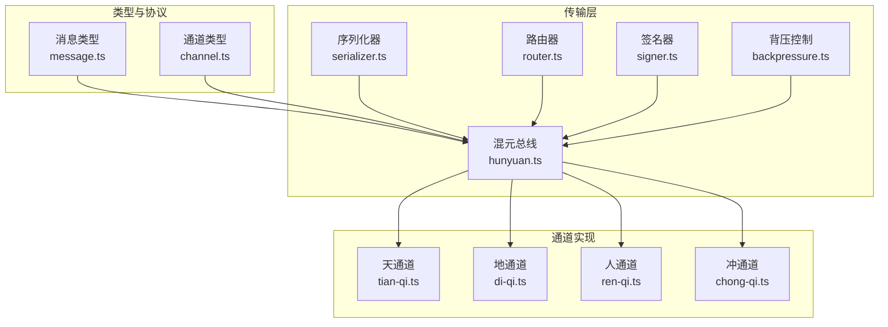

图表来源
- [apps/DaoMind/packages/daoQi/src/types/message.ts:1-40](file://apps/DaoMind/packages/daoQi/src/types/message.ts#L1-L40)
- [apps/DaoMind/packages/daoQi/src/types/channel.ts:1-23](file://apps/DaoMind/packages/daoQi/src/types/channel.ts#L1-L23)
- [apps/DaoMind/packages/daoQi/src/hunyuan.ts:1-125](file://apps/DaoMind/packages/daoQi/src/hunyuan.ts#L1-L125)
- [apps/DaoMind/packages/daoQi/src/codec/serializer.ts:1-75](file://apps/DaoMind/packages/daoQi/src/codec/serializer.ts#L1-L75)
- [apps/DaoMind/packages/daoQi/src/router.ts:1-48](file://apps/DaoMind/packages/daoQi/src/router.ts#L1-L48)
- [apps/DaoMind/packages/daoQi/src/signer.ts:1-40](file://apps/DaoMind/packages/daoQi/src/signer.ts#L1-L40)
- [apps/DaoMind/packages/daoQi/src/backpressure.ts:1-69](file://apps/DaoMind/packages/daoQi/src/backpressure.ts#L1-L69)
- [apps/DaoMind/packages/daoQi/src/channels/tian-qi.ts:1-105](file://apps/DaoMind/packages/daoQi/src/channels/tian-qi.ts#L1-L105)
- [apps/DaoMind/packages/daoQi/src/channels/di-qi.ts:1-128](file://apps/DaoMind/packages/daoQi/src/channels/di-qi.ts#L1-L128)
- [apps/DaoMind/packages/daoQi/src/channels/ren-qi.ts:1-130](file://apps/DaoMind/packages/daoQi/src/channels/ren-qi.ts#L1-L130)
- [apps/DaoMind/packages/daoQi/src/channels/chong-qi.ts:1-387](file://apps/DaoMind/packages/daoQi/src/channels/chong-qi.ts#L1-L387)

章节来源
- [apps/DaoMind/packages/daoQi/src/index.ts:1-28](file://apps/DaoMind/packages/daoQi/src/index.ts#L1-L28)

## 核心组件
- 消息协议：统一的头+体结构，支持 JSON 与二进制编码，包含路由元信息与签名字段。
- 通道类型：四气通道类型与方向枚举，用于描述消息在网络中的路径与角色。
- 混元总线：事件驱动的传输中枢，负责消息校验、背压、序列化、路由与统计。
- 编解码器：根据头部编码指示进行 JSON 或二进制序列化/反序列化。
- 路由器：基于目标节点与 TTL 的订阅式路由，支持广播与单播。
- 签名器：基于 HMAC-SHA256 的签名与校验，保障消息真实性。
- 背压控制：基于滑动窗口与采样率的速率限制，避免过载。
- 四气通道：
  - 天通道：下行广播与定向发送，常用于全局指令与配置。
  - 地通道：上行聚合上报，支持增量差分压缩。
  - 人通道：横向端口管理，冲突仲裁，保证同级模块通信。
  - 冲通道：动态平衡调节器，检测偏差并生成补偿信号。

章节来源
- [apps/DaoMind/packages/daoQi/src/types/message.ts:1-40](file://apps/DaoMind/packages/daoQi/src/types/message.ts#L1-L40)
- [apps/DaoMind/packages/daoQi/src/types/channel.ts:1-23](file://apps/DaoMind/packages/daoQi/src/types/channel.ts#L1-L23)
- [apps/DaoMind/packages/daoQi/src/hunyuan.ts:1-125](file://apps/DaoMind/packages/daoQi/src/hunyuan.ts#L1-L125)
- [apps/DaoMind/packages/daoQi/src/codec/serializer.ts:1-75](file://apps/DaoMind/packages/daoQi/src/codec/serializer.ts#L1-L75)
- [apps/DaoMind/packages/daoQi/src/router.ts:1-48](file://apps/DaoMind/packages/daoQi/src/router.ts#L1-L48)
- [apps/DaoMind/packages/daoQi/src/signer.ts:1-40](file://apps/DaoMind/packages/daoQi/src/signer.ts#L1-L40)
- [apps/DaoMind/packages/daoQi/src/backpressure.ts:1-69](file://apps/DaoMind/packages/daoQi/src/backpressure.ts#L1-L69)
- [apps/DaoMind/packages/daoQi/src/channels/tian-qi.ts:1-105](file://apps/DaoMind/packages/daoQi/src/channels/tian-qi.ts#L1-L105)
- [apps/DaoMind/packages/daoQi/src/channels/di-qi.ts:1-128](file://apps/DaoMind/packages/daoQi/src/channels/di-qi.ts#L1-L128)
- [apps/DaoMind/packages/daoQi/src/channels/ren-qi.ts:1-130](file://apps/DaoMind/packages/daoQi/src/channels/ren-qi.ts#L1-L130)
- [apps/DaoMind/packages/daoQi/src/channels/chong-qi.ts:1-387](file://apps/DaoMind/packages/daoQi/src/channels/chong-qi.ts#L1-L387)

## 架构总览
DaoQi 的运行时交互围绕混元总线展开：发送端通过通道构造消息，混元总线进行签名校验、背压评估、序列化与路由决策，最终以事件形式投递到目标通道或订阅者。

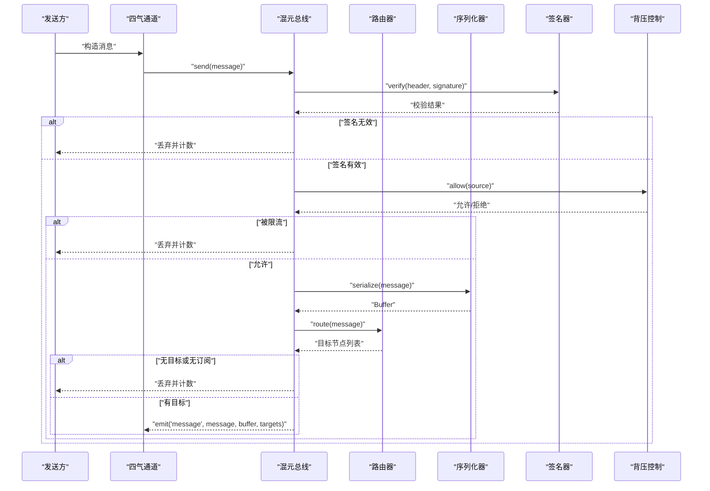

图表来源
- [apps/DaoMind/packages/daoQi/src/hunyuan.ts:45-92](file://apps/DaoMind/packages/daoQi/src/hunyuan.ts#L45-L92)
- [apps/DaoMind/packages/daoQi/src/router.ts:28-42](file://apps/DaoMind/packages/daoQi/src/router.ts#L28-L42)
- [apps/DaoMind/packages/daoQi/src/codec/serializer.ts:11-25](file://apps/DaoMind/packages/daoQi/src/codec/serializer.ts#L11-L25)
- [apps/DaoMind/packages/daoQi/src/signer.ts:14-17](file://apps/DaoMind/packages/daoQi/src/signer.ts#L14-L17)
- [apps/DaoMind/packages/daoQi/src/backpressure.ts:32-52](file://apps/DaoMind/packages/daoQi/src/backpressure.ts#L32-L52)

## 详细组件分析

### 消息格式与序列化协议
- 消息头包含唯一 ID、类型、源/目标节点、优先级、TTL、时间戳、可选签名与编码格式。
- 消息体支持对象与二进制数组，二进制场景通过 Base64 包裹。
- 编解码器根据头部编码字段自动选择 JSON 或二进制格式，二进制格式以魔数开头并携带头部长度。

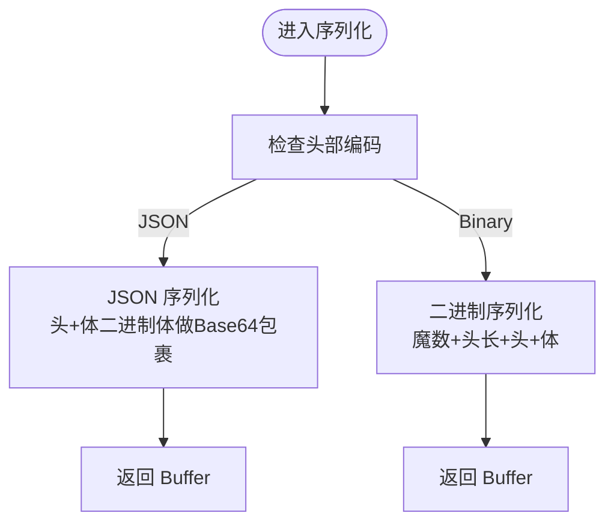

图表来源
- [apps/DaoMind/packages/daoQi/src/types/message.ts:17-39](file://apps/DaoMind/packages/daoQi/src/types/message.ts#L17-L39)
- [apps/DaoMind/packages/daoQi/src/codec/serializer.ts:11-51](file://apps/DaoMind/packages/daoQi/src/codec/serializer.ts#L11-L51)

章节来源
- [apps/DaoMind/packages/daoQi/src/types/message.ts:1-40](file://apps/DaoMind/packages/daoQi/src/types/message.ts#L1-L40)
- [apps/DaoMind/packages/daoQi/src/codec/serializer.ts:1-75](file://apps/DaoMind/packages/daoQi/src/codec/serializer.ts#L1-L75)

### 通道选择与路由策略
- 路由器基于目标节点维护订阅集合，支持广播（无目标）与单播（有目标）。
- TTL 小于等于 0 时直接丢弃，避免无限循环。
- 混元总线统计各通道类型发出的消息数量，便于观测。

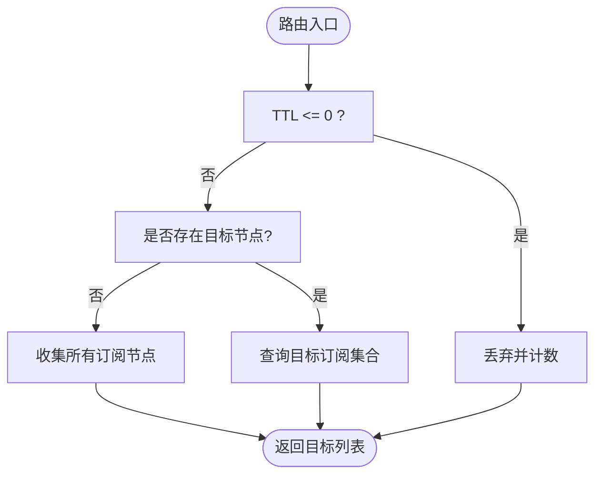

图表来源
- [apps/DaoMind/packages/daoQi/src/router.ts:28-42](file://apps/DaoMind/packages/daoQi/src/router.ts#L28-L42)
- [apps/DaoMind/packages/daoQi/src/hunyuan.ts:83-91](file://apps/DaoMind/packages/daoQi/src/hunyuan.ts#L83-L91)

章节来源
- [apps/DaoMind/packages/daoQi/src/router.ts:1-48](file://apps/DaoMind/packages/daoQi/src/router.ts#L1-L48)
- [apps/DaoMind/packages/daoQi/src/hunyuan.ts:109-119](file://apps/DaoMind/packages/daoQi/src/hunyuan.ts#L109-L119)

### 背压与限流
- 背压控制以节点为单位维护滑动时间窗内的请求计数，超过阈值则进入限流状态，按采样率进一步降低配额。
- 允许判断后记录时间戳，统计接口可查询当前速率与限流状态。

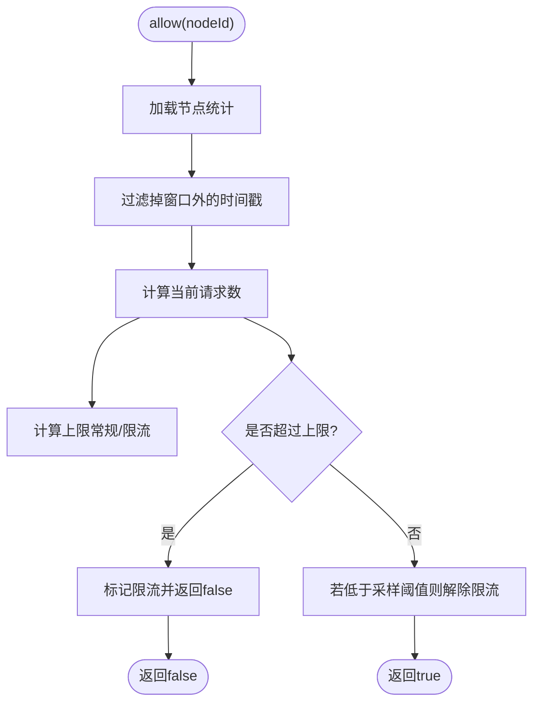

图表来源
- [apps/DaoMind/packages/daoQi/src/backpressure.ts:32-52](file://apps/DaoMind/packages/daoQi/src/backpressure.ts#L32-L52)

章节来源
- [apps/DaoMind/packages/daoQi/src/backpressure.ts:1-69](file://apps/DaoMind/packages/daoQi/src/backpressure.ts#L1-L69)

### 签名与安全
- 发送端构造消息头后以根密钥对头 JSON 进行 HMAC-SHA256 签名，接收端严格校验。
- 提供定时安全比较函数，防止时序攻击。

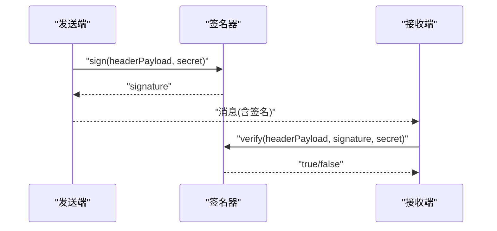

图表来源
- [apps/DaoMind/packages/daoQi/src/signer.ts:10-17](file://apps/DaoMind/packages/daoQi/src/signer.ts#L10-L17)

章节来源
- [apps/DaoMind/packages/daoQi/src/signer.ts:1-40](file://apps/DaoMind/packages/daoQi/src/signer.ts#L1-L40)

### 天通道（高层抽象）
- 支持全局广播与定向发送，自动注入签名、默认优先级与 TTL。
- 内部维护已发送消息 ID 集合，避免重复。

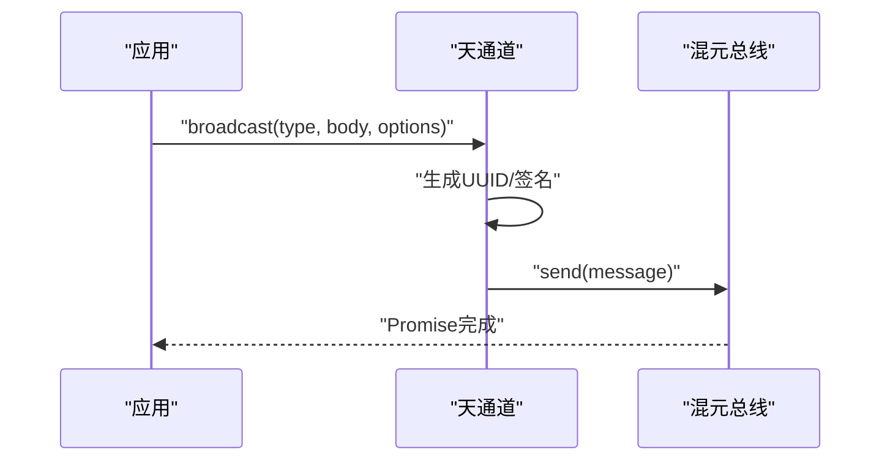

图表来源
- [apps/DaoMind/packages/daoQi/src/channels/tian-qi.ts:30-62](file://apps/DaoMind/packages/daoQi/src/channels/tian-qi.ts#L30-L62)
- [apps/DaoMind/packages/daoQi/src/hunyuan.ts:45-92](file://apps/DaoMind/packages/daoQi/src/hunyuan.ts#L45-L92)

章节来源
- [apps/DaoMind/packages/daoQi/src/channels/tian-qi.ts:1-105](file://apps/DaoMind/packages/daoQi/src/channels/tian-qi.ts#L1-L105)

### 地通道（底层实现）
- 上行聚合上报，按时间窗口合并多次上报，支持差分模式（_delta）压缩。
- 自动注入目标为根节点，优先级较低，适合监控与度量。

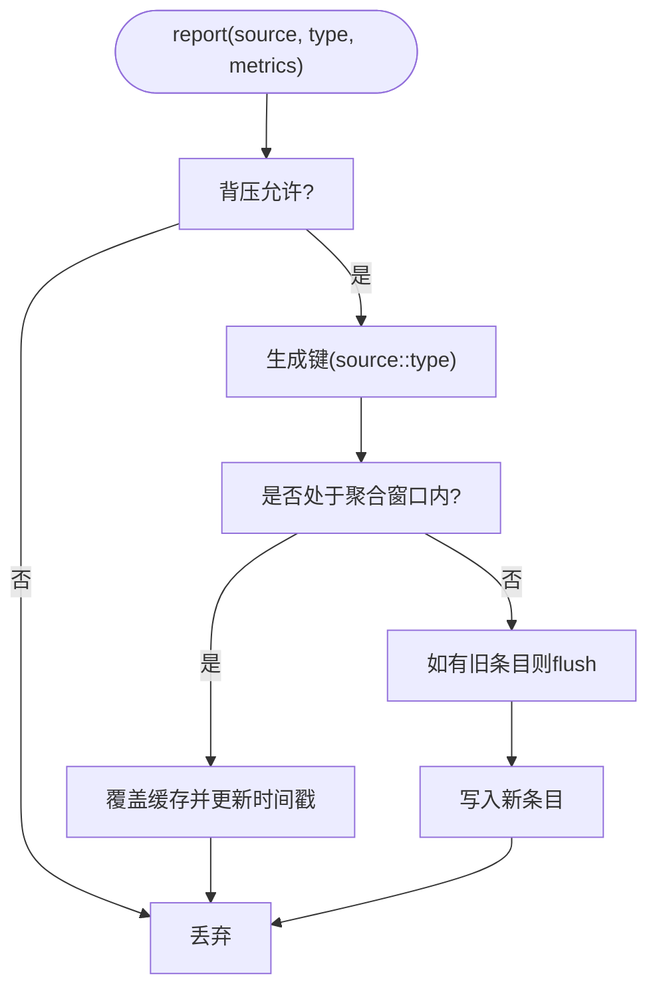

图表来源
- [apps/DaoMind/packages/daoQi/src/channels/di-qi.ts:34-62](file://apps/DaoMind/packages/daoQi/src/channels/di-qi.ts#L34-L62)
- [apps/DaoMind/packages/daoQi/src/channels/di-qi.ts:71-107](file://apps/DaoMind/packages/daoQi/src/channels/di-qi.ts#L71-L107)

章节来源
- [apps/DaoMind/packages/daoQi/src/channels/di-qi.ts:1-128](file://apps/DaoMind/packages/daoQi/src/channels/di-qi.ts#L1-L128)

### 人通道（业务逻辑）
- 端口管理：仅允许预定义的合法节点对建立双向端口。
- 冲突仲裁：当同一往返链路出现竞争冲突时，按时间戳择优放行，避免脑裂。
- 横向通信：不经过上级中转，提升同级模块协作效率。

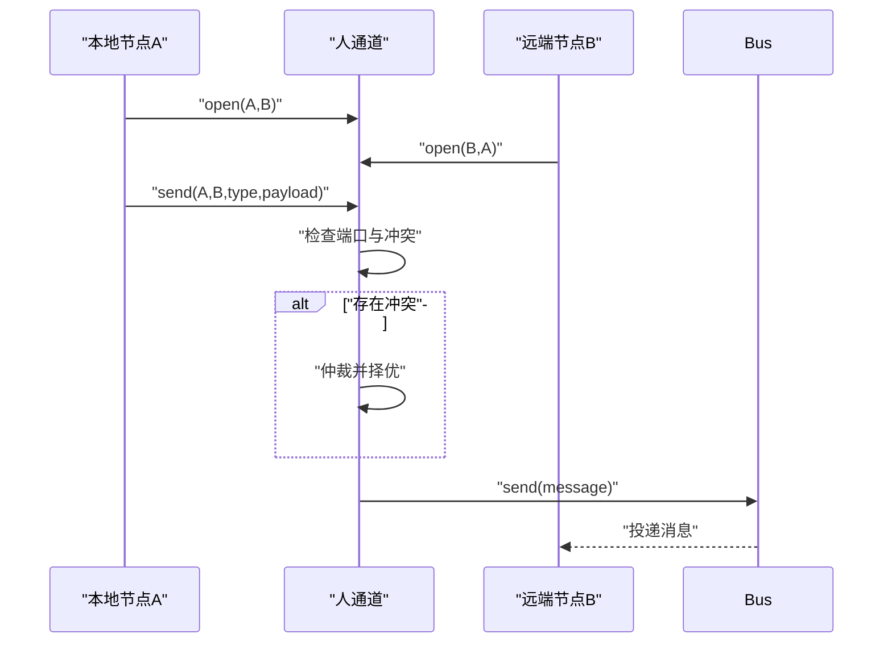

图表来源
- [apps/DaoMind/packages/daoQi/src/channels/ren-qi.ts:47-95](file://apps/DaoMind/packages/daoQi/src/channels/ren-qi.ts#L47-L95)
- [apps/DaoMind/packages/daoQi/src/channels/ren-qi.ts:105-128](file://apps/DaoMind/packages/daoQi/src/channels/ren-qi.ts#L105-L128)

章节来源
- [apps/DaoMind/packages/daoQi/src/channels/ren-qi.ts:1-130](file://apps/DaoMind/packages/daoQi/src/channels/ren-qi.ts#L1-L130)

### 冲通道（动态路由）
- 平衡调节器：对多组“阴阳”节点对进行比率检测，计算偏差与紧急度，生成补偿信号（补/泻/不动），并记录调整历史防止振荡。
- 收敛算法：在最大迭代次数内逐步逼近理想比值，记录收敛过程中的偏差与动作。

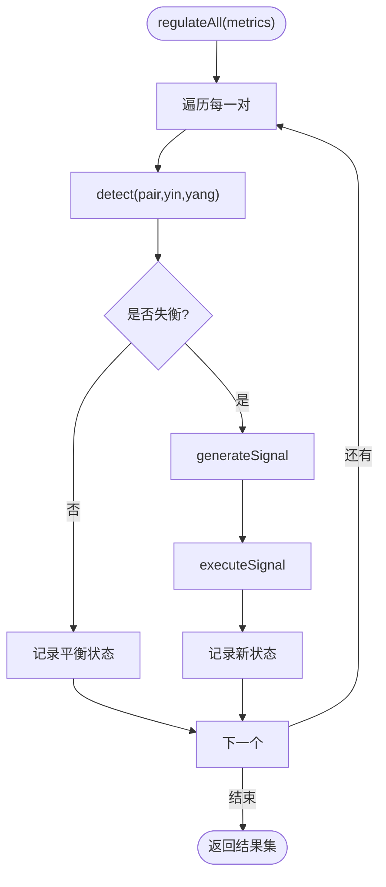

图表来源
- [apps/DaoMind/packages/daoQi/src/channels/chong-qi.ts:111-155](file://apps/DaoMind/packages/daoQi/src/channels/chong-qi.ts#L111-L155)
- [apps/DaoMind/packages/daoQi/src/channels/chong-qi.ts:157-181](file://apps/DaoMind/packages/daoQi/src/channels/chong-qi.ts#L157-L181)
- [apps/DaoMind/packages/daoQi/src/channels/chong-qi.ts:183-225](file://apps/DaoMind/packages/daoQi/src/channels/chong-qi.ts#L183-L225)
- [apps/DaoMind/packages/daoQi/src/channels/chong-qi.ts:227-245](file://apps/DaoMind/packages/daoQi/src/channels/chong-qi.ts#L227-L245)

章节来源
- [apps/DaoMind/packages/daoQi/src/channels/chong-qi.ts:1-387](file://apps/DaoMind/packages/daoQi/src/channels/chong-qi.ts#L1-L387)

### 同步与异步通信模式
- 同步：通道内部使用 Promise 包装发送流程，调用方可 await 确保发送完成。
- 异步：混元总线以事件驱动方式投递消息，订阅者可异步处理。

章节来源
- [apps/DaoMind/packages/daoQi/src/channels/tian-qi.ts:30-62](file://apps/DaoMind/packages/daoQi/src/channels/tian-qi.ts#L30-L62)
- [apps/DaoMind/packages/daoQi/src/channels/di-qi.ts:34-62](file://apps/DaoMind/packages/daoQi/src/channels/di-qi.ts#L34-L62)
- [apps/DaoMind/packages/daoQi/src/channels/ren-qi.ts:61-95](file://apps/DaoMind/packages/daoQi/src/channels/ren-qi.ts#L61-L95)
- [apps/DaoMind/packages/daoQi/src/hunyuan.ts:94-98](file://apps/DaoMind/packages/daoQi/src/hunyuan.ts#L94-L98)

### 持久化、重试与错误处理
- 当前实现未内置持久化存储；消息在总线层面进行签名校验、背压与路由，未见显式的重试队列或持久化落盘逻辑。
- 错误处理策略：
  - 消息结构校验失败抛出错误。
  - 签名校验失败或背压拒绝直接丢弃并计数。
  - 路由无订阅或 TTL 到期同样丢弃并计数。
- 建议：如需持久化与可靠投递，可在通道侧引入本地队列与指数退避重试，并在混元总线上增加持久化钩子。

章节来源
- [apps/DaoMind/packages/daoQi/src/hunyuan.ts:45-92](file://apps/DaoMind/packages/daoQi/src/hunyuan.ts#L45-L92)
- [apps/DaoMind/packages/daoQi/src/router.ts:28-42](file://apps/DaoMind/packages/daoQi/src/router.ts#L28-L42)
- [apps/DaoMind/packages/daoQi/src/backpressure.ts:32-52](file://apps/DaoMind/packages/daoQi/src/backpressure.ts#L32-L52)

### 与应用容器系统的集成与最佳实践
- 通道实例化：通过混元总线统一注入序列化器、路由器、签名器与背压控制。
- 推荐实践：
  - 在根节点部署签名密钥与路由表，确保全局一致性。
  - 对高吞吐模块启用二进制编码以降低序列化成本。
  - 使用人通道管理强约束的同级模块对，避免跨层级耦合。
  - 结合冲通道的收敛算法定期校准关键指标比值，保持系统动态平衡。
- 示例参考：README 中提供了创建总线与通道、发送消息与统计采集的使用片段。

章节来源
- [apps/DaoMind/packages/daoQi/src/index.ts:7-27](file://apps/DaoMind/packages/daoQi/src/index.ts#L7-L27)
- [apps/DaoMind/README.md:165-199](file://apps/DaoMind/README.md#L165-L199)
- [apps/DaoMind/tests/test-qi-message.js:1-37](file://apps/DaoMind/tests/test-qi-message.js#L1-L37)

## 依赖关系分析
- 组件内聚：通道实现依赖混元总线提供的统一传输能力；混元总线依赖编解码、路由、签名与背压模块。
- 组件耦合：通道与总线通过事件接口松耦合；路由器与背压控制通过纯函数式接口低耦合。
- 外部依赖：Node.js 内置 crypto 与 events 模块；序列化器依赖 Buffer。

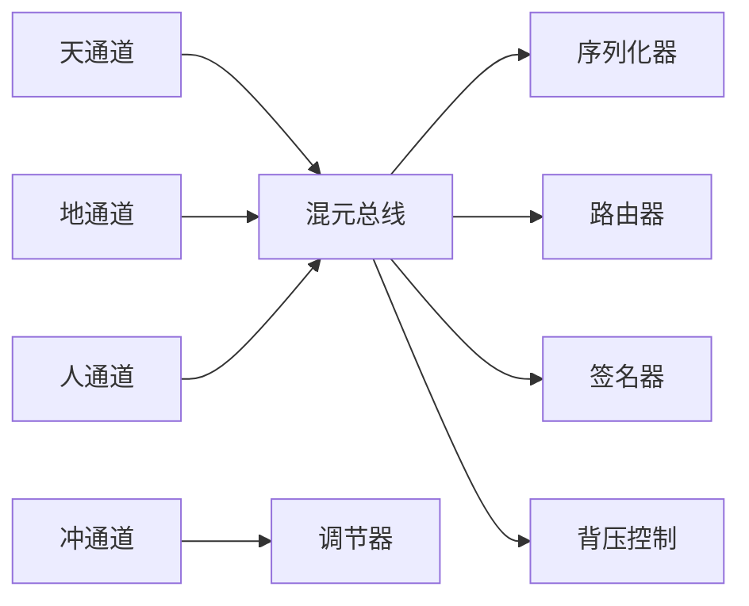

图表来源
- [apps/DaoMind/packages/daoQi/src/channels/tian-qi.ts:1-105](file://apps/DaoMind/packages/daoQi/src/channels/tian-qi.ts#L1-L105)
- [apps/DaoMind/packages/daoQi/src/channels/di-qi.ts:1-128](file://apps/DaoMind/packages/daoQi/src/channels/di-qi.ts#L1-L128)
- [apps/DaoMind/packages/daoQi/src/channels/ren-qi.ts:1-130](file://apps/DaoMind/packages/daoQi/src/channels/ren-qi.ts#L1-L130)
- [apps/DaoMind/packages/daoQi/src/channels/chong-qi.ts:1-387](file://apps/DaoMind/packages/daoQi/src/channels/chong-qi.ts#L1-L387)
- [apps/DaoMind/packages/daoQi/src/hunyuan.ts:1-125](file://apps/DaoMind/packages/daoQi/src/hunyuan.ts#L1-L125)

## 性能考量
- 编解码优化：二进制编码减少字符串解析与 JSON 序列化开销，适合大体量数据传输。
- 路由与聚合：地通道的差分聚合显著降低上行带宽与 CPU 占用；合理设置聚合窗口与差分阈值。
- 背压策略：根据节点负载动态调整采样率与窗口大小，避免过度限流导致延迟尖峰。
- 冲通道收敛：通过抑制振荡与自适应敏感度，减少不必要的补偿动作，提高稳定性。

## 故障排查指南
- 消息未到达：检查 TTL 是否归零、目标订阅是否建立、背压是否触发。
- 签名相关错误：确认发送端与接收端使用一致的密钥，核对消息头 JSON 字段顺序与完整性。
- 人通道冲突：查看端口开放情况与仲裁日志，避免双向端口未同时建立。
- 统计异常：通过混元总线统计接口核对发出/丢弃数量，定位瓶颈。

章节来源
- [apps/DaoMind/packages/daoQi/src/hunyuan.ts:109-119](file://apps/DaoMind/packages/daoQi/src/hunyuan.ts#L109-L119)
- [apps/DaoMind/packages/daoQi/src/router.ts:28-42](file://apps/DaoMind/packages/daoQi/src/router.ts#L28-L42)
- [apps/DaoMind/packages/daoQi/src/signer.ts:14-17](file://apps/DaoMind/packages/daoQi/src/signer.ts#L14-L17)
- [apps/DaoMind/packages/daoQi/src/backpressure.ts:61-67](file://apps/DaoMind/packages/daoQi/src/backpressure.ts#L61-L67)

## 结论
DaoQi 以“四气通道”为骨架，构建了从高层抽象到底层实现的完整消息通路，配合混元总线实现统一的编解码、路由、签名与背压控制。天通道负责全局下行，地通道负责上行聚合，人通道保证横向协作，冲通道维持系统动态平衡。通过合理的编码策略、聚合与限流机制，系统在复杂分布式场景中具备良好的扩展性与稳定性。建议在生产环境中补充持久化与重试机制，并结合冲通道的收敛算法持续优化关键指标的平衡。

## 附录
- 使用示例参考：README 中的示例展示了如何创建总线与通道、发送消息与获取统计信息。
- 测试脚本参考：测试文件演示了模块加载与基本事件监听流程。

章节来源
- [apps/DaoMind/README.md:165-199](file://apps/DaoMind/README.md#L165-L199)
- [apps/DaoMind/tests/test-qi-message.js:1-37](file://apps/DaoMind/tests/test-qi-message.js#L1-L37)