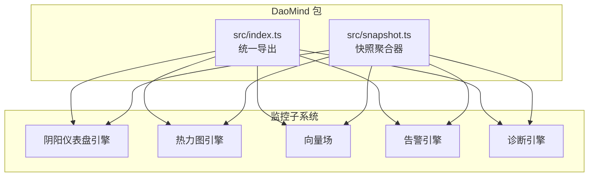
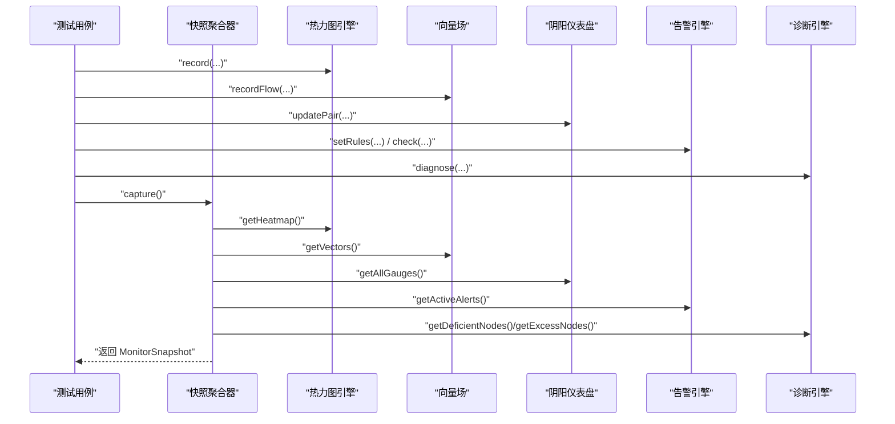
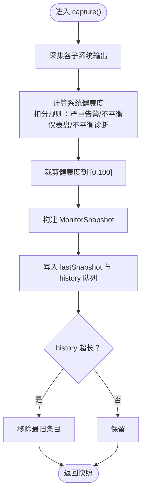
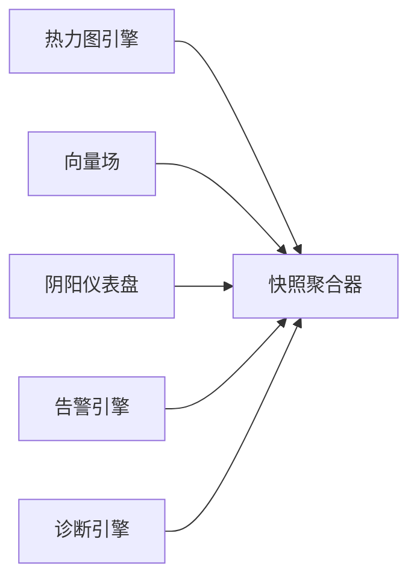

# 监控系统（DaoMonitor）

<cite>
**本文引用的文件**
- [apps/DaoMind/tests/test-monitor-system.test.ts](file://apps/DaoMind/tests/test-monitor-system.test.ts)
- [apps/DaoMind/README.md](file://apps/DaoMind/README.md)
- [apps/DaoMind/packages/daoMonitor/src/index.ts](file://apps/DaoMind/packages/daoMonitor/src/index.ts)
- [apps/DaoMind/packages/daoMonitor/src/snapshot.ts](file://apps/DaoMind/packages/daoMonitor/src/snapshot.ts)
</cite>

## 目录
1. [简介](#简介)
2. [项目结构](#项目结构)
3. [核心组件](#核心组件)
4. [架构总览](#架构总览)
5. [详细组件分析](#详细组件分析)
6. [依赖关系分析](#依赖关系分析)
7. [性能考虑](#性能考虑)
8. [故障排查指南](#故障排查指南)
9. [结论](#结论)
10. [附录](#附录)

## 简介
本文件为 DaoMonitor 监控系统的技术文档，围绕“阴阳仪表盘”设计思想，系统性阐述热力图、向量场、告警引擎、诊断引擎与快照聚合器的实现与使用方法，并给出监控指标体系、数据采集策略、存储与查询优化建议、告警触发与通知流程、最佳实践以及与消息传递系统的集成思路。文档以仓库中现有的测试与导出入口为依据，确保内容可追溯至实际源码。

## 项目结构
DaoMonitor 位于 DaoMind 工作区的 packages 子目录下，通过统一入口导出各模块类型与类；系统功能在测试文件中被完整演示，包括热力图、向量场、阴阳仪表盘、告警与诊断，以及将上述能力聚合为系统快照的能力。

图表来源
- [apps/DaoMind/packages/daoMonitor/src/index.ts:1-16](file://apps/DaoMind/packages/daoMonitor/src/index.ts#L1-L16)
- [apps/DaoMind/packages/daoMonitor/src/snapshot.ts:1-76](file://apps/DaoMind/packages/daoMonitor/src/snapshot.ts#L1-L76)

章节来源
- [apps/DaoMind/packages/daoMonitor/src/index.ts:1-16](file://apps/DaoMind/packages/daoMonitor/src/index.ts#L1-L16)
- [apps/DaoMind/packages/daoMonitor/src/snapshot.ts:1-76](file://apps/DaoMind/packages/daoMonitor/src/snapshot.ts#L1-L76)

## 核心组件
- 阴阳仪表盘引擎（DaoYinYangGaugeEngine）：用于记录与评估成对指标（如 yin/yang）的平衡状态，输出仪表盘集合与不平衡项。
- 热力图引擎（DaoHeatmapEngine）：按通道类型记录源-目标之间的多维指标（如速率、延迟、错误率），支持通道摘要与整体热力图获取。
- 向量场（DaoVectorField）：记录节点间流量的幅度与方向，支持热点识别、入/出站统计等。
- 告警引擎（DaoAlertEngine）：基于规则条件进行实时检查，输出活跃告警列表。
- 诊断引擎（DaoDiagnosisEngine）：对系统健康状态进行诊断，输出节点层面的盈亏（deficient/excess）等诊断信息。
- 快照聚合器（DaoSnapshotAggregator）：整合上述子系统输出，计算系统健康度并维护历史快照。

章节来源
- [apps/DaoMind/tests/test-monitor-system.test.ts:1-225](file://apps/DaoMind/tests/test-monitor-system.test.ts#L1-L225)
- [apps/DaoMind/packages/daoMonitor/src/index.ts:1-16](file://apps/DaoMind/packages/daoMonitor/src/index.ts#L1-L16)

## 架构总览
下图展示了监控子系统与快照聚合器之间的协作关系：快照聚合器从各子系统抓取当前状态，综合计算系统健康度并持久化历史快照。

图表来源
- [apps/DaoMind/packages/daoMonitor/src/snapshot.ts:22-59](file://apps/DaoMind/packages/daoMonitor/src/snapshot.ts#L22-L59)
- [apps/DaoMind/tests/test-monitor-system.test.ts:46-52](file://apps/DaoMind/tests/test-monitor-system.test.ts#L46-L52)

## 详细组件分析

### 快照聚合器（DaoSnapshotAggregator）
- 职责：从热力图、向量场、阴阳仪表盘、告警与诊断子系统抓取当前状态，汇总为 MonitorSnapshot，并维护固定长度的历史队列。
- 关键逻辑：
  - 采集阶段：分别调用各子系统的输出接口。
  - 健康度计算：根据严重级别扣分，仪表盘非平衡与诊断非平衡也扣分，最终裁剪到 [0,100]。
  - 历史管理：限制最大历史条数，超出时丢弃最旧条目。
- 输出：包含时间戳、热力图、向量场、仪表盘、活跃告警、诊断结果与系统健康度。

图表来源
- [apps/DaoMind/packages/daoMonitor/src/snapshot.ts:22-59](file://apps/DaoMind/packages/daoMonitor/src/snapshot.ts#L22-L59)

章节来源
- [apps/DaoMind/packages/daoMonitor/src/snapshot.ts:1-76](file://apps/DaoMind/packages/daoMonitor/src/snapshot.ts#L1-L76)

### 阴阳仪表盘引擎（DaoYinYangGaugeEngine）
- 功能要点：
  - 接收成对指标更新，计算平衡状态。
  - 提供获取全部仪表盘与不平衡配对的能力。
- 典型使用：模拟系统健康状态数据，循环更新 yin/yang 指标，随后查询全量与不平衡集合。

章节来源
- [apps/DaoMind/tests/test-monitor-system.test.ts:55-76](file://apps/DaoMind/tests/test-monitor-system.test.ts#L55-L76)

### 热力图引擎（DaoHeatmapEngine）
- 功能要点：
  - 按通道类型记录源-目标的多维指标。
  - 支持通道摘要与整体热力图获取。
- 典型使用：随机生成通道类型与指标，记录后读取热力图与特定通道摘要。

章节来源
- [apps/DaoMind/tests/test-monitor-system.test.ts:78-101](file://apps/DaoMind/tests/test-monitor-system.test.ts#L78-L101)

### 向量场（DaoVectorField）
- 功能要点：
  - 记录节点间流量的幅度与方向。
  - 支持热点识别、入/出站统计。
- 典型使用：随机生成边，记录流量后读取向量场、节点入/出站与热点。

章节来源
- [apps/DaoMind/tests/test-monitor-system.test.ts:102-132](file://apps/DaoMind/tests/test-monitor-system.test.ts#L102-L132)

### 告警引擎（DaoAlertEngine）
- 功能要点：
  - 规则驱动：通过 setRules 注入规则，每条规则包含条件、严重级别、原因与消息模板。
  - 实时检查：check 接口对给定指标进行规则匹配，返回告警对象。
  - 活跃告警：getActiveAlerts 返回当前激活的告警集合。
- 典型使用：设置自定义规则，模拟高负载与高延迟场景，检查并获取活跃告警。

章节来源
- [apps/DaoMind/tests/test-monitor-system.test.ts:133-175](file://apps/DaoMind/tests/test-monitor-system.test.ts#L133-L175)

### 诊断引擎（DaoDiagnosisEngine）
- 功能要点：
  - 输入系统维度的指标（CPU、内存、磁盘、网络、服务健康状态等）。
  - 输出节点层面的诊断（如 deficient/excess）。
- 典型使用：构造系统诊断数据，调用诊断接口获取诊断结果。

章节来源
- [apps/DaoMind/tests/test-monitor-system.test.ts:176-198](file://apps/DaoMind/tests/test-monitor-system.test.ts#L176-L198)

### 统一导出与类型
- 导出入口：index.ts 将各引擎类与关键类型统一导出，便于上层应用按需引入。
- 类型覆盖：通道类型、热力图点、向量、仪表盘、告警、诊断、监控快照等类型均在导出清单中。

章节来源
- [apps/DaoMind/packages/daoMonitor/src/index.ts:1-16](file://apps/DaoMind/packages/daoMonitor/src/index.ts#L1-L16)

## 依赖关系分析
- 组件内聚：快照聚合器聚合多个子系统，职责清晰，耦合度低。
- 外部依赖：测试文件演示了各子系统之间的协作方式；快照聚合器内部依赖各子系统提供的输出接口。
- 可扩展性：新增子系统只需在快照聚合器中补充采集与健康度扣分逻辑即可。

图表来源
- [apps/DaoMind/packages/daoMonitor/src/snapshot.ts:14-20](file://apps/DaoMind/packages/daoMonitor/src/snapshot.ts#L14-L20)

章节来源
- [apps/DaoMind/packages/daoMonitor/src/snapshot.ts:1-76](file://apps/DaoMind/packages/daoMonitor/src/snapshot.ts#L1-L76)

## 性能考虑
- 数据结构与复杂度
  - 快照聚合器在 capture 中对活跃告警、仪表盘与诊断进行线性遍历，复杂度 O(n+m+k)，n/m/k 分别为三者数量。
  - 健康度计算为常数时间扣分，整体开销与子系统输出规模线性相关。
- 存储与历史
  - 历史队列上限固定，避免无限增长；超出时采用队首移除策略，时间复杂度 O(1)。
- 查询优化建议
  - 对于高频查询，可在子系统内部缓存中间态（如通道摘要、节点入/出站统计），减少重复计算。
  - 健康度扣分策略可按严重级别分组，先过滤再扣分，降低无效遍历成本。
- 并发与异步
  - 若子系统输出接口为同步阻塞，建议在上层批量采集时采用并发策略（注意快照一致性窗口）。

## 故障排查指南
- 常见问题
  - 健康度异常下降：优先检查活跃告警是否包含 critical 级别；其次检查不平衡仪表盘与非平衡诊断。
  - 快照为空或缺失：确认各子系统是否正确记录数据，且快照聚合器的采集接口返回非空。
  - 历史过短：检查 MAX_HISTORY 是否过大导致内存压力，或过小导致回溯困难。
- 定位步骤
  - 分别调用各子系统的输出接口，核对数据是否按预期生成。
  - 在告警引擎中打印规则与 check 结果，验证条件表达式与阈值。
  - 在诊断引擎中核对输入指标维度与取值范围。
- 修复建议
  - 调整规则阈值或消息模板，确保告警语义明确。
  - 对热点与流量统计增加边界检查，避免极端值影响可视化。

章节来源
- [apps/DaoMind/packages/daoMonitor/src/snapshot.ts:31-42](file://apps/DaoMind/packages/daoMonitor/src/snapshot.ts#L31-L42)

## 结论
DaoMonitor 以“阴阳仪表盘”为核心理念，结合热力图、向量场、告警与诊断能力，形成一套可观测性闭环。快照聚合器将多源数据整合为统一视图，并通过健康度量化系统状态。该架构具备良好的可扩展性与可维护性，适合在消息传递与分布式系统中作为实时监控与诊断工具。

## 附录

### 监控指标体系（建议）
- 性能指标
  - 吞吐：消息速率（msg/s）、节点间流量总量。
  - 延迟：端到端延迟、队列等待时间、处理耗时。
  - 错误率：全局错误率、节点级错误分布。
- 业务指标
  - 任务成功率、重试次数、积压量。
  - 用户活跃度、会话时长、转化率。
- 健康状态指标
  - CPU/内存/磁盘使用率、连接数、队列深度。
  - 服务可用性、依赖链路健康度。

### 数据采集策略
- 采样与聚合
  - 对高频指标采用滑动窗口与桶聚合，降低存储与计算压力。
  - 对关键事件（告警触发）进行全量记录，其他事件抽样。
- 来源与格式
  - 从消息代理、应用埋点与系统指标采集器汇聚，统一为热力图与向量场输入。
  - 通道类型与节点命名规范应保持一致，便于跨域分析。

### 存储方案与查询优化
- 存储
  - 近实时：内存队列+落盘备份，保证快照聚合器的低延迟访问。
  - 历史归档：压缩存储热力图与向量场的聚合结果，按天/周/月切片。
- 查询
  - 热点与流量统计建立索引，支持按时间窗口与节点维度检索。
  - 健康度计算可预聚合，减少在线计算开销。

### 告警触发机制、通知渠道与处理流程
- 触发机制
  - 规则引擎：基于阈值、趋势与组合条件触发。
  - 降噪：同源告警去重、静默窗口、收敛策略。
- 通知渠道
  - 邮件、IM、电话与工单系统联动，按严重级别自动分级。
- 处理流程
  - 自动化处置：重启实例、扩容资源、切换上游。
  - 人工介入：升级工单、根因分析、复盘与规则优化。

### 最佳实践
- 以“阴阳”视角审视系统：关注成对指标的平衡，避免单一维度过度偏移。
- 以“通道”为单位观测：热力图与向量场帮助发现瓶颈与异常路径。
- 以“健康度”量化风险：将告警、仪表盘与诊断纳入统一评分，便于快速定位。
- 以“快照”沉淀证据：保留历史快照，支撑事后分析与容量规划。

### 与消息传递系统的集成
- 数据来源
  - 从消息代理消费指标事件，解析为热力图与向量场输入。
- 实时监控
  - 通过快照聚合器周期性生成系统快照，推送至可视化面板或告警平台。
- 可视化
  - 热力图展示通道负载与错误分布；向量场呈现流量方向与热点；仪表盘显示关键平衡指标；告警与诊断结果叠加标注。

### 代码示例（路径）
- 引入与初始化
  - [apps/DaoMind/README.md:201-293](file://apps/DaoMind/README.md#L201-L293)
- 快照聚合器使用
  - [apps/DaoMind/tests/test-monitor-system.test.ts:46-52](file://apps/DaoMind/tests/test-monitor-system.test.ts#L46-L52)
  - [apps/DaoMind/packages/daoMonitor/src/snapshot.ts:22-59](file://apps/DaoMind/packages/daoMonitor/src/snapshot.ts#L22-L59)
- 阴阳仪表盘
  - [apps/DaoMind/tests/test-monitor-system.test.ts:55-76](file://apps/DaoMind/tests/test-monitor-system.test.ts#L55-L76)
- 热力图
  - [apps/DaoMind/tests/test-monitor-system.test.ts:78-101](file://apps/DaoMind/tests/test-monitor-system.test.ts#L78-L101)
- 向量场
  - [apps/DaoMind/tests/test-monitor-system.test.ts:102-132](file://apps/DaoMind/tests/test-monitor-system.test.ts#L102-L132)
- 告警引擎
  - [apps/DaoMind/tests/test-monitor-system.test.ts:133-175](file://apps/DaoMind/tests/test-monitor-system.test.ts#L133-L175)
- 诊断引擎
  - [apps/DaoMind/tests/test-monitor-system.test.ts:176-198](file://apps/DaoMind/tests/test-monitor-system.test.ts#L176-L198)