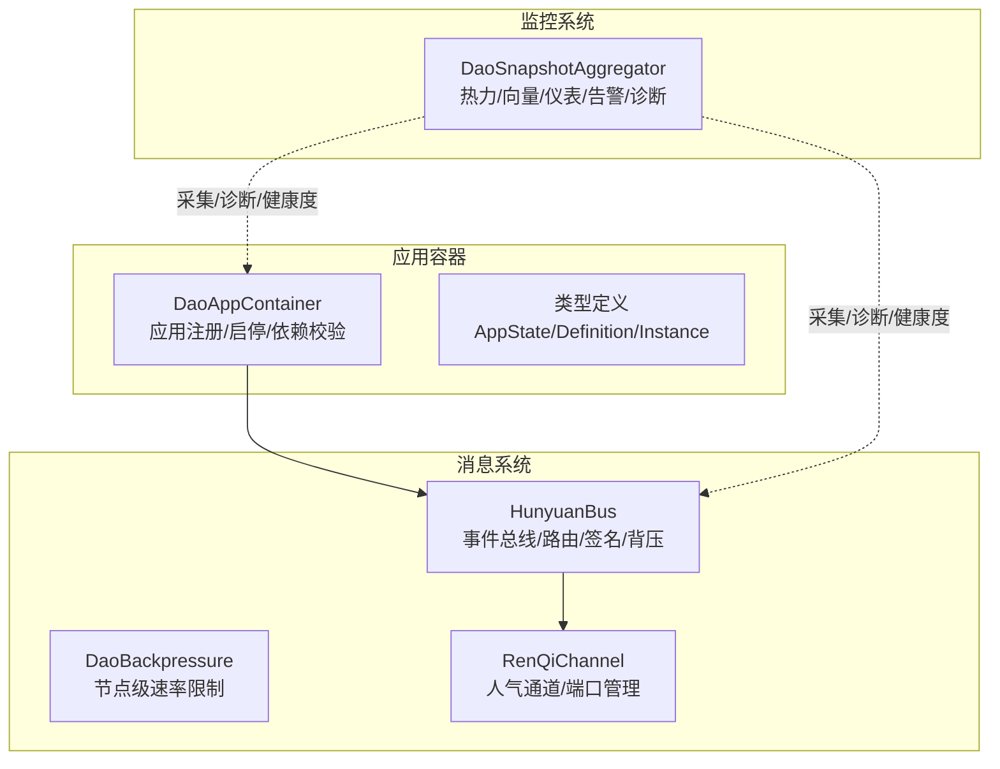
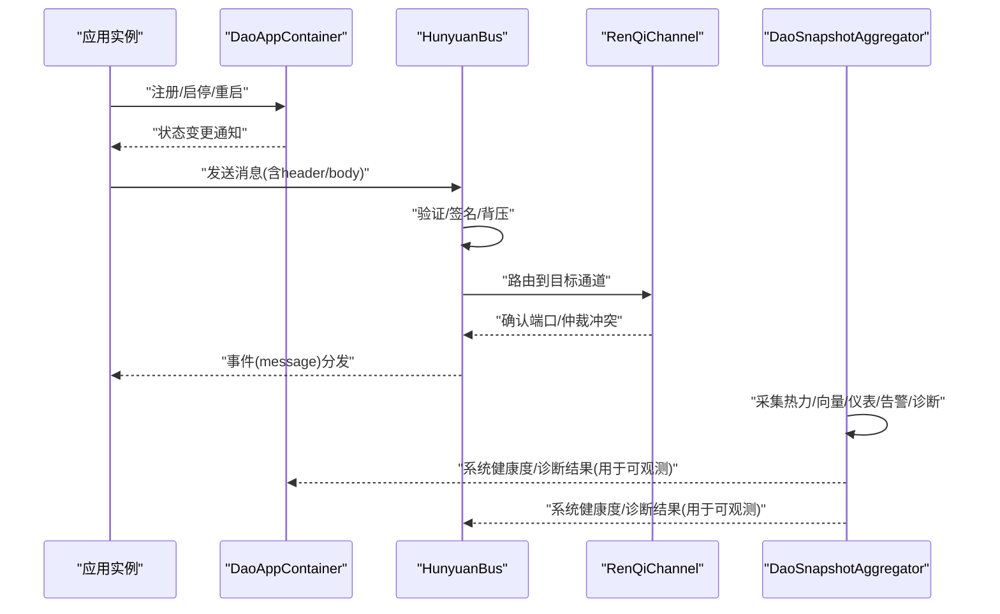
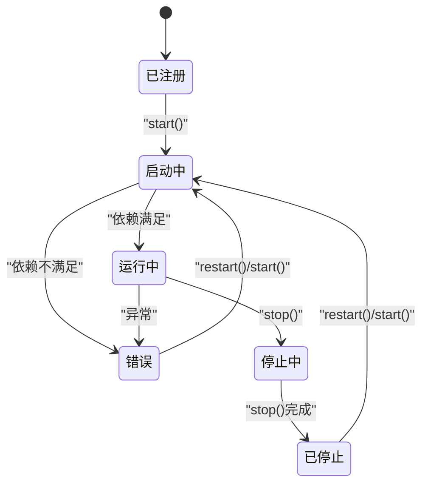
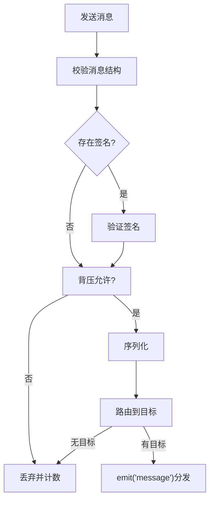
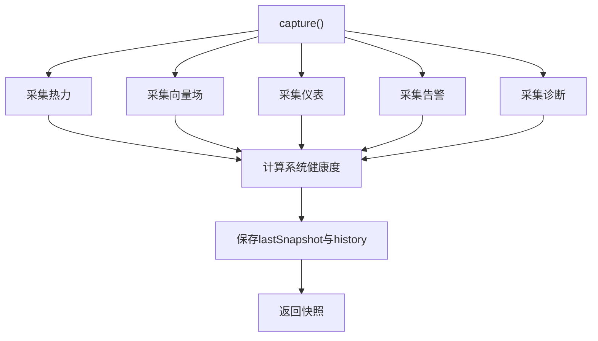
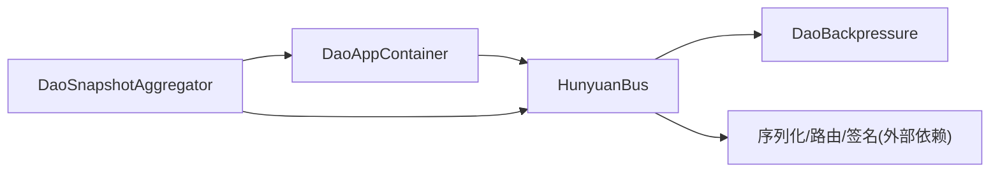

# 组件集成与通信

<cite>
**本文引用的文件**
- [apps/DaoMind/packages/daoApps/src/container.ts](file://apps/DaoMind/packages/daoApps/src/container.ts)
- [apps/DaoMind/packages/daoApps/src/types.ts](file://apps/DaoMind/packages/daoApps/src/types.ts)
- [apps/DaoMind/packages/daoApps/src/__tests__/container.test.ts](file://apps/DaoMind/packages/daoApps/src/__tests__/container.test.ts)
- [apps/DaoMind/packages/daoApps/src/__tests__/lifecycle.test.ts](file://apps/DaoMind/packages/daoApps/src/__tests__/lifecycle.test.ts)
- [apps/DaoMind/packages/daoQi/src/hunyuan.ts](file://apps/DaoMind/packages/daoQi/src/hunyuan.ts)
- [apps/DaoMind/packages/daoQi/src/backpressure.ts](file://apps/DaoMind/packages/daoQi/src/backpressure.ts)
- [apps/DaoMind/packages/daoQi/src/channels/ren-qi.ts](file://apps/DaoMind/packages/daoQi/src/channels/ren-qi.ts)
- [apps/DaoMind/packages/daoMonitor/src/snapshot.ts](file://apps/DaoMind/packages/daoMonitor/src/snapshot.ts)
- [apps/DaoMind/tests/test-qi-message.js](file://apps/DaoMind/tests/test-qi-message.js)
- [apps/DaoMind/tests/test-monitor-system.test.ts](file://apps/DaoMind/tests/test-monitor-system.test.ts)
- [apps/DaoMind/src/__tests__/integration/agents-apps-integration.test.ts](file://apps/DaoMind/src/__tests__/integration/agents-apps-integration.test.ts)
- [tools/DeepResearch/tests/performance/stability_test.py](file://tools/DeepResearch/tests/performance/stability_test.py)
</cite>

## 目录
1. [引言](#引言)
2. [项目结构](#项目结构)
3. [核心组件](#核心组件)
4. [架构总览](#架构总览)
5. [详细组件分析](#详细组件分析)
6. [依赖分析](#依赖分析)
7. [性能考虑](#性能考虑)
8. [故障排除指南](#故障排除指南)
9. [结论](#结论)
10. [附录](#附录)

## 引言
本文件面向DAO Collective的集成与通信场景，聚焦三类核心子系统：应用容器系统（管理应用生命周期与依赖）、消息传递系统（混元气总线及其通道）与监控系统（快照聚合与诊断）。文档将阐明三者之间的协作关系、数据流向、接口设计、事件驱动与异步通信机制，并给出组件初始化顺序、依赖注入与生命周期协调策略，以及可操作的集成示例、错误传播与容错机制、性能监控与调试技巧、扩展性与自定义开发最佳实践。

## 项目结构
DAO Collective在多应用与多包的Monorepo中组织，核心集成点位于以下子包：
- 应用容器：apps/DaoMind/packages/daoApps
- 消息系统：apps/DaoMind/packages/daoQi
- 监控系统：apps/DaoMind/packages/daoMonitor
- 集成测试与示例：apps/DaoMind/tests、apps/DaoMind/src/__tests__/integration

图表来源
- [apps/DaoMind/packages/daoApps/src/container.ts:12-104](file://apps/DaoMind/packages/daoApps/src/container.ts#L12-L104)
- [apps/DaoMind/packages/daoQi/src/hunyuan.ts:15-124](file://apps/DaoMind/packages/daoQi/src/hunyuan.ts#L15-L124)
- [apps/DaoMind/packages/daoQi/src/backpressure.ts:24-68](file://apps/DaoMind/packages/daoQi/src/backpressure.ts#L24-L68)
- [apps/DaoMind/packages/daoQi/src/channels/ren-qi.ts:43-77](file://apps/DaoMind/packages/daoQi/src/channels/ren-qi.ts#L43-L77)
- [apps/DaoMind/packages/daoMonitor/src/snapshot.ts:10-75](file://apps/DaoMind/packages/daoMonitor/src/snapshot.ts#L10-L75)

章节来源
- [apps/DaoMind/packages/daoApps/src/container.ts:1-108](file://apps/DaoMind/packages/daoApps/src/container.ts#L1-L108)
- [apps/DaoMind/packages/daoQi/src/hunyuan.ts:1-125](file://apps/DaoMind/packages/daoQi/src/hunyuan.ts#L1-L125)
- [apps/DaoMind/packages/daoMonitor/src/snapshot.ts:1-76](file://apps/DaoMind/packages/daoMonitor/src/snapshot.ts#L1-L76)

## 核心组件
- 应用容器系统
  - 提供应用注册、依赖检查、启停与重启、状态查询与列表筛选等能力
  - 严格的状态机约束，确保生命周期有序可控
- 消息传递系统
  - 混元气总线负责消息验证、签名校验、背压控制、序列化与路由分发
  - 通道抽象支持不同通道类型的消息收发与端口仲裁
- 监控系统
  - 快照聚合器统一采集热力、向量场、仪表盘、告警与诊断，计算系统健康度并维护历史

章节来源
- [apps/DaoMind/packages/daoApps/src/types.ts:1-25](file://apps/DaoMind/packages/daoApps/src/types.ts#L1-L25)
- [apps/DaoMind/packages/daoQi/src/hunyuan.ts:45-92](file://apps/DaoMind/packages/daoQi/src/hunyuan.ts#L45-L92)
- [apps/DaoMind/packages/daoMonitor/src/snapshot.ts:22-59](file://apps/DaoMind/packages/daoMonitor/src/snapshot.ts#L22-L59)

## 架构总览
下图展示了应用容器、消息总线与监控系统之间的交互路径与数据流向：

图表来源
- [apps/DaoMind/packages/daoApps/src/container.ts:38-78](file://apps/DaoMind/packages/daoApps/src/container.ts#L38-L78)
- [apps/DaoMind/packages/daoQi/src/hunyuan.ts:45-92](file://apps/DaoMind/packages/daoQi/src/hunyuan.ts#L45-L92)
- [apps/DaoMind/packages/daoQi/src/channels/ren-qi.ts:61-77](file://apps/DaoMind/packages/daoQi/src/channels/ren-qi.ts#L61-L77)
- [apps/DaoMind/packages/daoMonitor/src/snapshot.ts:22-59](file://apps/DaoMind/packages/daoMonitor/src/snapshot.ts#L22-L59)

## 详细组件分析

### 应用容器系统（DaoAppContainer）
- 设计要点
  - 状态机：registered → starting → running → stopping → stopped → error → starting 循环
  - 依赖前置：启动前校验依赖应用是否处于running状态
  - 时间戳一致性：启动时间去重，避免重复值影响排序或比较
- 关键流程
  - 注册：写入定义与初始实例
  - 启动：状态转换、依赖检查、进入running并记录startedAt
  - 停止/重启：按状态机安全过渡，记录stoppedAt
  - 查询：按状态过滤、全量列举
- 错误传播
  - 非法状态转换、未注册应用、运行中卸载、依赖未就绪等均抛出明确错误

图表来源
- [apps/DaoMind/packages/daoApps/src/container.ts:3-10](file://apps/DaoMind/packages/daoApps/src/container.ts#L3-L10)
- [apps/DaoMind/packages/daoApps/src/container.ts:96-103](file://apps/DaoMind/packages/daoApps/src/container.ts#L96-L103)

章节来源
- [apps/DaoMind/packages/daoApps/src/container.ts:12-104](file://apps/DaoMind/packages/daoApps/src/container.ts#L12-L104)
- [apps/DaoMind/packages/daoApps/src/types.ts:1-25](file://apps/DaoMind/packages/daoApps/src/types.ts#L1-L25)
- [apps/DaoMind/packages/daoApps/src/__tests__/container.test.ts:1-233](file://apps/DaoMind/packages/daoApps/src/__tests__/container.test.ts#L1-L233)
- [apps/DaoMind/packages/daoApps/src/__tests__/lifecycle.test.ts:1-108](file://apps/DaoMind/packages/daoApps/src/__tests__/lifecycle.test.ts#L1-L108)

### 消息传递系统（HunyuanBus 与 RenQiChannel）
- 设计要点
  - 事件驱动：基于EventEmitter，对外暴露subscribe与内部事件分发
  - 安全与质量：消息头校验、可选签名验证、背压控制
  - 路由与通道：根据消息推断通道类型，路由至目标接收方
- 关键流程
  - 发送：结构校验 → 签名验证（如存在）→ 背压允许 → 序列化 → 路由 → 分发
  - 订阅：subscribe返回取消函数，便于生命周期内解绑
  - 探针：probe提供简单延迟评估
- 通道仲裁
  - RenQiChannel维护双向端口开放状态，检测近时冲突并仲裁

图表来源
- [apps/DaoMind/packages/daoQi/src/hunyuan.ts:45-92](file://apps/DaoMind/packages/daoQi/src/hunyuan.ts#L45-L92)
- [apps/DaoMind/packages/daoQi/src/backpressure.ts:32-52](file://apps/DaoMind/packages/daoQi/src/backpressure.ts#L32-L52)

章节来源
- [apps/DaoMind/packages/daoQi/src/hunyuan.ts:15-124](file://apps/DaoMind/packages/daoQi/src/hunyuan.ts#L15-L124)
- [apps/DaoMind/packages/daoQi/src/backpressure.ts:1-69](file://apps/DaoMind/packages/daoQi/src/backpressure.ts#L1-L69)
- [apps/DaoMind/packages/daoQi/src/channels/ren-qi.ts:43-77](file://apps/DaoMind/packages/daoQi/src/channels/ren-qi.ts#L43-L77)
- [apps/DaoMind/tests/test-qi-message.js:39-88](file://apps/DaoMind/tests/test-qi-message.js#L39-L88)

### 监控系统（DaoSnapshotAggregator）
- 设计要点
  - 多维度采集：热力、向量场、仪表、告警、诊断
  - 健康度计算：综合告警严重性、仪表平衡性与诊断条件
  - 历史管理：固定上限队列，自动移除最旧快照
- 关键流程
  - 采集：从各引擎获取指标，汇总为快照
  - 历史：保存最后快照与历史队列
  - 查询：获取最后快照、历史片段

图表来源
- [apps/DaoMind/packages/daoMonitor/src/snapshot.ts:22-59](file://apps/DaoMind/packages/daoMonitor/src/snapshot.ts#L22-L59)

章节来源
- [apps/DaoMind/packages/daoMonitor/src/snapshot.ts:1-76](file://apps/DaoMind/packages/daoMonitor/src/snapshot.ts#L1-L76)
- [apps/DaoMind/tests/test-monitor-system.test.ts:176-224](file://apps/DaoMind/tests/test-monitor-system.test.ts#L176-L224)

## 依赖分析
- 组件耦合
  - 应用容器与消息总线：应用通过总线进行跨应用通信；总线依赖序列化、路由、签名与背压模块
  - 监控系统与应用容器/消息总线：监控系统作为“观测者”采集二者状态，形成闭环反馈
- 外部依赖
  - Node EventEmitter用于消息总线事件分发
  - 测试脚本与集成测试验证端到端行为

图表来源
- [apps/DaoMind/packages/daoApps/src/container.ts:12-104](file://apps/DaoMind/packages/daoApps/src/container.ts#L12-L104)
- [apps/DaoMind/packages/daoQi/src/hunyuan.ts:15-43](file://apps/DaoMind/packages/daoQi/src/hunyuan.ts#L15-L43)
- [apps/DaoMind/packages/daoMonitor/src/snapshot.ts:10-20](file://apps/DaoMind/packages/daoMonitor/src/snapshot.ts#L10-L20)

章节来源
- [apps/DaoMind/packages/daoQi/src/hunyuan.ts:15-43](file://apps/DaoMind/packages/daoQi/src/hunyuan.ts#L15-L43)
- [apps/DaoMind/packages/daoMonitor/src/snapshot.ts:10-20](file://apps/DaoMind/packages/daoMonitor/src/snapshot.ts#L10-L20)

## 性能考虑
- 背压控制
  - 基于节点的滑动窗口速率限制，支持降采样模式以缓解突发流量
- 路由与序列化
  - 路由失败或无目标时快速丢弃，减少无效分发
- 监控开销
  - 快照历史采用固定上限，避免内存膨胀
- 系统稳定性测试
  - 性能测试脚本持续采集代理响应时间与系统资源使用情况，辅助定位瓶颈

章节来源
- [apps/DaoMind/packages/daoQi/src/backpressure.ts:24-68](file://apps/DaoMind/packages/daoQi/src/backpressure.ts#L24-L68)
- [apps/DaoMind/packages/daoQi/src/hunyuan.ts:84-92](file://apps/DaoMind/packages/daoQi/src/hunyuan.ts#L84-L92)
- [apps/DaoMind/packages/daoMonitor/src/snapshot.ts:8-10](file://apps/DaoMind/packages/daoMonitor/src/snapshot.ts#L8-L10)
- [tools/DeepResearch/tests/performance/stability_test.py:88-152](file://tools/DeepResearch/tests/performance/stability_test.py#L88-L152)

## 故障排除指南
- 应用容器常见问题
  - 依赖未就绪：启动失败并进入错误态，需先启动依赖应用并确保其处于running
  - 运行中卸载：抛出错误，需先stop再unregister
  - 非法状态转换：检查状态机约束与调用顺序
- 消息系统常见问题
  - 签名验证失败：检查消息头签名与密钥配置
  - 背压丢弃：观察getStats统计，调整节点速率或限流策略
  - 通道端口未开放：确认双方端口open/close状态与仲裁结果
- 监控系统常见问题
  - 健康度异常：结合告警、诊断与仪表判断根因
  - 快照缺失：检查采集引擎与历史容量设置

章节来源
- [apps/DaoMind/packages/daoApps/src/__tests__/container.test.ts:97-132](file://apps/DaoMind/packages/daoApps/src/__tests__/container.test.ts#L97-L132)
- [apps/DaoMind/packages/daoQi/src/hunyuan.ts:70-80](file://apps/DaoMind/packages/daoQi/src/hunyuan.ts#L70-L80)
- [apps/DaoMind/packages/daoQi/src/channels/ren-qi.ts:67-77](file://apps/DaoMind/packages/daoQi/src/channels/ren-qi.ts#L67-L77)
- [apps/DaoMind/packages/daoMonitor/src/snapshot.ts:32-42](file://apps/DaoMind/packages/daoMonitor/src/snapshot.ts#L32-L42)

## 结论
DAO Collective通过应用容器、消息总线与监控系统的协同，实现了事件驱动与异步通信的稳定架构。应用容器保障生命周期与依赖有序，消息总线提供安全、可控的通信通道，监控系统提供闭环观测与健康度评估。三者配合可支撑复杂多应用的动态编排与可观测性需求。

## 附录

### 组件初始化顺序与依赖注入
- 初始化步骤建议
  - 先构建并注入消息系统依赖：序列化器、路由、签名器、背压器
  - 实例化HunyuanBus并注册到全局或服务容器
  - 构建监控系统依赖：热力/向量/仪表/告警/诊断引擎
  - 实例化DaoSnapshotAggregator并绑定到监控调度
  - 注册应用定义到DaoAppContainer，按依赖顺序启动
- 生命周期协调
  - 应用容器负责状态变更广播，消息总线订阅关键事件
  - 监控系统定期采集并输出健康度，异常时触发告警与诊断

章节来源
- [apps/DaoMind/packages/daoQi/src/hunyuan.ts:30-43](file://apps/DaoMind/packages/daoQi/src/hunyuan.ts#L30-L43)
- [apps/DaoMind/packages/daoMonitor/src/snapshot.ts:14-20](file://apps/DaoMind/packages/daoMonitor/src/snapshot.ts#L14-L20)
- [apps/DaoMind/packages/daoApps/src/container.ts:16-61](file://apps/DaoMind/packages/daoApps/src/container.ts#L16-L61)

### 集成示例（配置与使用）
- 应用容器集成
  - 注册应用定义（含可选dependencies），随后按依赖顺序start
  - 通过listAll/listByState监控运行态
- 消息总线集成
  - 通过subscribe监听通道事件，返回的取消函数用于清理
  - 使用send发送消息，关注getStats统计与探针probe
- 监控系统集成
  - 定期调用capture生成快照，结合getLastSnapshot/getHistory获取历史
  - 基于诊断引擎与告警聚合进行自动化运维

章节来源
- [apps/DaoMind/packages/daoApps/src/__tests__/container.test.ts:110-132](file://apps/DaoMind/packages/daoApps/src/__tests__/container.test.ts#L110-L132)
- [apps/DaoMind/packages/daoQi/src/hunyuan.ts:94-98](file://apps/DaoMind/packages/daoQi/src/hunyuan.ts#L94-L98)
- [apps/DaoMind/packages/daoMonitor/src/snapshot.ts:61-69](file://apps/DaoMind/packages/daoMonitor/src/snapshot.ts#L61-L69)
- [apps/DaoMind/tests/test-qi-message.js:39-88](file://apps/DaoMind/tests/test-qi-message.js#L39-L88)
- [apps/DaoMind/tests/test-monitor-system.test.ts:176-224](file://apps/DaoMind/tests/test-monitor-system.test.ts#L176-L224)

### 错误传播与系统容错
- 应用容器
  - 明确的错误类型与上下文信息，便于上层捕获与恢复
- 消息总线
  - 背压与路由失败均会丢弃并计数，避免雪崩
  - 签名验证失败直接丢弃，保证消息可信
- 监控系统
  - 健康度聚合对严重性进行量化，便于阈值报警与自动处置

章节来源
- [apps/DaoMind/packages/daoApps/src/container.ts:47-50](file://apps/DaoMind/packages/daoApps/src/container.ts#L47-L50)
- [apps/DaoMind/packages/daoQi/src/hunyuan.ts:70-80](file://apps/DaoMind/packages/daoQi/src/hunyuan.ts#L70-L80)
- [apps/DaoMind/packages/daoMonitor/src/snapshot.ts:32-42](file://apps/DaoMind/packages/daoMonitor/src/snapshot.ts#L32-L42)

### 调试技巧与最佳实践
- 调试技巧
  - 使用probe评估总线延迟
  - 通过getStats观察丢弃与通道分布
  - 在应用容器中注册状态变更监听器，记录状态迁移轨迹
- 最佳实践
  - 优先保证依赖应用先于主应用启动
  - 对高并发场景启用背压并合理设置窗口与速率
  - 将监控快照纳入自动化巡检与告警策略

章节来源
- [apps/DaoMind/packages/daoQi/src/hunyuan.ts:100-107](file://apps/DaoMind/packages/daoQi/src/hunyuan.ts#L100-L107)
- [apps/DaoMind/packages/daoApps/src/__tests__/lifecycle.test.ts:1-108](file://apps/DaoMind/packages/daoApps/src/__tests__/lifecycle.test.ts#L1-L108)
- [apps/DaoMind/packages/daoMonitor/src/snapshot.ts:61-69](file://apps/DaoMind/packages/daoMonitor/src/snapshot.ts#L61-L69)