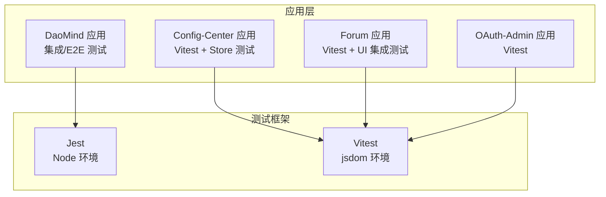
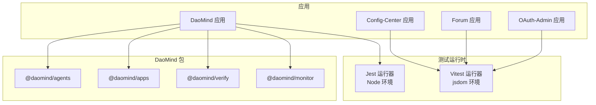
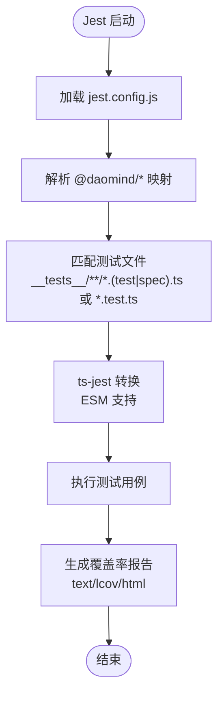
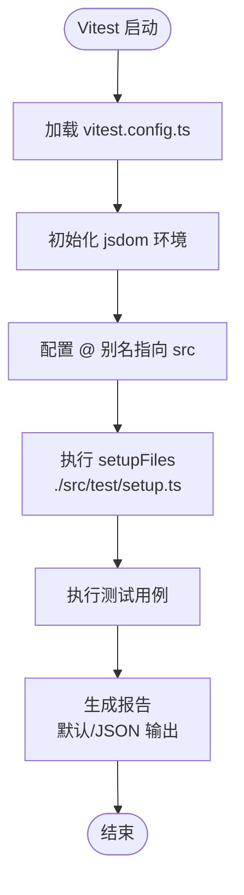
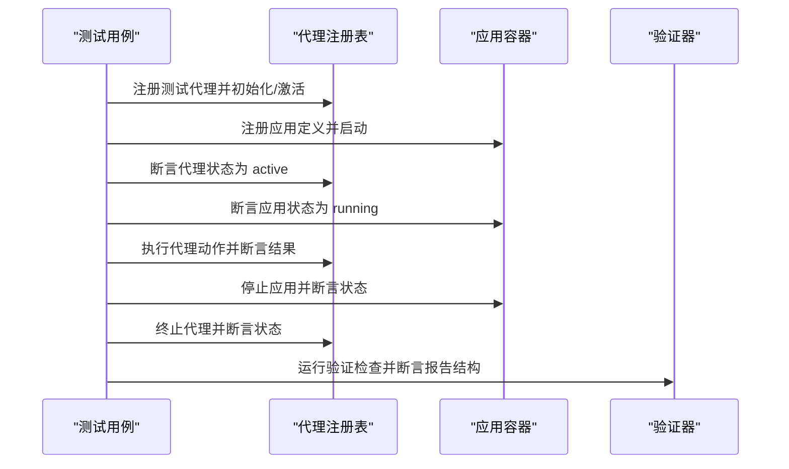
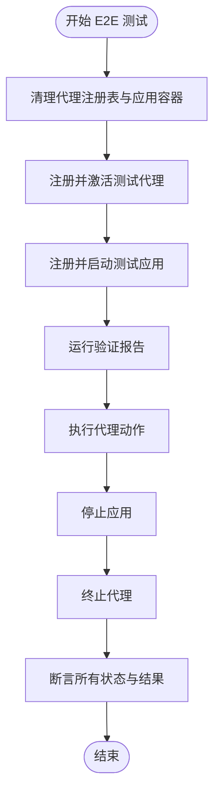
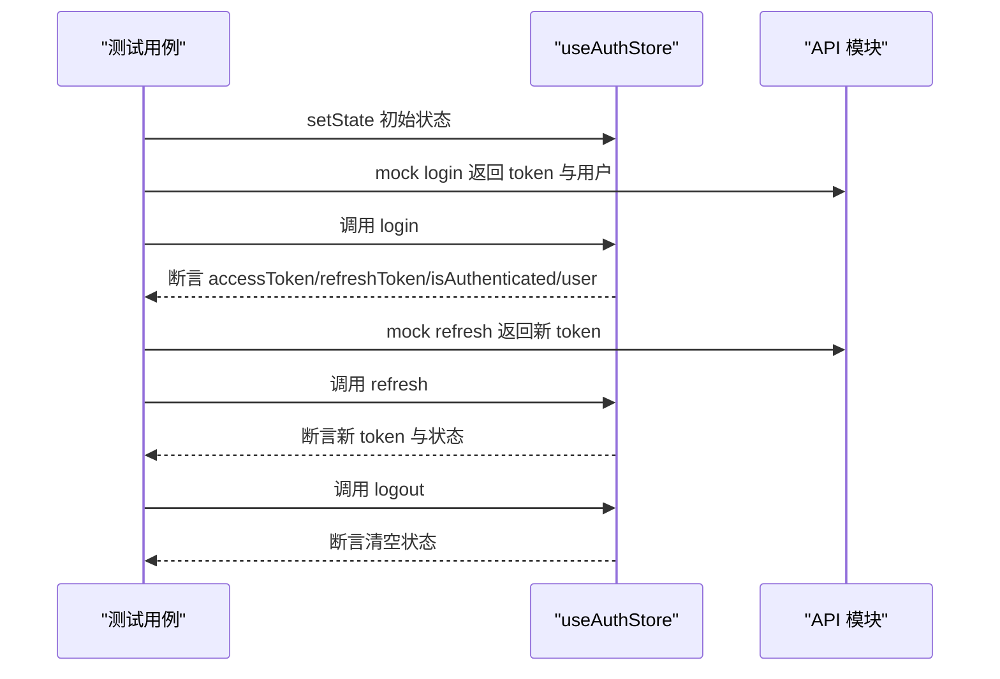
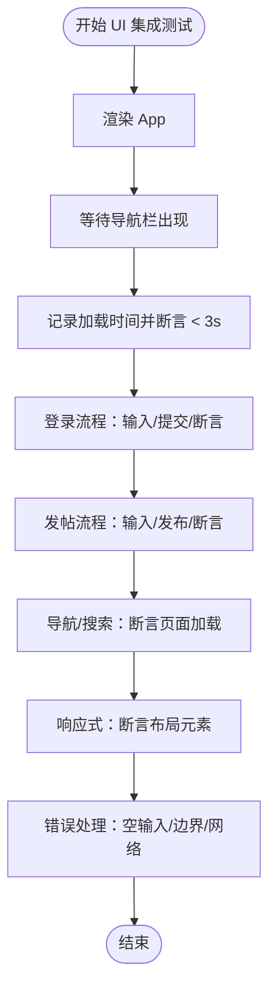
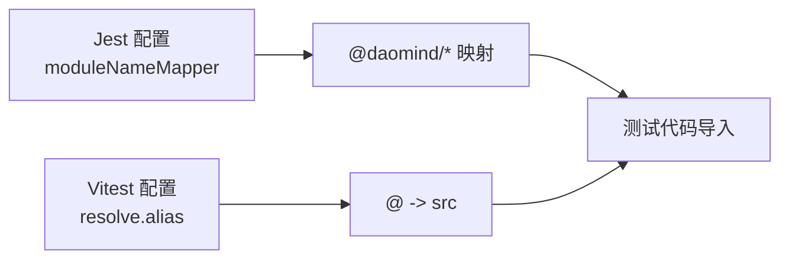

# 测试策略

<cite>
**本文引用的文件**
- [apps/DaoMind/jest.config.js](file://apps/DaoMind/jest.config.js)
- [apps/DaoMind/src/__tests__/integration/agents-apps-integration.test.ts](file://apps/DaoMind/src/__tests__/integration/agents-apps-integration.test.ts)
- [apps/DaoMind/src/__tests__/integration/verify-integration.test.ts](file://apps/DaoMind/src/__tests__/integration/verify-integration.test.ts)
- [apps/DaoMind/src/__tests__/e2e/full-system.test.ts](file://apps/DaoMind/src/__tests__/e2e/full-system.test.ts)
- [apps/DaoMind/tests/test-monitor-system.test.ts](file://apps/DaoMind/tests/test-monitor-system.test.ts)
- [apps/config-center/vitest.config.ts](file://apps/config-center/vitest.config.ts)
- [apps/config-center/src/store/authStore.test.ts](file://apps/config-center/src/store/authStore.test.ts)
- [apps/config-center/src/store/uiStore.test.ts](file://apps/config-center/src/store/uiStore.test.ts)
- [apps/forum/vitest.config.ts](file://apps/forum/vitest.config.ts)
- [apps/forum/src/test/integration.test.tsx](file://apps/forum/src/test/integration.test.tsx)
- [apps/forum/src/test/setup.ts](file://apps/forum/src/test/setup.ts)
- [apps/oauth-admin/vitest.config.ts](file://apps/oauth-admin/vitest.config.ts)
</cite>

## 目录
1. [引言](#引言)
2. [项目结构](#项目结构)
3. [核心组件](#核心组件)
4. [架构总览](#架构总览)
5. [详细组件分析](#详细组件分析)
6. [依赖分析](#依赖分析)
7. [性能考虑](#性能考虑)
8. [故障排查指南](#故障排查指南)
9. [结论](#结论)
10. [附录](#附录)

## 引言
本测试策略文档面向 DAO Collective 项目，聚焦于单元测试（Jest/Vitest）、集成测试与端到端测试（E2E）、性能测试与基准测试、测试用例编写规范、覆盖率与持续集成配置、子包测试结构与组织方式、调试技巧与常见问题。文档以仓库中实际存在的测试配置与用例为依据，提供可落地的实施建议与可视化图示。

## 项目结构
DAO Collective 采用多应用与多包混合的 monorepo 结构，测试配置与用例分布在多个子包中：
- 单元测试框架：Jest（Node 环境）用于 TypeScript 包的通用测试；Vitest（浏览器 DOM 环境）用于 React 应用的前端测试。
- 测试目录组织：部分应用采用 src/__tests__（集成/E2E），部分采用 src/test（集成/设置脚本）。
- 子包测试：config-center、forum、oauth-admin 等应用均配置了 Vitest，覆盖状态管理（store）与 UI 集成测试。

图表来源
- [apps/DaoMind/jest.config.js:1-59](file://apps/DaoMind/jest.config.js#L1-L59)
- [apps/config-center/vitest.config.ts:1-18](file://apps/config-center/vitest.config.ts#L1-L18)
- [apps/forum/vitest.config.ts:1-41](file://apps/forum/vitest.config.ts#L1-L41)
- [apps/oauth-admin/vitest.config.ts:1-18](file://apps/oauth-admin/vitest.config.ts#L1-L18)

章节来源
- [apps/DaoMind/jest.config.js:1-59](file://apps/DaoMind/jest.config.js#L1-L59)
- [apps/config-center/vitest.config.ts:1-18](file://apps/config-center/vitest.config.ts#L1-L18)
- [apps/forum/vitest.config.ts:1-41](file://apps/forum/vitest.config.ts#L1-L41)
- [apps/oauth-admin/vitest.config.ts:1-18](file://apps/oauth-admin/vitest.config.ts#L1-L18)

## 核心组件
- Jest 配置（Node 环境）
  - 收集覆盖率、匹配规则、模块映射、ESM 支持、超时等。
  - 适用于包级逻辑、服务端工具、监控系统等非 DOM 依赖场景。
- Vitest 配置（jsdom 环境）
  - React 插件、别名、setupFiles、覆盖率阈值、输出格式等。
  - 适用于前端组件、状态管理、UI 集成测试。
- 测试类型
  - 单元测试：对纯函数、类方法、工具函数进行隔离验证。
  - 集成测试：跨模块协作（如代理与应用容器、验证器）。
  - 端到端测试：完整业务闭环（从代理注册、应用启动到验证报告）。
  - 性能测试：页面加载时间、渲染性能、基准对比。

章节来源
- [apps/DaoMind/jest.config.js:1-59](file://apps/DaoMind/jest.config.js#L1-L59)
- [apps/config-center/vitest.config.ts:1-18](file://apps/config-center/vitest.config.ts#L1-L18)
- [apps/forum/vitest.config.ts:1-41](file://apps/forum/vitest.config.ts#L1-L41)

## 架构总览
下图展示测试体系在项目中的分布与交互关系：

图表来源
- [apps/DaoMind/src/__tests__/integration/agents-apps-integration.test.ts:1-113](file://apps/DaoMind/src/__tests__/integration/agents-apps-integration.test.ts#L1-L113)
- [apps/DaoMind/src/__tests__/integration/verify-integration.test.ts:1-45](file://apps/DaoMind/src/__tests__/integration/verify-integration.test.ts#L1-L45)
- [apps/DaoMind/src/__tests__/e2e/full-system.test.ts:1-120](file://apps/DaoMind/src/__tests__/e2e/full-system.test.ts#L1-L120)
- [apps/DaoMind/tests/test-monitor-system.test.ts:1-225](file://apps/DaoMind/tests/test-monitor-system.test.ts#L1-L225)

## 详细组件分析

### Jest 配置与使用（DaoMind 包）
- 关键点
  - preset: ts-jest
  - testEnvironment: node
  - collectCoverageFrom: packages/**/src/**/*.ts
  - coverageThreshold: 全局分支/函数/行/语句 80%
  - testMatch: 支持 __tests__ 与 *.test.*/*.spec.*
  - moduleNameMapper: 为 @daomind/* 包建立路径映射
  - ESM: useESM、extensionsToTreatAsEsm、globals.ts-jest.useESM
  - maxWorkers: 50%
  - testTimeout: 30000ms
- 适用范围
  - 包级逻辑、工具函数、监控系统（test-monitor-system.test.ts）等无需 DOM 的测试。

图表来源
- [apps/DaoMind/jest.config.js:1-59](file://apps/DaoMind/jest.config.js#L1-L59)

章节来源
- [apps/DaoMind/jest.config.js:1-59](file://apps/DaoMind/jest.config.js#L1-L59)
- [apps/DaoMind/tests/test-monitor-system.test.ts:1-225](file://apps/DaoMind/tests/test-monitor-system.test.ts#L1-L225)

### Vitest 配置与使用（Config-Center/Forum/OAuth-Admin）
- Config-Center
  - 环境: jsdom
  - 别名: @ -> src
  - setupFiles: ./src/test/setup.ts
  - globals: true
- Forum
  - 环境: jsdom
  - 覆盖率: text/html/json，阈值 80/80/80/80（lines/functions/branches/statements）
  - 输出: JSON 报告 ./test-results/results.json
  - setupFiles: ./src/test/setup.ts
  - testTimeout: 10000ms
  - 别名: @ -> src
- OAuth-Admin
  - 环境: jsdom
  - 别名: @ -> src
  - setupFiles: ./src/test/setup.ts
  - globals: true

图表来源
- [apps/config-center/vitest.config.ts:1-18](file://apps/config-center/vitest.config.ts#L1-L18)
- [apps/forum/vitest.config.ts:1-41](file://apps/forum/vitest.config.ts#L1-L41)
- [apps/oauth-admin/vitest.config.ts:1-18](file://apps/oauth-admin/vitest.config.ts#L1-L18)

章节来源
- [apps/config-center/vitest.config.ts:1-18](file://apps/config-center/vitest.config.ts#L1-L18)
- [apps/forum/vitest.config.ts:1-41](file://apps/forum/vitest.config.ts#L1-L41)
- [apps/oauth-admin/vitest.config.ts:1-18](file://apps/oauth-admin/vitest.config.ts#L1-L18)

### 集成测试设计（DaoMind）
- agents-apps-integration.test.ts
  - 场景：代理注册与激活、应用注册与启动、依赖关系校验、状态断言、停止与终止。
  - 关键断言：代理/应用状态、执行结果、依赖未就绪异常。
- verify-integration.test.ts
  - 场景：运行全部/指定分类验证、生成 Markdown/JSON 报告、字段类型与结构校验。

图表来源
- [apps/DaoMind/src/__tests__/integration/agents-apps-integration.test.ts:1-113](file://apps/DaoMind/src/__tests__/integration/agents-apps-integration.test.ts#L1-L113)
- [apps/DaoMind/src/__tests__/integration/verify-integration.test.ts:1-45](file://apps/DaoMind/src/__tests__/integration/verify-integration.test.ts#L1-L45)

章节来源
- [apps/DaoMind/src/__tests__/integration/agents-apps-integration.test.ts:1-113](file://apps/DaoMind/src/__tests__/integration/agents-apps-integration.test.ts#L1-L113)
- [apps/DaoMind/src/__tests__/integration/verify-integration.test.ts:1-45](file://apps/DaoMind/src/__tests__/integration/verify-integration.test.ts#L1-L45)

### 端到端测试（DaoMind）
- full-system.test.ts
  - 场景：完整系统流（代理注册/激活 → 应用注册/启动 → 验证报告 → 代理动作 → 应用停止 → 代理终止）
  - 错误处理：未注册应用启动、重复代理注册、特定验证类别运行。
- 设计原则
  - 隔离外部依赖（通过注册表/容器清理）
  - 分步骤断言（状态、结果、异常）
  - 可重复性（每次测试前清理）

图表来源
- [apps/DaoMind/src/__tests__/e2e/full-system.test.ts:1-120](file://apps/DaoMind/src/__tests__/e2e/full-system.test.ts#L1-L120)

章节来源
- [apps/DaoMind/src/__tests__/e2e/full-system.test.ts:1-120](file://apps/DaoMind/src/__tests__/e2e/full-system.test.ts#L1-L120)

### 性能测试与基准测试
- DaoMind 监控系统测试（test-monitor-system.test.ts）
  - 目标：验证监控引擎（仪表盘、热力图、向量场、告警、诊断、快照聚合）的创建、更新、查询与聚合能力。
  - 方法：构造随机系统指标，驱动引擎更新，断言输出结构与统计结果。
- Forum UI 自动化测试中的性能关注
  - 页面加载时间阈值（示例：3 秒内）
  - 使用 mock performance API 与 fetch，确保可重复性与可控性。
- 基准测试建议
  - 对热点路径（渲染、网络请求、计算密集型函数）建立基准用例，记录耗时并纳入 CI 报告。
  - 使用 Vitest 的计时与性能标记（performance.mark/measure）进行微基准采集。

章节来源
- [apps/DaoMind/tests/test-monitor-system.test.ts:1-225](file://apps/DaoMind/tests/test-monitor-system.test.ts#L1-L225)
- [apps/forum/src/test/integration.test.tsx:1-371](file://apps/forum/src/test/integration.test.tsx#L1-L371)

### 测试用例编写指南与最佳实践
- 命名与分组
  - 使用语义化描述，按 describe.it 层级组织。
- 断言
  - 明确断言目标（状态、结果、异常），避免模糊断言。
- 模拟与隔离
  - 使用 vi.mock 与 vi.fn 模拟外部依赖（API、定时器、性能接口）。
  - 在 beforeEach 中重置状态与清理副作用。
- 异步测试
  - 使用 async/await 与 waitFor，合理设置超时。
- 覆盖率
  - Jest/Vitest 均支持阈值配置，建议统一 80%/80%/80%/80%（行/函数/分支/语句）。

章节来源
- [apps/config-center/src/store/authStore.test.ts:1-159](file://apps/config-center/src/store/authStore.test.ts#L1-L159)
- [apps/config-center/src/store/uiStore.test.ts:1-42](file://apps/config-center/src/store/uiStore.test.ts#L1-L42)
- [apps/forum/src/test/integration.test.tsx:1-371](file://apps/forum/src/test/integration.test.tsx#L1-L371)

### 子包测试结构与组织方式
- DaoMind
  - src/__tests__/integration：集成测试（代理/应用/验证）
  - src/__tests__/e2e：端到端测试（完整系统流）
  - tests：Node 环境下的系统监控测试
- Config-Center
  - src/store/*.test.ts：状态管理（Zustand）单元测试
  - vitest.config.ts：jsdom 环境、别名、setupFiles
- Forum
  - src/test/integration.test.tsx：UI 集成测试（登录、发帖、导航、响应式）
  - src/test/setup.ts：全局环境模拟（localStorage/sessionStorage/matchMedia/location）
- OAuth-Admin
  - vitest.config.ts：jsdom 环境、别名、setupFiles

章节来源
- [apps/DaoMind/src/__tests__/integration/agents-apps-integration.test.ts:1-113](file://apps/DaoMind/src/__tests__/integration/agents-apps-integration.test.ts#L1-L113)
- [apps/DaoMind/src/__tests__/e2e/full-system.test.ts:1-120](file://apps/DaoMind/src/__tests__/e2e/full-system.test.ts#L1-L120)
- [apps/DaoMind/tests/test-monitor-system.test.ts:1-225](file://apps/DaoMind/tests/test-monitor-system.test.ts#L1-L225)
- [apps/config-center/src/store/authStore.test.ts:1-159](file://apps/config-center/src/store/authStore.test.ts#L1-L159)
- [apps/config-center/src/store/uiStore.test.ts:1-42](file://apps/config-center/src/store/uiStore.test.ts#L1-L42)
- [apps/forum/src/test/integration.test.tsx:1-371](file://apps/forum/src/test/integration.test.tsx#L1-L371)
- [apps/forum/src/test/setup.ts:1-79](file://apps/forum/src/test/setup.ts#L1-L79)
- [apps/oauth-admin/vitest.config.ts:1-18](file://apps/oauth-admin/vitest.config.ts#L1-L18)

### 状态管理测试（Config-Center Store）
- authStore.test.ts
  - 模拟 API：login、refreshToken、getMe
  - 场景：登录成功/失败、登出、刷新令牌成功/失败、权限判断
- uiStore.test.ts
  - 场景：侧边栏开关、设置指定状态、恢复默认状态

图表来源
- [apps/config-center/src/store/authStore.test.ts:1-159](file://apps/config-center/src/store/authStore.test.ts#L1-L159)

章节来源
- [apps/config-center/src/store/authStore.test.ts:1-159](file://apps/config-center/src/store/authStore.test.ts#L1-L159)
- [apps/config-center/src/store/uiStore.test.ts:1-42](file://apps/config-center/src/store/uiStore.test.ts#L1-L42)

### UI 集成测试（Forum）
- integration.test.tsx
  - 页面加载性能：3 秒阈值
  - 登录流程：输入用户名/密码、提交、断言欢迎信息
  - 表单提交：发帖标题/内容、发布、断言成功
  - 导航与搜索：点击导航、断言搜索页加载
  - 响应式布局：模拟不同屏幕尺寸，断言布局元素存在
  - 错误处理：空输入、边界长度、网络错误
- setup.ts
  - matchMedia、localStorage、sessionStorage、location 的模拟

图表来源
- [apps/forum/src/test/integration.test.tsx:1-371](file://apps/forum/src/test/integration.test.tsx#L1-L371)
- [apps/forum/src/test/setup.ts:1-79](file://apps/forum/src/test/setup.ts#L1-L79)

章节来源
- [apps/forum/src/test/integration.test.tsx:1-371](file://apps/forum/src/test/integration.test.tsx#L1-L371)
- [apps/forum/src/test/setup.ts:1-79](file://apps/forum/src/test/setup.ts#L1-L79)

## 依赖分析
- 模块映射与路径别名
  - Jest 通过 moduleNameMapper 为 @daomind/* 包建立映射，便于在测试中直接导入内部包。
  - Vitest 通过 resolve.alias 配置 @ -> src，简化组件与 API 的导入路径。
- 测试耦合与解耦
  - 通过模拟外部依赖（API、性能接口、全局对象）降低测试耦合。
  - 在集成/E2E 测试中，先清理注册表/容器，保证测试独立性。

图表来源
- [apps/DaoMind/jest.config.js:23-29](file://apps/DaoMind/jest.config.js#L23-L29)
- [apps/config-center/vitest.config.ts:7-11](file://apps/config-center/vitest.config.ts#L7-L11)
- [apps/forum/vitest.config.ts:35-39](file://apps/forum/vitest.config.ts#L35-L39)

章节来源
- [apps/DaoMind/jest.config.js:23-29](file://apps/DaoMind/jest.config.js#L23-L29)
- [apps/config-center/vitest.config.ts:7-11](file://apps/config-center/vitest.config.ts#L7-L11)
- [apps/forum/vitest.config.ts:35-39](file://apps/forum/vitest.config.ts#L35-L39)

## 性能考虑
- 页面加载性能
  - 使用测试中的时间测量与阈值断言，确保关键路径在可接受范围内。
- 计算密集型路径
  - 对监控系统与数据聚合逻辑建立基准用例，记录耗时并纳入 CI 报告。
- 环境模拟
  - 通过 mock performance API 与 fetch，消除真实环境波动对测试的影响。

章节来源
- [apps/forum/src/test/integration.test.tsx:32-48](file://apps/forum/src/test/integration.test.tsx#L32-L48)
- [apps/DaoMind/tests/test-monitor-system.test.ts:1-225](file://apps/DaoMind/tests/test-monitor-system.test.ts#L1-L225)

## 故障排查指南
- 常见问题
  - 模块解析失败：确认 moduleNameMapper 与 resolve.alias 是否正确映射到源码路径。
  - DOM 环境缺失：Node 环境测试请使用 Jest；React 组件测试请使用 Vitest 并启用 jsdom。
  - 覆盖率不达标：补充单元测试与边界条件测试，提升分支/语句覆盖。
  - 异步测试不稳定：使用 waitFor 与合理超时，避免 race condition。
- 调试技巧
  - 在 setupFiles 中注入日志或断点（如 Vitest 的 vi.spyOn）。
  - 使用 JSON 报告（Vitest）定位失败用例与参数。
  - 对模拟函数使用 vi.mocked 获取类型安全的 mock 实例，便于断言调用次数与参数。

章节来源
- [apps/DaoMind/jest.config.js:35-55](file://apps/DaoMind/jest.config.js#L35-L55)
- [apps/forum/vitest.config.ts:21-30](file://apps/forum/vitest.config.ts#L21-L30)
- [apps/config-center/src/store/authStore.test.ts:13-15](file://apps/config-center/src/store/authStore.test.ts#L13-L15)

## 结论
DAO Collective 的测试策略以 Jest/Vitest 为核心，结合集成与端到端测试覆盖关键业务闭环，并通过状态管理与 UI 集成测试保障前端稳定性。建议在现有基础上完善覆盖率阈值、引入基准测试与 CI 报告，持续优化测试执行效率与可维护性。

## 附录
- 测试覆盖率要求（建议）
  - 行/函数/分支/语句：80%/80%/80%/80%
  - 覆盖率报告：text、lcov、html（Jest）与 text/html/json（Vitest）
- 持续集成配置（建议）
  - 单元测试：Jest/Vitest 分别执行对应包/应用
  - 集成/E2E：DaoMind 的集成与端到端测试单独执行
  - 报告：上传覆盖率与 JSON 报告至 CI 平台
- 测试数据与模拟
  - 使用 vi.mock 与 mockResolvedValue/mockRejectedValue
  - 在 setupFiles 中统一注入全局模拟（localStorage、sessionStorage、matchMedia、location）
- 异步测试处理
  - 使用 async/await 与 waitFor，配合合理的 testTimeout