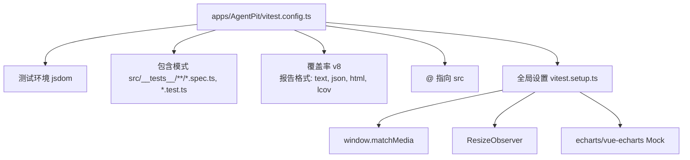
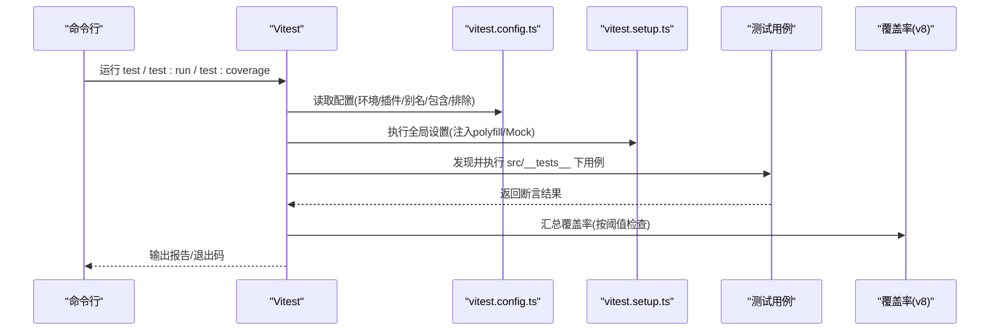
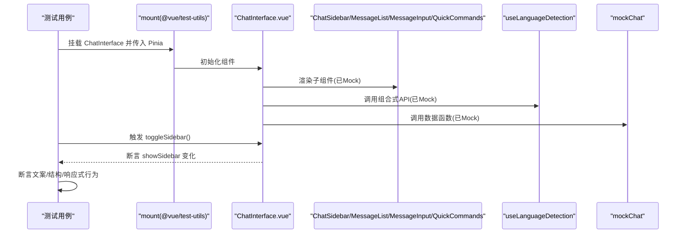
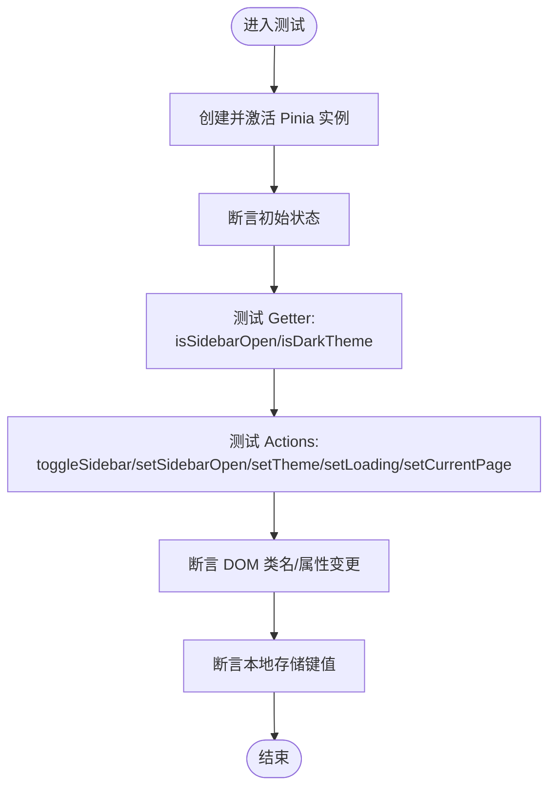
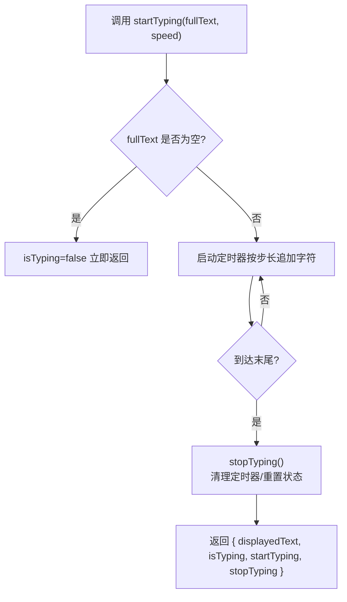
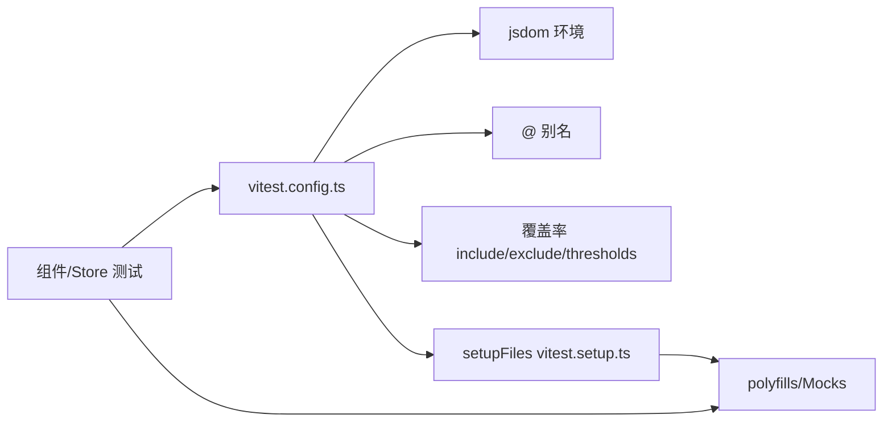

# 单元测试

<cite>
**本文引用的文件**
- [vitest.config.ts](file://apps/AgentPit/vitest.config.ts)
- [vitest.setup.ts](file://apps/AgentPit/vitest.setup.ts)
- [package.json](file://apps/AgentPit/package.json)
- [ChatInterface.spec.ts](file://apps/AgentPit/src/__tests__/components/chat/ChatInterface.spec.ts)
- [useAppStore.spec.ts](file://apps/AgentPit/src/__tests__/stores/useAppStore.spec.ts)
- [useTypewriter.ts](file://apps/AgentPit/src/composables/useTypewriter.ts)
- [useAppStore.ts](file://apps/AgentPit/src/stores/useAppStore.ts)
</cite>

## 目录
1. [简介](#简介)
2. [项目结构](#项目结构)
3. [核心组件](#核心组件)
4. [架构总览](#架构总览)
5. [详细组件分析](#详细组件分析)
6. [依赖关系分析](#依赖关系分析)
7. [性能考量](#性能考量)
8. [故障排查指南](#故障排查指南)
9. [结论](#结论)
10. [附录](#附录)

## 简介
本文件面向 DAOApps 项目的单元测试体系，聚焦 Vitest 测试框架在 Vue 3 + Pinia 组合式应用中的配置与实践，涵盖测试环境设置、覆盖率配置、测试文件组织、组件测试策略（快照、交互、属性）、store 测试（含 Pinia 状态管理与异步操作）、组合式 API 测试（自定义 Hook）以及 Mock 数据与测试工具函数的使用，并给出覆盖率阈值与持续集成中的测试执行建议。

## 项目结构
- 测试运行器：Vitest
- 测试环境：jsdom（DOM 模拟）
- 包装工具：@vue/test-utils
- 状态管理：Pinia
- 覆盖率：v8 提供者，支持文本、JSON、HTML、LCOV 报表
- 别名：通过 @ 指向 src 目录
- 全局设置：统一注入匹配媒体查询、ResizeObserver、图表库等浏览器特性

**图示来源**
- [vitest.config.ts:1-48](file://apps/AgentPit/vitest.config.ts#L1-L48)
- [vitest.setup.ts:1-47](file://apps/AgentPit/vitest.setup.ts#L1-L47)

**章节来源**
- [vitest.config.ts:1-48](file://apps/AgentPit/vitest.config.ts#L1-L48)
- [vitest.setup.ts:1-47](file://apps/AgentPit/vitest.setup.ts#L1-L47)
- [package.json:16-18](file://apps/AgentPit/package.json#L16-L18)

## 核心组件
- 测试配置与环境
  - 使用 jsdom 作为 DOM 环境，确保在 Node 中可渲染 Vue 组件
  - 通过 setupFiles 注入全局 polyfill 与 Mock（如 matchMedia、ResizeObserver、echarts）
  - 配置别名 @ 指向 src，便于 import 路径简化
- 覆盖率策略
  - 覆盖范围：组件、store、composables、utils
  - 排除：类型声明、mock 数据、入口文件、索引导出文件
  - 阈值：行 80%，函数 80%，分支 75%，语句 80%
- 测试脚本
  - test、test:run、test:coverage 命令分别用于交互式、批量运行与生成覆盖率

**章节来源**
- [vitest.config.ts:7-41](file://apps/AgentPit/vitest.config.ts#L7-L41)
- [vitest.setup.ts:3-46](file://apps/AgentPit/vitest.setup.ts#L3-L46)
- [package.json:16-18](file://apps/AgentPit/package.json#L16-L18)

## 架构总览
下图展示测试运行时的关键交互：Vitest 启动 -> 加载配置与全局设置 -> 执行测试用例 -> 生成覆盖率报告。

**图示来源**
- [vitest.config.ts:5-47](file://apps/AgentPit/vitest.config.ts#L5-L47)
- [vitest.setup.ts:1-47](file://apps/AgentPit/vitest.setup.ts#L1-L47)
- [package.json:16-18](file://apps/AgentPit/package.json#L16-L18)

## 详细组件分析

### 组件测试策略：ChatInterface 示例
- 快照与结构验证
  - 通过挂载组件并断言存在性，验证子组件是否正确渲染
  - 断言包含关键文案，覆盖桌面/移动端头部差异
- 交互测试
  - 通过调用组件实例方法触发行为（如切换侧边栏），断言状态变化
  - 使用 flushPromises 与 $nextTick 确保异步更新完成
- 属性与上下文
  - 通过修改 window.innerWidth 控制 isMobile 分支
  - Mock 子组件与组合式 API，隔离外部依赖
- Mock 策略
  - 子组件：以最小模板与 data-testid 替身替代
  - 组合式 API：返回 ref 值与函数 Mock
  - 数据模块：Mock 导出函数以控制返回值

**图示来源**
- [ChatInterface.spec.ts:1-172](file://apps/AgentPit/src/__tests__/components/chat/ChatInterface.spec.ts#L1-L172)

**章节来源**
- [ChatInterface.spec.ts:1-172](file://apps/AgentPit/src/__tests__/components/chat/ChatInterface.spec.ts#L1-L172)

### Store 测试：useAppStore
- 状态初始化
  - 断言初始状态字段（如 sidebarOpen、theme、isLoading、currentPage）
- Getter 行为
  - isSidebarOpen 直接映射 state
  - isDarkTheme 依据 theme 与 window.matchMedia 结果判断
- Action 行为
  - toggleSidebar/setSidebarOpen：切换/设置侧边栏状态
  - setTheme：更新主题并写入本地存储，同时应用到 documentElement
  - setLoading/setCurrentPage：更新加载态与当前页面
- 覆盖范围
  - 通过 Vitest 配置对 stores/*.ts 生效，确保 store 行为被统计

**图示来源**
- [useAppStore.spec.ts:1-105](file://apps/AgentPit/src/__tests__/stores/useAppStore.spec.ts#L1-L105)
- [useAppStore.ts:11-89](file://apps/AgentPit/src/stores/useAppStore.ts#L11-L89)

**章节来源**
- [useAppStore.spec.ts:1-105](file://apps/AgentPit/src/__tests__/stores/useAppStore.spec.ts#L1-L105)
- [useAppStore.ts:11-89](file://apps/AgentPit/src/stores/useAppStore.ts#L11-L89)

### 组合式 API 测试：useTypewriter
- 行为要点
  - startTyping：基于随机步进与速度参数逐步追加字符，维护 isTyping 状态
  - stopTyping：清理定时器并重置状态
  - onUnmounted：组件卸载时自动停止打字
- 测试策略
  - 通过替换定时器实现或使用 advanceTimers（如 Jest）模拟时间推进
  - 断言 displayedText 与 isTyping 的变化序列
  - 在组件中使用该组合式的场景下，结合 @vue/test-utils 断言渲染效果

**图示来源**
- [useTypewriter.ts:1-53](file://apps/AgentPit/src/composables/useTypewriter.ts#L1-L53)

**章节来源**
- [useTypewriter.ts:1-53](file://apps/AgentPit/src/composables/useTypewriter.ts#L1-L53)

### Mock 数据与测试工具
- 全局 Mock
  - echarts 与 vue-echarts：Mock 初始化与渲染接口，避免真实 DOM 与图表初始化开销
- 组件级 Mock
  - 将复杂子组件替换为轻量模板与 data-testid，便于断言结构与交互
- 工具函数与数据模块
  - 对外依赖的数据函数进行 Mock，保证测试确定性与可控性
- 全局 polyfill
  - matchMedia、ResizeObserver：解决浏览器特性缺失导致的渲染问题

**章节来源**
- [vitest.setup.ts:3-46](file://apps/AgentPit/vitest.setup.ts#L3-L46)
- [ChatInterface.spec.ts:7-51](file://apps/AgentPit/src/__tests__/components/chat/ChatInterface.spec.ts#L7-L51)

## 依赖关系分析
- 测试配置对覆盖率的影响
  - include/exclude 决定哪些源码参与覆盖率统计
  - thresholds 定义最低标准，CI 中可据此失败构建
- 组件与 store 的耦合
  - 组件通过 Pinia 获取状态与动作；store 依赖 window.matchMedia 与本地存储
  - 测试中通过 Mock 与 setupFiles 解耦外部依赖
- 工具链
  - Vitest + @vue/test-utils + jsdom + v8 覆盖率

**图示来源**
- [vitest.config.ts:5-47](file://apps/AgentPit/vitest.config.ts#L5-L47)
- [vitest.setup.ts:1-47](file://apps/AgentPit/vitest.setup.ts#L1-L47)

**章节来源**
- [vitest.config.ts:11-36](file://apps/AgentPit/vitest.config.ts#L11-L36)
- [vitest.setup.ts:3-46](file://apps/AgentPit/vitest.setup.ts#L3-L46)

## 性能考量
- 测试执行效率
  - 使用 Mock 减少真实 DOM 与第三方库初始化成本
  - 通过 @vue/test-utils 的 shallowMount 与局部挂载减少渲染树深度
- 覆盖率统计
  - 合理设置 include/exclude，避免统计无关文件
  - 适度提高阈值可提升代码质量，但需平衡 CI 通过率与实际收益
- 异步处理
  - 使用 flushPromises/$nextTick 确保异步更新稳定断言
  - 对定时器类逻辑（如 useTypewriter）采用时间推进策略

## 故障排查指南
- 常见问题与对策
  - 缺失浏览器特性：确认 vitest.setup.ts 已注入 matchMedia、ResizeObserver
  - 图表组件报错：确认 echarts/vue-echarts 已被 Mock
  - DOM 类名不更新：检查 store 中 applyTheme 是否被调用，以及 documentElement 操作
  - 覆盖率不达标：核对 include/exclude 与阈值设置，补充针对 store/composables/utils 的用例
- CI 中的执行
  - 使用 test:coverage 命令生成 LCOV 报告，结合平台覆盖率插件查看趋势
  - 若阈值未满足，优先补齐关键路径用例（状态切换、主题切换、交互流程）

**章节来源**
- [vitest.setup.ts:3-46](file://apps/AgentPit/vitest.setup.ts#L3-L46)
- [useAppStore.spec.ts:72-82](file://apps/AgentPit/src/__tests__/stores/useAppStore.spec.ts#L72-L82)
- [package.json:16-18](file://apps/AgentPit/package.json#L16-L18)

## 结论
DAOApps 项目基于 Vitest 的单元测试体系具备完善的环境与覆盖率配置，配合 @vue/test-utils 与 Pinia，能够高效验证组件行为、store 状态与组合式 API 的逻辑。通过合理的 Mock 策略与全局设置，测试具备高稳定性与可维护性。建议在 CI 中强制执行覆盖率阈值，并持续扩展关键业务路径的用例，以保障代码质量与演进安全。

## 附录

### 测试文件组织建议
- 组件测试：src/__tests__/components/<模块>/<组件>.spec.ts
- 组合式 API 测试：src/__tests__/composables/<hook>.spec.ts
- Store 测试：src/__tests__/stores/<store>.spec.ts
- 数据与工具：src/__tests__/data/<module>.spec.ts

### 覆盖率阈值参考
- 行数：80%
- 函数：80%
- 分支：75%
- 语句：80%

### 持续集成中的测试执行
- 建议步骤
  - 安装依赖后执行：npm run test:coverage
  - 上传 LCOV 报告至平台（如 Codecov/GitHub Actions）
  - 设置 PR 最低覆盖率阈值，防止低于标准的变更合并

**章节来源**
- [vitest.config.ts:30-35](file://apps/AgentPit/vitest.config.ts#L30-L35)
- [package.json:16-18](file://apps/AgentPit/package.json#L16-L18)