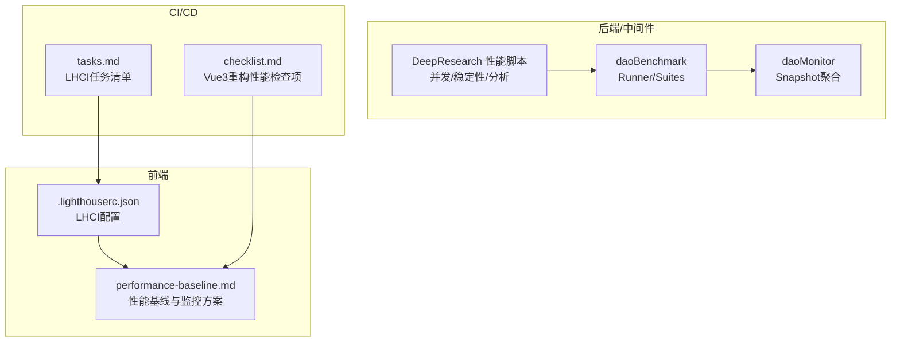
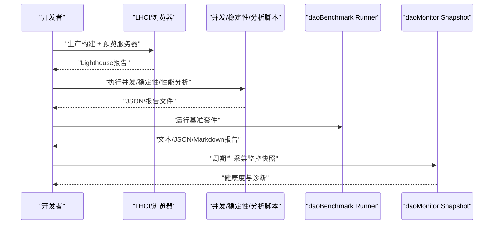
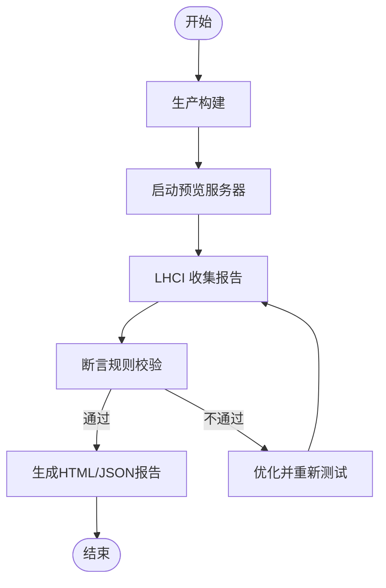
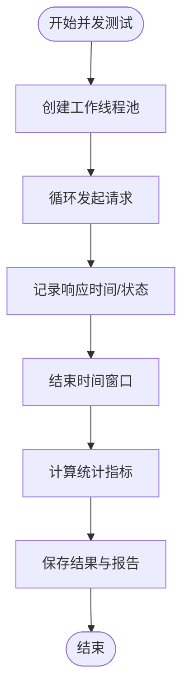
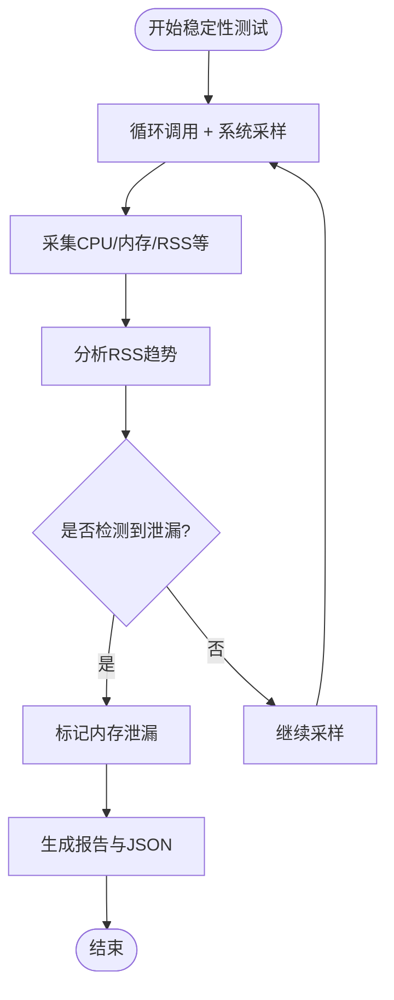
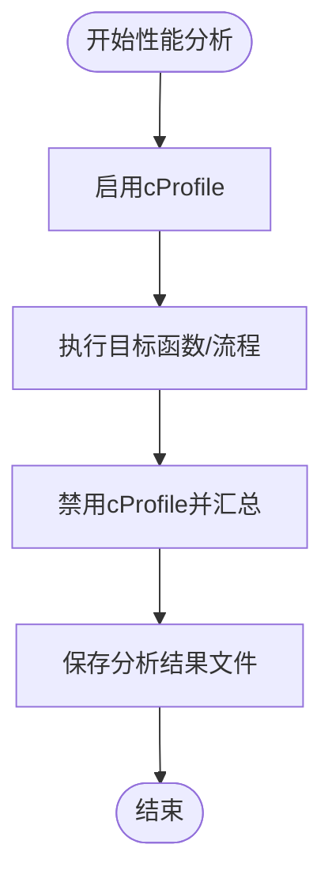
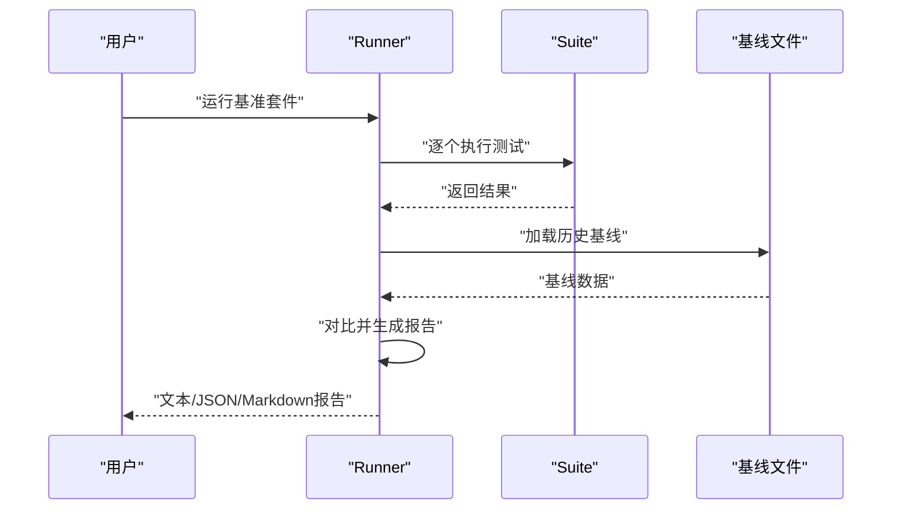
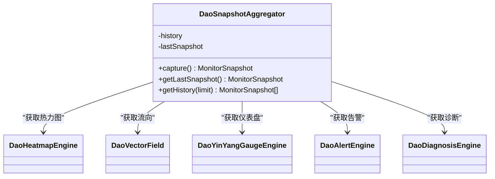
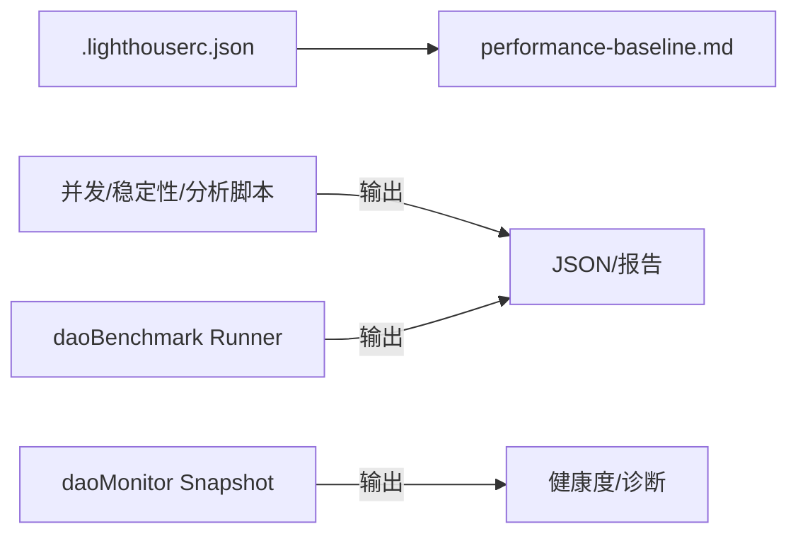

# 性能测试

<cite>
**本文引用的文件**
- [.lighthouserc.json](file://apps/AgentPit/.lighthouserc.json)
- [concurrency_test.py](file://tools/DeepResearch/tests/performance/concurrency_test.py)
- [stability_test.py](file://tools/DeepResearch/tests/performance/stability_test.py)
- [performance_analysis.py](file://tools/DeepResearch/tests/performance_analysis.py)
- [perf_remote_bench.py](file://tools/flexloop/tests/testing/perf_remote_bench.py)
- [latency.ts](file://apps/DaoMind/packages/daoBenchmark/src/suites/latency.ts)
- [runner.ts](file://apps/DaoMind/packages/daoBenchmark/src/runner.ts)
- [snapshot.ts](file://apps/DaoMind/packages/daoMonitor/src/snapshot.ts)
- [performance-baseline.md](file://.trae/docs/performance-baseline.md)
- [tasks.md](file://.trae/specs/agentpit-performance-cd/tasks.md)
- [checklist.md](file://.trae/specs/agentpit-vue3-rewrite/checklist.md)
</cite>

## 目录
1. [引言](#引言)
2. [项目结构](#项目结构)
3. [核心组件](#核心组件)
4. [架构总览](#架构总览)
5. [详细组件分析](#详细组件分析)
6. [依赖关系分析](#依赖关系分析)
7. [性能考量](#性能考量)
8. [故障排查指南](#故障排查指南)
9. [结论](#结论)
10. [附录](#附录)

## 引言
本文件面向DAOApps项目，系统化地构建性能测试体系，覆盖前端性能测试（Lighthouse、Web Vitals、用户体验指标）、后端性能测试（API响应时间、数据库查询优化、资源使用监控）、并发与稳定性测试、基准测试与回归检测、以及负载/压力/容量规划策略。文档以仓库内现有配置与脚本为基础，结合最佳实践，提供可操作的测试流程、工具使用方法与报告生成规范。

## 项目结构
DAOApps包含多个子应用与工具模块，性能测试相关的关键位置如下：
- 前端性能：AgentPit应用内置Lighthouse CI配置，配套性能基线文档与CI流水线任务清单
- 后端/中间件性能：DaoMind的daoBenchmark提供多种性能测试套件；DaoMonitor提供运行时监控聚合
- 研发工具：DeepResearch提供并发、稳定性与性能分析脚本；flexloop提供远程模块性能基准测试

**图表来源**
- [performance-baseline.md:152-205](file://.trae/docs/performance-baseline.md#L152-L205)
- [tasks.md:1-32](file://.trae/specs/agentpit-performance-cd/tasks.md#L1-L32)
- [checklist.md:322-334](file://.trae/specs/agentpit-vue3-rewrite/checklist.md#L322-L334)

**章节来源**
- [performance-baseline.md:1-335](file://.trae/docs/performance-baseline.md#L1-L335)
- [tasks.md:1-32](file://.trae/specs/agentpit-performance-cd/tasks.md#L1-L32)
- [checklist.md:322-334](file://.trae/specs/agentpit-vue3-rewrite/checklist.md#L322-L334)

## 核心组件
- 前端性能测试框架
  - Lighthouse CI配置与断言：定义性能、可访问性、最佳实践、SEO等类别阈值，支持本地预览服务器启动与多次采集
  - Web Vitals实时监控：基于PerformanceObserver采集FCP/LCP/CLS等指标
  - 性能基线文档：包含Core Web Vitals目标、Bundle Size预算、优化措施与对比分析
- 并发与稳定性测试
  - 并发测试：多线程模拟并发用户，统计响应时间、吞吐量、成功率
  - 稳定性测试：长期运行监控CPU/内存/RSS，检测内存泄漏趋势
  - 性能分析：使用cProfile定位热点函数
- 基准测试与回归检测
  - daoBenchmark：启动时间、内存占用、吞吐量、反馈回路延迟、收敛时间、打包大小等套件
  - 回归检测：与历史基线对比，识别性能退化
- 运行时监控
  - daoMonitor：聚合热力图、流向向量、仪表盘、告警与诊断，形成健康度快照

**章节来源**
- [.lighthouserc.json:1-24](file://apps/AgentPit/.lighthouserc.json#L1-L24)
- [performance-baseline.md:209-250](file://.trae/docs/performance-baseline.md#L209-L250)
- [concurrency_test.py:1-184](file://tools/DeepResearch/tests/performance/concurrency_test.py#L1-L184)
- [stability_test.py:1-314](file://tools/DeepResearch/tests/performance/stability_test.py#L1-L314)
- [performance_analysis.py:1-49](file://tools/DeepResearch/tests/performance_analysis.py#L1-L49)
- [latency.ts:1-97](file://apps/DaoMind/packages/daoBenchmark/src/suites/latency.ts#L1-L97)
- [runner.ts:1-248](file://apps/DaoMind/packages/daoBenchmark/src/runner.ts#L1-L248)
- [snapshot.ts:1-76](file://apps/DaoMind/packages/daoMonitor/src/snapshot.ts#L1-L76)

## 架构总览
下图展示从测试执行到报告生成与监控的端到端流程：

**图表来源**
- [performance-baseline.md:190-205](file://.trae/docs/performance-baseline.md#L190-L205)
- [concurrency_test.py:163-184](file://tools/DeepResearch/tests/performance/concurrency_test.py#L163-L184)
- [stability_test.py:296-314](file://tools/DeepResearch/tests/performance/stability_test.py#L296-L314)
- [performance_analysis.py:16-48](file://tools/DeepResearch/tests/performance_analysis.py#L16-L48)
- [runner.ts:26-121](file://apps/DaoMind/packages/daoBenchmark/src/runner.ts#L26-L121)
- [snapshot.ts:22-59](file://apps/DaoMind/packages/daoMonitor/src/snapshot.ts#L22-L59)

## 详细组件分析

### 前端性能测试（Lighthouse + Web Vitals）
- Lighthouse CI配置要点
  - 收集：本地预览服务器URL、采集次数、预设桌面环境与节流参数
  - 断言：性能、可访问性、最佳实践、SEO等类别阈值；Core Web Vitals数值上限断言
  - 上传：临时存储目标
- Web Vitals监控
  - 使用PerformanceObserver采集FCP/LCP/CLS，便于线上实时观测
- 性能基线与检查项
  - 提供Core Web Vitals目标、Lighthouse分数目标、Bundle Size预算
  - CI/CD任务清单与Vue3重构检查项明确Lighthouse执行与指标达标要求

**图表来源**
- [performance-baseline.md:152-205](file://.trae/docs/performance-baseline.md#L152-L205)
- [.lighthouserc.json:1-24](file://apps/AgentPit/.lighthouserc.json#L1-L24)

**章节来源**
- [.lighthouserc.json:1-24](file://apps/AgentPit/.lighthouserc.json#L1-L24)
- [performance-baseline.md:152-205](file://.trae/docs/performance-baseline.md#L152-L205)
- [performance-baseline.md:209-250](file://.trae/docs/performance-baseline.md#L209-L250)
- [tasks.md:1-32](file://.trae/specs/agentpit-performance-cd/tasks.md#L1-L32)
- [checklist.md:322-334](file://.trae/specs/agentpit-vue3-rewrite/checklist.md#L322-L334)

### 并发测试（并发用户、吞吐量、成功率）
- 测试模型
  - 多线程模拟并发用户，定时循环发起请求，统计响应时间分布、吞吐量、成功率
- 指标产出
  - 平均/最大/最小响应时间、标准差、吞吐量（请求/秒）、成功/失败计数
- 报告生成
  - 保存JSON结果与Markdown报告，便于趋势分析与对比

**图表来源**
- [concurrency_test.py:42-115](file://tools/DeepResearch/tests/performance/concurrency_test.py#L42-L115)

**章节来源**
- [concurrency_test.py:1-184](file://tools/DeepResearch/tests/performance/concurrency_test.py#L1-L184)

### 稳定性测试（长期运行、CPU/内存监控、内存泄漏检测）
- 监控维度
  - CPU使用率、内存使用率、RSS/VMS、磁盘/网络IO
- 泄漏检测
  - 基于RSS趋势判断是否存在内存泄漏
- 指标产出
  - 响应时间统计、CPU/内存统计、内存泄漏判定、报告与JSON数据

**图表来源**
- [stability_test.py:62-222](file://tools/DeepResearch/tests/performance/stability_test.py#L62-L222)

**章节来源**
- [stability_test.py:1-314](file://tools/DeepResearch/tests/performance/stability_test.py#L1-L314)

### 性能分析（热点定位与优化方向）
- 方法
  - 使用cProfile对关键路径进行采样，输出排序后的热点函数统计
- 输出
  - 性能分析结果文件，指导后续优化

**图表来源**
- [performance_analysis.py:16-44](file://tools/DeepResearch/tests/performance_analysis.py#L16-L44)

**章节来源**
- [performance_analysis.py:1-49](file://tools/DeepResearch/tests/performance_analysis.py#L1-L49)

### 基准测试与回归检测（daoBenchmark）
- 套件覆盖
  - 启动时间、内存占用、吞吐量、反馈回路延迟、收敛时间、打包大小
- 执行与报告
  - 支持全量/快速套件执行，生成文本/JSON/Markdown报告
- 回归检测
  - 与历史基线对比，识别超过阈值的退化并给出建议

**图表来源**
- [runner.ts:26-121](file://apps/DaoMind/packages/daoBenchmark/src/runner.ts#L26-L121)
- [latency.ts:34-96](file://apps/DaoMind/packages/daoBenchmark/src/suites/latency.ts#L34-L96)

**章节来源**
- [runner.ts:1-248](file://apps/DaoMind/packages/daoBenchmark/src/runner.ts#L1-L248)
- [latency.ts:1-97](file://apps/DaoMind/packages/daoBenchmark/src/suites/latency.ts#L1-L97)

### 运行时监控（daoMonitor）
- 能力
  - 聚合热力图、流向向量、仪表盘、告警与诊断，计算系统健康度
  - 历史快照管理，支持获取最近N条快照
- 应用
  - 作为性能回归检测与问题定位的辅助手段

**图表来源**
- [snapshot.ts:10-59](file://apps/DaoMind/packages/daoMonitor/src/snapshot.ts#L10-L59)

**章节来源**
- [snapshot.ts:1-76](file://apps/DaoMind/packages/daoMonitor/src/snapshot.ts#L1-L76)

## 依赖关系分析
- 前端性能测试依赖
  - LHCI配置依赖预览服务器与断言规则
  - Web Vitals依赖浏览器PerformanceObserver API
- 后端性能测试依赖
  - daoBenchmark依赖各suite实现与Runner调度
  - daoMonitor依赖各引擎组件协同
- 工具链依赖
  - Python生态（psutil、cProfile等）用于系统监控与性能分析
  - Node生态（Vitest、Vite等）用于前端构建与测试

**图表来源**
- [.lighthouserc.json:1-24](file://apps/AgentPit/.lighthouserc.json#L1-L24)
- [performance-baseline.md:152-205](file://.trae/docs/performance-baseline.md#L152-L205)
- [concurrency_test.py:117-161](file://tools/DeepResearch/tests/performance/concurrency_test.py#L117-L161)
- [stability_test.py:224-236](file://tools/DeepResearch/tests/performance/stability_test.py#L224-L236)
- [runner.ts:107-121](file://apps/DaoMind/packages/daoBenchmark/src/runner.ts#L107-L121)
- [snapshot.ts:22-59](file://apps/DaoMind/packages/daoMonitor/src/snapshot.ts#L22-L59)

**章节来源**
- [runner.ts:1-248](file://apps/DaoMind/packages/daoBenchmark/src/runner.ts#L1-L248)
- [snapshot.ts:1-76](file://apps/DaoMind/packages/daoMonitor/src/snapshot.ts#L1-L76)

## 性能考量
- 前端
  - 采用路由懒加载、Tree Shaking、代码分割与按需导入，控制初始Bundle大小
  - 使用虚拟滚动、懒加载、防抖等运行时优化降低首屏与交互成本
  - 通过Lighthouse CI与Web Vitals监控确保Core Web Vitals达标
- 后端/中间件
  - 使用daoBenchmark覆盖启动时间、内存、吞吐、延迟与收敛时间
  - 通过基线对比检测回归，结合daoMonitor进行运行时健康度观测
- 工具链
  - Python脚本用于并发/稳定性/性能分析；Node脚本用于基准测试与报告生成

[本节为通用指导，无需“章节来源”]

## 故障排查指南
- Lighthouse断言失败
  - 检查断言阈值与采集环境（桌面预设、节流参数）
  - 确认预览服务器已启动且端口正确
- 并发测试异常
  - 核查并发线程数与测试时长配置
  - 关注错误计数与响应时间分布，定位瓶颈
- 稳定性测试内存泄漏
  - 关注RSS趋势变化，结合业务逻辑排查未释放资源
- 基准测试回归
  - 对比历史基线，关注P99/P999等尾部延迟指标
  - 结合daoMonitor健康度与诊断信息定位问题域

**章节来源**
- [.lighthouserc.json:1-24](file://apps/AgentPit/.lighthouserc.json#L1-L24)
- [concurrency_test.py:75-115](file://tools/DeepResearch/tests/performance/concurrency_test.py#L75-L115)
- [stability_test.py:163-168](file://tools/DeepResearch/tests/performance/stability_test.py#L163-L168)
- [runner.ts:64-105](file://apps/DaoMind/packages/daoBenchmark/src/runner.ts#L64-L105)
- [snapshot.ts:31-42](file://apps/DaoMind/packages/daoMonitor/src/snapshot.ts#L31-L42)

## 结论
DAOApps已具备完善的前端性能测试（Lighthouse CI + Web Vitals）与后端性能测试（并发/稳定性/基准）能力，并通过基线对比与运行时监控形成闭环。建议在CI/CD中固化Lighthouse执行与断言，持续运行基准测试并保留基线，结合daoMonitor进行线上健康度观测，以保障系统在不同负载与时间维度下的稳定性与性能。

[本节为总结，无需“章节来源”]

## 附录
- 执行策略建议
  - 并发测试：按10/50/100并发梯度执行，记录吞吐与延迟
  - 稳定性测试：至少1小时采样，间隔1分钟，关注RSS趋势
  - 基准测试：每次变更后运行全量套件，与基线对比
  - 负载/压力/容量：以并发测试结果为依据，逐步加压至P95/P99延迟超阈，记录拐点
- 报告与告警
  - 生成JSON/Markdown报告，纳入CI制品
  - 设置阈值告警（Lighthouse分数、Core Web Vitals、延迟、内存RSS）

[本节为通用指导，无需“章节来源”]