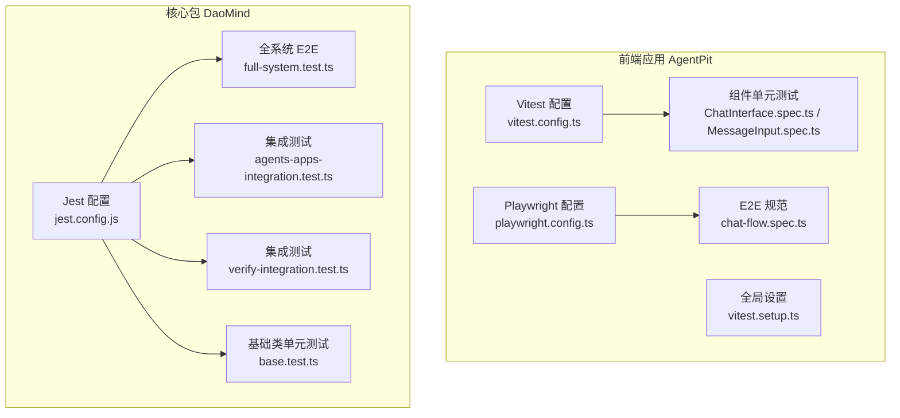
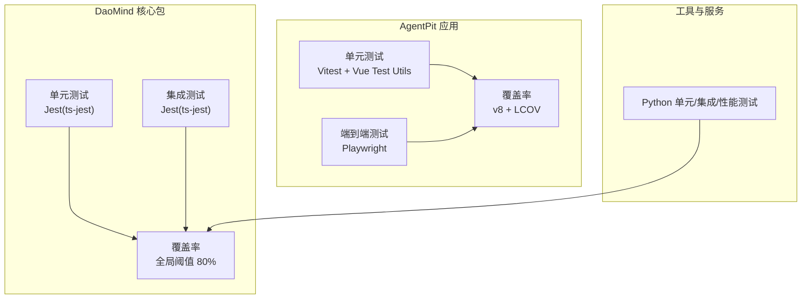
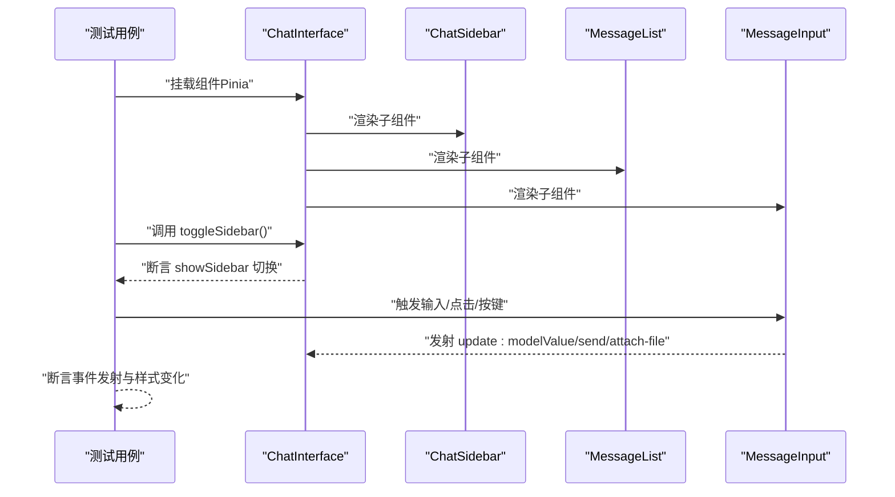
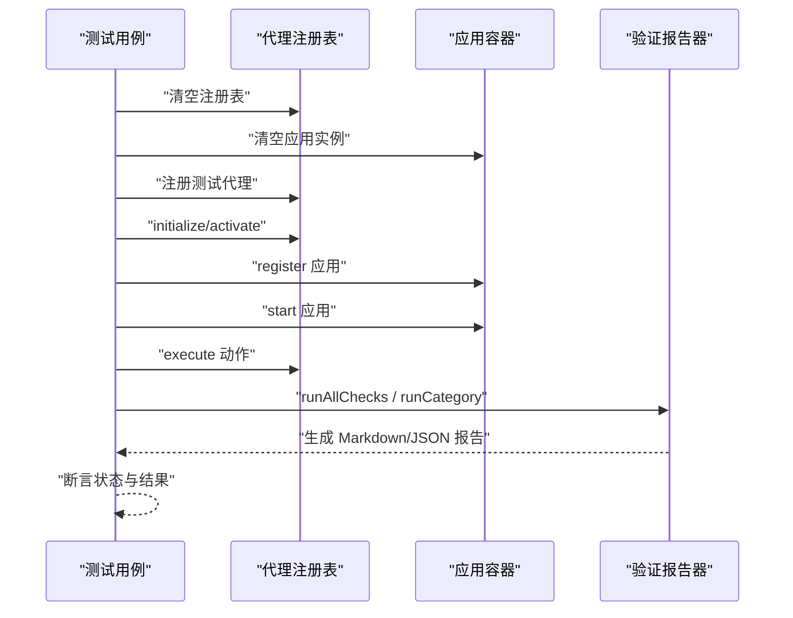
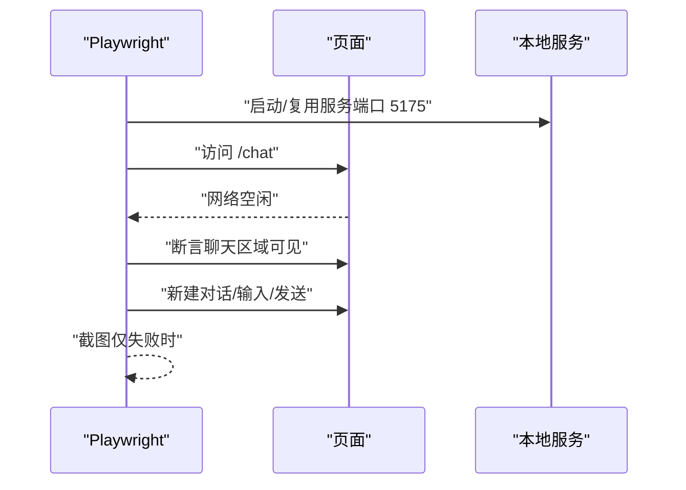
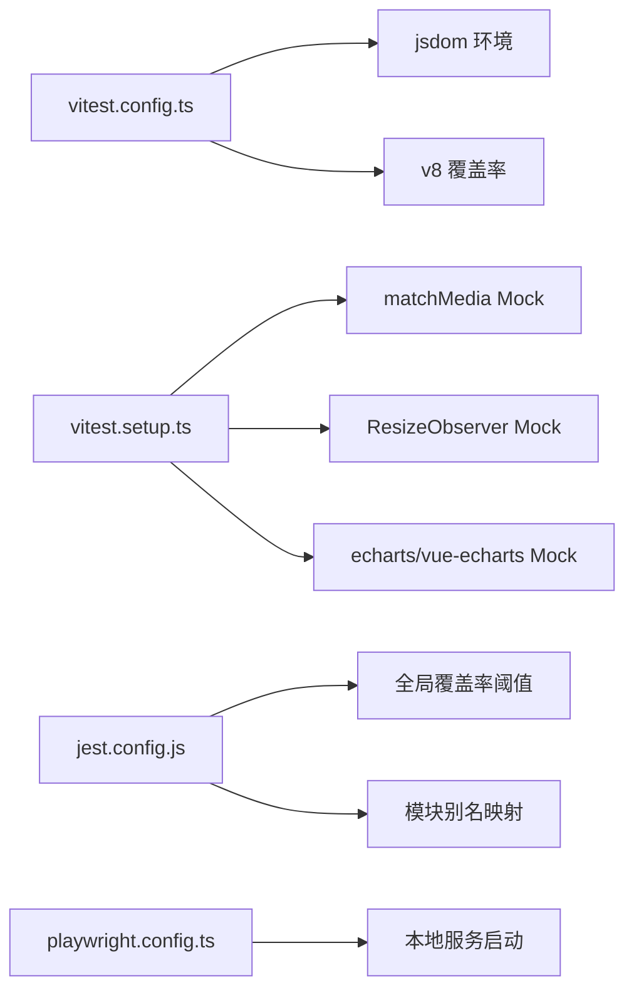

# 测试策略

<cite>
**本文引用的文件**
- [vitest.config.ts](file://apps/AgentPit/vitest.config.ts)
- [vitest.setup.ts](file://apps/AgentPit/vitest.setup.ts)
- [jest.config.js](file://apps/DaoMind/jest.config.js)
- [playwright.config.ts](file://apps/AgentPit/playwright.config.ts)
- [chat-flow.spec.ts](file://apps/AgentPit/e2e/chat-flow.spec.ts)
- [full-system.test.ts](file://apps/DaoMind/src/__tests__/e2e/full-system.test.ts)
- [agents-apps-integration.test.ts](file://apps/DaoMind/src/__tests__/integration/agents-apps-integration.test.ts)
- [verify-integration.test.ts](file://apps/DaoMind/src/__tests__/integration/verify-integration.test.ts)
- [base.test.ts](file://apps/DaoMind/packages/daoAgents/src/__tests__/base.test.ts)
- [ChatInterface.spec.ts](file://apps/AgentPit/src/__tests__/components/chat/ChatInterface.spec.ts)
- [MessageInput.spec.ts](file://apps/AgentPit/src/__tests__/components/chat/MessageInput.spec.ts)
- [ci.yml](file://.github/workflows/ci.yml)
- [cd.yml](file://.github/workflows/cd.yml)
- [.lighthouserc.json](file://apps/AgentPit/.lighthouserc.json)
- [package.json](file://apps/AgentPit/package.json)
</cite>

## 目录
1. [引言](#引言)
2. [项目结构](#项目结构)
3. [核心组件](#核心组件)
4. [架构总览](#架构总览)
5. [详细组件分析](#详细组件分析)
6. [依赖关系分析](#依赖关系分析)
7. [性能考量](#性能考量)
8. [故障排查指南](#故障排查指南)
9. [结论](#结论)
10. [附录](#附录)

## 引言
本测试策略文档面向 DAOApps 项目，系统化定义单元测试、集成测试与端到端测试（E2E）的实施方法，覆盖测试框架配置、Mock 数据管理、测试覆盖率要求、组件测试策略、API 测试实现、性能测试方法、最佳实践、调试技巧、持续集成配置以及质量保证流程与回归测试机制。目标是帮助开发者在不同应用模块中高效开展测试驱动开发（TDD），确保代码质量与交付稳定性。

## 项目结构
DAOApps 采用多应用与多包混合的 monorepo 结构，测试分布在多个子应用与工具模块中：
- 前端应用 AgentPit 使用 Vitest + Vue Test Utils 进行单元测试，并使用 Playwright 进行 E2E 测试。
- 核心包 DaoMind 使用 Jest 进行 TypeScript 单元与集成测试。
- 工具链与服务层包含 Python 测试（如 DeepResearch），用于端到端与性能测试场景。

图表来源
- [vitest.config.ts:1-48](file://apps/AgentPit/vitest.config.ts#L1-L48)
- [vitest.setup.ts:1-47](file://apps/AgentPit/vitest.setup.ts#L1-L47)
- [playwright.config.ts:1-28](file://apps/AgentPit/playwright.config.ts#L1-L28)
- [chat-flow.spec.ts:1-56](file://apps/AgentPit/e2e/chat-flow.spec.ts#L1-L56)
- [full-system.test.ts:1-120](file://apps/DaoMind/src/__tests__/e2e/full-system.test.ts#L1-L120)
- [agents-apps-integration.test.ts:1-113](file://apps/DaoMind/src/__tests__/integration/agents-apps-integration.test.ts#L1-L113)
- [verify-integration.test.ts:1-45](file://apps/DaoMind/src/__tests__/integration/verify-integration.test.ts#L1-L45)
- [base.test.ts:1-91](file://apps/DaoMind/packages/daoAgents/src/__tests__/base.test.ts#L1-L91)

章节来源
- [vitest.config.ts:1-48](file://apps/AgentPit/vitest.config.ts#L1-L48)
- [playwright.config.ts:1-28](file://apps/AgentPit/playwright.config.ts#L1-L28)
- [jest.config.js:1-59](file://apps/DaoMind/jest.config.js#L1-L59)

## 核心组件
- 测试框架与配置
  - AgentPit 应用：Vitest（jsdom 环境）、Vue Test Utils、覆盖率（v8）、报告器（text/json/html/lcov）。
  - DaoMind 包：Jest（ts-jest）、Node 环境、覆盖率阈值（全局 80% 行/函数/分支/语句）。
  - E2E：Playwright（Chromium 设备），HTML 报告，网络空闲等待与重试策略。
- Mock 数据与环境准备
  - Vitest 全局设置：matchMedia、ResizeObserver、echarts/vue-echarts 的 Mock。
  - 组件级 Mock：侧边栏、消息列表、输入框、快捷命令等。
  - 窗口尺寸与事件：模拟移动端/桌面端行为。
- 覆盖率要求
  - AgentPit：行/函数/分支/语句 ≥ 80%（含 stores、composables、utils、components）。
  - DaoMind：全局阈值 80%（ts 源码目录）。

章节来源
- [vitest.config.ts:7-41](file://apps/AgentPit/vitest.config.ts#L7-L41)
- [vitest.setup.ts:3-46](file://apps/AgentPit/vitest.setup.ts#L3-L46)
- [ChatInterface.spec.ts:7-51](file://apps/AgentPit/src/__tests__/components/chat/ChatInterface.spec.ts#L7-L51)
- [MessageInput.spec.ts:1-192](file://apps/AgentPit/src/__tests__/components/chat/MessageInput.spec.ts#L1-L192)
- [jest.config.js:10-17](file://apps/DaoMind/jest.config.js#L10-L17)

## 架构总览
下图展示测试体系在各应用中的分布与交互：

图表来源
- [vitest.config.ts:11-36](file://apps/AgentPit/vitest.config.ts#L11-L36)
- [jest.config.js:1-59](file://apps/DaoMind/jest.config.js#L1-L59)
- [chat-flow.spec.ts:1-56](file://apps/AgentPit/e2e/chat-flow.spec.ts#L1-L56)
- [full-system.test.ts:1-120](file://apps/DaoMind/src/__tests__/e2e/full-system.test.ts#L1-L120)

## 详细组件分析

### 组件测试策略（以 ChatInterface 与 MessageInput 为例）
- 测试目标
  - 验证渲染、交互、响应式行为（窗口尺寸、移动端/桌面端切换）。
  - 验证事件发射（v-model、send、attach-file）与禁用态逻辑。
  - 验证字符计数与样式联动。
- Mock 策略
  - 子组件 Mock 与属性/事件声明。
  - 外部库 Mock（echarts、vue-echarts）。
  - 全局对象 Mock（matchMedia、ResizeObserver）。
- 断言要点
  - DOM 可见性与元素存在性。
  - 事件发射次数与载荷。
  - 属性禁用与样式类名。

图表来源
- [ChatInterface.spec.ts:80-114](file://apps/AgentPit/src/__tests__/components/chat/ChatInterface.spec.ts#L80-L114)
- [MessageInput.spec.ts:15-190](file://apps/AgentPit/src/__tests__/components/chat/MessageInput.spec.ts#L15-L190)

章节来源
- [ChatInterface.spec.ts:1-172](file://apps/AgentPit/src/__tests__/components/chat/ChatInterface.spec.ts#L1-L172)
- [MessageInput.spec.ts:1-192](file://apps/AgentPit/src/__tests__/components/chat/MessageInput.spec.ts#L1-L192)
- [vitest.setup.ts:3-46](file://apps/AgentPit/vitest.setup.ts#L3-L46)

### API 测试实现（基于 DaoMind 集成测试）
- 目标
  - 验证代理注册、激活、执行与终止的生命周期。
  - 验证应用容器注册、启动、停止与依赖关系处理。
  - 验证验证报告生成（Markdown/JSON）。
- 关键流程
  - 清理环境：注销所有代理与应用实例。
  - 注册并启动测试代理与应用。
  - 执行动作并断言返回结果。
  - 生成并校验报告格式。

图表来源
- [full-system.test.ts:27-88](file://apps/DaoMind/src/__tests__/e2e/full-system.test.ts#L27-L88)
- [agents-apps-integration.test.ts:26-80](file://apps/DaoMind/src/__tests__/integration/agents-apps-integration.test.ts#L26-L80)
- [verify-integration.test.ts:4-44](file://apps/DaoMind/src/__tests__/integration/verify-integration.test.ts#L4-L44)

章节来源
- [full-system.test.ts:1-120](file://apps/DaoMind/src/__tests__/e2e/full-system.test.ts#L1-L120)
- [agents-apps-integration.test.ts:1-113](file://apps/DaoMind/src/__tests__/integration/agents-apps-integration.test.ts#L1-L113)
- [verify-integration.test.ts:1-45](file://apps/DaoMind/src/__tests__/integration/verify-integration.test.ts#L1-L45)

### 端到端测试（E2E）
- 测试范围
  - AgentPit：聊天对话流程、响应式布局、主题切换、钱包操作等。
- 配置要点
  - 并行执行、按需重试、CI 中限制并发与截图策略。
  - Web 服务器自动启动与复用、超时控制。
- 断言策略
  - 页面导航后网络空闲等待。
  - 关键 UI 容器可见性与交互（输入、发送按钮、快捷命令面板、侧边栏）。

图表来源
- [playwright.config.ts:21-26](file://apps/AgentPit/playwright.config.ts#L21-L26)
- [chat-flow.spec.ts:9-40](file://apps/AgentPit/e2e/chat-flow.spec.ts#L9-L40)

章节来源
- [playwright.config.ts:1-28](file://apps/AgentPit/playwright.config.ts#L1-L28)
- [chat-flow.spec.ts:1-56](file://apps/AgentPit/e2e/chat-flow.spec.ts#L1-L56)

### 性能测试方法
- 前端性能指标
  - 使用 Lighthouse 配置进行可访问性、性能、SEO 等指标评估。
- 工具链性能
  - Python 测试套件包含并发与稳定性测试脚本，可用于评估工具链吞吐与健壮性。
- 建议
  - 在 CI 中引入 Lighthouse 报告收集与阈值门禁。
  - 对关键路由与组件进行性能回归对比（时间线、内存占用）。

章节来源
- [.lighthouserc.json](file://apps/AgentPit/.lighthouserc.json)
- [package.json](file://apps/AgentPit/package.json)

## 依赖关系分析
- 框架耦合
  - AgentPit：Vitest → Vue Test Utils；Playwright → 浏览器设备与本地服务。
  - DaoMind：Jest → ts-jest；核心包间通过模块别名映射。
- Mock 依赖
  - Vitest setup 提供全局 Mock；组件测试进一步细化局部 Mock。
- 覆盖率边界
  - Vitest 限定 include/exclude 与阈值；Jest 设置全局阈值与收集路径。

图表来源
- [vitest.config.ts:7-41](file://apps/AgentPit/vitest.config.ts#L7-L41)
- [vitest.setup.ts:3-46](file://apps/AgentPit/vitest.setup.ts#L3-L46)
- [jest.config.js:23-29](file://apps/DaoMind/jest.config.js#L23-L29)
- [playwright.config.ts:21-26](file://apps/AgentPit/playwright.config.ts#L21-L26)

章节来源
- [vitest.config.ts:1-48](file://apps/AgentPit/vitest.config.ts#L1-L48)
- [vitest.setup.ts:1-47](file://apps/AgentPit/vitest.setup.ts#L1-L47)
- [jest.config.js:1-59](file://apps/DaoMind/jest.config.js#L1-L59)
- [playwright.config.ts:1-28](file://apps/AgentPit/playwright.config.ts#L1-L28)

## 性能考量
- 测试执行效率
  - Vitest 默认启用 jsdom，适合组件级快速测试；E2E 使用 Playwright，建议在 CI 中限制并发与重试次数。
  - Jest 配置了最大工作进程比例与超时，避免资源争用。
- 覆盖率与质量
  - 严格覆盖率阈值有助于发现未测试路径；建议结合 Lighthouse 报告进行前端性能门禁。
- 回归与稳定性
  - 通过 E2E 与集成测试覆盖关键业务流；对依赖关系（如应用容器依赖）进行显式断言。

## 故障排查指南
- 常见问题
  - 组件未渲染或事件未触发：检查子组件 Mock 是否完整、事件发射是否正确声明。
  - 窗口尺寸相关逻辑异常：确认 vitest.setup.ts 中 matchMedia 与 ResizeObserver 的 Mock 是否生效。
  - E2E 失败：关注网络空闲等待与本地服务启动超时；必要时开启 trace 与截图。
  - Jest 模块解析失败：核对 moduleNameMapper 与根目录配置。
- 调试技巧
  - 使用 Vitest 的 --reporter=verbose 或 HTML 报告定位失败用例。
  - 在 Playwright 中启用 trace 与失败截图，复现问题。
  - 对关键集成点（代理/应用容器）添加日志与断言，缩小问题范围。

章节来源
- [vitest.setup.ts:3-46](file://apps/AgentPit/vitest.setup.ts#L3-L46)
- [playwright.config.ts:10-14](file://apps/AgentPit/playwright.config.ts#L10-L14)
- [jest.config.js:23-29](file://apps/DaoMind/jest.config.js#L23-L29)

## 结论
DAOApps 的测试体系以 Vitest/Jest 为核心，配合 Playwright 实现端到端覆盖，辅以覆盖率阈值与 Lighthouse 指标，形成从组件到系统的多层保障。通过规范化的 Mock 策略、清晰的断言边界与 CI 集成，能够有效提升代码质量与交付稳定性。建议在后续迭代中逐步完善 API 层测试与性能回归门禁，持续优化测试执行效率与报告可视化。

## 附录

### 测试类型与实施清单
- 单元测试
  - 组件：ChatInterface、MessageInput 等，覆盖渲染、交互、事件与样式。
  - 核心类：DaoBaseAgent 生命周期与动作执行。
- 集成测试
  - 代理与应用容器：注册、启动、停止与依赖关系。
  - 验证报告：Markdown/JSON 生成与内容校验。
- 端到端测试
  - 聊天对话流程、响应式布局、主题切换、钱包操作等。
- API 测试
  - 基于集成测试覆盖核心业务 API 的调用与返回。
- 性能测试
  - Lighthouse 指标与工具链并发/稳定性测试。

章节来源
- [ChatInterface.spec.ts:1-172](file://apps/AgentPit/src/__tests__/components/chat/ChatInterface.spec.ts#L1-L172)
- [MessageInput.spec.ts:1-192](file://apps/AgentPit/src/__tests__/components/chat/MessageInput.spec.ts#L1-L192)
- [base.test.ts:1-91](file://apps/DaoMind/packages/daoAgents/src/__tests__/base.test.ts#L1-L91)
- [agents-apps-integration.test.ts:1-113](file://apps/DaoMind/src/__tests__/integration/agents-apps-integration.test.ts#L1-L113)
- [verify-integration.test.ts:1-45](file://apps/DaoMind/src/__tests__/integration/verify-integration.test.ts#L1-L45)
- [chat-flow.spec.ts:1-56](file://apps/AgentPit/e2e/chat-flow.spec.ts#L1-L56)

### 持续集成配置
- CI/CD 工作流
  - CI：构建、测试与覆盖率收集。
  - CD：部署与发布。
- 建议
  - 在 CI 中启用覆盖率门禁与 E2E 报告上传。
  - 对关键分支与 PR 设置强制性测试通过条件。

章节来源
- [ci.yml](file://.github/workflows/ci.yml)
- [cd.yml](file://.github/workflows/cd.yml)