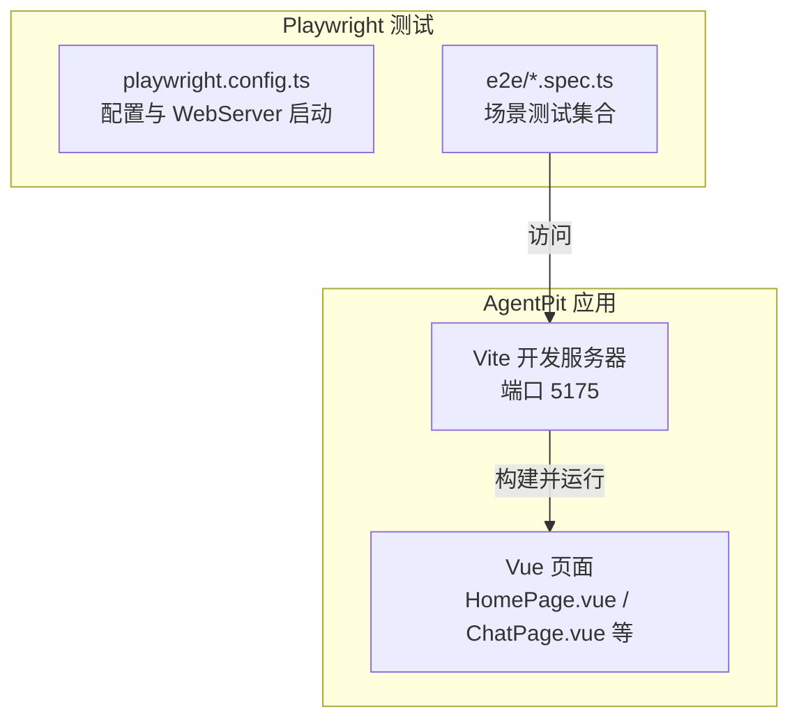
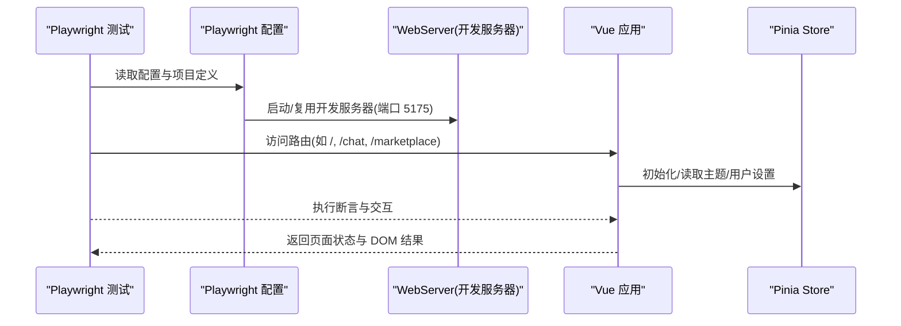
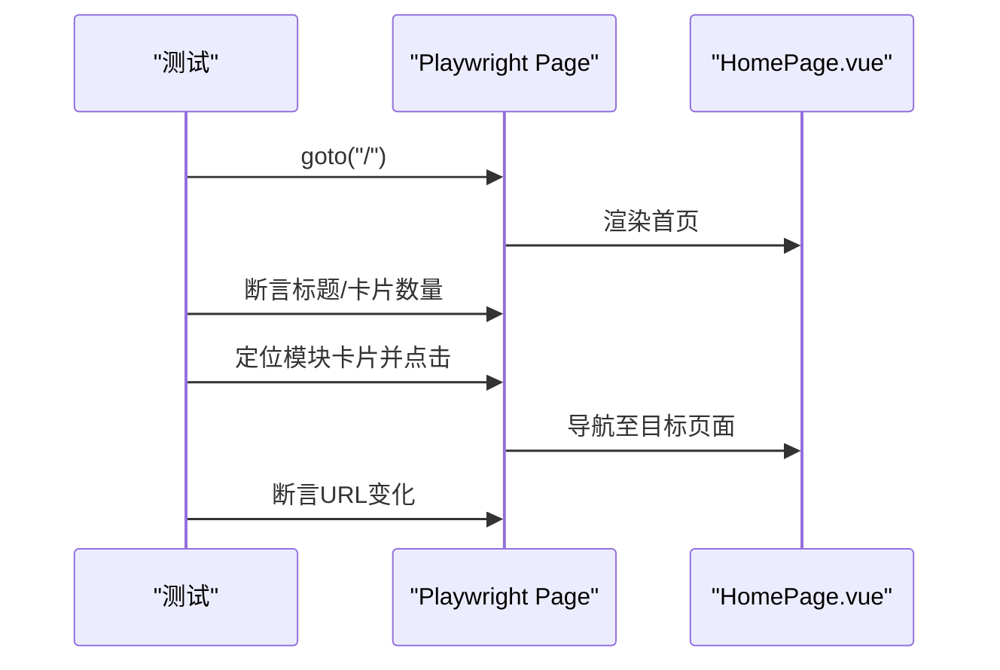
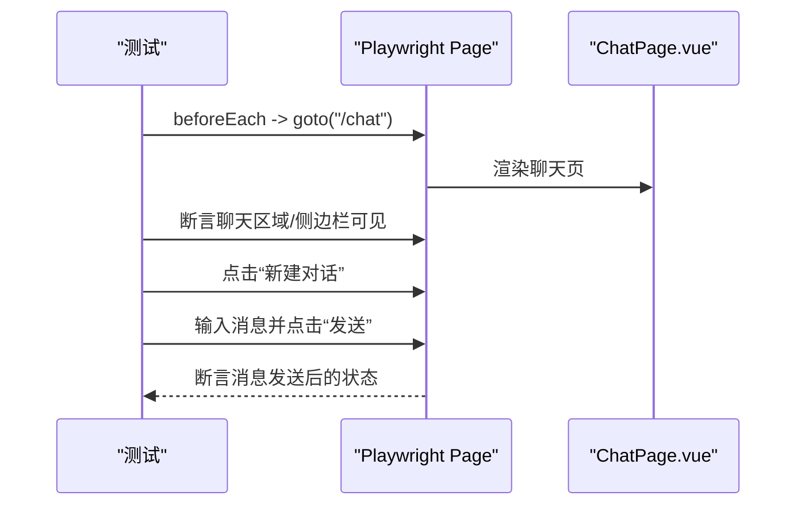
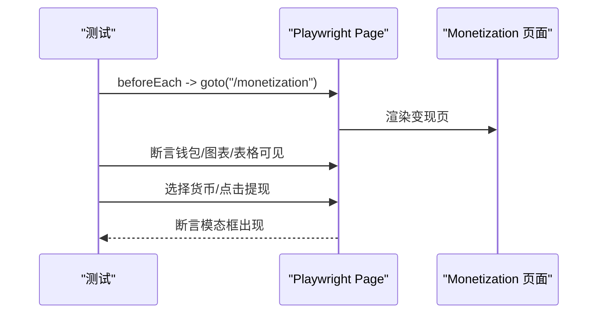
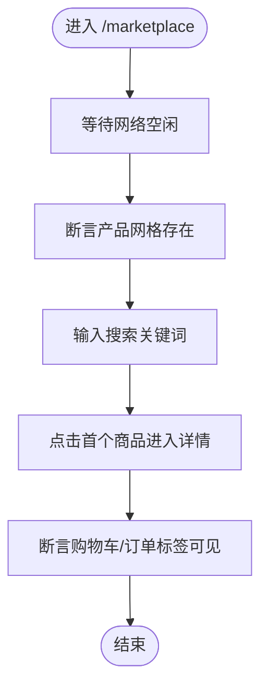
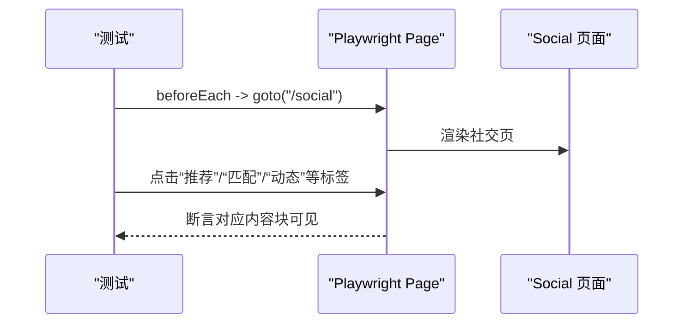
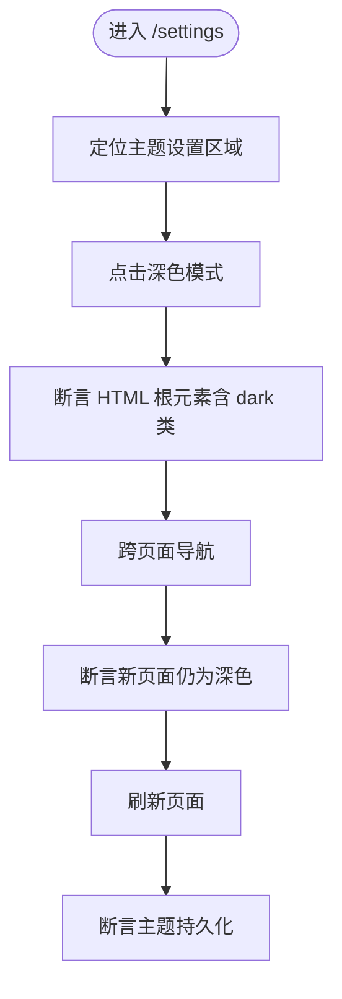
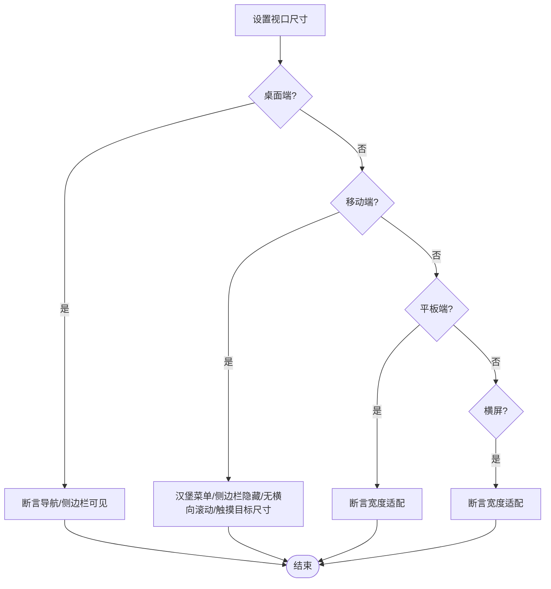
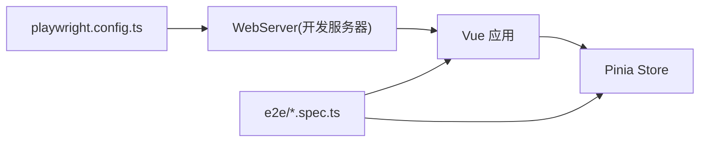

# 端到端测试

<cite>
**本文引用的文件**
- [playwright.config.ts](file://apps/AgentPit/playwright.config.ts)
- [homepage.spec.ts](file://apps/AgentPit/e2e/homepage.spec.ts)
- [chat-flow.spec.ts](file://apps/AgentPit/e2e/chat-flow.spec.ts)
- [wallet-operations.spec.ts](file://apps/AgentPit/e2e/wallet-operations.spec.ts)
- [shopping-journey.spec.ts](file://apps/AgentPit/e2e/shopping-journey.spec.ts)
- [social-interaction.spec.ts](file://apps/AgentPit/e2e/social-interaction.spec.ts)
- [theme-switching.spec.ts](file://apps/AgentPit/e2e/theme-switching.spec.ts)
- [responsive-layout.spec.ts](file://apps/AgentPit/e2e/responsive-layout.spec.ts)
- [package.json](file://apps/AgentPit/package.json)
- [HomePage.vue](file://apps/AgentPit/src/views/HomePage.vue)
- [ChatPage.vue](file://apps/AgentPit/src/views/ChatPage.vue)
- [useAppStore.ts](file://apps/AgentPit/src/stores/useAppStore.ts)
- [useUserStore.ts](file://apps/AgentPit/src/stores/useUserStore.ts)
</cite>

## 目录
1. [简介](#简介)
2. [项目结构](#项目结构)
3. [核心组件](#核心组件)
4. [架构总览](#架构总览)
5. [详细组件分析](#详细组件分析)
6. [依赖关系分析](#依赖关系分析)
7. [性能考量](#性能考量)
8. [故障排查指南](#故障排查指南)
9. [结论](#结论)
10. [附录](#附录)

## 简介
本文件为 DAOApps 项目中 AgentPit 应用的端到端测试文档，围绕 Playwright 测试框架进行系统化说明，覆盖浏览器自动化、页面对象模型（POM）、测试环境与服务器启动、用户场景测试（聊天、社交、购物旅程）、响应式布局与主题切换、钱包操作、测试数据与会话模拟、异步操作处理、截图与视频录制、测试报告生成、跨浏览器与移动端策略、性能基准测试以及调试与 CI 集成建议。文档同时提供可执行的测试脚本路径与关键实现位置，便于快速定位与维护。

## 项目结构
AgentPit 应用采用 Vue 3 + Vite 技术栈，Playwright 测试位于 apps/AgentPit/e2e 目录，测试配置集中于 playwright.config.ts，并通过 npm 脚本启动开发服务器供测试使用。

图表来源
- [playwright.config.ts:1-28](file://apps/AgentPit/playwright.config.ts#L1-L28)
- [homepage.spec.ts:1-52](file://apps/AgentPit/e2e/homepage.spec.ts#L1-L52)
- [chat-flow.spec.ts:1-56](file://apps/AgentPit/e2e/chat-flow.spec.ts#L1-L56)

章节来源
- [playwright.config.ts:1-28](file://apps/AgentPit/playwright.config.ts#L1-L28)
- [package.json:1-74](file://apps/AgentPit/package.json#L1-L74)

## 核心组件
- Playwright 配置与 WebServer
  - 使用 playwright.config.ts 配置测试目录、并行度、重试策略、CI 行为、截图与追踪策略，并通过 webServer 字段启动本地开发服务器（端口 5175），在 CI 环境下复用已有服务，超时时间较长以适配冷启动。
  - 参考路径：[playwright.config.ts:1-28](file://apps/AgentPit/playwright.config.ts#L1-L28)

- 测试脚本组织
  - homepage.spec.ts：首页浏览与导航测试，验证模块卡片数量、跳转至聊天与变现页等。
  - chat-flow.spec.ts：聊天界面加载、新建对话、输入框交互、发送按钮触发、快捷命令面板与侧边栏可见性。
  - wallet-operations.spec.ts：钱包余额展示、货币选择器、收入图表、交易历史表格、提现弹窗打开。
  - shopping-journey.spec.ts：市场页加载、搜索过滤、商品详情页跳转、购物车与订单标签可见。
  - social-interaction.spec.ts：社交页标签导航、推荐/匹配/动态/好友/通知等标签页内容与交互按钮。
  - theme-switching.spec.ts：主题设置入口、切换深浅色、HTML 根元素类名变化、跨页面与刷新后持久化。
  - responsive-layout.spec.ts：桌面/平板/手机/横屏等多视口布局适配、汉堡菜单、滚动条与触摸目标尺寸校验。
  - 参考路径：
    - [homepage.spec.ts:1-52](file://apps/AgentPit/e2e/homepage.spec.ts#L1-L52)
    - [chat-flow.spec.ts:1-56](file://apps/AgentPit/e2e/chat-flow.spec.ts#L1-L56)
    - [wallet-operations.spec.ts:1-55](file://apps/AgentPit/e2e/wallet-operations.spec.ts#L1-L55)
    - [shopping-journey.spec.ts:1-49](file://apps/AgentPit/e2e/shopping-journey.spec.ts#L1-L49)
    - [social-interaction.spec.ts:1-72](file://apps/AgentPit/e2e/social-interaction.spec.ts#L1-L72)
    - [theme-switching.spec.ts:1-65](file://apps/AgentPit/e2e/theme-switching.spec.ts#L1-L65)
    - [responsive-layout.spec.ts:1-95](file://apps/AgentPit/e2e/responsive-layout.spec.ts#L1-L95)

- 页面与状态管理
  - HomePage.vue：首页主结构，包含模块网格与统计数据展示，用于首页浏览与导航测试。
  - ChatPage.vue：聊天页入口，承载聊天界面组件，用于聊天流程测试。
  - useAppStore.ts：全局主题与侧边栏状态，负责深色模式应用与持久化。
  - useUserStore.ts：用户主题设置持久化（Pinia 持久化插件），与主题切换测试关联。
  - 参考路径：
    - [HomePage.vue:1-200](file://apps/AgentPit/src/views/HomePage.vue#L1-L200)
    - [ChatPage.vue:1-8](file://apps/AgentPit/src/views/ChatPage.vue#L1-L8)
    - [useAppStore.ts:1-89](file://apps/AgentPit/src/stores/useAppStore.ts#L1-L89)
    - [useUserStore.ts:1-72](file://apps/AgentPit/src/stores/useUserStore.ts#L1-L72)

章节来源
- [homepage.spec.ts:1-52](file://apps/AgentPit/e2e/homepage.spec.ts#L1-L52)
- [chat-flow.spec.ts:1-56](file://apps/AgentPit/e2e/chat-flow.spec.ts#L1-L56)
- [wallet-operations.spec.ts:1-55](file://apps/AgentPit/e2e/wallet-operations.spec.ts#L1-L55)
- [shopping-journey.spec.ts:1-49](file://apps/AgentPit/e2e/shopping-journey.spec.ts#L1-L49)
- [social-interaction.spec.ts:1-72](file://apps/AgentPit/e2e/social-interaction.spec.ts#L1-L72)
- [theme-switching.spec.ts:1-65](file://apps/AgentPit/e2e/theme-switching.spec.ts#L1-L65)
- [responsive-layout.spec.ts:1-95](file://apps/AgentPit/e2e/responsive-layout.spec.ts#L1-L95)
- [HomePage.vue:1-200](file://apps/AgentPit/src/views/HomePage.vue#L1-L200)
- [ChatPage.vue:1-8](file://apps/AgentPit/src/views/ChatPage.vue#L1-L8)
- [useAppStore.ts:1-89](file://apps/AgentPit/src/stores/useAppStore.ts#L1-L89)
- [useUserStore.ts:1-72](file://apps/AgentPit/src/stores/useUserStore.ts#L1-L72)

## 架构总览
下图展示了从 Playwright 测试到应用页面与状态管理的整体调用链路，以及测试配置如何驱动本地开发服务器。

图表来源
- [playwright.config.ts:1-28](file://apps/AgentPit/playwright.config.ts#L1-L28)
- [homepage.spec.ts:1-52](file://apps/AgentPit/e2e/homepage.spec.ts#L1-L52)
- [useAppStore.ts:1-89](file://apps/AgentPit/src/stores/useAppStore.ts#L1-L89)

## 详细组件分析

### 首页浏览与导航测试（homepage.spec.ts）
- 关键点
  - 首页标题与模块卡片数量断言
  - 点击模块卡片跳转至对应页面（如变现、聊天）
  - 统计信息区块可见性
  - 前进/后退导航行为
- 实现要点
  - 使用 page.goto('/') 进入首页，waitForLoadState('networkidle') 等待网络空闲
  - 通过文本或选择器定位模块卡片并点击，断言 URL 变化
- 参考路径
  - [homepage.spec.ts:1-52](file://apps/AgentPit/e2e/homepage.spec.ts#L1-L52)
  - [HomePage.vue:1-200](file://apps/AgentPit/src/views/HomePage.vue#L1-L200)

图表来源
- [homepage.spec.ts:1-52](file://apps/AgentPit/e2e/homepage.spec.ts#L1-L52)
- [HomePage.vue:1-200](file://apps/AgentPit/src/views/HomePage.vue#L1-L200)

章节来源
- [homepage.spec.ts:1-52](file://apps/AgentPit/e2e/homepage.spec.ts#L1-L52)
- [HomePage.vue:1-200](file://apps/AgentPit/src/views/HomePage.vue#L1-L200)

### 聊天流程测试（chat-flow.spec.ts）
- 关键点
  - 聊天区域与对话列表可见性
  - 新建对话按钮存在与点击
  - 消息输入框可见与输入值校验
  - 发送按钮点击触发消息发送
  - 快捷命令面板与侧边栏可见性
- 实现要点
  - beforeEach 中统一进入 /chat 并等待网络空闲
  - 使用 data-testid 与语义化文本定位元素，避免脆弱选择器
- 参考路径
  - [chat-flow.spec.ts:1-56](file://apps/AgentPit/e2e/chat-flow.spec.ts#L1-L56)
  - [ChatPage.vue:1-8](file://apps/AgentPit/src/views/ChatPage.vue#L1-L8)

图表来源
- [chat-flow.spec.ts:1-56](file://apps/AgentPit/e2e/chat-flow.spec.ts#L1-L56)
- [ChatPage.vue:1-8](file://apps/AgentPit/src/views/ChatPage.vue#L1-L8)

章节来源
- [chat-flow.spec.ts:1-56](file://apps/AgentPit/e2e/chat-flow.spec.ts#L1-L56)
- [ChatPage.vue:1-8](file://apps/AgentPit/src/views/ChatPage.vue#L1-L8)

### 钱包操作测试（wallet-operations.spec.ts）
- 关键点
  - 钱包卡片显示余额信息
  - 货币选择器可用
  - 收入图表渲染
  - 交易历史表格加载且有数据
  - 提现按钮打开模态框
- 实现要点
  - beforeEach 进入 /monetization 并等待网络空闲
  - 断言文本内容包含金额/余额标识
- 参考路径
  - [wallet-operations.spec.ts:1-55](file://apps/AgentPit/e2e/wallet-operations.spec.ts#L1-L55)

图表来源
- [wallet-operations.spec.ts:1-55](file://apps/AgentPit/e2e/wallet-operations.spec.ts#L1-L55)

章节来源
- [wallet-operations.spec.ts:1-55](file://apps/AgentPit/e2e/wallet-operations.spec.ts#L1-L55)

### 购物旅程测试（shopping-journey.spec.ts）
- 关键点
  - 市场页产品网格加载
  - 搜索输入框可输入
  - 点击商品进入详情页
  - 购物车与订单标签可见
- 实现要点
  - goto('/marketplace') 后等待网络空闲
  - 通过文本或 data-testid 选择器定位交互元素
- 参考路径
  - [shopping-journey.spec.ts:1-49](file://apps/AgentPit/e2e/shopping-journey.spec.ts#L1-L49)

图表来源
- [shopping-journey.spec.ts:1-49](file://apps/AgentPit/e2e/shopping-journey.spec.ts#L1-L49)

章节来源
- [shopping-journey.spec.ts:1-49](file://apps/AgentPit/e2e/shopping-journey.spec.ts#L1-L49)

### 社交交互测试（social-interaction.spec.ts）
- 关键点
  - 社交页标签导航（推荐/匹配/动态/好友/通知）
  - 推荐页用户卡片、匹配页交互按钮、动态页帖子、通知面板可见
- 实现要点
  - beforeEach 进入 /social 并等待网络空闲
  - 逐个标签页点击并断言对应内容块可见
- 参考路径
  - [social-interaction.spec.ts:1-72](file://apps/AgentPit/e2e/social-interaction.spec.ts#L1-L72)

图表来源
- [social-interaction.spec.ts:1-72](file://apps/AgentPit/e2e/social-interaction.spec.ts#L1-L72)

章节来源
- [social-interaction.spec.ts:1-72](file://apps/AgentPit/e2e/social-interaction.spec.ts#L1-L72)

### 主题切换测试（theme-switching.spec.ts）
- 关键点
  - 设置页存在主题偏好区域
  - 切换深色模式后 HTML 根元素包含 dark 类
  - 切回浅色模式移除 dark 类
  - 跨页面与刷新后主题持久化
- 实现要点
  - 使用 useAppStore 的 setTheme/toggleDarkMode 逻辑与持久化
  - 通过 data-testid 或文本定位主题选项
- 参考路径
  - [theme-switching.spec.ts:1-65](file://apps/AgentPit/e2e/theme-switching.spec.ts#L1-L65)
  - [useAppStore.ts:1-89](file://apps/AgentPit/src/stores/useAppStore.ts#L1-L89)
  - [useUserStore.ts:1-72](file://apps/AgentPit/src/stores/useUserStore.ts#L1-L72)

图表来源
- [theme-switching.spec.ts:1-65](file://apps/AgentPit/e2e/theme-switching.spec.ts#L1-L65)
- [useAppStore.ts:1-89](file://apps/AgentPit/src/stores/useAppStore.ts#L1-L89)
- [useUserStore.ts:1-72](file://apps/AgentPit/src/stores/useUserStore.ts#L1-L72)

章节来源
- [theme-switching.spec.ts:1-65](file://apps/AgentPit/e2e/theme-switching.spec.ts#L1-L65)
- [useAppStore.ts:1-89](file://apps/AgentPit/src/stores/useAppStore.ts#L1-L89)
- [useUserStore.ts:1-72](file://apps/AgentPit/src/stores/useUserStore.ts#L1-L72)

### 响应式布局测试（responsive-layout.spec.ts）
- 关键点
  - 桌面端：导航栏与侧边栏可见
  - 平板端：宽度适配
  - 移动端：汉堡菜单出现、侧边栏默认隐藏、无水平滚动条、触摸目标尺寸达标
  - 横屏：布局适配
  - 核心功能在移动端可正常导航
- 实现要点
  - 使用 test.use({ viewport }) 在不同视口下运行
  - 通过 boundingBox 获取按钮尺寸，计算 overflowX 判断滚动条
- 参考路径
  - [responsive-layout.spec.ts:1-95](file://apps/AgentPit/e2e/responsive-layout.spec.ts#L1-L95)

图表来源
- [responsive-layout.spec.ts:1-95](file://apps/AgentPit/e2e/responsive-layout.spec.ts#L1-L95)

章节来源
- [responsive-layout.spec.ts:1-95](file://apps/AgentPit/e2e/responsive-layout.spec.ts#L1-L95)

## 依赖关系分析
- 测试配置对应用的耦合
  - playwright.config.ts 通过 webServer 复用本地开发服务器，确保测试与开发环境一致
  - 测试脚本依赖页面路由与组件选择器，需与前端代码保持稳定
- 状态管理对测试的影响
  - useAppStore 与 useUserStore 的主题持久化影响主题切换测试结果
  - 钱包与社交等功能依赖 store 状态，测试中应关注初始化与更新时机
- 外部依赖
  - Vite 开发服务器、浏览器设备集、HTML 截图与 Trace 录制由 Playwright 提供

图表来源
- [playwright.config.ts:1-28](file://apps/AgentPit/playwright.config.ts#L1-L28)
- [useAppStore.ts:1-89](file://apps/AgentPit/src/stores/useAppStore.ts#L1-L89)

章节来源
- [playwright.config.ts:1-28](file://apps/AgentPit/playwright.config.ts#L1-L28)
- [useAppStore.ts:1-89](file://apps/AgentPit/src/stores/useAppStore.ts#L1-L89)

## 性能考量
- 测试并发与重试
  - fullyParallel 与 workers 控制并发；CI 下启用 retries 与更严格的 workers 限制，提升稳定性
- 启动与等待
  - webServer 超时延长以适应冷启动；测试中使用 waitForLoadState('networkidle') 与显式等待优化性能
- 视口与渲染
  - 多视口测试可能增加耗时，建议在本地减少用例，在 CI 中按需分层执行
- 报告与产物
  - HTML 报告便于定位失败用例；trace 与截图仅在失败时生成，平衡存储与诊断成本

章节来源
- [playwright.config.ts:1-28](file://apps/AgentPit/playwright.config.ts#L1-L28)

## 故障排查指南
- 本地无法访问页面
  - 确认开发服务器已启动且端口 5175 可用；webServer.reuseExistingServer 在非 CI 环境下启用
  - 参考路径：[playwright.config.ts:21-26](file://apps/AgentPit/playwright.config.ts#L21-L26)
- 测试偶发失败
  - 在 CI 环境启用 retries；必要时调整等待策略与超时
  - 参考路径：[playwright.config.ts:6-8](file://apps/AgentPit/playwright.config.ts#L6-L8)
- 主题切换不生效
  - 检查 useAppStore.applyTheme 是否被调用；确认 data-testid 与文本定位是否正确
  - 参考路径：[useAppStore.ts:60-72](file://apps/AgentPit/src/stores/useAppStore.ts#L60-L72)
- 移动端交互异常
  - 使用 test.use({ viewport }) 明确视口；检查触摸目标尺寸与滚动条设置
  - 参考路径：[responsive-layout.spec.ts:5, 23, 33, 73:5-79](file://apps/AgentPit/e2e/responsive-layout.spec.ts#L5-L79)
- 截图与 Trace
  - trace 在首次重试时开启；截图仅在失败时生成，便于定位问题
  - 参考路径：[playwright.config.ts:10-14](file://apps/AgentPit/playwright.config.ts#L10-L14)

章节来源
- [playwright.config.ts:6-14](file://apps/AgentPit/playwright.config.ts#L6-L14)
- [useAppStore.ts:60-72](file://apps/AgentPit/src/stores/useAppStore.ts#L60-L72)
- [responsive-layout.spec.ts:5, 23, 33, 73:5-79](file://apps/AgentPit/e2e/responsive-layout.spec.ts#L5-L79)

## 结论
本测试体系以 Playwright 为核心，结合本地开发服务器与 Pinia 状态管理，覆盖首页导航、聊天、钱包、购物、社交、主题与响应式布局等关键用户旅程。通过稳定的配置、明确的页面对象模型与合理的等待策略，能够在本地与 CI 环境中高效产出可追溯的测试报告。后续可在 CI 中扩展跨浏览器与移动端矩阵，并引入性能基准测试以进一步完善质量保障。

## 附录
- 测试运行与产物
  - 测试报告：HTML 报告由 reporter: 'html' 生成
  - 截图与 Trace：仅在失败时生成，便于问题复现
  - 参考路径：[playwright.config.ts:9-14](file://apps/AgentPit/playwright.config.ts#L9-L14)
- 脚本与命令
  - 通过 package.json 中的 dev/build/preview/lint 等脚本配合 Playwright 使用
  - 参考路径：[package.json:6-19](file://apps/AgentPit/package.json#L6-L19)
- 跨浏览器与移动端策略
  - 当前配置仅包含 Chromium 设备；可在 projects 中新增 Firefox/WebKit 与移动设备配置
  - 参考路径：[playwright.config.ts:15-20](file://apps/AgentPit/playwright.config.ts#L15-L20)
- 性能基准测试建议
  - 在现有 e2e 基础上新增独立基准用例，记录关键页面加载与交互延迟，结合 CI 缓存与分层矩阵执行