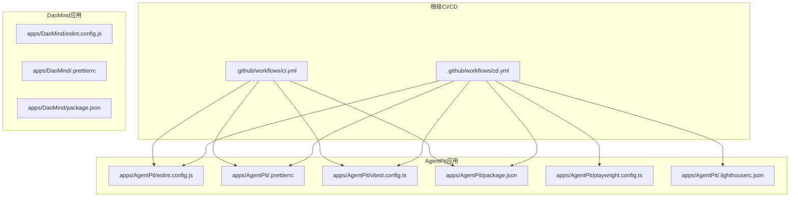
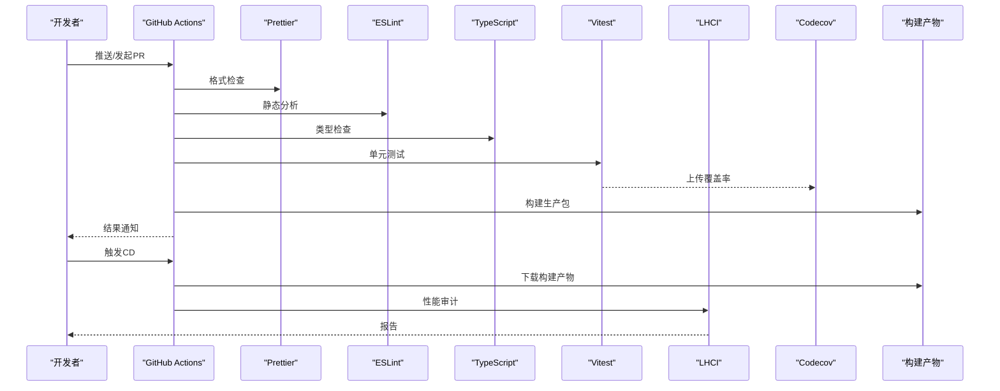
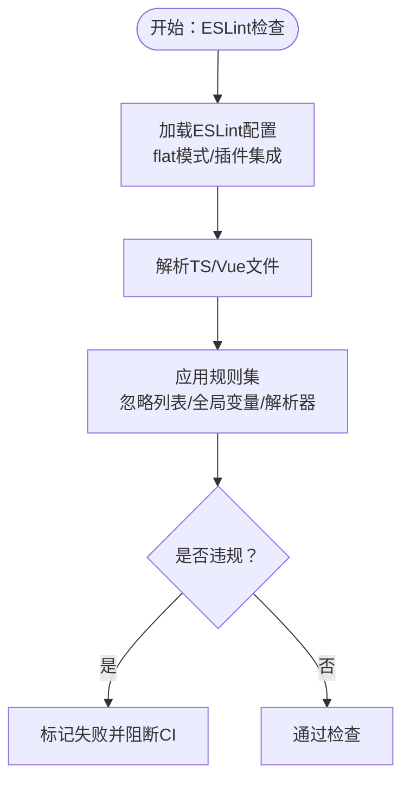
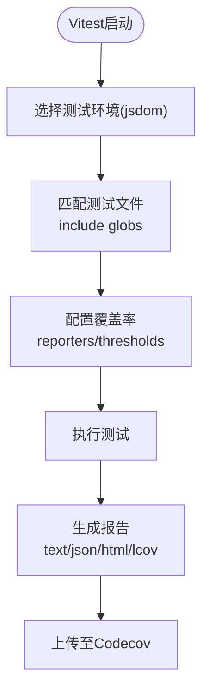
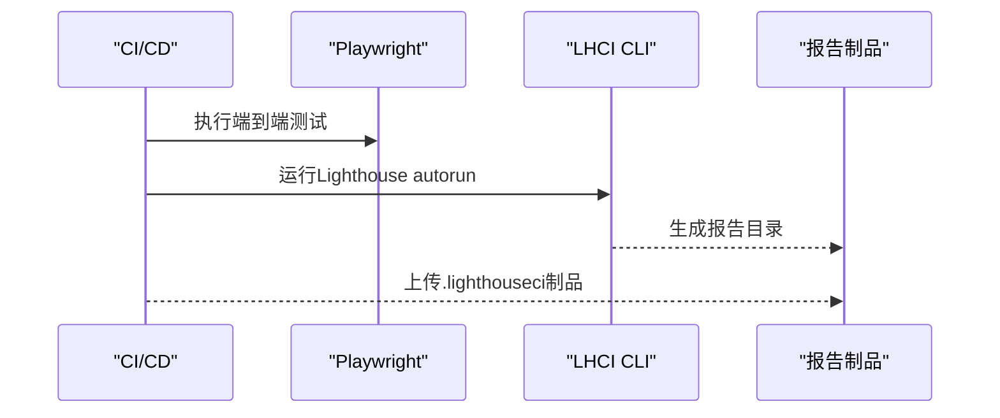
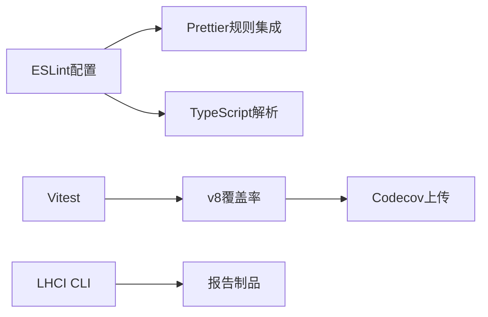

# 质量保证

<cite>
**本文引用的文件**
- [.github/workflows/ci.yml](file://.github/workflows/ci.yml)
- [.github/workflows/cd.yml](file://.github/workflows/cd.yml)
- [.prettierrc](file://.prettierrc)
- [apps/AgentPit/.prettierrc](file://apps/AgentPit/.prettierrc)
- [apps/DaoMind/.prettierrc](file://apps/DaoMind/.prettierrc)
- [apps/AgentPit/eslint.config.js](file://apps/AgentPit/eslint.config.js)
- [apps/DaoMind/eslint.config.js](file://apps/DaoMind/eslint.config.js)
- [apps/AgentPit/vitest.config.ts](file://apps/AgentPit/vitest.config.ts)
- [apps/config-center/vitest.config.ts](file://apps/config-center/vitest.config.ts)
- [apps/forum/vitest.config.ts](file://apps/forum/vitest.config.ts)
- [apps/AgentPit/package.json](file://apps/AgentPit/package.json)
- [apps/DaoMind/package.json](file://apps/DaoMind/package.json)
- [apps/AgentPit/playwright.config.ts](file://apps/AgentPit/playwright.config.ts)
- [apps/AgentPit/.lighthouserc.json](file://apps/AgentPit/.lighthouserc.json)
</cite>

## 目录
1. [引言](#引言)
2. [项目结构](#项目结构)
3. [核心组件](#核心组件)
4. [架构总览](#架构总览)
5. [详细组件分析](#详细组件分析)
6. [依赖分析](#依赖分析)
7. [性能考虑](#性能考虑)
8. [故障排查指南](#故障排查指南)
9. [结论](#结论)
10. [附录](#附录)

## 引言
本文件面向DAOApps项目的质量保证体系，系统化梳理并文档化以下方面：
- 代码质量检查工具的配置与使用：ESLint规则、Prettier格式化与风格一致性
- 代码覆盖率分析、静态代码分析与可选的安全扫描
- 回归测试策略、自动化测试流程与持续集成中的质量门禁
- 代码审查流程、测试策略制定与质量指标监控
- 测试用例维护、测试数据管理与测试环境治理
- 质量报告生成、缺陷跟踪与持续改进流程
- 质量保证最佳实践、团队协作规范与项目质量管理标准

## 项目结构
DAOApps采用多应用（monorepo）结构，包含多个前端应用与工具模块。质量保证相关的关键位置如下：
- 根级CI/CD工作流：位于 .github/workflows，定义构建、测试、覆盖率上传与部署流程
- 应用级质量配置：各应用目录下包含ESLint、Prettier、Vitest等配置文件
- 端到端测试与性能检测：Playwright与LHCI在AgentPit应用中启用
- 包管理与脚本：各应用package.json中定义了格式化、类型检查、测试与构建脚本

**图表来源**
- [.github/workflows/ci.yml:1-67](file://.github/workflows/ci.yml#L1-L67)
- [.github/workflows/cd.yml:1-247](file://.github/workflows/cd.yml#L1-L247)
- [apps/AgentPit/eslint.config.js:1-162](file://apps/AgentPit/eslint.config.js#L1-L162)
- [apps/AgentPit/.prettierrc:1-1](file://apps/AgentPit/.prettierrc#L1-L1)
- [apps/AgentPit/vitest.config.ts:1-48](file://apps/AgentPit/vitest.config.ts#L1-L48)
- [apps/AgentPit/package.json](file://apps/AgentPit/package.json)
- [apps/AgentPit/playwright.config.ts](file://apps/AgentPit/playwright.config.ts)
- [apps/AgentPit/.lighthouserc.json](file://apps/AgentPit/.lighthouserc.json)
- [apps/DaoMind/eslint.config.js:1-27](file://apps/DaoMind/eslint.config.js#L1-L27)
- [apps/DaoMind/.prettierrc:1-1](file://apps/DaoMind/.prettierrc#L1-L1)
- [apps/DaoMind/package.json](file://apps/DaoMind/package.json)

**章节来源**
- [.github/workflows/ci.yml:1-67](file://.github/workflows/ci.yml#L1-L67)
- [.github/workflows/cd.yml:1-247](file://.github/workflows/cd.yml#L1-L247)

## 核心组件
- 代码风格与格式化
  - Prettier：统一缩进、引号、分号、宽度等风格；根级与AgentPit/DaoMind分别配置
- 静态代码分析
  - ESLint：基于flat配置，集成TypeScript、Vue解析器与Prettier集成规则
- 单元测试与覆盖率
  - Vitest：按应用配置测试环境、覆盖率阈值与报告输出
- 端到端测试与性能检测
  - Playwright：在AgentPit中配置端到端测试
  - LHCI：在CD流水线中运行自动性能审计
- 持续集成与质量门禁
  - GitHub Actions：在CI/CD中执行格式检查、类型检查、单元测试、覆盖率上传与构建

**章节来源**
- [apps/AgentPit/.prettierrc:1-1](file://apps/AgentPit/.prettierrc#L1-L1)
- [apps/DaoMind/.prettierrc:1-1](file://apps/DaoMind/.prettierrc#L1-L1)
- [apps/AgentPit/eslint.config.js:1-162](file://apps/AgentPit/eslint.config.js#L1-L162)
- [apps/DaoMind/eslint.config.js:1-27](file://apps/DaoMind/eslint.config.js#L1-L27)
- [apps/AgentPit/vitest.config.ts:1-48](file://apps/AgentPit/vitest.config.ts#L1-L48)
- [apps/config-center/vitest.config.ts:1-18](file://apps/config-center/vitest.config.ts#L1-L18)
- [apps/forum/vitest.config.ts:1-41](file://apps/forum/vitest.config.ts#L1-L41)
- [.github/workflows/ci.yml:35-59](file://.github/workflows/ci.yml#L35-L59)
- [.github/workflows/cd.yml:194-207](file://.github/workflows/cd.yml#L194-L207)

## 架构总览
下图展示从提交到产物交付的全流程质量门禁与检测点。

**图表来源**
- [.github/workflows/ci.yml:35-59](file://.github/workflows/ci.yml#L35-L59)
- [.github/workflows/cd.yml:194-207](file://.github/workflows/cd.yml#L194-L207)

## 详细组件分析

### 代码风格与格式化（Prettier）
- 配置范围
  - 根级：用于仓库通用风格建议
  - AgentPit：统一单引号、制表符宽度、尾随逗号、打印宽度与分号
  - DaoMind：半角分号、单引号、尾随逗号、括号间距、箭头括号、换行符
- 使用方式
  - 在CI中通过脚本执行格式检查，失败即阻断合并
- 建议
  - 在本地编辑器安装Prettier插件，确保保存时自动格式化
  - 与ESLint配合，避免重复规则冲突

**章节来源**
- [apps/AgentPit/.prettierrc:1-1](file://apps/AgentPit/.prettierrc#L1-L1)
- [apps/DaoMind/.prettierrc:1-1](file://apps/DaoMind/.prettierrc#L1-L1)
- [.github/workflows/ci.yml:35-37](file://.github/workflows/ci.yml#L35-L37)

### 静态代码分析（ESLint）
- AgentPit
  - 使用flat配置，集成JavaScript、TypeScript、Vue与Prettier集成规则
  - 忽略项覆盖构建目录、测试目录、部分特定文件与React备份目录
  - 生产环境对console与debugger发出警告而非错误
  - 多处Vue与TS规则关闭，需结合团队约定进行治理
- DaoMind
  - 仅针对TS文件，开启未使用变量、显式返回类型、any使用等规则
- 使用方式
  - 在CI中执行检查，失败阻断
- 建议
  - 逐步收紧规则，减少关闭项
  - 统一各应用的规则集，避免风格漂移

**图表来源**
- [apps/AgentPit/eslint.config.js:7-162](file://apps/AgentPit/eslint.config.js#L7-L162)
- [apps/DaoMind/eslint.config.js:1-27](file://apps/DaoMind/eslint.config.js#L1-L27)

**章节来源**
- [apps/AgentPit/eslint.config.js:1-162](file://apps/AgentPit/eslint.config.js#L1-L162)
- [apps/DaoMind/eslint.config.js:1-27](file://apps/DaoMind/eslint.config.js#L1-L27)
- [.github/workflows/ci.yml:39-41](file://.github/workflows/ci.yml#L39-L41)

### 单元测试与覆盖率（Vitest）
- AgentPit
  - 测试环境jsdom，包含路径与覆盖率报告器（text/json/html/lcov）
  - 覆盖率阈值：行/函数/分支/语句均不低于80%
  - 排除types、mock数据、入口与索引文件
- Forum
  - 覆盖率阈值80%，输出JSON结果至test-results
- Config Center
  - 简化配置，启用jsdom与全局设置
- 使用方式
  - 在CI中执行测试并上传lcov覆盖率至Codecov
- 建议
  - 明确覆盖率统计范围与阈值，定期评估并调整
  - 将覆盖率纳入质量门禁

**图表来源**
- [apps/AgentPit/vitest.config.ts:7-41](file://apps/AgentPit/vitest.config.ts#L7-L41)
- [apps/forum/vitest.config.ts:9-33](file://apps/forum/vitest.config.ts#L9-L33)
- [apps/config-center/vitest.config.ts:5-17](file://apps/config-center/vitest.config.ts#L5-L17)

**章节来源**
- [apps/AgentPit/vitest.config.ts:1-48](file://apps/AgentPit/vitest.config.ts#L1-L48)
- [apps/forum/vitest.config.ts:1-41](file://apps/forum/vitest.config.ts#L1-L41)
- [apps/config-center/vitest.config.ts:1-18](file://apps/config-center/vitest.config.ts#L1-L18)
- [.github/workflows/ci.yml:47-55](file://.github/workflows/ci.yml#L47-L55)

### 端到端测试与性能检测（Playwright/LHCI）
- Playwright
  - 在AgentPit中配置，支持页面交互、响应式布局、主题切换、钱包操作等场景
- LHCI（Lighthouse CI）
  - 在CD流水线中运行，生成性能、可访问性、最佳实践与SEO报告
  - 将报告作为制品上传，便于追溯与对比
- 建议
  - 将关键用户旅程纳入端到端测试
  - 将LHCI阈值纳入质量门禁，失败阻断发布

**图表来源**
- [apps/AgentPit/playwright.config.ts](file://apps/AgentPit/playwright.config.ts)
- [.github/workflows/cd.yml:194-207](file://.github/workflows/cd.yml#L194-L207)

**章节来源**
- [apps/AgentPit/playwright.config.ts](file://apps/AgentPit/playwright.config.ts)
- [.github/workflows/cd.yml:194-207](file://.github/workflows/cd.yml#L194-L207)

### 类型检查（TypeScript）
- 在CI中通过vue-tsc执行类型检查，确保构建前无类型错误
- 建议
  - 在本地开发中同步启用类型检查，避免提交阶段失败

**章节来源**
- [.github/workflows/ci.yml:43-45](file://.github/workflows/ci.yml#L43-L45)

### 安全与依赖扫描（建议）
- 当前仓库未发现专用安全扫描配置
- 建议
  - 引入依赖漏洞扫描（如npm audit或Snyk），在CI中作为质量门禁
  - 对第三方依赖版本进行定期更新与合规审查

## 依赖分析
- 工具链耦合关系
  - ESLint与Prettier：ESLint通过eslint-config-prettier集成Prettier规则，避免重复与冲突
  - Vitest与覆盖率：Vitest内置v8提供覆盖率，报告器输出多种格式
  - CI与制品：Codecov接收lcov报告；LHCI生成独立报告制品
- 可能的循环依赖
  - 配置文件间无直接导入循环；各应用配置相互独立
- 外部依赖与集成点
  - GitHub Actions、Codecov、LHCI CLI

**图表来源**
- [apps/AgentPit/eslint.config.js:3-14](file://apps/AgentPit/eslint.config.js#L3-L14)
- [apps/AgentPit/vitest.config.ts:11-36](file://apps/AgentPit/vitest.config.ts#L11-L36)
- [.github/workflows/ci.yml:51-55](file://.github/workflows/ci.yml#L51-L55)
- [.github/workflows/cd.yml:202-207](file://.github/workflows/cd.yml#L202-L207)

**章节来源**
- [apps/AgentPit/eslint.config.js:1-162](file://apps/AgentPit/eslint.config.js#L1-L162)
- [apps/AgentPit/vitest.config.ts:1-48](file://apps/AgentPit/vitest.config.ts#L1-L48)
- [.github/workflows/ci.yml:51-55](file://.github/workflows/ci.yml#L51-L55)
- [.github/workflows/cd.yml:202-207](file://.github/workflows/cd.yml#L202-L207)

## 性能考虑
- 测试性能
  - Vitest默认jsdom环境，适合DOM相关单元测试；若存在大量异步或复杂渲染，可考虑拆分测试套件与并发控制
- 覆盖率成本
  - 多报告器会增加I/O开销；建议在CI中按需启用
- LHCI成本
  - 自动化性能审计会增加流水线时间；可在PR阶段降低频率或仅在主干触发

## 故障排查指南
- ESLint/格式检查失败
  - 确认本地与CI使用相同Prettier与ESLint版本
  - 检查忽略列表与规则集差异（不同应用可能不同）
- 类型检查失败
  - 在本地执行vue-tsc，定位具体类型问题
- 覆盖率不达标
  - 检查include/exclude范围与阈值设置
  - 确认测试文件命名与路径匹配
- LHCI报告异常
  - 确认LHCI CLI安装与autorun配置
  - 检查报告制品上传路径
- CI/CD中断
  - 查看对应步骤日志，确认依赖安装与缓存命中情况

**章节来源**
- [apps/AgentPit/eslint.config.js:1-162](file://apps/AgentPit/eslint.config.js#L1-L162)
- [apps/AgentPit/vitest.config.ts:1-48](file://apps/AgentPit/vitest.config.ts#L1-L48)
- [.github/workflows/ci.yml:35-59](file://.github/workflows/ci.yml#L35-L59)
- [.github/workflows/cd.yml:194-207](file://.github/workflows/cd.yml#L194-L207)

## 结论
DAOApps已建立较为完善的质量保证基础：ESLint/Prettier统一风格、Vitest覆盖率、CI/CD质量门禁与LHCI性能审计。建议进一步完善：
- 统一各应用的ESLint规则集，减少关闭项
- 引入安全扫描与依赖漏洞检测
- 将覆盖率与LHCI阈值纳入强制门禁
- 建立缺陷跟踪与持续改进流程

## 附录

### 质量门禁清单（建议）
- 代码风格：Prettier格式检查通过
- 静态分析：ESLint无严重/警告级别错误
- 类型检查：TypeScript编译通过
- 单元测试：测试通过且覆盖率达标
- 端到端测试：关键场景通过
- 性能审计：LHCI阈值达标
- 依赖安全：无高危漏洞

### 代码审查流程（建议）
- 提交前：本地格式化、类型检查、单元测试
- PR评审：关注功能正确性、可维护性与测试覆盖
- 合并策略：禁止直接推送主干，必须通过CI与评审

### 测试策略与指标
- 单元测试：核心逻辑与组合式函数优先
- 集成测试：跨模块交互与服务调用
- 端到端测试：关键用户旅程与业务闭环
- 指标：覆盖率阈值、测试通过率、LHCI评分、缺陷密度

### 测试用例维护与数据管理
- 用例命名与组织：按模块与场景分类
- Mock数据：集中管理，版本化控制
- 环境隔离：测试数据库/缓存与生产分离

### 质量报告与缺陷跟踪
- 报告：CI覆盖率、LHCI报告、构建制品
- 缺陷：统一平台登记、分配与追踪
- 改进：定期回顾与规则优化