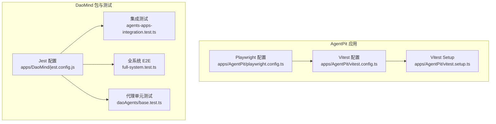
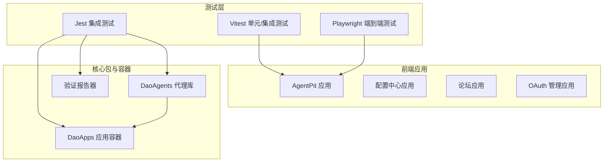
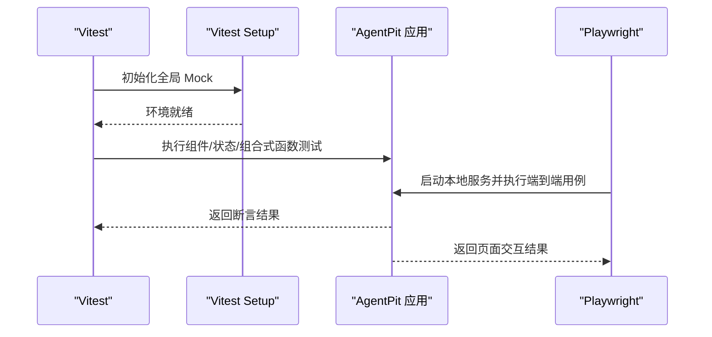
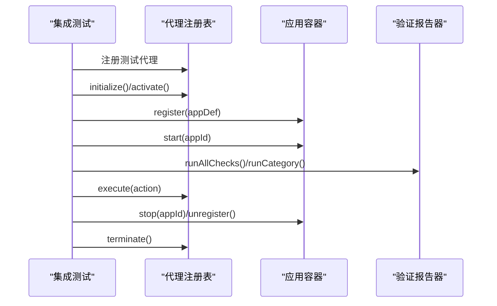
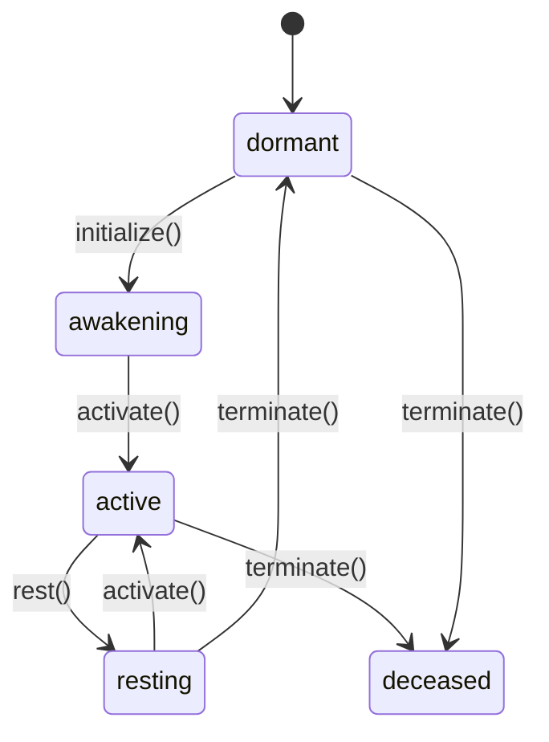
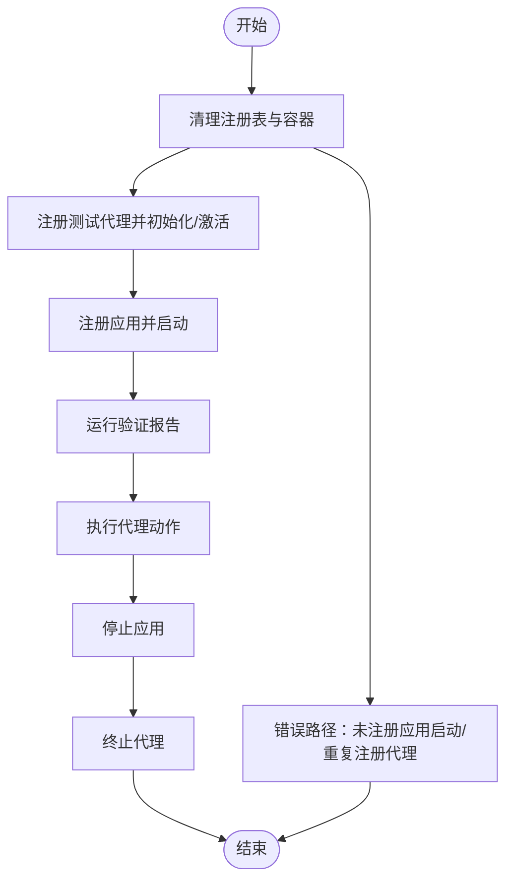
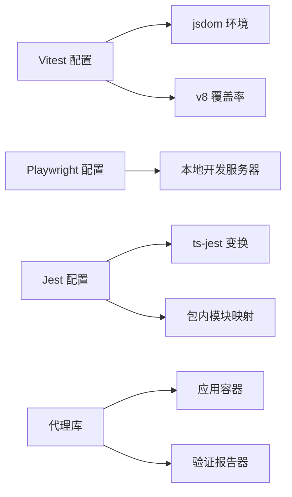

# 集成测试

<cite>
**本文引用的文件**
- [apps/AgentPit/vitest.config.ts](file://apps/AgentPit/vitest.config.ts)
- [apps/AgentPit/vitest.setup.ts](file://apps/AgentPit/vitest.setup.ts)
- [apps/AgentPit/playwright.config.ts](file://apps/AgentPit/playwright.config.ts)
- [apps/DaoMind/jest.config.js](file://apps/DaoMind/jest.config.js)
- [apps/DaoMind/src/__tests__/e2e/full-system.test.ts](file://apps/DaoMind/src/__tests__/e2e/full-system.test.ts)
- [apps/DaoMind/src/__tests__/integration/agents-apps-integration.test.ts](file://apps/DaoMind/src/__tests__/integration/agents-apps-integration.test.ts)
- [apps/DaoMind/packages/daoAgents/src/__tests__/base.test.ts](file://apps/DaoMind/packages/daoAgents/src/__tests__/base.test.ts)
</cite>

## 目录
1. [引言](#引言)
2. [项目结构](#项目结构)
3. [核心组件](#核心组件)
4. [架构总览](#架构总览)
5. [详细组件分析](#详细组件分析)
6. [依赖关系分析](#依赖关系分析)
7. [性能考虑](#性能考虑)
8. [故障排查指南](#故障排查指南)
9. [结论](#结论)
10. [附录](#附录)

## 引言
本文件面向 DAOApps 项目的集成测试实践，系统性阐述组件间交互测试、API 集成测试与状态管理集成测试的实施方法；说明测试环境配置、Mock 服务设置与数据库连接管理策略；给出端到端功能测试流程（用户工作流、业务逻辑验证、错误处理）；并提供测试数据准备、场景设计与用例编写的指导，涵盖测试隔离、依赖管理与执行顺序控制，以及断言方法、结果验证与性能指标监控建议。

## 项目结构
DAOApps 采用多应用与多包混合结构，集成测试主要分布在以下位置：
- 前端应用 AgentPit：使用 Vitest 进行单元/集成测试，Playwright 进行 E2E 测试，并在 Vitest 中通过 setup 文件进行浏览器环境模拟与第三方库 Mock。
- DaoMind 核心包：使用 Jest 进行集成测试，覆盖代理与应用容器的跨模块交互；同时包含 E2E 全链路测试与集成测试套件。

图表来源
- [apps/AgentPit/vitest.config.ts:1-48](file://apps/AgentPit/vitest.config.ts#L1-L48)
- [apps/AgentPit/vitest.setup.ts:1-47](file://apps/AgentPit/vitest.setup.ts#L1-L47)
- [apps/AgentPit/playwright.config.ts:1-28](file://apps/AgentPit/playwright.config.ts#L1-L28)
- [apps/DaoMind/jest.config.js:1-59](file://apps/DaoMind/jest.config.js#L1-L59)
- [apps/DaoMind/src/__tests__/integration/agents-apps-integration.test.ts:1-113](file://apps/DaoMind/src/__tests__/integration/agents-apps-integration.test.ts#L1-L113)
- [apps/DaoMind/src/__tests__/e2e/full-system.test.ts:1-120](file://apps/DaoMind/src/__tests__/e2e/full-system.test.ts#L1-L120)
- [apps/DaoMind/packages/daoAgents/src/__tests__/base.test.ts:1-91](file://apps/DaoMind/packages/daoAgents/src/__tests__/base.test.ts#L1-L91)

章节来源
- [apps/AgentPit/vitest.config.ts:1-48](file://apps/AgentPit/vitest.config.ts#L1-L48)
- [apps/AgentPit/vitest.setup.ts:1-47](file://apps/AgentPit/vitest.setup.ts#L1-L47)
- [apps/AgentPit/playwright.config.ts:1-28](file://apps/AgentPit/playwright.config.ts#L1-L28)
- [apps/DaoMind/jest.config.js:1-59](file://apps/DaoMind/jest.config.js#L1-L59)

## 核心组件
- 测试运行器与环境
  - Vitest：用于前端应用的单元/集成测试，支持 jsdom 环境、覆盖率统计与别名配置。
  - Playwright：用于端到端测试，内置 Web 服务器启动与设备配置。
  - Jest：用于 DaoMind 多包集成测试，支持 ES Module 映射与覆盖率阈值。
- Mock 与环境准备
  - Vitest Setup：对 matchMedia、ResizeObserver、第三方可视化库等进行 Mock，确保测试在无浏览器环境中稳定运行。
- 关键测试套件
  - DaoMind 全系统 E2E：验证代理注册、应用容器生命周期与验证报告生成。
  - DaoMind 代理与应用集成测试：验证代理状态机与应用依赖启动流程。
  - 代理单元测试：验证代理状态转换与动作执行。

章节来源
- [apps/AgentPit/vitest.config.ts:7-41](file://apps/AgentPit/vitest.config.ts#L7-L41)
- [apps/AgentPit/vitest.setup.ts:3-46](file://apps/AgentPit/vitest.setup.ts#L3-L46)
- [apps/AgentPit/playwright.config.ts:3-27](file://apps/AgentPit/playwright.config.ts#L3-L27)
- [apps/DaoMind/jest.config.js:1-59](file://apps/DaoMind/jest.config.js#L1-L59)
- [apps/DaoMind/src/__tests__/e2e/full-system.test.ts:5-88](file://apps/DaoMind/src/__tests__/e2e/full-system.test.ts#L5-L88)
- [apps/DaoMind/src/__tests__/integration/agents-apps-integration.test.ts:26-80](file://apps/DaoMind/src/__tests__/integration/agents-apps-integration.test.ts#L26-L80)
- [apps/DaoMind/packages/daoAgents/src/__tests__/base.test.ts:18-90](file://apps/DaoMind/packages/daoAgents/src/__tests__/base.test.ts#L18-L90)

## 架构总览
下图展示集成测试在系统中的位置与交互关系：前端应用通过 Vitest/Jest 进行组件与模块级测试；Playwright 负责端到端用户路径；DaoMind 的代理与应用容器在集成测试中协同工作，形成跨模块验证闭环。

图表来源
- [apps/AgentPit/vitest.config.ts:1-48](file://apps/AgentPit/vitest.config.ts#L1-L48)
- [apps/AgentPit/playwright.config.ts:1-28](file://apps/AgentPit/playwright.config.ts#L1-L28)
- [apps/DaoMind/jest.config.js:1-59](file://apps/DaoMind/jest.config.js#L1-L59)
- [apps/DaoMind/src/__tests__/e2e/full-system.test.ts:1-120](file://apps/DaoMind/src/__tests__/e2e/full-system.test.ts#L1-L120)
- [apps/DaoMind/src/__tests__/integration/agents-apps-integration.test.ts:1-113](file://apps/DaoMind/src/__tests__/integration/agents-apps-integration.test.ts#L1-L113)

## 详细组件分析

### 组件 A：前端应用测试（AgentPit）
- 测试运行器与环境
  - Vitest 使用 jsdom 环境，适合 DOM 操作与组件行为测试；配置了覆盖率统计与别名映射。
  - Playwright 配置了单设备项目、重试策略与 Web 服务器启动参数，便于端到端回归。
- Mock 与环境准备
  - 在 Vitest Setup 中对 matchMedia、ResizeObserver、可视化库进行 Mock，避免真实 DOM 与第三方库依赖。
- 断言与覆盖率
  - 覆盖率目标与报告器已在 Vitest 配置中定义，确保关键目录得到充分验证。

图表来源
- [apps/AgentPit/vitest.config.ts:7-41](file://apps/AgentPit/vitest.config.ts#L7-L41)
- [apps/AgentPit/vitest.setup.ts:3-46](file://apps/AgentPit/vitest.setup.ts#L3-L46)
- [apps/AgentPit/playwright.config.ts:21-26](file://apps/AgentPit/playwright.config.ts#L21-L26)

章节来源
- [apps/AgentPit/vitest.config.ts:1-48](file://apps/AgentPit/vitest.config.ts#L1-L48)
- [apps/AgentPit/vitest.setup.ts:1-47](file://apps/AgentPit/vitest.setup.ts#L1-L47)
- [apps/AgentPit/playwright.config.ts:1-28](file://apps/AgentPit/playwright.config.ts#L1-L28)

### 组件 B：DaoMind 集成测试（代理与应用容器）
- 测试目标
  - 验证代理注册、初始化、激活、休眠与终止的状态机。
  - 验证应用容器注册、启动、停止与依赖管理。
  - 验证全系统流程与错误处理。
- 关键流程
  - 代理状态转换：dormant → awakening → active → resting → dormant/deceased。
  - 应用依赖：主应用启动前需满足依赖应用处于运行态。
  - 错误处理：未注册应用启动、重复注册代理等异常场景。

图表来源
- [apps/DaoMind/src/__tests__/integration/agents-apps-integration.test.ts:26-80](file://apps/DaoMind/src/__tests__/integration/agents-apps-integration.test.ts#L26-L80)
- [apps/DaoMind/src/__tests__/e2e/full-system.test.ts:27-88](file://apps/DaoMind/src/__tests__/e2e/full-system.test.ts#L27-L88)

章节来源
- [apps/DaoMind/src/__tests__/integration/agents-apps-integration.test.ts:1-113](file://apps/DaoMind/src/__tests__/integration/agents-apps-integration.test.ts#L1-L113)
- [apps/DaoMind/src/__tests__/e2e/full-system.test.ts:1-120](file://apps/DaoMind/src/__tests__/e2e/full-system.test.ts#L1-L120)

### 组件 C：代理状态机与动作执行（单元测试）
- 测试要点
  - 代理初始状态、能力列表与动作执行返回值。
  - 状态转换合法性校验与非法转换抛错。
  - 多状态往返转换的正确性。

图表来源
- [apps/DaoMind/packages/daoAgents/src/__tests__/base.test.ts:25-78](file://apps/DaoMind/packages/daoAgents/src/__tests__/base.test.ts#L25-L78)

章节来源
- [apps/DaoMind/packages/daoAgents/src/__tests__/base.test.ts:1-91](file://apps/DaoMind/packages/daoAgents/src/__tests__/base.test.ts#L1-L91)

### 组件 D：E2E 端到端测试（DaoMind 全系统）
- 测试范围
  - 代理与应用容器的完整生命周期。
  - 验证报告生成与分类检查。
  - 错误场景：未注册应用启动、重复代理注册。
- 执行顺序
  - 清理阶段：先注销所有代理与应用实例，再执行用例。
  - 主流程：注册代理 → 初始化/激活 → 注册应用 → 启动 → 执行动作 → 停止应用 → 终止代理。
  - 错误处理：断言异常消息与计数。

图表来源
- [apps/DaoMind/src/__tests__/e2e/full-system.test.ts:6-25](file://apps/DaoMind/src/__tests__/e2e/full-system.test.ts#L6-L25)
- [apps/DaoMind/src/__tests__/e2e/full-system.test.ts:90-119](file://apps/DaoMind/src/__tests__/e2e/full-system.test.ts#L90-L119)

章节来源
- [apps/DaoMind/src/__tests__/e2e/full-system.test.ts:1-120](file://apps/DaoMind/src/__tests__/e2e/full-system.test.ts#L1-L120)

## 依赖关系分析
- 模块耦合
  - 代理与应用容器通过注册表与容器接口解耦，集成测试通过统一入口进行交互验证。
- 外部依赖
  - Vitest 依赖 jsdom 与 v8 覆盖率提供器；Playwright 依赖本地开发服务器；Jest 依赖 ts-jest 与 ES Module 映射。
- 循环依赖
  - 当前测试配置未见循环依赖迹象；建议在新增测试时保持对核心模块的只读访问。

图表来源
- [apps/AgentPit/vitest.config.ts:7-41](file://apps/AgentPit/vitest.config.ts#L7-L41)
- [apps/AgentPit/playwright.config.ts:21-26](file://apps/AgentPit/playwright.config.ts#L21-L26)
- [apps/DaoMind/jest.config.js:35-59](file://apps/DaoMind/jest.config.js#L35-L59)

章节来源
- [apps/AgentPit/vitest.config.ts:1-48](file://apps/AgentPit/vitest.config.ts#L1-L48)
- [apps/AgentPit/playwright.config.ts:1-28](file://apps/AgentPit/playwright.config.ts#L1-L28)
- [apps/DaoMind/jest.config.js:1-59](file://apps/DaoMind/jest.config.js#L1-L59)

## 性能考虑
- 并发与资源
  - Jest 配置了最大并发与超时时间，建议在 CI 中限制并发以避免资源争用。
  - Playwright 在 CI 下调整 worker 数量，减少端到端测试的内存占用。
- 覆盖率与开销
  - Vitest 的覆盖率统计会增加执行时间，建议在本地开启，CI 中按需裁剪。
- 数据与网络
  - 集成测试应尽量使用 Mock 或本地服务，避免真实外部依赖导致不稳定与耗时。

## 故障排查指南
- 环境问题
  - jsdom 环境缺失：确认 Vitest 环境配置与 Setup 文件已加载。
  - ResizeObserver/matchMedia 报错：检查 Vitest Setup 是否正确注入 Mock。
- 代理/应用状态异常
  - 代理状态转换失败：核对 initialize/activate/rest/terminate 的调用顺序与断言。
  - 应用依赖未就绪：确保依赖应用先于主应用启动。
- 端到端失败
  - 本地服务未启动：检查 Playwright Web 服务器命令与端口。
  - 截图与 Trace：利用重试时的 trace 与失败截图定位问题。

章节来源
- [apps/AgentPit/vitest.setup.ts:3-46](file://apps/AgentPit/vitest.setup.ts#L3-L46)
- [apps/AgentPit/playwright.config.ts:21-26](file://apps/AgentPit/playwright.config.ts#L21-L26)
- [apps/DaoMind/src/__tests__/integration/agents-apps-integration.test.ts:82-112](file://apps/DaoMind/src/__tests__/integration/agents-apps-integration.test.ts#L82-L112)
- [apps/DaoMind/src/__tests__/e2e/full-system.test.ts:90-119](file://apps/DaoMind/src/__tests__/e2e/full-system.test.ts#L90-L119)

## 结论
DAOApps 的集成测试体系由前端 Vitest/Playwright 与 DaoMind Jest 三部分组成，分别覆盖组件/状态测试、端到端用户路径与跨模块交互验证。通过合理的环境配置、Mock 设置与严格的断言策略，能够有效保障系统在组件交互、API 集成与状态管理方面的稳定性与一致性。建议在后续迭代中持续完善测试数据准备、场景设计与性能监控，提升测试效率与覆盖率。

## 附录
- 测试数据准备
  - 使用最小化、可复现的数据集；对易变外部依赖进行 Mock。
- 测试场景设计
  - 正向流程：完整用户工作流与业务逻辑验证。
  - 边界条件：空输入、超长字符串、边界数值。
  - 错误处理：异常输入、网络中断、权限不足。
- 测试用例编写指南
  - 每个用例聚焦单一行为；前置条件清晰；断言明确且可验证。
- 测试隔离与依赖管理
  - 使用 beforeEach 清理全局状态；避免共享可变状态；对异步操作使用超时与重试。
- 执行顺序控制
  - 通过 Jest/Vitest 的顺序控制与分组执行，保证依赖先行。
- 断言与结果验证
  - 使用明确的 expect 断言；对异步结果使用 await；对错误场景断言异常类型与消息。
- 性能指标监控
  - 记录测试执行时间、覆盖率与失败率；在 CI 中建立基线与告警。