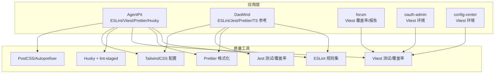
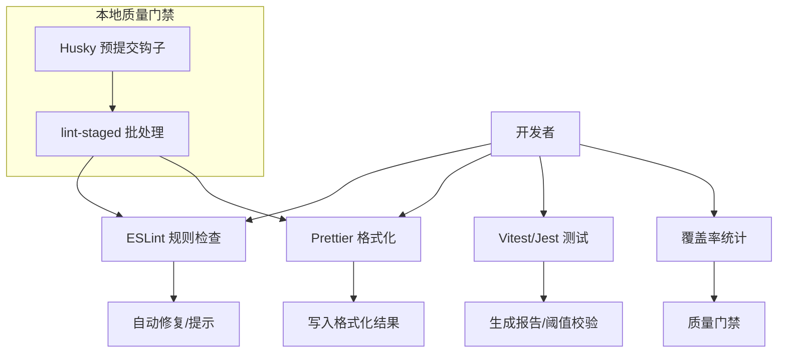
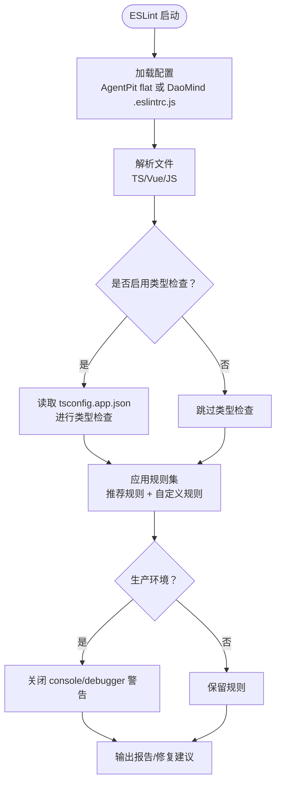
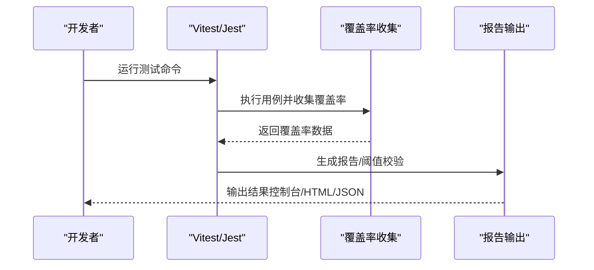
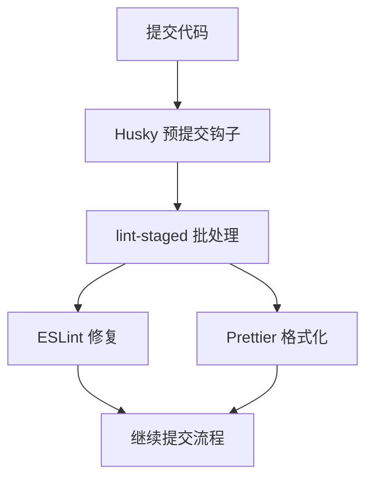
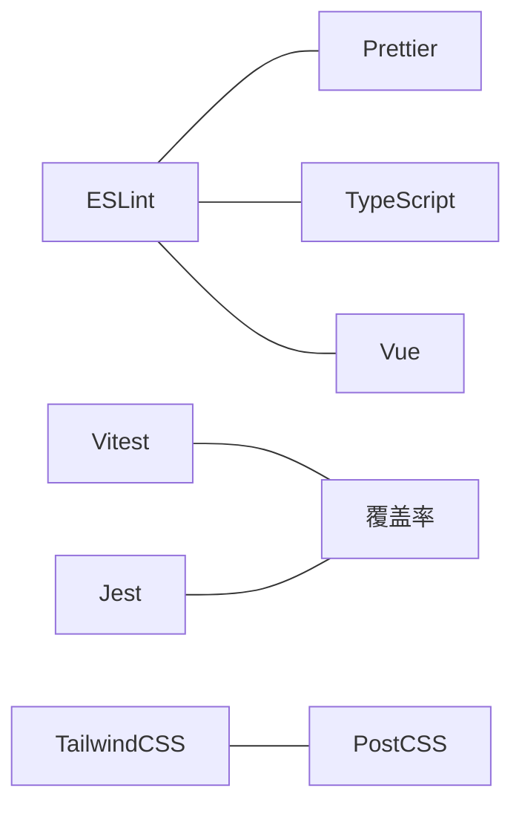

# 代码质量保证

<cite>
**本文引用的文件**
- [apps/AgentPit/eslint.config.js](file://apps/AgentPit/eslint.config.js)
- [apps/AgentPit/package.json](file://apps/AgentPit/package.json)
- [apps/AgentPit/tailwind.config.ts](file://apps/AgentPit/tailwind.config.ts)
- [apps/AgentPit/postcss.config.js](file://apps/AgentPit/postcss.config.js)
- [apps/AgentPit/vitest.config.ts](file://apps/AgentPit/vitest.config.ts)
- [apps/DaoMind/.eslintrc.js](file://apps/DaoMind/.eslintrc.js)
- [apps/DaoMind/.prettierrc](file://apps/DaoMind/.prettierrc)
- [apps/DaoMind/jest.config.js](file://apps/DaoMind/jest.config.js)
- [apps/DaoMind/tsconfig.json](file://apps/DaoMind/tsconfig.json)
- [apps/DaoMind/eslint.config.js](file://apps/DaoMind/eslint.config.js)
- [apps/DaoMind/package.json](file://apps/DaoMind/package.json)
- [apps/forum/vitest.config.ts](file://apps/forum/vitest.config.ts)
- [apps/oauth-admin/vitest.config.ts](file://apps/oauth-admin/vitest.config.ts)
- [apps/config-center/vitest.config.ts](file://apps/config-center/vitest.config.ts)
- [apps/AgentPit/.gitignore](file://apps/AgentPit/.gitignore)
</cite>

## 目录
1. [简介](#简介)
2. [项目结构](#项目结构)
3. [核心组件](#核心组件)
4. [架构总览](#架构总览)
5. [详细组件分析](#详细组件分析)
6. [依赖关系分析](#依赖关系分析)
7. [性能考量](#性能考量)
8. [故障排查指南](#故障排查指南)
9. [结论](#结论)
10. [附录](#附录)

## 简介
本文件面向“代码质量保证”主题，系统梳理并说明本仓库中各应用的静态代码分析、格式化、测试与覆盖率、Git 钩子与预提交检查等质量保障体系。重点覆盖以下方面：
- ESLint 规则配置与类型检查策略
- Prettier 代码格式化与 EditorConfig 统一风格
- 测试与覆盖率配置（Jest/Vitest）
- Git 钩子与预提交检查（Husky + lint-staged）
- 持续集成中的质量门禁建议
- TypeScript 与 Vue/React 组件规范要点
- 安全与重复代码检测的扩展建议

## 项目结构
本仓库采用多应用/多包混合结构，包含多个前端应用与一个大型 monorepo 工程。质量保证相关的关键位置如下：
- 应用层：AgentPit、DaoMind、forum、oauth-admin、config-center 等
- 质量配置：各应用根目录下的 ESLint、Prettier、Vitest/Jest、TailwindCSS、PostCSS、package.json 脚本与 Husky/lint-staged 配置
- monorepo 核心：DaoMind 的 tsconfig.json 引用多个 packages，便于统一 TS 编译与类型检查

图表来源
- [apps/AgentPit/eslint.config.js:1-162](file://apps/AgentPit/eslint.config.js#L1-L162)
- [apps/AgentPit/package.json:1-74](file://apps/AgentPit/package.json#L1-L74)
- [apps/DaoMind/.eslintrc.js:1-46](file://apps/DaoMind/.eslintrc.js#L1-L46)
- [apps/DaoMind/.prettierrc:1-1](file://apps/DaoMind/.prettierrc#L1-L1)
- [apps/DaoMind/jest.config.js:1-59](file://apps/DaoMind/jest.config.js#L1-L59)
- [apps/DaoMind/tsconfig.json:1-1](file://apps/DaoMind/tsconfig.json#L1-L1)
- [apps/AgentPit/tailwind.config.ts:1-27](file://apps/AgentPit/tailwind.config.ts#L1-L27)
- [apps/AgentPit/postcss.config.js:1-6](file://apps/AgentPit/postcss.config.js#L1-L6)
- [apps/AgentPit/vitest.config.ts:1-47](file://apps/AgentPit/vitest.config.ts#L1-L47)
- [apps/forum/vitest.config.ts:1-40](file://apps/forum/vitest.config.ts#L1-L40)
- [apps/oauth-admin/vitest.config.ts:1-17](file://apps/oauth-admin/vitest.config.ts#L1-L17)
- [apps/config-center/vitest.config.ts:1-17](file://apps/config-center/vitest.config.ts#L1-L17)

章节来源
- [apps/AgentPit/package.json:1-74](file://apps/AgentPit/package.json#L1-L74)
- [apps/DaoMind/tsconfig.json:1-1](file://apps/DaoMind/tsconfig.json#L1-L1)

## 核心组件
- ESLint 配置
  - AgentPit 使用 flat 配置，启用 JS/TS/Vue 推荐规则，并通过 eslint-config-prettier 关闭与 Prettier 冲突的规则；对生产环境关闭 console/debugger 警告，对 Vue 组件命名、v-html 等规则进行按需放宽。
  - DaoMind 使用传统 .eslintrc.js，强调命名约定（公共导出必须以 dao 前缀）、未使用变量处理、显式返回类型等规则。
- Prettier 配置
  - DaoMind 提供 .prettierrc，定义分号、单引号、缩进宽度、尾随逗号、行长、括号间距、箭头函数括号、换行符等风格选项。
- TailwindCSS 与 PostCSS
  - AgentPit 提供 tailwind.config.ts 与 postcss.config.js，用于内容扫描路径与自动前缀。
- 测试与覆盖率
  - AgentPit 使用 Vitest，配置了覆盖率阈值与报告器，限定覆盖范围。
  - DaoMind 使用 Jest，配置了全局覆盖率阈值与模块映射。
  - forum/oauth-admin/config-center 各自提供 Vitest 配置，含覆盖率、报告输出、别名与测试环境。
- Git 钩子与预提交检查
  - AgentPit 在 package.json 中声明 prepare 并通过 lint-staged 对 JS/TS/Vue 文件执行 ESLint 修复与 Prettier 格式化。

章节来源
- [apps/AgentPit/eslint.config.js:1-162](file://apps/AgentPit/eslint.config.js#L1-L162)
- [apps/DaoMind/.eslintrc.js:1-46](file://apps/DaoMind/.eslintrc.js#L1-L46)
- [apps/DaoMind/.prettierrc:1-1](file://apps/DaoMind/.prettierrc#L1-L1)
- [apps/AgentPit/tailwind.config.ts:1-27](file://apps/AgentPit/tailwind.config.ts#L1-L27)
- [apps/AgentPit/postcss.config.js:1-6](file://apps/AgentPit/postcss.config.js#L1-L6)
- [apps/AgentPit/vitest.config.ts:1-47](file://apps/AgentPit/vitest.config.ts#L1-L47)
- [apps/DaoMind/jest.config.js:1-59](file://apps/DaoMind/jest.config.js#L1-L59)
- [apps/forum/vitest.config.ts:1-40](file://apps/forum/vitest.config.ts#L1-L40)
- [apps/oauth-admin/vitest.config.ts:1-17](file://apps/oauth-admin/vitest.config.ts#L1-L17)
- [apps/config-center/vitest.config.ts:1-17](file://apps/config-center/vitest.config.ts#L1-L17)
- [apps/AgentPit/package.json:64-72](file://apps/AgentPit/package.json#L64-L72)

## 架构总览
下图展示质量保证在各应用中的整体协作方式：ESLint 负责静态规则检查，Prettier 负责格式化，Vitest/Jest 负责单元/集成测试与覆盖率，Husky/lint-staged 在本地提交前拦截并修复问题，TailwindCSS/PostCSS 保障样式一致性。

图表来源
- [apps/AgentPit/package.json:64-72](file://apps/AgentPit/package.json#L64-L72)
- [apps/AgentPit/eslint.config.js:1-162](file://apps/AgentPit/eslint.config.js#L1-L162)
- [apps/DaoMind/.prettierrc:1-1](file://apps/DaoMind/.prettierrc#L1-L1)
- [apps/AgentPit/vitest.config.ts:1-47](file://apps/AgentPit/vitest.config.ts#L1-L47)
- [apps/DaoMind/jest.config.js:1-59](file://apps/DaoMind/jest.config.js#L1-L59)

## 详细组件分析

### ESLint 配置分析
- AgentPit（flat 配置）
  - 推荐规则启用：JS/TS/Vue 推荐规则已启用，避免常见错误与不规范写法。
  - 忽略模式：忽略 dist、node_modules、配置文件、特定备份目录、e2e 与 __tests__ 目录。
  - 类型检查：通过 tsconfig.app.json 进行类型检查，支持 Vue 单文件组件。
  - 生产环境策略：生产环境关闭 console/debugger 警告，降低噪音。
  - Vue 规则放宽：组件命名、v-html、属性顺序等规则按需放宽，提升开发体验。
- DaoMind（传统配置）
  - 命名约定：强制公共导出以 dao 前缀命名，提升包内一致性。
  - 未使用变量：允许忽略以 _ 开头的参数，减少样板代码噪声。
  - 显式返回类型：对函数返回类型进行警告，鼓励明确性。
  - 环境：同时支持 ES2022 与 Node 环境。

图表来源
- [apps/AgentPit/eslint.config.js:1-162](file://apps/AgentPit/eslint.config.js#L1-L162)
- [apps/DaoMind/.eslintrc.js:1-46](file://apps/DaoMind/.eslintrc.js#L1-L46)

章节来源
- [apps/AgentPit/eslint.config.js:7-162](file://apps/AgentPit/eslint.config.js#L7-L162)
- [apps/DaoMind/.eslintrc.js:1-46](file://apps/DaoMind/.eslintrc.js#L1-L46)

### Prettier 与 EditorConfig 统一配置
- Prettier 配置（DaoMind）
  - 分号：关闭
  - 单引号：开启
  - 缩进宽度：2
  - 尾随逗号：全部
  - 行长：100
  - 括号间距：开启
  - 箭头函数括号：始终
  - 换行符：LF
- EditorConfig 建议
  - 统一缩进与换行符，建议在仓库根目录添加 .editorconfig，约束 IDE 默认行为，避免因编辑器差异导致的格式漂移。

章节来源
- [apps/DaoMind/.prettierrc:1-1](file://apps/DaoMind/.prettierrc#L1-L1)

### TailwindCSS 与 PostCSS
- TailwindCSS
  - content 扫描路径包含 src 下的 Vue/JS/TS 文件，确保仅打包使用到的样式。
  - 主题扩展了自定义 primary 色板，便于组件库风格统一。
- PostCSS
  - 自动前缀插件，确保兼容不同浏览器。

章节来源
- [apps/AgentPit/tailwind.config.ts:1-27](file://apps/AgentPit/tailwind.config.ts#L1-L27)
- [apps/AgentPit/postcss.config.js:1-6](file://apps/AgentPit/postcss.config.js#L1-L6)

### 测试与覆盖率配置
- AgentPit（Vitest）
  - 覆盖率报告器：text、json、html、lcov
  - 覆盖范围：组件、store、composables、utils
  - 阈值：行/函数/分支/语句 80%/75%
- DaoMind（Jest）
  - 全局覆盖率阈值：80%
  - 模块映射：将 @daomind/* 映射到对应 packages 目录
- forum/oauth-admin/config-center（Vitest）
  - 覆盖率与报告输出、JSON 报告、测试超时、别名与 jsdom 环境

图表来源
- [apps/AgentPit/vitest.config.ts:1-47](file://apps/AgentPit/vitest.config.ts#L1-L47)
- [apps/DaoMind/jest.config.js:1-59](file://apps/DaoMind/jest.config.js#L1-L59)
- [apps/forum/vitest.config.ts:1-40](file://apps/forum/vitest.config.ts#L1-L40)
- [apps/oauth-admin/vitest.config.ts:1-17](file://apps/oauth-admin/vitest.config.ts#L1-L17)
- [apps/config-center/vitest.config.ts:1-17](file://apps/config-center/vitest.config.ts#L1-L17)

章节来源
- [apps/AgentPit/vitest.config.ts:1-47](file://apps/AgentPit/vitest.config.ts#L1-L47)
- [apps/DaoMind/jest.config.js:1-59](file://apps/DaoMind/jest.config.js#L1-L59)
- [apps/forum/vitest.config.ts:1-40](file://apps/forum/vitest.config.ts#L1-L40)
- [apps/oauth-admin/vitest.config.ts:1-17](file://apps/oauth-admin/vitest.config.ts#L1-L17)
- [apps/config-center/vitest.config.ts:1-17](file://apps/config-center/vitest.config.ts#L1-L17)

### Git 钩子与预提交检查
- Husky
  - 在 package.json 中通过 prepare 脚本初始化 husky。
- lint-staged
  - 对 JS/TS/Vue 执行 ESLint 修复与 Prettier 格式化
  - 对 JSON/MD/CSS 执行 Prettier 格式化
- .gitignore
  - 忽略日志、node_modules、dist、环境文件与编辑器临时文件，减少无关文件进入版本控制。

图表来源
- [apps/AgentPit/package.json:64-72](file://apps/AgentPit/package.json#L64-L72)
- [apps/AgentPit/.gitignore:1-31](file://apps/AgentPit/.gitignore#L1-L31)

章节来源
- [apps/AgentPit/package.json:15-18](file://apps/AgentPit/package.json#L15-L18)
- [apps/AgentPit/package.json:64-72](file://apps/AgentPit/package.json#L64-L72)
- [apps/AgentPit/.gitignore:1-31](file://apps/AgentPit/.gitignore#L1-L31)

### TypeScript 与 Vue/React 组件规范（最佳实践）
- TypeScript
  - 命名约定：公共导出以 dao 前缀（DaoMind），或遵循 camelCase/PascalCase/UPPER_CASE（AgentPit）。
  - 显式返回类型：鼓励函数返回类型明确，减少隐式 any。
  - 未使用变量：允许忽略以 _ 开头的参数，降低样板代码。
- Vue 组件
  - 组件命名：可按需放宽多词组件命名规则（AgentPit），但建议团队统一风格。
  - 属性顺序与换行：可按需放宽属性顺序与换行规则，但建议统一。
  - v-html：谨慎使用，必要时开启严格校验。
- React 组件
  - 建议与 Vue 类似，统一命名与属性顺序；如使用 TypeScript，保持显式类型与无未使用变量。

章节来源
- [apps/DaoMind/.eslintrc.js:17-40](file://apps/DaoMind/.eslintrc.js#L17-L40)
- [apps/AgentPit/eslint.config.js:130-146](file://apps/AgentPit/eslint.config.js#L130-L146)

### 安全与重复代码检测（扩展建议）
- 安全漏洞扫描
  - 建议在 CI 中集成 npm audit 或 snyk，定期扫描依赖安全风险。
- 重复代码检测
  - 建议引入 SonarQube 或 Codacy，对重复代码、圈复杂度、注释率等指标进行持续监控。
- 代码异味与复杂度
  - 结合 ESLint 规则（如 no-long-func、max-params 等）与工具（如 complexity、cognitive-complexity）进行控制。

（本节为通用建议，无需具体文件来源）

## 依赖关系分析
- ESLint 与 Prettier
  - AgentPit：ESLint 与 Prettier 通过 flat 配置与 lint-staged 协作，避免冲突规则影响格式化。
  - DaoMind：ESLint 与 Prettier 分离配置，通过 extends: ['prettier'] 关闭冲突规则。
- 测试工具链
  - AgentPit：Vitest 配置了覆盖率阈值与报告器，适合组件与工具函数测试。
  - DaoMind：Jest 配置了全局覆盖率阈值与模块映射，适合 monorepo 场景。
  - forum/oauth-admin/config-center：Vitest 配置了报告输出与测试超时，适配各自业务场景。
- 样式工具链
  - TailwindCSS 与 PostCSS 在 AgentPit 中协同，确保内容扫描与自动前缀。

图表来源
- [apps/AgentPit/eslint.config.js:1-162](file://apps/AgentPit/eslint.config.js#L1-L162)
- [apps/DaoMind/.eslintrc.js:1-46](file://apps/DaoMind/.eslintrc.js#L1-L46)
- [apps/AgentPit/vitest.config.ts:1-47](file://apps/AgentPit/vitest.config.ts#L1-L47)
- [apps/DaoMind/jest.config.js:1-59](file://apps/DaoMind/jest.config.js#L1-L59)
- [apps/AgentPit/tailwind.config.ts:1-27](file://apps/AgentPit/tailwind.config.ts#L1-L27)
- [apps/AgentPit/postcss.config.js:1-6](file://apps/AgentPit/postcss.config.js#L1-L6)

章节来源
- [apps/AgentPit/eslint.config.js:1-162](file://apps/AgentPit/eslint.config.js#L1-L162)
- [apps/DaoMind/.eslintrc.js:1-46](file://apps/DaoMind/.eslintrc.js#L1-L46)
- [apps/AgentPit/vitest.config.ts:1-47](file://apps/AgentPit/vitest.config.ts#L1-L47)
- [apps/DaoMind/jest.config.js:1-59](file://apps/DaoMind/jest.config.js#L1-L59)
- [apps/AgentPit/tailwind.config.ts:1-27](file://apps/AgentPit/tailwind.config.ts#L1-L27)
- [apps/AgentPit/postcss.config.js:1-6](file://apps/AgentPit/postcss.config.js#L1-L6)

## 性能考量
- ESLint 性能
  - 使用 tsconfig.app.json 指定项目路径，避免全仓库扫描；合理设置忽略模式，减少不必要的文件处理。
- Prettier 性能
  - 仅对 src 目录进行格式化检查，避免对 node_modules、dist 等目录扫描。
- 测试性能
  - Vitest/Jest 合理设置 maxWorkers、testTimeout，避免长时间阻塞 CI。
- 样式构建
  - TailwindCSS content 路径尽量精确，避免扫描过多文件；PostCSS 自动前缀仅在必要时启用。

（本节为通用指导，无需具体文件来源）

## 故障排查指南
- ESLint 报错与冲突
  - 若出现与 Prettier 冲突的规则，确认已启用 eslint-config-prettier；检查 AgentPit 的 flat 配置是否正确关闭冲突规则。
- Prettier 格式化不生效
  - 检查 .prettierrc 是否存在且路径正确；确认 lint-staged 对应文件类型的处理链路。
- 测试覆盖率不达标
  - 检查 Vitest/Jest 配置中的 include/exclude 与阈值设置；确保测试文件命名与路径符合匹配规则。
- Husky/lint-staged 未触发
  - 确认 package.json 中 prepare 脚本已执行；检查 .husky 目录是否存在；确认 lint-staged 配置与文件类型匹配。
- TailwindCSS 样式未生效
  - 检查 tailwind.config.ts 的 content 路径是否包含当前组件；确认 PostCSS 插件已正确安装与启用。

章节来源
- [apps/AgentPit/eslint.config.js:1-162](file://apps/AgentPit/eslint.config.js#L1-L162)
- [apps/DaoMind/.prettierrc:1-1](file://apps/DaoMind/.prettierrc#L1-L1)
- [apps/AgentPit/vitest.config.ts:1-47](file://apps/AgentPit/vitest.config.ts#L1-L47)
- [apps/DaoMind/jest.config.js:1-59](file://apps/DaoMind/jest.config.js#L1-L59)
- [apps/AgentPit/package.json:64-72](file://apps/AgentPit/package.json#L64-L72)
- [apps/AgentPit/tailwind.config.ts:1-27](file://apps/AgentPit/tailwind.config.ts#L1-L27)
- [apps/AgentPit/postcss.config.js:1-6](file://apps/AgentPit/postcss.config.js#L1-L6)

## 结论
本仓库已在多应用层面建立了较为完善的代码质量保证体系：ESLint/Vue/TS 规则、Prettier 格式化、Vitest/Jest 测试与覆盖率、Husky/lint-staged 预提交检查、TailwindCSS/PostCSS 样式工具链。建议在现有基础上进一步引入安全扫描与重复代码检测，并在 CI 中固化质量门禁，以实现从本地到流水线的全流程质量保障。

## 附录
- 脚本与命令参考（摘自 package.json）
  - lint：对 .vue/.js/.jsx/.cjs/.mjs/.ts/.tsx/.cts/.mts 执行 ESLint 修复
  - lint:check：仅检查不修复
  - format：对 src 目录执行 Prettier 格式化
  - format:check：检查格式化状态
  - type-check：TypeScript 类型检查
  - test/test:run/test:coverage：Vitest 测试与覆盖率
- monorepo TS 配置参考
  - DaoMind 的 tsconfig.json 通过 references 引用多个 packages，便于统一编译与类型检查。

章节来源
- [apps/AgentPit/package.json:6-18](file://apps/AgentPit/package.json#L6-L18)
- [apps/DaoMind/tsconfig.json:1-1](file://apps/DaoMind/tsconfig.json#L1-L1)