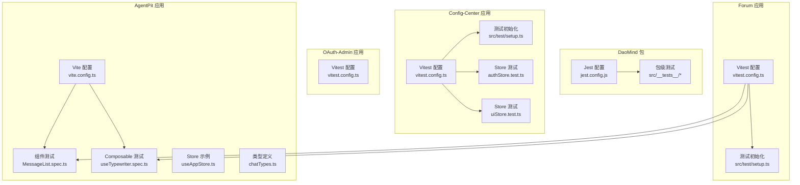
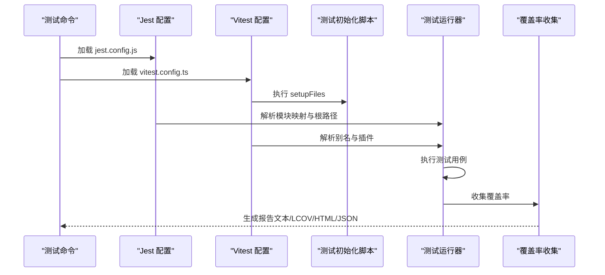
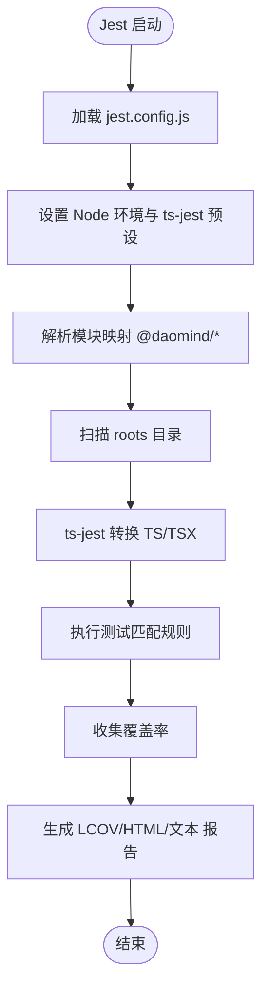
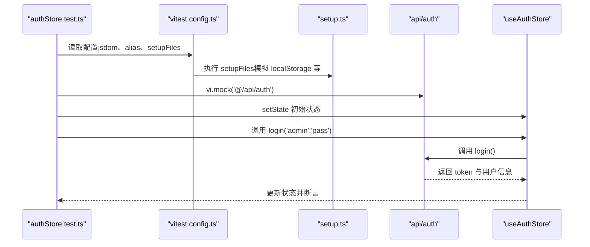
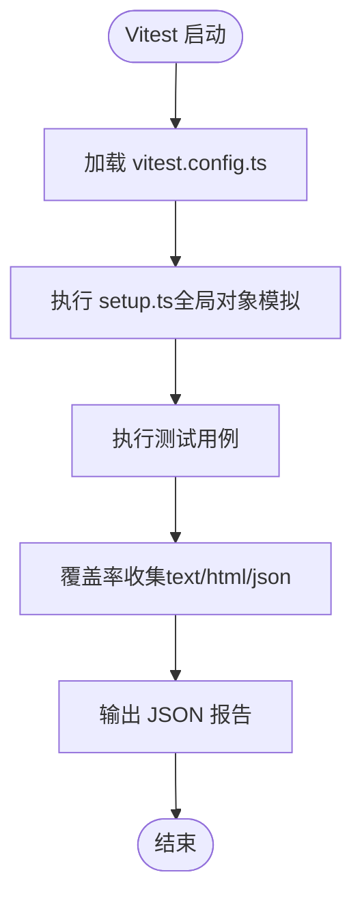
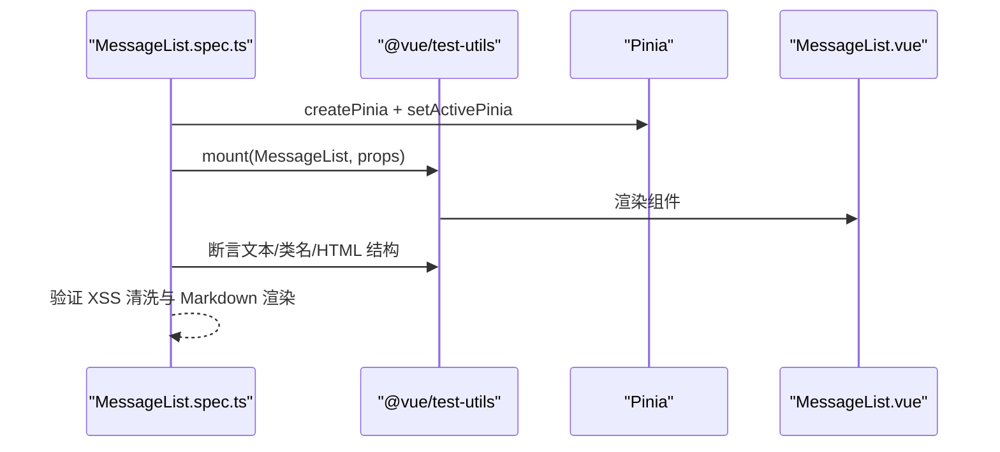
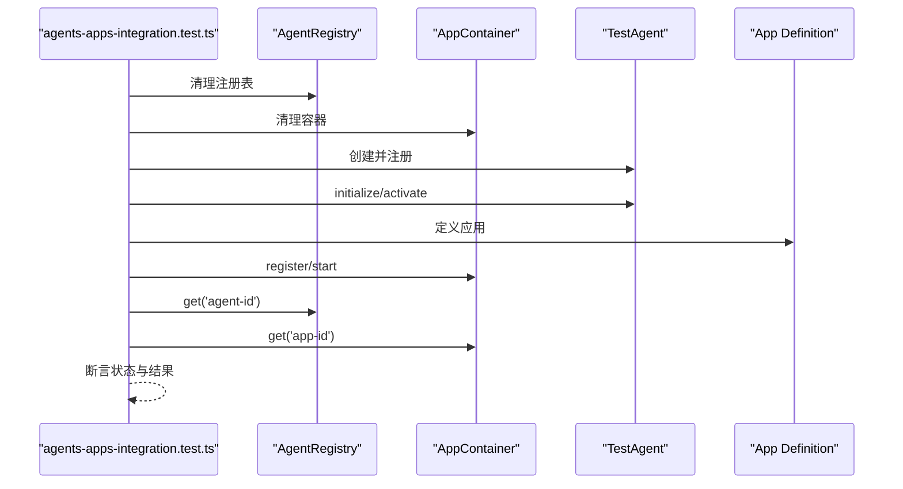
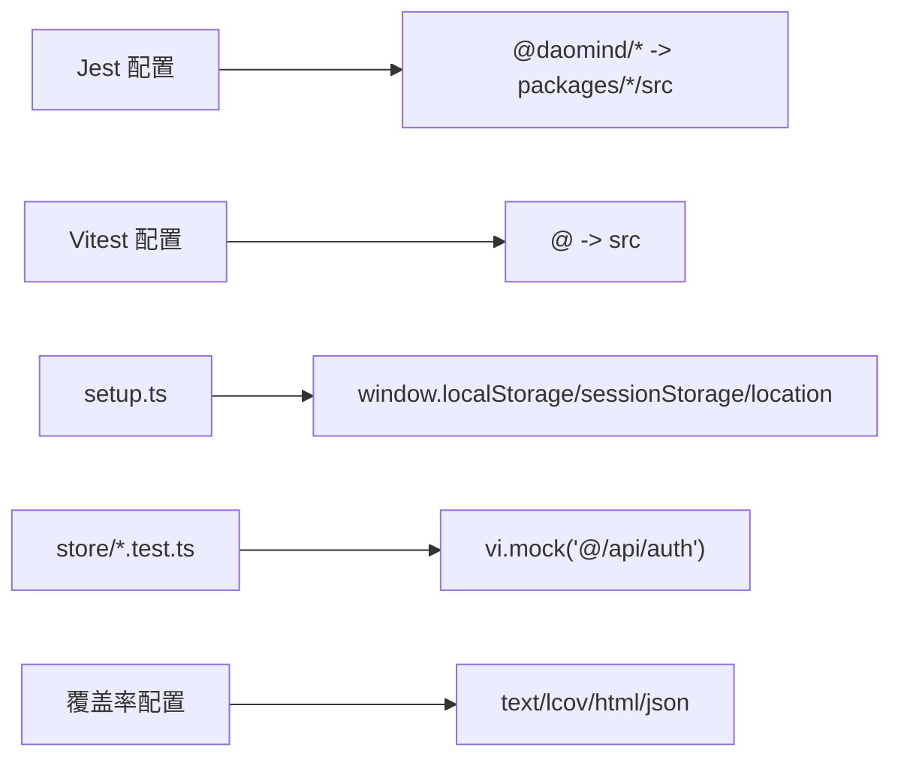

# 单元测试框架

<cite>
**本文引用的文件**
- [apps/DaoMind/jest.config.js](file://apps/DaoMind/jest.config.js)
- [apps/DaoMind/packages/daoAgents/src/__tests__/base.test.ts](file://apps/DaoMind/packages/daoAgents/src/__tests__/base.test.ts)
- [apps/DaoMind/packages/daoAgents/src/__tests__/registry.test.ts](file://apps/DaoMind/packages/daoAgents/src/__tests__/registry.test.ts)
- [apps/DaoMind/src/__tests__/integration/agents-apps-integration.test.ts](file://apps/DaoMind/src/__tests__/integration/agents-apps-integration.test.ts)
- [apps/DaoMind/src/__tests__/e2e/full-system.test.ts](file://apps/DaoMind/src/__tests__/e2e/full-system.test.ts)
- [apps/config-center/vitest.config.ts](file://apps/config-center/vitest.config.ts)
- [apps/config-center/src/test/setup.ts](file://apps/config-center/src/test/setup.ts)
- [apps/config-center/src/store/authStore.test.ts](file://apps/config-center/src/store/authStore.test.ts)
- [apps/config-center/src/store/uiStore.test.ts](file://apps/config-center/src/store/uiStore.test.ts)
- [apps/forum/vitest.config.ts](file://apps/forum/vitest.config.ts)
- [apps/forum/src/test/setup.ts](file://apps/forum/src/test/setup.ts)
- [apps/oauth-admin/vitest.config.ts](file://apps/oauth-admin/vitest.config.ts)
- [apps/AgentPit/vite.config.ts](file://apps/AgentPit/vite.config.ts)
- [apps/AgentPit/src/__tests__/components/chat/MessageList.spec.ts](file://apps/AgentPit/src/__tests__/components/chat/MessageList.spec.ts)
- [apps/AgentPit/src/__tests__/components/chat/useTypewriter.spec.ts](file://apps/AgentPit/src/__tests__/components/chat/useTypewriter.spec.ts)
- [apps/AgentPit/src/store/useAppStore.ts](file://apps/AgentPit/src/store/useAppStore.ts)
- [apps/AgentPit/src/composables/useTypewriter.ts](file://apps/AgentPit/src/composables/useTypewriter.ts)
- [apps/AgentPit/src/types/chatTypes.ts](file://apps/AgentPit/src/types/chatTypes.ts)
</cite>

## 目录
1. [简介](#简介)
2. [项目结构](#项目结构)
3. [核心组件](#核心组件)
4. [架构总览](#架构总览)
5. [详细组件分析](#详细组件分析)
6. [依赖关系分析](#依赖关系分析)
7. [性能考量](#性能考量)
8. [故障排查指南](#故障排查指南)
9. [结论](#结论)
10. [附录](#附录)

## 简介
本文件系统性梳理本仓库中 Jest 与 Vitest 两类单元测试框架的配置与使用方法，覆盖测试环境设置、模块路径映射、覆盖率配置、测试文件命名约定、测试套件组织、Mock 数据管理、异步测试处理、断言使用、组件与 Store/Composables 测试范式、覆盖率门槛与性能优化建议。文档以实际源码为依据，提供可操作的最佳实践与可视化流程图，帮助开发者快速建立高质量的测试体系。

## 项目结构
- 多应用采用多测试框架策略：
  - 顶层包管理与 monorepo 场景下，使用 Jest 进行包级单元测试与集成测试。
  - 多个前端应用采用 Vitest，结合 Vite 插件与 jsdom 环境进行组件与状态层测试。
- 测试文件分布：
  - Jest：在各包的 src/__tests__ 下组织测试，覆盖基础类、注册表、集成与端到端场景。
  - Vitest：在各应用的 src 目录下按功能划分测试目录，如 src/__tests__/components、src/test 等。
- 覆盖率与报告：
  - Jest 使用 ts-jest 预设，开启多种覆盖率报告器，并设置全局阈值。
  - Vitest 在各应用配置中定义覆盖率 reporter、目录与阈值，部分应用导出 JSON 报告供 CI 分析。

图表来源
- [apps/DaoMind/jest.config.js:1-59](file://apps/DaoMind/jest.config.js#L1-L59)
- [apps/config-center/vitest.config.ts:1-18](file://apps/config-center/vitest.config.ts#L1-L18)
- [apps/forum/vitest.config.ts:1-41](file://apps/forum/vitest.config.ts#L1-L41)
- [apps/oauth-admin/vitest.config.ts:1-18](file://apps/oauth-admin/vitest.config.ts#L1-L18)
- [apps/AgentPit/vite.config.ts](file://apps/AgentPit/vite.config.ts)

章节来源
- [apps/DaoMind/jest.config.js:1-59](file://apps/DaoMind/jest.config.js#L1-L59)
- [apps/config-center/vitest.config.ts:1-18](file://apps/config-center/vitest.config.ts#L1-L18)
- [apps/forum/vitest.config.ts:1-41](file://apps/forum/vitest.config.ts#L1-L41)
- [apps/oauth-admin/vitest.config.ts:1-18](file://apps/oauth-admin/vitest.config.ts#L1-L18)
- [apps/AgentPit/vite.config.ts](file://apps/AgentPit/vite.config.ts)

## 核心组件
- Jest 配置（DaoMind 包）
  - 测试环境：Node
  - 预设：ts-jest
  - 模块映射：通过 moduleNameMapper 将 @daomind/* 映射到对应包的 src 目录
  - 路径根：roots 包含 packages、src、tests
  - 转换器：ts-jest 配合 tsconfig，启用 ESM
  - 并发与超时：maxWorkers 50%，testTimeout 30000ms
  - 覆盖率：开启 text、lcov、html 报告，全局阈值 80%
- Vitest 配置（多个应用）
  - 环境：jsdom（便于 DOM API 与 React/Vue 测试）
  - 插件：React 插件
  - 别名：@ 指向 src
  - 初始化：setupFiles 引入测试初始化脚本
  - 覆盖率：text、html、json；阈值 80；排除 d.ts 与测试目录
  - 报告：默认 + JSON 输出文件，便于 CI 分析
- 测试初始化脚本
  - 模拟 localStorage/sessionStorage/location 等全局对象
  - 导入 @testing-library/jest-dom 提供 DOM 断言扩展
  - 为 Zustand 等状态库持久化中间件提供 localStorage 行为

章节来源
- [apps/DaoMind/jest.config.js:1-59](file://apps/DaoMind/jest.config.js#L1-L59)
- [apps/config-center/vitest.config.ts:1-18](file://apps/config-center/vitest.config.ts#L1-L18)
- [apps/config-center/src/test/setup.ts:1-25](file://apps/config-center/src/test/setup.ts#L1-L25)
- [apps/forum/vitest.config.ts:1-41](file://apps/forum/vitest.config.ts#L1-L41)
- [apps/forum/src/test/setup.ts:1-79](file://apps/forum/src/test/setup.ts#L1-L79)
- [apps/oauth-admin/vitest.config.ts:1-18](file://apps/oauth-admin/vitest.config.ts#L1-L18)

## 架构总览
下图展示了测试运行的关键流程：配置加载 → 环境初始化 → 模块解析与映射 → 测试执行 → 覆盖率收集与报告生成。

图表来源
- [apps/DaoMind/jest.config.js:1-59](file://apps/DaoMind/jest.config.js#L1-L59)
- [apps/config-center/vitest.config.ts:1-18](file://apps/config-center/vitest.config.ts#L1-L18)
- [apps/forum/vitest.config.ts:1-41](file://apps/forum/vitest.config.ts#L1-L41)
- [apps/config-center/src/test/setup.ts:1-25](file://apps/config-center/src/test/setup.ts#L1-L25)
- [apps/forum/src/test/setup.ts:1-79](file://apps/forum/src/test/setup.ts#L1-L79)

## 详细组件分析

### Jest 配置与使用（DaoMind 包）
- 测试环境与预设
  - testEnvironment: node
  - preset: ts-jest
  - transform: ts-jest + tsconfig，useESM=true
- 模块路径映射
  - moduleNameMapper 将 @daomind/* 映射到 packages 下对应包的 src
  - modulePaths/moduleDirectories 与 roots 协同，确保包内相对路径与绝对路径均可解析
- 覆盖率与报告
  - coverageReporters: text、lcov、html
  - coverageThreshold: 全局 80%（分支、函数、行、语句）
- 测试匹配规则
  - testMatch: 支持 __tests__ 与 *.test.*、*.spec.* 文件
- 并发与超时
  - maxWorkers: 50%
  - testTimeout: 30000ms

图表来源
- [apps/DaoMind/jest.config.js:1-59](file://apps/DaoMind/jest.config.js#L1-L59)

章节来源
- [apps/DaoMind/jest.config.js:1-59](file://apps/DaoMind/jest.config.js#L1-L59)

### Vitest 配置与使用（Config-Center）
- 环境与插件
  - environment: jsdom
  - plugins: @vitejs/plugin-react
  - alias: @ -> src
- 初始化与覆盖率
  - setupFiles: ./src/test/setup.ts
  - coverage: reporter、include/exclude、thresholds
- Store 测试范式
  - 使用 vi.mock 对外部 API 进行模块级 Mock
  - beforeEach 清理状态与 Mock
  - 断言登录、登出、权限判断等关键逻辑

图表来源
- [apps/config-center/vitest.config.ts:1-18](file://apps/config-center/vitest.config.ts#L1-L18)
- [apps/config-center/src/test/setup.ts:1-25](file://apps/config-center/src/test/setup.ts#L1-L25)
- [apps/config-center/src/store/authStore.test.ts:1-159](file://apps/config-center/src/store/authStore.test.ts#L1-L159)

章节来源
- [apps/config-center/vitest.config.ts:1-18](file://apps/config-center/vitest.config.ts#L1-L18)
- [apps/config-center/src/test/setup.ts:1-25](file://apps/config-center/src/test/setup.ts#L1-L25)
- [apps/config-center/src/store/authStore.test.ts:1-159](file://apps/config-center/src/store/authStore.test.ts#L1-L159)
- [apps/config-center/src/store/uiStore.test.ts:1-42](file://apps/config-center/src/store/uiStore.test.ts#L1-L42)

### Vitest 配置与使用（Forum）
- 额外覆盖率与报告
  - coverage.reporter: text、html、json
  - outputFile: JSON 报告输出路径
- 初始化脚本增强
  - 模拟 window.matchMedia、localStorage、sessionStorage、location
  - 导入 @testing-library/jest-dom

图表来源
- [apps/forum/vitest.config.ts:1-41](file://apps/forum/vitest.config.ts#L1-L41)
- [apps/forum/src/test/setup.ts:1-79](file://apps/forum/src/test/setup.ts#L1-L79)

章节来源
- [apps/forum/vitest.config.ts:1-41](file://apps/forum/vitest.config.ts#L1-L41)
- [apps/forum/src/test/setup.ts:1-79](file://apps/forum/src/test/setup.ts#L1-L79)

### Vitest 配置与使用（OAuth-Admin）
- 简洁配置
  - environment: jsdom
  - alias: @ -> src
  - setupFiles: ./src/test/setup.ts

章节来源
- [apps/oauth-admin/vitest.config.ts:1-18](file://apps/oauth-admin/vitest.config.ts#L1-L18)

### 组件与 Composables 测试（AgentPit）
- 组件测试（MessageList）
  - 使用 @vue/test-utils 与 Pinia
  - 测试空态、用户/助手消息渲染、Markdown 安全渲染、时间戳与状态图标、长文本与 XSS 清洗
- Composables 测试（useTypewriter）
  - 使用 vi.useFakeTimers/vi.advanceTimersByTime 控制计时器
  - 测试初始状态、开始/停止打字、随机字符增量、长文本完成等待

图表来源
- [apps/AgentPit/src/__tests__/components/chat/MessageList.spec.ts:1-216](file://apps/AgentPit/src/__tests__/components/chat/MessageList.spec.ts#L1-L216)

章节来源
- [apps/AgentPit/src/__tests__/components/chat/MessageList.spec.ts:1-216](file://apps/AgentPit/src/__tests__/components/chat/MessageList.spec.ts#L1-L216)
- [apps/AgentPit/src/__tests__/components/chat/useTypewriter.spec.ts:1-143](file://apps/AgentPit/src/__tests__/components/chat/useTypewriter.spec.ts#L1-L143)

### 包级与集成测试（DaoMind）
- 包级单元测试（Agent 基类与注册表）
  - 测试状态机转换、能力查询、类型过滤、计数统计
- 集成测试（Agent 与 App 容器）
  - 注册/启动应用、代理激活、依赖关系校验、停止与终止
- 端到端测试（全系统）
  - 代理与应用生命周期、验证报告生成、错误场景处理

图表来源
- [apps/DaoMind/src/__tests__/integration/agents-apps-integration.test.ts:1-113](file://apps/DaoMind/src/__tests__/integration/agents-apps-integration.test.ts#L1-L113)

章节来源
- [apps/DaoMind/packages/daoAgents/src/__tests__/base.test.ts:1-91](file://apps/DaoMind/packages/daoAgents/src/__tests__/base.test.ts#L1-L91)
- [apps/DaoMind/packages/daoAgents/src/__tests__/registry.test.ts:1-157](file://apps/DaoMind/packages/daoAgents/src/__tests__/registry.test.ts#L1-L157)
- [apps/DaoMind/src/__tests__/integration/agents-apps-integration.test.ts:1-113](file://apps/DaoMind/src/__tests__/integration/agents-apps-integration.test.ts#L1-L113)
- [apps/DaoMind/src/__tests__/e2e/full-system.test.ts:1-120](file://apps/DaoMind/src/__tests__/e2e/full-system.test.ts#L1-L120)

## 依赖关系分析
- 模块映射与路径解析
  - Jest 通过 moduleNameMapper 将 @daomind/* 映射到 packages 下对应包的 src，确保跨包导入稳定
  - Vitest 通过 alias 将 @ 指向 src，简化组件与工具类导入
- 测试初始化与全局行为
  - setupFiles 在 Vitest 中统一注入，保证 jsdom 环境与全局对象可用
- Mock 与外部依赖
  - Store 测试通过 vi.mock 对 API 模块进行隔离，避免真实网络请求
- 覆盖率与报告
  - Jest 与 Vitest 均配置了多格式报告与阈值，便于持续集成与质量门禁

图表来源
- [apps/DaoMind/jest.config.js:23-29](file://apps/DaoMind/jest.config.js#L23-L29)
- [apps/config-center/vitest.config.ts:7-11](file://apps/config-center/vitest.config.ts#L7-L11)
- [apps/forum/vitest.config.ts:35-39](file://apps/forum/vitest.config.ts#L35-L39)
- [apps/config-center/src/test/setup.ts:1-25](file://apps/config-center/src/test/setup.ts#L1-L25)
- [apps/config-center/src/store/authStore.test.ts:5-9](file://apps/config-center/src/store/authStore.test.ts#L5-L9)
- [apps/forum/vitest.config.ts:9-20](file://apps/forum/vitest.config.ts#L9-L20)

章节来源
- [apps/DaoMind/jest.config.js:23-29](file://apps/DaoMind/jest.config.js#L23-L29)
- [apps/config-center/vitest.config.ts:7-11](file://apps/config-center/vitest.config.ts#L7-L11)
- [apps/forum/vitest.config.ts:35-39](file://apps/forum/vitest.config.ts#L35-L39)
- [apps/config-center/src/test/setup.ts:1-25](file://apps/config-center/src/test/setup.ts#L1-L25)
- [apps/config-center/src/store/authStore.test.ts:5-9](file://apps/config-center/src/store/authStore.test.ts#L5-L9)
- [apps/forum/vitest.config.ts:9-20](file://apps/forum/vitest.config.ts#L9-L20)

## 性能考量
- 并发与超时
  - Jest：maxWorkers=50%，testTimeout=30000ms，适合包级并发与较长异步任务
  - Vitest：默认并发，可通过 CI 调整 worker 数量；testTimeout 可按需缩短
- 覆盖率范围控制
  - Vitest include/exclude 精准控制覆盖率采集范围，减少无关文件对覆盖率的影响
- Mock 与 I/O 隔离
  - Store 测试通过 vi.mock 避免真实网络请求，显著提升测试速度
- 计时器控制
  - 使用 vi.useFakeTimers 与 vi.advanceTimersByTime 精确推进时间，避免真实等待

章节来源
- [apps/DaoMind/jest.config.js:57-59](file://apps/DaoMind/jest.config.js#L57-L59)
- [apps/forum/vitest.config.ts:32-32](file://apps/forum/vitest.config.ts#L32-L32)
- [apps/config-center/src/store/authStore.test.ts:5-9](file://apps/config-center/src/store/authStore.test.ts#L5-L9)
- [apps/AgentPit/src/__tests__/components/chat/useTypewriter.spec.ts:7-15](file://apps/AgentPit/src/__tests__/components/chat/useTypewriter.spec.ts#L7-L15)

## 故障排查指南
- 模块解析失败
  - 检查 moduleNameMapper 与 alias 是否正确指向 src 或 packages 子目录
  - 确认 tsconfig 与 useESM 配置一致
- jsdom 环境缺失
  - 确保 vitest.config.ts 的 environment 为 jsdom，并正确执行 setupFiles
- 覆盖率不达标
  - 检查 coverage.include/exclude 与阈值设置，必要时缩小 include 范围或提高阈值
- 异步测试超时
  - 适当提高 testTimeout；对计时器场景使用 vi.useFakeTimers
- Mock 未生效
  - 确保 vi.mock 在 import 之前执行；使用 vi.mocked 获取强类型 Mock

章节来源
- [apps/DaoMind/jest.config.js:35-55](file://apps/DaoMind/jest.config.js#L35-L55)
- [apps/config-center/vitest.config.ts:12-16](file://apps/config-center/vitest.config.ts#L12-L16)
- [apps/forum/vitest.config.ts:8-34](file://apps/forum/vitest.config.ts#L8-L34)
- [apps/config-center/src/test/setup.ts:1-25](file://apps/config-center/src/test/setup.ts#L1-L25)
- [apps/AgentPit/src/__tests__/components/chat/useTypewriter.spec.ts:7-15](file://apps/AgentPit/src/__tests__/components/chat/useTypewriter.spec.ts#L7-L15)

## 结论
本仓库在不同层级采用了 Jest 与 Vitest 的组合策略：包级与集成测试由 Jest 驱动，前端应用与组件测试由 Vitest 驱动。通过模块映射、别名、初始化脚本与 Mock 策略，实现了稳定的测试环境与高效的覆盖率收集。建议在团队内统一测试文件命名约定（*.test.ts / *.spec.ts）、断言风格与覆盖率门槛，并在 CI 中强制执行覆盖率报告与阈值检查。

## 附录
- 测试文件命名约定
  - Jest：支持 __tests__ 与 *.test.ts、*.spec.ts
  - Vitest：推荐 *.test.ts 或 *.spec.ts，按功能分层组织
- 测试套件组织
  - 包级：src/__tests__ 下按模块拆分
  - 应用级：src/__tests__/components、src/__tests__/stores 等
- 断言与 Mock 最佳实践
  - Store：vi.mock + beforeEach 清理 + 断言状态变化
  - 组件：mount + props + 断言渲染与交互
  - Composables：fake timers + waitFor + 边界条件
- 覆盖率要求与报告
  - 全局阈值 80%（分支/函数/行/语句），报告格式 text、lcov、html、json