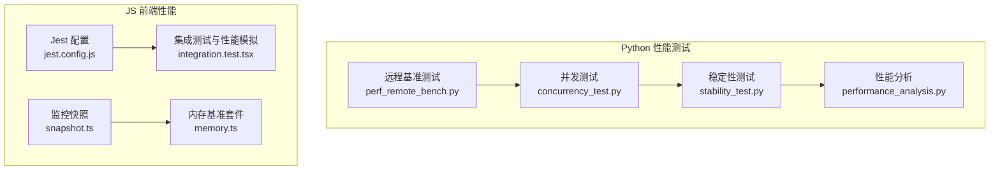
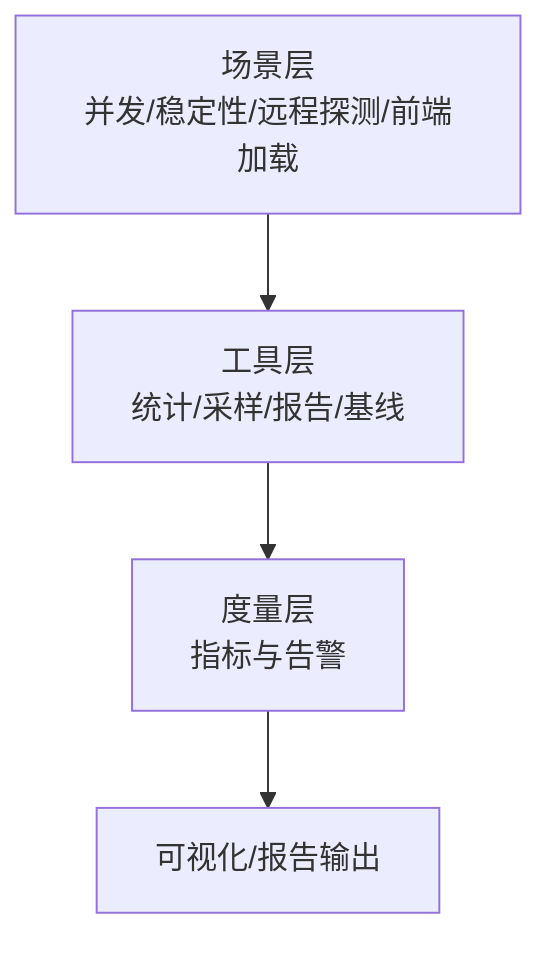
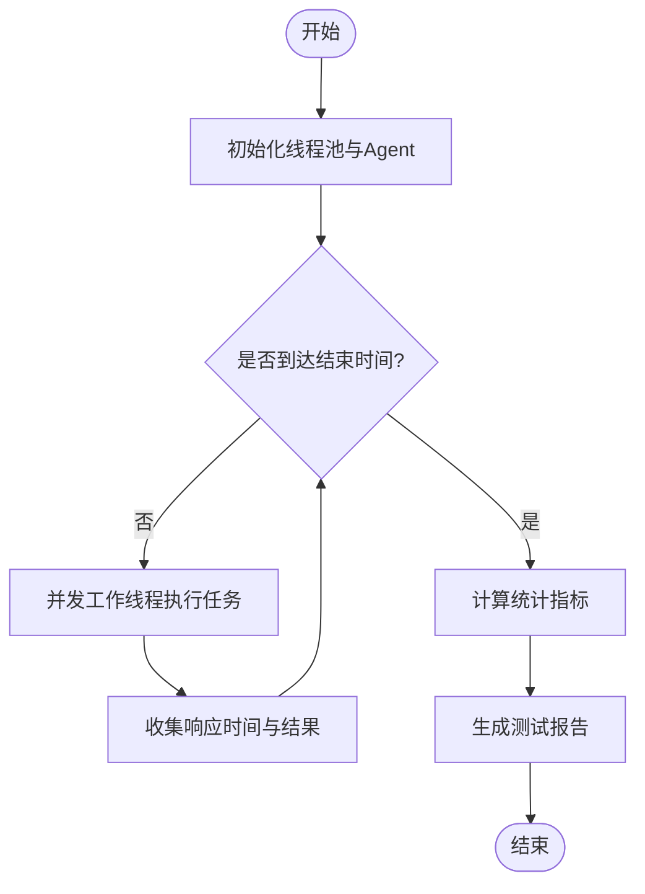
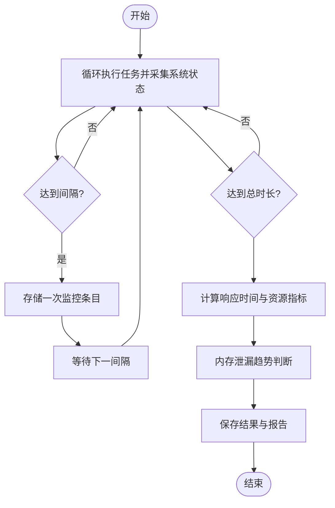
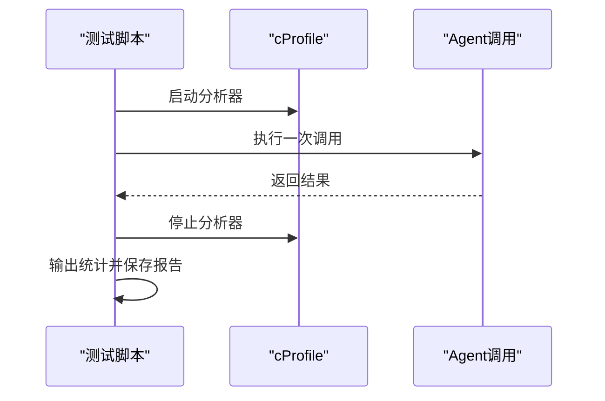
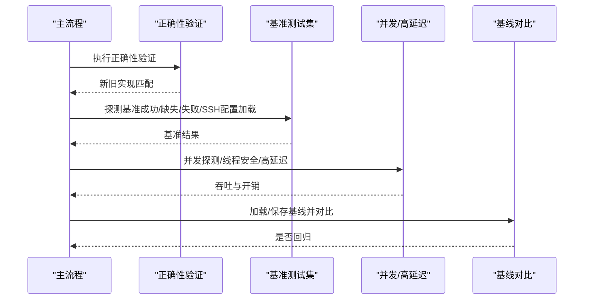
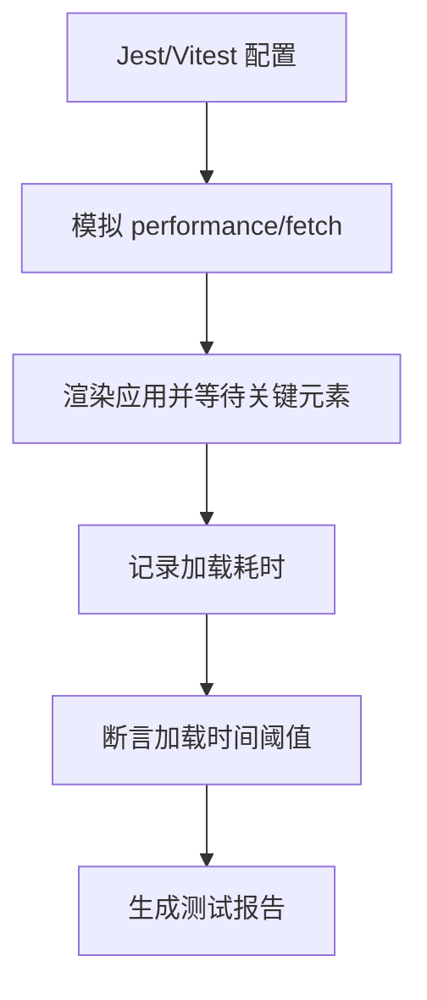
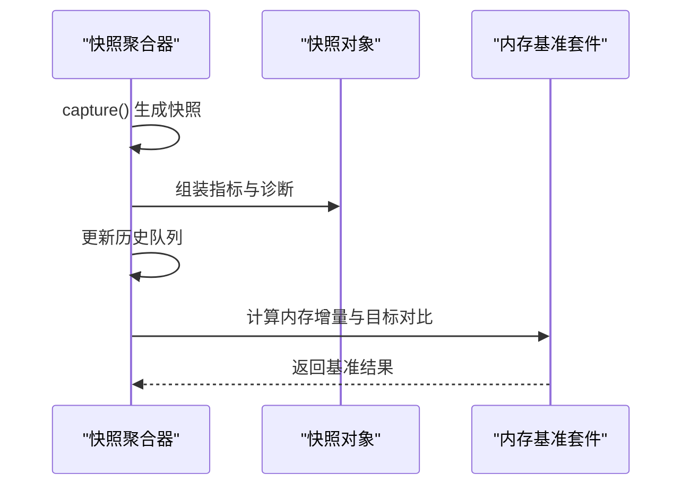
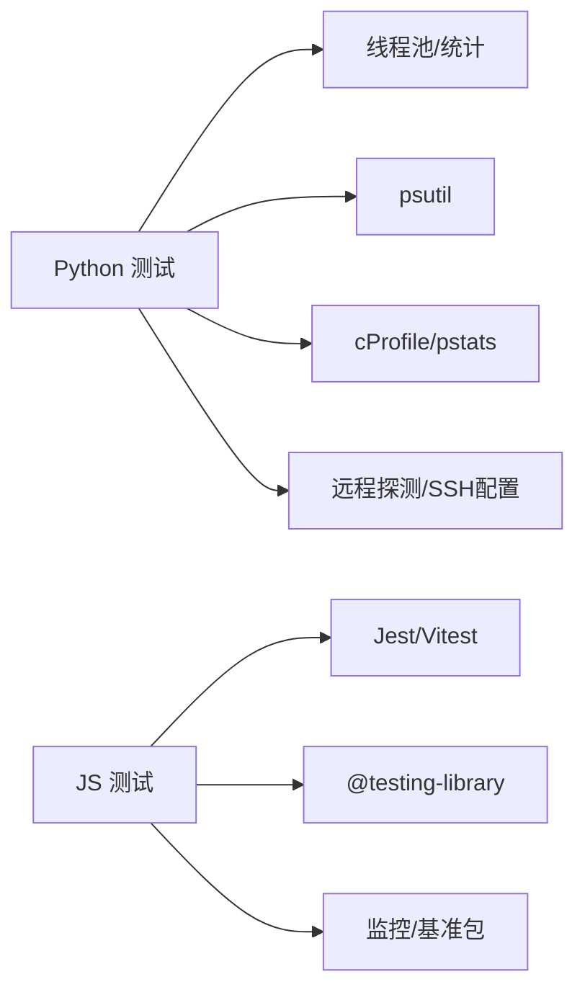

# 性能测试

<cite>
**本文引用的文件**   
- [concurrency_test.py](file://tools/DeepResearch/tests/performance/concurrency_test.py)
- [stability_test.py](file://tools/DeepResearch/tests/performance/stability_test.py)
- [performance_analysis.py](file://tools/DeepResearch/tests/performance_analysis.py)
- [perf_remote_bench.py](file://tools/flexloop/tests/testing/perf_remote_bench.py)
- [pytest.ini](file://tools/flexloop/pytest.ini)
- [jest.config.js](file://apps/DaoMind/jest.config.js)
- [integration.test.tsx](file://apps/forum/src/test/integration.test.tsx)
- [snapshot.ts](file://apps/DaoMind/packages/daoMonitor/src/snapshot.ts)
- [memory.ts](file://apps/DaoMind/packages/daoBenchmark/src/suites/memory.ts)
</cite>

## 目录
1. [引言](#引言)
2. [项目结构](#项目结构)
3. [核心组件](#核心组件)
4. [架构总览](#架构总览)
5. [详细组件分析](#详细组件分析)
6. [依赖分析](#依赖分析)
7. [性能考量](#性能考量)
8. [故障排查指南](#故障排查指南)
9. [结论](#结论)
10. [附录](#附录)

## 引言
本技术文档面向性能测试领域，系统梳理仓库中现有的 Python 与 JavaScript 性能测试实践，覆盖并发测试、稳定性测试、内存泄漏检测、CPU 使用率监控、性能分析与报告解读，并结合 FlexLoop 的并发与高延迟基准测试，给出可操作的测试场景设计与优化建议。读者无需深厚的底层知识即可理解并落地实施。

## 项目结构
本仓库包含多个应用与工具包，其中与性能测试直接相关的核心位置如下：
- Python 性能测试与分析
  - tools/DeepResearch/tests/performance：并发测试、稳定性测试、性能分析脚本
  - tools/flexloop/tests/testing/perf_remote_bench.py：远程模块探测与并发/高延迟基准测试
- JavaScript 前端性能测试与监控
  - apps/DaoMind/jest.config.js：Jest 测试配置（含超时、覆盖率与模块映射）
  - apps/forum/src/test/integration.test.tsx：前端集成测试中的页面加载性能模拟
  - apps/DaoMind/packages/daoMonitor/src/snapshot.ts：系统监控快照采集
  - apps/DaoMind/packages/daoBenchmark/src/suites/memory.ts：内存占用基准测试套件

**图表来源**
- [concurrency_test.py:1-184](file://tools/DeepResearch/tests/performance/concurrency_test.py#L1-L184)
- [stability_test.py:1-314](file://tools/DeepResearch/tests/performance/stability_test.py#L1-L314)
- [performance_analysis.py:1-49](file://tools/DeepResearch/tests/performance_analysis.py#L1-L49)
- [perf_remote_bench.py:1-717](file://tools/flexloop/tests/testing/perf_remote_bench.py#L1-L717)
- [jest.config.js:1-59](file://apps/DaoMind/jest.config.js#L1-L59)
- [integration.test.tsx:1-371](file://apps/forum/src/test/integration.test.tsx#L1-L371)
- [snapshot.ts:44-75](file://apps/DaoMind/packages/daoMonitor/src/snapshot.ts#L44-L75)
- [memory.ts:39-69](file://apps/DaoMind/packages/daoBenchmark/src/suites/memory.ts#L39-L69)

**章节来源**
- [concurrency_test.py:1-184](file://tools/DeepResearch/tests/performance/concurrency_test.py#L1-L184)
- [stability_test.py:1-314](file://tools/DeepResearch/tests/performance/stability_test.py#L1-L314)
- [performance_analysis.py:1-49](file://tools/DeepResearch/tests/performance_analysis.py#L1-L49)
- [perf_remote_bench.py:1-717](file://tools/flexloop/tests/testing/perf_remote_bench.py#L1-L717)
- [jest.config.js:1-59](file://apps/DaoMind/jest.config.js#L1-L59)
- [integration.test.tsx:1-371](file://apps/forum/src/test/integration.test.tsx#L1-L371)
- [snapshot.ts:44-75](file://apps/DaoMind/packages/daoMonitor/src/snapshot.ts#L44-L75)
- [memory.ts:39-69](file://apps/DaoMind/packages/daoBenchmark/src/suites/memory.ts#L39-L69)

## 核心组件
- 并发测试（Python）：基于线程池并发触发任务，统计吞吐量、响应时间分布与成功率，支持多并发级别对比。
- 稳定性测试（Python）：长期运行监测 CPU、内存、磁盘与网络 IO，内置内存泄漏趋势判断逻辑。
- 性能分析（Python）：使用 cProfile 对关键路径进行 CPU 热点分析，输出统计文本。
- 远程基准测试（Python/FlexLoop）：对远程探测流程进行正确性校验、并发吞吐、高延迟开销评估与历史基线对比。
- 前端性能测试（JS）：通过 Vitest/Jest 配置与模拟 API，验证页面加载时间阈值与交互性能。
- 监控与基准（JS）：监控快照采集与内存基准套件，形成可重复的度量指标与目标阈值。

**章节来源**
- [concurrency_test.py:16-115](file://tools/DeepResearch/tests/performance/concurrency_test.py#L16-L115)
- [stability_test.py:16-222](file://tools/DeepResearch/tests/performance/stability_test.py#L16-L222)
- [performance_analysis.py:16-44](file://tools/DeepResearch/tests/performance_analysis.py#L16-L44)
- [perf_remote_bench.py:166-504](file://tools/flexloop/tests/testing/perf_remote_bench.py#L166-L504)
- [jest.config.js:1-59](file://apps/DaoMind/jest.config.js#L1-L59)
- [integration.test.tsx:31-48](file://apps/forum/src/test/integration.test.tsx#L31-L48)
- [snapshot.ts:44-75](file://apps/DaoMind/packages/daoMonitor/src/snapshot.ts#L44-L75)
- [memory.ts:39-69](file://apps/DaoMind/packages/daoBenchmark/src/suites/memory.ts#L39-L69)

## 架构总览
从测试类型与工具链角度，整体架构分为三层：
- 场景层：定义测试场景（并发、稳定性、远程探测、前端加载），由相应脚本/测试驱动。
- 工具层：封装统计与采样（线程池、psutil、cProfile、perf_counter）、报告生成与基线对比。
- 度量层：统一输出吞吐量、响应时间、CPU/内存、错误计数、泄漏检测、历史回归告警等指标。

[此图为概念性架构示意，不直接映射具体源码文件，故不附“图表来源”]

## 详细组件分析

### 并发测试（Python）
- 设计要点
  - 使用线程池模拟并发用户，固定测试时长，统计请求总数、成功/失败数、成功率、平均/最大/最小响应时间与标准差、吞吐量。
  - 支持多并发级别对比，便于绘制容量规划曲线。
- 关键流程

**图表来源**
- [concurrency_test.py:42-115](file://tools/DeepResearch/tests/performance/concurrency_test.py#L42-L115)

**章节来源**
- [concurrency_test.py:16-115](file://tools/DeepResearch/tests/performance/concurrency_test.py#L16-L115)

### 稳定性测试（Python）
- 设计要点
  - 长时间运行（如 1 小时），按固定间隔采集 CPU 百分比、内存百分比与 RSS/VMS、磁盘与网络 IO。
  - 内存泄漏检测：基于首尾 RSS 差值与样本数量阈值判断是否存在泄漏趋势。
- 关键流程

**图表来源**
- [stability_test.py:62-222](file://tools/DeepResearch/tests/performance/stability_test.py#L62-L222)

**章节来源**
- [stability_test.py:16-222](file://tools/DeepResearch/tests/performance/stability_test.py#L16-L222)

### 性能分析（Python）
- 设计要点
  - 使用 cProfile 对关键调用路径进行采样，输出累计耗时排序，便于定位热点函数。
  - 生成文本报告并落盘，供后续人工分析。
- 关键流程

**图表来源**
- [performance_analysis.py:16-44](file://tools/DeepResearch/tests/performance_analysis.py#L16-L44)

**章节来源**
- [performance_analysis.py:16-44](file://tools/DeepResearch/tests/performance_analysis.py#L16-L44)

### 远程基准测试（FlexLoop）
- 设计要点
  - 正确性验证：比较新旧实现的探测行为一致性（成功/缺少环境/失败三种场景）。
  - 基准测试：探测成功、缺少 conda、探测失败的耗时统计；并发探测吞吐与线程安全；高延迟场景下的理论最小耗时与额外开销占比。
  - 历史基线对比：若存在基线文件，则与当前结果对比，超过阈值（示例中为 10%）即判定为性能退化并告警。
- 关键流程

**图表来源**
- [perf_remote_bench.py:654-717](file://tools/flexloop/tests/testing/perf_remote_bench.py#L654-L717)

**章节来源**
- [perf_remote_bench.py:166-717](file://tools/flexloop/tests/testing/perf_remote_bench.py#L166-L717)

### 前端性能测试（JavaScript）
- 设计要点
  - 使用 Vitest/Jest 配置，模拟浏览器性能接口与 fetch API，验证页面加载时间不超过阈值。
  - 可扩展至交互性能测量（如关键渲染路径、首屏时间等）。
- 关键流程

**图表来源**
- [jest.config.js:1-59](file://apps/DaoMind/jest.config.js#L1-L59)
- [integration.test.tsx:31-48](file://apps/forum/src/test/integration.test.tsx#L31-L48)

**章节来源**
- [jest.config.js:1-59](file://apps/DaoMind/jest.config.js#L1-L59)
- [integration.test.tsx:1-371](file://apps/forum/src/test/integration.test.tsx#L1-L371)

### 监控与基准（JS）
- 设计要点
  - 快照采集：周期性生成系统健康快照，包含热力图、流向向量、仪表盘、告警与诊断。
  - 内存基准：对比空载与各场景堆内存增量，设定目标阈值并产出整体通过与否的结果。
- 关键流程

**图表来源**
- [snapshot.ts:44-75](file://apps/DaoMind/packages/daoMonitor/src/snapshot.ts#L44-L75)
- [memory.ts:39-69](file://apps/DaoMind/packages/daoBenchmark/src/suites/memory.ts#L39-L69)

**章节来源**
- [snapshot.ts:44-75](file://apps/DaoMind/packages/daoMonitor/src/snapshot.ts#L44-L75)
- [memory.ts:39-69](file://apps/DaoMind/packages/daoBenchmark/src/suites/memory.ts#L39-L69)

## 依赖分析
- Python 测试依赖
  - 并发与稳定性测试：依赖线程池、统计库与系统进程监控库，用于 CPU/内存/IO 采样。
  - 性能分析：依赖 cProfile/pstats，用于 CPU 热点分析。
  - 远程基准：依赖自研远程探测模块与 SSH 配置加载，具备并发与高延迟场景模拟。
- JS 测试依赖
  - Jest/Vitest：测试运行时、覆盖率与模块映射。
  - @testing-library：DOM 渲染与交互断言。
  - 自研监控与基准包：快照采集与内存基准套件。

[此图为概念性依赖示意，不直接映射具体源码文件，故不附“图表来源”]

**章节来源**
- [concurrency_test.py:1-184](file://tools/DeepResearch/tests/performance/concurrency_test.py#L1-L184)
- [stability_test.py:1-314](file://tools/DeepResearch/tests/performance/stability_test.py#L1-L314)
- [performance_analysis.py:1-49](file://tools/DeepResearch/tests/performance_analysis.py#L1-L49)
- [perf_remote_bench.py:1-717](file://tools/flexloop/tests/testing/perf_remote_bench.py#L1-L717)
- [jest.config.js:1-59](file://apps/DaoMind/jest.config.js#L1-L59)
- [integration.test.tsx:1-371](file://apps/forum/src/test/integration.test.tsx#L1-L371)
- [snapshot.ts:44-75](file://apps/DaoMind/packages/daoMonitor/src/snapshot.ts#L44-L75)
- [memory.ts:39-69](file://apps/DaoMind/packages/daoBenchmark/src/suites/memory.ts#L39-L69)

## 性能考量
- 指标定义
  - 吞吐量：单位时间内完成的请求数（requests/s）。
  - 响应时间：平均/中位/95 分位/最大/标准差。
  - 成功率：成功请求数/总请求数。
  - CPU 使用率：平均/最大/最小百分比。
  - 内存：使用率百分比与 RSS/VMS（单位换算为 MB）。
  - 泄漏检测：基于首尾 RSS 差值与样本数的简单趋势判断。
- 测试场景设计
  - 并发测试：从低到高的并发级别（如 10/50/100），固定时长，观察吞吐与响应时间变化。
  - 稳定性测试：长时（如 1 小时）采样，关注成功率与资源指标波动。
  - 远程基准：覆盖成功/缺少环境/失败三类场景，评估并发吞吐与高延迟开销。
  - 前端加载：设置页面加载时间阈值，模拟真实网络条件。
- 基准建立与回归
  - 基线文件保存当前关键指标，后续对比超过阈值（示例 10%）即告警。
  - 多场景对比：不同并发/时长/网络延迟组合，形成性能画像。

[本节为通用指导，不直接分析具体文件，故不附“章节来源”]

## 故障排查指南
- 并发测试
  - 现象：吞吐量下降、错误增多、响应时间抖动。
  - 排查：检查线程池大小、任务执行时间、外部依赖（如 LLM 调用）是否成为瓶颈。
- 稳定性测试
  - 现象：内存 RSS 持续上升。
  - 排查：启用泄漏检测逻辑，定位新增对象与释放路径；检查缓存与连接池。
- 性能分析
  - 现象：热点集中在特定函数。
  - 排查：优化热点路径、减少同步阻塞、引入异步/缓存策略。
- 远程基准
  - 现象：并发吞吐低或错误数上升。
  - 排查：检查连接工厂、SSH 配置加载与探测命令执行；评估高延迟场景下的重试与超时策略。
- 前端性能
  - 现象：页面加载超时。
  - 排查：检查静态资源体积、路由懒加载、关键渲染路径；模拟弱网条件验证。

**章节来源**
- [concurrency_test.py:62-115](file://tools/DeepResearch/tests/performance/concurrency_test.py#L62-L115)
- [stability_test.py:163-222](file://tools/DeepResearch/tests/performance/stability_test.py#L163-L222)
- [performance_analysis.py:16-44](file://tools/DeepResearch/tests/performance_analysis.py#L16-L44)
- [perf_remote_bench.py:338-504](file://tools/flexloop/tests/testing/perf_remote_bench.py#L338-L504)
- [integration.test.tsx:31-48](file://apps/forum/src/test/integration.test.tsx#L31-L48)

## 结论
本仓库提供了从 Python 到 JavaScript 的全栈性能测试能力：并发与稳定性测试、性能分析、远程探测基准、前端加载性能与监控/基准套件。通过统一的指标体系与基线对比机制，能够有效识别性能退化并指导优化。建议在 CI 中集成这些测试，形成持续的性能质量门禁。

[本节为总结性内容，不直接分析具体文件，故不附“章节来源”]

## 附录
- 测试运行入口
  - 并发测试：参见脚本主函数与参数配置。
  - 稳定性测试：参见脚本主函数与时长/间隔设置。
  - 性能分析：直接运行分析脚本。
  - 远程基准：参见主流程与基线对比逻辑。
  - 前端测试：Jest/Vitest 配置与集成测试文件。
- 报告与可视化
  - Python 测试输出 JSON 与 Markdown 报告；远程基准输出控制台摘要与完整 JSON。
  - JS 测试可结合覆盖率与 HTML 报告进行可视化。

**章节来源**
- [concurrency_test.py:163-184](file://tools/DeepResearch/tests/performance/concurrency_test.py#L163-L184)
- [stability_test.py:296-314](file://tools/DeepResearch/tests/performance/stability_test.py#L296-L314)
- [performance_analysis.py:47-49](file://tools/DeepResearch/tests/performance_analysis.py#L47-L49)
- [perf_remote_bench.py:654-717](file://tools/flexloop/tests/testing/perf_remote_bench.py#L654-L717)
- [jest.config.js:1-59](file://apps/DaoMind/jest.config.js#L1-L59)
- [integration.test.tsx:1-371](file://apps/forum/src/test/integration.test.tsx#L1-L371)