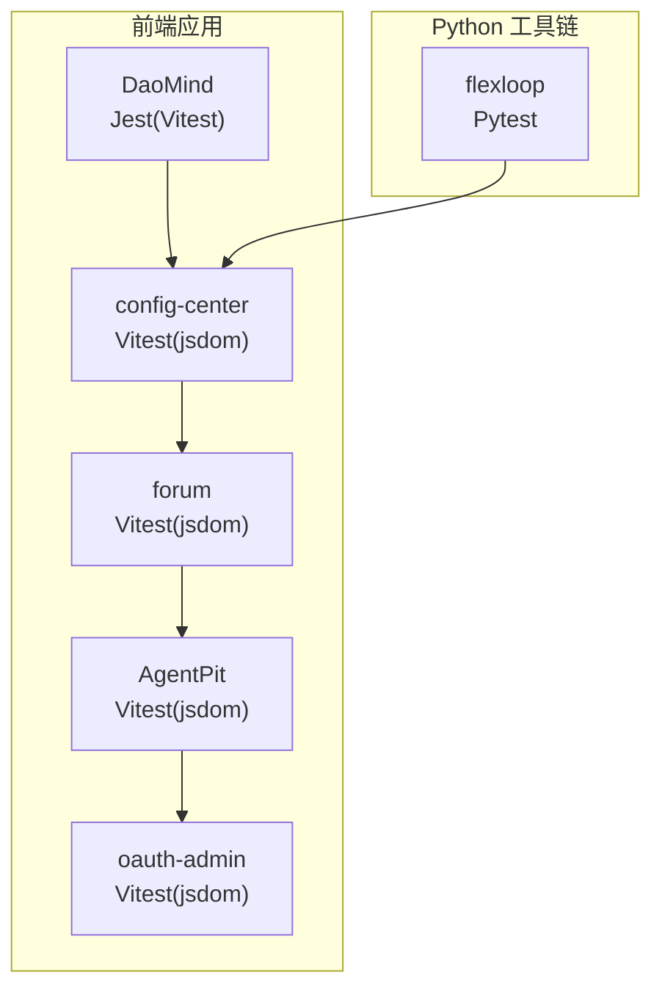
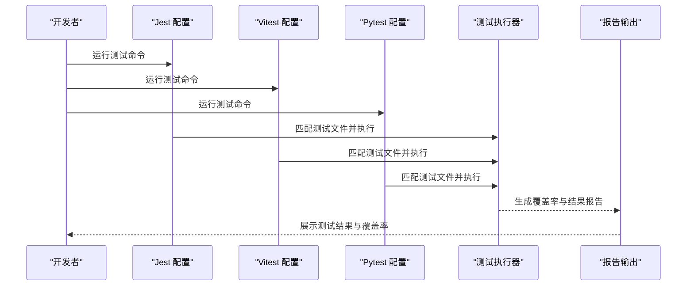
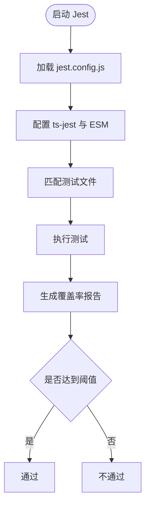
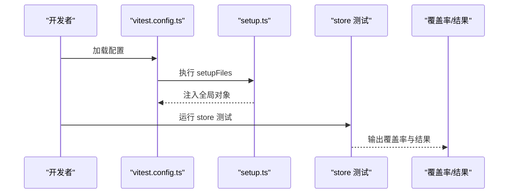
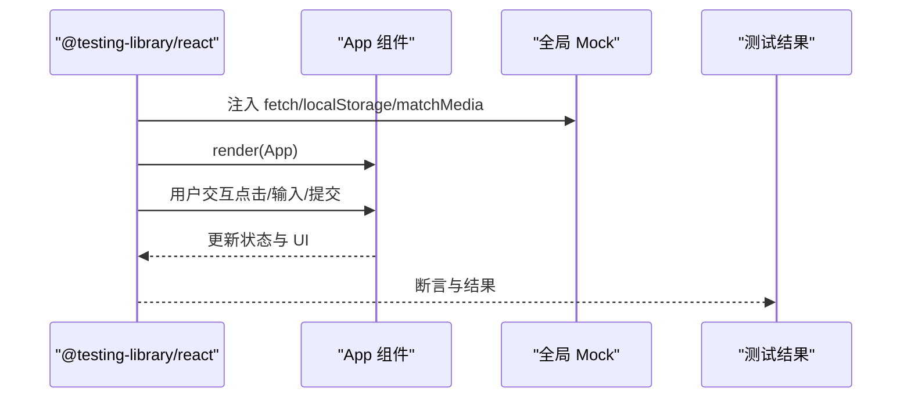
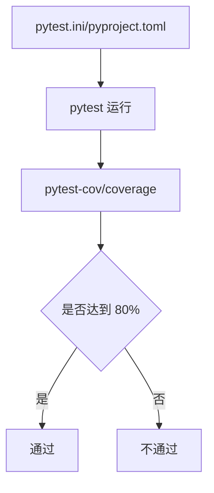
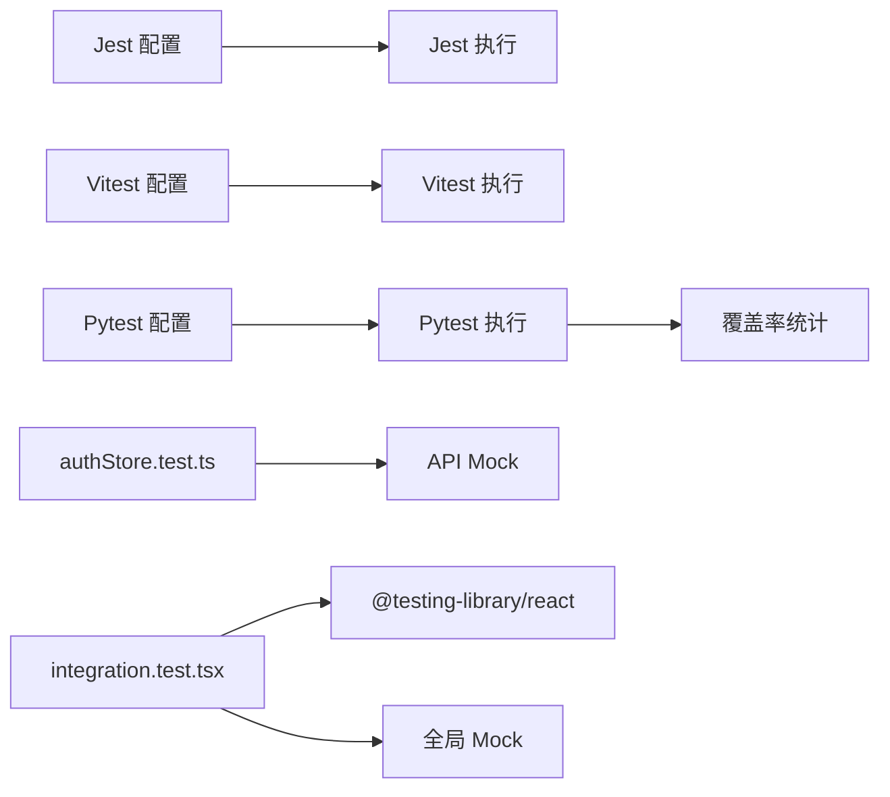

# 测试策略与质量保证

<cite>
**本文引用的文件**
- [apps/DaoMind/jest.config.js](file://apps/DaoMind/jest.config.js)
- [apps/DaoMind/package.json](file://apps/DaoMind/package.json)
- [apps/config-center/vitest.config.ts](file://apps/config-center/vitest.config.ts)
- [apps/config-center/src/store/authStore.test.ts](file://apps/config-center/src/store/authStore.test.ts)
- [apps/config-center/src/store/uiStore.test.ts](file://apps/config-center/src/store/uiStore.test.ts)
- [apps/config-center/src/test/setup.ts](file://apps/config-center/src/test/setup.ts)
- [apps/forum/vitest.config.ts](file://apps/forum/vitest.config.ts)
- [apps/forum/src/test/integration.test.tsx](file://apps/forum/src/test/integration.test.tsx)
- [apps/forum/src/test/setup.ts](file://apps/forum/src/test/setup.ts)
- [apps/AgentPit/vitest.config.ts](file://apps/AgentPit/vitest.config.ts)
- [apps/oauth-admin/vitest.config.ts](file://apps/oauth-admin/vitest.config.ts)
- [tools/flexloop/pytest.ini](file://tools/flexloop/pytest.ini)
- [tools/flexloop/pyproject.toml](file://tools/flexloop/pyproject.toml)
</cite>

## 目录
1. [引言](#引言)
2. [项目结构](#项目结构)
3. [核心组件](#核心组件)
4. [架构总览](#架构总览)
5. [详细组件分析](#详细组件分析)
6. [依赖关系分析](#依赖关系分析)
7. [性能考虑](#性能考虑)
8. [故障排查指南](#故障排查指南)
9. [结论](#结论)
10. [附录](#附录)

## 引言
本文件面向测试策略与质量保证，系统梳理本仓库中多语言测试体系：包括前端 Jest/Vitest 单元/集成测试、端到端测试实践、Python Pytest 性能与稳定性测试，以及覆盖率、Mock 数据管理、测试环境配置、持续集成与质量门禁等质量保障措施。目标是帮助开发者快速理解并落地测试方案，提升整体交付质量。

## 项目结构
本仓库采用多应用与多语言混合结构：
- 前端应用（React/Vue）广泛使用 Vitest 进行单元与集成测试，并通过 jsdom 环境模拟浏览器行为；部分应用使用 Jest（TypeScript + ts-jest）进行 Node 环境下的测试。
- Python 工具链（flexloop）使用 Pytest 进行单元、集成与性能测试，并结合覆盖率工具进行质量门禁控制。
- 各应用均提供统一的测试配置文件与测试初始化脚本，确保跨项目的测试一致性。

**图表来源**
- [apps/DaoMind/jest.config.js:1-59](file://apps/DaoMind/jest.config.js#L1-L59)
- [apps/config-center/vitest.config.ts:1-18](file://apps/config-center/vitest.config.ts#L1-L18)
- [apps/forum/vitest.config.ts:1-41](file://apps/forum/vitest.config.ts#L1-L41)
- [apps/AgentPit/vitest.config.ts:1-47](file://apps/AgentPit/vitest.config.ts#L1-L47)
- [apps/oauth-admin/vitest.config.ts:1-17](file://apps/oauth-admin/vitest.config.ts#L1-L17)
- [tools/flexloop/pytest.ini:1-10](file://tools/flexloop/pytest.ini#L1-L10)
- [tools/flexloop/pyproject.toml:1-318](file://tools/flexloop/pyproject.toml#L1-L318)

**章节来源**
- [apps/DaoMind/jest.config.js:1-59](file://apps/DaoMind/jest.config.js#L1-L59)
- [apps/DaoMind/package.json:1-1](file://apps/DaoMind/package.json#L1-L1)
- [apps/config-center/vitest.config.ts:1-18](file://apps/config-center/vitest.config.ts#L1-L18)
- [apps/forum/vitest.config.ts:1-41](file://apps/forum/vitest.config.ts#L1-L41)
- [apps/AgentPit/vitest.config.ts:1-47](file://apps/AgentPit/vitest.config.ts#L1-L47)
- [apps/oauth-admin/vitest.config.ts:1-17](file://apps/oauth-admin/vitest.config.ts#L1-L17)
- [tools/flexloop/pytest.ini:1-10](file://tools/flexloop/pytest.ini#L1-L10)
- [tools/flexloop/pyproject.toml:1-318](file://tools/flexloop/pyproject.toml#L1-L318)

## 核心组件
- Jest（TypeScript + ts-jest）：用于 Node 环境下的 TypeScript 测试，支持 ESM、覆盖率阈值与报告生成。
- Vitest：用于 React/Vue 应用的单元与集成测试，支持 jsdom 环境、覆盖率阈值、自定义 reporter 输出。
- Pytest：用于 Python 工具链的测试运行与覆盖率统计，配合 pytest-asyncio 支持异步测试。
- 测试初始化脚本：在各应用中提供 setup.ts，统一模拟浏览器全局对象（如 localStorage、sessionStorage、window.location、matchMedia），确保测试环境一致性。

**章节来源**
- [apps/DaoMind/jest.config.js:1-59](file://apps/DaoMind/jest.config.js#L1-L59)
- [apps/config-center/vitest.config.ts:1-18](file://apps/config-center/vitest.config.ts#L1-L18)
- [apps/forum/vitest.config.ts:1-41](file://apps/forum/vitest.config.ts#L1-L41)
- [apps/AgentPit/vitest.config.ts:1-47](file://apps/AgentPit/vitest.config.ts#L1-L47)
- [apps/config-center/src/test/setup.ts:1-25](file://apps/config-center/src/test/setup.ts#L1-L25)
- [apps/forum/src/test/setup.ts:1-79](file://apps/forum/src/test/setup.ts#L1-L79)
- [tools/flexloop/pytest.ini:1-10](file://tools/flexloop/pytest.ini#L1-L10)
- [tools/flexloop/pyproject.toml:1-318](file://tools/flexloop/pyproject.toml#L1-L318)

## 架构总览
测试架构围绕“配置—执行—报告—门禁”闭环展开：
- 配置层：各应用提供独立的测试配置文件，统一环境、覆盖率阈值、报告格式与超时设置。
- 执行层：Jest/Vitest/Pytest 分别按约定匹配测试文件并执行。
- 报告层：生成文本、HTML、JSON、LCOV 等多种格式报告，便于 CI 展示与归档。
- 门禁层：基于覆盖率阈值与测试失败即阻断的策略，确保质量门槛。

**图表来源**
- [apps/DaoMind/jest.config.js:1-59](file://apps/DaoMind/jest.config.js#L1-L59)
- [apps/config-center/vitest.config.ts:1-18](file://apps/config-center/vitest.config.ts#L1-L18)
- [apps/forum/vitest.config.ts:1-41](file://apps/forum/vitest.config.ts#L1-L41)
- [tools/flexloop/pytest.ini:1-10](file://tools/flexloop/pytest.ini#L1-L10)
- [tools/flexloop/pyproject.toml:1-318](file://tools/flexloop/pyproject.toml#L1-L318)

## 详细组件分析

### Jest（DaoMind）配置与使用
- 环境与匹配规则：Node 环境、ESM、TS 转换、根目录与模块路径配置。
- 覆盖率：开启覆盖率收集，指定报告格式与全局阈值（行、函数、分支、语句均为 80%）。
- 匹配模式：支持 __tests__ 与 *.test.*/*.spec.* 文件。
- 并发与超时：最大工作进程为 50%，单测超时 30 秒。

**图表来源**
- [apps/DaoMind/jest.config.js:1-59](file://apps/DaoMind/jest.config.js#L1-L59)

**章节来源**
- [apps/DaoMind/jest.config.js:1-59](file://apps/DaoMind/jest.config.js#L1-L59)
- [apps/DaoMind/package.json:1-1](file://apps/DaoMind/package.json#L1-L1)

### Vitest（config-center）配置与使用
- 环境：jsdom，模拟浏览器 DOM。
- 覆盖率：开启 text/html/json 报告，阈值 80%，排除测试与类型声明文件。
- 报告器：默认 + JSON 结果文件输出，便于 CI 归档。
- 初始化：通过 setup.ts 统一注入全局对象与存储模拟。

**图表来源**
- [apps/config-center/vitest.config.ts:1-18](file://apps/config-center/vitest.config.ts#L1-L18)
- [apps/config-center/src/test/setup.ts:1-25](file://apps/config-center/src/test/setup.ts#L1-L25)

**章节来源**
- [apps/config-center/vitest.config.ts:1-18](file://apps/config-center/vitest.config.ts#L1-L18)
- [apps/config-center/src/test/setup.ts:1-25](file://apps/config-center/src/test/setup.ts#L1-L25)
- [apps/config-center/src/store/authStore.test.ts:1-159](file://apps/config-center/src/store/authStore.test.ts#L1-L159)
- [apps/config-center/src/store/uiStore.test.ts:1-42](file://apps/config-center/src/store/uiStore.test.ts#L1-L42)

### Vitest（forum）配置与端到端测试实践
- 环境：jsdom，覆盖率阈值 80%，输出 JSON 结果文件。
- 端到端测试：通过 @testing-library/react 模拟用户交互（登录、发帖、搜索、导航），并验证 UI 与行为。
- 性能模拟：对 performance API 进行 mock，以稳定性能指标。
- 全局模拟：fetch、localStorage、sessionStorage、window.location、matchMedia 等。

**图表来源**
- [apps/forum/vitest.config.ts:1-41](file://apps/forum/vitest.config.ts#L1-L41)
- [apps/forum/src/test/integration.test.tsx:1-371](file://apps/forum/src/test/integration.test.tsx#L1-L371)
- [apps/forum/src/test/setup.ts:1-79](file://apps/forum/src/test/setup.ts#L1-L79)

**章节来源**
- [apps/forum/vitest.config.ts:1-41](file://apps/forum/vitest.config.ts#L1-L41)
- [apps/forum/src/test/integration.test.tsx:1-371](file://apps/forum/src/test/integration.test.tsx#L1-L371)
- [apps/forum/src/test/setup.ts:1-79](file://apps/forum/src/test/setup.ts#L1-L79)

### Vitest（AgentPit）配置与覆盖率策略
- 环境：jsdom，支持 Vue 组件与组合式 API 测试。
- 覆盖率：包含组件、stores、composables、utils，排除 types、data、入口与 index 文件。
- 阈值：行/函数/分支/语句 80%（分支略低至 75%）。

**章节来源**
- [apps/AgentPit/vitest.config.ts:1-47](file://apps/AgentPit/vitest.config.ts#L1-L47)

### Vitest（oauth-admin）配置
- 环境：jsdom，使用 setup.ts 初始化全局对象。
- 配置简洁，聚焦前端组件与状态逻辑测试。

**章节来源**
- [apps/oauth-admin/vitest.config.ts:1-17](file://apps/oauth-admin/vitest.config.ts#L1-L17)

### Pytest（flexloop）配置与质量门禁
- 运行器：pytest，支持 asyncio 自动模式。
- 覆盖率：pytest-cov 与 coverage 配合，源码目录与忽略规则明确，fail_under 设定为 80%。
- 标记：提供 asyncio/slow 等标记，便于分层执行与过滤。
- 依赖：覆盖鉴权、配置中心、任务队列、邮件服务、数据分析、文件存储、OAuth、限流等子系统测试。

**图表来源**
- [tools/flexloop/pytest.ini:1-10](file://tools/flexloop/pytest.ini#L1-L10)
- [tools/flexloop/pyproject.toml:1-318](file://tools/flexloop/pyproject.toml#L1-L318)

**章节来源**
- [tools/flexloop/pytest.ini:1-10](file://tools/flexloop/pytest.ini#L1-L10)
- [tools/flexloop/pyproject.toml:1-318](file://tools/flexloop/pyproject.toml#L1-L318)

## 依赖关系分析
- 前端测试依赖关系：各应用通过各自的配置文件与 setup.ts 统一环境；store 测试依赖 API 模拟（如 authStore.test.ts 中对 API 的 vi.mock）。
- Python 测试依赖关系：Pytest 作为主入口，pytest-cov/coverage 提供覆盖率统计；pyproject.toml 定义了丰富的可选依赖与模块化子系统，便于按需测试。

**图表来源**
- [apps/DaoMind/jest.config.js:1-59](file://apps/DaoMind/jest.config.js#L1-L59)
- [apps/config-center/vitest.config.ts:1-18](file://apps/config-center/vitest.config.ts#L1-L18)
- [apps/config-center/src/store/authStore.test.ts:1-159](file://apps/config-center/src/store/authStore.test.ts#L1-L159)
- [apps/forum/vitest.config.ts:1-41](file://apps/forum/vitest.config.ts#L1-L41)
- [apps/forum/src/test/integration.test.tsx:1-371](file://apps/forum/src/test/integration.test.tsx#L1-L371)
- [tools/flexloop/pytest.ini:1-10](file://tools/flexloop/pytest.ini#L1-L10)
- [tools/flexloop/pyproject.toml:1-318](file://tools/flexloop/pyproject.toml#L1-L318)

**章节来源**
- [apps/config-center/src/store/authStore.test.ts:1-159](file://apps/config-center/src/store/authStore.test.ts#L1-L159)
- [apps/forum/src/test/integration.test.tsx:1-371](file://apps/forum/src/test/integration.test.tsx#L1-L371)

## 性能考虑
- 浏览器环境模拟：Vitest 使用 jsdom，减少真实浏览器开销；对 performance API 进行 mock 可稳定性能指标。
- 覆盖率阈值：统一 80%（分支略低至 75%），平衡质量与成本。
- 并发与超时：Jest 最大工作进程 50%，超时 30 秒；Vitest 超时 10 秒，避免长时间阻塞。
- 报告格式：LCOV/HTML/JSON 多格式兼顾 CI 可视化与归档需求。

**章节来源**
- [apps/AgentPit/vitest.config.ts:1-47](file://apps/AgentPit/vitest.config.ts#L1-L47)
- [apps/forum/vitest.config.ts:1-41](file://apps/forum/vitest.config.ts#L1-L41)
- [apps/DaoMind/jest.config.js:1-59](file://apps/DaoMind/jest.config.js#L1-L59)

## 故障排查指南
- 环境变量与 Node 版本：Jest 依赖 Node ESM 与 ts-jest，需确保 Node 版本满足要求。
- 路径别名与模块解析：Jest/Vitest 配置中包含 moduleNameMapper/alias，需与实际目录结构一致。
- 全局对象缺失：若出现 window/document 等对象报错，检查 setup.ts 是否正确注入。
- 覆盖率不达标：调整阈值或补充测试用例；确认排除规则未误伤业务代码。
- 异步测试：Pytest 使用 asyncio_mode，注意测试函数命名与标记。

**章节来源**
- [apps/DaoMind/jest.config.js:1-59](file://apps/DaoMind/jest.config.js#L1-L59)
- [apps/config-center/src/test/setup.ts:1-25](file://apps/config-center/src/test/setup.ts#L1-L25)
- [apps/forum/src/test/setup.ts:1-79](file://apps/forum/src/test/setup.ts#L1-L79)
- [tools/flexloop/pytest.ini:1-10](file://tools/flexloop/pytest.ini#L1-L10)
- [tools/flexloop/pyproject.toml:1-318](file://tools/flexloop/pyproject.toml#L1-L318)

## 结论
本仓库已形成完善的多语言测试体系：前端以 Vitest/Jest 为主，覆盖单元与集成测试，并通过统一的 setup.ts 与配置文件保证环境一致性；Python 工具链以 Pytest 为核心，结合覆盖率门禁与标记化执行，支撑复杂子系统测试。建议在后续迭代中持续完善端到端测试场景、优化覆盖率阈值与报告策略，并在 CI 中引入自动化门禁，进一步提升交付质量与稳定性。

## 附录
- 测试文件命名规范：遵循 *.test.ts/*.spec.ts 或 __tests__ 目录约定。
- Mock 数据管理：集中于 setup.ts 与测试文件内部 vi.mock，保持隔离与可维护性。
- 质量检查清单：
  - 单元测试：覆盖核心逻辑与边界条件
  - 集成测试：覆盖关键 API 与状态流
  - 端到端测试：覆盖用户关键路径与错误处理
  - 覆盖率：达到 80% 以上（分支可适度放宽）
  - 报告：生成 HTML/LCOV/JSON 多格式报告
  - 门禁：失败即阻断，确保质量门槛