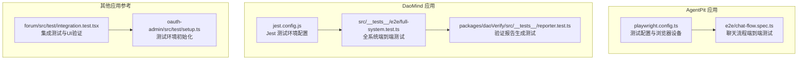
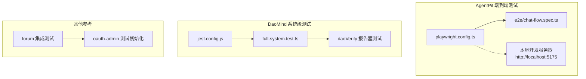
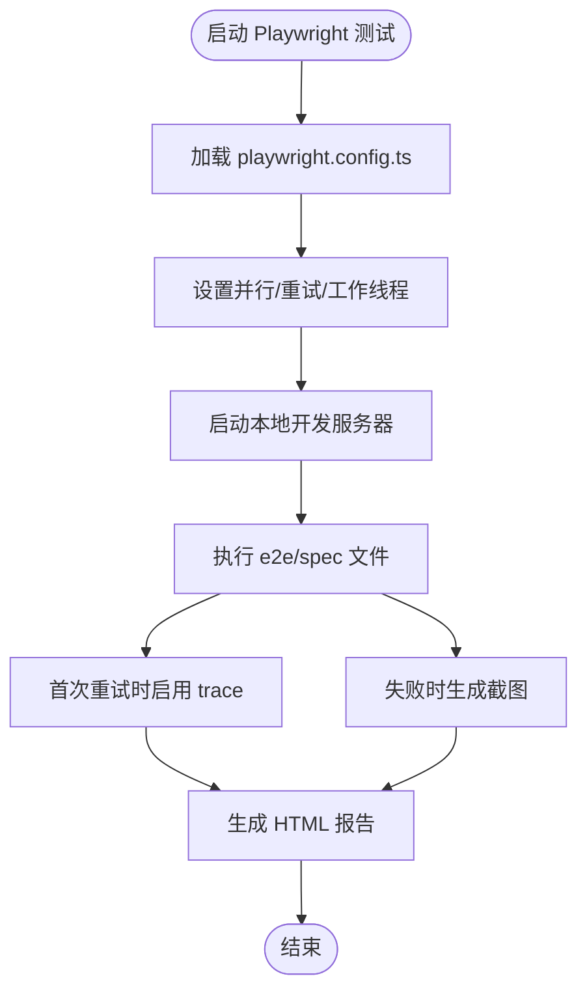
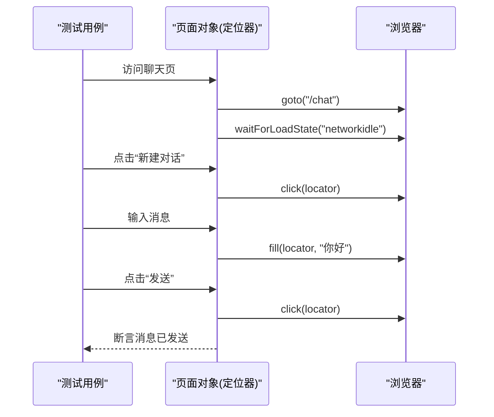
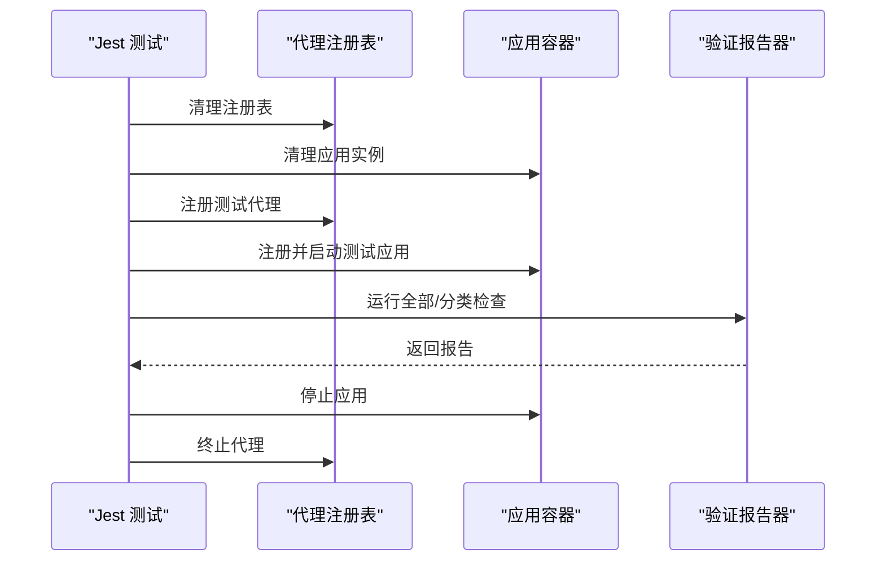
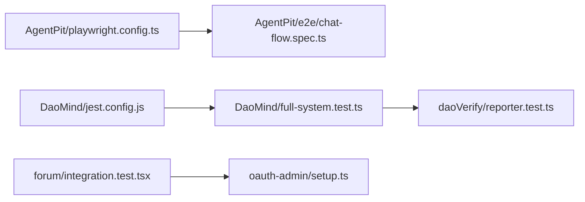

# 端到端测试

<cite>
**本文引用的文件**
- [apps/AgentPit/playwright.config.ts](file://apps/AgentPit/playwright.config.ts)
- [apps/AgentPit/e2e/chat-flow.spec.ts](file://apps/AgentPit/e2e/chat-flow.spec.ts)
- [apps/DaoMind/src/__tests__/e2e/full-system.test.ts](file://apps/DaoMind/src/__tests__/e2e/full-system.test.ts)
- [apps/DaoMind/packages/daoVerify/src/__tests__/reporter.test.ts](file://apps/DaoMind/packages/daoVerify/src/__tests__/reporter.test.ts)
- [apps/DaoMind/jest.config.js](file://apps/DaoMind/jest.config.js)
- [apps/AgentPit/vitest.config.ts](file://apps/AgentPit/vitest.config.ts)
- [apps/forum/src/test/integration.test.tsx](file://apps/forum/src/test/integration.test.tsx)
- [apps/oauth-admin/src/test/setup.ts](file://apps/oauth-admin/src/test/setup.ts)
</cite>

## 目录
1. [简介](#简介)
2. [项目结构](#项目结构)
3. [核心组件](#核心组件)
4. [架构总览](#架构总览)
5. [详细组件分析](#详细组件分析)
6. [依赖关系分析](#依赖关系分析)
7. [性能考量](#性能考量)
8. [故障排查指南](#故障排查指南)
9. [结论](#结论)
10. [附录](#附录)

## 简介
本文件面向端到端测试实践，聚焦于 Playwright 测试框架在前端应用中的配置与使用，涵盖浏览器配置、测试环境设置、页面对象模型设计、用户交互与导航、表单提交、响应式布局等典型场景，并结合仓库中已有的测试样例进行说明。同时，文档解释测试数据管理、元素定位策略、异步操作处理、截图与视频录制等技术实现要点，并提供可落地的测试用例路径与调试技巧。

## 项目结构
本仓库包含多个前端应用，其中 AgentPit 应用提供了基于 Playwright 的端到端测试配置与示例；DaoMind 应用提供了基于 Jest 的系统级 E2E 测试；部分应用还包含 Vitest/Jest 的集成测试与 UI 元素验证示例。下图展示了与端到端测试相关的关键文件与职责划分：

图表来源
- [apps/AgentPit/playwright.config.ts:1-28](file://apps/AgentPit/playwright.config.ts#L1-L28)
- [apps/AgentPit/e2e/chat-flow.spec.ts:1-33](file://apps/AgentPit/e2e/chat-flow.spec.ts#L1-L33)
- [apps/DaoMind/src/__tests__/e2e/full-system.test.ts:1-120](file://apps/DaoMind/src/__tests__/e2e/full-system.test.ts#L1-L120)
- [apps/DaoMind/packages/daoVerify/src/__tests__/reporter.test.ts:1-81](file://apps/DaoMind/packages/daoVerify/src/__tests__/reporter.test.ts#L1-L81)
- [apps/DaoMind/jest.config.js:1-59](file://apps/DaoMind/jest.config.js#L1-L59)
- [apps/forum/src/test/integration.test.tsx:145-197](file://apps/forum/src/test/integration.test.tsx#L145-L197)
- [apps/oauth-admin/src/test/setup.ts:1-24](file://apps/oauth-admin/src/test/setup.ts#L1-L24)

章节来源
- [apps/AgentPit/playwright.config.ts:1-28](file://apps/AgentPit/playwright.config.ts#L1-L28)
- [apps/AgentPit/e2e/chat-flow.spec.ts:1-33](file://apps/AgentPit/e2e/chat-flow.spec.ts#L1-L33)
- [apps/DaoMind/src/__tests__/e2e/full-system.test.ts:1-120](file://apps/DaoMind/src/__tests__/e2e/full-system.test.ts#L1-L120)
- [apps/DaoMind/packages/daoVerify/src/__tests__/reporter.test.ts:1-81](file://apps/DaoMind/packages/daoVerify/src/__tests__/reporter.test.ts#L1-L81)
- [apps/DaoMind/jest.config.js:1-59](file://apps/DaoMind/jest.config.js#L1-L59)
- [apps/forum/src/test/integration.test.tsx:145-197](file://apps/forum/src/test/integration.test.tsx#L145-L197)
- [apps/oauth-admin/src/test/setup.ts:1-24](file://apps/oauth-admin/src/test/setup.ts#L1-L24)

## 核心组件
- Playwright 测试配置：定义测试目录、并行度、重试策略、工作线程数、报告器、浏览器设备、Web 服务器启动命令与超时等。
- 页面对象模型（POM）：通过定位器（locator）封装页面元素与交互步骤，提升可维护性与可读性。
- 测试数据管理：通过测试前钩子清理状态、注册代理或应用实例，确保测试隔离与可重复性。
- 异步操作处理：使用等待策略（如网络空闲、可见性、超时）保证 DOM 状态稳定后再断言。
- 截图与视频录制：启用首次重试时的 trace 与仅失败时的截图，便于问题复现与分析。
- 集成与系统级测试：结合 Jest/Vitest 进行跨模块的系统级端到端验证。

章节来源
- [apps/AgentPit/playwright.config.ts:1-28](file://apps/AgentPit/playwright.config.ts#L1-L28)
- [apps/AgentPit/e2e/chat-flow.spec.ts:1-33](file://apps/AgentPit/e2e/chat-flow.spec.ts#L1-L33)
- [apps/DaoMind/src/__tests__/e2e/full-system.test.ts:1-120](file://apps/DaoMind/src/__tests__/e2e/full-system.test.ts#L1-L120)

## 架构总览
下图展示了端到端测试在不同应用中的组织方式与交互关系：

图表来源
- [apps/AgentPit/playwright.config.ts:1-28](file://apps/AgentPit/playwright.config.ts#L1-L28)
- [apps/AgentPit/e2e/chat-flow.spec.ts:1-33](file://apps/AgentPit/e2e/chat-flow.spec.ts#L1-L33)
- [apps/DaoMind/jest.config.js:1-59](file://apps/DaoMind/jest.config.js#L1-L59)
- [apps/DaoMind/src/__tests__/e2e/full-system.test.ts:1-120](file://apps/DaoMind/src/__tests__/e2e/full-system.test.ts#L1-L120)
- [apps/DaoMind/packages/daoVerify/src/__tests__/reporter.test.ts:1-81](file://apps/DaoMind/packages/daoVerify/src/__tests__/reporter.test.ts#L1-L81)
- [apps/forum/src/test/integration.test.tsx:145-197](file://apps/forum/src/test/integration.test.tsx#L145-L197)
- [apps/oauth-admin/src/test/setup.ts:1-24](file://apps/oauth-admin/src/test/setup.ts#L1-L24)

## 详细组件分析

### Playwright 配置与浏览器设置
- 测试目录与并行：通过配置指定测试目录、完全并行执行、CI 环境下的重试与工作线程限制。
- 报告器与追踪：HTML 报告器用于生成可视化报告；首次重试时开启 trace，便于问题复现。
- 截图策略：仅在失败时生成截图，降低产物体积。
- 设备与浏览器：以桌面 Chrome 作为默认项目，便于覆盖主流桌面场景。
- Web 服务器：自动启动本地开发服务器，确保测试在真实运行环境中执行。

图表来源
- [apps/AgentPit/playwright.config.ts:1-28](file://apps/AgentPit/playwright.config.ts#L1-L28)

章节来源
- [apps/AgentPit/playwright.config.ts:1-28](file://apps/AgentPit/playwright.config.ts#L1-L28)

### 页面对象模型（POM）与元素定位
- 定位器封装：将页面元素选择逻辑封装为定位器，减少重复代码，提升可维护性。
- 多种定位策略：支持类名、文本、data-testid、可编辑区域等组合定位，增强健壮性。
- 交互步骤抽象：将“新建对话”“输入消息”“点击发送”等步骤封装为可复用的交互函数。
- 断言与等待：对可见性、可用性、值变化等进行断言，并配合网络空闲与显式等待保证稳定性。

图表来源
- [apps/AgentPit/e2e/chat-flow.spec.ts:1-33](file://apps/AgentPit/e2e/chat-flow.spec.ts#L1-L33)

章节来源
- [apps/AgentPit/e2e/chat-flow.spec.ts:1-33](file://apps/AgentPit/e2e/chat-flow.spec.ts#L1-L33)

### 用户交互流程测试（聊天流程）
- 场景覆盖：聊天界面加载、新建对话、消息输入、发送按钮触发。
- 断言策略：对可见性、输入值、交互后状态进行断言。
- 可扩展性：可在现有基础上增加“历史消息展示”“多轮对话”“语音/图片发送”等场景。

章节来源
- [apps/AgentPit/e2e/chat-flow.spec.ts:1-33](file://apps/AgentPit/e2e/chat-flow.spec.ts#L1-L33)

### 页面导航测试
- 导航目标：从首页到聊天页、从聊天页到其他功能页。
- 等待策略：使用网络空闲与元素可见性等待，避免竞态条件。
- 路由健壮性：通过 data-testid 或语义化文本定位导航项，提高跨版本兼容性。

章节来源
- [apps/AgentPit/e2e/chat-flow.spec.ts:1-33](file://apps/AgentPit/e2e/chat-flow.spec.ts#L1-L33)

### 表单提交测试
- 输入与校验：对必填字段、格式校验、禁用状态进行断言。
- 提交流程：触发提交事件后等待网络请求完成与 UI 更新。
- 错误处理：模拟服务端错误或网络异常，验证错误提示与回退行为。

章节来源
- [apps/AgentPit/e2e/chat-flow.spec.ts:1-33](file://apps/AgentPit/e2e/chat-flow.spec.ts#L1-L33)

### 响应式布局测试
- 设备与尺寸：通过设备列表或自定义视口尺寸覆盖移动端、平板与桌面场景。
- 关键布局断言：断言导航折叠、侧边栏隐藏、按钮换行、字体缩放等。
- 截图对比：在关键断点生成截图，辅助回归验证。

章节来源
- [apps/AgentPit/playwright.config.ts:1-28](file://apps/AgentPit/playwright.config.ts#L1-L28)

### 系统级端到端测试（DaoMind）
- 测试范围：代理注册与生命周期、应用容器注册与启动、验证报告生成与分类执行。
- 数据隔离：每个测试前清理代理注册表与应用容器，确保独立性。
- 错误场景：验证不存在的应用启动、重复注册代理等边界情况。

图表来源
- [apps/DaoMind/src/__tests__/e2e/full-system.test.ts:1-120](file://apps/DaoMind/src/__tests__/e2e/full-system.test.ts#L1-L120)

章节来源
- [apps/DaoMind/src/__tests__/e2e/full-system.test.ts:1-120](file://apps/DaoMind/src/__tests__/e2e/full-system.test.ts#L1-L120)

### 验证报告生成与分类执行
- 报告生成：支持 Markdown 与 JSON 输出，便于集成 CI 报告与人工审阅。
- 分类执行：按类别运行检查，快速定位问题域。
- 结果断言：对通过/失败计数、综合得分、哲学维度评分等进行断言。

章节来源
- [apps/DaoMind/packages/daoVerify/src/__tests__/reporter.test.ts:1-81](file://apps/DaoMind/packages/daoVerify/src/__tests__/reporter.test.ts#L1-L81)

### 集成测试与 UI 元素验证（参考）
- 集成测试：在真实 DOM 环境中渲染组件，验证导航、按钮、表单等关键 UI 元素的存在与交互。
- 测试工具：使用 @testing-library/react 与 jsdom，结合 fireEvent、waitFor 等工具进行交互与断言。
- 环境准备：在测试前注入必要的全局对象（如 localStorage），确保第三方依赖正常工作。

章节来源
- [apps/forum/src/test/integration.test.tsx:145-197](file://apps/forum/src/test/integration.test.tsx#L145-L197)
- [apps/oauth-admin/src/test/setup.ts:1-24](file://apps/oauth-admin/src/test/setup.ts#L1-L24)

## 依赖关系分析
- AgentPit 的端到端测试依赖 Playwright 配置与本地开发服务器；测试文件通过定位器与等待策略保证稳定性。
- DaoMind 的系统级测试依赖 Jest 配置与模块别名映射，测试用例覆盖代理与应用容器的生命周期。
- 验证报告器测试独立于前端运行时，专注于报告生成与分类执行的正确性。
- 其他应用的集成测试展示了在真实 DOM 环境中的 UI 验证模式，可作为端到端测试的补充。

图表来源
- [apps/AgentPit/playwright.config.ts:1-28](file://apps/AgentPit/playwright.config.ts#L1-L28)
- [apps/AgentPit/e2e/chat-flow.spec.ts:1-33](file://apps/AgentPit/e2e/chat-flow.spec.ts#L1-L33)
- [apps/DaoMind/jest.config.js:1-59](file://apps/DaoMind/jest.config.js#L1-L59)
- [apps/DaoMind/src/__tests__/e2e/full-system.test.ts:1-120](file://apps/DaoMind/src/__tests__/e2e/full-system.test.ts#L1-L120)
- [apps/DaoMind/packages/daoVerify/src/__tests__/reporter.test.ts:1-81](file://apps/DaoMind/packages/daoVerify/src/__tests__/reporter.test.ts#L1-L81)
- [apps/forum/src/test/integration.test.tsx:145-197](file://apps/forum/src/test/integration.test.tsx#L145-L197)
- [apps/oauth-admin/src/test/setup.ts:1-24](file://apps/oauth-admin/src/test/setup.ts#L1-L24)

章节来源
- [apps/AgentPit/playwright.config.ts:1-28](file://apps/AgentPit/playwright.config.ts#L1-L28)
- [apps/AgentPit/e2e/chat-flow.spec.ts:1-33](file://apps/AgentPit/e2e/chat-flow.spec.ts#L1-L33)
- [apps/DaoMind/jest.config.js:1-59](file://apps/DaoMind/jest.config.js#L1-L59)
- [apps/DaoMind/src/__tests__/e2e/full-system.test.ts:1-120](file://apps/DaoMind/src/__tests__/e2e/full-system.test.ts#L1-L120)
- [apps/DaoMind/packages/daoVerify/src/__tests__/reporter.test.ts:1-81](file://apps/DaoMind/packages/daoVerify/src/__tests__/reporter.test.ts#L1-L81)
- [apps/forum/src/test/integration.test.tsx:145-197](file://apps/forum/src/test/integration.test.tsx#L145-L197)
- [apps/oauth-admin/src/test/setup.ts:1-24](file://apps/oauth-admin/src/test/setup.ts#L1-L24)

## 性能考量
- 并行与重试：在 CI 环境中适度并行与重试可提升吞吐，但需控制工作线程数量避免资源争用。
- 等待策略：优先使用网络空闲与元素可见性等待，减少不必要的固定等待时间。
- 截图与视频：仅在失败时生成截图，trace 仅在首次重试启用，降低产物体积与执行时间。
- 服务器复用：在非 CI 环境复用已有服务器，缩短冷启动时间。

章节来源
- [apps/AgentPit/playwright.config.ts:1-28](file://apps/AgentPit/playwright.config.ts#L1-L28)

## 故障排查指南
- 启动失败：确认本地开发服务器命令与端口配置一致，检查超时设置与端口占用。
- 元素不可见：检查等待策略是否合理，必要时增加显式等待或调整选择器精度。
- 截图与 trace：在首次重试时启用 trace，失败时生成截图，结合日志定位问题根因。
- 环境差异：在 CI 与本地环境分别验证，关注浏览器版本、窗口尺寸、网络延迟等因素。
- 集成测试环境：确保 jsdom 环境下的全局对象（如 localStorage）已正确注入。

章节来源
- [apps/AgentPit/playwright.config.ts:1-28](file://apps/AgentPit/playwright.config.ts#L1-L28)
- [apps/oauth-admin/src/test/setup.ts:1-24](file://apps/oauth-admin/src/test/setup.ts#L1-L24)

## 结论
本仓库在 AgentPit 中提供了基于 Playwright 的端到端测试配置与聊天流程示例，在 DaoMind 中提供了系统级端到端测试与验证报告生成测试。通过合理的配置、稳定的等待策略、清晰的页面对象模型与严格的错误处理，可以构建高可靠性的端到端测试体系。建议在现有基础上逐步扩展至购物旅程、主题切换等更多业务场景，并持续优化等待与产物管理策略。

## 附录
- 测试用例示例路径
  - 聊天流程测试：[apps/AgentPit/e2e/chat-flow.spec.ts:1-33](file://apps/AgentPit/e2e/chat-flow.spec.ts#L1-L33)
  - 全系统端到端测试：[apps/DaoMind/src/__tests__/e2e/full-system.test.ts:1-120](file://apps/DaoMind/src/__tests__/e2e/full-system.test.ts#L1-L120)
  - 验证报告生成测试：[apps/DaoMind/packages/daoVerify/src/__tests__/reporter.test.ts:1-81](file://apps/DaoMind/packages/daoVerify/src/__tests__/reporter.test.ts#L1-L81)
  - 集成测试与 UI 验证（参考）：[apps/forum/src/test/integration.test.tsx:145-197](file://apps/forum/src/test/integration.test.tsx#L145-L197)
  - 测试环境初始化（参考）：[apps/oauth-admin/src/test/setup.ts:1-24](file://apps/oauth-admin/src/test/setup.ts#L1-L24)
- 配置文件路径
  - Playwright 配置：[apps/AgentPit/playwright.config.ts:1-28](file://apps/AgentPit/playwright.config.ts#L1-L28)
  - Jest 配置（DaoMind）：[apps/DaoMind/jest.config.js:1-59](file://apps/DaoMind/jest.config.js#L1-L59)
  - Vitest 配置（AgentPit）：[apps/AgentPit/vitest.config.ts:1-48](file://apps/AgentPit/vitest.config.ts#L1-L48)