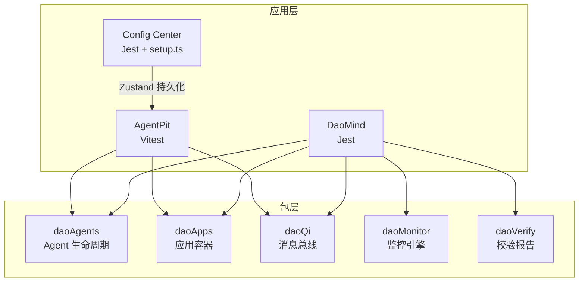
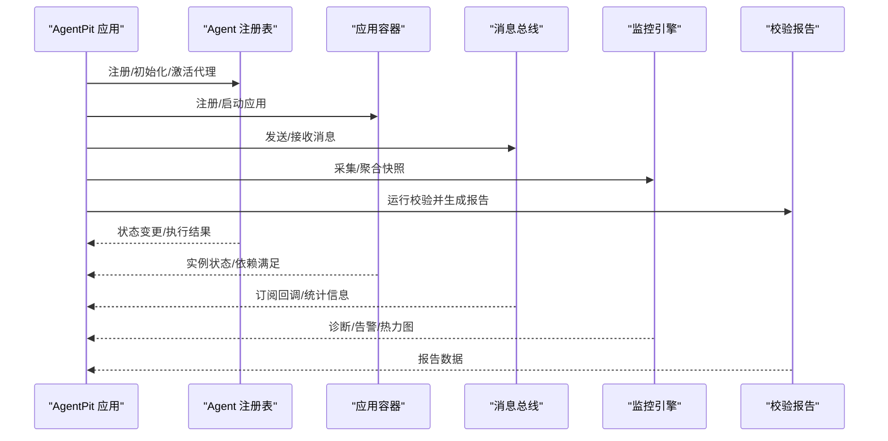
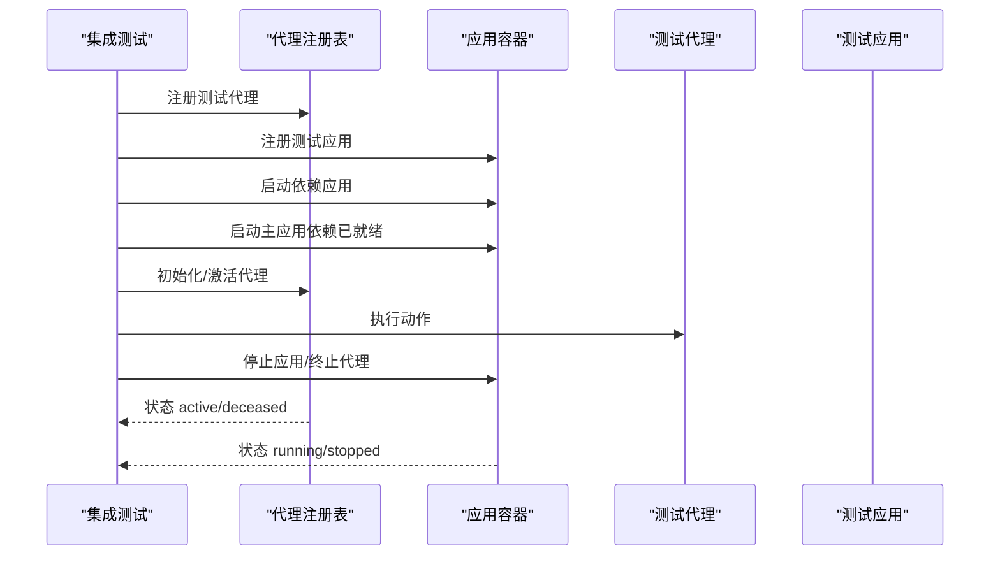
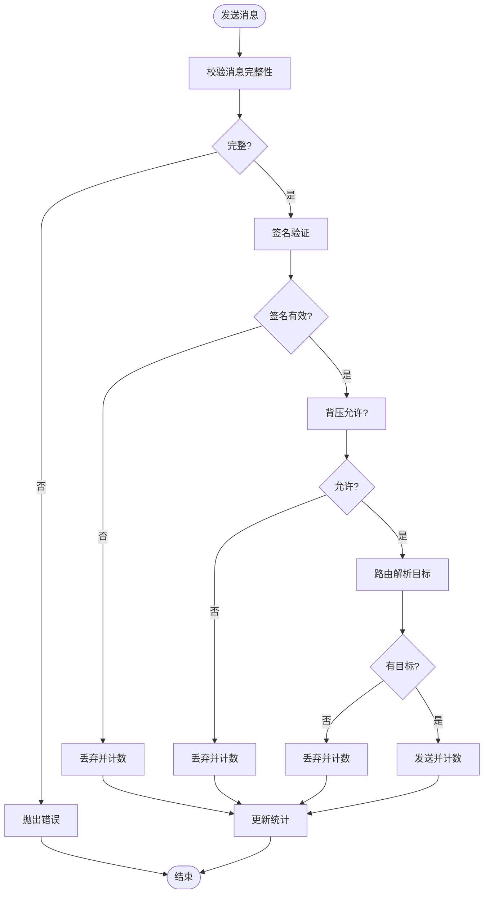
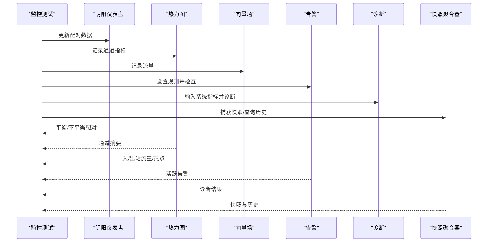
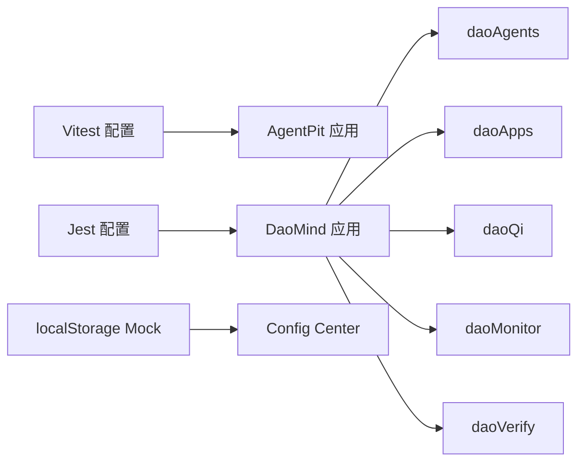

# 集成测试策略

<cite>
**本文引用的文件**
- [apps/DaoMind/src/__tests__/integration/agents-apps-integration.test.ts](file://apps/DaoMind/src/__tests__/integration/agents-apps-integration.test.ts)
- [apps/DaoMind/src/__tests__/integration/verify-integration.test.ts](file://apps/DaoMind/src/__tests__/integration/verify-integration.test.ts)
- [apps/DaoMind/tests/test-monitor-system.test.ts](file://apps/DaoMind/tests/test-monitor-system.test.ts)
- [apps/DaoMind/tests/test-project.js](file://apps/DaoMind/tests/test-project.js)
- [apps/DaoMind/tests/test-qi-message.js](file://apps/DaoMind/tests/test-qi-message.js)
- [apps/DaoMind/packages/daoAgents/src/__tests__/base.test.ts](file://apps/DaoMind/packages/daoAgents/src/__tests__/base.test.ts)
- [apps/DaoMind/packages/daoApps/src/__tests__/container.test.ts](file://apps/DaoMind/packages/daoApps/src/__tests__/container.test.ts)
- [apps/DaoMind/packages/daoQi/src/__tests__/hunyuan.test.ts](file://apps/DaoMind/packages/daoQi/src/__tests__/hunyuan.test.ts)
- [apps/AgentPit/vitest.config.ts](file://apps/AgentPit/vitest.config.ts)
- [apps/config-center/src/test/setup.ts](file://apps/config-center/src/test/setup.ts)
- [apps/DaoMind/jest.config.js](file://apps/DaoMind/jest.config.js)
</cite>

## 目录
1. [引言](#引言)
2. [项目结构](#项目结构)
3. [核心组件](#核心组件)
4. [架构总览](#架构总览)
5. [详细组件分析](#详细组件分析)
6. [依赖关系分析](#依赖关系分析)
7. [性能考量](#性能考量)
8. [故障排查指南](#故障排查指南)
9. [结论](#结论)
10. [附录](#附录)

## 引言
本文件面向跨组件、跨模块、跨服务的集成测试策略，结合仓库中现有的测试实践，系统化阐述如何在多包、多应用、多测试框架（Jest/Vitest）的环境中构建稳定可靠的集成测试体系。内容涵盖：
- 组件间通信测试与状态管理集成测试
- API 接口集成测试与第三方服务集成测试
- 测试环境搭建、Mock 服务配置、数据库连接测试
- 测试数据准备、测试场景设计、错误处理验证
- 具体示例：AgentPit 中的聊天流程测试、状态管理测试等

## 项目结构
该仓库采用 monorepo 结构，包含多个前端应用与后端/中间件包。集成测试主要分布在以下位置：
- 应用层：AgentPit（Vitest）、DaoMind（Jest）
- 包层：daoAgents、daoApps、daoQi、daoMonitor 等
- 测试脚本：独立 Node 脚本用于系统级功能验证

图表来源
- [apps/AgentPit/vitest.config.ts:1-48](file://apps/AgentPit/vitest.config.ts#L1-L48)
- [apps/DaoMind/jest.config.js:1-59](file://apps/DaoMind/jest.config.js#L1-L59)
- [apps/DaoMind/packages/daoAgents/src/__tests__/base.test.ts:1-91](file://apps/DaoMind/packages/daoAgents/src/__tests__/base.test.ts#L1-L91)
- [apps/DaoMind/packages/daoApps/src/__tests__/container.test.ts:1-233](file://apps/DaoMind/packages/daoApps/src/__tests__/container.test.ts#L1-L233)
- [apps/DaoMind/packages/daoQi/src/__tests__/hunyuan.test.ts:1-269](file://apps/DaoMind/packages/daoQi/src/__tests__/hunyuan.test.ts#L1-L269)
- [apps/DaoMind/src/__tests__/integration/agents-apps-integration.test.ts:1-113](file://apps/DaoMind/src/__tests__/integration/agents-apps-integration.test.ts#L1-L113)
- [apps/DaoMind/src/__tests__/integration/verify-integration.test.ts:1-45](file://apps/DaoMind/src/__tests__/integration/verify-integration.test.ts#L1-L45)

章节来源
- [apps/AgentPit/vitest.config.ts:1-48](file://apps/AgentPit/vitest.config.ts#L1-L48)
- [apps/DaoMind/jest.config.js:1-59](file://apps/DaoMind/jest.config.js#L1-L59)

## 核心组件
- Agent 与应用容器集成：验证代理注册、生命周期、应用容器注册/启动/停止、依赖解析与启动顺序。
- 消息总线集成：验证消息序列化、路由、签名、背压控制、订阅与探测。
- 监控系统集成：验证仪表盘、热力图、向量场、告警、诊断、快照聚合器的协同工作。
- 校验报告集成：验证报告生成（Markdown/JSON）与分类检查。
- 独立脚本验证：项目核心功能、消息传递系统的端到端验证。

章节来源
- [apps/DaoMind/src/__tests__/integration/agents-apps-integration.test.ts:1-113](file://apps/DaoMind/src/__tests__/integration/agents-apps-integration.test.ts#L1-L113)
- [apps/DaoMind/src/__tests__/integration/verify-integration.test.ts:1-45](file://apps/DaoMind/src/__tests__/integration/verify-integration.test.ts#L1-L45)
- [apps/DaoMind/packages/daoQi/src/__tests__/hunyuan.test.ts:1-269](file://apps/DaoMind/packages/daoQi/src/__tests__/hunyuan.test.ts#L1-L269)
- [apps/DaoMind/tests/test-monitor-system.test.ts:1-225](file://apps/DaoMind/tests/test-monitor-system.test.ts#L1-L225)
- [apps/DaoMind/tests/test-project.js:1-77](file://apps/DaoMind/tests/test-project.js#L1-L77)
- [apps/DaoMind/tests/test-qi-message.js:1-90](file://apps/DaoMind/tests/test-qi-message.js#L1-L90)

## 架构总览
下图展示集成测试的关键交互路径：应用层通过包层提供的组件进行交互，测试覆盖从组件到服务的完整链路。

图表来源
- [apps/DaoMind/src/__tests__/integration/agents-apps-integration.test.ts:1-113](file://apps/DaoMind/src/__tests__/integration/agents-apps-integration.test.ts#L1-L113)
- [apps/DaoMind/packages/daoQi/src/__tests__/hunyuan.test.ts:1-269](file://apps/DaoMind/packages/daoQi/src/__tests__/hunyuan.test.ts#L1-L269)
- [apps/DaoMind/src/__tests__/integration/verify-integration.test.ts:1-45](file://apps/DaoMind/src/__tests__/integration/verify-integration.test.ts#L1-L45)
- [apps/DaoMind/tests/test-monitor-system.test.ts:1-225](file://apps/DaoMind/tests/test-monitor-system.test.ts#L1-L225)

## 详细组件分析

### Agent 与应用容器集成测试
- 测试目标
  - 代理生命周期：dormant → awakening → active → resting → deceased
  - 应用容器：注册/注销、启动/停止/重启、按状态列表、依赖满足
  - 代理与应用协作：代理执行动作、应用状态同步、依赖应用先于主应用启动
- 关键断言
  - 代理状态机正确性、异常状态转换抛错
  - 容器对重复注册、卸载运行中应用、非存在应用操作的错误处理
  - 依赖未满足时启动失败，满足后可正常启动
- 测试数据与场景
  - 自定义测试代理类，声明能力与执行逻辑
  - 注册两个应用，一个作为依赖，验证启动顺序与依赖解析

图表来源
- [apps/DaoMind/src/__tests__/integration/agents-apps-integration.test.ts:1-113](file://apps/DaoMind/src/__tests__/integration/agents-apps-integration.test.ts#L1-L113)

章节来源
- [apps/DaoMind/src/__tests__/integration/agents-apps-integration.test.ts:1-113](file://apps/DaoMind/src/__tests__/integration/agents-apps-integration.test.ts#L1-L113)
- [apps/DaoMind/packages/daoAgents/src/__tests__/base.test.ts:1-91](file://apps/DaoMind/packages/daoAgents/src/__tests__/base.test.ts#L1-L91)
- [apps/DaoMind/packages/daoApps/src/__tests__/container.test.ts:1-233](file://apps/DaoMind/packages/daoApps/src/__tests__/container.test.ts#L1-L233)

### 消息总线集成测试
- 测试目标
  - 消息发送：序列化、路由、签名、背压控制、统计
  - 错误处理：无效签名、背压拒绝、无目标、消息不完整
  - 订阅与探测：通道订阅、取消订阅、目标探测延迟
- 关键断言
  - 正常消息发送后统计计数正确
  - 异常场景统计计数正确且不抛出不可预期错误
  - 订阅返回可调用的取消函数，探测返回数值型延迟
- 测试数据与场景
  - 构造完整/不完整消息头/体，模拟路由返回空数组、背压拒绝、签名验证失败

图表来源
- [apps/DaoMind/packages/daoQi/src/__tests__/hunyuan.test.ts:1-269](file://apps/DaoMind/packages/daoQi/src/__tests__/hunyuan.test.ts#L1-L269)

章节来源
- [apps/DaoMind/packages/daoQi/src/__tests__/hunyuan.test.ts:1-269](file://apps/DaoMind/packages/daoQi/src/__tests__/hunyuan.test.ts#L1-L269)

### 监控系统集成测试
- 测试目标
  - 仪表盘引擎：更新阴阳比值、查询不平衡配对
  - 热力图引擎：记录通道指标、获取通道摘要
  - 向量场：记录流量、查询入/出站、热点识别
  - 告警引擎：设置规则、检查触发、获取活跃告警
  - 诊断引擎：输入系统指标、输出诊断结果
  - 快照聚合器：捕获快照、历史与最后快照查询
- 关键断言
  - 各引擎返回的数据结构符合预期
  - 统计与查询结果数量与调用次数一致
  - 规则触发后告警列表非空
- 测试数据与场景
  - 随机生成系统健康、热力图、流量、告警指标，模拟高负载/高延迟场景

图表来源
- [apps/DaoMind/tests/test-monitor-system.test.ts:1-225](file://apps/DaoMind/tests/test-monitor-system.test.ts#L1-L225)

章节来源
- [apps/DaoMind/tests/test-monitor-system.test.ts:1-225](file://apps/DaoMind/tests/test-monitor-system.test.ts#L1-L225)

### 校验报告集成测试
- 测试目标
  - 运行全部检查项，生成报告对象，包含结果列表、总体分数、通过/失败计数
  - 运行指定分类检查，校验结果类别
  - 生成 Markdown 与 JSON 报告，校验格式与可解析性
- 关键断言
  - 报告对象结构完整
  - Markdown 报告包含标题标识
  - JSON 报告字符串可被解析为对象

章节来源
- [apps/DaoMind/src/__tests__/integration/verify-integration.test.ts:1-45](file://apps/DaoMind/src/__tests__/integration/verify-integration.test.ts#L1-L45)

### 独立脚本验证（项目核心功能与消息传递）
- 项目核心功能脚本
  - 创建代理、初始化/激活/休息/终止，验证状态机
  - 注册模块、初始化/激活/列出模块
- 消息传递脚本
  - 创建序列化器、路由器、签名器、背压控制器与混元气总线
  - 四气通道创建与消息发送、统计查询

章节来源
- [apps/DaoMind/tests/test-project.js:1-77](file://apps/DaoMind/tests/test-project.js#L1-L77)
- [apps/DaoMind/tests/test-qi-message.js:1-90](file://apps/DaoMind/tests/test-qi-message.js#L1-L90)

## 依赖关系分析
- 测试框架与配置
  - AgentPit 使用 Vitest，配置 jsdom 环境、覆盖率与别名
  - DaoMind 使用 Jest，配置 ts-jest、ESM、模块映射与根目录
- 包层依赖
  - 应用层通过 @daomind/* 命名空间访问各包源码
  - daoAgents 提供代理基类与注册表；daoApps 提供应用容器；daoQi 提供消息总线；daoMonitor 提供监控引擎；daoVerify 提供校验报告
- 状态管理与持久化
  - Config Center 使用 localStorage Mock 支持 Zustand 持久化中间件

图表来源
- [apps/AgentPit/vitest.config.ts:1-48](file://apps/AgentPit/vitest.config.ts#L1-L48)
- [apps/DaoMind/jest.config.js:1-59](file://apps/DaoMind/jest.config.js#L1-L59)
- [apps/config-center/src/test/setup.ts:1-25](file://apps/config-center/src/test/setup.ts#L1-L25)

章节来源
- [apps/AgentPit/vitest.config.ts:1-48](file://apps/AgentPit/vitest.config.ts#L1-L48)
- [apps/DaoMind/jest.config.js:1-59](file://apps/DaoMind/jest.config.js#L1-L59)
- [apps/config-center/src/test/setup.ts:1-25](file://apps/config-center/src/test/setup.ts#L1-L25)

## 性能考量
- 测试超时与并发
  - Jest 配置了较长的测试超时时间，适合集成测试的复杂链路
  - Vitest 配置了合理的最大 worker 百分比，兼顾并发与资源占用
- 覆盖率与报告
  - Jest 输出多种覆盖率报告格式，便于持续集成与质量门禁
  - Vitest 配置了组件/存储/组合式函数的覆盖率范围与阈值
- 监控与可观测性
  - 监控系统测试覆盖热力图、向量场、告警、诊断与快照聚合，有助于定位性能瓶颈与异常

章节来源
- [apps/DaoMind/jest.config.js:1-59](file://apps/DaoMind/jest.config.js#L1-L59)
- [apps/AgentPit/vitest.config.ts:1-48](file://apps/AgentPit/vitest.config.ts#L1-L48)
- [apps/DaoMind/tests/test-monitor-system.test.ts:1-225](file://apps/DaoMind/tests/test-monitor-system.test.ts#L1-L225)

## 故障排查指南
- 代理状态转换异常
  - 症状：从 dormant 直接激活抛错
  - 处理：确保先 initialize 再 activate；检查自定义代理状态机实现
- 应用卸载失败
  - 症状：卸载运行中应用抛错
  - 处理：先 stop 再 unregister；或在测试前清理容器实例
- 依赖应用未就绪
  - 症状：启动主应用时报“依赖未就绪”
  - 处理：先启动依赖应用，再启动主应用；验证依赖 ID 与版本匹配
- 消息发送被丢弃
  - 症状：统计 totalDropped 增加
  - 处理：检查签名是否有效、背压策略是否允许、路由是否返回目标
- 监控数据为空
  - 症状：热力图/向量场/告警为空
  - 处理：确认已记录足够样本数据；检查规则阈值与通道类型

章节来源
- [apps/DaoMind/packages/daoAgents/src/__tests__/base.test.ts:1-91](file://apps/DaoMind/packages/daoAgents/src/__tests__/base.test.ts#L1-L91)
- [apps/DaoMind/packages/daoApps/src/__tests__/container.test.ts:1-233](file://apps/DaoMind/packages/daoApps/src/__tests__/container.test.ts#L1-L233)
- [apps/DaoMind/packages/daoQi/src/__tests__/hunyuan.test.ts:1-269](file://apps/DaoMind/packages/daoQi/src/__tests__/hunyuan.test.ts#L1-L269)
- [apps/DaoMind/tests/test-monitor-system.test.ts:1-225](file://apps/DaoMind/tests/test-monitor-system.test.ts#L1-L225)

## 结论
本仓库已具备完善的集成测试基础：代理与应用容器的生命周期与依赖管理、消息总线的健壮性与错误处理、监控系统的全链路协同、以及校验报告的自动化产出。建议在此基础上进一步完善：
- 补充第三方服务（如数据库、外部 API）的集成测试与 Mock 配置
- 设计更丰富的测试场景（如并发、限流、熔断、重试）
- 引入 E2E 测试框架（如 Playwright/Cypress）覆盖用户端到服务端的完整流程
- 将测试覆盖率纳入 CI 质量门禁，确保关键路径得到充分验证

## 附录
- 测试环境搭建要点
  - AgentPit：使用 Vitest，jsdom 环境，组件/存储/组合式函数覆盖率
  - DaoMind：使用 Jest，ts-jest + ESM，模块映射至 packages 源码
  - Config Center：通过 setup.ts 注入 localStorage Mock 支持持久化
- 测试数据准备
  - 使用随机数据模拟系统指标（热力图、向量场、告警）
  - 构造不完整/异常消息头/体以验证健壮性
- 错误处理验证
  - 明确断言统计计数与异常抛出
  - 验证订阅取消、目标探测、报告生成等边界行为