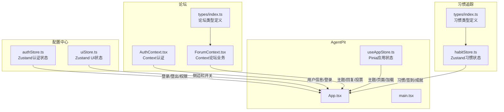
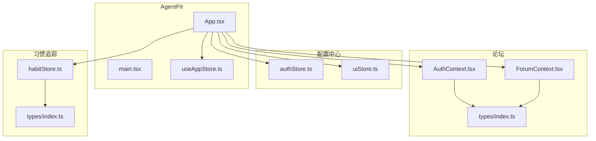
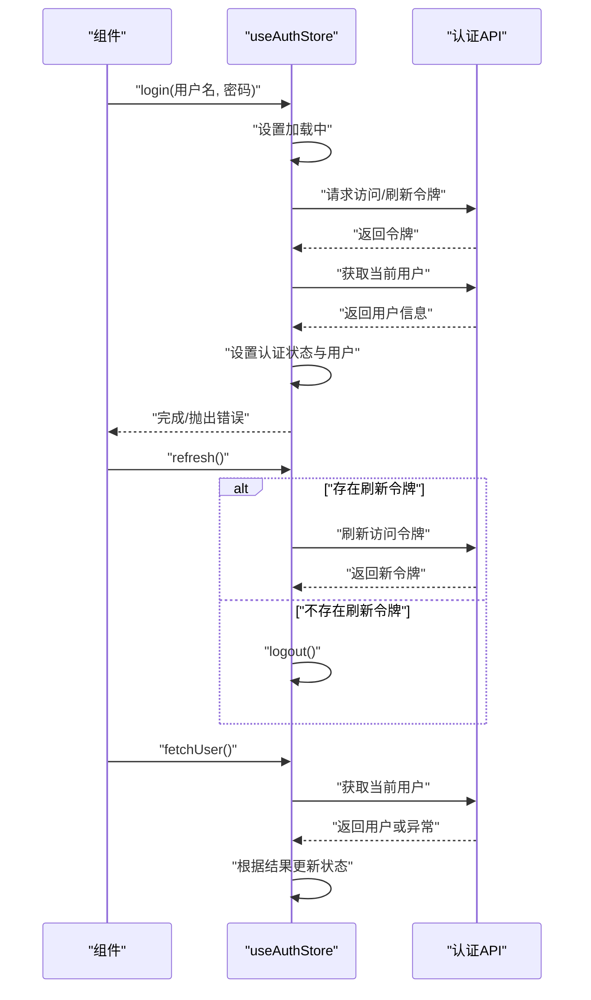
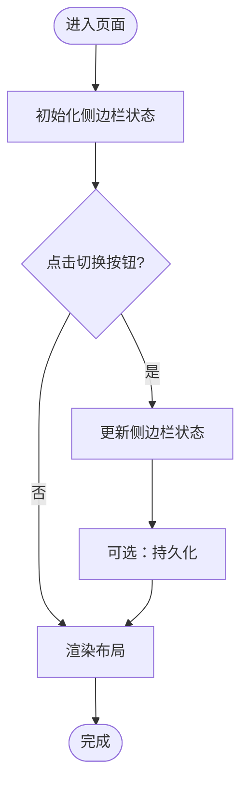
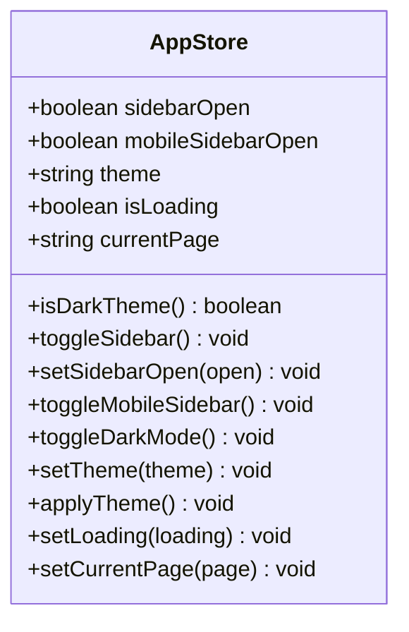
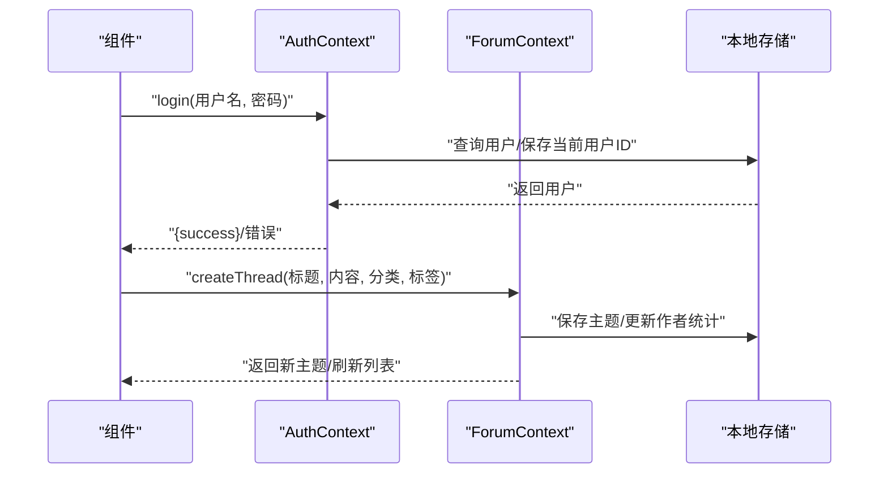
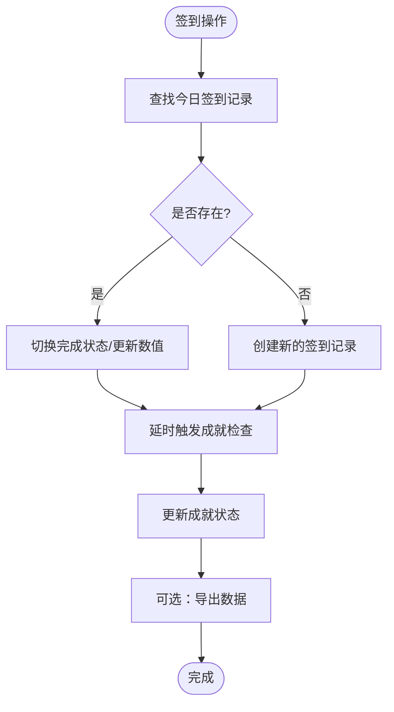
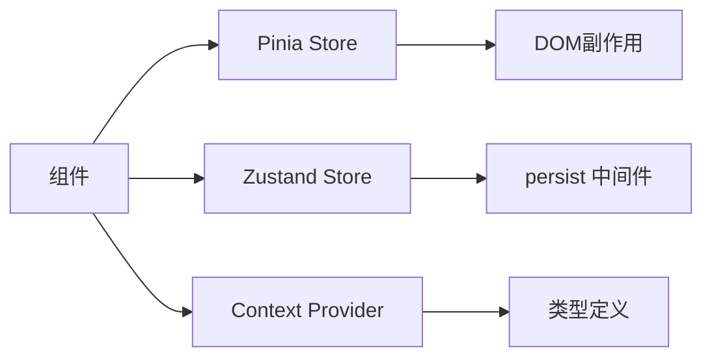

# React状态模式

<cite>
**本文引用的文件**
- [apps/AgentPit/src/stores/useAppStore.ts](file://apps/AgentPit/src/stores/useAppStore.ts)
- [apps/AgentPit/src/App.tsx](file://apps/AgentPit/src/App.tsx)
- [apps/AgentPit/src/main.tsx](file://apps/AgentPit/src/main.tsx)
- [apps/config-center/src/store/authStore.ts](file://apps/config-center/src/store/authStore.ts)
- [apps/config-center/src/store/uiStore.ts](file://apps/config-center/src/store/uiStore.ts)
- [apps/forum/src/context/AuthContext.tsx](file://apps/forum/src/context/AuthContext.tsx)
- [apps/forum/src/context/ForumContext.tsx](file://apps/forum/src/context/ForumContext.tsx)
- [apps/forum/src/types/index.ts](file://apps/forum/src/types/index.ts)
- [apps/habit-tracker/src/store/habitStore.ts](file://apps/habit-tracker/src/store/habitStore.ts)
- [apps/habit-tracker/src/types/index.ts](file://apps/habit-tracker/src/types/index.ts)
</cite>

## 目录
1. [引言](#引言)
2. [项目结构](#项目结构)
3. [核心组件](#核心组件)
4. [架构总览](#架构总览)
5. [详细组件分析](#详细组件分析)
6. [依赖关系分析](#依赖关系分析)
7. [性能考量](#性能考量)
8. [故障排查指南](#故障排查指南)
9. [结论](#结论)
10. [附录](#附录)

## 引言
本文件系统性梳理仓库中React状态管理模式与实现，覆盖useReducer、自定义Hook、Context API以及现代状态库（如Pinia、Zustand）在TypeScript React中的应用。重点解析以下主题：
- 认证状态管理：authStore（配置中心）、AuthContext（论坛）
- 界面状态管理：uiStore（配置中心）、useAppStore（应用全局UI状态）
- 设计原则：状态提升、状态封装、状态解耦
- 最佳实践：可维护性、性能优化、错误处理与边界

## 项目结构
本仓库包含多个独立应用，每个应用采用不同的状态管理模式：
- 配置中心：使用Zustand管理认证与UI状态
- 论坛：使用Context API管理认证与论坛业务状态
- AgentPit：使用Pinia管理应用级UI状态
- 习惯追踪：使用Zustand管理复杂业务数据与本地持久化

**图表来源**
- [apps/config-center/src/store/authStore.ts:1-108](file://apps/config-center/src/store/authStore.ts#L1-L108)
- [apps/config-center/src/store/uiStore.ts:1-14](file://apps/config-center/src/store/uiStore.ts#L1-L14)
- [apps/forum/src/context/AuthContext.tsx:1-93](file://apps/forum/src/context/AuthContext.tsx#L1-L93)
- [apps/forum/src/context/ForumContext.tsx:1-313](file://apps/forum/src/context/ForumContext.tsx#L1-L313)
- [apps/forum/src/types/index.ts:1-107](file://apps/forum/src/types/index.ts#L1-L107)
- [apps/AgentPit/src/App.tsx](file://apps/AgentPit/src/App.tsx)
- [apps/AgentPit/src/main.tsx](file://apps/AgentPit/src/main.tsx)
- [apps/AgentPit/src/stores/useAppStore.ts:1-86](file://apps/AgentPit/src/stores/useAppStore.ts#L1-L86)
- [apps/habit-tracker/src/store/habitStore.ts:1-545](file://apps/habit-tracker/src/store/habitStore.ts#L1-L545)
- [apps/habit-tracker/src/types/index.ts:1-113](file://apps/habit-tracker/src/types/index.ts#L1-L113)

**章节来源**
- [apps/AgentPit/src/stores/useAppStore.ts:1-86](file://apps/AgentPit/src/stores/useAppStore.ts#L1-L86)
- [apps/config-center/src/store/authStore.ts:1-108](file://apps/config-center/src/store/authStore.ts#L1-L108)
- [apps/config-center/src/store/uiStore.ts:1-14](file://apps/config-center/src/store/uiStore.ts#L1-L14)
- [apps/forum/src/context/AuthContext.tsx:1-93](file://apps/forum/src/context/AuthContext.tsx#L1-L93)
- [apps/forum/src/context/ForumContext.tsx:1-313](file://apps/forum/src/context/ForumContext.tsx#L1-L313)
- [apps/forum/src/types/index.ts:1-107](file://apps/forum/src/types/index.ts#L1-L107)
- [apps/habit-tracker/src/store/habitStore.ts:1-545](file://apps/habit-tracker/src/store/habitStore.ts#L1-L545)
- [apps/habit-tracker/src/types/index.ts:1-113](file://apps/habit-tracker/src/types/index.ts#L1-L113)

## 核心组件
本节聚焦四种主流状态模式及其在仓库中的落地实现。

- Pinia（应用全局UI状态）
  - 适用场景：主题切换、侧边栏、当前页面、加载态等轻量全局状态
  - 特点：强类型、G/P/A分层清晰、持久化存储
  - 参考路径：[useAppStore.ts:1-86](file://apps/AgentPit/src/stores/useAppStore.ts#L1-L86)

- Zustand（认证与业务状态）
  - 认证状态（配置中心）：登录/登出/刷新令牌、用户信息、权限判断
    - 参考路径：[authStore.ts:1-108](file://apps/config-center/src/store/authStore.ts#L1-L108)
  - UI状态（配置中心）：侧边栏开关
    - 参考路径：[uiStore.ts:1-14](file://apps/config-center/src/store/uiStore.ts#L1-L14)
  - 复杂业务状态（习惯追踪）：习惯增删改查、签到、统计、成就解锁、导入导出
    - 参考路径：[habitStore.ts:1-545](file://apps/habit-tracker/src/store/habitStore.ts#L1-L545)

- Context API（认证与论坛业务）
  - 认证上下文：登录/注册/登出/更新资料
    - 参考路径：[AuthContext.tsx:1-93](file://apps/forum/src/context/AuthContext.tsx#L1-L93)
  - 论坛上下文：主题/回复/投票/通知/管理操作
    - 参考路径：[ForumContext.tsx:1-313](file://apps/forum/src/context/ForumContext.tsx#L1-L313)
  - 类型定义：用户、主题、回复、通知等
    - 参考路径：[types/index.ts:1-107](file://apps/forum/src/types/index.ts#L1-L107)

- useReducer（建议实践）
  - 适用场景：复杂交互状态（如表单校验、多步骤流程）
  - 建议：结合useContext形成“上下文+reducer”的组合拳，避免深层传递

**章节来源**
- [apps/AgentPit/src/stores/useAppStore.ts:1-86](file://apps/AgentPit/src/stores/useAppStore.ts#L1-L86)
- [apps/config-center/src/store/authStore.ts:1-108](file://apps/config-center/src/store/authStore.ts#L1-L108)
- [apps/config-center/src/store/uiStore.ts:1-14](file://apps/config-center/src/store/uiStore.ts#L1-L14)
- [apps/forum/src/context/AuthContext.tsx:1-93](file://apps/forum/src/context/AuthContext.tsx#L1-L93)
- [apps/forum/src/context/ForumContext.tsx:1-313](file://apps/forum/src/context/ForumContext.tsx#L1-L313)
- [apps/forum/src/types/index.ts:1-107](file://apps/forum/src/types/index.ts#L1-L107)
- [apps/habit-tracker/src/store/habitStore.ts:1-545](file://apps/habit-tracker/src/store/habitStore.ts#L1-L545)

## 架构总览
下图展示各应用状态模块如何协同工作，支撑UI渲染与业务逻辑：

**图表来源**
- [apps/AgentPit/src/App.tsx](file://apps/AgentPit/src/App.tsx)
- [apps/AgentPit/src/main.tsx](file://apps/AgentPit/src/main.tsx)
- [apps/AgentPit/src/stores/useAppStore.ts:1-86](file://apps/AgentPit/src/stores/useAppStore.ts#L1-L86)
- [apps/config-center/src/store/authStore.ts:1-108](file://apps/config-center/src/store/authStore.ts#L1-L108)
- [apps/config-center/src/store/uiStore.ts:1-14](file://apps/config-center/src/store/uiStore.ts#L1-L14)
- [apps/forum/src/context/AuthContext.tsx:1-93](file://apps/forum/src/context/AuthContext.tsx#L1-L93)
- [apps/forum/src/context/ForumContext.tsx:1-313](file://apps/forum/src/context/ForumContext.tsx#L1-L313)
- [apps/forum/src/types/index.ts:1-107](file://apps/forum/src/types/index.ts#L1-L107)
- [apps/habit-tracker/src/store/habitStore.ts:1-545](file://apps/habit-tracker/src/store/habitStore.ts#L1-L545)
- [apps/habit-tracker/src/types/index.ts:1-113](file://apps/habit-tracker/src/types/index.ts#L1-L113)

## 详细组件分析

### 认证状态管理：authStore（配置中心）
- 职责边界
  - 维护用户会话：访问令牌、刷新令牌、认证状态
  - 用户信息：拉取当前用户
  - 权限提示：基于角色的客户端UI开关（非安全边界）
- 关键流程
  - 登录：调用API获取令牌，保存并拉取用户信息
  - 刷新：无刷新令牌时自动登出
  - 获取用户：失败则登出
  - 权限判断：超级管理员直接放行，其他角色默认放行以避免UI遮蔽

**图表来源**
- [apps/config-center/src/store/authStore.ts:20-107](file://apps/config-center/src/store/authStore.ts#L20-L107)

**章节来源**
- [apps/config-center/src/store/authStore.ts:1-108](file://apps/config-center/src/store/authStore.ts#L1-L108)

### 界面状态管理：uiStore（配置中心）
- 职责边界：仅管理UI层面的状态（如侧边栏开关）
- 模式选择：Zustand函数式API，简洁直观
- 使用建议：与路由/布局组件配合，避免跨域污染

**图表来源**
- [apps/config-center/src/store/uiStore.ts:1-14](file://apps/config-center/src/store/uiStore.ts#L1-L14)

**章节来源**
- [apps/config-center/src/store/uiStore.ts:1-14](file://apps/config-center/src/store/uiStore.ts#L1-L14)

### 应用全局UI状态：useAppStore（AgentPit）
- 职责边界：主题、侧边栏、当前页面、加载态等
- 特色：持久化键值选择、主题应用逻辑、派生状态（isDarkTheme）
- 设计要点：将副作用（DOM类名变更）收敛在actions中，保持状态与视图分离

**图表来源**
- [apps/AgentPit/src/stores/useAppStore.ts:1-86](file://apps/AgentPit/src/stores/useAppStore.ts#L1-L86)

**章节来源**
- [apps/AgentPit/src/stores/useAppStore.ts:1-86](file://apps/AgentPit/src/stores/useAppStore.ts#L1-L86)
- [apps/AgentPit/src/App.tsx](file://apps/AgentPit/src/App.tsx)
- [apps/AgentPit/src/main.tsx](file://apps/AgentPit/src/main.tsx)

### 论坛认证与业务状态：AuthContext 与 ForumContext
- 认证上下文（AuthContext）
  - 提供登录、注册、登出、更新资料能力
  - 与本地存储交互，恢复上次登录用户
- 论坛上下文（ForumContext）
  - 主题/回复/投票/最佳答案/通知/管理操作
  - 与认证上下文联动，确保操作者身份与权限
  - 数据一致性：通过回调函数批量更新，避免重复渲染

**图表来源**
- [apps/forum/src/context/AuthContext.tsx:17-86](file://apps/forum/src/context/AuthContext.tsx#L17-L86)
- [apps/forum/src/context/ForumContext.tsx:55-82](file://apps/forum/src/context/ForumContext.tsx#L55-L82)

**章节来源**
- [apps/forum/src/context/AuthContext.tsx:1-93](file://apps/forum/src/context/AuthContext.tsx#L1-L93)
- [apps/forum/src/context/ForumContext.tsx:1-313](file://apps/forum/src/context/ForumContext.tsx#L1-L313)
- [apps/forum/src/types/index.ts:1-107](file://apps/forum/src/types/index.ts#L1-L107)

### 复杂业务状态：habitStore（习惯追踪）
- 职责边界：习惯、签到、成就、统计、用户档案与设置、数据导入导出
- 模式选择：Zustand + persist 中间件
- 关键特性
  - 派生计算：当前/最长连击、完成率、活跃习惯
  - 成就解锁：基于规则的异步判定
  - 数据管理：导出JSON、导入JSON、清空数据
  - 性能：通过局部状态更新与延迟触发成就检查降低重渲染

**图表来源**
- [apps/habit-tracker/src/store/habitStore.ts:238-268](file://apps/habit-tracker/src/store/habitStore.ts#L238-L268)

**章节来源**
- [apps/habit-tracker/src/store/habitStore.ts:1-545](file://apps/habit-tracker/src/store/habitStore.ts#L1-L545)
- [apps/habit-tracker/src/types/index.ts:1-113](file://apps/habit-tracker/src/types/index.ts#L1-L113)

## 依赖关系分析
- 模块内聚与耦合
  - Pinia：低耦合，仅依赖状态与副作用（DOM类名）
  - Zustand：高内聚，动作封装完整业务流；持久化中间件隔离I/O
  - Context：按功能拆分（认证/论坛），避免单一上下文臃肿
- 外部依赖
  - API：认证中心authStore依赖认证接口；论坛上下文依赖本地存储
  - 类型：统一在types目录，减少重复定义与不一致风险

**图表来源**
- [apps/AgentPit/src/stores/useAppStore.ts:60-69](file://apps/AgentPit/src/stores/useAppStore.ts#L60-L69)
- [apps/config-center/src/store/authStore.ts:97-106](file://apps/config-center/src/store/authStore.ts#L97-L106)
- [apps/forum/src/context/ForumContext.tsx:34-305](file://apps/forum/src/context/ForumContext.tsx#L34-L305)

**章节来源**
- [apps/AgentPit/src/stores/useAppStore.ts:1-86](file://apps/AgentPit/src/stores/useAppStore.ts#L1-L86)
- [apps/config-center/src/store/authStore.ts:1-108](file://apps/config-center/src/store/authStore.ts#L1-L108)
- [apps/forum/src/context/ForumContext.tsx:1-313](file://apps/forum/src/context/ForumContext.tsx#L1-L313)

## 性能考量
- 渲染优化
  - 将昂贵计算放入派生状态或缓存（如连击计算、完成率）
  - 使用回调函数稳定化（useCallback）减少子组件重渲染
- 状态粒度
  - 将UI状态与业务状态分离，避免无关状态变化引发重渲染
  - 对高频更新的UI状态（如滚动位置）考虑局部状态
- 持久化策略
  - 仅持久化必要字段，控制序列化成本
  - 对大体量数据采用懒加载或分片存储
- 并发与异步
  - 在Zustand中使用异步动作时，注意状态一致性与错误回滚
  - 对批量更新使用批处理或延迟触发

## 故障排查指南
- 认证状态异常
  - 现象：登录成功但用户信息为空
  - 排查：确认登录流程是否正确保存令牌并调用获取用户接口
  - 参考路径：[authStore.ts:29-46](file://apps/config-center/src/store/authStore.ts#L29-L46)
- 上下文未包裹
  - 现象：useAuth/useForum抛出未包裹错误
  - 排查：确认根组件已包裹对应Provider
  - 参考路径：[AuthContext.tsx:88-92](file://apps/forum/src/context/AuthContext.tsx#L88-L92)、[ForumContext.tsx:308-312](file://apps/forum/src/context/ForumContext.tsx#L308-L312)
- 成就未解锁
  - 现象：满足条件但未解锁
  - 排查：检查成就规则与当前状态，确认成就检查是否被延迟触发
  - 参考路径：[habitStore.ts:372-450](file://apps/habit-tracker/src/store/habitStore.ts#L372-L450)
- 主题切换无效
  - 现象：切换主题后样式未更新
  - 排查：确认applyTheme是否执行且DOM类名正确
  - 参考路径：[useAppStore.ts:60-69](file://apps/AgentPit/src/stores/useAppStore.ts#L60-L69)

**章节来源**
- [apps/config-center/src/store/authStore.ts:29-46](file://apps/config-center/src/store/authStore.ts#L29-L46)
- [apps/forum/src/context/AuthContext.tsx:88-92](file://apps/forum/src/context/AuthContext.tsx#L88-L92)
- [apps/forum/src/context/ForumContext.tsx:308-312](file://apps/forum/src/context/ForumContext.tsx#L308-L312)
- [apps/habit-tracker/src/store/habitStore.ts:372-450](file://apps/habit-tracker/src/store/habitStore.ts#L372-L450)
- [apps/AgentPit/src/stores/useAppStore.ts:60-69](file://apps/AgentPit/src/stores/useAppStore.ts#L60-L69)

## 结论
- 模式选择应与职责匹配：轻量全局UI用Pinia，复杂业务用Zustand，跨组件共享用Context
- 设计原则：状态提升用于明确数据流向，状态封装隔离副作用，状态解耦降低耦合
- 最佳实践：强类型定义、持久化精简、派生计算、异步一致性、错误边界与可观测性
- 本仓库提供了多种模式的参考实现，建议在新项目中结合团队偏好与规模选择合适方案并统一规范。

## 附录
- 相关类型定义
  - 论坛类型：用户、主题、回复、通知、分类、标签等
    - 参考路径：[types/index.ts:1-107](file://apps/forum/src/types/index.ts#L1-L107)
  - 习惯追踪类型：习惯、签到、成就、用户档案、设置、类别配置等
    - 参考路径：[types/index.ts:1-113](file://apps/habit-tracker/src/types/index.ts#L1-L113)