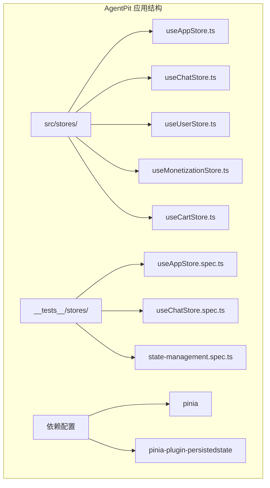
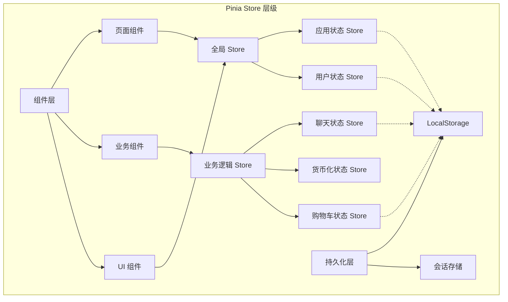
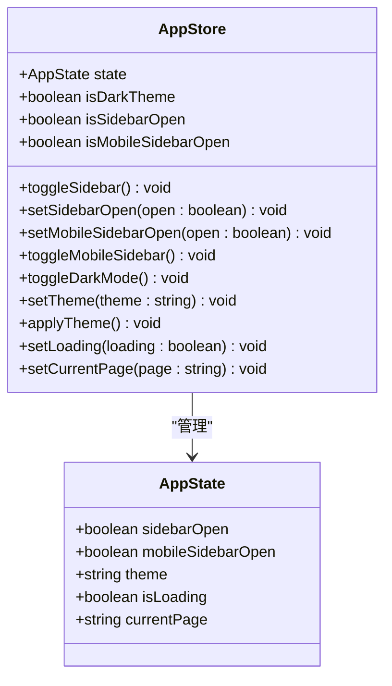
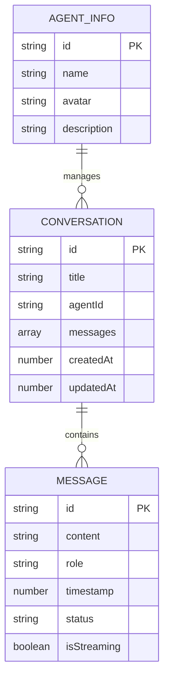
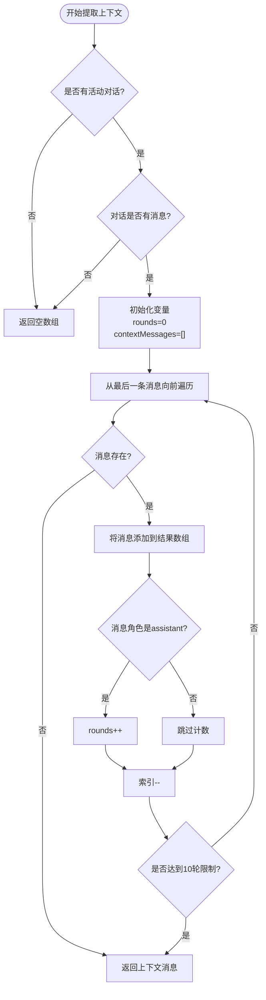
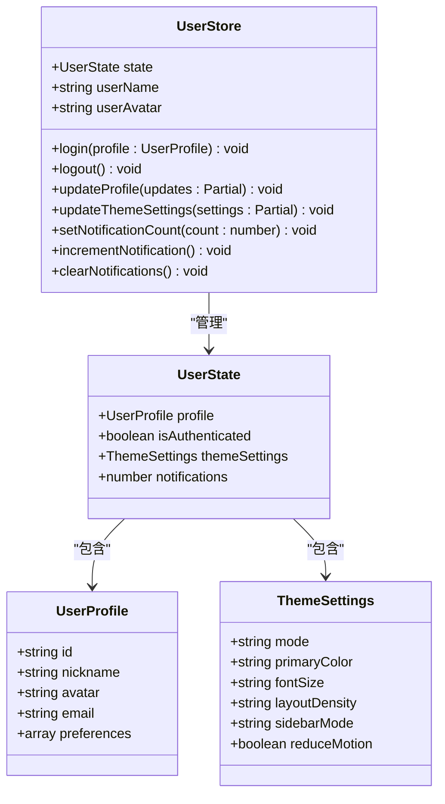
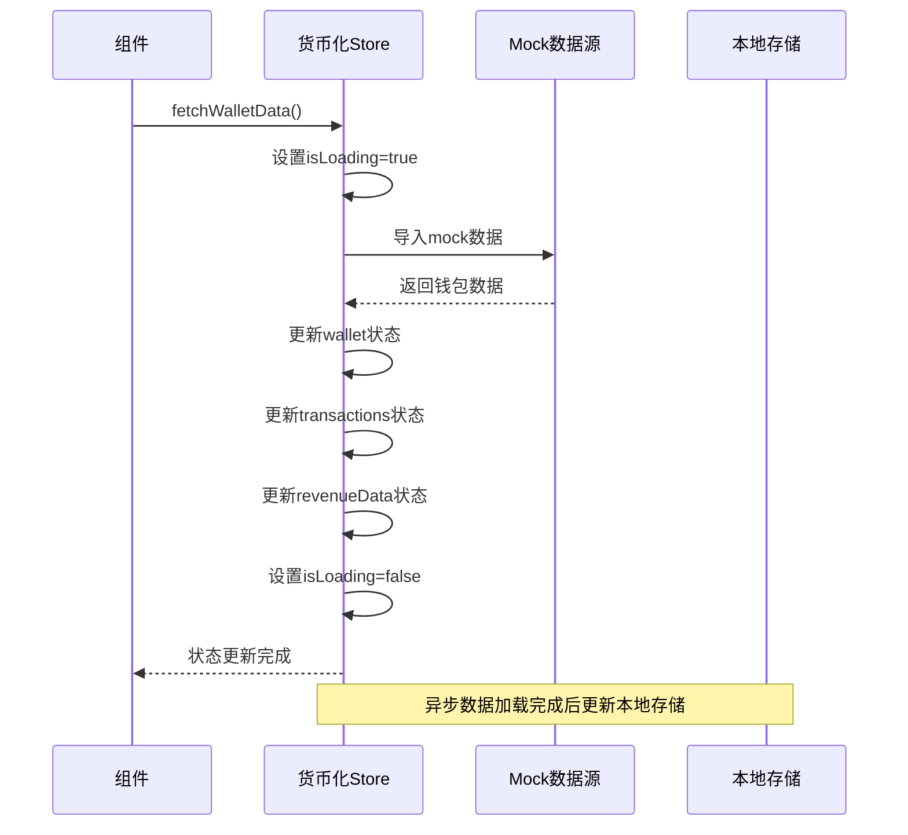
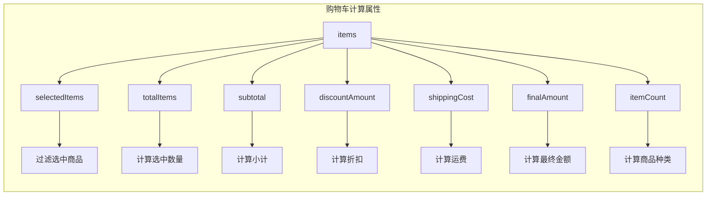

# Vue.js Pinia状态管理

<cite>
**本文档引用的文件**
- [useAppStore.ts](file://apps/AgentPit/src/stores/useAppStore.ts)
- [useChatStore.ts](file://apps/AgentPit/src/stores/useChatStore.ts)
- [useUserStore.ts](file://apps/AgentPit/src/stores/useUserStore.ts)
- [useMonetizationStore.ts](file://apps/AgentPit/src/stores/useMonetizationStore.ts)
- [useCartStore.ts](file://apps/AgentPit/src/stores/useCartStore.ts)
- [package.json](file://apps/AgentPit/package.json)
- [useAppStore.spec.ts](file://apps/AgentPit/src/__tests__/stores/useAppStore.spec.ts)
- [useChatStore.spec.ts](file://apps/AgentPit/src/__tests__/stores/useChatStore.spec.ts)
- [state-management.spec.ts](file://apps/AgentPit/src/__tests__/integration/state-management.spec.ts)
- [api-changelog.md](file://.trae/docs/api-changelog.md)
</cite>

## 目录
1. [简介](#简介)
2. [项目结构](#项目结构)
3. [核心组件](#核心组件)
4. [架构概览](#架构概览)
5. [详细组件分析](#详细组件分析)
6. [依赖关系分析](#依赖关系分析)
7. [性能考虑](#性能考虑)
8. [故障排除指南](#故障排除指南)
9. [结论](#结论)

## 简介

本文件为AgentPit项目中的Vue.js Pinia状态管理系统提供全面的技术文档。AgentPit是一个基于Vue 3和TypeScript构建的应用程序，采用Pinia作为其状态管理解决方案。该系统实现了多个专门的状态存储模块，包括全局应用状态、聊天状态、用户状态、货币化状态和购物车状态。

Pinia在AgentPit项目中的使用体现了现代Vue.js应用的最佳实践，通过类型安全的store定义、清晰的状态分离和高效的组件集成，为复杂的多页面应用提供了可靠的状态管理基础。

## 项目结构

AgentPit项目采用模块化的store组织方式，每个功能域都有独立的store文件，确保了良好的代码分离和可维护性。



**图表来源**
- [useAppStore.ts:1-86](file://apps/AgentPit/src/stores/useAppStore.ts#L1-L86)
- [useChatStore.ts:1-175](file://apps/AgentPit/src/stores/useChatStore.ts#L1-L175)
- [useUserStore.ts:1-72](file://apps/AgentPit/src/stores/useUserStore.ts#L1-L72)

**章节来源**
- [package.json:31-32](file://apps/AgentPit/package.json#L31-L32)

## 核心组件

AgentPit项目实现了五个主要的Pinia store，每个都针对特定的功能域进行了优化：

### 全局应用状态管理 (useAppStore)
负责管理应用程序的整体状态，包括UI状态、主题设置和页面导航。

### 聊天状态管理 (useChatStore)  
处理对话和消息的完整生命周期，支持实时消息流和历史记录管理。

### 用户状态管理 (useUserStore)
管理用户认证状态、个人资料和主题偏好设置。

### 货币化状态管理 (useMonetizationStore)
处理钱包数据、交易记录和收入统计等财务相关状态。

### 购物车状态管理 (useCartStore)
管理电商购物车功能，包括商品选择、数量管理和价格计算。

**章节来源**
- [useAppStore.ts:11-18](file://apps/AgentPit/src/stores/useAppStore.ts#L11-L18)
- [useChatStore.ts:12-19](file://apps/AgentPit/src/stores/useChatStore.ts#L12-L19)
- [useUserStore.ts:11-24](file://apps/AgentPit/src/stores/useUserStore.ts#L11-L24)
- [useMonetizationStore.ts:11-22](file://apps/AgentPit/src/stores/useMonetizationStore.ts#L11-L22)
- [useCartStore.ts:6-6](file://apps/AgentPit/src/stores/useCartStore.ts#L6-L6)

## 架构概览

AgentPit的Pinia架构采用了分层设计，确保了状态管理的清晰性和可扩展性。



**图表来源**
- [useAppStore.ts:80-84](file://apps/AgentPit/src/stores/useAppStore.ts#L80-L84)
- [useUserStore.ts:66-70](file://apps/AgentPit/src/stores/useUserStore.ts#L66-L70)
- [useChatStore.ts:156-161](file://apps/AgentPit/src/stores/useChatStore.ts#L156-L161)

## 详细组件分析

### useAppStore - 全局应用状态管理

useAppStore是AgentPit的核心状态管理器，负责应用程序的全局状态控制。

#### 状态定义


**图表来源**
- [useAppStore.ts:3-9](file://apps/AgentPit/src/stores/useAppStore.ts#L3-L9)
- [useAppStore.ts:20-78](file://apps/AgentPit/src/stores/useAppStore.ts#L20-L78)

#### 主要功能特性

1. **响应式UI状态管理**：管理桌面和移动端的侧边栏状态
2. **主题系统**：支持明暗主题切换和系统主题检测
3. **页面导航状态**：跟踪当前页面路由状态
4. **加载状态管理**：统一的加载指示器状态

#### 状态持久化策略
- 使用LocalStorage持久化sidebarOpen和theme状态
- 支持跨会话的主题偏好保持

**章节来源**
- [useAppStore.ts:11-85](file://apps/AgentPit/src/stores/useAppStore.ts#L11-L85)

### useChatStore - 聊天状态管理

useChatStore实现了完整的聊天功能状态管理，支持多对话和消息流处理。

#### 数据模型设计


**图表来源**
- [useChatStore.ts:4-10](file://apps/AgentPit/src/stores/useChatStore.ts#L4-L10)
- [useChatStore.ts:21-62](file://apps/AgentPit/src/stores/useChatStore.ts#L21-L62)

#### 核心功能实现

1. **多对话管理**：支持同时管理多个聊天对话
2. **消息流处理**：处理实时消息流和状态更新
3. **上下文提取**：智能提取最近的对话上下文
4. **本地持久化**：自动保存对话历史到LocalStorage

#### 复杂算法实现
聊天状态管理包含一个复杂的上下文提取算法，用于获取最近的对话轮次：



**图表来源**
- [useChatStore.ts:33-55](file://apps/AgentPit/src/stores/useChatStore.ts#L33-L55)

**章节来源**
- [useChatStore.ts:12-175](file://apps/AgentPit/src/stores/useChatStore.ts#L12-L175)

### useUserStore - 用户状态管理

useUserStore专注于用户相关的状态管理，包括认证状态和个人资料。

#### 状态结构


**图表来源**
- [useUserStore.ts:4-9](file://apps/AgentPit/src/stores/useUserStore.ts#L4-L9)
- [useUserStore.ts:26-64](file://apps/AgentPit/src/stores/useUserStore.ts#L26-L64)

#### 功能特性

1. **认证状态管理**：完整的登录/登出流程
2. **个人资料管理**：支持动态更新用户信息
3. **主题偏好**：细粒度的主题设置选项
4. **通知系统**：用户通知计数管理

**章节来源**
- [useUserStore.ts:11-72](file://apps/AgentPit/src/stores/useUserStore.ts#L11-L72)

### useMonetizationStore - 货币化状态管理

useMonetizationStore处理与财务相关的状态，包括钱包数据和交易记录。

#### 状态管理


**图表来源**
- [useMonetizationStore.ts:56-70](file://apps/AgentPit/src/stores/useMonetizationStore.ts#L56-L70)

**章节来源**
- [useMonetizationStore.ts:11-81](file://apps/AgentPit/src/stores/useMonetizationStore.ts#L11-L81)

### useCartStore - 购物车状态管理

useCartStore采用组合式API风格，提供了完整的购物车功能实现。

#### 计算属性设计


**图表来源**
- [useCartStore.ts:36-62](file://apps/AgentPit/src/stores/useCartStore.ts#L36-L62)

#### 核心操作方法
- 商品添加和移除
- 数量更新和库存检查
- 选择状态切换
- 清空购物车功能

**章节来源**
- [useCartStore.ts:6-136](file://apps/AgentPit/src/stores/useCartStore.ts#L6-L136)

## 依赖关系分析

AgentPit项目中的Pinia依赖关系体现了清晰的模块化设计。

```mermaid
graph TB
subgraph "核心依赖"
A[pinia ^3.0.2] --> B[状态管理核心]
C[pinia-plugin-persistedstate ^4.4.0] --> D[状态持久化]
end
subgraph "应用依赖"
E[vue ^3.5.32] --> F[组件框架]
G[vue-router ^4.5.0] --> H[路由管理]
I[lodash-es ^4.18.1] --> J[工具函数]
K[dayjs ^1.11.20] --> L[日期处理]
end
subgraph "测试依赖"
M[vitest ^2.1.8] --> N[单元测试]
O[@vue/test-utils ^2.4.6] --> P[组件测试]
end
subgraph "开发工具"
Q[vite ^8.0.4] --> R[构建工具]
S[typescript ^6.0.2] --> T[类型检查]
end
A --> E
C --> A
D --> A
```

**图表来源**
- [package.json:31-39](file://apps/AgentPit/package.json#L31-L39)

**章节来源**
- [package.json:20-40](file://apps/AgentPit/package.json#L20-L40)

## 性能考虑

### 状态更新优化

1. **局部状态更新**：Pinia的响应式系统只更新受影响的组件
2. **计算属性缓存**：Vue的computed属性提供自动缓存机制
3. **懒加载策略**：使用动态导入加载大型数据集

### 内存管理

1. **及时清理**：组件卸载时自动清理订阅
2. **状态压缩**：避免存储不必要的大对象
3. **垃圾回收**：合理管理临时数据引用

### 缓存策略

1. **本地存储缓存**：使用LocalStorage减少重复请求
2. **组件缓存**：利用Vue的缓存机制
3. **网络缓存**：合理的API调用频率控制

## 故障排除指南

### 常见问题诊断

#### 状态不更新问题
- 检查store实例是否正确初始化
- 验证组件中store的引用是否正确
- 确认状态更新方法的调用时机

#### 类型错误排查
- 确保TypeScript类型定义的准确性
- 检查接口定义的一致性
- 验证泛型参数的正确使用

#### 性能问题定位
- 使用Vue DevTools监控状态变化
- 分析组件渲染次数
- 检查计算属性的重新计算频率

**章节来源**
- [useAppStore.spec.ts:1-51](file://apps/AgentPit/src/__tests__/stores/useAppStore.spec.ts#L1-L51)
- [useChatStore.spec.ts:1-46](file://apps/AgentPit/src/__tests__/stores/useChatStore.spec.ts#L1-L46)
- [state-management.spec.ts:1-34](file://apps/AgentPit/src/__tests__/integration/state-management.spec.ts#L1-L34)

## 结论

AgentPit项目中的Pinia状态管理系统展现了现代Vue.js应用的最佳实践。通过精心设计的store架构、清晰的状态分离和完善的测试覆盖，该系统为复杂的应用程序提供了可靠的状态管理基础。

### 主要优势

1. **模块化设计**：每个store专注于特定功能域，提高了代码的可维护性
2. **类型安全**：完整的TypeScript支持确保了编译时的类型检查
3. **性能优化**：合理的状态更新策略和缓存机制保证了应用性能
4. **测试友好**：完善的单元测试和集成测试覆盖了核心功能

### 技术亮点

- **灵活的store定义**：同时支持Options API和组合式API风格
- **智能持久化**：针对不同store的特点实现定制化的持久化策略
- **响应式更新**：利用Vue 3的响应式系统实现高效的状态更新
- **异步处理**：完善的异步操作处理机制

该状态管理系统为AgentPit项目提供了坚实的技术基础，为未来的功能扩展和性能优化奠定了良好基础。