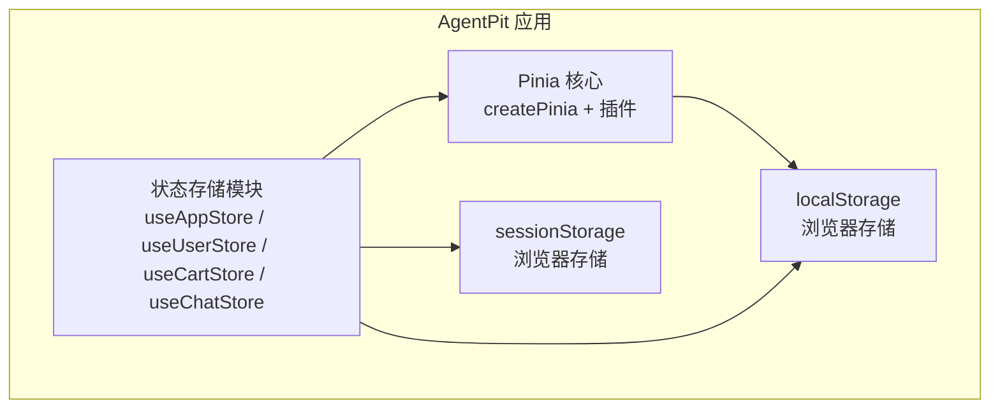
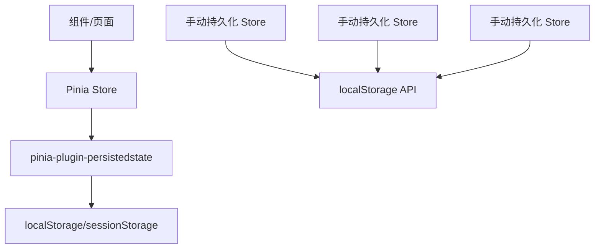
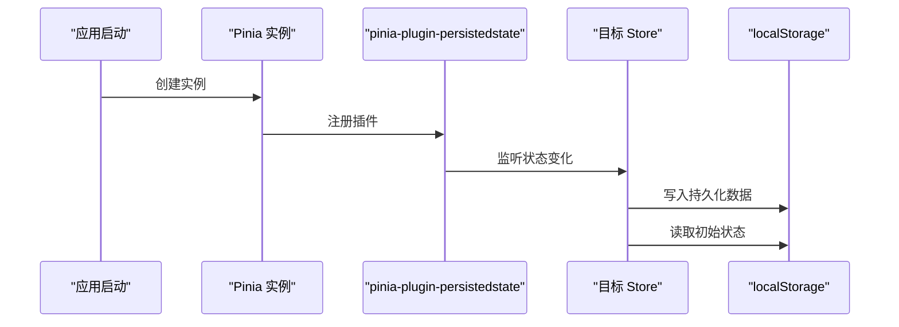
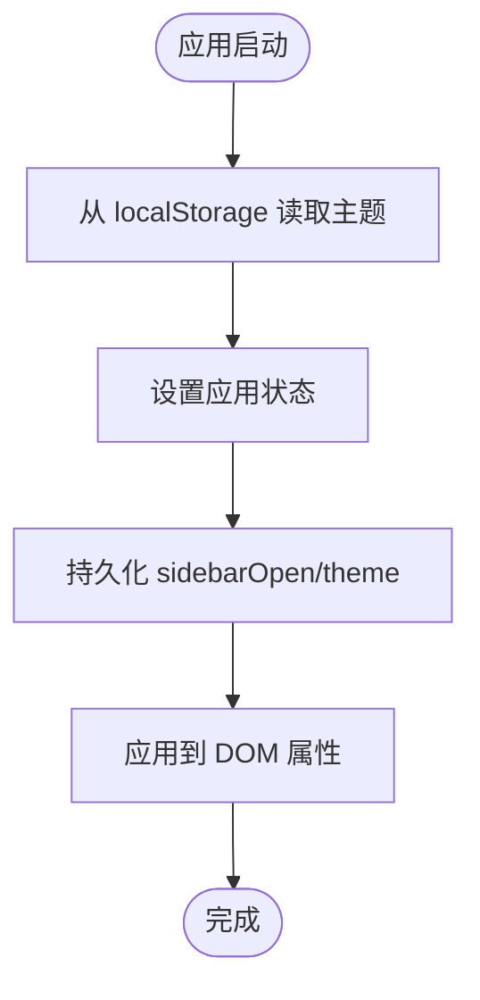
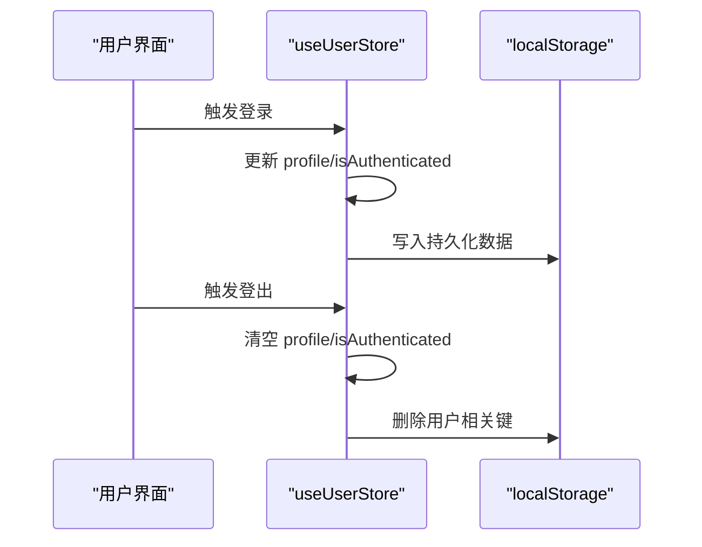
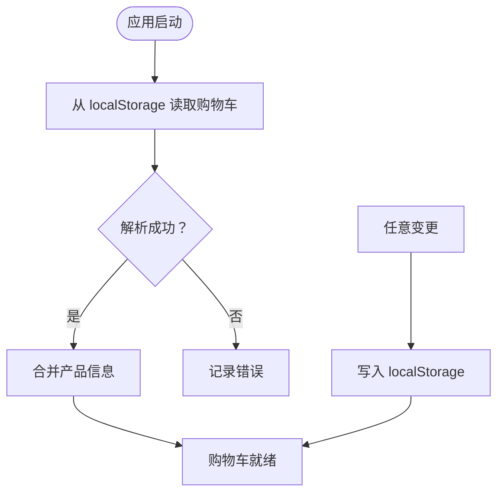
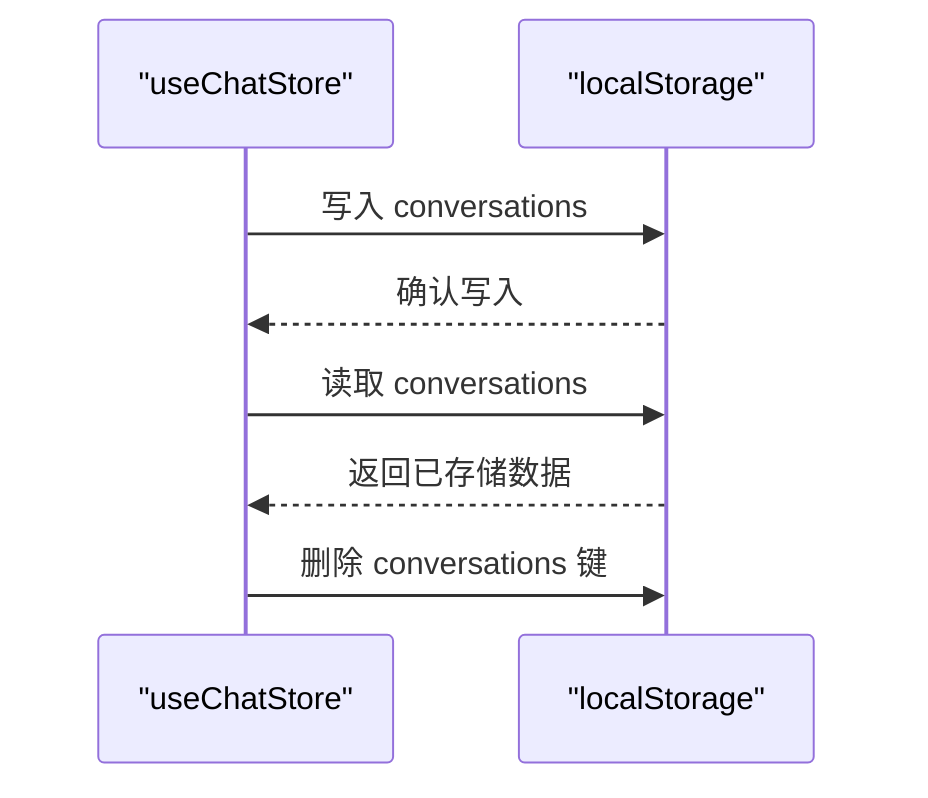
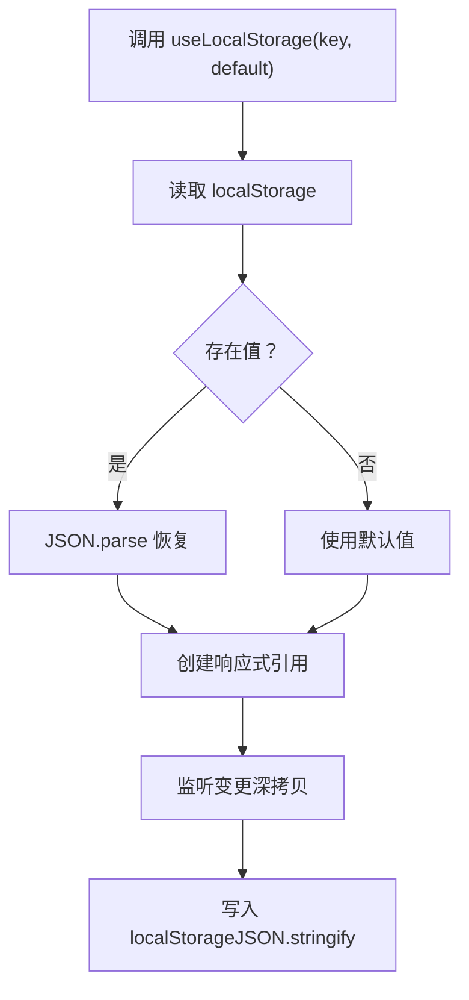
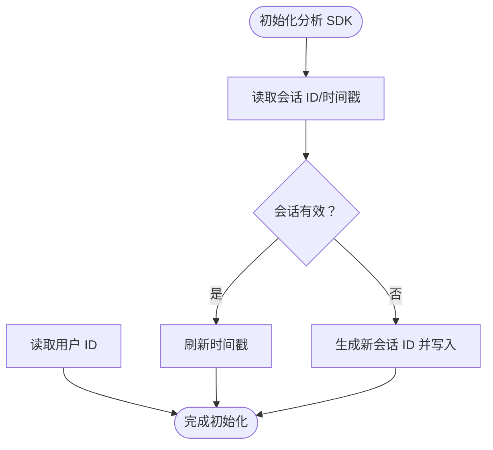
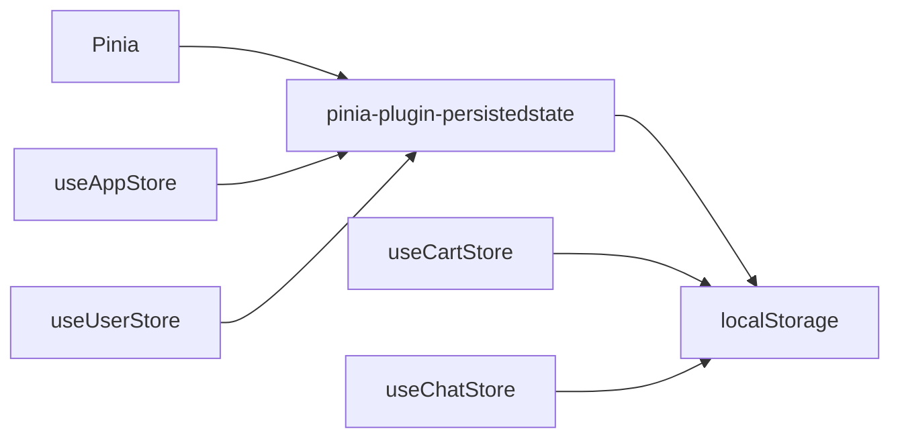

# 数据持久化策略

<cite>
**本文档引用的文件**
- [pinia 持久化插件配置](file://apps/AgentPit/src/stores/index.ts)
- [应用状态存储 useAppStore](file://apps/AgentPit/src/stores/useAppStore.ts)
- [用户状态存储 useUserStore](file://apps/AgentPit/src/stores/useUserStore.ts)
- [购物车状态存储 useCartStore](file://apps/AgentPit/src/stores/useCartStore.ts)
- [聊天记录存储 useChatStore](file://apps/AgentPit/src/stores/useChatStore.ts)
- [本地存储组合式函数 useLocalStorage](file://apps/AgentPit/packages/ui/src/composables/useLocalStorage.ts)
- [FlexLoop 分析 SDK 会话管理](file://tools/flexloop/src/taolib/testing/analytics/sdk/analytics.js)
</cite>

## 目录
1. [引言](#引言)
2. [项目结构](#项目结构)
3. [核心组件](#核心组件)
4. [架构概览](#架构概览)
5. [详细组件分析](#详细组件分析)
6. [依赖关系分析](#依赖关系分析)
7. [性能考量](#性能考量)
8. [故障排除指南](#故障排除指南)
9. [结论](#结论)

## 引言
本文件系统性阐述该代码库中的数据持久化策略，重点覆盖以下方面：
- 状态持久化实现：localStorage、sessionStorage 的使用边界与场景
- Pinia 持久化插件的配置与使用：插件启用、键名、存储介质、字段选择
- 自定义持久化逻辑：手动序列化/反序列化、错误处理与数据恢复
- 数据迁移策略：版本演进、兼容性处理、数据清理
- 存储容量管理：容量监控、清理策略、增量/全量备份
- 安全与性能最佳实践：敏感数据保护、批量写入优化、异常降级

## 项目结构
该仓库采用多应用架构，数据持久化主要集中在 AgentPit 应用中，通过 Pinia 管理全局状态，并结合浏览器存储 API 实现跨页面状态保持。

**图表来源**
- [pinia 持久化插件配置:1-15](file://apps/AgentPit/src/stores/index.ts#L1-L15)
- [应用状态存储 useAppStore:1-86](file://apps/AgentPit/src/stores/useAppStore.ts#L1-L86)
- [用户状态存储 useUserStore:1-72](file://apps/AgentPit/src/stores/useUserStore.ts#L1-L72)
- [购物车状态存储 useCartStore:1-136](file://apps/AgentPit/src/stores/useCartStore.ts#L1-L136)
- [聊天记录存储 useChatStore:1-175](file://apps/AgentPit/src/stores/useChatStore.ts#L1-L175)

**章节来源**
- [pinia 持久化插件配置:1-15](file://apps/AgentPit/src/stores/index.ts#L1-L15)

## 核心组件
- Pinia 持久化插件：在应用初始化时注册，为支持持久化的 Store 提供统一的序列化/反序列化能力。
- 应用状态存储 useAppStore：演示了 Pinia 持久化插件的典型配置与手动 localStorage 写入的混合使用。
- 用户状态存储 useUserStore：展示了部分字段持久化与登录态清理的协同。
- 购物车状态存储 useCartStore：纯手动 localStorage 持久化，包含加载/保存流程与错误处理。
- 聊天记录存储 useChatStore：手动持久化对话数据，提供加载/保存与清理接口。
- 本地存储组合式函数 useLocalStorage：通用的响应式本地存储封装，适用于小规模数据。

**章节来源**
- [pinia 持久化插件配置:1-15](file://apps/AgentPit/src/stores/index.ts#L1-L15)
- [应用状态存储 useAppStore:1-86](file://apps/AgentPit/src/stores/useAppStore.ts#L1-L86)
- [用户状态存储 useUserStore:1-72](file://apps/AgentPit/src/stores/useUserStore.ts#L1-L72)
- [购物车状态存储 useCartStore:1-136](file://apps/AgentPit/src/stores/useCartStore.ts#L1-L136)
- [聊天记录存储 useChatStore:1-175](file://apps/AgentPit/src/stores/useChatStore.ts#L1-L175)
- [本地存储组合式函数 useLocalStorage:1-15](file://apps/AgentPit/packages/ui/src/composables/useLocalStorage.ts#L1-L15)

## 架构概览
整体持久化架构由“状态层 + 插件层 + 存储层”构成。Pinia 持久化插件负责自动化的序列化/反序列化；对于需要精细控制的场景，直接使用浏览器存储 API 进行定制化持久化。

**图表来源**
- [pinia 持久化插件配置:1-15](file://apps/AgentPit/src/stores/index.ts#L1-L15)
- [应用状态存储 useAppStore:80-84](file://apps/AgentPit/src/stores/useAppStore.ts#L80-L84)
- [用户状态存储 useUserStore:66-70](file://apps/AgentPit/src/stores/useUserStore.ts#L66-L70)
- [购物车状态存储 useCartStore:133-135](file://apps/AgentPit/src/stores/useCartStore.ts#L133-L135)
- [聊天记录存储 useChatStore:156-172](file://apps/AgentPit/src/stores/useChatStore.ts#L156-L172)

## 详细组件分析

### Pinia 持久化插件配置与使用
- 插件注册：在创建 Pinia 实例后调用插件，使后续 Store 支持持久化。
- 配置项：
  - key：持久化键名前缀，用于区分不同 Store 的数据命名空间。
  - storage：指定存储介质（localStorage 或 sessionStorage）。
  - pick：仅持久化指定字段，避免冗余数据写入。
- 使用示例：
  - useAppStore：持久化 sidebarOpen、theme 字段。
  - useUserStore：持久化 themeSettings 字段。
  - useCartStore：启用持久化开关，未显式指定 storage 时默认使用 localStorage。

**图表来源**
- [pinia 持久化插件配置:1-15](file://apps/AgentPit/src/stores/index.ts#L1-L15)
- [应用状态存储 useAppStore:80-84](file://apps/AgentPit/src/stores/useAppStore.ts#L80-L84)
- [用户状态存储 useUserStore:66-70](file://apps/AgentPit/src/stores/useUserStore.ts#L66-L70)
- [购物车状态存储 useCartStore:133-135](file://apps/AgentPit/src/stores/useCartStore.ts#L133-L135)

**章节来源**
- [pinia 持久化插件配置:1-15](file://apps/AgentPit/src/stores/index.ts#L1-L15)
- [应用状态存储 useAppStore:80-84](file://apps/AgentPit/src/stores/useAppStore.ts#L80-L84)
- [用户状态存储 useUserStore:66-70](file://apps/AgentPit/src/stores/useUserStore.ts#L66-L70)
- [购物车状态存储 useCartStore:133-135](file://apps/AgentPit/src/stores/useCartStore.ts#L133-L135)

### 应用状态存储 useAppStore（主题与侧边栏）
- 初始化：从 localStorage 读取主题设置，若不存在则使用默认值。
- 主题切换：更新状态后立即写入 localStorage，并应用到 DOM 属性。
- 持久化字段：sidebarOpen、theme。
- 恢复机制：应用启动时根据 localStorage 值恢复 UI 状态。

**图表来源**
- [应用状态存储 useAppStore:12-18](file://apps/AgentPit/src/stores/useAppStore.ts#L12-L18)
- [应用状态存储 useAppStore:54-69](file://apps/AgentPit/src/stores/useAppStore.ts#L54-L69)
- [应用状态存储 useAppStore:80-84](file://apps/AgentPit/src/stores/useAppStore.ts#L80-L84)

**章节来源**
- [应用状态存储 useAppStore:1-86](file://apps/AgentPit/src/stores/useAppStore.ts#L1-L86)

### 用户状态存储 useUserStore（主题设置与登录态）
- 登录/登出：登录时更新状态；登出时清理相关 localStorage 键。
- 持久化字段：themeSettings。
- 恢复机制：应用启动时根据持久化数据恢复用户偏好。

**图表来源**
- [用户状态存储 useUserStore:31-41](file://apps/AgentPit/src/stores/useUserStore.ts#L31-L41)
- [用户状态存储 useUserStore:66-70](file://apps/AgentPit/src/stores/useUserStore.ts#L66-L70)

**章节来源**
- [用户状态存储 useUserStore:1-72](file://apps/AgentPit/src/stores/useUserStore.ts#L1-L72)

### 购物车状态存储 useCartStore（手动持久化）
- 加载：应用启动时从 localStorage 读取购物车数据，解析并合并产品信息。
- 保存：每次购物车变更后写入 localStorage。
- 错误处理：try/catch 包裹，捕获解析/写入异常并记录日志。
- 持久化开关：启用持久化，未指定 storage 则默认使用 localStorage。

**图表来源**
- [购物车状态存储 useCartStore:9-34](file://apps/AgentPit/src/stores/useCartStore.ts#L9-L34)
- [购物车状态存储 useCartStore:133-135](file://apps/AgentPit/src/stores/useCartStore.ts#L133-L135)

**章节来源**
- [购物车状态存储 useCartStore:1-136](file://apps/AgentPit/src/stores/useCartStore.ts#L1-L136)

### 聊天记录存储 useChatStore（手动持久化）
- 持久化方法：提供 persistConversations/loadConversations 接口，基于 localStorage 实现。
- 数据结构：对话数组，包含消息列表、时间戳等。
- 清理策略：清空时删除对应 localStorage 键。
- 恢复机制：应用启动时调用 loadConversations 恢复数据。

**图表来源**
- [聊天记录存储 useChatStore:156-172](file://apps/AgentPit/src/stores/useChatStore.ts#L156-L172)

**章节来源**
- [聊天记录存储 useChatStore:1-175](file://apps/AgentPit/src/stores/useChatStore.ts#L1-L175)

### 本地存储组合式函数 useLocalStorage（通用封装）
- 功能：提供响应式本地存储，自动处理序列化/反序列化与深度监听。
- 适用场景：小型配置或临时状态的跨组件共享与持久化。
- 注意事项：大对象频繁写入可能影响性能，建议配合节流/批量更新。

**图表来源**
- [本地存储组合式函数 useLocalStorage:1-15](file://apps/AgentPit/packages/ui/src/composables/useLocalStorage.ts#L1-L15)

**章节来源**
- [本地存储组合式函数 useLocalStorage:1-15](file://apps/AgentPit/packages/ui/src/composables/useLocalStorage.ts#L1-L15)

### FlexLoop 分析 SDK 会话管理（localStorage 使用示例）
- 会话标识：通过 localStorage 存储会话 ID 与时间戳，实现会话超时控制。
- 用户标识：从 localStorage 读取用户 ID。
- 异常处理：对 localStorage 访问异常进行降级处理，保证功能可用性。

**图表来源**
- [FlexLoop 分析 SDK 会话管理:84-111](file://tools/flexloop/src/taolib/testing/analytics/sdk/analytics.js#L84-L111)

**章节来源**
- [FlexLoop 分析 SDK 会话管理:84-127](file://tools/flexloop/src/taolib/testing/analytics/sdk/analytics.js#L84-L127)

## 依赖关系分析
- 组件耦合：
  - Store 依赖 Pinia 插件或直接依赖浏览器存储 API。
  - 插件层与存储层解耦，便于替换存储介质或扩展字段选择。
- 外部依赖：
  - pinia-plugin-persistedstate：提供自动持久化能力。
  - 浏览器存储 API：localStorage/sessionStorage。
- 潜在风险：
  - localStorage 写入失败或容量不足导致持久化失败。
  - 大对象频繁序列化/反序列化影响性能。
  - 缺少版本迁移策略可能导致旧数据格式不兼容。

**图表来源**
- [pinia 持久化插件配置:1-15](file://apps/AgentPit/src/stores/index.ts#L1-L15)
- [应用状态存储 useAppStore:80-84](file://apps/AgentPit/src/stores/useAppStore.ts#L80-L84)
- [用户状态存储 useUserStore:66-70](file://apps/AgentPit/src/stores/useUserStore.ts#L66-L70)
- [购物车状态存储 useCartStore:133-135](file://apps/AgentPit/src/stores/useCartStore.ts#L133-L135)
- [聊天记录存储 useChatStore:156-172](file://apps/AgentPit/src/stores/useChatStore.ts#L156-L172)

**章节来源**
- [pinia 持久化插件配置:1-15](file://apps/AgentPit/src/stores/index.ts#L1-L15)
- [应用状态存储 useAppStore:1-86](file://apps/AgentPit/src/stores/useAppStore.ts#L1-L86)
- [用户状态存储 useUserStore:1-72](file://apps/AgentPit/src/stores/useUserStore.ts#L1-L72)
- [购物车状态存储 useCartStore:1-136](file://apps/AgentPit/src/stores/useCartStore.ts#L1-L136)
- [聊天记录存储 useChatStore:1-175](file://apps/AgentPit/src/stores/useChatStore.ts#L1-L175)

## 性能考量
- 写入频率控制：对高频变更的状态采用批量写入或节流策略，减少 localStorage 写入次数。
- 数据大小优化：避免在持久化字段中存储大型二进制数据或冗余信息，优先存储必要字段。
- 序列化成本：大对象的 JSON 序列化/反序列化开销较高，建议拆分存储或延迟加载。
- 插件与手动持久化的权衡：Pinia 插件适合简单场景，复杂业务建议手动持久化以获得更细粒度控制。
- 会话与统计埋点：参考分析 SDK 的会话管理，避免频繁读写 localStorage，降低主线程阻塞风险。

[本节为通用指导，无需特定文件来源]

## 故障排除指南
- 持久化失败：
  - 检查浏览器存储权限与容量限制。
  - 确认序列化/反序列化过程是否抛出异常。
- 数据不一致：
  - 核对插件配置的 pick 字段是否覆盖所需状态。
  - 手动持久化场景下，确保 load/save 调用时机正确。
- 登录态异常：
  - 登出时需清理相关 localStorage 键，避免下次登录出现脏数据。
- 会话丢失：
  - 检查会话超时阈值与时间戳刷新逻辑，确保在异常情况下有降级处理。

**章节来源**
- [用户状态存储 useUserStore:37-41](file://apps/AgentPit/src/stores/useUserStore.ts#L37-L41)
- [FlexLoop 分析 SDK 会话管理:84-111](file://tools/flexloop/src/taolib/testing/analytics/sdk/analytics.js#L84-L111)

## 结论
该代码库的数据持久化策略以 Pinia 持久化插件为核心，结合手动 localStorage 实现精细化控制。通过明确的配置项（key、storage、pick）与完善的加载/保存流程，实现了跨页面的状态恢复与用户体验一致性。建议在实际项目中进一步完善版本迁移、容量监控与安全防护机制，以应对更复杂的业务场景。