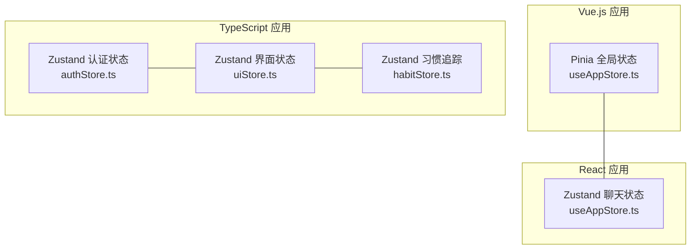
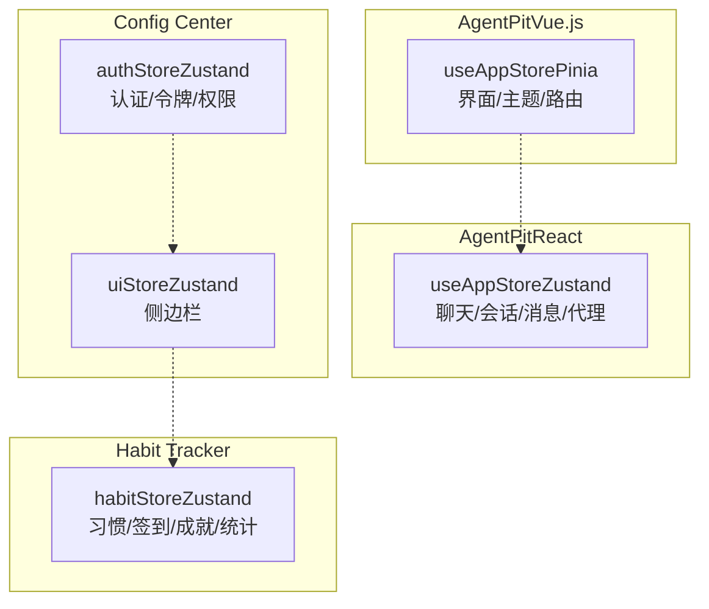
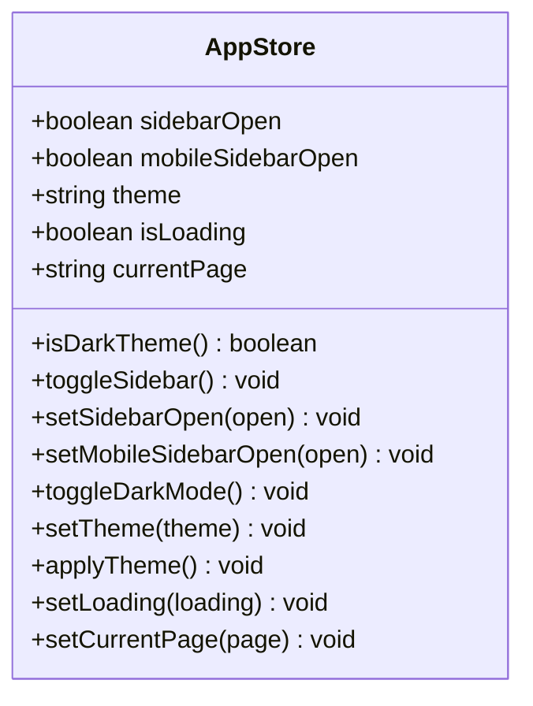
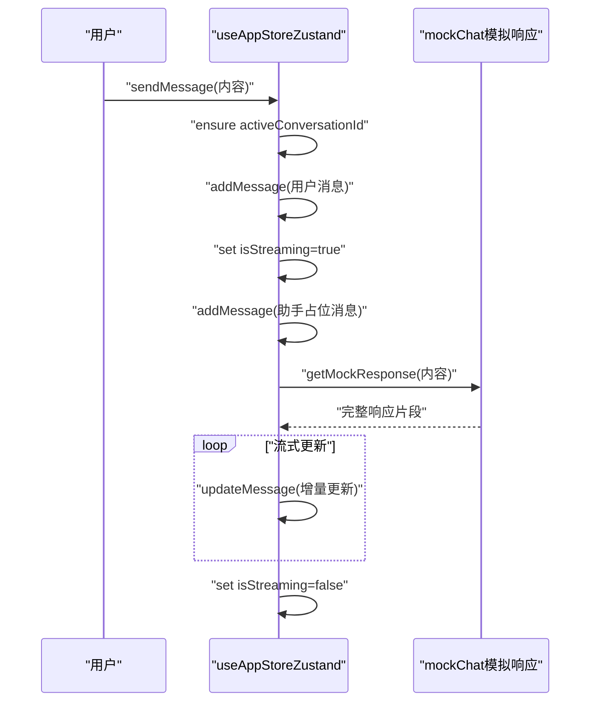
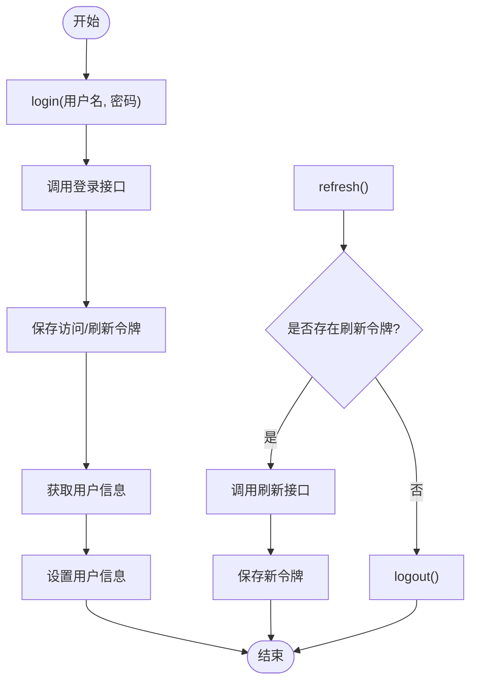
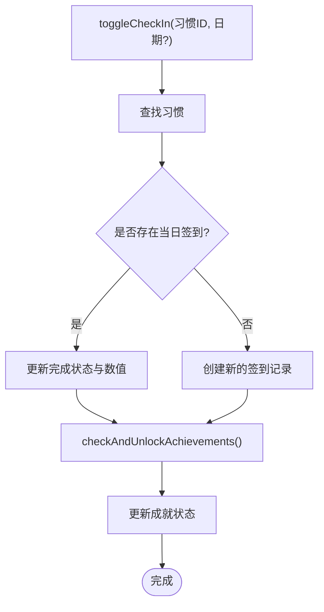
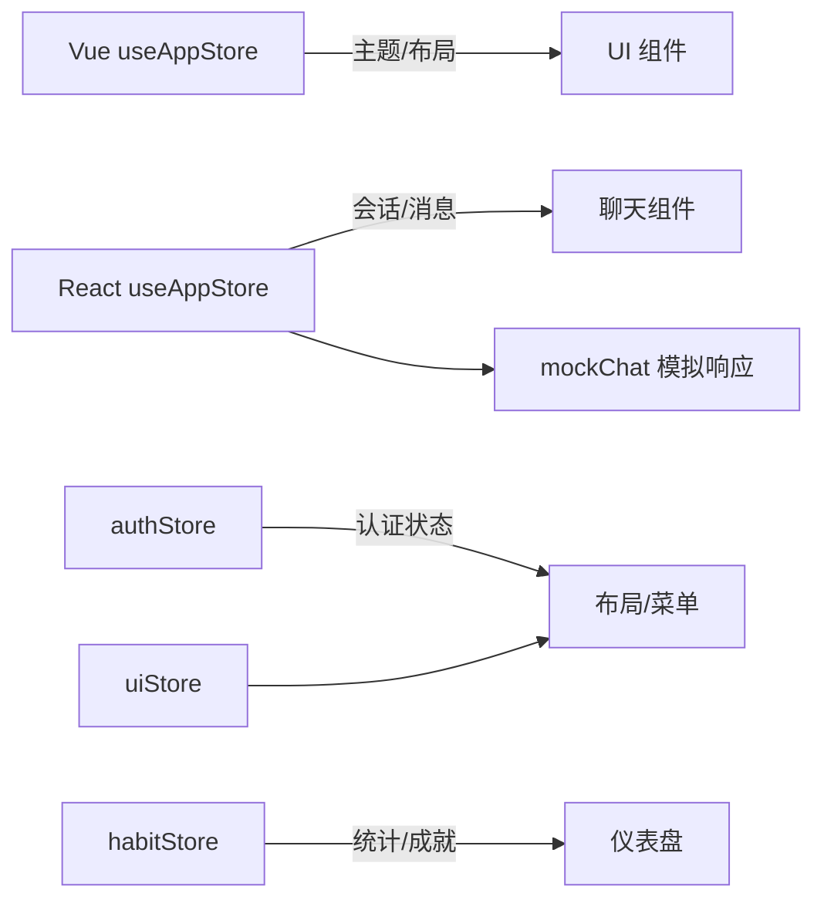

# 状态管理与数据流

<cite>
**本文引用的文件**
- [apps/AgentPit/src/stores/useAppStore.ts](file://apps/AgentPit/src/stores/useAppStore.ts)
- [apps/AgentPit/src-react-backup-20260410/store/useAppStore.ts](file://apps/AgentPit/src-react-backup-20260410/store/useAppStore.ts)
- [apps/AgentPit/src/data/mockChat.ts](file://apps/AgentPit/src/data/mockChat.ts)
- [apps/config-center/src/store/authStore.ts](file://apps/config-center/src/store/authStore.ts)
- [apps/config-center/src/store/uiStore.ts](file://apps/config-center/src/store/uiStore.ts)
- [apps/habit-tracker/src/store/habitStore.ts](file://apps/habit-tracker/src/store/habitStore.ts)
</cite>

## 目录
1. [简介](#简介)
2. [项目结构](#项目结构)
3. [核心组件](#核心组件)
4. [架构总览](#架构总览)
5. [组件详解](#组件详解)
6. [依赖关系分析](#依赖关系分析)
7. [性能考量](#性能考量)
8. [故障排查指南](#故障排查指南)
9. [结论](#结论)
10. [附录](#附录)

## 简介
本文件系统性梳理本仓库中多应用的状态管理与数据流实现，重点覆盖：
- Vue.js 应用中基于 Pinia 的全局状态 useAppStore
- React 应用中基于 Zustand 的聊天与全局状态 useAppStore
- TypeScript 应用中基于 Zustand 的认证状态 authStore 与界面状态 uiStore
- TypeScript 应用中基于 Zustand 的习惯追踪状态 habitStore
- 跨组件状态同步机制、状态持久化策略、异步状态处理与调试建议

目标是帮助开发者快速理解各 store 的职责边界、数据流向、持久化策略与最佳实践。

## 项目结构
本仓库包含多个前端应用，分别采用不同的状态管理方案：
- Vue.js 应用（AgentPit）：使用 Pinia 管理全局界面状态与聊天状态
- React 应用（AgentPit 历史备份）：使用 Zustand 管理聊天与界面状态
- TypeScript 应用（config-center）：使用 Zustand 管理认证与界面状态
- TypeScript 应用（habit-tracker）：使用 Zustand 管理习惯、签到、成就与统计数据

**图示来源**
- [apps/AgentPit/src/stores/useAppStore.ts:1-86](file://apps/AgentPit/src/stores/useAppStore.ts#L1-L86)
- [apps/AgentPit/src-react-backup-20260410/store/useAppStore.ts:1-190](file://apps/AgentPit/src-react-backup-20260410/store/useAppStore.ts#L1-L190)
- [apps/config-center/src/store/authStore.ts:1-108](file://apps/config-center/src/store/authStore.ts#L1-L108)
- [apps/config-center/src/store/uiStore.ts:1-14](file://apps/config-center/src/store/uiStore.ts#L1-L14)
- [apps/habit-tracker/src/store/habitStore.ts:1-545](file://apps/habit-tracker/src/store/habitStore.ts#L1-L545)

**章节来源**
- [apps/AgentPit/src/stores/useAppStore.ts:1-86](file://apps/AgentPit/src/stores/useAppStore.ts#L1-L86)
- [apps/AgentPit/src-react-backup-20260410/store/useAppStore.ts:1-190](file://apps/AgentPit/src-react-backup-20260410/store/useAppStore.ts#L1-L190)
- [apps/config-center/src/store/authStore.ts:1-108](file://apps/config-center/src/store/authStore.ts#L1-L108)
- [apps/config-center/src/store/uiStore.ts:1-14](file://apps/config-center/src/store/uiStore.ts#L1-L14)
- [apps/habit-tracker/src/store/habitStore.ts:1-545](file://apps/habit-tracker/src/store/habitStore.ts#L1-L545)

## 核心组件
- useAppStore（Vue.js，Pinia）
  - 职责：管理侧边栏开关、移动端侧边栏、主题（亮/暗/系统）、页面加载态、当前路由等
  - 特性：支持主题切换与 DOM 属性更新、持久化至 localStorage
- useAppStore（React，Zustand）
  - 职责：管理聊天会话、消息、代理选择、搜索、侧边栏、是否正在流式输出等
  - 特性：本地存储持久化、模拟流式输出、消息标题自动推断
- authStore（TypeScript，Zustand）
  - 职责：登录、登出、刷新令牌、获取用户信息、权限判断（客户端提示）
  - 特性：持久化存储访问令牌与刷新令牌
- uiStore（TypeScript，Zustand）
  - 职责：控制侧边栏开关
- habitStore（TypeScript，Zustand）
  - 职责：习惯 CRUD、签到、连击统计、成就解锁、统计报表、数据导入导出与清理
  - 特性：持久化存储、默认数据初始化、成就规则引擎

**章节来源**
- [apps/AgentPit/src/stores/useAppStore.ts:11-86](file://apps/AgentPit/src/stores/useAppStore.ts#L11-L86)
- [apps/AgentPit/src-react-backup-20260410/store/useAppStore.ts:40-187](file://apps/AgentPit/src-react-backup-20260410/store/useAppStore.ts#L40-L187)
- [apps/config-center/src/store/authStore.ts:20-107](file://apps/config-center/src/store/authStore.ts#L20-L107)
- [apps/config-center/src/store/uiStore.ts:9-13](file://apps/config-center/src/store/uiStore.ts#L9-L13)
- [apps/habit-tracker/src/store/habitStore.ts:190-544](file://apps/habit-tracker/src/store/habitStore.ts#L190-L544)

## 架构总览
下图展示了多应用中状态管理的总体关系与职责划分：

**图示来源**
- [apps/AgentPit/src/stores/useAppStore.ts:11-86](file://apps/AgentPit/src/stores/useAppStore.ts#L11-L86)
- [apps/AgentPit/src-react-backup-20260410/store/useAppStore.ts:40-187](file://apps/AgentPit/src-react-backup-20260410/store/useAppStore.ts#L40-L187)
- [apps/config-center/src/store/authStore.ts:20-107](file://apps/config-center/src/store/authStore.ts#L20-L107)
- [apps/config-center/src/store/uiStore.ts:9-13](file://apps/config-center/src/store/uiStore.ts#L9-L13)
- [apps/habit-tracker/src/store/habitStore.ts:190-544](file://apps/habit-tracker/src/store/habitStore.ts#L190-L544)

## 组件详解

### Vue.js：Pinia 全局状态 useAppStore
- 数据结构与职责
  - 状态字段：侧边栏开关、移动端侧边栏、主题、加载态、当前页面
  - Getter：根据系统/用户偏好判断深色主题
  - Action：切换/设置侧边栏、切换/设置主题（含本地持久化）、应用主题到 DOM、设置加载态、设置当前页面
- 持久化策略
  - 使用持久化中间件，键名固定，存储侧边栏与主题字段
- 适用场景
  - 跨页面共享的界面偏好与导航状态

**图示来源**
- [apps/AgentPit/src/stores/useAppStore.ts:3-78](file://apps/AgentPit/src/stores/useAppStore.ts#L3-L78)

**章节来源**
- [apps/AgentPit/src/stores/useAppStore.ts:11-86](file://apps/AgentPit/src/stores/useAppStore.ts#L11-L86)

### React：Zustand 聊天与全局状态 useAppStore
- 数据结构与职责
  - 扩展自聊天状态接口，包含会话列表、活动会话、是否流式输出、侧边栏、搜索词、活动代理、可用代理列表
  - 行为：创建/删除会话、设置活动会话、添加/更新消息、发送消息（模拟流式）、重新生成回复、设置搜索词、设置活动代理、切换/设置侧边栏
- 持久化策略
  - 本地存储会话、活动会话、活动代理等关键字段
- 流式输出机制
  - 通过定时器逐步更新助手消息内容，模拟服务端流式响应

**图示来源**
- [apps/AgentPit/src-react-backup-20260410/store/useAppStore.ts:116-147](file://apps/AgentPit/src-react-backup-20260410/store/useAppStore.ts#L116-L147)
- [apps/AgentPit/src/data/mockChat.ts:111-142](file://apps/AgentPit/src/data/mockChat.ts#L111-L142)

**章节来源**
- [apps/AgentPit/src-react-backup-20260410/store/useAppStore.ts:40-187](file://apps/AgentPit/src-react-backup-20260410/store/useAppStore.ts#L40-L187)
- [apps/AgentPit/src/data/mockChat.ts:1-143](file://apps/AgentPit/src/data/mockChat.ts#L1-L143)

### TypeScript：Zustand 认证状态 authStore
- 数据结构与职责
  - 用户信息、访问令牌、刷新令牌、认证状态、加载态
  - 行为：登录（调用后端接口，保存令牌，获取用户信息）、登出、刷新令牌、获取用户信息、权限判断（超级管理员直接放行，其余由服务端校验）
- 持久化策略
  - 使用持久化中间件，仅持久化令牌与认证状态，避免敏感信息泄露
- 错误处理
  - 登录失败或刷新失败时清空状态并抛出异常；获取用户失败时触发登出

**图示来源**
- [apps/config-center/src/store/authStore.ts:29-82](file://apps/config-center/src/store/authStore.ts#L29-L82)

**章节来源**
- [apps/config-center/src/store/authStore.ts:20-107](file://apps/config-center/src/store/authStore.ts#L20-L107)

### TypeScript：Zustand 界面状态 uiStore
- 数据结构与职责
  - 侧边栏开关
  - 行为：切换/设置侧边栏
- 适用场景
  - 与认证状态配合，统一控制布局与导航

**章节来源**
- [apps/config-center/src/store/uiStore.ts:9-13](file://apps/config-center/src/store/uiStore.ts#L9-L13)

### TypeScript：Zustand 习惯追踪 habitStore
- 数据结构与职责
  - 习惯集合、签到集合、成就集合、用户档案、用户设置
  - 行为：习惯 CRUD、签到（含带值签到）、连击统计、成就解锁、统计报表、数据导入导出、清理
- 默认数据与样本
  - 初始化默认档案与设置，生成示例习惯与签到数据
- 成就规则引擎
  - 基于当前状态计算是否解锁“连击”“里程碑”“探索者”“完美日”“归来的勇士”等成就

**图示来源**
- [apps/habit-tracker/src/store/habitStore.ts:237-268](file://apps/habit-tracker/src/store/habitStore.ts#L237-L268)
- [apps/habit-tracker/src/store/habitStore.ts:371-450](file://apps/habit-tracker/src/store/habitStore.ts#L371-L450)

**章节来源**
- [apps/habit-tracker/src/store/habitStore.ts:190-544](file://apps/habit-tracker/src/store/habitStore.ts#L190-L544)

## 依赖关系分析
- 组件耦合
  - Vue 的 useAppStore 与 React 的 useAppStore 在职责上互补：前者专注界面偏好，后者专注聊天数据
  - config-center 的 authStore 与 uiStore 形成认证-界面的组合，便于统一权限与布局控制
  - habitStore 独立性强，但可与 uiStore 协作控制侧边栏显示
- 外部依赖
  - React 聊天 store 依赖 mockChat 提供模拟响应
  - authStore 依赖后端认证接口（登录、刷新、获取用户）

**图示来源**
- [apps/AgentPit/src/stores/useAppStore.ts:11-86](file://apps/AgentPit/src/stores/useAppStore.ts#L11-L86)
- [apps/AgentPit/src-react-backup-20260410/store/useAppStore.ts:40-187](file://apps/AgentPit/src-react-backup-20260410/store/useAppStore.ts#L40-L187)
- [apps/AgentPit/src/data/mockChat.ts:1-143](file://apps/AgentPit/src/data/mockChat.ts#L1-L143)
- [apps/config-center/src/store/authStore.ts:20-107](file://apps/config-center/src/store/authStore.ts#L20-L107)
- [apps/config-center/src/store/uiStore.ts:9-13](file://apps/config-center/src/store/uiStore.ts#L9-L13)
- [apps/habit-tracker/src/store/habitStore.ts:190-544](file://apps/habit-tracker/src/store/habitStore.ts#L190-L544)

**章节来源**
- [apps/AgentPit/src-react-backup-20260410/store/useAppStore.ts:1-190](file://apps/AgentPit/src-react-backup-20260410/store/useAppStore.ts#L1-L190)
- [apps/AgentPit/src/data/mockChat.ts:1-143](file://apps/AgentPit/src/data/mockChat.ts#L1-L143)
- [apps/config-center/src/store/authStore.ts:1-108](file://apps/config-center/src/store/authStore.ts#L1-L108)
- [apps/config-center/src/store/uiStore.ts:1-14](file://apps/config-center/src/store/uiStore.ts#L1-L14)
- [apps/habit-tracker/src/store/habitStore.ts:1-545](file://apps/habit-tracker/src/store/habitStore.ts#L1-L545)

## 性能考量
- 状态粒度
  - 将界面状态与业务状态分离（如 Vue 的 useAppStore 与 React 的 useAppStore），减少无关组件重渲染
- 持久化范围
  - authStore 仅持久化令牌与认证状态，避免持久化敏感业务数据
  - habitStore 使用持久化中间件，但注意数据量增长导致的存储压力
- 渲染优化
  - React 聊天 store 通过局部状态与最小化更新（仅更新对应会话/消息）降低重渲染
- 异步处理
  - 使用定时器模拟流式输出时，确保在组件卸载时清理定时器，避免内存泄漏

[本节为通用建议，无需特定文件引用]

## 故障排查指南
- 主题不生效
  - 检查 useAppStore 的主题应用逻辑与 DOM 类名/属性设置
  - 确认 localStorage 中的主题键值正确
- 登录后仍提示未认证
  - 检查 authStore 是否正确保存令牌并在刷新时调用刷新逻辑
  - 确认 hasPermission 的客户端提示逻辑与服务端权限一致
- 聊天无响应
  - 检查 mockChat 的响应生成逻辑与定时器更新
  - 确认 isStreaming 状态在开始/结束时正确切换
- 习惯数据丢失
  - 检查 habitStore 的持久化配置与导入/导出逻辑
  - 确认清理操作不会误删用户数据

**章节来源**
- [apps/AgentPit/src/stores/useAppStore.ts:60-69](file://apps/AgentPit/src/stores/useAppStore.ts#L60-L69)
- [apps/config-center/src/store/authStore.ts:57-82](file://apps/config-center/src/store/authStore.ts#L57-L82)
- [apps/AgentPit/src-react-backup-20260410/store/useAppStore.ts:116-147](file://apps/AgentPit/src-react-backup-20260410/store/useAppStore.ts#L116-L147)
- [apps/habit-tracker/src/store/habitStore.ts:496-537](file://apps/habit-tracker/src/store/habitStore.ts#L496-L537)

## 结论
本仓库在多应用中实现了清晰的状态分层与职责划分：
- Vue 应用通过 Pinia 管理界面偏好与路由状态
- React 应用通过 Zustand 管理聊天数据与界面状态
- TypeScript 应用通过 Zustand 管理认证、界面与业务数据
- 通过持久化中间件与最小化更新策略，兼顾了易用性与性能
- 建议在后续迭代中完善调试工具、统一错误处理与权限边界，并持续优化大数据量场景下的存储与渲染性能

[本节为总结，无需特定文件引用]

## 附录
- 最佳实践
  - 将界面状态与业务状态分离，避免混杂
  - 严格控制持久化范围，避免敏感信息落盘
  - 为异步流程提供明确的开始/结束状态，便于 UI 与调试
  - 为复杂状态（如习惯追踪）设计规则引擎与可审计的数据导出
- 调试建议
  - 在开发环境开启状态变更日志（如 Zustand 的 devtools）
  - 对关键流程（登录、刷新、聊天流式）增加日志与错误上报
  - 对大数据量 store（如 habitStore）定期清理与压缩

[本节为通用建议，无需特定文件引用]