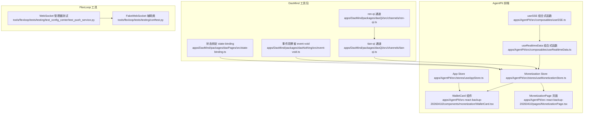
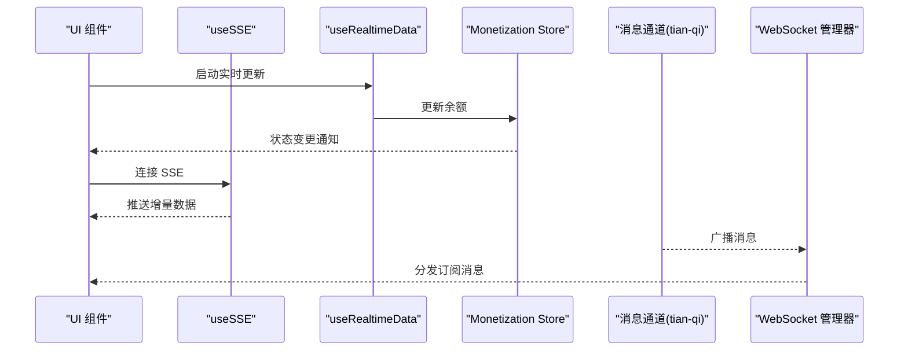
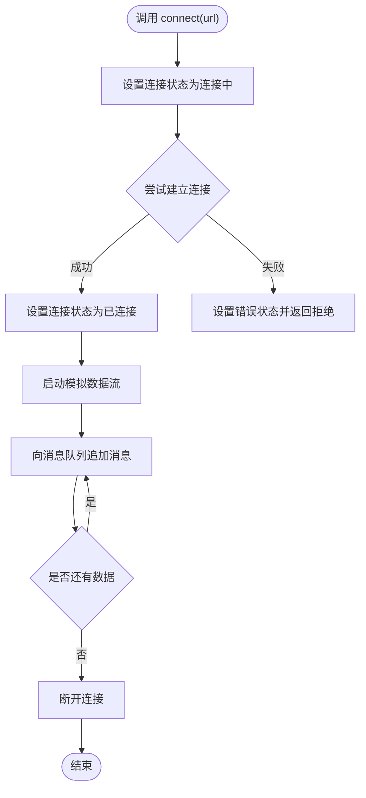
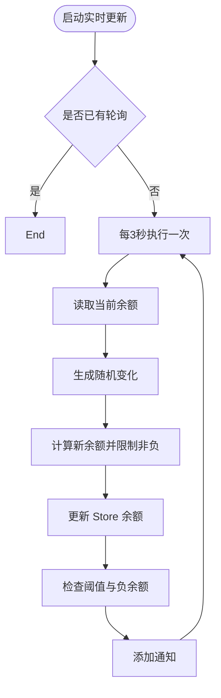
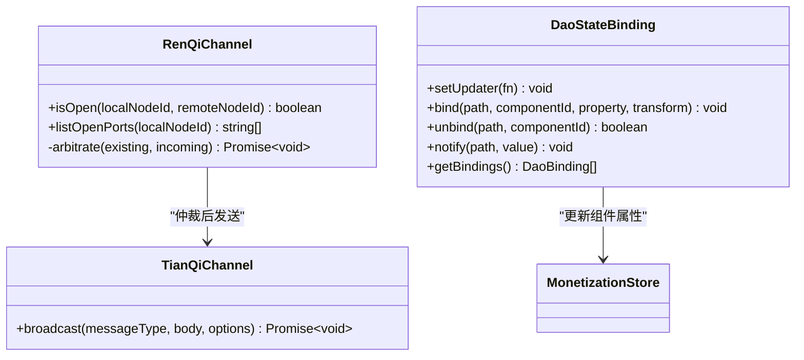
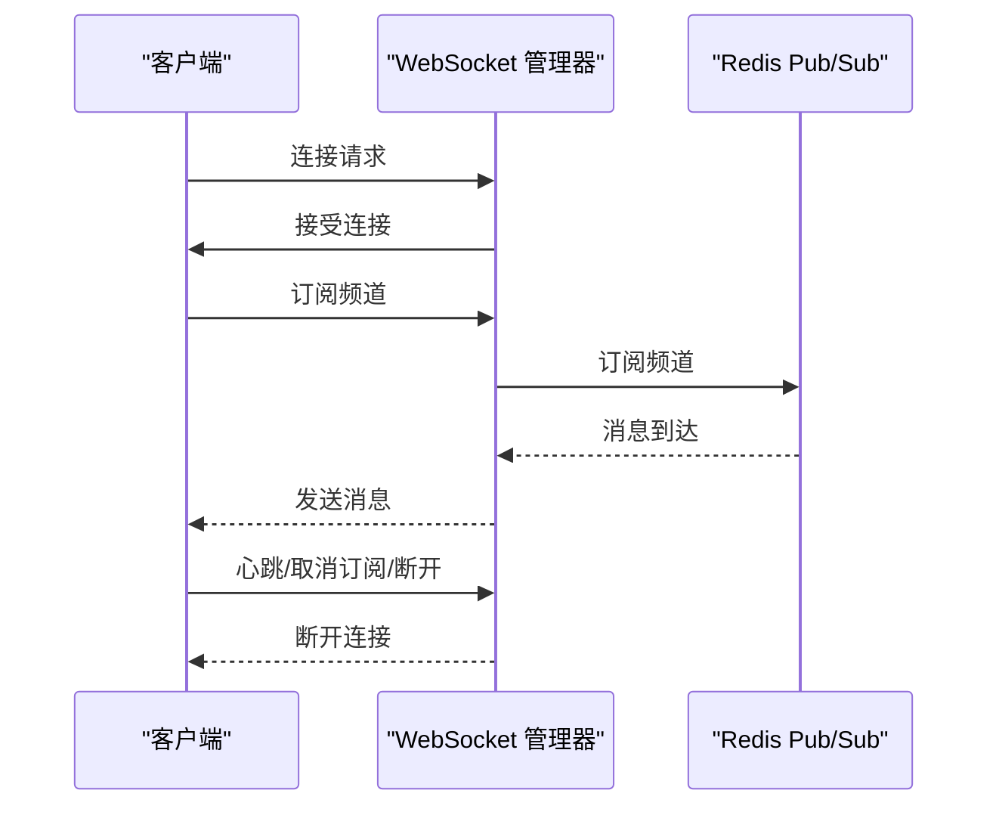
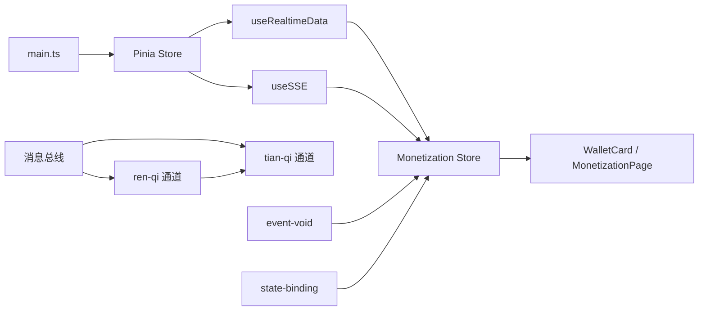

# 跨组件状态同步

<cite>
**本文引用的文件**
- [useSSE.ts](file://apps/AgentPit/src/composables/useSSE.ts)
- [useRealtimeData.ts](file://apps/AgentPit/src/composables/useRealtimeData.ts)
- [useMonetizationStore.ts](file://apps/AgentPit/src/stores/useMonetizationStore.ts)
- [useAppStore.ts](file://apps/AgentPit/src/stores/useAppStore.ts)
- [useSSE.spec.ts](file://apps/AgentPit/src/__tests__/composables/useSSE.spec.ts)
- [useRealtimeData.spec.ts](file://apps/AgentPit/src/__tests__/composables/useRealtimeData.spec.ts)
- [state-management.spec.ts](file://apps/AgentPit/src/__tests__/integration/state-management.spec.ts)
- [main.ts](file://apps/AgentPit/src/main.ts)
- [WalletCard.tsx](file://apps/AgentPit/src-react-backup-20260410/components/monetization/WalletCard.tsx)
- [MonetizationPage.tsx](file://apps/AgentPit/src-react-backup-20260410/pages/MonetizationPage.tsx)
- [ren-qi.ts](file://apps/DaoMind/packages/daoQi/src/channels/ren-qi.ts)
- [tian-qi.ts](file://apps/DaoMind/packages/daoQi/src/channels/tian-qi.ts)
- [event-void.ts](file://apps/DaoMind/packages/daoNothing/src/event-void.ts)
- [state-binding.ts](file://apps/DaoMind/packages/daoPages/src/state-binding.ts)
- [test_push_service.py](file://tools/flexloop/tests/testing/test_config_center/test_push_service.py)
- [conftest.py](file://tools/flexloop/tests/testing/conftest.py)
</cite>

## 目录
1. [引言](#引言)
2. [项目结构](#项目结构)
3. [核心组件](#核心组件)
4. [架构总览](#架构总览)
5. [详细组件分析](#详细组件分析)
6. [依赖关系分析](#依赖关系分析)
7. [性能考量](#性能考量)
8. [故障排查指南](#故障排查指南)
9. [结论](#结论)
10. [附录](#附录)

## 引言
本文件围绕“跨组件状态同步”主题，系统梳理并解释实时数据同步机制在前端与后端中的实现方式，涵盖以下要点：
- 实时数据来源与监听：基于组合式函数与状态管理的实时更新策略
- Server-Sent Events (SSE) 的实现与模拟：useSSE 组合式函数的设计与使用
- WebSocket 连接管理与广播：连接生命周期、订阅管理与消息分发
- 状态一致性与事件驱动：通过状态绑定、通知与通知中心保障一致性
- 最佳实践与性能优化：错误处理、资源清理、节流与去抖策略
- 故障排查：常见问题定位与修复建议

## 项目结构
本仓库包含多个应用与工具包，其中与“跨组件状态同步”直接相关的核心模块如下：
- 前端应用 AgentPit：包含组合式函数、Pinia Store 以及页面组件，用于演示实时状态更新与跨组件同步
- 工具包 daoQi：提供消息总线、通道与仲裁机制，支撑事件驱动与状态广播
- 工具包 daoPages：提供状态绑定能力，将状态变化映射到组件属性
- 工具包 daoNothing：提供事件观察与日志能力，辅助调试与审计
- 工具 flexloop：包含 WebSocket 连接管理器与推送服务测试，覆盖连接生命周期、订阅与广播

图表来源
- [useSSE.ts:1-139](file://apps/AgentPit/src/composables/useSSE.ts#L1-L139)
- [useRealtimeData.ts:1-117](file://apps/AgentPit/src/composables/useRealtimeData.ts#L1-L117)
- [useMonetizationStore.ts:1-81](file://apps/AgentPit/src/stores/useMonetizationStore.ts#L1-L81)
- [useAppStore.ts:1-86](file://apps/AgentPit/src/stores/useAppStore.ts#L1-L86)
- [WalletCard.tsx:1-68](file://apps/AgentPit/src-react-backup-20260410/components/monetization/WalletCard.tsx#L1-L68)
- [MonetizationPage.tsx:1-58](file://apps/AgentPit/src-react-backup-20260410/pages/MonetizationPage.tsx#L1-L58)
- [ren-qi.ts:74-129](file://apps/DaoMind/packages/daoQi/src/channels/ren-qi.ts#L74-L129)
- [tian-qi.ts:1-45](file://apps/DaoMind/packages/daoQi/src/channels/tian-qi.ts#L1-L45)
- [event-void.ts:1-45](file://apps/DaoMind/packages/daoNothing/src/event-void.ts#L1-L45)
- [state-binding.ts:1-51](file://apps/DaoMind/packages/daoPages/src/state-binding.ts#L1-L51)
- [test_push_service.py:251-880](file://tools/flexloop/tests/testing/test_config_center/test_push_service.py#L251-L880)
- [conftest.py:465-484](file://tools/flexloop/tests/testing/conftest.py#L465-L484)

章节来源
- [main.ts:1-12](file://apps/AgentPit/src/main.ts#L1-L12)

## 核心组件
- useSSE 组合式函数：封装 SSE 连接状态、消息队列与错误处理，并提供模拟数据流以便演示
- useRealtimeData 组合式函数：基于定时器生成随机余额变化，触发状态更新与阈值告警
- Monetization Store：集中管理钱包余额、交易与收入数据，提供格式化与聚合计算
- App Store：管理主题、侧边栏与页面状态，支持持久化
- 事件通道与状态绑定：通过 ren-qi/tian-qi 通道进行消息广播，通过 state-binding 将状态映射到组件属性
- 事件观察者：event-void 记录系统事件，便于审计与调试
- WebSocket 管理器：连接生命周期、订阅管理与广播逻辑，覆盖心跳、离线消息与错误处理

章节来源
- [useSSE.ts:1-139](file://apps/AgentPit/src/composables/useSSE.ts#L1-L139)
- [useRealtimeData.ts:1-117](file://apps/AgentPit/src/composables/useRealtimeData.ts#L1-L117)
- [useMonetizationStore.ts:1-81](file://apps/AgentPit/src/stores/useMonetizationStore.ts#L1-L81)
- [useAppStore.ts:1-86](file://apps/AgentPit/src/stores/useAppStore.ts#L1-L86)
- [ren-qi.ts:74-129](file://apps/DaoMind/packages/daoQi/src/channels/ren-qi.ts#L74-L129)
- [tian-qi.ts:1-45](file://apps/DaoMind/packages/daoQi/src/channels/tian-qi.ts#L1-L45)
- [state-binding.ts:1-51](file://apps/DaoMind/packages/daoPages/src/state-binding.ts#L1-L51)
- [event-void.ts:1-45](file://apps/DaoMind/packages/daoNothing/src/event-void.ts#L1-L45)
- [test_push_service.py:251-880](file://tools/flexloop/tests/testing/test_config_center/test_push_service.py#L251-L880)

## 架构总览
整体架构采用“事件驱动 + 状态中心”的模式：
- 前端通过组合式函数与 Pinia Store 管理实时状态
- 后端通过消息通道与 WebSocket 管理器实现广播与订阅
- 事件观察者与状态绑定提供一致性的跨组件同步

图表来源
- [useSSE.ts:18-39](file://apps/AgentPit/src/composables/useSSE.ts#L18-L39)
- [useRealtimeData.ts:74-95](file://apps/AgentPit/src/composables/useRealtimeData.ts#L74-L95)
- [useMonetizationStore.ts:72-74](file://apps/AgentPit/src/stores/useMonetizationStore.ts#L72-L74)
- [tian-qi.ts:30-45](file://apps/DaoMind/packages/daoQi/src/channels/tian-qi.ts#L30-L45)
- [test_push_service.py:354-368](file://tools/flexloop/tests/testing/test_config_center/test_push_service.py#L354-L368)

## 详细组件分析

### useSSE 组合式函数
- 功能概述
  - 管理连接状态（连接中、已连接、断开、错误）
  - 维护消息队列，支持模拟数据流与真实 EventSource 切换
  - 提供连接、断开、清空消息等操作
- 关键点
  - 使用 ref 管理响应式状态
  - onUnmounted 钩子确保资源释放
  - 模拟场景下通过定时器产生消息流，便于测试与演示
- 使用建议
  - 在组件挂载时调用 connect，卸载时调用 disconnect
  - 对于生产环境，替换模拟逻辑为真实的 EventSource 初始化

图表来源
- [useSSE.ts:18-71](file://apps/AgentPit/src/composables/useSSE.ts#L18-L71)

章节来源
- [useSSE.ts:1-139](file://apps/AgentPit/src/composables/useSSE.ts#L1-L139)
- [useSSE.spec.ts:1-67](file://apps/AgentPit/src/__tests__/composables/useSSE.spec.ts#L1-L67)

### useRealtimeData 组合式函数
- 功能概述
  - 基于定时器周期性生成随机余额变化
  - 触发阈值告警（异常增长/下降）与余额为负的错误提示
  - 支持手动添加/移除/清空通知
- 关键点
  - 使用 window.setInterval 管理轮询
  - onUnmounted 自动停止轮询，避免内存泄漏
  - 通知具备自动消失机制

图表来源
- [useRealtimeData.ts:74-102](file://apps/AgentPit/src/composables/useRealtimeData.ts#L74-L102)

章节来源
- [useRealtimeData.ts:1-117](file://apps/AgentPit/src/composables/useRealtimeData.ts#L1-L117)
- [useRealtimeData.spec.ts:1-36](file://apps/AgentPit/src/__tests__/composables/useRealtimeData.spec.ts#L1-L36)

### Monetization Store（钱包状态）
- 功能概述
  - 维护钱包余额、交易与收入数据
  - 提供格式化货币显示与聚合计算（收入/支出）
  - 支持实时余额更新与交易新增
- 关键点
  - 通过 Pinia 管理全局状态
  - getters 提供派生数据，减少重复计算

章节来源
- [useMonetizationStore.ts:1-81](file://apps/AgentPit/src/stores/useMonetizationStore.ts#L1-L81)

### App Store（应用状态）
- 功能概述
  - 主题切换与持久化
  - 侧边栏状态与页面路由
- 关键点
  - 通过 localStorage 持久化部分状态
  - 提供主题应用方法，动态设置 DOM 属性

章节来源
- [useAppStore.ts:1-86](file://apps/AgentPit/src/stores/useAppStore.ts#L1-L86)

### 事件通道与状态绑定（DaoMind）
- ren-qi 通道：提供仲裁机制，避免冲突消息重复发送
- tian-qi 通道：负责全局广播，携带签名与 TTL
- state-binding：将状态路径与组件属性绑定，支持转换函数
- event-void：事件观察者，记录事件并可反射系统镜像

图表来源
- [ren-qi.ts:74-129](file://apps/DaoMind/packages/daoQi/src/channels/ren-qi.ts#L74-L129)
- [tian-qi.ts:30-45](file://apps/DaoMind/packages/daoQi/src/channels/tian-qi.ts#L30-L45)
- [state-binding.ts:31-43](file://apps/DaoMind/packages/daoPages/src/state-binding.ts#L31-L43)

章节来源
- [ren-qi.ts:74-129](file://apps/DaoMind/packages/daoQi/src/channels/ren-qi.ts#L74-L129)
- [tian-qi.ts:1-45](file://apps/DaoMind/packages/daoQi/src/channels/tian-qi.ts#L1-L45)
- [state-binding.ts:1-51](file://apps/DaoMind/packages/daoPages/src/state-binding.ts#L1-L51)
- [event-void.ts:1-45](file://apps/DaoMind/packages/daoNothing/src/event-void.ts#L1-L45)

### WebSocket 连接管理（FlexLoop）
- 生命周期：连接、断开、心跳、离线消息
- 订阅管理：订阅/取消订阅频道
- 广播：向订阅用户广播消息
- 错误处理：JSON 解析错误与未知类型消息

图表来源
- [test_push_service.py:258-275](file://tools/flexloop/tests/testing/test_config_center/test_push_service.py#L258-L275)
- [test_push_service.py:335-346](file://tools/flexloop/tests/testing/test_config_center/test_push_service.py#L335-L346)
- [test_push_service.py:354-368](file://tools/flexloop/tests/testing/test_config_center/test_push_service.py#L354-L368)
- [test_push_service.py:497-513](file://tools/flexloop/tests/testing/test_config_center/test_push_service.py#L497-L513)
- [conftest.py:465-484](file://tools/flexloop/tests/testing/conftest.py#L465-L484)

章节来源
- [test_push_service.py:251-880](file://tools/flexloop/tests/testing/test_config_center/test_push_service.py#L251-L880)
- [conftest.py:465-484](file://tools/flexloop/tests/testing/conftest.py#L465-L484)

## 依赖关系分析
- 前端依赖
  - main.ts 注入 Pinia，使 Store 可用
  - 组件通过组合式函数与 Store 交互，实现跨组件状态同步
- 后端依赖
  - 通道依赖消息总线与签名器
  - WebSocket 管理器依赖 Redis Pub/Sub 与心跳机制

图表来源
- [main.ts:7-12](file://apps/AgentPit/src/main.ts#L7-L12)
- [useSSE.ts:1-139](file://apps/AgentPit/src/composables/useSSE.ts#L1-L139)
- [useRealtimeData.ts:1-117](file://apps/AgentPit/src/composables/useRealtimeData.ts#L1-L117)
- [useMonetizationStore.ts:1-81](file://apps/AgentPit/src/stores/useMonetizationStore.ts#L1-L81)
- [WalletCard.tsx:1-68](file://apps/AgentPit/src-react-backup-20260410/components/monetization/WalletCard.tsx#L1-L68)
- [MonetizationPage.tsx:1-58](file://apps/AgentPit/src-react-backup-20260410/pages/MonetizationPage.tsx#L1-L58)
- [ren-qi.ts:74-129](file://apps/DaoMind/packages/daoQi/src/channels/ren-qi.ts#L74-L129)
- [tian-qi.ts:1-45](file://apps/DaoMind/packages/daoQi/src/channels/tian-qi.ts#L1-L45)
- [event-void.ts:1-45](file://apps/DaoMind/packages/daoNothing/src/event-void.ts#L1-L45)
- [state-binding.ts:1-51](file://apps/DaoMind/packages/daoPages/src/state-binding.ts#L1-L51)

## 性能考量
- 轮询频率控制
  - useRealtimeData 默认 3 秒轮询一次，可根据业务需求调整
- 数据流节流
  - SSE 模拟中按块推送，避免一次性大量数据导致 UI 卡顿
- 内存与资源管理
  - onUnmounted 自动清理定时器与 EventSource，防止内存泄漏
- 广播与订阅
  - WebSocket 管理器对订阅进行去重与清理，降低无效广播
- 缓存与去抖
  - 对高频更新的状态进行合并或去抖，减少渲染压力

## 故障排查指南
- SSE 连接失败
  - 检查连接状态与错误信息；确认模拟逻辑与真实 EventSource 的切换
  - 确保在组件卸载时调用断开连接
- 实时更新未生效
  - 确认轮询是否启动；检查 Store 更新是否被正确触发
  - 核对通知列表是否被自动清除
- WebSocket 无法接收消息
  - 检查订阅是否成功；确认心跳与断线重连逻辑
  - 查看错误响应与未知类型消息处理
- 状态不一致
  - 使用 event-void 记录事件，结合 state-binding 的绑定关系定位问题
  - 核对 ren-qi 仲裁逻辑是否正确处理冲突

章节来源
- [useSSE.spec.ts:39-52](file://apps/AgentPit/src/__tests__/composables/useSSE.spec.ts#L39-L52)
- [useRealtimeData.spec.ts:24-36](file://apps/AgentPit/src/__tests__/composables/useRealtimeData.spec.ts#L24-L36)
- [test_push_service.py:497-513](file://tools/flexloop/tests/testing/test_config_center/test_push_service.py#L497-L513)

## 结论
本项目通过组合式函数、Pinia Store、事件通道与 WebSocket 管理器，构建了完整的跨组件状态同步体系。前端侧重于实时数据监听与状态更新，后端侧重于事件广播与订阅管理。配合事件观察与状态绑定，能够有效保障状态一致性与可观测性。建议在生产环境中优先采用真实 SSE/WS 实现，并结合心跳、重连与错误处理机制，持续优化性能与稳定性。

## 附录
- 组件间通信模式
  - 单向数据流：Store 作为唯一数据源，组件只读
  - 事件驱动：通过通道与 WebSocket 广播消息，组件被动接收
  - 状态绑定：将状态路径映射到组件属性，自动更新
- 最佳实践清单
  - 使用 onUnmounted 清理定时器与连接
  - 对高频更新进行节流/去抖
  - 为 SSE/WS 提供统一的错误处理与重试策略
  - 使用事件观察者记录关键事件，便于审计与排错
  - 对广播消息添加签名与 TTL，确保安全与时效性