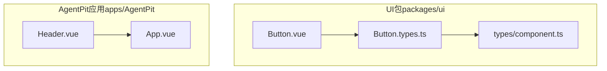
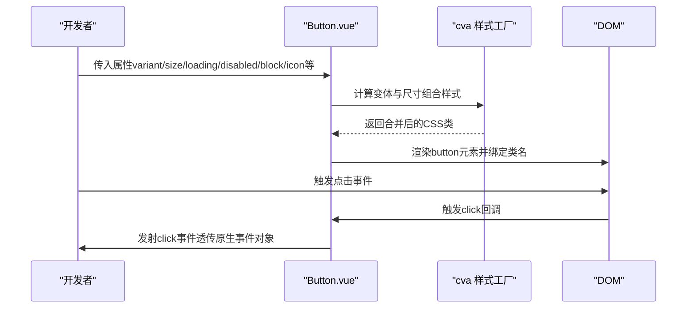
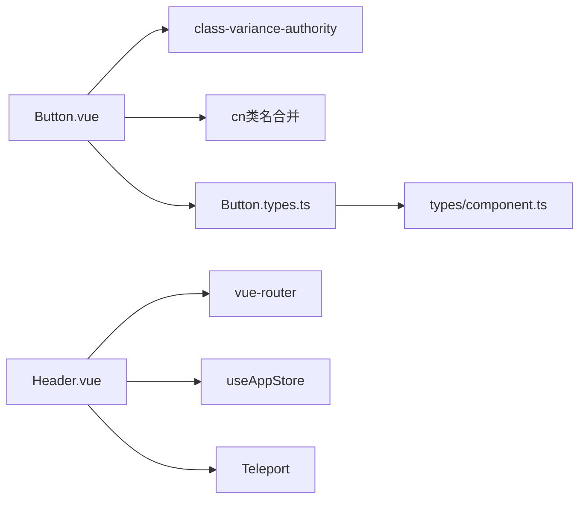

# UI组件使用指南

<cite>
**本文引用的文件**
- [Button.vue](file://apps/AgentPit/packages/ui/src/components/Button/Button.vue)
- [Button.types.ts](file://apps/AgentPit/packages/ui/src/components/Button/Button.types.ts)
- [component.ts](file://apps/AgentPit/packages/ui/src/types/component.ts)
- [Header.vue](file://apps/AgentPit/src/components/layout/Header.vue)
</cite>

## 目录
1. [简介](#简介)
2. [项目结构](#项目结构)
3. [核心组件](#核心组件)
4. [架构总览](#架构总览)
5. [详细组件分析](#详细组件分析)
6. [依赖关系分析](#依赖关系分析)
7. [性能考虑](#性能考虑)
8. [故障排除指南](#故障排除指南)
9. [结论](#结论)
10. [附录](#附录)

## 简介
本指南面向前端开发者与产品设计人员，系统讲解本仓库中UI组件的实现原理、API接口、属性配置、事件处理、样式定制与可访问性支持，并提供在Vue.js与React生态中的使用建议、最佳实践、性能优化与错误处理策略。重点以Button组件为核心，辅以Header组件作为布局与交互示例，帮助读者快速掌握组件的正确使用方式与扩展方法。

## 项目结构
本仓库采用多应用与多包混合架构，UI组件主要位于AgentPit应用内的独立UI包中；同时，应用层也包含大量业务组件（如Header）。下图展示与本指南相关的核心文件与模块关系：

图表来源
- [Button.vue:1-81](file://apps/AgentPit/packages/ui/src/components/Button/Button.vue#L1-L81)
- [Button.types.ts:1-16](file://apps/AgentPit/packages/ui/src/components/Button/Button.types.ts#L1-L16)
- [component.ts:1-31](file://apps/AgentPit/packages/ui/src/types/component.ts#L1-L31)
- [Header.vue:1-228](file://apps/AgentPit/src/components/layout/Header.vue#L1-L228)

章节来源
- [Button.vue:1-81](file://apps/AgentPit/packages/ui/src/components/Button/Button.vue#L1-L81)
- [Button.types.ts:1-16](file://apps/AgentPit/packages/ui/src/components/Button/Button.types.ts#L1-L16)
- [component.ts:1-31](file://apps/AgentPit/packages/ui/src/types/component.ts#L1-L31)
- [Header.vue:1-228](file://apps/AgentPit/src/components/layout/Header.vue#L1-L228)

## 核心组件
本节聚焦Button组件，涵盖其API、属性、事件、样式与可访问性特性，并给出在Vue与React中的使用建议与最佳实践。

- 组件定位：基础交互元素，用于触发操作、提交表单或切换状态。
- 技术栈：Vue 3 + TypeScript + class-variance-authority（cva）+ Tailwind CSS类工具。
- 关键能力：
  - 多变体（variant）与尺寸（size）组合
  - 加载态（loading）与禁用态（disabled）
  - 块级宽度（block）、图标位置（iconPosition）
  - 事件透传（click）

章节来源
- [Button.vue:1-81](file://apps/AgentPit/packages/ui/src/components/Button/Button.vue#L1-L81)
- [Button.types.ts:1-16](file://apps/AgentPit/packages/ui/src/components/Button/Button.types.ts#L1-L16)
- [component.ts:1-31](file://apps/AgentPit/packages/ui/src/types/component.ts#L1-L31)

## 架构总览
下图展示Button组件从属性到渲染的完整流程，包括cva样式计算、条件渲染与事件发射：

图表来源
- [Button.vue:17-60](file://apps/AgentPit/packages/ui/src/components/Button/Button.vue#L17-L60)

## 详细组件分析

### Button组件API与属性详解
- 基础属性（继承自BaseButtonProps）
  - id：可选标识符
  - class：追加自定义类名
  - style：内联样式对象
  - disabled：禁用态（影响点击与样式）
- Button专属属性
  - variant：按钮变体（default/primary/secondary/success/warning/danger/outline/ghost）
  - size：按钮尺寸（xs/sm/md/lg/xl）
  - type：HTML button type（button/submit/reset）
  - loading：加载态（禁用点击、显示旋转指示器）
  - block：块级宽度（全宽）
  - icon：图标内容（字符串形式）
  - iconPosition：图标位置（left/right）
- 默认值
  - variant: primary
  - size: md
  - type: button
  - loading: false
  - block: false
  - iconPosition: left
  - disabled: false
- 事件
  - click：点击事件，透传原生MouseEvent
- 插槽
  - 默认插槽：按钮文本内容
- 可访问性
  - 自动继承button的语义与键盘可达性
  - 禁用态通过disabled与样式降权确保不可交互
  - 加载态通过视觉反馈避免重复点击

章节来源
- [Button.types.ts:3-15](file://apps/AgentPit/packages/ui/src/components/Button/Button.types.ts#L3-L15)
- [component.ts:10-15](file://apps/AgentPit/packages/ui/src/types/component.ts#L10-L15)
- [Button.vue:7-15](file://apps/AgentPit/packages/ui/src/components/Button/Button.vue#L7-L15)
- [Button.vue:17-19](file://apps/AgentPit/packages/ui/src/components/Button/Button.vue#L17-L19)
- [Button.vue:63-80](file://apps/AgentPit/packages/ui/src/components/Button/Button.vue#L63-L80)

### Button样式与变体实现
- 样式计算
  - 使用cva根据variant与size生成基础样式
  - 通过computed动态合并block与外部class
- 变体与尺寸
  - 变体覆盖背景色、文字色、边框与焦点环颜色
  - 尺寸控制内边距与字体大小
- 状态样式
  - 禁用态降低透明度并阻止指针事件
  - 加载态显示旋转指示器，阻止点击
- 图标与文本
  - 支持左右两侧图标，优先级高于插槽文本
  - 在loading时隐藏图标与文本，仅显示指示器

章节来源
- [Button.vue:21-48](file://apps/AgentPit/packages/ui/src/components/Button/Button.vue#L21-L48)
- [Button.vue:50-54](file://apps/AgentPit/packages/ui/src/components/Button/Button.vue#L50-L54)
- [Button.vue:63-80](file://apps/AgentPit/packages/ui/src/components/Button/Button.vue#L63-L80)

### Button事件处理与交互逻辑
- 点击拦截
  - 当disabled或loading为真时，不触发click事件
- 事件透传
  - 将原生MouseEvent传递给父组件，便于上层处理
- 可组合性
  - 可与表单submit结合，或在列表中批量触发

章节来源
- [Button.vue:56-60](file://apps/AgentPit/packages/ui/src/components/Button/Button.vue#L56-L60)
- [Button.vue:17-19](file://apps/AgentPit/packages/ui/src/components/Button/Button.vue#L17-L19)

### Header组件：导航与交互示例
- 功能概览
  - Logo区、导航菜单、搜索框、通知、主题切换、用户菜单
  - 支持移动端汉堡菜单与侧边栏切换
- 事件
  - toggle-sidebar：切换侧边栏
  - search：搜索查询（返回字符串）
- 属性
  - logoText：Logo文字，默认“AgentPit”
  - showSearch：是否显示搜索框，默认true
  - showNotifications：是否显示通知，默认true
- 可访问性
  - 为关键按钮添加aria-label
  - 使用Teleport将下拉菜单挂载到body，避免层级遮挡

章节来源
- [Header.vue:1-25](file://apps/AgentPit/src/components/layout/Header.vue#L1-L25)
- [Header.vue:36-58](file://apps/AgentPit/src/components/layout/Header.vue#L36-L58)
- [Header.vue:60-63](file://apps/AgentPit/src/components/layout/Header.vue#L60-L63)
- [Header.vue:79-83](file://apps/AgentPit/src/components/layout/Header.vue#L79-L83)
- [Header.vue:85-90](file://apps/AgentPit/src/components/layout/Header.vue#L85-L90)
- [Header.vue:155-164](file://apps/AgentPit/src/components/layout/Header.vue#L155-L164)
- [Header.vue:196-209](file://apps/AgentPit/src/components/layout/Header.vue#L196-L209)

### Vue.js中使用Button与Header
- 引入与注册
  - 在需要的页面或组件中导入Button与Header
- 基本用法
  - 通过属性配置变体、尺寸、加载态与禁用态
  - 通过事件监听点击与搜索
- 最佳实践
  - 使用变体明确语义（primary用于主操作，danger用于危险操作）
  - 在异步操作中启用loading，避免重复提交
  - 合理使用block在表单区域铺满宽度
  - 为图标按钮提供aria-label或title增强可访问性

章节来源
- [Button.vue:7-15](file://apps/AgentPit/packages/ui/src/components/Button/Button.vue#L7-L15)
- [Button.vue:56-60](file://apps/AgentPit/packages/ui/src/components/Button/Button.vue#L56-L60)
- [Header.vue:79-83](file://apps/AgentPit/src/components/layout/Header.vue#L79-L83)
- [Header.vue:85-90](file://apps/AgentPit/src/components/layout/Header.vue#L85-L90)

### React生态集成建议
- 组件映射
  - 将Button.vue封装为React组件（或直接使用Vue组件库导出的React适配层）
  - 将Header.vue映射为React导航组件
- 事件桥接
  - 将click事件映射为onClick，search事件映射为onSearch
- 样式与主题
  - 通过className与style属性接入React项目主题体系
  - 使用Tailwind CSS时保持类名一致性

[本节为概念性指导，不直接分析具体文件，故无章节来源]

## 依赖关系分析
- Button组件依赖
  - class-variance-authority（cva）：变体与尺寸样式组合
  - cn：类名合并工具
  - Button.types：属性类型定义
  - component.ts：基础组件属性接口
- Header组件依赖
  - vue-router：路由跳转与高亮
  - useAppStore：全局状态（移动端侧边栏、主题切换）
  - Teleport：下拉菜单挂载至body

图表来源
- [Button.vue:1-6](file://apps/AgentPit/packages/ui/src/components/Button/Button.vue#L1-L6)
- [Button.types.ts](file://apps/AgentPit/packages/ui/src/components/Button/Button.types.ts#L1)
- [component.ts](file://apps/AgentPit/packages/ui/src/types/component.ts#L1)
- [Header.vue:29-30](file://apps/AgentPit/src/components/layout/Header.vue#L29-L30)
- [Header.vue](file://apps/AgentPit/src/components/layout/Header.vue#L30)
- [Header.vue:196-209](file://apps/AgentPit/src/components/layout/Header.vue#L196-L209)

章节来源
- [Button.vue:1-6](file://apps/AgentPit/packages/ui/src/components/Button/Button.vue#L1-L6)
- [Button.types.ts](file://apps/AgentPit/packages/ui/src/components/Button/Button.types.ts#L1)
- [component.ts](file://apps/AgentPit/packages/ui/src/types/component.ts#L1)
- [Header.vue:29-30](file://apps/AgentPit/src/components/layout/Header.vue#L29-L30)
- [Header.vue](file://apps/AgentPit/src/components/layout/Header.vue#L30)
- [Header.vue:196-209](file://apps/AgentPit/src/components/layout/Header.vue#L196-L209)

## 性能考虑
- 样式计算
  - 使用cva按需生成样式，避免运行时复杂计算
  - 通过computed缓存样式结果，减少重渲染
- 事件处理
  - 点击事件在disabled或loading时短路，避免无效回调
- 渲染优化
  - 图标与指示器按条件渲染，减少DOM节点
  - 块级按钮在表单场景合理使用，避免过度占位
- 可访问性
  - 禁用态与加载态提供清晰视觉反馈，降低用户误操作概率

[本节提供通用指导，不直接分析具体文件，故无章节来源]

## 故障排除指南
- 问题：点击无效
  - 检查disabled或loading是否为true
  - 确认事件监听是否正确绑定
- 问题：样式错乱
  - 检查是否覆盖了关键类名
  - 确认Tailwind与cva类的优先级
- 问题：图标不显示
  - 确认icon传入且非loading状态
  - 检查iconPosition与插槽内容冲突
- 问题：可访问性不足
  - 为按钮添加aria-label
  - 确保键盘可达与焦点可见

章节来源
- [Button.vue:56-60](file://apps/AgentPit/packages/ui/src/components/Button/Button.vue#L56-L60)
- [Button.vue:63-80](file://apps/AgentPit/packages/ui/src/components/Button/Button.vue#L63-L80)
- [Button.vue:21-48](file://apps/AgentPit/packages/ui/src/components/Button/Button.vue#L21-L48)

## 结论
本指南围绕Button与Header组件，系统阐述了属性配置、事件处理、样式定制与可访问性支持，并提供了在Vue与React生态中的集成建议与最佳实践。通过cva与Tailwind的组合，组件具备良好的可扩展性与一致性；通过明确的状态与事件语义，提升了交互的可靠性与可维护性。

[本节为总结性内容，不直接分析具体文件，故无章节来源]

## 附录

### API参考速查（Button）
- 属性
  - variant：变体（default/primary/secondary/success/warning/danger/outline/ghost）
  - size：尺寸（xs/sm/md/lg/xl）
  - type：按钮类型（button/submit/reset）
  - loading：加载态（布尔）
  - block：块级宽度（布尔）
  - icon：图标内容（字符串）
  - iconPosition：图标位置（left/right）
  - 其他：id/class/style/disabled（继承自BaseButtonProps）
- 事件
  - click：点击事件（透传原生事件）
- 插槽
  - 默认插槽：按钮文本

章节来源
- [Button.types.ts:3-15](file://apps/AgentPit/packages/ui/src/components/Button/Button.types.ts#L3-L15)
- [component.ts:10-15](file://apps/AgentPit/packages/ui/src/types/component.ts#L10-L15)
- [Button.vue:17-19](file://apps/AgentPit/packages/ui/src/components/Button/Button.vue#L17-L19)
- [Button.vue:63-79](file://apps/AgentPit/packages/ui/src/components/Button/Button.vue#L63-L79)

### 示例场景与组合技巧
- 表单提交
  - 使用primary变体与submit类型
  - 异步提交时开启loading，完成后关闭
- 危险操作
  - 使用danger变体，配合二次确认
- 批量操作
  - 使用block铺满列表项，提升触达率
- 图标按钮
  - 仅图标时提供aria-label
  - 文字与图标并存时注意iconPosition

章节来源
- [Button.vue:24-34](file://apps/AgentPit/packages/ui/src/components/Button/Button.vue#L24-L34)
- [Button.vue:35-41](file://apps/AgentPit/packages/ui/src/components/Button/Button.vue#L35-L41)
- [Button.vue:63-79](file://apps/AgentPit/packages/ui/src/components/Button/Button.vue#L63-L79)