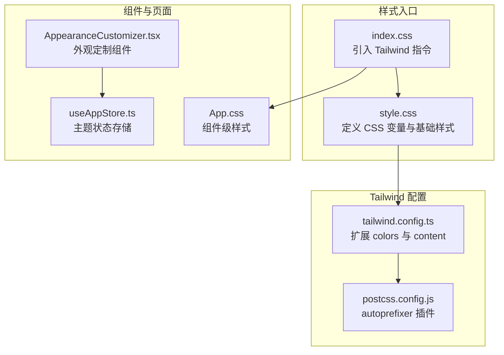
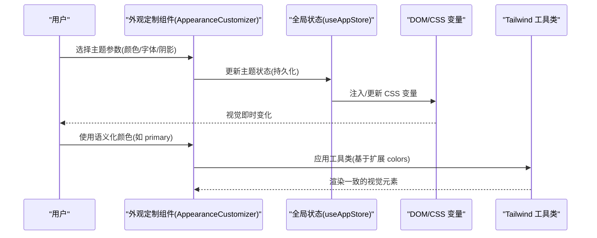
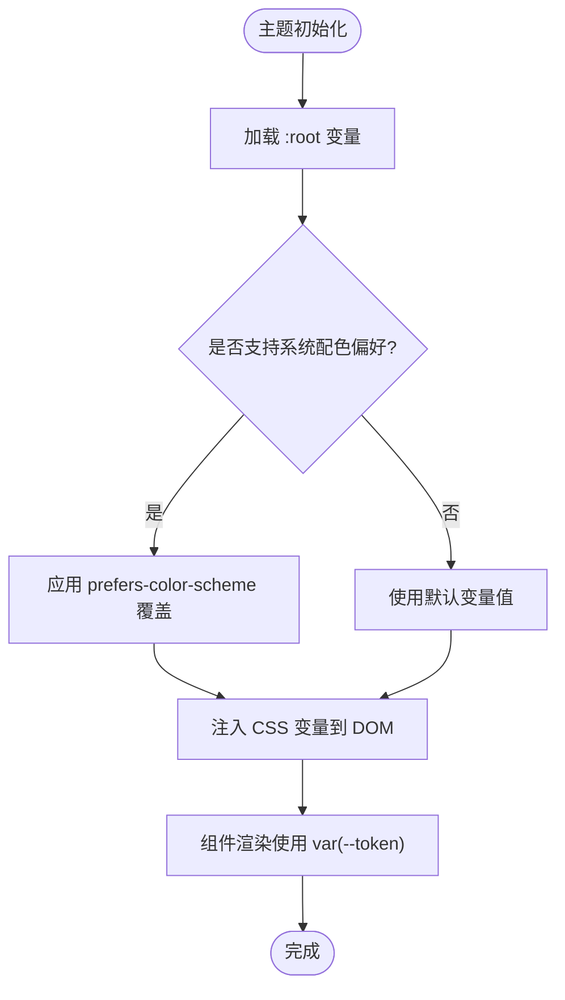
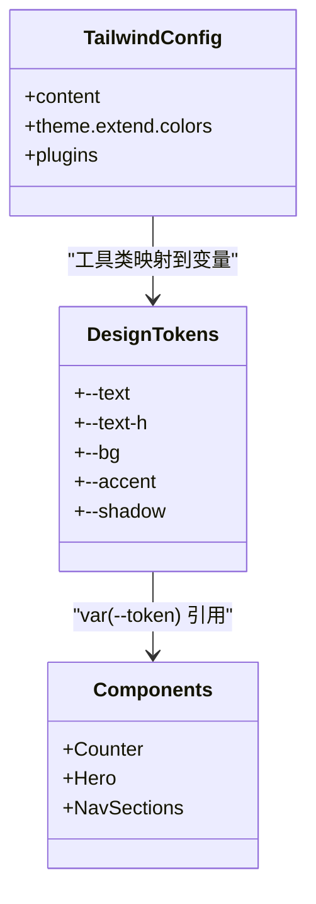
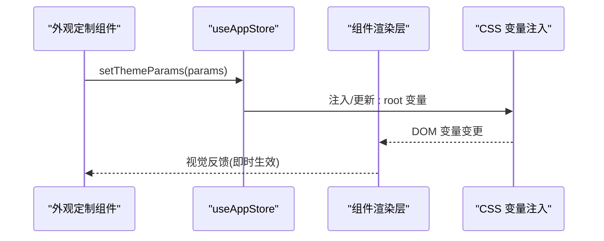
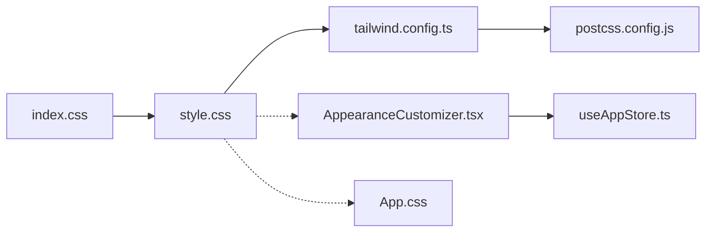

# 主题定制与扩展

<cite>
**本文档引用的文件**
- [tailwind.config.ts](file://apps/AgentPit/tailwind.config.ts)
- [postcss.config.js](file://apps/AgentPit/postcss.config.js)
- [style.css](file://apps/AgentPit/src/style.css)
- [index.css](file://apps/AgentPit/src-react-backup-20260410/index.css)
- [App.css](file://apps/AgentPit/src-react-backup-20260410/App.css)
- [AppearanceCustomizer.tsx](file://apps/AgentPit/src-react-backup-20260410/components/customize/AppearanceCustomizer.tsx)
- [useAppStore.ts](file://apps/AgentPit/src-react-backup-20260410/store/useAppStore.ts)
</cite>

## 目录
1. [简介](#简介)
2. [项目结构](#项目结构)
3. [核心组件](#核心组件)
4. [架构总览](#架构总览)
5. [详细组件分析](#详细组件分析)
6. [依赖关系分析](#依赖关系分析)
7. [性能考量](#性能考量)
8. [故障排除指南](#故障排除指南)
9. [结论](#结论)
10. [附录](#附录)

## 简介
本文件面向主题定制与扩展的开发者，系统阐述在当前代码库中（以 AgentPit 应用为主）如何进行主题系统的设计与实现。内容涵盖：
- 主题系统定制方法与颜色变量覆盖策略
- 组件样式扩展与 Tailwind CSS 集成
- 自定义主题创建、现有主题修改与新增设计令牌的操作步骤
- 主题切换机制、动态样式注入与样式优先级管理
- CSS 变量使用、样式作用域管理与最佳实践
- 性能优化与兼容性处理建议

## 项目结构
AgentPit 应用采用 Tailwind CSS 作为原子化样式框架，并通过 PostCSS 进行构建时处理。主题系统由两部分构成：
- 设计令牌层：以 CSS 变量形式集中管理颜色、字体、阴影等设计元素
- 原子化样式层：基于 Tailwind 的扩展配置，提供语义化颜色与工具类

**图表来源**
- [index.css:1-18](file://apps/AgentPit/src-react-backup-20260410/index.css#L1-L18)
- [style.css:1-299](file://apps/AgentPit/src/style.css#L1-L299)
- [tailwind.config.ts:1-27](file://apps/AgentPit/tailwind.config.ts#L1-L27)
- [postcss.config.js:1-6](file://apps/AgentPit/postcss.config.js#L1-L6)
- [App.css:1-185](file://apps/AgentPit/src-react-backup-20260410/App.css#L1-L185)
- [AppearanceCustomizer.tsx](file://apps/AgentPit/src-react-backup-20260410/components/customize/AppearanceCustomizer.tsx)
- [useAppStore.ts](file://apps/AgentPit/src-react-backup-20260410/store/useAppStore.ts)

**章节来源**
- [index.css:1-18](file://apps/AgentPit/src-react-backup-20260410/index.css#L1-L18)
- [style.css:1-299](file://apps/AgentPit/src/style.css#L1-L299)
- [tailwind.config.ts:1-27](file://apps/AgentPit/tailwind.config.ts#L1-L27)
- [postcss.config.js:1-6](file://apps/AgentPit/postcss.config.js#L1-L6)

## 核心组件
- CSS 变量与基础样式层
  - 在根作用域集中定义文本、背景、边框、强调色、阴影、字体族等设计令牌，并通过媒体查询与系统配色偏好实现明暗主题切换
  - 提供组件级样式（如计数器、英雄区、导航区等），统一使用 CSS 变量以确保主题一致性
- Tailwind 扩展层
  - 在配置中扩展 colors，为语义化主色提供从 50 到 900 的完整色阶，便于在组件中直接使用
  - content 覆盖范围包含应用源码路径，确保按需生成样式
- 动态主题控制层
  - 外观定制组件负责收集用户选择的主题参数
  - 全局状态存储负责持久化主题状态并在运行时注入或更新 CSS 变量

**章节来源**
- [style.css:3-53](file://apps/AgentPit/src/style.css#L3-L53)
- [tailwind.config.ts:7-24](file://apps/AgentPit/tailwind.config.ts#L7-L24)
- [AppearanceCustomizer.tsx](file://apps/AgentPit/src-react-backup-20260410/components/customize/AppearanceCustomizer.tsx)
- [useAppStore.ts](file://apps/AgentPit/src-react-backup-20260410/store/useAppStore.ts)

## 架构总览
下图展示了主题系统从“设计令牌”到“组件渲染”的端到端流程：

**图表来源**
- [AppearanceCustomizer.tsx](file://apps/AgentPit/src-react-backup-20260410/components/customize/AppearanceCustomizer.tsx)
- [useAppStore.ts](file://apps/AgentPit/src-react-backup-20260410/store/useAppStore.ts)
- [style.css:3-53](file://apps/AgentPit/src/style.css#L3-L53)
- [tailwind.config.ts:7-24](file://apps/AgentPit/tailwind.config.ts#L7-L24)

## 详细组件分析

### 设计令牌与 CSS 变量体系
- 作用域与优先级
  - :root 定义默认令牌；媒体查询与系统配色偏好覆盖明暗模式下的变量值
  - 组件样式通过 var(--token) 引用，保证在主题切换时自动生效
- 关键令牌类别
  - 文本与标题：--text、--text-h
  - 背景与边框：--bg、--border
  - 代码块与强调：--code-bg、--accent、--accent-bg、--accent-border
  - 阴影与社交区：--shadow、--social-bg
  - 字体族：--sans、--heading、--mono
- 明暗模式切换
  - prefers-color-scheme: dark 下重写上述变量，配合滤镜与阴影增强对比度
- 样式优先级
  - 组件级样式(App.css)与全局样式(index.css + style.css)共同作用于组件
  - Tailwind 工具类优先级高于自定义样式，但可通过 !important 或更具体的选择器调整

**图表来源**
- [style.css:3-53](file://apps/AgentPit/src/style.css#L3-L53)
- [index.css:1-18](file://apps/AgentPit/src-react-backup-20260410/index.css#L1-L18)
- [App.css:1-185](file://apps/AgentPit/src-react-backup-20260410/App.css#L1-L185)

**章节来源**
- [style.css:3-53](file://apps/AgentPit/src/style.css#L3-L53)
- [index.css:1-18](file://apps/AgentPit/src-react-backup-20260410/index.css#L1-L18)
- [App.css:1-185](file://apps/AgentPit/src-react-backup-20260410/App.css#L1-L185)

### Tailwind CSS 集成与颜色扩展
- 配置要点
  - content 指定扫描路径，确保仅生成实际使用的样式
  - theme.extend.colors 新增语义化主色，提供 50–900 色阶，便于在组件中使用如 text-primary-500、bg-primary-600 等工具类
- 与 CSS 变量的关系
  - Tailwind 工具类与 CSS 变量可并行存在：工具类用于快速布局与语义化颜色，CSS 变量用于统一主题令牌
  - 当需要完全替换某套颜色体系时，可优先调整 CSS 变量，再通过工具类映射到新变量

**图表来源**
- [tailwind.config.ts:7-24](file://apps/AgentPit/tailwind.config.ts#L7-L24)
- [style.css:3-53](file://apps/AgentPit/src/style.css#L3-L53)
- [App.css:1-185](file://apps/AgentPit/src-react-backup-20260410/App.css#L1-L185)

**章节来源**
- [tailwind.config.ts:1-27](file://apps/AgentPit/tailwind.config.ts#L1-L27)

### 外观定制组件与状态管理
- 外观定制组件职责
  - 收集用户对颜色、字体、阴影等的偏好
  - 将偏好转换为主题令牌参数
- 状态管理
  - 全局状态存储负责持久化主题状态，并在运行时触发 CSS 变量注入或更新
  - 通过事件或订阅机制通知组件重新渲染

**图表来源**
- [AppearanceCustomizer.tsx](file://apps/AgentPit/src-react-backup-20260410/components/customize/AppearanceCustomizer.tsx)
- [useAppStore.ts](file://apps/AgentPit/src-react-backup-20260410/store/useAppStore.ts)

**章节来源**
- [AppearanceCustomizer.tsx](file://apps/AgentPit/src-react-backup-20260410/components/customize/AppearanceCustomizer.tsx)
- [useAppStore.ts](file://apps/AgentPit/src-react-backup-20260410/store/useAppStore.ts)

## 依赖关系分析
- 构建链路
  - index.css 中的 Tailwind 指令负责引入基础、组件与工具类
  - style.css 定义设计令牌与全局样式
  - tailwind.config.ts 控制扫描范围与颜色扩展
  - postcss.config.js 提供 autoprefixer 等后处理器
- 组件依赖
  - 组件样式(App.css)依赖全局 CSS 变量
  - 外观定制组件与状态存储共同驱动主题切换

**图表来源**
- [index.css:1-18](file://apps/AgentPit/src-react-backup-20260410/index.css#L1-L18)
- [style.css:1-299](file://apps/AgentPit/src/style.css#L1-L299)
- [tailwind.config.ts:1-27](file://apps/AgentPit/tailwind.config.ts#L1-L27)
- [postcss.config.js:1-6](file://apps/AgentPit/postcss.config.js#L1-L6)
- [AppearanceCustomizer.tsx](file://apps/AgentPit/src-react-backup-20260410/components/customize/AppearanceCustomizer.tsx)
- [useAppStore.ts](file://apps/AgentPit/src-react-backup-20260410/store/useAppStore.ts)
- [App.css:1-185](file://apps/AgentPit/src-react-backup-20260410/App.css#L1-L185)

**章节来源**
- [index.css:1-18](file://apps/AgentPit/src-react-backup-20260410/index.css#L1-L18)
- [style.css:1-299](file://apps/AgentPit/src/style.css#L1-L299)
- [tailwind.config.ts:1-27](file://apps/AgentPit/tailwind.config.ts#L1-L27)
- [postcss.config.js:1-6](file://apps/AgentPit/postcss.config.js#L1-L6)

## 性能考量
- 按需生成样式
  - Tailwind content 覆盖应用源码路径，避免生成未使用样式，减少 CSS 体积
- CSS 变量注入策略
  - 优先批量注入/更新，避免频繁 DOM 操作导致回流
  - 对于高频切换场景，可预计算变量集合，减少运行时计算开销
- 工具类与变量的平衡
  - 对于固定风格的元素，使用 Tailwind 工具类更高效
  - 对于可变主题的元素，使用 CSS 变量更灵活
- 媒体查询与系统偏好
  - 合理利用 prefers-color-scheme，减少重复样式定义

## 故障排除指南
- 主题切换无效
  - 检查 CSS 变量是否正确注入到 :root
  - 确认组件是否使用 var(--token) 引用变量
  - 排查是否存在更高优先级的内联样式或 !important 覆盖
- Tailwind 工具类不生效
  - 确认 content 路径包含对应组件文件
  - 检查工具类拼写与 Tailwind 版本兼容性
- 样式冲突
  - 通过增加选择器特异性或使用作用域类名降低耦合
  - 避免在同一元素上同时使用工具类与内联样式

**章节来源**
- [style.css:3-53](file://apps/AgentPit/src/style.css#L3-L53)
- [tailwind.config.ts:3-6](file://apps/AgentPit/tailwind.config.ts#L3-L6)

## 结论
该主题系统通过“设计令牌 + Tailwind 工具类”的双层架构实现了高可定制性与强一致性：
- 设计令牌层以 CSS 变量为核心，统一管理颜色、字体、阴影等视觉元素
- Tailwind 扩展层提供语义化工具类，加速开发与保持视觉规范
- 外观定制组件与状态管理形成闭环，支持动态主题切换与持久化

建议在后续迭代中：
- 将主题令牌标准化为 JSON/SVG 等可导出格式，便于跨团队共享
- 增加主题校验与回退策略，确保极端参数下的可用性
- 优化变量注入批量化与缓存策略，提升切换性能

## 附录

### 操作步骤速查
- 创建自定义主题
  - 在 :root 中新增一组变量，或复制现有变量组并重命名
  - 在外观定制组件中添加对应参数项
  - 通过状态存储更新变量并注入到 DOM
- 修改现有主题
  - 直接调整 :root 中的变量值或覆盖明暗模式下的变量
  - 如需改变语义化颜色，可在 Tailwind 配置中扩展 colors
- 添加新的设计令牌
  - 在 :root 中定义新变量，并在组件中使用 var(--new-token)
  - 如需工具类支持，在 Tailwind 配置中扩展 theme.extend
- 主题切换机制
  - 外观定制组件 -> 状态存储 -> CSS 变量注入 -> 组件重新渲染
- 动态样式注入与优先级
  - 优先使用 CSS 变量；必要时通过更具体的选择器或 !important 调整
  - Tailwind 工具类优先级高于普通样式，注意覆盖策略
- 与 Tailwind CSS 集成
  - 在 tailwind.config.ts 中配置 content 与 colors 扩展
  - 在 index.css 中引入 Tailwind 指令
- 最佳实践
  - 保持变量命名语义化与可读性
  - 分离静态工具类与动态变量，避免过度耦合
  - 使用媒体查询与系统偏好提升可访问性
- 兼容性处理
  - 针对旧版浏览器补充必要的 polyfill 与降级样式
  - 测试深色模式与高对比度模式下的可读性