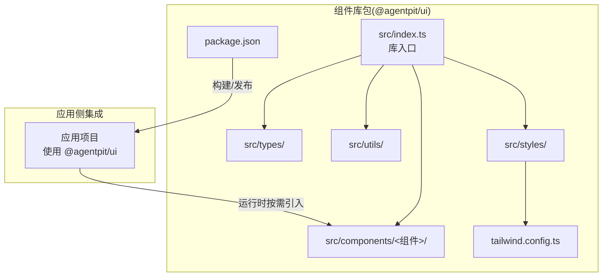
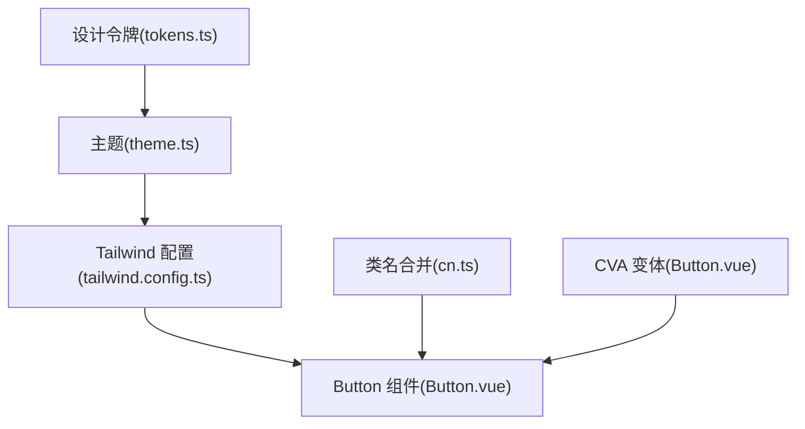
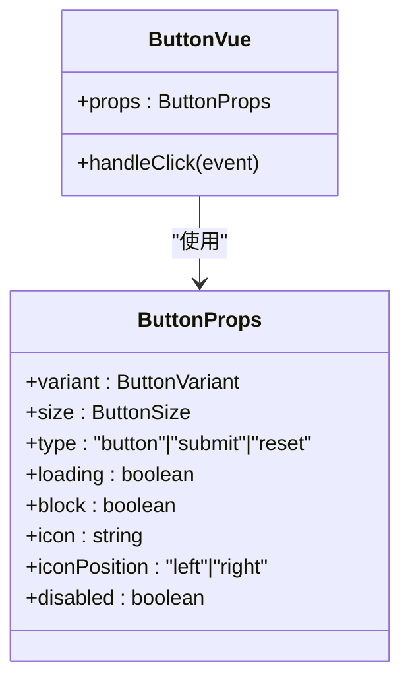
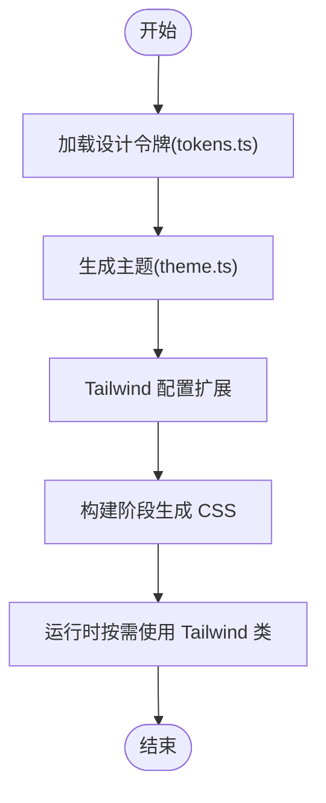
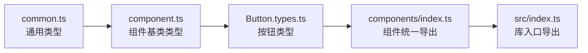
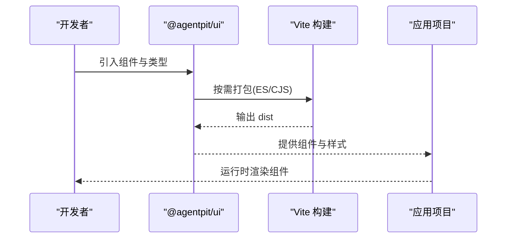
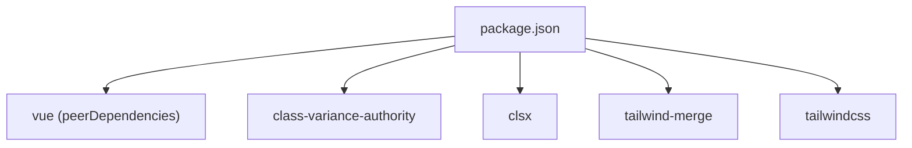

# 组件库与设计系统

<cite>
**本文引用的文件**
- [packages/ui/package.json](file://apps/AgentPit/packages/ui/package.json)
- [packages/ui/tailwind.config.ts](file://apps/AgentPit/packages/ui/tailwind.config.ts)
- [packages/ui/src/styles/tokens.ts](file://apps/AgentPit/packages/ui/src/styles/tokens.ts)
- [packages/ui/src/styles/theme.ts](file://apps/AgentPit/packages/ui/src/styles/theme.ts)
- [packages/ui/src/styles/index.ts](file://apps/AgentPit/packages/ui/src/styles/index.ts)
- [packages/ui/src/utils/cn.ts](file://apps/AgentPit/packages/ui/src/utils/cn.ts)
- [packages/ui/src/types/common.ts](file://apps/AgentPit/packages/ui/src/types/common.ts)
- [packages/ui/src/types/component.ts](file://apps/AgentPit/packages/ui/src/types/component.ts)
- [packages/ui/src/types/index.ts](file://apps/AgentPit/packages/ui/src/types/index.ts)
- [packages/ui/src/components/index.ts](file://apps/AgentPit/packages/ui/src/components/index.ts)
- [packages/ui/src/components/Button/Button.vue](file://apps/AgentPit/packages/ui/src/components/Button/Button.vue)
- [packages/ui/src/components/Button/Button.types.ts](file://apps/AgentPit/packages/ui/src/components/Button/Button.types.ts)
- [docs/COMPONENT_LIBRARY_ARCHITECTURE.md](file://apps/AgentPit/docs/COMPONENT_LIBRARY_ARCHITECTURE.md)
- [docs/VUE3_COMPONENT_GUIDE.md](file://apps/AgentPit/docs/VUE3_COMPONENT_GUIDE.md)
- [src/components/sphinx/DragEditor.vue](file://apps/AgentPit/src/components/sphinx/DragEditor.vue)
- [src/components/customize/AppearanceCustomizer.tsx](file://apps/AgentPit/src/components/customize/AppearanceCustomizer.tsx)
</cite>

## 目录
1. [引言](#引言)
2. [项目结构](#项目结构)
3. [核心组件](#核心组件)
4. [架构总览](#架构总览)
5. [详细组件分析](#详细组件分析)
6. [依赖分析](#依赖分析)
7. [性能考量](#性能考量)
8. [故障排查指南](#故障排查指南)
9. [结论](#结论)
10. [附录](#附录)

## 引言
本文件面向组件库与设计系统，系统化阐述 AgentPit UI 组件库的设计理念、组件分类、使用规范与样式系统；深入解析 Button 等核心组件的实现细节、属性配置、事件处理与样式定制；说明主题系统架构、颜色体系、字体规范与响应式布局等设计原则；并提供组件使用的最佳实践、性能优化建议与无障碍访问支持等开发指南。同时解释组件库与 Vue.js 生态的集成方式、构建配置与发布流程等技术细节。

## 项目结构
AgentPit UI 组件库位于 AgentPit 应用中的 packages/ui 目录，采用“组件-类型-工具-样式”分层组织，配合 Tailwind CSS 设计令牌与 class-variance-authority(CVA) 实现一致且可扩展的样式变体管理。文档系统基于 VitePress，提供组件使用指南与 API 参考。

图示来源
- [packages/ui/package.json:1-58](file://apps/AgentPit/packages/ui/package.json#L1-L58)
- [packages/ui/tailwind.config.ts:1-20](file://apps/AgentPit/packages/ui/tailwind.config.ts#L1-L20)
- [packages/ui/src/styles/index.ts:1-2](file://apps/AgentPit/packages/ui/src/styles/index.ts#L1-L2)

章节来源
- [docs/COMPONENT_LIBRARY_ARCHITECTURE.md:28-139](file://apps/AgentPit/docs/COMPONENT_LIBRARY_ARCHITECTURE.md#L28-L139)

## 核心组件
- 组件分类：原子组件（Button、Input、Avatar）、分子组件（由原子组件组合）、组织组件（页面级组件）。组件均提供 TypeScript 类型定义与统一导出入口，便于按需引入与类型安全。
- 使用规范：通过 props、slots、events 提供扩展点；支持 class 覆盖与主题定制；遵循单一职责、开闭原则与依赖倒置原则。
- 样式系统：基于设计令牌(colors、spacing、borderRadius、shadows、breakpoints)，通过 Tailwind CSS 扩展与 CVA 变体规则实现一致的视觉与交互体验。

章节来源
- [packages/ui/src/components/index.ts:1-30](file://apps/AgentPit/packages/ui/src/components/index.ts#L1-L30)
- [packages/ui/src/types/component.ts:1-30](file://apps/AgentPit/packages/ui/src/types/component.ts#L1-L30)
- [packages/ui/src/types/common.ts:1-18](file://apps/AgentPit/packages/ui/src/types/common.ts#L1-L18)
- [docs/COMPONENT_LIBRARY_ARCHITECTURE.md:440-492](file://apps/AgentPit/docs/COMPONENT_LIBRARY_ARCHITECTURE.md#L440-L492)

## 架构总览
组件库采用“设计令牌 + Tailwind 扩展 + CVA 变体 + 类名合并工具”的样式架构，结合统一的类型导出与文档体系，形成高复用、可维护、可扩展的组件库。

图示来源
- [packages/ui/src/styles/tokens.ts:1-121](file://apps/AgentPit/packages/ui/src/styles/tokens.ts#L1-L121)
- [packages/ui/src/styles/theme.ts:1-11](file://apps/AgentPit/packages/ui/src/styles/theme.ts#L1-L11)
- [packages/ui/tailwind.config.ts:1-20](file://apps/AgentPit/packages/ui/tailwind.config.ts#L1-L20)
- [packages/ui/src/utils/cn.ts:1-7](file://apps/AgentPit/packages/ui/src/utils/cn.ts#L1-L7)
- [packages/ui/src/components/Button/Button.vue:1-81](file://apps/AgentPit/packages/ui/src/components/Button/Button.vue#L1-L81)

## 详细组件分析

### Button 组件
- 设计理念：通过 CVA 定义变体与尺寸，结合 cn 工具进行类名合并，保证样式一致性与可扩展性。
- 属性配置：支持 variant、size、type、loading、block、icon、iconPosition、disabled 等；提供合理默认值与类型约束。
- 事件处理：仅在非 disabled 且非 loading 时触发 click 事件，避免无效交互。
- 样式定制：支持通过 class 覆盖；loading 状态内置旋转指示器；图标位置可左右切换。
- 变体与尺寸：内置多种变体与尺寸，满足不同业务场景；默认变体与尺寸可配置。

图示来源
- [packages/ui/src/components/Button/Button.types.ts:1-15](file://apps/AgentPit/packages/ui/src/components/Button/Button.types.ts#L1-L15)
- [packages/ui/src/components/Button/Button.vue:1-81](file://apps/AgentPit/packages/ui/src/components/Button/Button.vue#L1-L81)

章节来源
- [packages/ui/src/components/Button/Button.vue:1-81](file://apps/AgentPit/packages/ui/src/components/Button/Button.vue#L1-L81)
- [packages/ui/src/components/Button/Button.types.ts:1-15](file://apps/AgentPit/packages/ui/src/components/Button/Button.types.ts#L1-L15)
- [packages/ui/src/utils/cn.ts:1-7](file://apps/AgentPit/packages/ui/src/utils/cn.ts#L1-L7)

### 样式系统与主题
- 设计令牌：colors、spacing、borderRadius、shadows、breakpoints 等统一管理，确保视觉一致性。
- 主题配置：theme 对象聚合设计令牌，作为主题入口。
- Tailwind 扩展：tailwind.config.ts 将设计令牌映射为 Tailwind 的 colors、spacing、borderRadius、boxShadow、screens。
- 类名合并：cn 工具基于 clsx 与 tailwind-merge，避免冲突类名叠加导致的样式覆盖问题。

图示来源
- [packages/ui/src/styles/tokens.ts:1-121](file://apps/AgentPit/packages/ui/src/styles/tokens.ts#L1-L121)
- [packages/ui/src/styles/theme.ts:1-11](file://apps/AgentPit/packages/ui/src/styles/theme.ts#L1-L11)
- [packages/ui/tailwind.config.ts:1-20](file://apps/AgentPit/packages/ui/tailwind.config.ts#L1-L20)

章节来源
- [packages/ui/src/styles/tokens.ts:1-121](file://apps/AgentPit/packages/ui/src/styles/tokens.ts#L1-L121)
- [packages/ui/src/styles/theme.ts:1-11](file://apps/AgentPit/packages/ui/src/styles/theme.ts#L1-L11)
- [packages/ui/tailwind.config.ts:1-20](file://apps/AgentPit/packages/ui/tailwind.config.ts#L1-L20)
- [packages/ui/src/utils/cn.ts:1-7](file://apps/AgentPit/packages/ui/src/utils/cn.ts#L1-L7)

### 类型系统与导出机制
- 通用类型：Size、Variant、Shape、Placement、Alignment、Direction 等，统一约束组件属性范围。
- 组件基类类型：BaseComponentProps、BaseButtonProps、BaseInputProps、BaseCardProps 等，提供可复用的属性集合。
- 组件类型导出：各组件在自身目录下提供 types 文件，并通过 components/index.ts 统一导出，便于按需引入与类型推断。
- 库入口导出：src/index.ts 统一导出 components、composables、types、utils、styles，简化使用者导入路径。

图示来源
- [packages/ui/src/types/common.ts:1-18](file://apps/AgentPit/packages/ui/src/types/common.ts#L1-L18)
- [packages/ui/src/types/component.ts:1-30](file://apps/AgentPit/packages/ui/src/types/component.ts#L1-L30)
- [packages/ui/src/components/index.ts:1-30](file://apps/AgentPit/packages/ui/src/components/index.ts#L1-L30)
- [packages/ui/src/types/index.ts:1-2](file://apps/AgentPit/packages/ui/src/types/index.ts#L1-L2)

章节来源
- [packages/ui/src/types/common.ts:1-18](file://apps/AgentPit/packages/ui/src/types/common.ts#L1-L18)
- [packages/ui/src/types/component.ts:1-30](file://apps/AgentPit/packages/ui/src/types/component.ts#L1-L30)
- [packages/ui/src/components/index.ts:1-30](file://apps/AgentPit/packages/ui/src/components/index.ts#L1-L30)
- [packages/ui/src/types/index.ts:1-2](file://apps/AgentPit/packages/ui/src/types/index.ts#L1-L2)

### 主题系统与颜色体系
- 颜色体系：提供 primary、accent、success、warning、danger、gray 等语义化色彩，每类包含 50–900 的渐变层级，满足强调、成功、警告、危险与中性灰等场景。
- 间距系统：提供 0–24 的离散间距值，用于布局与内边距/外边距的一致控制。
- 圆角与阴影：提供 sm–2xl 的圆角与阴影层级，支撑卡片、按钮、弹窗等组件的视觉层次。
- 响应式断点：sm–2xl 的断点配置，适配移动端到大屏设备的布局需求。
- 主题定制：通过 tailwind.config.ts 扩展 colors、spacing、borderRadius、boxShadow、screens，实现品牌化定制。

章节来源
- [packages/ui/src/styles/tokens.ts:1-121](file://apps/AgentPit/packages/ui/src/styles/tokens.ts#L1-L121)
- [packages/ui/tailwind.config.ts:1-20](file://apps/AgentPit/packages/ui/tailwind.config.ts#L1-L20)
- [docs/COMPONENT_LIBRARY_ARCHITECTURE.md:142-200](file://apps/AgentPit/docs/COMPONENT_LIBRARY_ARCHITECTURE.md#L142-L200)

### 组件使用与最佳实践
- 按需引入：通过 components/index.ts 统一导出，按需引入组件与类型，减少打包体积。
- 类型安全：优先使用类型导出，确保 props、emits、slots 的正确性与可维护性。
- 样式定制：优先使用变体与尺寸；必要时通过 class 覆盖；避免内联样式的滥用。
- 无障碍访问：为交互组件提供语义化标签与键盘可达性；为 loading 状态提供可读提示。
- 性能优化：避免在渲染路径中进行昂贵计算；合理使用 v-show/v-if；利用懒加载与虚拟列表处理大量数据。

章节来源
- [packages/ui/src/components/index.ts:1-30](file://apps/AgentPit/packages/ui/src/components/index.ts#L1-L30)
- [packages/ui/src/types/index.ts:1-2](file://apps/AgentPit/packages/ui/src/types/index.ts#L1-L2)
- [docs/COMPONENT_LIBRARY_ARCHITECTURE.md:440-492](file://apps/AgentPit/docs/COMPONENT_LIBRARY_ARCHITECTURE.md#L440-L492)

### 与 Vue.js 生态的集成
- 组件实现：基于 Vue 3 Composition API 与 SFC，使用 defineProps/defineEmits 管理属性与事件。
- 变体管理：class-variance-authority 提供声明式变体规则，结合 cn 工具进行类名合并。
- 文档系统：VitePress 提供组件文档与示例，支持 Vue 组件直接嵌入文档。
- 构建与发布：Vite 构建库模式，Rollup 外部化 vue，支持 ES 与 CJS 两种格式；package.json 提供 exports 字段与 peerDependencies。

图示来源
- [packages/ui/package.json:1-58](file://apps/AgentPit/packages/ui/package.json#L1-L58)
- [packages/ui/src/components/Button/Button.vue:1-81](file://apps/AgentPit/packages/ui/src/components/Button/Button.vue#L1-L81)
- [docs/COMPONENT_LIBRARY_ARCHITECTURE.md:586-642](file://apps/AgentPit/docs/COMPONENT_LIBRARY_ARCHITECTURE.md#L586-L642)

章节来源
- [packages/ui/package.json:1-58](file://apps/AgentPit/packages/ui/package.json#L1-L58)
- [packages/ui/src/components/Button/Button.vue:1-81](file://apps/AgentPit/packages/ui/src/components/Button/Button.vue#L1-L81)
- [docs/COMPONENT_LIBRARY_ARCHITECTURE.md:15-25](file://apps/AgentPit/docs/COMPONENT_LIBRARY_ARCHITECTURE.md#L15-L25)

### 设计系统在应用中的落地
- 可视化编辑器中的组件使用：DragEditor 中演示了如何在可视化编辑器中动态配置组件属性（如按钮文字、颜色），体现设计系统在实际业务场景中的可用性与可定制性。
- 主题选择器：AppearanceCustomizer 展示了如何在应用侧选择与应用主题，体现设计令牌与主题系统的联动。

章节来源
- [src/components/sphinx/DragEditor.vue:1-31](file://apps/AgentPit/src/components/sphinx/DragEditor.vue#L1-L31)
- [src/components/sphinx/DragEditor.vue:349-375](file://apps/AgentPit/src/components/sphinx/DragEditor.vue#L349-L375)
- [src/components/customize/AppearanceCustomizer.tsx:188-217](file://apps/AgentPit/src/components/customize/AppearanceCustomizer.tsx#L188-L217)

## 依赖分析
- 内部依赖：components、types、utils、styles 模块之间松耦合，通过统一入口导出降低使用复杂度。
- 外部依赖：Vue 3 作为 peerDependencies；class-variance-authority、clsx、tailwind-merge 提供变体与类名合并能力；Tailwind CSS 4.x 作为样式基础。
- 构建依赖：Vite、vue-tsc、TypeScript 等，确保类型检查与构建效率。

图示来源
- [packages/ui/package.json:31-47](file://apps/AgentPit/packages/ui/package.json#L31-L47)

章节来源
- [packages/ui/package.json:1-58](file://apps/AgentPit/packages/ui/package.json#L1-L58)

## 性能考量
- 按需引入：通过 components/index.ts 统一导出，按需引入组件与类型，减少打包体积。
- 类名合并：使用 cn 工具避免重复与冲突类名，降低样式层叠复杂度。
- 变体管理：CVA 声明式变体减少条件判断与动态计算，提升渲染性能。
- 构建优化：Vite 构建库模式，Rollup 外部化 vue，支持 ES 与 CJS 两种格式，兼顾现代与传统环境。
- 样式体积：Tailwind CSS 4.x 与设计令牌配合，避免无用样式；在应用侧可通过 purge/content 配置进一步瘦身。

## 故障排查指南
- 组件未生效或样式异常
  - 检查是否正确引入组件与类型；确认 components/index.ts 导出路径。
  - 检查 Tailwind 配置 content 路径是否包含组件源码。
  - 检查 class 是否被 tailwind-merge 合并覆盖。
- 变体或尺寸不生效
  - 确认 props 传值符合类型定义；检查默认值与变体映射。
- 构建失败
  - 检查 package.json 中的构建脚本与 peerDependencies；确保 vue 版本匹配。
- 文档无法预览
  - 检查 VitePress 配置与 docs 目录结构；确认依赖安装完整。

章节来源
- [packages/ui/src/utils/cn.ts:1-7](file://apps/AgentPit/packages/ui/src/utils/cn.ts#L1-L7)
- [packages/ui/src/components/Button/Button.vue:1-81](file://apps/AgentPit/packages/ui/src/components/Button/Button.vue#L1-L81)
- [packages/ui/package.json:20-30](file://apps/AgentPit/packages/ui/package.json#L20-L30)
- [docs/COMPONENT_LIBRARY_ARCHITECTURE.md:308-384](file://apps/AgentPit/docs/COMPONENT_LIBRARY_ARCHITECTURE.md#L308-L384)

## 结论
AgentPit UI 组件库通过“设计令牌 + Tailwind 扩展 + CVA 变体 + 类名合并工具”的架构，实现了高复用、可维护、可扩展的组件体系；配合完善的类型导出与文档系统，为项目提供了统一的视觉语言与开发体验。在 Vue 3 生态中，组件库具备良好的集成性与可定制性，能够支撑从原子组件到页面级组件的全链路开发。

## 附录
- Vue 3 组件开发常见问题参考：插槽、Provide/Inject、Composables 替代 HOC 等实践。
- 组件文档模板与示例：Button 组件文档包含基础用法、不同变体与 API 表格，便于快速上手。

章节来源
- [docs/VUE3_COMPONENT_GUIDE.md:953-1038](file://apps/AgentPit/docs/VUE3_COMPONENT_GUIDE.md#L953-L1038)
- [docs/COMPONENT_LIBRARY_ARCHITECTURE.md:334-371](file://apps/AgentPit/docs/COMPONENT_LIBRARY_ARCHITECTURE.md#L334-L371)