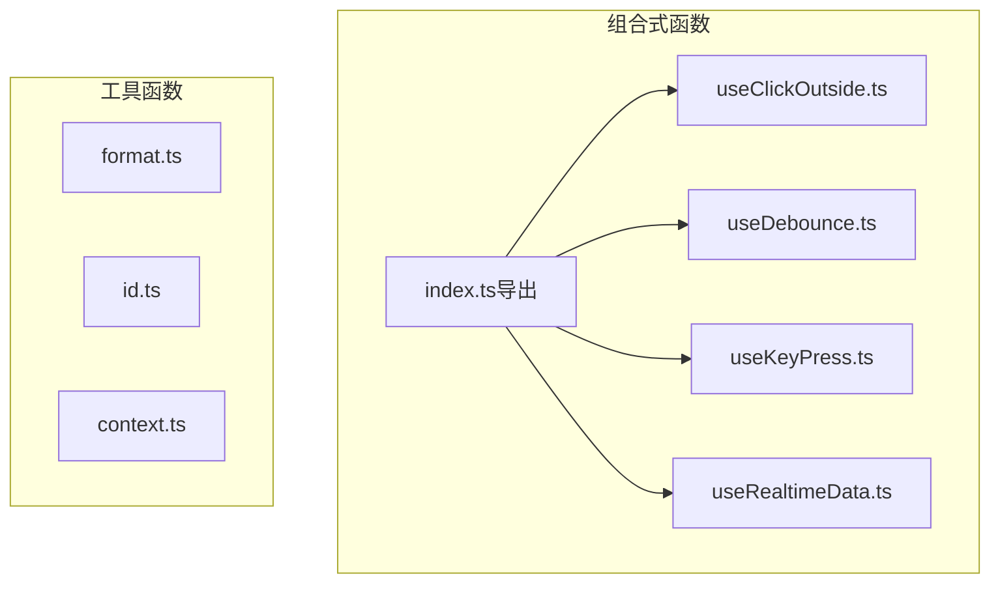
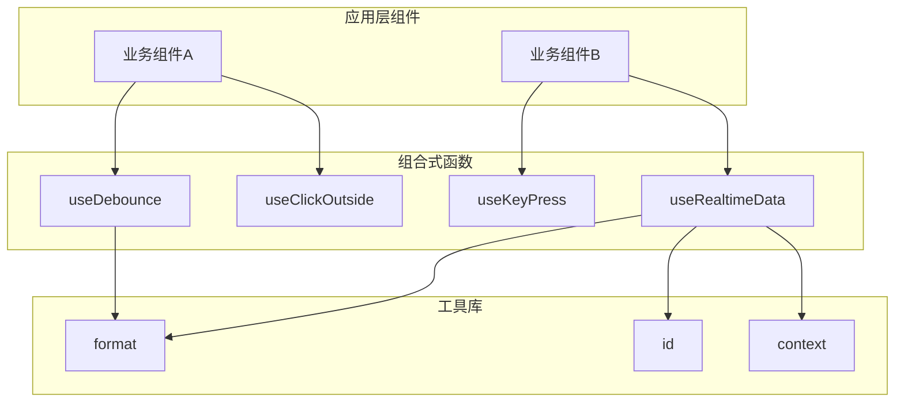
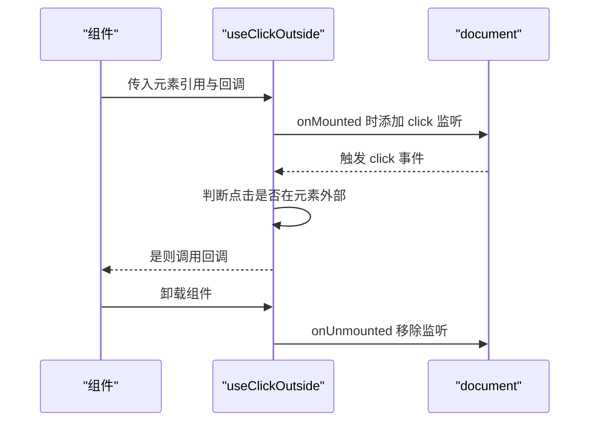
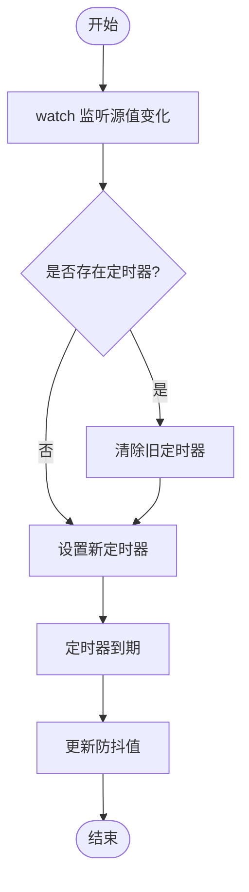
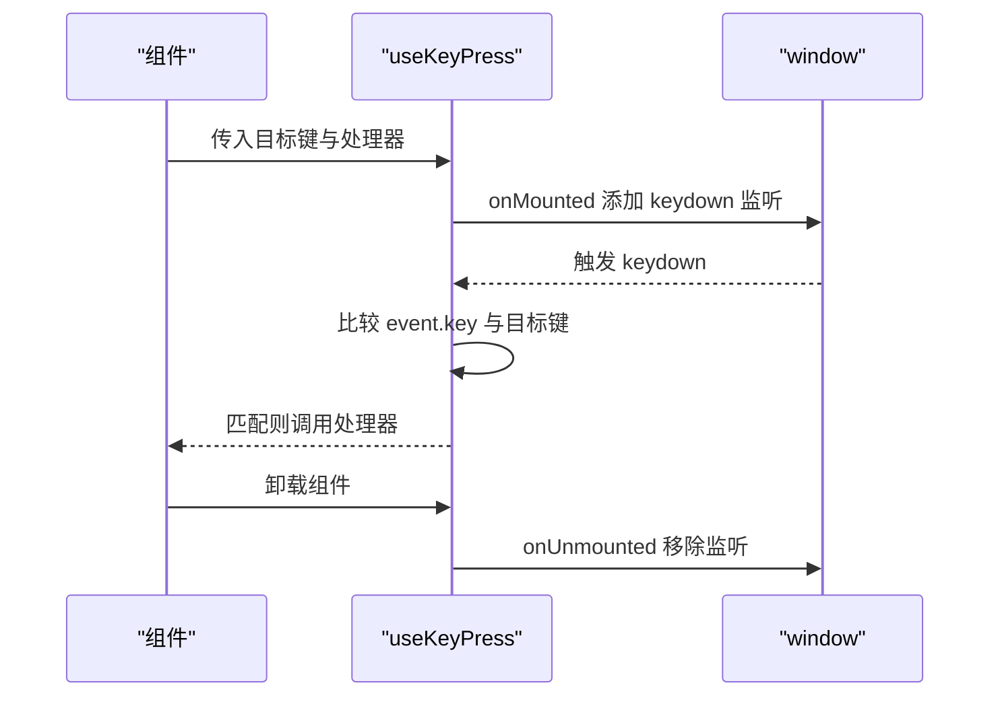
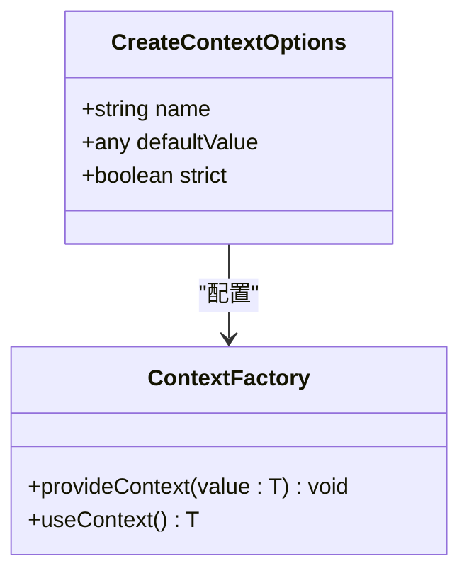
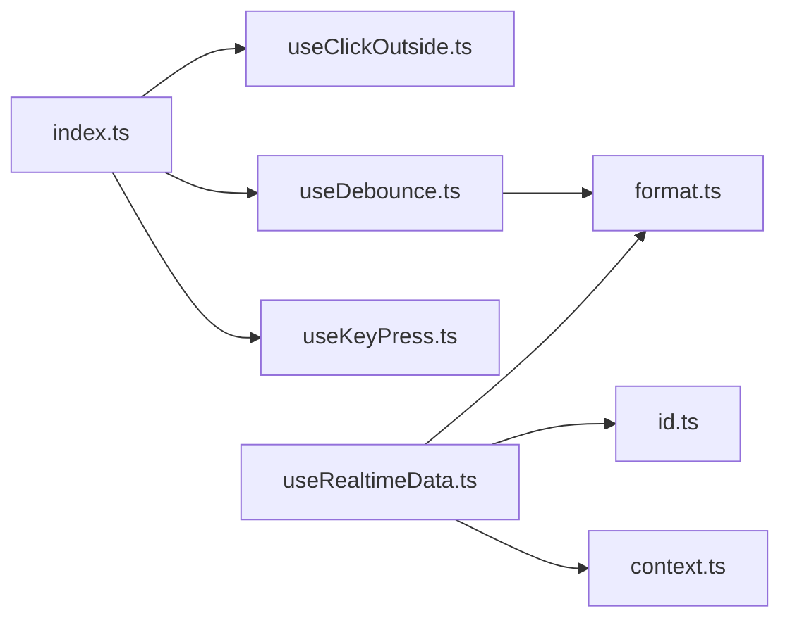

# 组合式函数与工具库

<cite>
**本文引用的文件**
- [useDebounce.ts](file://apps/AgentPit/src/composables/useDebounce.ts)
- [useClickOutside.ts](file://apps/AgentPit/packages/ui/src/composables/useClickOutside.ts)
- [useKeyPress.ts](file://apps/AgentPit/packages/ui/src/composables/useKeyPress.ts)
- [index.ts（组合式导出）](file://apps/AgentPit/packages/ui/src/composables/index.ts)
- [useDebounce.spec.ts（测试）](file://apps/AgentPit/src/__tests__/composables/useDebounce.spec.ts)
- [useRealtimeData.ts](file://apps/AgentPit/src/composables/useRealtimeData.ts)
- [format.ts](file://apps/AgentPit/packages/ui/src/utils/format.ts)
- [id.ts](file://apps/AgentPit/packages/ui/src/utils/id.ts)
- [context.ts](file://apps/AgentPit/packages/ui/src/utils/context.ts)
</cite>

## 目录
1. [简介](#简介)
2. [项目结构](#项目结构)
3. [核心组件](#核心组件)
4. [架构总览](#架构总览)
5. [详细组件分析](#详细组件分析)
6. [依赖分析](#依赖分析)
7. [性能考虑](#性能考虑)
8. [故障排查指南](#故障排查指南)
9. [结论](#结论)
10. [附录](#附录)

## 简介
本文件系统性梳理并讲解本仓库中的组合式函数与工具库，重点覆盖以下内容：
- 组合式函数：useClickOutside、useDebounce、useKeyPress 的实现原理、使用场景、参数与返回值、副作用生命周期管理
- 工具函数：format（日期、数字、货币格式化）、id（唯一标识生成）、context（基于 provide/inject 的上下文工厂）
- 开发模式与最佳实践：如何在组件中正确使用这些组合式函数与工具函数；如何进行状态管理、副作用处理与性能优化
- 实际使用案例与扩展开发建议：结合现有实现给出可直接参考的集成思路

## 项目结构
围绕“组合式函数与工具库”的相关目录与文件分布如下：
- 组合式函数集中于 packages/ui/src/composables 与 src/composables
- 工具函数集中于 packages/ui/src/utils
- 测试集中在 src/__tests__/composables 下

图表来源
- [index.ts（组合式导出）:1-7](file://apps/AgentPit/packages/ui/src/composables/index.ts#L1-L7)
- [useClickOutside.ts:1-18](file://apps/AgentPit/packages/ui/src/composables/useClickOutside.ts#L1-L18)
- [useDebounce.ts:1-21](file://apps/AgentPit/src/composables/useDebounce.ts#L1-L21)
- [useKeyPress.ts:1-18](file://apps/AgentPit/packages/ui/src/composables/useKeyPress.ts#L1-L18)
- [useRealtimeData.ts:1-117](file://apps/AgentPit/src/composables/useRealtimeData.ts#L1-L117)
- [format.ts:1-34](file://apps/AgentPit/packages/ui/src/utils/format.ts#L1-L34)
- [id.ts:1-7](file://apps/AgentPit/packages/ui/src/utils/id.ts#L1-L7)
- [context.ts:1-30](file://apps/AgentPit/packages/ui/src/utils/context.ts#L1-L30)

章节来源
- [index.ts（组合式导出）:1-7](file://apps/AgentPit/packages/ui/src/composables/index.ts#L1-L7)

## 核心组件
- useClickOutside：监听全局点击事件，当点击发生在指定元素外部时触发回调，自动在组件挂载/卸载阶段注册/移除事件监听器
- useDebounce：对响应式值或函数返回值进行防抖，支持自定义延迟时间，内部通过 watch 与定时器实现
- useKeyPress：监听键盘按下事件，匹配目标按键后执行处理器，生命周期内注册/移除事件监听
- format 工具：提供日期、数字、货币的格式化能力，支持占位符替换与国际化格式化
- id 工具：生成带前缀与时间戳的唯一标识
- context 工具：基于 Vue provide/inject 提供强类型的上下文创建与注入机制

章节来源
- [useClickOutside.ts:1-18](file://apps/AgentPit/packages/ui/src/composables/useClickOutside.ts#L1-L18)
- [useDebounce.ts:1-21](file://apps/AgentPit/src/composables/useDebounce.ts#L1-L21)
- [useKeyPress.ts:1-18](file://apps/AgentPit/packages/ui/src/composables/useKeyPress.ts#L1-L18)
- [format.ts:1-34](file://apps/AgentPit/packages/ui/src/utils/format.ts#L1-L34)
- [id.ts:1-7](file://apps/AgentPit/packages/ui/src/utils/id.ts#L1-L7)
- [context.ts:1-30](file://apps/AgentPit/packages/ui/src/utils/context.ts#L1-L30)

## 架构总览
从应用层到组合式函数与工具库的交互关系如下：

图表来源
- [useDebounce.ts:1-21](file://apps/AgentPit/src/composables/useDebounce.ts#L1-L21)
- [useClickOutside.ts:1-18](file://apps/AgentPit/packages/ui/src/composables/useClickOutside.ts#L1-L18)
- [useKeyPress.ts:1-18](file://apps/AgentPit/packages/ui/src/composables/useKeyPress.ts#L1-L18)
- [useRealtimeData.ts:1-117](file://apps/AgentPit/src/composables/useRealtimeData.ts#L1-L117)
- [format.ts:1-34](file://apps/AgentPit/packages/ui/src/utils/format.ts#L1-L34)
- [id.ts:1-7](file://apps/AgentPit/packages/ui/src/utils/id.ts#L1-L7)
- [context.ts:1-30](file://apps/AgentPit/packages/ui/src/utils/context.ts#L1-L30)

## 详细组件分析

### useClickOutside 组件分析
- 功能概述
  - 在组件挂载时向 document 注册 click 事件监听，在卸载时移除
  - 当点击目标不在传入的元素节点树内时，调用回调函数
- 参数与返回
  - 元素引用：Ref<HTMLElement | null>
  - 回调：() => void
- 副作用与生命周期
  - onMounted/onUnmounted 自动注册/移除监听，避免内存泄漏
- 使用场景
  - 弹窗/下拉菜单外侧点击关闭
  - 模态框背景点击关闭
- 复杂度与性能
  - 事件监听常量开销；注意在大量弹层场景下统一管理监听器集合
- 错误处理
  - 若传入元素为 null，不会触发回调；确保在条件渲染后正确传入元素引用

图表来源
- [useClickOutside.ts:1-18](file://apps/AgentPit/packages/ui/src/composables/useClickOutside.ts#L1-L18)

章节来源
- [useClickOutside.ts:1-18](file://apps/AgentPit/packages/ui/src/composables/useClickOutside.ts#L1-L18)

### useDebounce 组件分析
- 功能概述
  - 对响应式值或函数返回值进行防抖，延迟更新到新值
  - 支持自定义延迟时间，默认 300ms
- 参数与返回
  - 输入：Ref<T> 或 () => T，delay: number
  - 返回：Ref<T>（防抖后的值）
- 实现要点
  - 使用 watch 监听源值变化，每次变更前清理上一个定时器，再设置新的定时器
  - 定时器到期后将 debouncedValue 更新为最新值
- 使用场景
  - 搜索输入框的远程查询防抖
  - 表单字段联动计算的节流
- 复杂度与性能
  - 时间复杂度：O(1) 每次变更；空间复杂度：O(1)，仅维护一个定时器引用
  - 频繁变更时会频繁重置定时器，注意合理设置 delay
- 错误处理
  - 支持 null/undefined/空字符串等边界值；测试覆盖了多种边界情况

图表来源
- [useDebounce.ts:1-21](file://apps/AgentPit/src/composables/useDebounce.ts#L1-L21)

章节来源
- [useDebounce.ts:1-21](file://apps/AgentPit/src/composables/useDebounce.ts#L1-L21)
- [useDebounce.spec.ts（测试）:1-204](file://apps/AgentPit/src/__tests__/composables/useDebounce.spec.ts#L1-L204)

### useKeyPress 组件分析
- 功能概述
  - 监听 window 的 keydown 事件，当按键键值匹配目标键时执行处理器
- 参数与返回
  - 目标键：string（如 'Escape'、'Enter'）
  - 处理器：(event: KeyboardEvent) => void
- 生命周期
  - onMounted/onUnmounted 注册/移除监听
- 使用场景
  - 快捷键绑定（如 ESC 关闭模态框）
  - 游戏或编辑器中的按键交互
- 注意事项
  - 不同浏览器/平台的 event.key 可能存在差异，需在测试环境中验证

图表来源
- [useKeyPress.ts:1-18](file://apps/AgentPit/packages/ui/src/composables/useKeyPress.ts#L1-L18)

章节来源
- [useKeyPress.ts:1-18](file://apps/AgentPit/packages/ui/src/composables/useKeyPress.ts#L1-L18)

### 工具函数：format（日期/数字/货币）
- 功能特性
  - formatDate：支持 YYYY-MM-DD 等占位符替换，兼容 Date、字符串、数值输入
  - formatNumber：基于 Intl.NumberFormat 的固定小数位格式化
  - formatCurrency：基于 Intl.NumberFormat 的货币格式化，支持本地化
- 调用方式与适用范围
  - 适用于 UI 展示层的数据格式化，减少模板中的重复逻辑
  - 建议在组件内部或组合式函数中封装调用，便于统一风格
- 类型定义与错误处理
  - formatDate 对非法日期输入返回空字符串，避免抛错
  - formatNumber/formatCurrency 依赖浏览器 Intl 支持，需在不支持环境做降级处理

章节来源
- [format.ts:1-34](file://apps/AgentPit/packages/ui/src/utils/format.ts#L1-L34)

### 工具函数：id（唯一标识）
- 功能特性
  - generateId：生成带前缀、时间戳与递增计数的唯一 ID
- 适用范围
  - 列表项 key、临时 DOM ID、通知消息 ID 等
- 注意事项
  - 该实现为内存计数，刷新页面会重置；若需持久化唯一性，应结合服务端或存储方案

章节来源
- [id.ts:1-7](file://apps/AgentPit/packages/ui/src/utils/id.ts#L1-L7)

### 工具函数：context（上下文工厂）
- 功能特性
  - 提供 createContext 工厂，返回 provideContext 与 useContext
  - 支持默认值与严格模式（strict），严格模式下未在 Provider 内使用会抛错
- 类型定义
  - 泛型 T 表示上下文值类型，返回值包含两个方法
- 使用建议
  - 将 provideContext 作为 Provider 暴露给子树，useContext 在子组件中获取
  - 严格模式有助于尽早发现误用问题

图表来源
- [context.ts:1-30](file://apps/AgentPit/packages/ui/src/utils/context.ts#L1-L30)

章节来源
- [context.ts:1-30](file://apps/AgentPit/packages/ui/src/utils/context.ts#L1-L30)

### useRealtimeData（扩展阅读）
- 功能概述
  - 基于传入 store 的钱包余额，周期性模拟实时更新，并在阈值或异常情况下推送通知
- 关键点
  - 使用 setInterval 周期触发更新
  - 通过 addNotification 推送不同类型的通知，并支持自动消失
  - onUnmounted 中清理定时器，避免内存泄漏
- 适用场景
  - 财务/仪表盘类页面的实时数据演示与告警

章节来源
- [useRealtimeData.ts:1-117](file://apps/AgentPit/src/composables/useRealtimeData.ts#L1-L117)

## 依赖分析
- 组合式函数之间的耦合度低，均通过 Vue 生命周期钩子与原生事件 API 运行
- 工具函数之间无直接依赖，但可在组合式函数中被复用
- 导出入口 index.ts 统一聚合导出，便于上层按需引入

图表来源
- [index.ts（组合式导出）:1-7](file://apps/AgentPit/packages/ui/src/composables/index.ts#L1-L7)
- [useDebounce.ts:1-21](file://apps/AgentPit/src/composables/useDebounce.ts#L1-L21)
- [useClickOutside.ts:1-18](file://apps/AgentPit/packages/ui/src/composables/useClickOutside.ts#L1-L18)
- [useKeyPress.ts:1-18](file://apps/AgentPit/packages/ui/src/composables/useKeyPress.ts#L1-L18)
- [useRealtimeData.ts:1-117](file://apps/AgentPit/src/composables/useRealtimeData.ts#L1-L117)
- [format.ts:1-34](file://apps/AgentPit/packages/ui/src/utils/format.ts#L1-L34)
- [id.ts:1-7](file://apps/AgentPit/packages/ui/src/utils/id.ts#L1-L7)
- [context.ts:1-30](file://apps/AgentPit/packages/ui/src/utils/context.ts#L1-L30)

## 性能考虑
- useDebounce
  - 合理设置 delay，避免过于频繁的定时器创建/销毁
  - 大规模列表或高频输入场景建议配合节流策略
- useClickOutside/useKeyPress
  - 仅在必要时注册监听；在路由切换或条件渲染时及时移除
  - 避免在循环中重复创建监听器
- 工具函数
  - format 基于浏览器 Intl，注意在低端设备上的兼容性
  - id 为内存计数，不适合跨会话持久化唯一性需求

## 故障排查指南
- useDebounce
  - 现象：值未更新或更新过早
  - 排查：确认 delay 设置、watch 是否正确触发、定时器是否被提前清理
  - 参考测试用例覆盖的边界与多次快速变更场景
- useClickOutside
  - 现象：回调未触发或误触发
  - 排查：确认传入元素引用是否为真实 DOM、事件冒泡与捕获链影响
- useKeyPress
  - 现象：按键无效
  - 排查：确认 event.key 与目标键一致、大小写敏感、平台差异
- 工具函数
  - formatDate：非法日期输入会返回空字符串，属预期行为
  - context：严格模式下未在 Provider 内使用会抛错，需检查 Provider 包裹层级

章节来源
- [useDebounce.spec.ts（测试）:1-204](file://apps/AgentPit/src/__tests__/composables/useDebounce.spec.ts#L1-L204)

## 结论
本库提供了简洁高效的组合式函数与工具函数，覆盖常见的 UI 交互与数据展示需求。通过规范的生命周期管理与类型约束，能够在保证易用性的同时提升稳定性与可维护性。建议在实际项目中：
- 将组合式函数与工具函数在组件中按需封装，形成稳定的业务层抽象
- 在高频交互场景下关注性能与资源释放，避免内存泄漏
- 借助测试用例理解边界行为，确保在不同环境下稳定运行

## 附录
- 实际使用案例（思路示例）
  - 搜索页：在输入框使用 useDebounce 包装查询参数，减少请求频率
  - 弹窗：使用 useClickOutside 实现点击外部关闭
  - 快捷键：使用 useKeyPress 绑定 ESC 关闭模态框
  - 数据展示：使用 format 对日期/金额进行本地化格式化
  - 唯一标识：使用 id 为临时消息或列表项生成 ID
  - 上下文：使用 context 创建主题或用户信息上下文，简化跨层传递
- 扩展开发建议
  - 新增组合式函数时遵循生命周期注册/清理原则
  - 工具函数尽量无副作用，输入输出保持纯函数特性
  - 为每个组合式函数编写单元测试，覆盖边界与异常路径