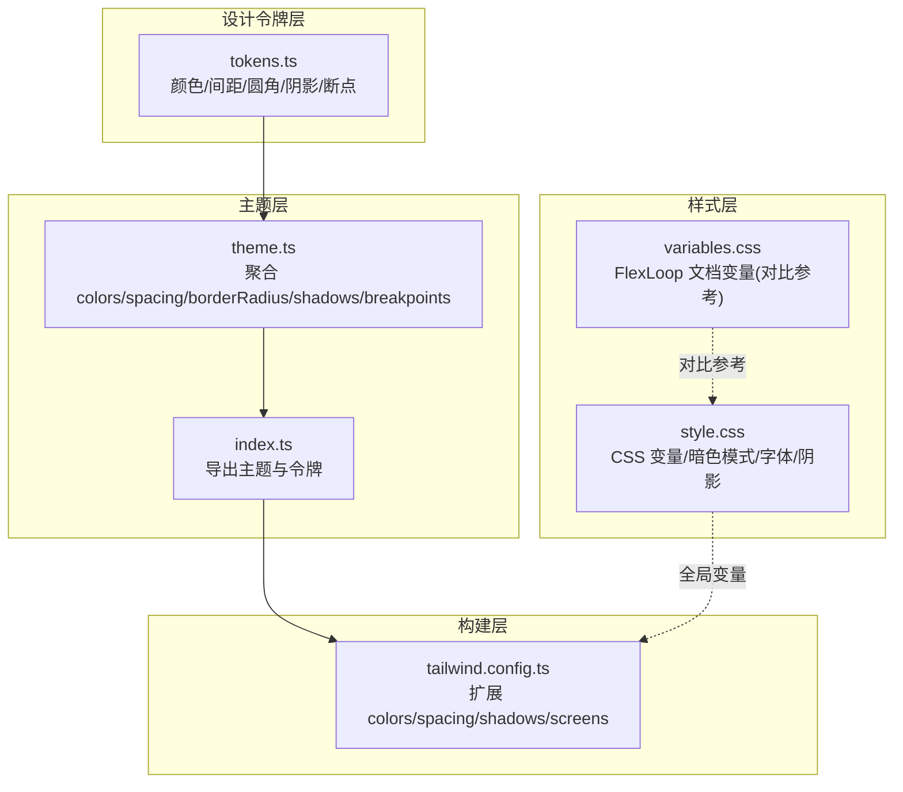
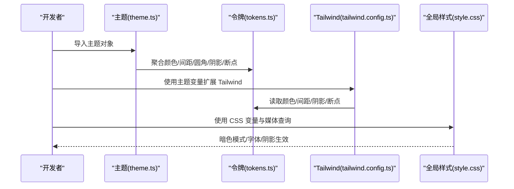
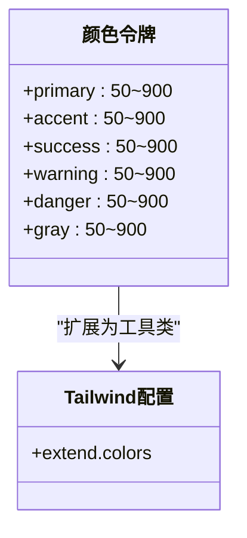
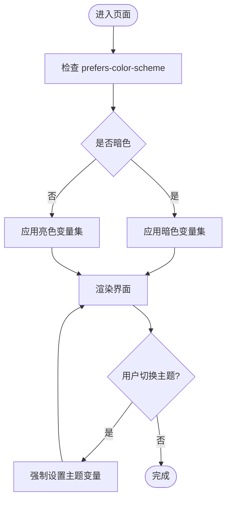
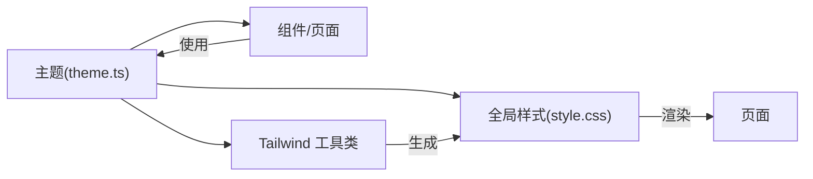
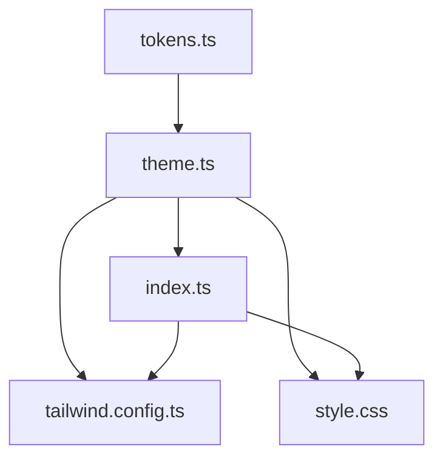

# 设计系统规范

<cite>
**本文引用的文件**
- [apps/AgentPit/tailwind.config.ts](file://apps/AgentPit/tailwind.config.ts)
- [apps/AgentPit/packages/ui/src/styles/tokens.ts](file://apps/AgentPit/packages/ui/src/styles/tokens.ts)
- [apps/AgentPit/packages/ui/src/styles/theme.ts](file://apps/AgentPit/packages/ui/src/styles/theme.ts)
- [apps/AgentPit/packages/ui/src/styles/index.ts](file://apps/AgentPit/packages/ui/src/styles/index.ts)
- [apps/AgentPit/src/style.css](file://apps/AgentPit/src/style.css)
- [tools/flexloop/doc/_static/variables.css](file://tools/flexloop/doc/_static/variables.css)
- [apps/AgentPit/docs/COMPONENT_LIBRARY_ARCHITECTURE.md](file://apps/AgentPit/docs/COMPONENT_LIBRARY_ARCHITECTURE.md)
</cite>

## 目录
1. [简介](#简介)
2. [项目结构](#项目结构)
3. [核心组件](#核心组件)
4. [架构总览](#架构总览)
5. [详细组件分析](#详细组件分析)
6. [依赖分析](#依赖分析)
7. [性能考虑](#性能考虑)
8. [故障排查指南](#故障排查指南)
9. [结论](#结论)
10. [附录](#附录)

## 简介
本文件为设计系统规范的技术文档，面向前端与设计团队，系统性阐述颜色体系、字体规范、间距系统、阴影效果等设计原则；解释主题系统的架构设计、变量定义、响应式断点、暗色模式支持等实现细节；明确设计令牌的命名规范、层级关系与使用场景；给出设计系统与实际开发的映射关系、组件设计约束与一致性保证机制，并提供扩展方式、自定义配置与版本管理的维护指南。

## 项目结构
设计系统在 AgentPit 应用中采用“设计令牌 + 主题聚合 + Tailwind 扩展”的分层组织方式：
- 设计令牌：集中定义颜色、间距、圆角、阴影、断点等基础变量
- 主题聚合：将令牌打包为可消费的主题对象
- Tailwind 配置：将令牌扩展到工具类，统一生成 CSS
- 全局样式：通过 CSS 变量提供暗色模式、字体族、阴影等全局能力

**图表来源**
- [apps/AgentPit/packages/ui/src/styles/tokens.ts:1-121](file://apps/AgentPit/packages/ui/src/styles/tokens.ts#L1-L121)
- [apps/AgentPit/packages/ui/src/styles/theme.ts:1-12](file://apps/AgentPit/packages/ui/src/styles/theme.ts#L1-L12)
- [apps/AgentPit/packages/ui/src/styles/index.ts:1-2](file://apps/AgentPit/packages/ui/src/styles/index.ts#L1-L2)
- [apps/AgentPit/src/style.css:1-299](file://apps/AgentPit/src/style.css#L1-L299)
- [apps/AgentPit/tailwind.config.ts:1-27](file://apps/AgentPit/tailwind.config.ts#L1-L27)
- [tools/flexloop/doc/_static/variables.css:1-87](file://tools/flexloop/doc/_static/variables.css#L1-L87)

**章节来源**
- [apps/AgentPit/packages/ui/src/styles/tokens.ts:1-121](file://apps/AgentPit/packages/ui/src/styles/tokens.ts#L1-L121)
- [apps/AgentPit/packages/ui/src/styles/theme.ts:1-12](file://apps/AgentPit/packages/ui/src/styles/theme.ts#L1-L12)
- [apps/AgentPit/packages/ui/src/styles/index.ts:1-2](file://apps/AgentPit/packages/ui/src/styles/index.ts#L1-L2)
- [apps/AgentPit/src/style.css:1-299](file://apps/AgentPit/src/style.css#L1-L299)
- [apps/AgentPit/tailwind.config.ts:1-27](file://apps/AgentPit/tailwind.config.ts#L1-L27)
- [tools/flexloop/doc/_static/variables.css:1-87](file://tools/flexloop/doc/_static/variables.css#L1-L87)

## 核心组件
- 颜色体系：主色、强调色、成功/警告/危险/灰度等语义化色板，提供 50–900 的等级化映射
- 间距系统：以 4px 为步进的离散间距集合，覆盖内边距、外边距、网格间距等
- 圆角系统：从 none 到 full 的圆角分级
- 阴影系统：提供 sm/md/lg/xl/2xl 等层级化阴影
- 响应式断点：sm/md/lg/xl/2xl 五级断点，适配移动端到大屏
- 字体规范：sans/heading/mono 三类字体族变量，配合字号、行高、字重、字距
- 暗色模式：基于 prefers-color-scheme 的自动切换与手动覆盖

**章节来源**
- [apps/AgentPit/packages/ui/src/styles/tokens.ts:1-121](file://apps/AgentPit/packages/ui/src/styles/tokens.ts#L1-L121)
- [apps/AgentPit/src/style.css:1-299](file://apps/AgentPit/src/style.css#L1-L299)
- [apps/AgentPit/tailwind.config.ts:1-27](file://apps/AgentPit/tailwind.config.ts#L1-L27)

## 架构总览
设计系统通过“令牌 → 主题 → Tailwind 扩展 → 全局样式”的链路，将设计语言转化为可复用的开发资产。主题对象作为中间层，既可被组件直接消费，也可被 Tailwind 配置扩展为原子化工具类，从而在模板中直接使用。

**图表来源**
- [apps/AgentPit/packages/ui/src/styles/theme.ts:1-12](file://apps/AgentPit/packages/ui/src/styles/theme.ts#L1-L12)
- [apps/AgentPit/packages/ui/src/styles/tokens.ts:1-121](file://apps/AgentPit/packages/ui/src/styles/tokens.ts#L1-L121)
- [apps/AgentPit/tailwind.config.ts:1-27](file://apps/AgentPit/tailwind.config.ts#L1-L27)
- [apps/AgentPit/src/style.css:1-299](file://apps/AgentPit/src/style.css#L1-L299)

## 详细组件分析

### 颜色体系设计
- 语义化色板：primary/accent/success/warning/danger/gray 提供一致的等级化映射，便于跨组件一致性
- 等级化数值：50–900 的递增梯度，满足不同对比度与层级需求
- 与 Tailwind 集成：通过 tailwind.config.ts 将颜色扩展为工具类，如 text-primary-500、bg-accent-200 等

**图表来源**
- [apps/AgentPit/packages/ui/src/styles/tokens.ts:1-74](file://apps/AgentPit/packages/ui/src/styles/tokens.ts#L1-L74)
- [apps/AgentPit/tailwind.config.ts:1-27](file://apps/AgentPit/tailwind.config.ts#L1-L27)

**章节来源**
- [apps/AgentPit/packages/ui/src/styles/tokens.ts:1-74](file://apps/AgentPit/packages/ui/src/styles/tokens.ts#L1-L74)
- [apps/AgentPit/tailwind.config.ts:1-27](file://apps/AgentPit/tailwind.config.ts#L1-L27)

### 字体规范
- 字体族：--sans、--heading、--mono 三类变量，分别用于正文、标题与代码
- 字号与行高：h1/h2/p 等标签结合字号、行高、字距，形成清晰的层级
- 字体渲染优化：开启抗锯齿与字体合成提示，提升可读性

**章节来源**
- [apps/AgentPit/src/style.css:16-83](file://apps/AgentPit/src/style.css#L16-L83)

### 间距系统
- 步进规则：以 4px 为最小单位，覆盖 0–24（对应 0–96px）的常用间距
- 使用场景：容器内边距、元素间距、栅格间隔、组件内外边距等
- 与 Tailwind 集成：通过 spacing 扩展生成 px 工具类，如 p-4、m-6、gap-2 等

**章节来源**
- [apps/AgentPit/packages/ui/src/styles/tokens.ts:76-92](file://apps/AgentPit/packages/ui/src/styles/tokens.ts#L76-L92)
- [apps/AgentPit/tailwind.config.ts:1-27](file://apps/AgentPit/tailwind.config.ts#L1-L27)

### 阴影效果
- 层级化阴影：sm/md/lg/xl/2xl 五级，满足卡片、浮层、弹窗等不同层级
- 统一语法：采用 Tailwind 推荐的阴影语法，确保生成一致的投影效果
- 全局阴影：通过 CSS 变量 --shadow 在交互态（如按钮悬停）中复用

**章节来源**
- [apps/AgentPit/packages/ui/src/styles/tokens.ts:105-112](file://apps/AgentPit/packages/ui/src/styles/tokens.ts#L105-L112)
- [apps/AgentPit/src/style.css:13-14](file://apps/AgentPit/src/style.css#L13-L14)

### 圆角系统
- 分级圆角：none/sm/md/lg/xl/2xl/3xl/full，覆盖从锐角到全圆的场景
- 组件一致性：按钮、卡片、输入框、模态框等统一使用圆角令牌

**章节来源**
- [apps/AgentPit/packages/ui/src/styles/tokens.ts:94-103](file://apps/AgentPit/packages/ui/src/styles/tokens.ts#L94-L103)

### 响应式断点
- 断点定义：sm/md/lg/xl/2xl 五级，适配移动端到超宽屏
- 使用方式：Tailwind screens 扩展与媒体查询并用，确保在组件与布局中一致生效

**章节来源**
- [apps/AgentPit/packages/ui/src/styles/tokens.ts:114-120](file://apps/AgentPit/packages/ui/src/styles/tokens.ts#L114-L120)
- [apps/AgentPit/tailwind.config.ts:1-27](file://apps/AgentPit/tailwind.config.ts#L1-L27)

### 暗色模式支持
- 自动检测：基于 prefers-color-scheme，自动切换明/暗两套变量
- 手动覆盖：通过根元素或状态切换，实现用户偏好控制
- 全局应用：文本、背景、边框、强调色、阴影等均随主题切换

**图表来源**
- [apps/AgentPit/src/style.css:35-53](file://apps/AgentPit/src/style.css#L35-L53)

**章节来源**
- [apps/AgentPit/src/style.css:35-53](file://apps/AgentPit/src/style.css#L35-L53)

### 设计令牌命名规范与层级关系
- 命名规范：语义化前缀 + 等级后缀（如 primary-500），避免视觉描述
- 层级关系：颜色/间距/圆角/阴影/断点各自独立，通过主题聚合统一导出
- 使用场景：颜色用于语义表达与品牌一致性；间距用于布局与对齐；圆角用于视觉柔和；阴影用于层级与焦点；断点用于响应式适配

**章节来源**
- [apps/AgentPit/packages/ui/src/styles/tokens.ts:1-121](file://apps/AgentPit/packages/ui/src/styles/tokens.ts#L1-L121)
- [apps/AgentPit/packages/ui/src/styles/theme.ts:1-12](file://apps/AgentPit/packages/ui/src/styles/theme.ts#L1-L12)

### 设计系统与实际开发的映射关系
- 组件消费：组件直接导入主题对象，按需使用颜色、间距、圆角、阴影
- 原子化工具：Tailwind 扩展将令牌转为工具类，模板中直接使用
- 全局样式：CSS 变量与媒体查询保障全局一致性与暗色模式

**图表来源**
- [apps/AgentPit/packages/ui/src/styles/theme.ts:1-12](file://apps/AgentPit/packages/ui/src/styles/theme.ts#L1-L12)
- [apps/AgentPit/tailwind.config.ts:1-27](file://apps/AgentPit/tailwind.config.ts#L1-L27)
- [apps/AgentPit/src/style.css:1-299](file://apps/AgentPit/src/style.css#L1-L299)

**章节来源**
- [apps/AgentPit/packages/ui/src/styles/index.ts:1-2](file://apps/AgentPit/packages/ui/src/styles/index.ts#L1-L2)
- [apps/AgentPit/tailwind.config.ts:1-27](file://apps/AgentPit/tailwind.config.ts#L1-L27)
- [apps/AgentPit/src/style.css:1-299](file://apps/AgentPit/src/style.css#L1-L299)

### 组件设计约束与一致性保证机制
- 约束：组件必须使用主题令牌，不得硬编码颜色/间距/圆角/阴影
- 一致性：通过统一的主题对象与 Tailwind 工具类，确保跨页面、跨组件的一致表现
- 审查：新增组件需在设计令牌中补充必要变量，或复用现有令牌

**章节来源**
- [apps/AgentPit/packages/ui/src/styles/theme.ts:1-12](file://apps/AgentPit/packages/ui/src/styles/theme.ts#L1-L12)
- [apps/AgentPit/packages/ui/src/styles/tokens.ts:1-121](file://apps/AgentPit/packages/ui/src/styles/tokens.ts#L1-L121)

### 扩展方式、自定义配置与版本管理
- 扩展方式：在 tokens.ts 新增令牌，theme.ts 聚合，tailwind.config.ts 扩展，style.css 补充全局变量
- 自定义配置：通过 tailwind.config.ts 的 extend 区域添加新令牌或覆盖默认值
- 版本管理：建议以 Git 标签或变更日志记录令牌变更，配合组件库发布流程同步更新

**章节来源**
- [apps/AgentPit/packages/ui/src/styles/tokens.ts:1-121](file://apps/AgentPit/packages/ui/src/styles/tokens.ts#L1-L121)
- [apps/AgentPit/packages/ui/src/styles/theme.ts:1-12](file://apps/AgentPit/packages/ui/src/styles/theme.ts#L1-L12)
- [apps/AgentPit/tailwind.config.ts:1-27](file://apps/AgentPit/tailwind.config.ts#L1-L27)

## 依赖分析
设计系统各模块之间的依赖关系如下：

**图表来源**
- [apps/AgentPit/packages/ui/src/styles/tokens.ts:1-121](file://apps/AgentPit/packages/ui/src/styles/tokens.ts#L1-L121)
- [apps/AgentPit/packages/ui/src/styles/theme.ts:1-12](file://apps/AgentPit/packages/ui/src/styles/theme.ts#L1-L12)
- [apps/AgentPit/packages/ui/src/styles/index.ts:1-2](file://apps/AgentPit/packages/ui/src/styles/index.ts#L1-L2)
- [apps/AgentPit/tailwind.config.ts:1-27](file://apps/AgentPit/tailwind.config.ts#L1-L27)
- [apps/AgentPit/src/style.css:1-299](file://apps/AgentPit/src/style.css#L1-L299)

**章节来源**
- [apps/AgentPit/packages/ui/src/styles/index.ts:1-2](file://apps/AgentPit/packages/ui/src/styles/index.ts#L1-L2)
- [apps/AgentPit/packages/ui/src/styles/theme.ts:1-12](file://apps/AgentPit/packages/ui/src/styles/theme.ts#L1-L12)
- [apps/AgentPit/tailwind.config.ts:1-27](file://apps/AgentPit/tailwind.config.ts#L1-L27)
- [apps/AgentPit/src/style.css:1-299](file://apps/AgentPit/src/style.css#L1-L299)

## 性能考虑
- 原子化工具：Tailwind 工具类按需生成，减少自定义 CSS 数量，提升构建效率
- 变量复用：CSS 变量与令牌复用，降低重复定义与计算成本
- 响应式策略：优先使用 Tailwind 断点，避免过多媒体查询导致的样式膨胀

## 故障排查指南
- 暗色模式不生效：检查 :root 中变量是否正确覆盖，确认 prefers-color-scheme 媒体查询逻辑
- 颜色/间距未生成工具类：确认 tailwind.config.ts 的 extend 是否包含对应令牌
- 字体显示异常：核对 --sans/--heading/--mono 变量与系统字体栈
- 阴影层级不一致：统一使用阴影令牌，避免直接写死阴影值

**章节来源**
- [apps/AgentPit/src/style.css:35-53](file://apps/AgentPit/src/style.css#L35-L53)
- [apps/AgentPit/tailwind.config.ts:1-27](file://apps/AgentPit/tailwind.config.ts#L1-L27)

## 结论
本设计系统通过“令牌 → 主题 → Tailwind 扩展 → 全局样式”的分层架构，实现了设计语言到开发资产的高效映射。颜色、字体、间距、阴影与断点等设计要素统一管理，配合暗色模式与响应式策略，确保了跨页面、跨组件的一致性与可维护性。建议在后续迭代中持续完善令牌覆盖范围、加强组件约束与审查流程，并建立完善的版本与发布机制。

## 附录
- 对比参考：FlexLoop 文档站点的 CSS 变量文件，展示了另一套变量体系与暗色/高对比度模式的实现思路，可用于横向对比与迁移参考。

**章节来源**
- [tools/flexloop/doc/_static/variables.css:1-87](file://tools/flexloop/doc/_static/variables.css#L1-L87)