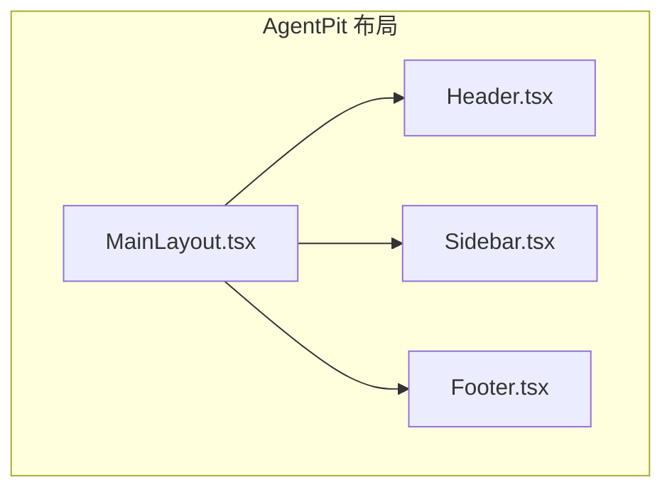
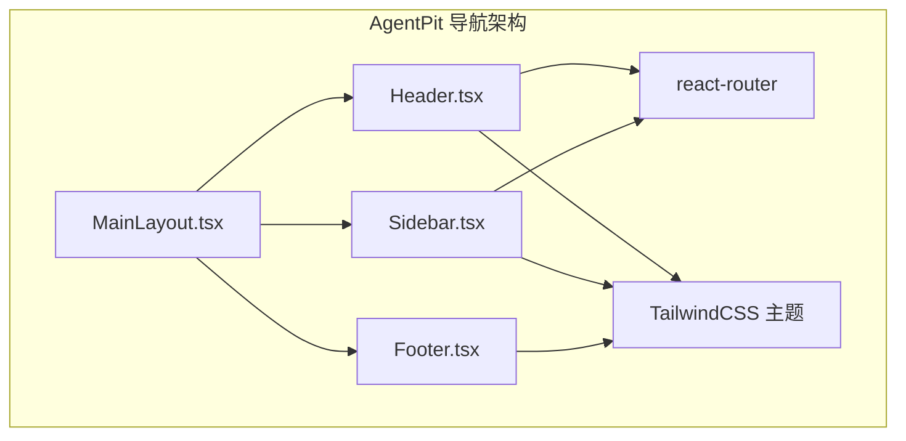
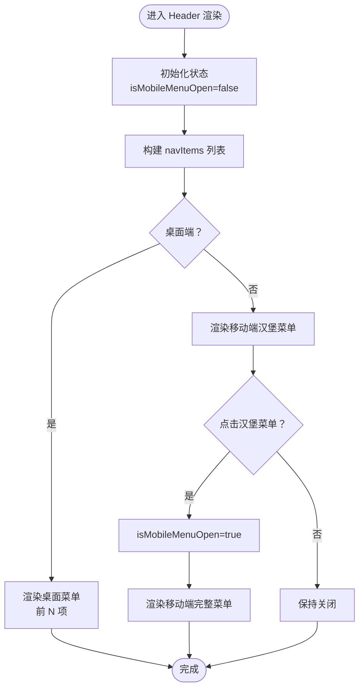
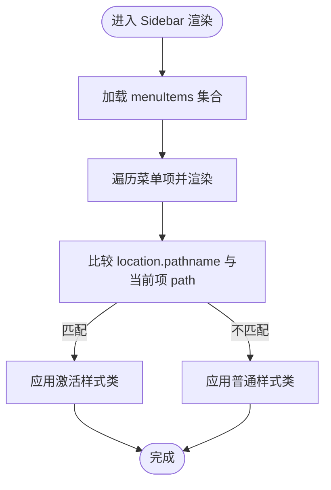
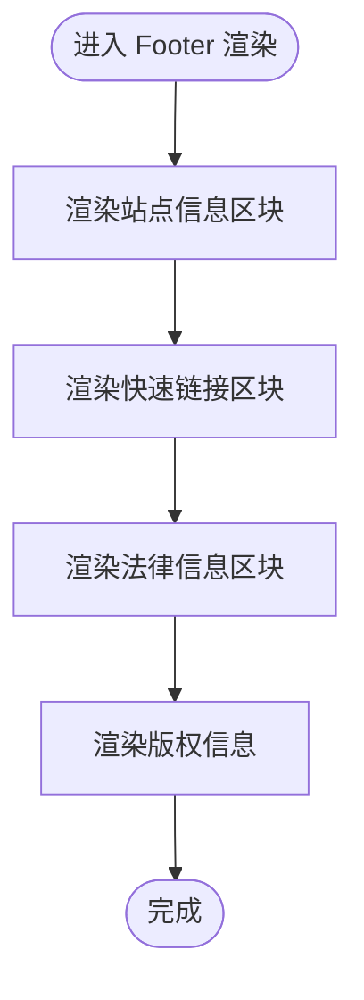
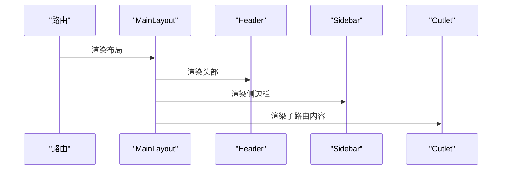
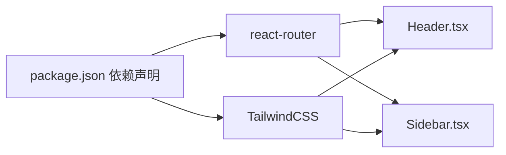

# 导航组件设计

<cite>
**本文引用的文件**
- [Header.tsx](file://apps/AgentPit/src-react-backup-20260410/components/layout/Header.tsx)
- [Sidebar.tsx](file://apps/AgentPit/src-react-backup-20260410/components/layout/Sidebar.tsx)
- [Footer.tsx](file://apps/AgentPit/src-react-backup-20260410/components/layout/Footer.tsx)
- [MainLayout.tsx](file://apps/AgentPit/src-react-backup-20260410/components/layout/MainLayout.tsx)
- [Header.tsx](file://apps/daoNexus/src/components/Header.tsx)
- [Footer.tsx](file://apps/daoNexus/src/components/Footer.tsx)
- [Header.tsx](file://apps/forum/src/components/layout/Header.tsx)
- [Sidebar.tsx](file://apps/growth-tracker/src/components/Sidebar.tsx)
- [tailwind.config.ts](file://apps/AgentPit/tailwind.config.ts)
- [package.json](file://apps/AgentPit/package.json)
</cite>

## 目录
1. [引言](#引言)
2. [项目结构](#项目结构)
3. [核心组件](#核心组件)
4. [架构总览](#架构总览)
5. [详细组件分析](#详细组件分析)
6. [依赖关系分析](#依赖关系分析)
7. [性能考虑](#性能考虑)
8. [故障排查指南](#故障排查指南)
9. [结论](#结论)
10. [附录](#附录)

## 引言
本技术文档围绕导航组件设计进行系统化梳理，重点覆盖头部导航、侧边栏菜单与底部导航三大组件在不同应用中的实现方式；深入解释状态管理、路由激活状态处理、动态菜单生成机制；总结响应式导航的设计原则与移动端适配策略，并给出无障碍访问支持建议。同时提供样式定制、主题切换与国际化支持的实践指南，帮助读者在现有代码基础上扩展与优化导航体验。

## 项目结构
本仓库包含多个前端应用，导航组件在不同应用中有差异化实现。AgentPit 应用采用经典的“头部 + 侧边栏 + 主内容 + 底部”的布局；daoNexus 与 forum 应用展示了更丰富的交互与状态管理；growth-tracker 展示了固定侧边栏与图标导航的模式。下图概览了 AgentPit 的导航相关文件组织：

图表来源
- [MainLayout.tsx:1-22](file://apps/AgentPit/src-react-backup-20260410/components/layout/MainLayout.tsx#L1-L22)
- [Header.tsx:1-99](file://apps/AgentPit/src-react-backup-20260410/components/layout/Header.tsx#L1-L99)
- [Sidebar.tsx:1-137](file://apps/AgentPit/src-react-backup-20260410/components/layout/Sidebar.tsx#L1-L137)
- [Footer.tsx:1-46](file://apps/AgentPit/src-react-backup-20260410/components/layout/Footer.tsx#L1-L46)

章节来源
- [MainLayout.tsx:1-22](file://apps/AgentPit/src-react-backup-20260410/components/layout/MainLayout.tsx#L1-L22)
- [Header.tsx:1-99](file://apps/AgentPit/src-react-backup-20260410/components/layout/Header.tsx#L1-L99)
- [Sidebar.tsx:1-137](file://apps/AgentPit/src-react-backup-20260410/components/layout/Sidebar.tsx#L1-L137)
- [Footer.tsx:1-46](file://apps/AgentPit/src-react-backup-20260410/components/layout/Footer.tsx#L1-L46)

## 核心组件
- 头部导航（Header）：负责品牌标识、主导航菜单、移动端汉堡菜单、用户入口与搜索入口等。通过路由位置判断当前激活项，提供桌面端与移动端两套渲染逻辑。
- 侧边栏菜单（Sidebar）：提供垂直导航列表，支持图标与文字组合，基于路由位置高亮当前页，桌面端默认展开，移动端隐藏。
- 底部导航（Footer）：提供站点信息、快速链接与法律信息区域，统一版权信息展示。
- 主布局（MainLayout）：整合 Header、Sidebar、主内容区与 Footer，形成页面骨架。

章节来源
- [Header.tsx:1-99](file://apps/AgentPit/src-react-backup-20260410/components/layout/Header.tsx#L1-L99)
- [Sidebar.tsx:1-137](file://apps/AgentPit/src-react-backup-20260410/components/layout/Sidebar.tsx#L1-L137)
- [Footer.tsx:1-46](file://apps/AgentPit/src-react-backup-20260410/components/layout/Footer.tsx#L1-L46)
- [MainLayout.tsx:1-22](file://apps/AgentPit/src-react-backup-20260410/components/layout/MainLayout.tsx#L1-L22)

## 架构总览
AgentPit 的导航体系以 MainLayout 为中心，Header 与 Sidebar 分别承担顶部与左侧导航职责，Footer 提供站点级信息。路由状态由 react-router 提供，组件通过 useLocation 或 NavLink 判断当前激活项。TailwindCSS 提供基础样式与主题色变量，可扩展至暗色模式与多主题。

图表来源
- [MainLayout.tsx:1-22](file://apps/AgentPit/src-react-backup-20260410/components/layout/MainLayout.tsx#L1-L22)
- [Header.tsx:1-99](file://apps/AgentPit/src-react-backup-20260410/components/layout/Header.tsx#L1-L99)
- [Sidebar.tsx:1-137](file://apps/AgentPit/src-react-backup-20260410/components/layout/Sidebar.tsx#L1-L137)
- [Footer.tsx:1-46](file://apps/AgentPit/src-react-backup-20260410/components/layout/Footer.tsx#L1-L46)
- [tailwind.config.ts:1-27](file://apps/AgentPit/tailwind.config.ts#L1-L27)

## 详细组件分析

### 头部导航（Header）
- 路由激活状态：通过 useLocation 获取当前路径，与菜单项路径对比，动态切换激活样式类。
- 移动端适配：使用 useState 控制汉堡菜单开关，移动端显示完整菜单列表。
- 动态菜单生成：navItems 数组集中定义导航项，支持按需切片或全量渲染。
- 交互元素：搜索按钮与用户头像占位，便于后续接入真实功能。

图表来源
- [Header.tsx:1-99](file://apps/AgentPit/src-react-backup-20260410/components/layout/Header.tsx#L1-L99)

章节来源
- [Header.tsx:1-99](file://apps/AgentPit/src-react-backup-20260410/components/layout/Header.tsx#L1-L99)

### 侧边栏菜单（Sidebar）
- 路由激活状态：基于 useLocation 判断当前路径，高亮匹配项。
- 图标与文本：每项包含 SVG 图标与标签，增强可识别性。
- 响应式行为：默认仅桌面端可见，移动端隐藏，避免遮挡主内容。
- 可扩展性：菜单项集中配置，便于增删改。

图表来源
- [Sidebar.tsx:1-137](file://apps/AgentPit/src-react-backup-20260410/components/layout/Sidebar.tsx#L1-L137)

章节来源
- [Sidebar.tsx:1-137](file://apps/AgentPit/src-react-backup-20260410/components/layout/Sidebar.tsx#L1-L137)

### 底部导航（Footer）
- 结构清晰：站点信息、快速链接、法律信息三列布局，移动端堆叠。
- 版权信息：动态年份，统一风格。
- 适用性：适合信息型站点，可按需扩展为多语言版本。

图表来源
- [Footer.tsx:1-46](file://apps/AgentPit/src-react-backup-20260410/components/layout/Footer.tsx#L1-L46)

章节来源
- [Footer.tsx:1-46](file://apps/AgentPit/src-react-backup-20260410/components/layout/Footer.tsx#L1-L46)

### 主布局（MainLayout）
- 组织结构：Header 在上、Sidebar 左侧、主内容区右侧、Footer 在下，形成稳定骨架。
- 内容占位：主内容区使用 Outlet 接收子路由内容，保证页面切换时布局不变。

图表来源
- [MainLayout.tsx:1-22](file://apps/AgentPit/src-react-backup-20260410/components/layout/MainLayout.tsx#L1-L22)

章节来源
- [MainLayout.tsx:1-22](file://apps/AgentPit/src-react-backup-20260410/components/layout/MainLayout.tsx#L1-L22)

### 其他应用的导航实践（对比参考）
- daoNexus：头部简洁，强调品牌与外部链接，适合门户型站点。
- forum：头部集成搜索、通知、用户菜单等复杂交互，体现社区型应用的导航需求。
- growth-tracker：固定侧边栏，使用 NavLink 的 isActive 状态进行高亮，图标+文字组合，适合工具型应用。

章节来源
- [Header.tsx:1-39](file://apps/daoNexus/src/components/Header.tsx#L1-L39)
- [Footer.tsx:1-34](file://apps/daoNexus/src/components/Footer.tsx#L1-L34)
- [Header.tsx:1-188](file://apps/forum/src/components/layout/Header.tsx#L1-L188)
- [Sidebar.tsx:1-74](file://apps/growth-tracker/src/components/Sidebar.tsx#L1-L74)

## 依赖关系分析
- 路由依赖：Header 与 Sidebar 均依赖 react-router 的路由能力（useLocation、Link/NavLink），用于激活状态判断与跳转。
- 样式依赖：TailwindCSS 提供基础样式与主题色变量，支持主题扩展与响应式断点。
- 包管理：AgentPit 使用 Vue 生态，但导航组件为 React 文件备份，实际运行需确保路由与样式依赖一致。

图表来源
- [Header.tsx:1-99](file://apps/AgentPit/src-react-backup-20260410/components/layout/Header.tsx#L1-L99)
- [Sidebar.tsx:1-137](file://apps/AgentPit/src-react-backup-20260410/components/layout/Sidebar.tsx#L1-L137)
- [tailwind.config.ts:1-27](file://apps/AgentPit/tailwind.config.ts#L1-L27)
- [package.json:1-73](file://apps/AgentPit/package.json#L1-L73)

章节来源
- [package.json:1-73](file://apps/AgentPit/package.json#L1-L73)
- [tailwind.config.ts:1-27](file://apps/AgentPit/tailwind.config.ts#L1-L27)

## 性能考虑
- 菜单渲染优化：桌面端可对菜单进行分段渲染（如仅渲染前 N 项），移动端再渲染完整列表，减少首屏渲染压力。
- 激活状态计算：useLocation 每次渲染都会读取当前路径，建议在高频场景下结合 useMemo 缓存计算结果。
- 图标资源：SVG 内联可减少请求，若使用外部图标库，注意按需引入与懒加载策略。
- 响应式断点：合理利用 Tailwind 断点，避免在小屏设备上渲染过多内容导致重排。

## 故障排查指南
- 激活状态不生效
  - 检查路由路径是否与菜单项 path 完全一致（含末尾斜杠）。
  - 确认 useLocation 返回的 pathname 与菜单项匹配。
- 移动端菜单无法打开
  - 确认 isMobileMenuOpen 状态切换逻辑未被外部事件覆盖。
  - 检查容器样式是否被覆盖导致点击区域异常。
- 样式异常
  - 确认 Tailwind 配置的 content 路径包含对应组件目录。
  - 检查主题色 primary 是否正确扩展，避免样式冲突。
- 无障碍问题
  - 为汉堡菜单添加 aria-expanded 与 aria-controls，提升屏幕阅读器可用性。
  - 为链接添加合适的 title 或 aria-label，明确跳转目标。

章节来源
- [Header.tsx:1-99](file://apps/AgentPit/src-react-backup-20260410/components/layout/Header.tsx#L1-L99)
- [Sidebar.tsx:1-137](file://apps/AgentPit/src-react-backup-20260410/components/layout/Sidebar.tsx#L1-L137)
- [tailwind.config.ts:1-27](file://apps/AgentPit/tailwind.config.ts#L1-L27)

## 结论
AgentPit 的导航组件以简洁、模块化为核心，通过集中式菜单配置与路由状态联动，实现了良好的可维护性与可扩展性。配合 TailwindCSS 的主题系统，可在不破坏结构的前提下实现样式定制与主题切换。针对不同应用场景，可参考 daoNexus 的极简风格、forum 的丰富交互与 growth-tracker 的固定侧边栏模式，进一步完善导航体验。

## 附录

### 响应式设计与移动端适配
- 断点策略：使用 md/lg 等断点控制桌面端菜单与侧边栏显示；移动端使用汉堡菜单承载完整导航。
- 触控体验：确保点击目标足够大，菜单弹出层具备合理的定位与遮罩策略。
- 性能优化：移动端优先渲染必要内容，延迟加载非关键资源。

### 无障碍访问支持建议
- 键盘可达：确保所有可交互元素可通过 Tab 访问，提供焦点可见性。
- 屏幕阅读器：为图标与按钮提供语义化标签，描述其作用与状态。
- 对比度：确保激活态与悬停态具备足够的颜色对比度。

### 样式定制与主题切换
- 主题色扩展：在 Tailwind 主题中扩展 primary 色阶，满足品牌一致性。
- 暗色模式：通过 CSS 变量或自定义类名切换深浅主题，确保组件在不同模式下均清晰可读。
- 组件级覆盖：为 Header、Sidebar、Footer 提供可配置的 className 注入点，便于在业务层微调。

章节来源
- [tailwind.config.ts:1-27](file://apps/AgentPit/tailwind.config.ts#L1-L27)

### 国际化支持
- 文案提取：将菜单项 label 抽离为 i18n 键值，按语言环境动态渲染。
- 路由与导航：保持 path 不变，仅替换显示文案；确保多语言切换不影响激活状态判断。
- RTL 支持：在需要时调整布局方向与图标镜像，保证视觉一致性。