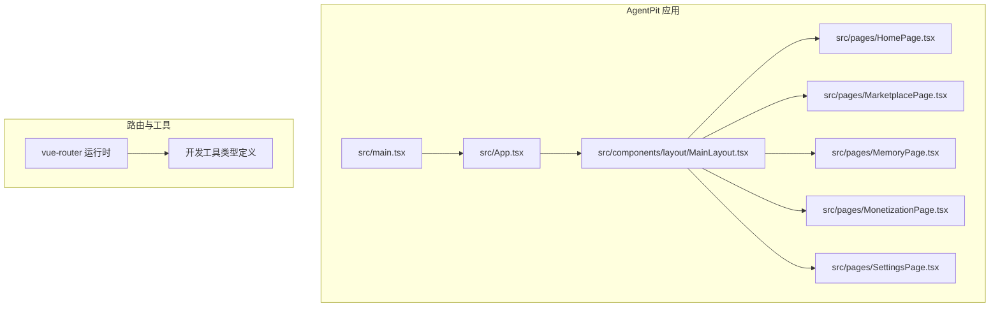
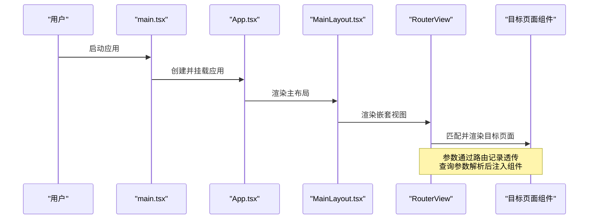
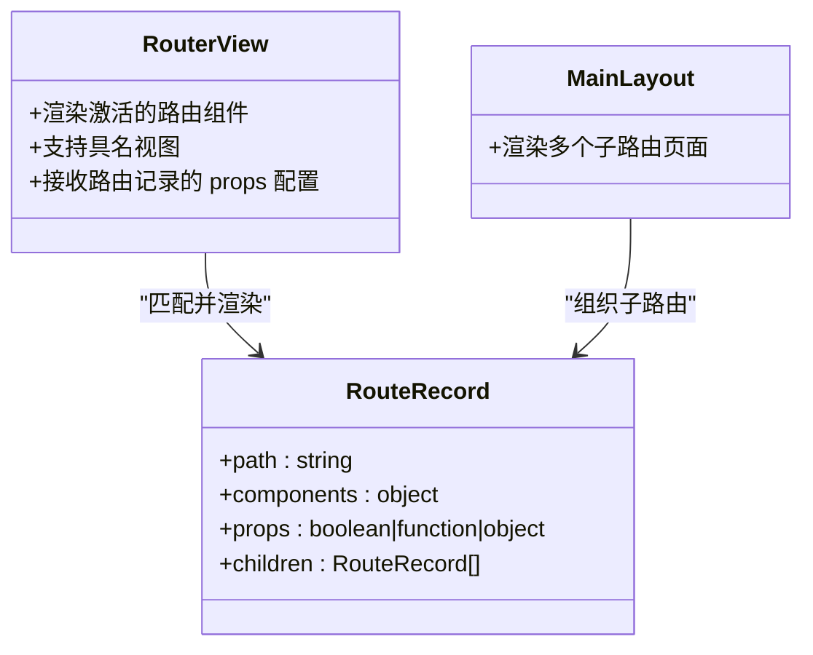
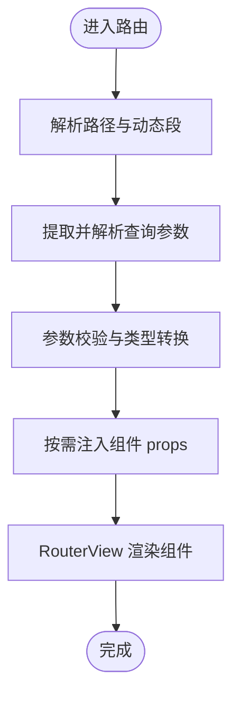
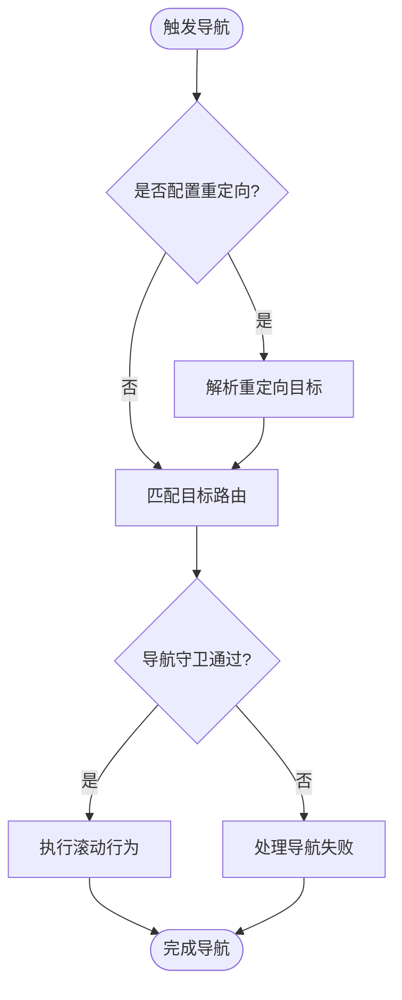
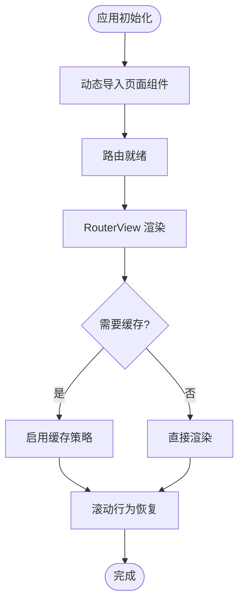
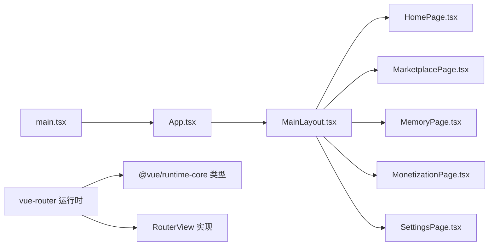

# 嵌套路由处理

<cite>
**本文引用的文件**
- [MIGRATION_MAPPING.md](file://apps/AgentPit/docs/MIGRATION_MAPPING.md)
- [VUE3_COMPONENT_GUIDE.md](file://apps/AgentPit/docs/VUE3_COMPONENT_GUIDE.md)
- [vue-router.d.ts](file://apps/AgentPit/node_modules/vue-router/dist/router-CWoNjPRp.d.mts)
- [vue-router.cjs](file://apps/AgentPit/node_modules/vue-router/dist/vue-router.cjs)
- [devtools-EWN81iOl.mjs](file://apps/AgentPit/node_modules/vue-router/dist/devtools-EWN81iOl.mjs)
- [runtime-core.d.ts](file://apps/AgentPit/node_modules/@vue/runtime-core/dist/runtime-core.d.ts)
- [MainLayout.tsx](file://apps/AgentPit/src/components/layout/MainLayout.tsx)
- [HomePage.tsx](file://apps/AgentPit/src/pages/HomePage.tsx)
- [MarketplacePage.tsx](file://apps/AgentPit/src/pages/MarketplacePage.tsx)
- [MemoryPage.tsx](file://apps/AgentPit/src/pages/MemoryPage.tsx)
- [MonetizationPage.tsx](file://apps/AgentPit/src/pages/MonetizationPage.tsx)
- [SettingsPage.tsx](file://apps/AgentPit/src/pages/SettingsPage.tsx)
- [App.tsx](file://apps/AgentPit/src/App.tsx)
- [main.tsx](file://apps/AgentPit/src/main.tsx)
</cite>

## 目录
1. [简介](#简介)
2. [项目结构](#项目结构)
3. [核心组件](#核心组件)
4. [架构总览](#架构总览)
5. [详细组件分析](#详细组件分析)
6. [依赖关系分析](#依赖关系分析)
7. [性能考虑](#性能考虑)
8. [故障排查指南](#故障排查指南)
9. [结论](#结论)
10. [附录](#附录)

## 简介
本文件围绕 Vue Router 在本仓库中的嵌套路由处理进行系统化技术文档整理，涵盖以下主题：
- 嵌套路由概念与父子路由关系
- 嵌套视图（RouterView）的实现方式
- 路由参数传递、查询参数处理、路由重定向机制
- 性能优化、懒加载策略、缓存机制
- 最佳实践、常见问题与调试技巧

本仓库中已明确使用 vue-router v4，并在迁移与组件指南文档中体现了嵌套路由与 RouterView 的使用方式。

**章节来源**
- [MIGRATION_MAPPING.md:1-50](file://apps/AgentPit/docs/MIGRATION_MAPPING.md#L1-L50)
- [VUE3_COMPONENT_GUIDE.md:1-100](file://apps/AgentPit/docs/VUE3_COMPONENT_GUIDE.md#L1-L100)

## 项目结构
本项目采用多应用架构，其中 AgentPit 应用使用 Vue 3 + TypeScript + Vite 构建，路由系统基于 vue-router v4。关键目录与文件如下：
- 文档：包含迁移映射与组件指南，体现嵌套路由与 RouterView 的使用
- 源码：页面组件位于 pages 目录，布局组件位于 components/layout，应用入口在 src 下
- 路由运行时：通过 node_modules 中的 vue-router 提供类型与实现

**图表来源**
- [App.tsx](file://apps/AgentPit/src/App.tsx)
- [main.tsx](file://apps/AgentPit/src/main.tsx)
- [MainLayout.tsx](file://apps/AgentPit/src/components/layout/MainLayout.tsx)
- [HomePage.tsx](file://apps/AgentPit/src/pages/HomePage.tsx)
- [MarketplacePage.tsx](file://apps/AgentPit/src/pages/MarketplacePage.tsx)
- [MemoryPage.tsx](file://apps/AgentPit/src/pages/MemoryPage.tsx)
- [MonetizationPage.tsx](file://apps/AgentPit/src/pages/MonetizationPage.tsx)
- [SettingsPage.tsx](file://apps/AgentPit/src/pages/SettingsPage.tsx)
- [vue-router.cjs](file://apps/AgentPit/node_modules/vue-router/dist/vue-router.cjs)

**章节来源**
- [App.tsx](file://apps/AgentPit/src/App.tsx)
- [main.tsx](file://apps/AgentPit/src/main.tsx)
- [MainLayout.tsx](file://apps/AgentPit/src/components/layout/MainLayout.tsx)

## 核心组件
- 路由器与路由记录
  - 路由器类型与选项、匹配器、历史模式等由 vue-router 类型文件定义
  - 运行时实现提供 RouterView 渲染、导航守卫、滚动行为等能力
- 嵌套视图渲染
  - RouterView 组件负责根据当前激活路由渲染对应组件
  - 支持具名视图（components 字典）与参数透传（props）
- 页面与布局
  - 主布局组件承载多个子路由页面，形成典型的嵌套结构

**章节来源**
- [vue-router.d.ts:1-200](file://apps/AgentPit/node_modules/vue-router/dist/router-CWoNjPRp.d.mts#L1-L200)
- [vue-router.cjs:1897-2000](file://apps/AgentPit/node_modules/vue-router/dist/vue-router.cjs#L1897-L2000)
- [runtime-core.d.ts:1377-1390](file://apps/AgentPit/node_modules/@vue/runtime-core/dist/runtime-core.d.ts#L1377-L1390)

## 架构总览
下图展示从应用入口到嵌套视图渲染的整体流程，以及路由参数、查询参数与重定向的关键节点。

**图表来源**
- [main.tsx](file://apps/AgentPit/src/main.tsx)
- [App.tsx](file://apps/AgentPit/src/App.tsx)
- [MainLayout.tsx](file://apps/AgentPit/src/components/layout/MainLayout.tsx)
- [vue-router.cjs:1897-2000](file://apps/AgentPit/node_modules/vue-router/dist/vue-router.cjs#L1897-L2000)

## 详细组件分析

### 嵌套视图与父子路由关系
- 父子关系
  - 主布局组件作为父级容器，内部包含多个子路由页面，形成父子关系
  - 子路由通过 RouterView 渲染，父级负责布局与导航
- 具名视图
  - 路由记录支持 components 字典，允许在同一层级渲染多个具名视图
- 参数透传
  - 路由记录可配置 props 将参数/查询透传给渲染组件，便于解耦与测试

**图表来源**
- [vue-router.d.ts:870-970](file://apps/AgentPit/node_modules/vue-router/dist/router-CWoNjPRp.d.mts#L870-L970)
- [vue-router.cjs:1897-2000](file://apps/AgentPit/node_modules/vue-router/dist/vue-router.cjs#L1897-L2000)
- [MainLayout.tsx](file://apps/AgentPit/src/components/layout/MainLayout.tsx)

**章节来源**
- [vue-router.d.ts:870-970](file://apps/AgentPit/node_modules/vue-router/dist/router-CWoNjPRp.d.mts#L870-L970)
- [MainLayout.tsx](file://apps/AgentPit/src/components/layout/MainLayout.tsx)

### 路由参数传递与查询参数处理
- 路由参数（动态段）
  - 通过路由记录的 path 定义动态段，RouterView 渲染时将参数注入组件
- 查询参数（query）
  - 路由记录支持查询参数解析与规范化，组件可通过路由对象访问
- 参数校验与解析
  - 可通过参数解析器对参数进行类型转换与校验，保证数据一致性

**图表来源**
- [vue-router.d.ts:591-620](file://apps/AgentPit/node_modules/vue-router/dist/router-CWoNjPRp.d.mts#L591-L620)
- [vue-router.d.ts:1132-1150](file://apps/AgentPit/node_modules/vue-router/dist/router-CWoNjPRp.d.mts#L1132-L1150)

**章节来源**
- [vue-router.d.ts:591-620](file://apps/AgentPit/node_modules/vue-router/dist/router-CWoNjPRp.d.mts#L591-L620)
- [vue-router.d.ts:1132-1150](file://apps/AgentPit/node_modules/vue-router/dist/router-CWoNjPRp.d.mts#L1132-L1150)

### 路由重定向机制
- 重定向配置
  - 路由记录支持 redirect 选项，可将访问路径重定向至目标路径或命名路由
- 导航失败处理
  - 导航过程中可能因重复导航、取消、中止等产生导航失败，需正确处理返回值

**图表来源**
- [vue-router.d.ts:1077-1100](file://apps/AgentPit/node_modules/vue-router/dist/router-CWoNjPRp.d.mts#L1077-L1100)
- [devtools-EWN81iOl.mjs:740-750](file://apps/AgentPit/node_modules/vue-router/dist/devtools-EWN81iOl.mjs#L740-L750)

**章节来源**
- [vue-router.d.ts:1077-1100](file://apps/AgentPit/node_modules/vue-router/dist/router-CWoNjPRp.d.mts#L1077-L1100)
- [devtools-EWN81iOl.mjs:740-750](file://apps/AgentPit/node_modules/vue-router/dist/devtools-EWN81iOl.mjs#L740-L750)

### 懒加载与性能优化
- 懒加载策略
  - 页面组件可采用动态导入实现按需加载，减少首屏体积
- 缓存机制
  - 可结合 keep-alive 或自定义缓存策略，避免重复渲染带来的性能损耗
- 滚动行为
  - 配置 scrollBehavior 实现页面切换后的滚动位置恢复，提升用户体验

**图表来源**
- [vue-router.d.ts:1132-1150](file://apps/AgentPit/node_modules/vue-router/dist/router-CWoNjPRp.d.mts#L1132-L1150)
- [vue-router.cjs:1897-2000](file://apps/AgentPit/node_modules/vue-router/dist/vue-router.cjs#L1897-L2000)

**章节来源**
- [vue-router.d.ts:1132-1150](file://apps/AgentPit/node_modules/vue-router/dist/router-CWoNjPRp.d.mts#L1132-L1150)
- [vue-router.cjs:1897-2000](file://apps/AgentPit/node_modules/vue-router/dist/vue-router.cjs#L1897-L2000)

### 调试与最佳实践
- 使用指南与迁移映射
  - 文档明确了从 react-router 到 vue-router 的迁移差异，强调嵌套路由结构保持一致
  - 组件指南展示了 useRouter/useRoute 的使用方式与路由跳转
- 开发工具支持
  - vue-router 提供开发工具集成，便于在浏览器中查看路由树与活动记录
- 常见问题
  - 在 App.vue 中调用导航守卫会提示未找到活动路由记录，需确保在 RouterView 子组件内调用
  - 重复导航、取消、中止等场景需正确处理 isNavigationFailure 返回值

**章节来源**
- [MIGRATION_MAPPING.md:30-50](file://apps/AgentPit/docs/MIGRATION_MAPPING.md#L30-L50)
- [VUE3_COMPONENT_GUIDE.md:470-490](file://apps/AgentPit/docs/VUE3_COMPONENT_GUIDE.md#L470-L490)
- [devtools-EWN81iOl.mjs:712-735](file://apps/AgentPit/node_modules/vue-router/dist/devtools-EWN81iOl.mjs#L712-L735)
- [devtools-EWN81iOl.mjs:731-745](file://apps/AgentPit/node_modules/vue-router/dist/devtools-EWN81iOl.mjs#L731-L745)

## 依赖关系分析
- 应用层依赖
  - main.tsx 作为入口，创建并挂载应用
  - App.tsx 作为根组件，承载路由与布局
  - MainLayout.tsx 作为布局容器，组织子路由页面
- 路由运行时依赖
  - vue-router 提供 RouterView、路由记录、导航守卫、滚动行为等能力
  - @vue/runtime-core 提供 RouterView 类型与全局组件注册示例

**图表来源**
- [main.tsx](file://apps/AgentPit/src/main.tsx)
- [App.tsx](file://apps/AgentPit/src/App.tsx)
- [MainLayout.tsx](file://apps/AgentPit/src/components/layout/MainLayout.tsx)
- [HomePage.tsx](file://apps/AgentPit/src/pages/HomePage.tsx)
- [MarketplacePage.tsx](file://apps/AgentPit/src/pages/MarketplacePage.tsx)
- [MemoryPage.tsx](file://apps/AgentPit/src/pages/MemoryPage.tsx)
- [MonetizationPage.tsx](file://apps/AgentPit/src/pages/MonetizationPage.tsx)
- [SettingsPage.tsx](file://apps/AgentPit/src/pages/SettingsPage.tsx)
- [vue-router.cjs](file://apps/AgentPit/node_modules/vue-router/dist/vue-router.cjs)
- [runtime-core.d.ts](file://apps/AgentPit/node_modules/@vue/runtime-core/dist/runtime-core.d.ts)

**章节来源**
- [main.tsx](file://apps/AgentPit/src/main.tsx)
- [App.tsx](file://apps/AgentPit/src/App.tsx)
- [MainLayout.tsx](file://apps/AgentPit/src/components/layout/MainLayout.tsx)
- [vue-router.cjs](file://apps/AgentPit/node_modules/vue-router/dist/vue-router.cjs)
- [runtime-core.d.ts:1377-1390](file://apps/AgentPit/node_modules/@vue/runtime-core/dist/runtime-core.d.ts#L1377-L1390)

## 性能考虑
- 代码分割与懒加载
  - 对大型页面组件采用动态导入，降低首屏加载时间
- 视图缓存
  - 对频繁切换但状态稳定的页面启用缓存，减少重复渲染
- 滚动行为优化
  - 合理配置 scrollBehavior，避免不必要的滚动重排
- 导航守卫与错误处理
  - 在导航守卫中尽早返回，避免无效计算；对导航失败进行分类处理

[本节为通用指导，无需特定文件来源]

## 故障排查指南
- 在 App.vue 中调用导航守卫
  - 现象：提示未找到活动路由记录
  - 原因：未在 RouterView 子组件内调用
  - 处理：将导航守卫逻辑迁移到 RouterView 内部的子组件
- 导航失败判断
  - 使用 isNavigationFailure 判断失败类型（重复、取消、中止），针对性处理
- 查询参数与路径解析
  - 若参数异常，检查路由记录的参数解析器与查询参数规范化配置

**章节来源**
- [devtools-EWN81iOl.mjs:712-735](file://apps/AgentPit/node_modules/vue-router/dist/devtools-EWN81iOl.mjs#L712-L735)
- [devtools-EWN81iOl.mjs:731-745](file://apps/AgentPit/node_modules/vue-router/dist/devtools-EWN81iOl.mjs#L731-L745)
- [vue-router.d.ts:1077-1100](file://apps/AgentPit/node_modules/vue-router/dist/router-CWoNjPRp.d.mts#L1077-L1100)

## 结论
本仓库基于 vue-router v4 实现了清晰的嵌套路由体系：主布局承载多个子路由页面，RouterView 负责嵌套视图渲染；通过参数透传、查询参数解析与重定向机制，满足复杂业务场景需求；配合懒加载与缓存策略，兼顾性能与体验。遵循本文最佳实践与调试建议，可有效降低嵌套路由的维护成本并提升稳定性。

[本节为总结性内容，无需特定文件来源]

## 附录
- 相关文档与类型参考
  - 迁移映射与组件指南文档
  - vue-router 类型定义与运行时实现
  - @vue/runtime-core 中 RouterView 类型示例

**章节来源**
- [MIGRATION_MAPPING.md:1-50](file://apps/AgentPit/docs/MIGRATION_MAPPING.md#L1-L50)
- [VUE3_COMPONENT_GUIDE.md:1-100](file://apps/AgentPit/docs/VUE3_COMPONENT_GUIDE.md#L1-L100)
- [vue-router.d.ts:1-200](file://apps/AgentPit/node_modules/vue-router/dist/router-CWoNjPRp.d.mts#L1-L200)
- [runtime-core.d.ts:1377-1390](file://apps/AgentPit/node_modules/@vue/runtime-core/dist/runtime-core.d.ts#L1377-L1390)