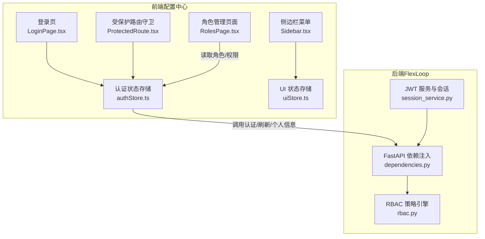
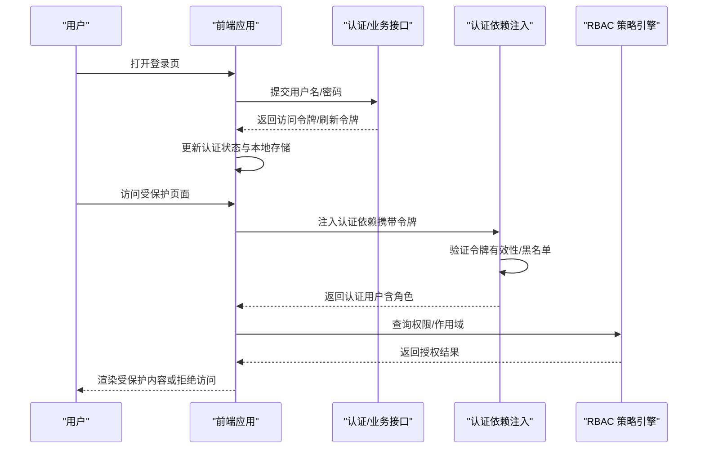
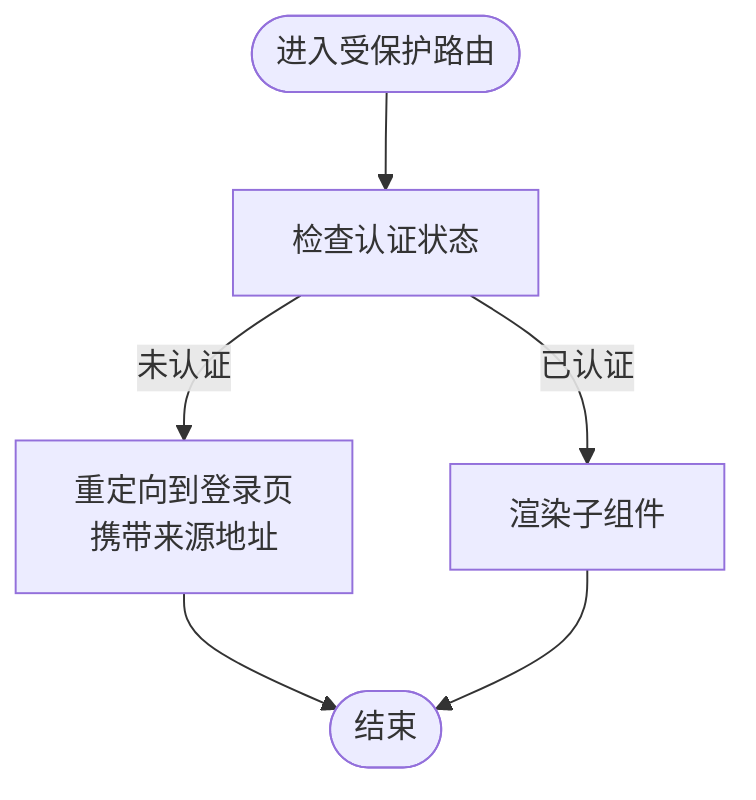
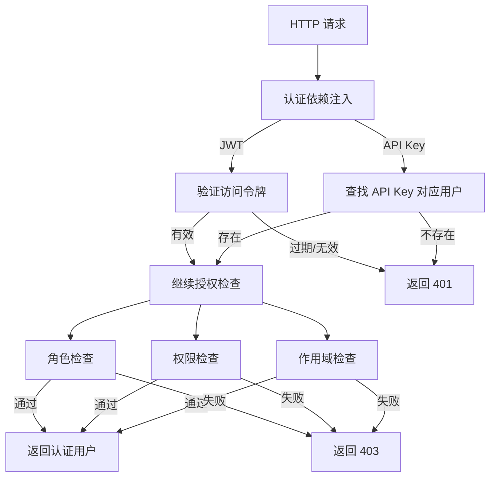
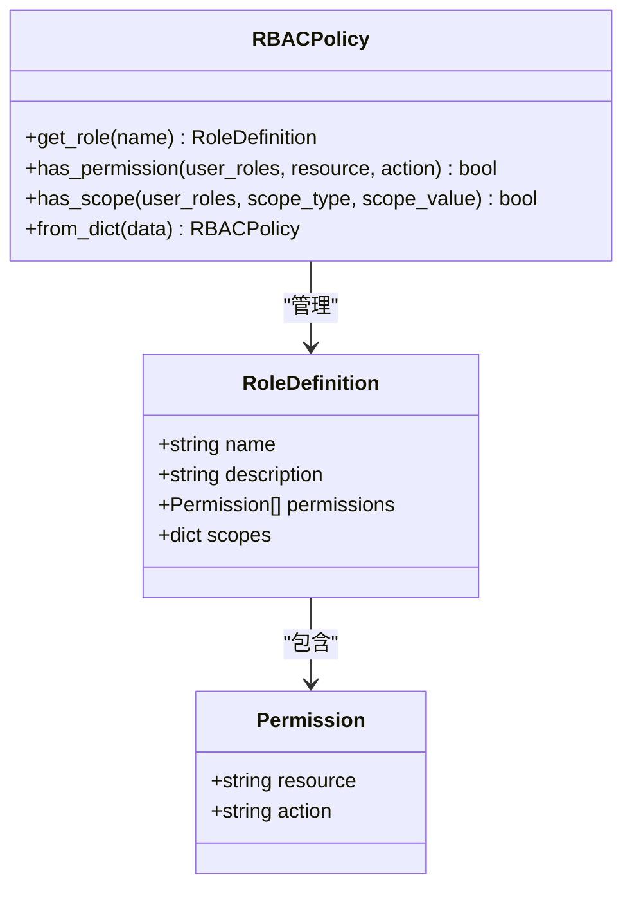
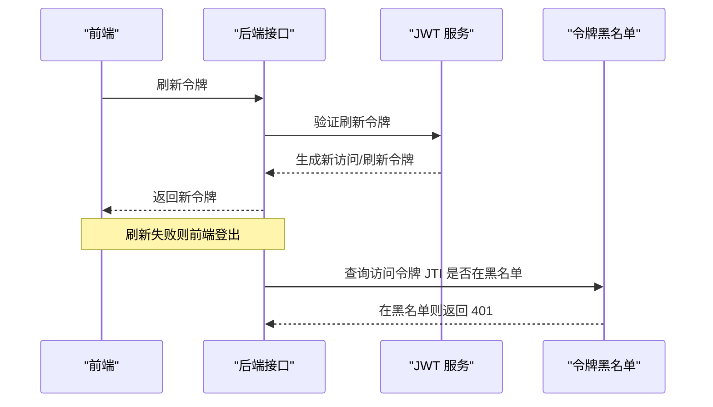
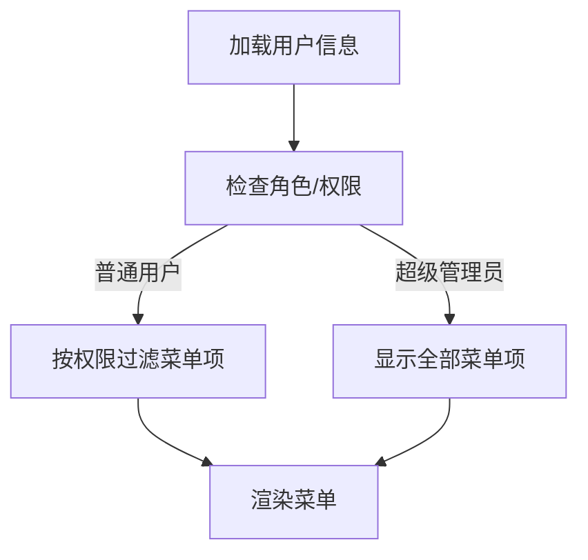
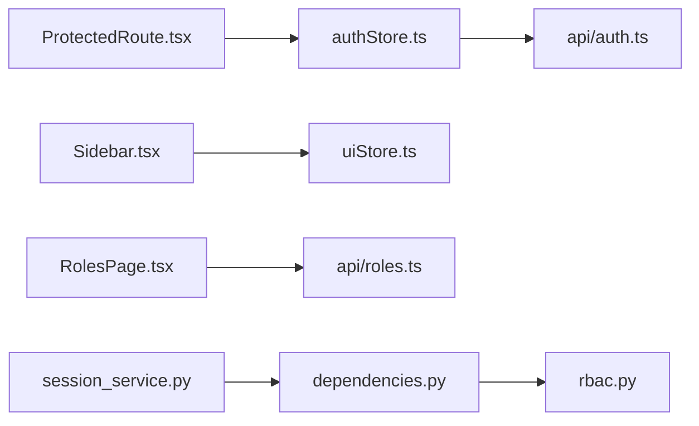

# 权限控制机制

<cite>
**本文引用的文件**
- [apps/config-center/src/store/authStore.ts](file://apps/config-center/src/store/authStore.ts)
- [apps/config-center/src/components/ProtectedRoute.tsx](file://apps/config-center/src/components/ProtectedRoute.tsx)
- [apps/config-center/src/pages/LoginPage.tsx](file://apps/config-center/src/pages/LoginPage.tsx)
- [apps/config-center/src/api/auth.ts](file://apps/config-center/src/api/auth.ts)
- [apps/config-center/src/components/layout/Sidebar.tsx](file://apps/config-center/src/components/layout/Sidebar.tsx)
- [apps/config-center/src/store/uiStore.ts](file://apps/config-center/src/store/uiStore.ts)
- [apps/config-center/src/pages/RolesPage.tsx](file://apps/config-center/src/pages/RolesPage.tsx)
- [apps/config-center/src/api/roles.ts](file://apps/config-center/src/api/roles.ts)
- [apps/config-center/src/api/users.ts](file://apps/config-center/src/api/users.ts)
- [apps/forum/src/context/AuthContext.tsx](file://apps/forum/src/context/AuthContext.tsx)
- [apps/AgentPit/src/__tests__/integration/state-management.spec.ts](file://apps/AgentPit/src/__tests__/integration/state-management.spec.ts)
- [tools/flexloop/src/taolib/testing/auth/rbac.py](file://tools/flexloop/src/taolib/testing/auth/rbac.py)
- [tools/flexloop/src/taolib/testing/auth/fastapi/dependencies.py](file://tools/flexloop/src/taolib/testing/auth/fastapi/dependencies.py)
- [tools/flexloop/tests/testing/test_auth/test_fastapi/test_dependencies.py](file://tools/flexloop/tests/testing/test_auth/test_fastapi/test_dependencies.py)
- [tools/flexloop/tests/testing/test_auth/test_fastapi/test_middleware.py](file://tools/flexloop/tests/testing/test_auth/test_fastapi/test_middleware.py)
- [tools/flexloop/tests/testing/test_oauth/test_repository/test_repos.py](file://tools/flexloop/tests/testing/test_oauth/test_repository/test_repos.py)
- [tools/flexloop/src/taolib/testing/oauth/services/session_service.py](file://tools/flexloop/src/taolib/testing/oauth/services/session_service.py)
</cite>

## 目录
1. [简介](#简介)
2. [项目结构](#项目结构)
3. [核心组件](#核心组件)
4. [架构总览](#架构总览)
5. [详细组件分析](#详细组件分析)
6. [依赖分析](#依赖分析)
7. [性能考虑](#性能考虑)
8. [故障排查指南](#故障排查指南)
9. [结论](#结论)
10. [附录](#附录)

## 简介
本文件系统性阐述本仓库中的权限控制机制，覆盖以下方面：
- 基于角色的访问控制（RBAC）实现与策略引擎
- 用户认证状态管理与路由守卫
- 权限验证流程、Token 管理与会话过期处理
- 受保护路由的实现方式、权限指令与动态权限菜单生成
- 安全最佳实践、性能优化建议与错误处理策略

本权限体系同时包含前端状态与后端依赖注入两部分：前端负责用户态与UI交互（登录、登出、刷新、菜单渲染），后端通过 FastAPI 依赖注入完成认证与授权校验。

## 项目结构
围绕权限控制的关键目录与文件如下：
- 前端（配置中心）：认证状态、受保护路由、登录页、API 客户端、侧边栏菜单
- 后端（FlexLoop 工具链）：RBAC 策略引擎、FastAPI 依赖注入（认证/授权）、JWT 服务与会话管理

图表来源
- [apps/config-center/src/pages/LoginPage.tsx:1-77](file://apps/config-center/src/pages/LoginPage.tsx#L1-L77)
- [apps/config-center/src/store/authStore.ts:1-108](file://apps/config-center/src/store/authStore.ts#L1-L108)
- [apps/config-center/src/components/ProtectedRoute.tsx:1-14](file://apps/config-center/src/components/ProtectedRoute.tsx#L1-L14)
- [apps/config-center/src/components/layout/Sidebar.tsx:1-57](file://apps/config-center/src/components/layout/Sidebar.tsx#L1-L57)
- [apps/config-center/src/store/uiStore.ts:1-14](file://apps/config-center/src/store/uiStore.ts#L1-L14)
- [apps/config-center/src/pages/RolesPage.tsx:1-169](file://apps/config-center/src/pages/RolesPage.tsx#L1-L169)
- [tools/flexloop/src/taolib/testing/auth/rbac.py:1-160](file://tools/flexloop/src/taolib/testing/auth/rbac.py#L1-L160)
- [tools/flexloop/src/taolib/testing/auth/fastapi/dependencies.py:1-291](file://tools/flexloop/src/taolib/testing/auth/fastapi/dependencies.py#L1-L291)
- [tools/flexloop/src/taolib/testing/oauth/services/session_service.py:83-126](file://tools/flexloop/src/taolib/testing/oauth/services/session_service.py#L83-L126)

章节来源
- [apps/config-center/src/store/authStore.ts:1-108](file://apps/config-center/src/store/authStore.ts#L1-L108)
- [apps/config-center/src/components/ProtectedRoute.tsx:1-14](file://apps/config-center/src/components/ProtectedRoute.tsx#L1-L14)
- [apps/config-center/src/pages/LoginPage.tsx:1-77](file://apps/config-center/src/pages/LoginPage.tsx#L1-L77)
- [apps/config-center/src/components/layout/Sidebar.tsx:1-57](file://apps/config-center/src/components/layout/Sidebar.tsx#L1-L57)
- [apps/config-center/src/store/uiStore.ts:1-14](file://apps/config-center/src/store/uiStore.ts#L1-L14)
- [apps/config-center/src/pages/RolesPage.tsx:1-169](file://apps/config-center/src/pages/RolesPage.tsx#L1-L169)
- [tools/flexloop/src/taolib/testing/auth/rbac.py:1-160](file://tools/flexloop/src/taolib/testing/auth/rbac.py#L1-L160)
- [tools/flexloop/src/taolib/testing/auth/fastapi/dependencies.py:1-291](file://tools/flexloop/src/taolib/testing/auth/fastapi/dependencies.py#L1-L291)
- [tools/flexloop/src/taolib/testing/oauth/services/session_service.py:83-126](file://tools/flexloop/src/taolib/testing/oauth/services/session_service.py#L83-L126)

## 核心组件
- 前端认证状态存储（Zustand）
  - 维护用户信息、访问令牌、刷新令牌、认证状态与加载状态
  - 提供登录、登出、刷新、拉取用户信息与客户端权限判断方法
- 受保护路由守卫（React Router）
  - 未认证则跳转登录页，并保留来源路径
- 登录页
  - 表单校验、调用登录接口、成功后跳转首页并提示
- RBAC 策略引擎（Python）
  - 角色定义、权限集合、作用域集合
  - 提供权限与作用域查询能力
- FastAPI 依赖注入
  - 认证依赖：支持 JWT Bearer 与 API Key
  - 授权依赖：角色、权限、作用域三类检查
- 会话与 Token 管理
  - JWT 访问/刷新令牌生成与过期处理
  - OAuth 会话持久化与激活状态管理

章节来源
- [apps/config-center/src/store/authStore.ts:6-18](file://apps/config-center/src/store/authStore.ts#L6-L18)
- [apps/config-center/src/components/ProtectedRoute.tsx:4-12](file://apps/config-center/src/components/ProtectedRoute.tsx#L4-L12)
- [apps/config-center/src/pages/LoginPage.tsx:15-29](file://apps/config-center/src/pages/LoginPage.tsx#L15-L29)
- [tools/flexloop/src/taolib/testing/auth/rbac.py:41-116](file://tools/flexloop/src/taolib/testing/auth/rbac.py#L41-L116)
- [tools/flexloop/src/taolib/testing/auth/fastapi/dependencies.py:27-141](file://tools/flexloop/src/taolib/testing/auth/fastapi/dependencies.py#L27-L141)

## 架构总览
下图展示从前端到后端的权限控制整体流程：前端通过认证接口获取令牌，后续请求携带令牌；后端依赖注入完成认证与授权校验；RBAC 引擎进行权限与作用域判定；前端根据认证状态与权限决定 UI 展示与路由行为。

图表来源
- [apps/config-center/src/pages/LoginPage.tsx:15-29](file://apps/config-center/src/pages/LoginPage.tsx#L15-L29)
- [apps/config-center/src/api/auth.ts:4-14](file://apps/config-center/src/api/auth.ts#L4-L14)
- [apps/config-center/src/store/authStore.ts:29-46](file://apps/config-center/src/store/authStore.ts#L29-L46)
- [apps/config-center/src/components/ProtectedRoute.tsx:4-12](file://apps/config-center/src/components/ProtectedRoute.tsx#L4-L12)
- [tools/flexloop/src/taolib/testing/auth/fastapi/dependencies.py:61-141](file://tools/flexloop/src/taolib/testing/auth/fastapi/dependencies.py#L61-L141)
- [tools/flexloop/src/taolib/testing/auth/rbac.py:64-116](file://tools/flexloop/src/taolib/testing/auth/rbac.py#L64-L116)

## 详细组件分析

### 前端认证状态与路由守卫
- 认证状态存储（Zustand）
  - 登录：调用登录接口写入访问/刷新令牌与认证状态，随后拉取用户信息
  - 刷新：使用刷新令牌换取新的访问令牌，失败则清空认证状态
  - 登出：清空用户与令牌，回到未认证
  - hasPermission：超级管理员直接放行；非超级管理员仅作为 UI 提示，不作为安全边界
- 受保护路由守卫
  - 未认证时重定向至登录页并携带来源地址
- 登录页
  - 表单校验、错误提示、成功后跳转首页

图表来源
- [apps/config-center/src/components/ProtectedRoute.tsx:4-12](file://apps/config-center/src/components/ProtectedRoute.tsx#L4-L12)
- [apps/config-center/src/store/authStore.ts:48-55](file://apps/config-center/src/store/authStore.ts#L48-L55)

章节来源
- [apps/config-center/src/store/authStore.ts:20-96](file://apps/config-center/src/store/authStore.ts#L20-L96)
- [apps/config-center/src/components/ProtectedRoute.tsx:1-14](file://apps/config-center/src/components/ProtectedRoute.tsx#L1-L14)
- [apps/config-center/src/pages/LoginPage.tsx:1-77](file://apps/config-center/src/pages/LoginPage.tsx#L1-L77)

### 后端认证与授权（FastAPI 依赖注入）
- 认证依赖
  - 支持 Bearer JWT 与 API Key 两种凭据来源
  - 验证失败返回 401，令牌过期返回 401 并提示刷新，黑名单命中返回 401
- 授权依赖
  - 角色检查：要求至少具备指定角色之一
  - 权限检查：基于 RBAC 策略判断资源-动作权限
  - 作用域检查：按作用域类型与值进行范围校验
- 测试覆盖
  - 无凭据返回 401
  - 过期令牌返回 401
  - 角色/权限/作用域检查的 403 场景

图表来源
- [tools/flexloop/src/taolib/testing/auth/fastapi/dependencies.py:61-141](file://tools/flexloop/src/taolib/testing/auth/fastapi/dependencies.py#L61-L141)
- [tools/flexloop/src/taolib/testing/auth/fastapi/dependencies.py:161-201](file://tools/flexloop/src/taolib/testing/auth/fastapi/dependencies.py#L161-L201)
- [tools/flexloop/src/taolib/testing/auth/fastapi/dependencies.py:203-244](file://tools/flexloop/src/taolib/testing/auth/fastapi/dependencies.py#L203-L244)
- [tools/flexloop/src/taolib/testing/auth/fastapi/dependencies.py:247-288](file://tools/flexloop/src/taolib/testing/auth/fastapi/dependencies.py#L247-L288)
- [tools/flexloop/tests/testing/test_auth/test_fastapi/test_middleware.py:84-123](file://tools/flexloop/tests/testing/test_auth/test_fastapi/test_middleware.py#L84-L123)
- [tools/flexloop/tests/testing/test_auth/test_fastapi/test_dependencies.py:102-125](file://tools/flexloop/tests/testing/test_auth/test_fastapi/test_dependencies.py#L102-L125)

章节来源
- [tools/flexloop/src/taolib/testing/auth/fastapi/dependencies.py:27-141](file://tools/flexloop/src/taolib/testing/auth/fastapi/dependencies.py#L27-L141)
- [tools/flexloop/tests/testing/test_auth/test_fastapi/test_middleware.py:84-123](file://tools/flexloop/tests/testing/test_auth/test_fastapi/test_middleware.py#L84-L123)
- [tools/flexloop/tests/testing/test_auth/test_fastapi/test_dependencies.py:102-125](file://tools/flexloop/tests/testing/test_auth/test_fastapi/test_dependencies.py#L102-L125)

### RBAC 策略引擎
- 数据模型
  - Permission：资源与动作
  - RoleDefinition：角色定义，包含权限列表与作用域映射
  - RBACPolicy：策略引擎，提供角色查询、权限判断、作用域判断与从字典构建
- 关键方法
  - has_permission：遍历用户角色，匹配资源-动作
  - has_scope：按作用域类型与值判断，None 表示无限制
  - from_dict：兼容枚举与多种作用域格式

图表来源
- [tools/flexloop/src/taolib/testing/auth/rbac.py:10-116](file://tools/flexloop/src/taolib/testing/auth/rbac.py#L10-L116)
- [tools/flexloop/src/taolib/testing/auth/rbac.py:118-157](file://tools/flexloop/src/taolib/testing/auth/rbac.py#L118-L157)

章节来源
- [tools/flexloop/src/taolib/testing/auth/rbac.py:41-116](file://tools/flexloop/src/taolib/testing/auth/rbac.py#L41-L116)
- [tools/flexloop/src/taolib/testing/auth/rbac.py:118-157](file://tools/flexloop/src/taolib/testing/auth/rbac.py#L118-L157)

### Token 管理与会话过期处理
- 前端
  - 登录成功写入访问/刷新令牌与认证状态
  - 刷新接口失败时自动登出，避免悬挂状态
- 后端
  - JWT 访问令牌过期返回 401，提示刷新
  - 黑名单机制拦截已吊销令牌
  - OAuth 会话持久化，支持激活状态与过期时间管理

图表来源
- [apps/config-center/src/store/authStore.ts:57-73](file://apps/config-center/src/store/authStore.ts#L57-L73)
- [apps/config-center/src/api/auth.ts:8-10](file://apps/config-center/src/api/auth.ts#L8-L10)
- [tools/flexloop/tests/testing/test_auth/test_fastapi/test_middleware.py:103-123](file://tools/flexloop/tests/testing/test_auth/test_fastapi/test_middleware.py#L103-L123)
- [tools/flexloop/src/taolib/testing/oauth/services/session_service.py:83-126](file://tools/flexloop/src/taolib/testing/oauth/services/session_service.py#L83-L126)

章节来源
- [apps/config-center/src/store/authStore.ts:57-73](file://apps/config-center/src/store/authStore.ts#L57-L73)
- [apps/config-center/src/api/auth.ts:8-10](file://apps/config-center/src/api/auth.ts#L8-L10)
- [tools/flexloop/tests/testing/test_auth/test_fastapi/test_middleware.py:103-123](file://tools/flexloop/tests/testing/test_auth/test_fastapi/test_middleware.py#L103-L123)
- [tools/flexloop/src/taolib/testing/oauth/services/session_service.py:83-126](file://tools/flexloop/src/taolib/testing/oauth/services/session_service.py#L83-L126)

### 受保护路由的实现方式
- 前端
  - 使用受保护路由组件包裹需要鉴权的页面
  - 未认证时重定向到登录页并保留来源地址
- 后端
  - 通过依赖注入在路由层强制认证与授权
  - 可按需组合角色、权限、作用域检查

章节来源
- [apps/config-center/src/components/ProtectedRoute.tsx:4-12](file://apps/config-center/src/components/ProtectedRoute.tsx#L4-L12)
- [tools/flexloop/src/taolib/testing/auth/fastapi/dependencies.py:161-201](file://tools/flexloop/src/taolib/testing/auth/fastapi/dependencies.py#L161-L201)

### 权限指令与动态权限菜单生成
- 权限指令（前端）
  - hasPermission：超级管理员直接放行；非超级管理员仅用于 UI 提示
  - 服务器端仍需严格校验，客户端仅作界面开关
- 动态权限菜单
  - 侧边栏菜单项固定，但可结合用户角色/权限进行显示/隐藏控制
  - 角色管理页面支持增删改查角色与权限

图表来源
- [apps/config-center/src/store/authStore.ts:84-95](file://apps/config-center/src/store/authStore.ts#L84-L95)
- [apps/config-center/src/components/layout/Sidebar.tsx:13-20](file://apps/config-center/src/components/layout/Sidebar.tsx#L13-L20)
- [apps/config-center/src/pages/RolesPage.tsx:1-169](file://apps/config-center/src/pages/RolesPage.tsx#L1-L169)

章节来源
- [apps/config-center/src/store/authStore.ts:84-95](file://apps/config-center/src/store/authStore.ts#L84-L95)
- [apps/config-center/src/components/layout/Sidebar.tsx:13-20](file://apps/config-center/src/components/layout/Sidebar.tsx#L13-L20)
- [apps/config-center/src/pages/RolesPage.tsx:1-169](file://apps/config-center/src/pages/RolesPage.tsx#L1-L169)

### 用户认证状态管理（对比不同应用）
- 配置中心（Zustand）
  - 维护用户、令牌、认证状态与加载状态
- 论坛（React Context）
  - 简易内存态，登录/注册/登出/更新资料
- AgentPit（集成测试）
  - 登录设置认证态与个人资料；登出清空认证态

章节来源
- [apps/config-center/src/store/authStore.ts:20-96](file://apps/config-center/src/store/authStore.ts#L20-L96)
- [apps/forum/src/context/AuthContext.tsx:17-85](file://apps/forum/src/context/AuthContext.tsx#L17-L85)
- [apps/AgentPit/src/__tests__/integration/state-management.spec.ts:260-278](file://apps/AgentPit/src/__tests__/integration/state-management.spec.ts#L260-L278)

## 依赖分析
- 前端依赖
  - authStore.ts 依赖 api/auth.ts（登录/刷新/获取用户）
  - ProtectedRoute.tsx 依赖 authStore.ts（认证状态）
  - Sidebar.tsx 依赖 uiStore.ts（侧边栏展开/收起）
  - RolesPage.tsx 依赖 api/roles.ts（角色 CRUD）
- 后端依赖
  - dependencies.py 依赖 rbac.py（策略引擎）
  - session_service.py 依赖 JWT 服务（生成访问/刷新令牌）

图表来源
- [apps/config-center/src/store/authStore.ts:1-108](file://apps/config-center/src/store/authStore.ts#L1-L108)
- [apps/config-center/src/api/auth.ts:1-15](file://apps/config-center/src/api/auth.ts#L1-L15)
- [apps/config-center/src/components/ProtectedRoute.tsx:1-14](file://apps/config-center/src/components/ProtectedRoute.tsx#L1-L14)
- [apps/config-center/src/store/uiStore.ts:1-14](file://apps/config-center/src/store/uiStore.ts#L1-L14)
- [apps/config-center/src/components/layout/Sidebar.tsx:1-57](file://apps/config-center/src/components/layout/Sidebar.tsx#L1-L57)
- [apps/config-center/src/pages/RolesPage.tsx:1-169](file://apps/config-center/src/pages/RolesPage.tsx#L1-L169)
- [apps/config-center/src/api/roles.ts:1-25](file://apps/config-center/src/api/roles.ts#L1-L25)
- [tools/flexloop/src/taolib/testing/auth/fastapi/dependencies.py:1-291](file://tools/flexloop/src/taolib/testing/auth/fastapi/dependencies.py#L1-L291)
- [tools/flexloop/src/taolib/testing/auth/rbac.py:1-160](file://tools/flexloop/src/taolib/testing/auth/rbac.py#L1-L160)
- [tools/flexloop/src/taolib/testing/oauth/services/session_service.py:83-126](file://tools/flexloop/src/taolib/testing/oauth/services/session_service.py#L83-L126)

章节来源
- [apps/config-center/src/store/authStore.ts:1-108](file://apps/config-center/src/store/authStore.ts#L1-L108)
- [apps/config-center/src/api/auth.ts:1-15](file://apps/config-center/src/api/auth.ts#L1-L15)
- [apps/config-center/src/components/ProtectedRoute.tsx:1-14](file://apps/config-center/src/components/ProtectedRoute.tsx#L1-L14)
- [apps/config-center/src/store/uiStore.ts:1-14](file://apps/config-center/src/store/uiStore.ts#L1-L14)
- [apps/config-center/src/components/layout/Sidebar.tsx:1-57](file://apps/config-center/src/components/layout/Sidebar.tsx#L1-L57)
- [apps/config-center/src/pages/RolesPage.tsx:1-169](file://apps/config-center/src/pages/RolesPage.tsx#L1-L169)
- [apps/config-center/src/api/roles.ts:1-25](file://apps/config-center/src/api/roles.ts#L1-L25)
- [tools/flexloop/src/taolib/testing/auth/fastapi/dependencies.py:1-291](file://tools/flexloop/src/taolib/testing/auth/fastapi/dependencies.py#L1-L291)
- [tools/flexloop/src/taolib/testing/auth/rbac.py:1-160](file://tools/flexloop/src/taolib/testing/auth/rbac.py#L1-L160)
- [tools/flexloop/src/taolib/testing/oauth/services/session_service.py:83-126](file://tools/flexloop/src/taolib/testing/oauth/services/session_service.py#L83-L126)

## 性能考虑
- 前端
  - 使用持久化存储减少重复登录成本
  - 刷新令牌失败立即登出，避免无效重试
  - hasPermission 仅用于 UI 提示，避免在高频渲染中做昂贵计算
- 后端
  - RBAC 查询为线性扫描，角色与权限规模适中即可满足需求
  - 令牌黑名单查询应使用高效索引（如基于 JTI 的哈希表）
  - 会话过期与活动时间应合理设置，平衡安全与性能

## 故障排查指南
- 常见问题与定位
  - 401 未提供认证凭据：检查请求头是否携带令牌或 API Key
  - 401 令牌已过期：触发刷新流程，若刷新失败则登出
  - 401 令牌已被吊销：确认黑名单状态与登出/撤销流程
  - 403 权限不足：核对用户角色与资源-动作权限映射
- 前端
  - 登录失败：查看错误消息与网络面板，确认接口返回
  - 页面无法访问：确认受保护路由守卫是否生效
- 后端
  - 依赖注入未生效：检查路由装饰器与依赖传参
  - RBAC 不生效：核对角色定义与权限映射

章节来源
- [tools/flexloop/tests/testing/test_auth/test_fastapi/test_middleware.py:84-123](file://tools/flexloop/tests/testing/test_auth/test_fastapi/test_middleware.py#L84-L123)
- [tools/flexloop/src/taolib/testing/auth/fastapi/dependencies.py:77-105](file://tools/flexloop/src/taolib/testing/auth/fastapi/dependencies.py#L77-L105)
- [apps/config-center/src/store/authStore.ts:57-73](file://apps/config-center/src/store/authStore.ts#L57-L73)

## 结论
本权限体系采用“前端状态+后端依赖注入”的双层保障：前端负责用户体验与界面控制，后端负责安全边界与强约束。RBAC 策略引擎提供清晰的角色-权限-作用域模型，配合 FastAPI 依赖注入实现细粒度的路由级授权。通过令牌刷新与黑名单机制，系统在保证安全性的同时兼顾可用性。

## 附录
- 安全最佳实践
  - 令牌最小权限原则：仅授予完成任务所需的最小权限
  - 作用域限制：对敏感资源启用作用域检查
  - 令牌生命周期：短周期访问令牌 + 长周期刷新令牌
  - 黑名单与撤销：及时吊销失效令牌
  - 前端仅作 UI 辅助：服务器端必须再次校验权限
- 性能优化建议
  - 前端：缓存用户信息与权限，避免重复拉取
  - 后端：优化 RBAC 查询与黑名单索引
- 错误处理策略
  - 明确区分 401 与 403，分别对应“未认证”与“权限不足”
  - 统一错误响应格式，便于前端提示与日志追踪