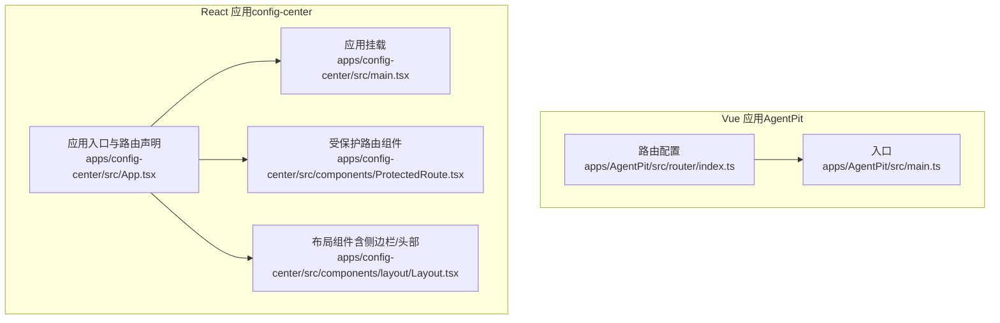
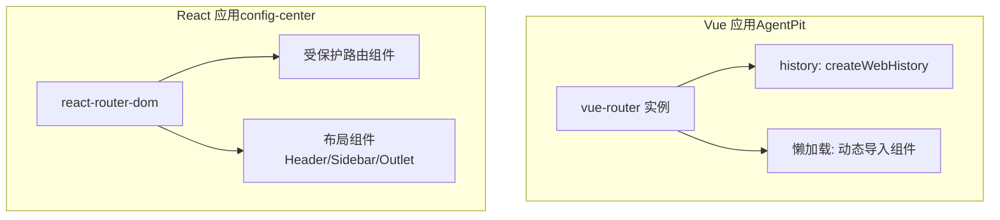
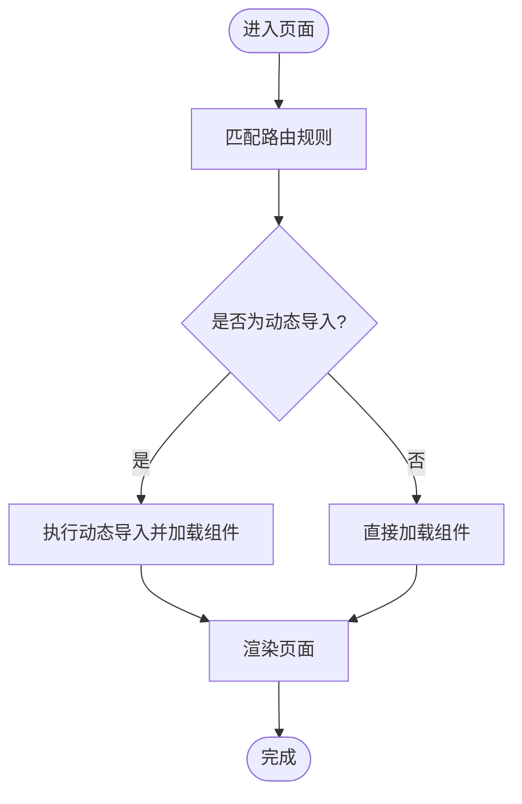
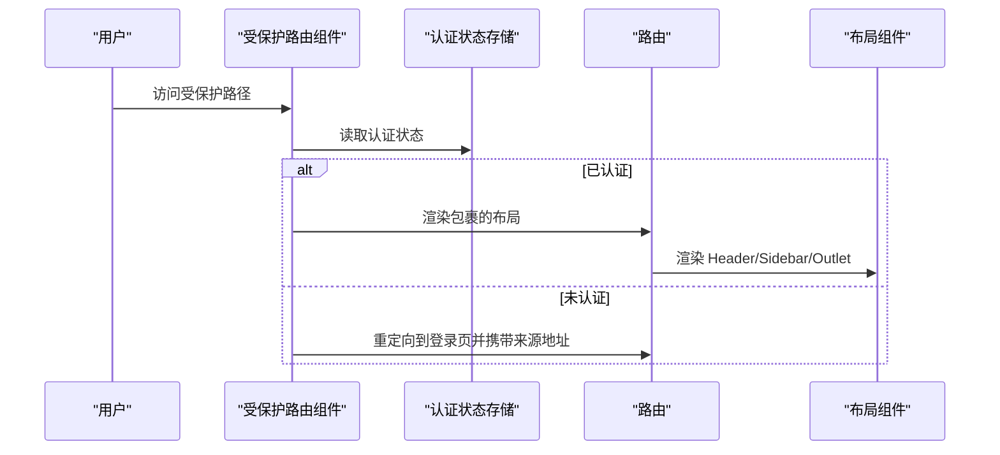
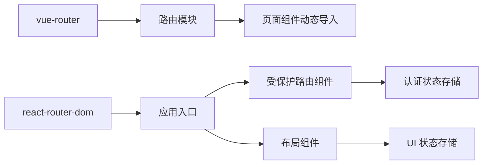

# 路由与导航系统

<cite>
**本文引用的文件**
- [apps/AgentPit/src/router/index.ts](file://apps/AgentPit/src/router/index.ts)
- [apps/AgentPit/src-react-backup-20260410/App.tsx](file://apps/AgentPit/src-react-backup-20260410/App.tsx)
- [apps/AgentPit/src-react-backup-20260410/main.tsx](file://apps/AgentPit/src-react-backup-20260410/main.tsx)
- [apps/config-center/src/App.tsx](file://apps/config-center/src/App.tsx)
- [apps/config-center/src/main.tsx](file://apps/config-center/src/main.tsx)
- [apps/config-center/src/components/ProtectedRoute.tsx](file://apps/config-center/src/components/ProtectedRoute.tsx)
- [apps/config-center/src/components/layout/Layout.tsx](file://apps/config-center/src/components/layout/Layout.tsx)
- [apps/config-center/src/pages/DashboardPage.tsx](file://apps/config-center/src/pages/DashboardPage.tsx)
</cite>

## 目录
1. [简介](#简介)
2. [项目结构](#项目结构)
3. [核心组件](#核心组件)
4. [架构总览](#架构总览)
5. [详细组件分析](#详细组件分析)
6. [依赖关系分析](#依赖关系分析)
7. [性能考量](#性能考量)
8. [故障排查指南](#故障排查指南)
9. [结论](#结论)
10. [附录](#附录)

## 简介
本文件面向“路由与导航系统”的技术文档，覆盖 Vue.js 与 React 应用中的路由配置、导航组件设计、页面权限控制、嵌套路由处理、路由守卫实现、动态/懒加载、SEO 优化、导航体验（面包屑、侧边栏、移动端适配）、最佳实践、性能优化与安全考虑，并解释路由系统与认证、状态管理的协作机制。本文以仓库中已存在的路由与布局实现为依据，结合通用工程化经验进行总结。

## 项目结构
本仓库包含多个前端应用，其中与路由和导航直接相关的关键模块如下：
- Vue 应用（AgentPit）：使用 vue-router 进行路由配置，采用历史模式与动态导入实现懒加载。
- React 应用（config-center）：使用 react-router-dom 进行路由配置，采用受保护路由组件实现权限控制，配合自定义布局组件实现侧边栏与头部导航。

图表来源
- [apps/AgentPit/src/router/index.ts:1-73](file://apps/AgentPit/src/router/index.ts#L1-L73)
- [apps/AgentPit/src-react-backup-20260410/main.tsx:1-11](file://apps/AgentPit/src-react-backup-20260410/main.tsx#L1-L11)
- [apps/config-center/src/App.tsx:1-39](file://apps/config-center/src/App.tsx#L1-L39)
- [apps/config-center/src/main.tsx:1-11](file://apps/config-center/src/main.tsx#L1-L11)
- [apps/config-center/src/components/ProtectedRoute.tsx:1-14](file://apps/config-center/src/components/ProtectedRoute.tsx#L1-L14)
- [apps/config-center/src/components/layout/Layout.tsx:1-27](file://apps/config-center/src/components/layout/Layout.tsx#L1-L27)

章节来源
- [apps/AgentPit/src/router/index.ts:1-73](file://apps/AgentPit/src/router/index.ts#L1-L73)
- [apps/AgentPit/src-react-backup-20260410/App.tsx:1-41](file://apps/AgentPit/src-react-backup-20260410/App.tsx#L1-L41)
- [apps/AgentPit/src-react-backup-20260410/main.tsx:1-11](file://apps/AgentPit/src-react-backup-20260410/main.tsx#L1-L11)
- [apps/config-center/src/App.tsx:1-39](file://apps/config-center/src/App.tsx#L1-L39)
- [apps/config-center/src/main.tsx:1-11](file://apps/config-center/src/main.tsx#L1-L11)
- [apps/config-center/src/components/ProtectedRoute.tsx:1-14](file://apps/config-center/src/components/ProtectedRoute.tsx#L1-L14)
- [apps/config-center/src/components/layout/Layout.tsx:1-27](file://apps/config-center/src/components/layout/Layout.tsx#L1-L27)

## 核心组件
- Vue 路由配置（AgentPit）
  - 使用 createRouter + createWebHistory 创建路由实例。
  - 所有页面通过动态导入实现懒加载，减少首屏体积。
  - 定义了多条静态路由，包含参数化路由（如商品详情）。
- React 路由配置（config-center）
  - 使用 BrowserRouter + Routes + Route 组织路由树。
  - 通过受保护路由组件实现登录态校验，未登录自动跳转登录页。
  - 布局组件负责渲染 Header、Sidebar 与 Outlet 内容区。
- 导航与布局
  - React 应用通过 Layout 组件统一承载导航与内容区域，支持侧边栏展开/收起状态控制。
  - Dashboard 页面通过 useNavigate 实现内部跳转，提升交互效率。

章节来源
- [apps/AgentPit/src/router/index.ts:1-73](file://apps/AgentPit/src/router/index.ts#L1-L73)
- [apps/config-center/src/App.tsx:1-39](file://apps/config-center/src/App.tsx#L1-L39)
- [apps/config-center/src/components/ProtectedRoute.tsx:1-14](file://apps/config-center/src/components/ProtectedRoute.tsx#L1-L14)
- [apps/config-center/src/components/layout/Layout.tsx:1-27](file://apps/config-center/src/components/layout/Layout.tsx#L1-L27)
- [apps/config-center/src/pages/DashboardPage.tsx:1-174](file://apps/config-center/src/pages/DashboardPage.tsx#L1-L174)

## 架构总览
下图展示了两个应用的路由与导航架构：Vue 使用 vue-router 的历史模式与动态导入；React 使用 react-router-dom 的受保护路由与自定义布局。

图表来源
- [apps/AgentPit/src/router/index.ts:1-73](file://apps/AgentPit/src/router/index.ts#L1-L73)
- [apps/config-center/src/App.tsx:1-39](file://apps/config-center/src/App.tsx#L1-L39)
- [apps/config-center/src/components/ProtectedRoute.tsx:1-14](file://apps/config-center/src/components/ProtectedRoute.tsx#L1-L14)
- [apps/config-center/src/components/layout/Layout.tsx:1-27](file://apps/config-center/src/components/layout/Layout.tsx#L1-L27)

## 详细组件分析

### Vue 路由系统（AgentPit）
- 路由定义与懒加载
  - 路由表集中定义在路由模块中，每个页面通过动态导入实现按需加载。
  - 历史模式用于 SPA 路由切换，避免刷新页面。
- 嵌套路由与主布局
  - 当前路由配置为扁平路由，未见明确的嵌套路由示例。若需嵌套路由，可在后续扩展中引入父级路由与子路由映射。
- 路由守卫
  - 未发现全局前置/后置守卫或路由独享守卫。如需鉴权或埋点，可在路由实例上添加相应钩子。
- SEO 优化
  - 未见针对 SEO 的 meta 标签注入或预渲染策略。可考虑在路由层增加 meta 配置与服务端渲染方案。

图表来源
- [apps/AgentPit/src/router/index.ts:1-73](file://apps/AgentPit/src/router/index.ts#L1-L73)

章节来源
- [apps/AgentPit/src/router/index.ts:1-73](file://apps/AgentPit/src/router/index.ts#L1-L73)

### React 路由系统（config-center）
- 受保护路由
  - 受保护路由组件读取认证状态，未登录则重定向至登录页并携带来源地址。
- 布局与导航
  - 布局组件包含 Header、Sidebar 与 Outlet，通过 UI 状态控制侧边栏宽度与展开状态。
- 内部导航
  - Dashboard 页面使用 useNavigate 实现点击卡片或按钮后的内部跳转，提升交互效率。

图表来源
- [apps/config-center/src/components/ProtectedRoute.tsx:1-14](file://apps/config-center/src/components/ProtectedRoute.tsx#L1-L14)
- [apps/config-center/src/App.tsx:1-39](file://apps/config-center/src/App.tsx#L1-L39)
- [apps/config-center/src/components/layout/Layout.tsx:1-27](file://apps/config-center/src/components/layout/Layout.tsx#L1-L27)

章节来源
- [apps/config-center/src/App.tsx:1-39](file://apps/config-center/src/App.tsx#L1-L39)
- [apps/config-center/src/components/ProtectedRoute.tsx:1-14](file://apps/config-center/src/components/ProtectedRoute.tsx#L1-L14)
- [apps/config-center/src/components/layout/Layout.tsx:1-27](file://apps/config-center/src/components/layout/Layout.tsx#L1-L27)
- [apps/config-center/src/pages/DashboardPage.tsx:1-174](file://apps/config-center/src/pages/DashboardPage.tsx#L1-L174)

### 导航组件与用户体验
- 侧边栏菜单
  - 布局组件通过 UI 状态控制侧边栏宽度，适合桌面端导航。移动端可通过断点与抽屉式侧边栏进一步优化。
- 面包屑导航
  - 当前未见显式的面包屑实现。可在路由层级较深时引入基于路径与路由元信息的面包屑生成逻辑。
- 移动端适配
  - 建议在布局组件中加入响应式断点，根据屏幕尺寸切换侧边栏显示方式与导航布局。

章节来源
- [apps/config-center/src/components/layout/Layout.tsx:1-27](file://apps/config-center/src/components/layout/Layout.tsx#L1-L27)

## 依赖关系分析
- Vue 应用
  - 路由模块依赖 vue-router，页面组件通过动态导入被懒加载。
- React 应用
  - 应用依赖 react-router-dom、受保护路由组件依赖认证状态存储，布局组件依赖 UI 状态存储。

图表来源
- [apps/AgentPit/src/router/index.ts:1-73](file://apps/AgentPit/src/router/index.ts#L1-L73)
- [apps/config-center/src/App.tsx:1-39](file://apps/config-center/src/App.tsx#L1-L39)
- [apps/config-center/src/components/ProtectedRoute.tsx:1-14](file://apps/config-center/src/components/ProtectedRoute.tsx#L1-L14)
- [apps/config-center/src/components/layout/Layout.tsx:1-27](file://apps/config-center/src/components/layout/Layout.tsx#L1-L27)

章节来源
- [apps/AgentPit/src/router/index.ts:1-73](file://apps/AgentPit/src/router/index.ts#L1-L73)
- [apps/config-center/src/App.tsx:1-39](file://apps/config-center/src/App.tsx#L1-L39)
- [apps/config-center/src/components/ProtectedRoute.tsx:1-14](file://apps/config-center/src/components/ProtectedRoute.tsx#L1-L14)
- [apps/config-center/src/components/layout/Layout.tsx:1-27](file://apps/config-center/src/components/layout/Layout.tsx#L1-L27)

## 性能考量
- 懒加载与代码分割
  - Vue 与 React 均采用动态导入实现按需加载，有助于降低首屏体积与提升加载速度。
- 路由守卫与鉴权
  - 在 React 中通过受保护路由组件实现鉴权，避免未授权用户访问受保护内容。
- 路由缓存与预加载
  - 对频繁访问的页面可考虑缓存策略；对高优先级页面可采用预加载提升用户体验。
- SEO 优化
  - 建议在路由层增加 meta 配置与 SSR/预渲染方案，提升搜索引擎可见性。

## 故障排查指南
- 登录后无法跳回原页面
  - 检查受保护路由组件是否正确传递来源地址并使用 replace 导航。
- 侧边栏宽度异常
  - 检查 UI 状态存储与布局组件类名计算逻辑，确保在不同断点下的样式一致。
- 页面空白或组件未渲染
  - 检查动态导入路径是否正确，确认打包后资源可正常访问。

章节来源
- [apps/config-center/src/components/ProtectedRoute.tsx:1-14](file://apps/config-center/src/components/ProtectedRoute.tsx#L1-L14)
- [apps/config-center/src/components/layout/Layout.tsx:1-27](file://apps/config-center/src/components/layout/Layout.tsx#L1-L27)

## 结论
本仓库中的路由与导航系统分别在 Vue 与 React 应用中实现了基础的路由配置、权限控制与布局导航。Vue 应用通过动态导入实现懒加载，React 应用通过受保护路由组件与自定义布局实现权限与导航体验。建议后续在 Vue 应用中引入路由守卫与嵌套路由，在 React 应用中完善面包屑导航与移动端适配，并在路由层增强 SEO 与性能优化策略。

## 附录
- 最佳实践
  - 路由命名与路径规范：统一使用短横线分隔，避免大小写混用。
  - 权限控制：在路由层与组件层双重校验，确保安全边界。
  - 性能优化：合理拆分路由模块，结合预加载与缓存策略。
  - SEO：为关键页面配置 meta 标签，必要时引入 SSR 或 SSG。
  - 移动端：在布局组件中加入断点与抽屉式侧边栏，提升移动端体验。
- 安全考虑
  - 避免在 URL 中暴露敏感信息；对关键操作进行二次确认。
  - 在路由守卫中严格校验权限与会话状态，防止越权访问。