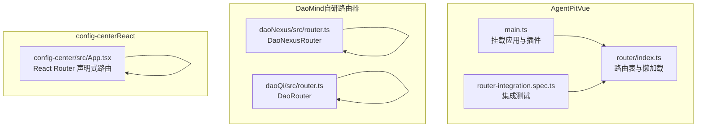
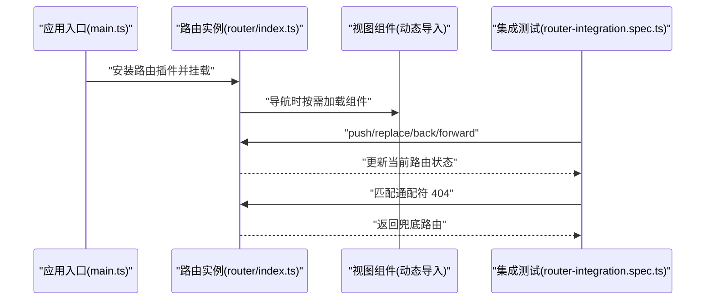
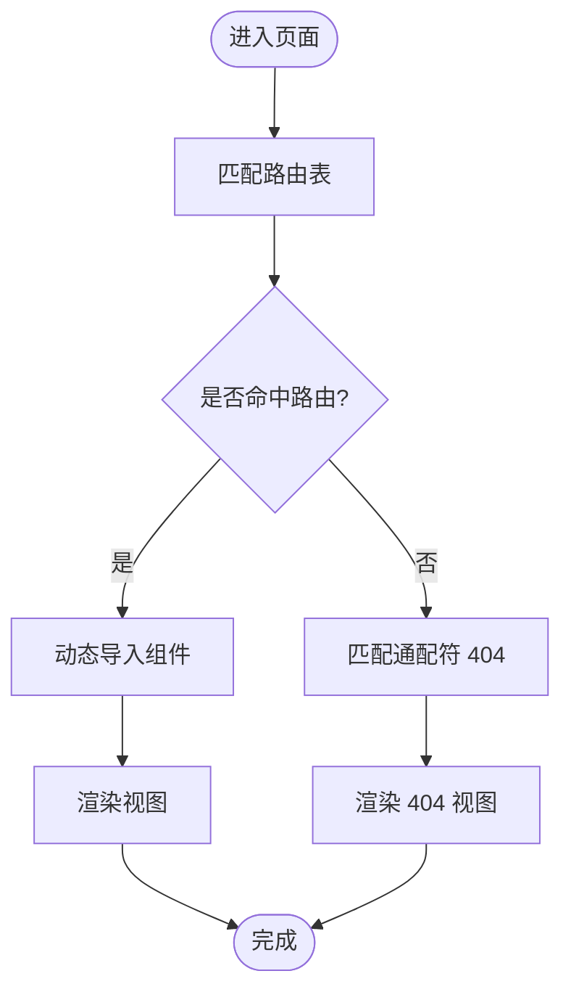
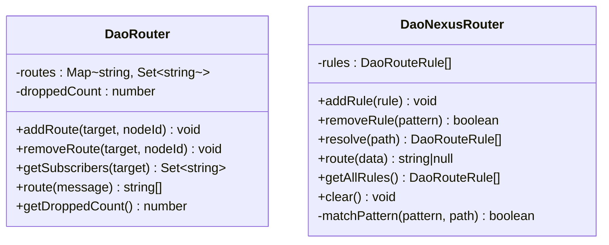
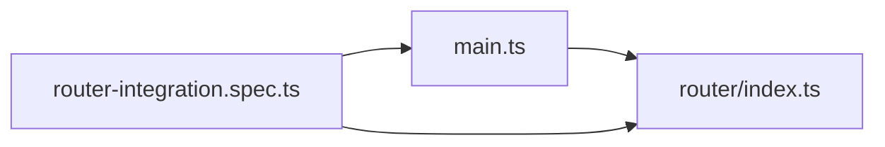

# 路由配置详解

<cite>
**本文引用的文件**
- [apps/AgentPit/src/router/index.ts](file://apps/AgentPit/src/router/index.ts)
- [apps/AgentPit/src/main.ts](file://apps/AgentPit/src/main.ts)
- [apps/AgentPit/src/__tests__/integration/router-integration.spec.ts](file://apps/AgentPit/src/__tests__/integration/router-integration.spec.ts)
- [apps/AgentPit/src-react-backup-20260410/App.tsx](file://apps/AgentPit/src-react-backup-20260410/App.tsx)
- [apps/DaoMind/packages/daoNexus/src/router.ts](file://apps/DaoMind/packages/daoNexus/src/router.ts)
- [apps/DaoMind/packages/daoQi/src/router.ts](file://apps/DaoMind/packages/daoQi/src/router.ts)
- [apps/config-center/src/App.tsx](file://apps/config-center/src/App.tsx)
</cite>

## 目录
1. [引言](#引言)
2. [项目结构](#项目结构)
3. [核心组件](#核心组件)
4. [架构总览](#架构总览)
5. [详细组件分析](#详细组件分析)
6. [依赖关系分析](#依赖关系分析)
7. [性能考量](#性能考量)
8. [故障排查指南](#故障排查指南)
9. [结论](#结论)
10. [附录](#附录)

## 引言
本文件围绕仓库中多套路由配置进行系统化技术解析，重点覆盖以下主题：
- Vue Router 配置结构与路由记录定义
- 动态导入与路由懒加载的实现原理
- 路由表组织方式、路径匹配规则与参数传递机制
- 代码分割策略与性能优化技巧
- 最佳实践、常见问题与调试方法

通过对实际源码的逐层剖析，帮助读者在不直接阅读代码的前提下，掌握路由配置的设计思想与落地细节。

## 项目结构
本仓库包含多个前端应用，其中部分采用 Vue Router，部分采用 React Router。与本专题直接相关的关键位置如下：
- AgentPit（Vue 应用）：使用 vue-router 定义路由表，并通过动态导入实现懒加载
- DaoMind（多包）：包含自研“消息路由器”与“Nexus 路由器”，用于内部消息与路径规则分发
- config-center（React 应用）：使用 react-router-dom 进行声明式路由配置

**图表来源**
- [apps/AgentPit/src/main.ts:1-13](file://apps/AgentPit/src/main.ts#L1-L13)
- [apps/AgentPit/src/router/index.ts:1-73](file://apps/AgentPit/src/router/index.ts#L1-L73)
- [apps/AgentPit/src/__tests__/integration/router-integration.spec.ts:1-132](file://apps/AgentPit/src/__tests__/integration/router-integration.spec.ts#L1-L132)
- [apps/DaoMind/packages/daoNexus/src/router.ts:1-76](file://apps/DaoMind/packages/daoNexus/src/router.ts#L1-L76)
- [apps/DaoMind/packages/daoQi/src/router.ts:1-48](file://apps/DaoMind/packages/daoQi/src/router.ts#L1-L48)
- [apps/config-center/src/App.tsx:1-39](file://apps/config-center/src/App.tsx#L1-L39)

**章节来源**
- [apps/AgentPit/src/main.ts:1-13](file://apps/AgentPit/src/main.ts#L1-L13)
- [apps/AgentPit/src/router/index.ts:1-73](file://apps/AgentPit/src/router/index.ts#L1-L73)
- [apps/AgentPit/src/__tests__/integration/router-integration.spec.ts:1-132](file://apps/AgentPit/src/__tests__/integration/router-integration.spec.ts#L1-L132)
- [apps/DaoMind/packages/daoNexus/src/router.ts:1-76](file://apps/DaoMind/packages/daoNexus/src/router.ts#L1-L76)
- [apps/DaoMind/packages/daoQi/src/router.ts:1-48](file://apps/DaoMind/packages/daoQi/src/router.ts#L1-L48)
- [apps/config-center/src/App.tsx:1-39](file://apps/config-center/src/App.tsx#L1-L39)

## 核心组件
本节聚焦于 Vue Router 的核心配置与运行时行为，包括路由记录定义、动态导入与懒加载、历史模式与导航控制等。

- 路由记录定义与动态导入
  - 路由表以数组形式定义，每条记录包含路径、名称与组件
  - 组件字段采用函数形式，返回动态导入语句，实现按需加载
  - 典型示例：根路径与各功能页均通过动态导入加载

- 路由实例创建
  - 使用浏览器历史模式创建路由实例
  - 将路由表注入到实例中，形成完整的路由配置

- 导航与历史控制
  - 支持编程式导航（push/replace/back/forward）
  - 支持通配符 404 匹配与兜底处理

- 参数传递与嵌套路由
  - 支持路径参数（如商品详情页的 id）
  - 测试用例验证了参数路由的存在性与匹配能力

**章节来源**
- [apps/AgentPit/src/router/index.ts:4-65](file://apps/AgentPit/src/router/index.ts#L4-L65)
- [apps/AgentPit/src/router/index.ts:67-70](file://apps/AgentPit/src/router/index.ts#L67-L70)
- [apps/AgentPit/src/__tests__/integration/router-integration.spec.ts:80-87](file://apps/AgentPit/src/__tests__/integration/router-integration.spec.ts#L80-L87)
- [apps/AgentPit/src/__tests__/integration/router-integration.spec.ts:127-130](file://apps/AgentPit/src/__tests__/integration/router-integration.spec.ts#L127-L130)

## 架构总览
下图展示了 Vue 应用中路由配置的整体交互流程：应用启动时注册路由插件，随后根据路由表进行导航；测试用例对路由行为进行验证，包括懒加载、404 处理与历史控制。

**图表来源**
- [apps/AgentPit/src/main.ts:7-12](file://apps/AgentPit/src/main.ts#L7-L12)
- [apps/AgentPit/src/router/index.ts:67-70](file://apps/AgentPit/src/router/index.ts#L67-L70)
- [apps/AgentPit/src/__tests__/integration/router-integration.spec.ts:90-131](file://apps/AgentPit/src/__tests__/integration/router-integration.spec.ts#L90-L131)

## 详细组件分析

### Vue Router 配置与懒加载
- 路由表组织
  - 采用数组式路由记录，每条记录包含 path、name、component
  - component 字段统一使用函数返回动态导入，确保按需加载

- 动态导入与代码分割
  - 动态导入由打包工具（Vite）识别并生成独立 chunk
  - 首屏仅加载必要的模块，提升初始加载性能

- 历史模式与导航
  - 使用浏览器历史模式，支持 push/replace/back/forward 等编程式导航
  - 404 路由通过通配符匹配兜底

**图表来源**
- [apps/AgentPit/src/router/index.ts:4-65](file://apps/AgentPit/src/router/index.ts#L4-L65)
- [apps/AgentPit/src/__tests__/integration/router-integration.spec.ts:77-80](file://apps/AgentPit/src/__tests__/integration/router-integration.spec.ts#L77-L80)

**章节来源**
- [apps/AgentPit/src/router/index.ts:1-73](file://apps/AgentPit/src/router/index.ts#L1-L73)
- [apps/AgentPit/src/__tests__/integration/router-integration.spec.ts:72-75](file://apps/AgentPit/src/__tests__/integration/router-integration.spec.ts#L72-L75)

### React Router 配置（对比参考）
- 声明式路由
  - 使用 BrowserRouter 与 Routes/Route 组织路由
  - 支持嵌套路由与路径参数（如 /configs/:id）

- 权限保护
  - 通过受保护路由组件包裹非登录页，实现访问控制

**章节来源**
- [apps/config-center/src/App.tsx:14-38](file://apps/config-center/src/App.tsx#L14-L38)

### 自研“消息路由器”与“Nexus 路由器”
- DaoRouter（消息路由器）
  - 基于目标标识与节点集合的路由表，支持广播与定向投递
  - TTL 控制与丢弃计数用于消息生命周期管理

- DaoNexusRouter（路径规则路由器）
  - 支持前缀/后缀/包含/完全匹配等通配规则
  - 优先级排序确保规则命中顺序可控

**图表来源**
- [apps/DaoMind/packages/daoQi/src/router.ts:9-47](file://apps/DaoMind/packages/daoQi/src/router.ts#L9-L47)
- [apps/DaoMind/packages/daoNexus/src/router.ts:7-72](file://apps/DaoMind/packages/daoNexus/src/router.ts#L7-L72)

**章节来源**
- [apps/DaoMind/packages/daoQi/src/router.ts:1-48](file://apps/DaoMind/packages/daoQi/src/router.ts#L1-L48)
- [apps/DaoMind/packages/daoNexus/src/router.ts:1-76](file://apps/DaoMind/packages/daoNexus/src/router.ts#L1-L76)

### 路由表组织方式与路径匹配规则
- 组织方式
  - Vue：集中式数组定义，便于统一维护与扩展
  - React：声明式嵌套路由，适合层级清晰的页面结构

- 路径匹配
  - Vue：支持静态路径与参数路径（如 :id），通配符用于 404
  - 自研路由器：支持多种通配规则与优先级排序

- 参数传递
  - Vue：通过动态导入与路由参数结合，测试用例验证参数路由存在性
  - React：通过路径参数与嵌套路由实现参数传递

**章节来源**
- [apps/AgentPit/src/router/index.ts:36-39](file://apps/AgentPit/src/router/index.ts#L36-L39)
- [apps/AgentPit/src/__tests__/integration/router-integration.spec.ts:127-130](file://apps/AgentPit/src/__tests__/integration/router-integration.spec.ts#L127-L130)
- [apps/config-center/src/App.tsx:28](file://apps/config-center/src/App.tsx#L28)

## 依赖关系分析
- 应用启动与路由注册
  - 应用入口负责安装 Pinia 与 Vue Router 插件
  - 路由实例在单独模块中定义，避免耦合

- 测试与运行时验证
  - 集成测试通过内存历史模式模拟导航，验证路由行为
  - 测试覆盖懒加载、404 与历史控制等关键场景

**图表来源**
- [apps/AgentPit/src/main.ts:7-12](file://apps/AgentPit/src/main.ts#L7-L12)
- [apps/AgentPit/src/router/index.ts:67-70](file://apps/AgentPit/src/router/index.ts#L67-L70)
- [apps/AgentPit/src/__tests__/integration/router-integration.spec.ts:23-28](file://apps/AgentPit/src/__tests__/integration/router-integration.spec.ts#L23-L28)

**章节来源**
- [apps/AgentPit/src/main.ts:1-13](file://apps/AgentPit/src/main.ts#L1-L13)
- [apps/AgentPit/src/__tests__/integration/router-integration.spec.ts:30-88](file://apps/AgentPit/src/__tests__/integration/router-integration.spec.ts#L30-L88)

## 性能考量
- 路由懒加载与代码分割
  - 通过动态导入将页面组件拆分为独立 chunk，减少首屏体积
  - 仅在导航到对应路由时加载组件，提升初始加载速度

- 路由表维护与扩展
  - 集中式路由表便于统一管理与按需扩展
  - 对于大型应用，建议按功能域拆分路由模块，降低单文件复杂度

- 历史模式选择
  - 浏览器历史模式支持标准 URL，利于 SEO 与分享
  - 在需要更灵活控制的场景，可考虑哈希模式或自定义历史

- 404 与错误边界
  - 通过通配符路由实现 404 页面，提升用户体验
  - 结合全局错误处理与日志上报，快速定位问题

[本节为通用性能建议，无需特定文件引用]

## 故障排查指南
- 路由无法匹配或 404
  - 检查路由表中是否存在通配符兜底
  - 确认路径大小写与拼写一致

- 懒加载失败
  - 确认动态导入路径正确且文件存在
  - 检查打包配置是否支持动态导入

- 编程式导航异常
  - 使用内存历史模式进行单元测试，验证 push/replace/back/forward 行为
  - 关注路由守卫与权限控制逻辑

- 参数路由无效
  - 确认路由定义中包含参数占位符
  - 在测试中验证参数路由的存在性与匹配结果

**章节来源**
- [apps/AgentPit/src/__tests__/integration/router-integration.spec.ts:77-80](file://apps/AgentPit/src/__tests__/integration/router-integration.spec.ts#L77-L80)
- [apps/AgentPit/src/__tests__/integration/router-integration.spec.ts:101-117](file://apps/AgentPit/src/__tests__/integration/router-integration.spec.ts#L101-L117)
- [apps/AgentPit/src/__tests__/integration/router-integration.spec.ts:127-130](file://apps/AgentPit/src/__tests__/integration/router-integration.spec.ts#L127-L130)

## 结论
本仓库中的路由配置体现了现代前端应用的典型实践：Vue 应用通过集中式路由表与动态导入实现懒加载，配合测试用例保障导航行为的稳定性；DaoMind 提供了自研的“消息路由器”与“Nexus 路由器”，展示了不同场景下的路由抽象思路；React 应用则采用声明式路由与权限保护组件，满足业务页面的组织需求。综合来看，路由配置应遵循“清晰的组织结构、合理的懒加载策略、完善的测试覆盖与可观测性”的原则，以获得最佳的开发体验与运行性能。

[本节为总结性内容，无需特定文件引用]

## 附录
- 最佳实践清单
  - 将路由表集中管理，按功能域拆分模块
  - 使用动态导入实现懒加载，合理设置 chunk 名称
  - 为所有页面提供 404 兜底，提升用户体验
  - 编写集成测试，覆盖导航、参数传递与历史控制
  - 在大型应用中引入路由守卫与权限控制，确保访问安全

- 常见问题速查
  - 路由不生效：检查路由表与路径定义
  - 组件未加载：确认动态导入路径与打包配置
  - 参数丢失：核对路由定义与导航参数传递

[本节为通用指导，无需特定文件引用]