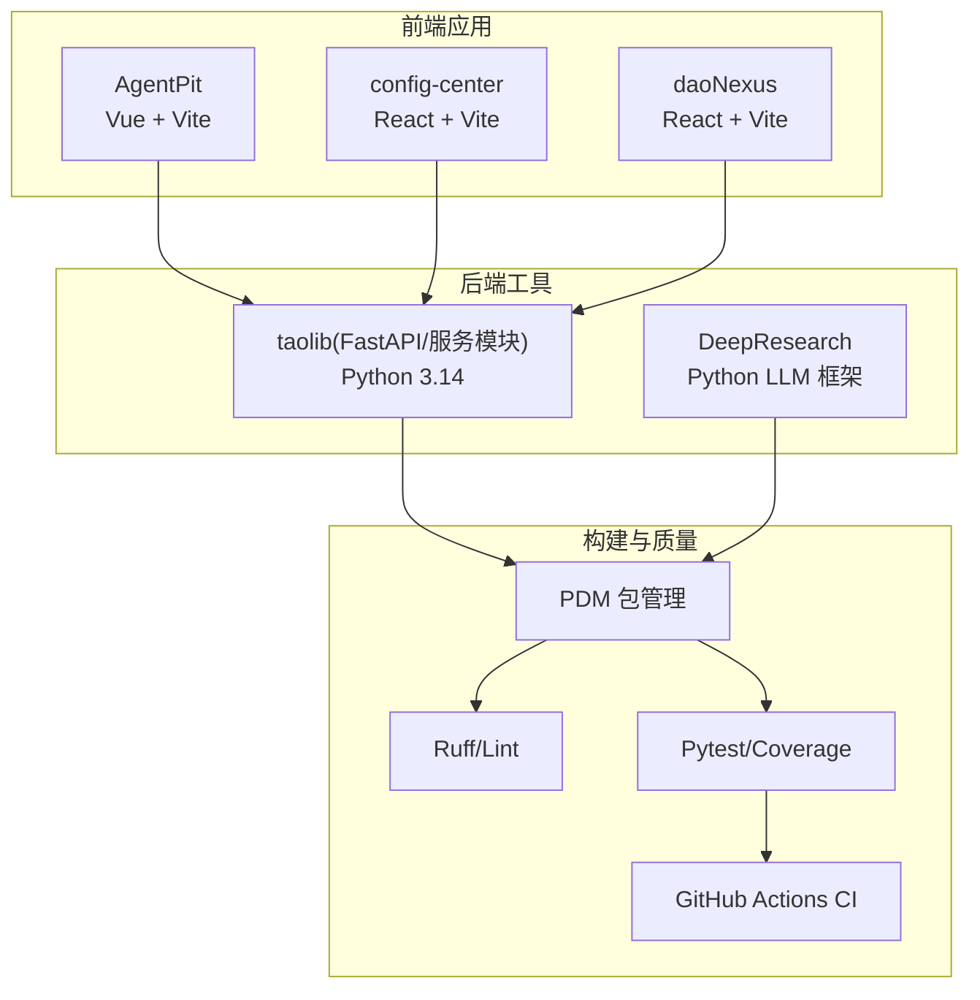
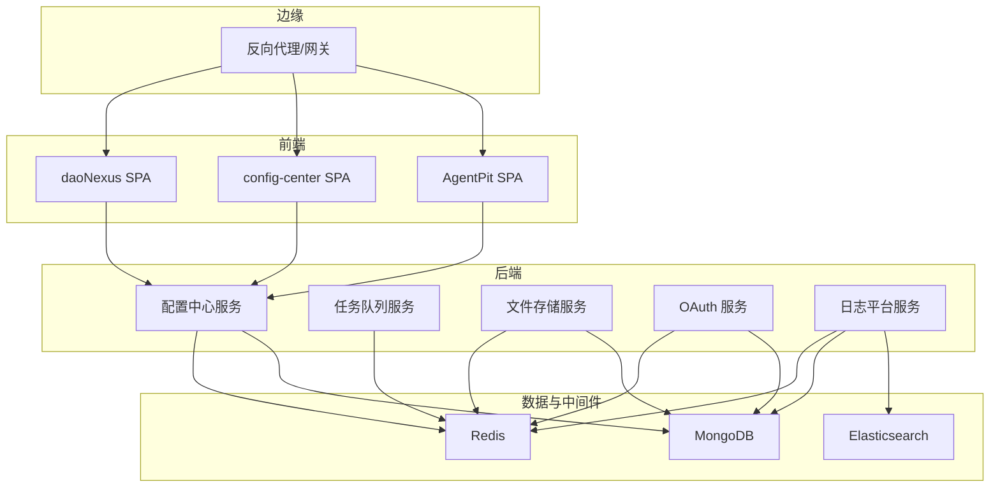
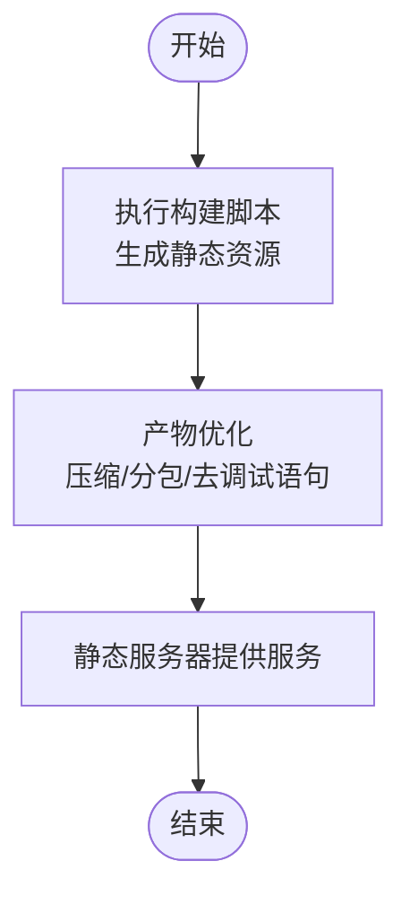
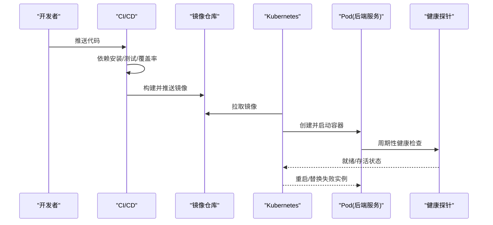
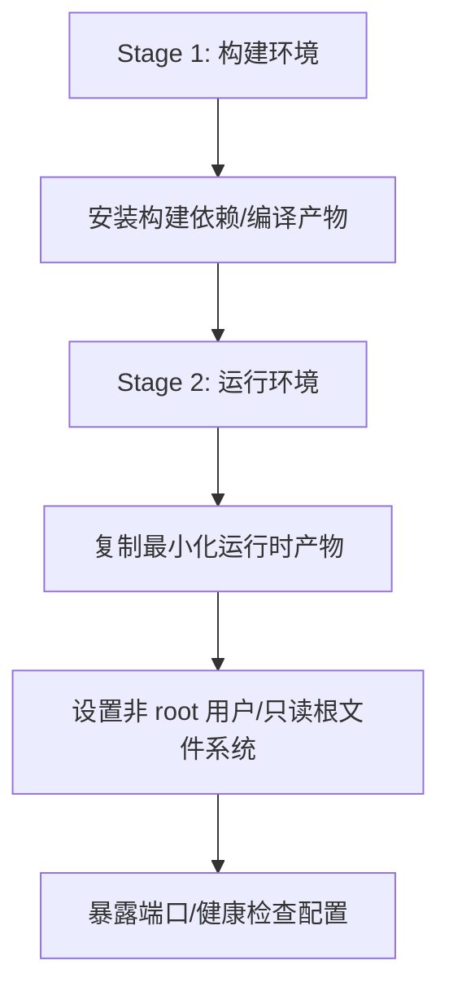
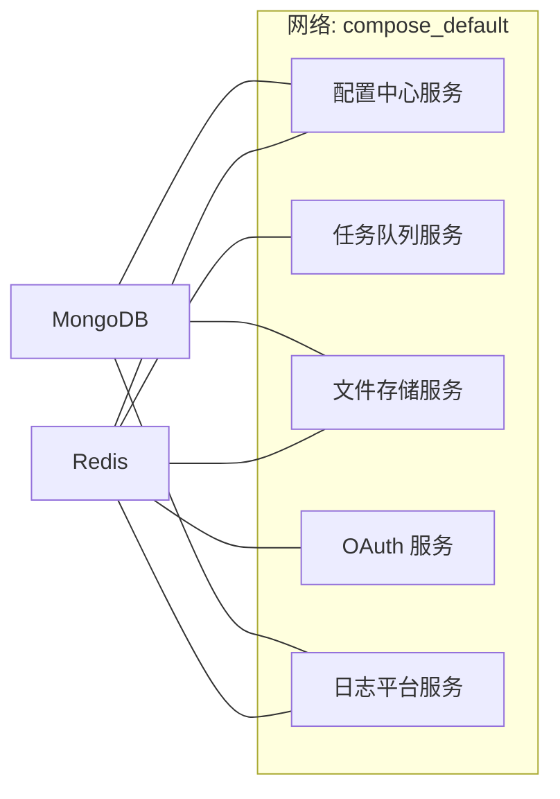
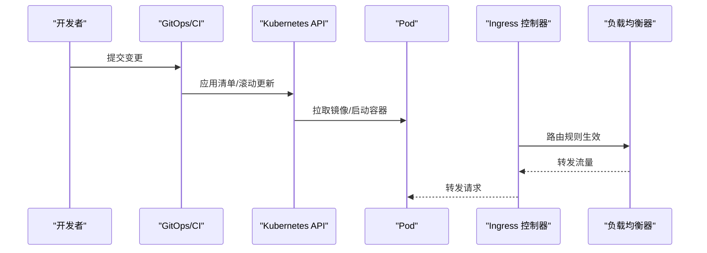
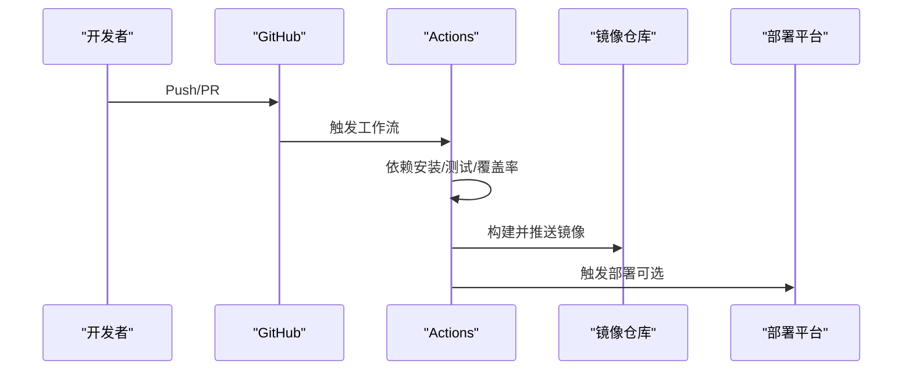
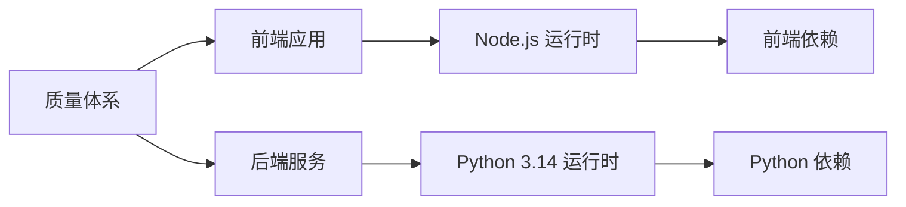

# 容器化部署

<cite>
**本文引用的文件**
- [pyproject.toml](file://pyproject.toml)
- [tools/flexloop/pyproject.toml](file://tools/flexloop/pyproject.toml)
- [tools/DeepResearch/pyproject.toml](file://tools/DeepResearch/pyproject.toml)
- [apps/AgentPit/package.json](file://apps/AgentPit/package.json)
- [apps/AgentPit/vite.config.ts](file://apps/AgentPit/vite.config.ts)
- [apps/config-center/package.json](file://apps/config-center/package.json)
- [apps/config-center/vite.config.ts](file://apps/config-center/vite.config.ts)
- [apps/daoNexus/package.json](file://apps/daoNexus/package.json)
- [tools/flexloop/.github/workflows/ci.yml](file://tools/flexloop/.github/workflows/ci.yml)
- [tools/DeepResearch/README.md](file://tools/DeepResearch/README.md)
</cite>

## 目录
1. [简介](#简介)
2. [项目结构](#项目结构)
3. [核心组件](#核心组件)
4. [架构总览](#架构总览)
5. [详细组件分析](#详细组件分析)
6. [依赖关系分析](#依赖关系分析)
7. [性能考量](#性能考量)
8. [故障排查指南](#故障排查指南)
9. [结论](#结论)
10. [附录](#附录)

## 简介
本指南面向在容器环境中部署该多应用生态系统的工程团队，覆盖以下主题：
- Docker 镜像构建与多阶段优化、分层策略
- Docker Compose 多服务编排、网络与卷挂载
- Kubernetes 集群部署、Pod/Service/Ingress 配置要点
- 安全配置、资源限制、健康检查、日志收集
- 镜像仓库管理与 CI/CD 流水线集成（含现有 GitHub Actions）

本指南以仓库中已存在的前端构建配置与后端依赖定义为基础，结合容器化最佳实践，给出可落地的实施建议。

## 项目结构
该仓库采用多应用与多工具并存的组织方式：
- 前端应用：多个基于 Vite 的单页应用（SPA），包含 Vue/React 生态
- 后端工具：Python 工具集与 FastAPI 服务模块（如配置中心、任务队列、文件存储、OAuth 等）
- 构建与质量保障：PDM 包管理、Ruff/Lint、Pytest/Coverage、GitHub Actions

**图表来源**
- [apps/AgentPit/package.json:1-73](file://apps/AgentPit/package.json#L1-L73)
- [apps/config-center/package.json:1-41](file://apps/config-center/package.json#L1-L41)
- [apps/daoNexus/package.json:1-34](file://apps/daoNexus/package.json#L1-L34)
- [tools/flexloop/pyproject.toml:1-318](file://tools/flexloop/pyproject.toml#L1-L318)
- [tools/DeepResearch/pyproject.toml:1-93](file://tools/DeepResearch/pyproject.toml#L1-L93)
- [tools/flexloop/.github/workflows/ci.yml:1-105](file://tools/flexloop/.github/workflows/ci.yml#L1-L105)

**章节来源**
- [apps/AgentPit/package.json:1-73](file://apps/AgentPit/package.json#L1-L73)
- [apps/config-center/package.json:1-41](file://apps/config-center/package.json#L1-L41)
- [apps/daoNexus/package.json:1-34](file://apps/daoNexus/package.json#L1-L34)
- [tools/flexloop/pyproject.toml:1-318](file://tools/flexloop/pyproject.toml#L1-L318)
- [tools/DeepResearch/pyproject.toml:1-93](file://tools/DeepResearch/pyproject.toml#L1-L93)
- [pyproject.toml:1-161](file://pyproject.toml#L1-L161)

## 核心组件
- 前端应用（Vite SPA）：通过各自 package.json 的脚本进行开发与构建；代理配置用于本地联调后端 API。
- Python 工具与服务模块：以 FastAPI 为核心的服务集合，涵盖认证、配置中心、数据同步、文件存储、任务队列、日志平台等。
- 质量体系：统一的 Lint、Type Check、测试与覆盖率策略，以及 CI 流水线。

**章节来源**
- [apps/AgentPit/vite.config.ts:1-15](file://apps/AgentPit/vite.config.ts#L1-L15)
- [apps/config-center/vite.config.ts:1-41](file://apps/config-center/vite.config.ts#L1-L41)
- [tools/flexloop/pyproject.toml:1-318](file://tools/flexloop/pyproject.toml#L1-L318)
- [tools/DeepResearch/pyproject.toml:1-93](file://tools/DeepResearch/pyproject.toml#L1-L93)
- [tools/flexloop/.github/workflows/ci.yml:1-105](file://tools/flexloop/.github/workflows/ci.yml#L1-L105)

## 架构总览
下图展示容器化视角下的典型部署拓扑：前端应用作为静态站点，后端服务以容器形式运行并通过反向代理对外暴露；数据库、缓存等外部依赖通过环境变量或配置中心注入。

[此图为概念性架构示意，不直接映射具体源码文件，故无“图表来源”标注]

## 详细组件分析

### 组件一：前端应用（Vite SPA）容器化
- 构建产物：使用各自应用的构建脚本生成静态资源，建议在只读根目录下提供静态文件。
- 开发体验：本地开发可启用热更新与代理，生产环境由反向代理统一入口。
- 代理示例：config-center 的 Vite 代理指向后端服务地址，便于本地联调。

**图表来源**
- [apps/config-center/vite.config.ts:17-39](file://apps/config-center/vite.config.ts#L17-L39)

**章节来源**
- [apps/AgentPit/package.json:6-19](file://apps/AgentPit/package.json#L6-L19)
- [apps/AgentPit/vite.config.ts:1-15](file://apps/AgentPit/vite.config.ts#L1-L15)
- [apps/config-center/package.json:6-13](file://apps/config-center/package.json#L6-L13)
- [apps/config-center/vite.config.ts:1-41](file://apps/config-center/vite.config.ts#L1-L41)
- [apps/daoNexus/package.json:6-12](file://apps/daoNexus/package.json#L6-L12)

### 组件二：后端服务（FastAPI + Python）容器化
- 运行时：Python 3.14，建议使用官方最小镜像（如 slim）并启用多阶段构建。
- 依赖安装：优先使用 PDM/Pip 缓存层，减少镜像体积与构建时间。
- 服务拆分：按功能域拆分为独立容器（配置中心、任务队列、文件存储、OAuth、日志平台等）。
- 端口与健康检查：统一暴露 HTTP 端口，提供 /health 或 /ready 接口，配合容器健康探针。

**图表来源**
- [tools/flexloop/.github/workflows/ci.yml:16-66](file://tools/flexloop/.github/workflows/ci.yml#L16-L66)
- [tools/flexloop/pyproject.toml:1-318](file://tools/flexloop/pyproject.toml#L1-L318)

**章节来源**
- [tools/flexloop/pyproject.toml:1-318](file://tools/flexloop/pyproject.toml#L1-L318)
- [tools/DeepResearch/pyproject.toml:1-93](file://tools/DeepResearch/pyproject.toml#L1-L93)
- [pyproject.toml:1-161](file://pyproject.toml#L1-L161)

### 组件三：容器镜像构建与多阶段优化
- 分层策略：将依赖安装与源码复制分离到不同层，利用缓存命中提升增量构建效率。
- 多阶段构建：使用构建阶段安装依赖与打包，运行阶段仅拷贝最终产物，显著减小镜像体积。
- 最小化运行时：选择官方 slim 镜像，禁用不必要的系统包与开发工具。
- 安全基线：固定依赖版本、启用只读根文件系统、非 root 用户运行、设置最小权限。

[此图为通用流程示意，不直接映射具体源码文件，故无“图表来源”标注]

### 组件四：Docker Compose 编排与多服务部署
- 服务定义：为每个后端服务定义独立服务，声明端口映射、环境变量、健康检查。
- 网络：使用自定义网络隔离服务间通信，避免主机网络冲突。
- 卷挂载：持久化数据卷（如日志、缓存）与配置卷（如模板/密钥）分离管理。
- 依赖管理：通过 depends_on 与健康检查实现有序启动与重试策略。

[此图为概念性编排示意，不直接映射具体源码文件，故无“图表来源”标注]

### 组件五：Kubernetes 部署要点
- Pod 配置：为每个服务定义 Deployment/StatefulSet，设置资源请求与限制、探针、环境变量。
- Service 暴露：ClusterIP/NodePort/LoadBalancer 依据访问场景选择；Ingress 控制器统一入口。
- 配置与密钥：使用 ConfigMap/Secret 注入配置与密钥，避免硬编码。
- 可观测性：启用日志采集与指标导出，结合探针与告警策略。

[此图为概念性流程示意，不直接映射具体源码文件，故无“图表来源”标注]

### 组件六：容器运行时管理
- 安全配置：非 root 用户、只读根文件系统、最小权限 RBAC、网络策略。
- 资源限制：CPU/内存 requests/limits 明确，避免资源争抢。
- 健康检查：liveness/readiness 探针定期探测，异常时自动重启或摘除。
- 日志收集：标准输出/错误输出采集，结合集中式日志系统（如 ELK/ECS）。

**章节来源**
- [tools/flexloop/pyproject.toml:97-109](file://tools/flexloop/pyproject.toml#L97-L109)

### 组件七：镜像仓库与 CI/CD 集成
- 镜像仓库：私有/公有仓库统一命名规范与标签策略（语义化版本/提交哈希）。
- CI/CD：在现有 GitHub Actions 基础上扩展镜像构建、推送与部署步骤。
- 自动化触发：分支保护、PR 触发、发布标签触发，确保质量门禁（测试、覆盖率、审计）。

**图表来源**
- [tools/flexloop/.github/workflows/ci.yml:1-105](file://tools/flexloop/.github/workflows/ci.yml#L1-L105)

**章节来源**
- [tools/flexloop/.github/workflows/ci.yml:1-105](file://tools/flexloop/.github/workflows/ci.yml#L1-L105)
- [tools/DeepResearch/README.md:1-69](file://tools/DeepResearch/README.md#L1-L69)

## 依赖关系分析
- 前端应用依赖各自构建工具链与运行时库，通过 package.json 管理。
- 后端服务模块依赖 Python 运行时与第三方库，通过 pyproject.toml 管理。
- 质量体系贯穿前后端，统一 Lint、测试与覆盖率策略。

**图表来源**
- [apps/AgentPit/package.json:20-40](file://apps/AgentPit/package.json#L20-L40)
- [apps/config-center/package.json:14-26](file://apps/config-center/package.json#L14-L26)
- [apps/daoNexus/package.json:13-21](file://apps/daoNexus/package.json#L13-L21)
- [tools/flexloop/pyproject.toml:65-166](file://tools/flexloop/pyproject.toml#L65-L166)
- [tools/DeepResearch/pyproject.toml:12-26](file://tools/DeepResearch/pyproject.toml#L12-L26)

**章节来源**
- [apps/AgentPit/package.json:1-73](file://apps/AgentPit/package.json#L1-L73)
- [apps/config-center/package.json:1-41](file://apps/config-center/package.json#L1-L41)
- [apps/daoNexus/package.json:1-34](file://apps/daoNexus/package.json#L1-L34)
- [tools/flexloop/pyproject.toml:1-318](file://tools/flexloop/pyproject.toml#L1-L318)
- [tools/DeepResearch/pyproject.toml:1-93](file://tools/DeepResearch/pyproject.toml#L1-L93)

## 性能考量
- 前端：合理分包、移除调试语句、开启压缩与缓存策略；静态资源 CDN 加速。
- 后端：依赖预装与缓存层、并发模型优化、连接池配置；数据库/缓存/搜索引擎的连接参数与超时设置。
- 容器：最小化镜像、合理 CPU/内存配额、水平/垂直伸缩策略；探针与自愈机制。

[本节提供通用指导，不直接分析具体文件，故无“章节来源”标注]

## 故障排查指南
- 构建失败：检查依赖安装与缓存层是否命中；确认 Node/Python 版本与依赖锁定。
- 运行异常：查看容器日志与探针状态；核对环境变量与配置中心连通性。
- 性能问题：分析慢查询、缓存命中率、并发与队列积压；调整资源配额与扩缩容阈值。
- 安全事件：核查镜像完整性、只读文件系统与最小权限；审计密钥与凭据管理。

**章节来源**
- [tools/flexloop/.github/workflows/ci.yml:42-66](file://tools/flexloop/.github/workflows/ci.yml#L42-L66)
- [tools/flexloop/pyproject.toml:97-109](file://tools/flexloop/pyproject.toml#L97-L109)

## 结论
通过将前端应用静态化、后端服务模块化，并结合多阶段构建、最小化运行时与完善的可观测性，可在容器环境中实现高效、稳定、可演进的部署方案。建议以现有质量体系为基础，扩展容器镜像构建与 Kubernetes 部署流程，形成从开发到生产的完整闭环。

[本节为总结性内容，不直接分析具体文件，故无“章节来源”标注]

## 附录
- 快速参考
  - 前端构建：使用各自应用的构建脚本生成静态资源。
  - 后端构建：使用 Python 3.14 与依赖管理工具，按模块拆分镜像。
  - CI/CD：在现有 GitHub Actions 基础上增加镜像构建与推送步骤。
  - 安全基线：非 root 用户、只读根文件系统、最小权限 RBAC、网络策略。

[本节为辅助性内容，不直接分析具体文件，故无“章节来源”标注]