# 开发环境搭建

<cite>
**本文档引用的文件**
- [apps/AgentPit/package.json](file://apps/AgentPit/package.json)
- [apps/AgentPit/tsconfig.json](file://apps/AgentPit/tsconfig.json)
- [apps/AgentPit/tailwind.config.ts](file://apps/AgentPit/tailwind.config.ts)
- [apps/AgentPit/postcss.config.js](file://apps/AgentPit/postcss.config.js)
- [apps/AgentPit/eslint.config.js](file://apps/AgentPit/eslint.config.js)
- [apps/AgentPit/vite.config.ts](file://apps/AgentPit/vite.config.ts)
- [apps/DaoMind/package.json](file://apps/DaoMind/package.json)
- [apps/DaoMind/pnpm-workspace.yaml](file://apps/DaoMind/pnpm-workspace.yaml)
- [apps/DaoMind/tsconfig.base.json](file://apps/DaoMind/tsconfig.base.json)
- [apps/DaoMind/.prettierrc](file://apps/DaoMind/.prettierrc)
- [apps/DaoMind/jest.config.js](file://apps/DaoMind/jest.config.js)
- [apps/DaoMind/tsconfig.json](file://apps/DaoMind/tsconfig.json)
- [apps/config-center/package.json](file://apps/config-center/package.json)
- [apps/forum/package.json](file://apps/forum/package.json)
- [apps/growth-tracker/package.json](file://apps/growth-tracker/package.json)
</cite>

## 目录
1. [简介](#简介)
2. [项目结构](#项目结构)
3. [核心组件](#核心组件)
4. [架构概览](#架构概览)
5. [详细组件分析](#详细组件分析)
6. [依赖分析](#依赖分析)
7. [性能考虑](#性能考虑)
8. [故障排除指南](#故障排除指南)
9. [结论](#结论)
10. [附录](#附录)

## 简介

本指南旨在帮助开发者快速搭建一致的开发环境，涵盖Node.js版本要求、pnpm包管理器安装、项目依赖安装等基础环境准备。文档深入解释了TypeScript配置、ESLint代码规范、Prettier格式化规则、Tailwind CSS样式配置等开发工具链设置，并提供IDE配置建议、VS Code扩展推荐、Git钩子配置等开发体验优化。同时包含环境变量配置、本地数据库连接、API服务启动等开发调试流程，以及常见环境问题排查和解决方案。

## 项目结构

该仓库采用多应用架构，包含多个独立的应用程序和共享工具：

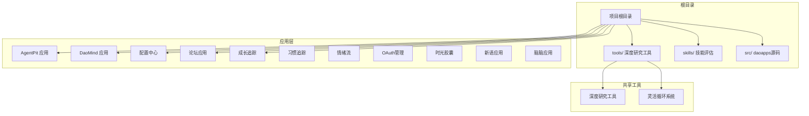

**图表来源**
- [apps/AgentPit/package.json:1-73](file://apps/AgentPit/package.json#L1-L73)
- [apps/DaoMind/package.json:1-1](file://apps/DaoMind/package.json#L1-L1)

**章节来源**
- [apps/AgentPit/package.json:1-73](file://apps/AgentPit/package.json#L1-L73)
- [apps/DaoMind/package.json:1-1](file://apps/DaoMind/package.json#L1-L1)

## 核心组件

### Node.js版本要求

根据项目配置，需要满足以下Node.js版本要求：

- **AgentPit应用**: Node.js >= 18.0.0（通过引擎字段声明）
- **DaoMind应用**: Node.js >= 18.0.0（通过引擎字段声明）
- **其他应用**: 基于Vite和TypeScript的标准配置，通常支持Node.js 16+

### 包管理器选择

项目同时支持npm和pnpm两种包管理器：

- **AgentPit应用**: 使用npm作为默认包管理器
- **DaoMind应用**: 使用pnpm作为包管理器，配置了工作区
- **其他应用**: 多数使用npm或pnpm

### TypeScript配置

项目采用分层TypeScript配置策略：

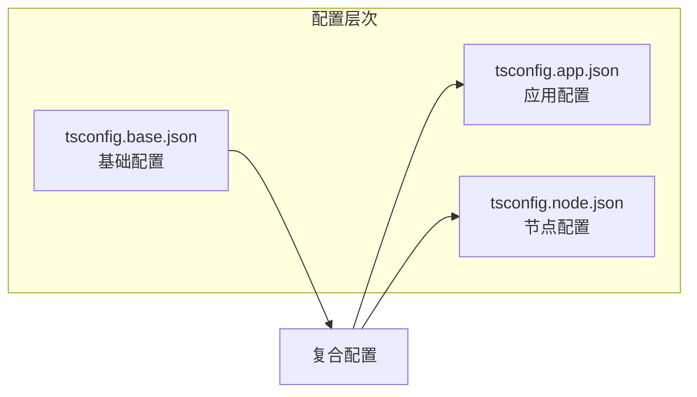

**图表来源**
- [apps/DaoMind/tsconfig.base.json:1-1](file://apps/DaoMind/tsconfig.base.json#L1-L1)
- [apps/AgentPit/tsconfig.json:1-8](file://apps/AgentPit/tsconfig.json#L1-L8)

**章节来源**
- [apps/AgentPit/package.json:1-73](file://apps/AgentPit/package.json#L1-L73)
- [apps/DaoMind/package.json:1-1](file://apps/DaoMind/package.json#L1-L1)
- [apps/DaoMind/tsconfig.base.json:1-1](file://apps/DaoMind/tsconfig.base.json#L1-L1)
- [apps/AgentPit/tsconfig.json:1-8](file://apps/AgentPit/tsconfig.json#L1-L8)

## 架构概览

开发环境采用现代化前端技术栈，结合多种应用架构模式：

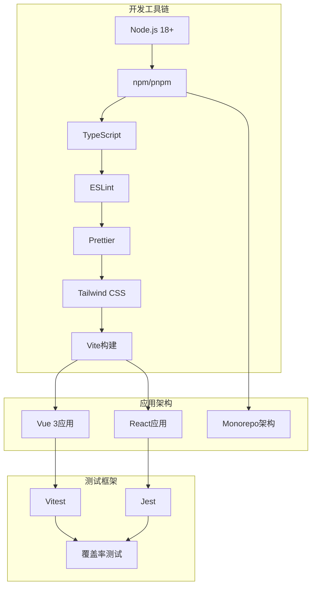

**图表来源**
- [apps/AgentPit/package.json:41-62](file://apps/AgentPit/package.json#L41-L62)
- [apps/DaoMind/package.json:1-1](file://apps/DaoMind/package.json#L1-L1)
- [apps/config-center/package.json:1-41](file://apps/config-center/package.json#L1-L41)

## 详细组件分析

### TypeScript配置详解

#### 分层配置架构

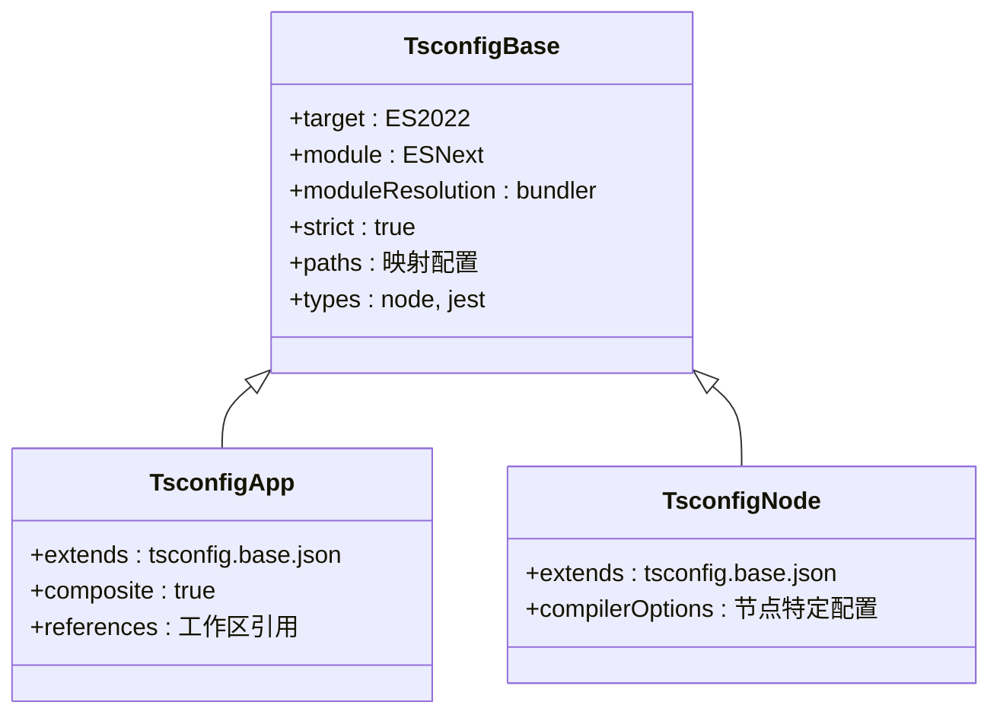

**图表来源**
- [apps/DaoMind/tsconfig.base.json:1-1](file://apps/DaoMind/tsconfig.base.json#L1-L1)
- [apps/DaoMind/tsconfig.json:1-1](file://apps/DaoMind/tsconfig.json#L1-L1)

#### 配置要点

1. **模块解析策略**: 使用bundler解析器，支持现代ES模块
2. **严格类型检查**: 启用严格模式和未检查索引访问
3. **路径映射**: 定义了完整的包路径映射
4. **复合编译**: 支持增量编译和工作区优化

**章节来源**
- [apps/DaoMind/tsconfig.base.json:1-1](file://apps/DaoMind/tsconfig.base.json#L1-L1)
- [apps/DaoMind/tsconfig.json:1-1](file://apps/DaoMind/tsconfig.json#L1-L1)

### ESLint代码规范配置

#### 规则配置架构

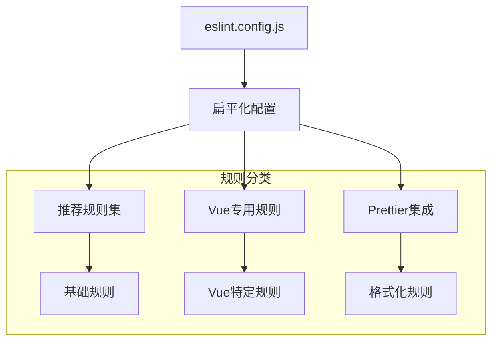

**图表来源**
- [apps/AgentPit/eslint.config.js:1-162](file://apps/AgentPit/eslint.config.js#L1-L162)

#### 关键配置特性

1. **生产环境规则**: 生产环境启用console和debugger警告
2. **Vue集成**: 完整的Vue 3单文件组件支持
3. **TypeScript集成**: TypeScript语法树解析器
4. **忽略规则**: 针对生成文件和测试文件的忽略配置

**章节来源**
- [apps/AgentPit/eslint.config.js:1-162](file://apps/AgentPit/eslint.config.js#L1-L162)

### Prettier格式化配置

#### 格式化规则设置

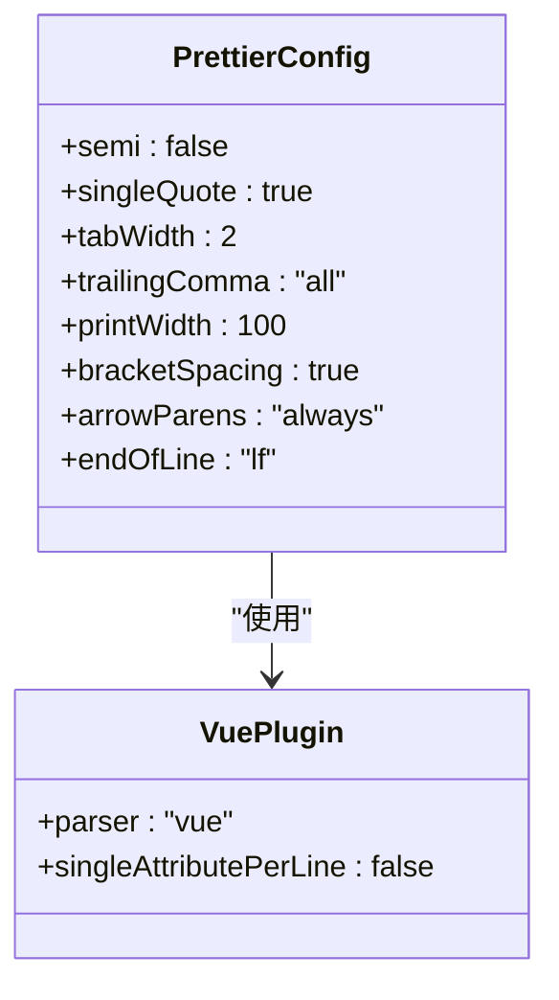

**图表来源**
- [apps/DaoMind/.prettierrc:1-1](file://apps/DaoMind/.prettierrc#L1-L1)

**章节来源**
- [apps/DaoMind/.prettierrc:1-1](file://apps/DaoMind/.prettierrc#L1-L1)

### Tailwind CSS样式配置

#### 样式配置架构

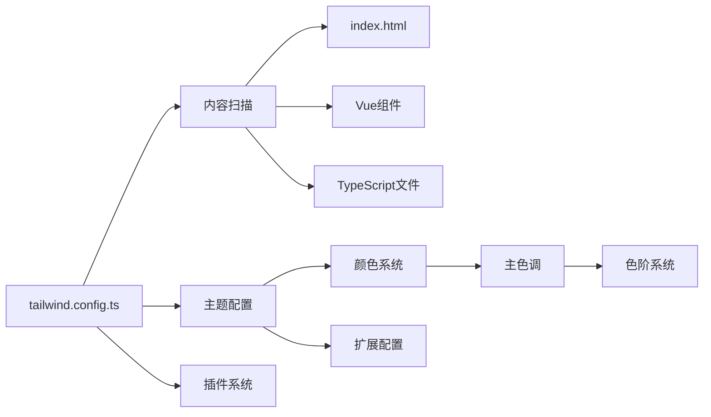

**图表来源**
- [apps/AgentPit/tailwind.config.ts:1-27](file://apps/AgentPit/tailwind.config.ts#L1-L27)

#### 主要特性

1. **内容扫描**: 自动扫描HTML和Vue组件中的类名
2. **自定义颜色**: 完整的蓝色色阶系统
3. **响应式设计**: 内置响应式断点支持
4. **插件系统**: 可扩展的插件架构

**章节来源**
- [apps/AgentPit/tailwind.config.ts:1-27](file://apps/AgentPit/tailwind.config.ts#L1-L27)

### Vite构建配置

#### 构建配置详解

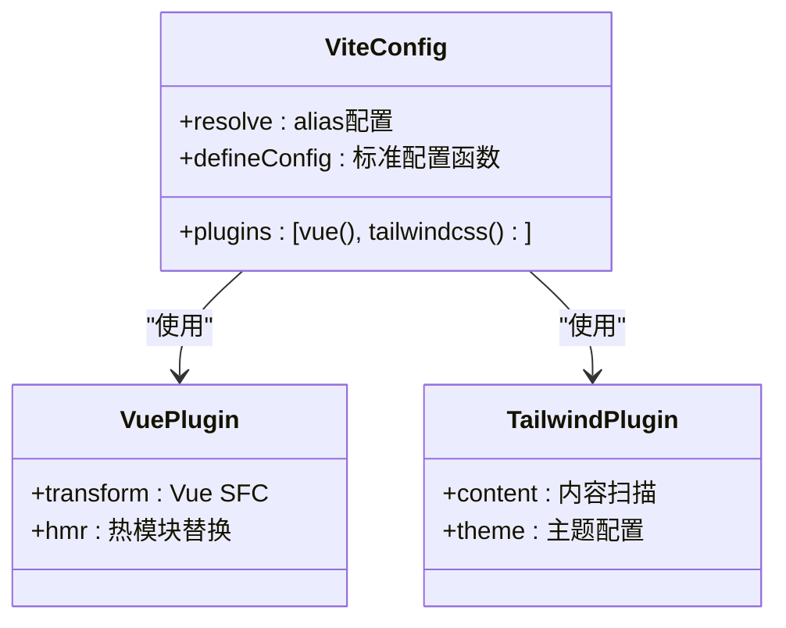

**图表来源**
- [apps/AgentPit/vite.config.ts:1-15](file://apps/AgentPit/vite.config.ts#L1-L15)

**章节来源**
- [apps/AgentPit/vite.config.ts:1-15](file://apps/AgentPit/vite.config.ts#L1-L15)

### 测试配置

#### 多种测试框架支持

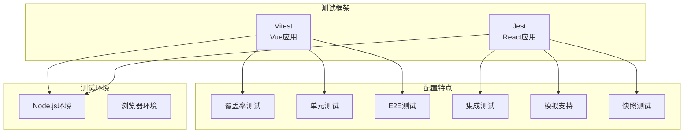

**图表来源**
- [apps/AgentPit/package.json:16-18](file://apps/AgentPit/package.json#L16-L18)
- [apps/DaoMind/jest.config.js:1-59](file://apps/DaoMind/jest.config.js#L1-L59)

**章节来源**
- [apps/AgentPit/package.json:16-18](file://apps/AgentPit/package.json#L16-L18)
- [apps/DaoMind/jest.config.js:1-59](file://apps/DaoMind/jest.config.js#L1-L59)

## 依赖分析

### 包管理器对比

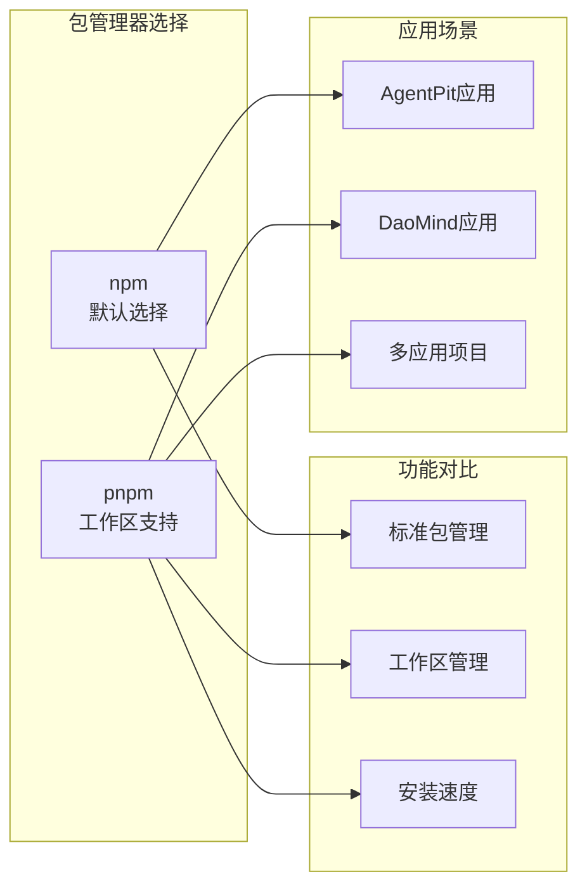

### 依赖关系图

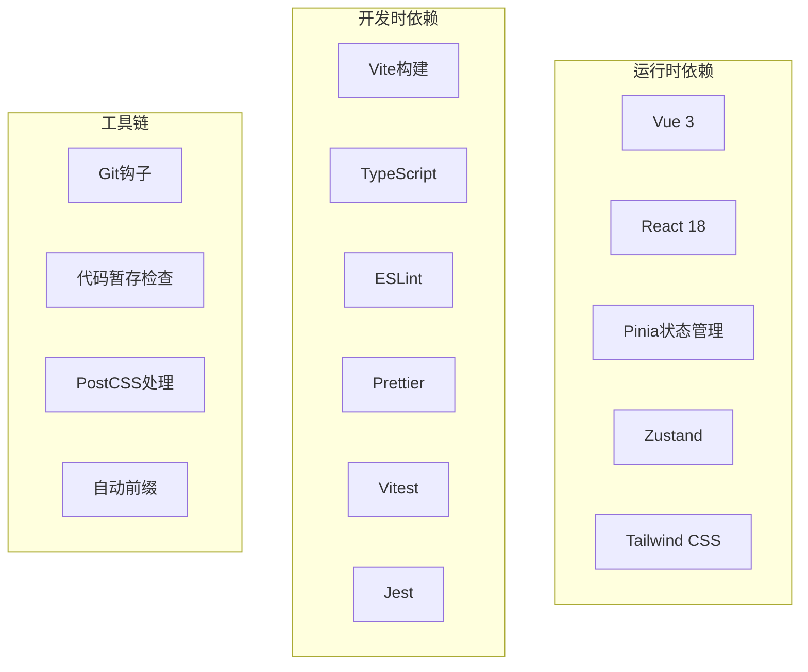

**图表来源**
- [apps/AgentPit/package.json:20-62](file://apps/AgentPit/package.json#L20-L62)
- [apps/DaoMind/package.json:1-1](file://apps/DaoMind/package.json#L1-L1)

**章节来源**
- [apps/AgentPit/package.json:20-62](file://apps/AgentPit/package.json#L20-L62)
- [apps/DaoMind/package.json:1-1](file://apps/DaoMind/package.json#L1-L1)

## 性能考虑

### 构建性能优化

1. **增量编译**: TypeScript复合配置支持增量编译
2. **模块解析**: 使用bundler解析器提升打包效率
3. **内容扫描**: Tailwind CSS智能内容扫描减少CSS体积
4. **代码分割**: Vite内置代码分割和懒加载支持

### 开发体验优化

1. **热重载**: Vite提供快速的热模块替换
2. **类型检查**: Vue TSC支持TypeScript类型检查
3. **错误报告**: 实时错误显示和修复建议
4. **调试支持**: 完整的Source Map支持

## 故障排除指南

### 常见环境问题

#### Node.js版本冲突

**问题症状**:
- npm install失败
- TypeScript编译错误
- Vite启动异常

**解决方案**:
1. 升级到Node.js 18+
2. 清理缓存: `npm cache clean --force`
3. 删除node_modules重新安装

#### 包管理器选择问题

**问题症状**:
- pnpm工作区无法识别
- 依赖安装不完整
- monorepo配置错误

**解决方案**:
1. 确认使用正确的包管理器
2. 检查pnpm-workspace.yaml配置
3. 运行`pnpm install`而非npm install

#### TypeScript配置冲突

**问题症状**:
- 类型检查失败
- 编译错误
- IDE类型提示异常

**解决方案**:
1. 检查tsconfig.base.json配置
2. 验证复合编译设置
3. 确认路径映射正确性

#### ESLint配置问题

**问题症状**:
- 代码格式化冲突
- 规则执行异常
- VS Code提示错误

**解决方案**:
1. 检查eslint.config.js配置
2. 验证Prettier集成
3. 确认忽略文件配置

### 调试技巧

#### 开发服务器问题

**问题症状**:
- 端口占用
- 热重载失效
- 路由问题

**解决方案**:
1. 更改端口号
2. 清理浏览器缓存
3. 检查路由配置
4. 重启开发服务器

#### 样式问题

**问题症状**:
- Tailwind类名无效
- 样式未生效
- 构建后样式丢失

**解决方案**:
1. 检查content路径配置
2. 验证Tailwind导入
3. 清理构建缓存

**章节来源**
- [apps/AgentPit/package.json:1-73](file://apps/AgentPit/package.json#L1-L73)
- [apps/DaoMind/package.json:1-1](file://apps/DaoMind/package.json#L1-L1)
- [apps/AgentPit/eslint.config.js:1-162](file://apps/AgentPit/eslint.config.js#L1-L162)

## 结论

本开发环境搭建指南提供了从基础环境准备到高级配置的完整解决方案。通过合理选择包管理器、配置TypeScript、ESLint和Prettier，以及优化Tailwind CSS和Vite构建，开发者可以建立高效、一致的开发环境。

关键成功因素包括：
- 选择合适的Node.js版本和包管理器
- 正确配置TypeScript分层架构
- 建立统一的代码规范和格式化规则
- 优化构建性能和开发体验
- 建立完善的测试和调试流程

遵循本指南，开发者可以快速搭建符合项目需求的开发环境，并确保团队协作的一致性和效率。

## 附录

### IDE配置建议

#### VS Code推荐扩展

1. **ESLint**: 代码质量检查
2. **Prettier**: 代码格式化
3. **Tailwind CSS IntelliSense**: 样式智能提示
4. **TypeScript Importer**: TypeScript导入管理
5. **Vue Language Features**: Vue开发支持
6. **Auto Rename Tag**: HTML标签自动重命名

#### Git钩子配置

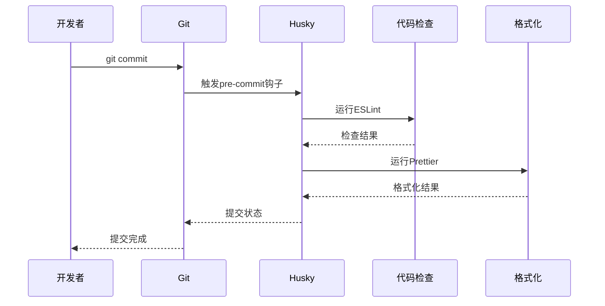

**图表来源**
- [apps/AgentPit/package.json:63-71](file://apps/AgentPit/package.json#L63-L71)

### 环境变量配置

#### 开发环境变量

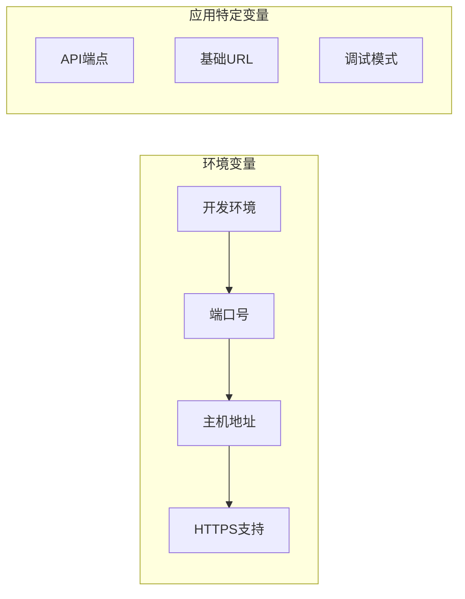

**章节来源**
- [apps/AgentPit/package.json:6-18](file://apps/AgentPit/package.json#L6-L18)
- [apps/DaoMind/package.json:1-1](file://apps/DaoMind/package.json#L1-L1)