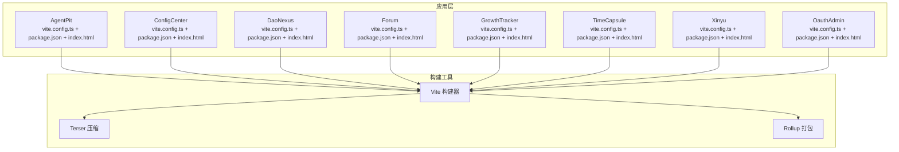
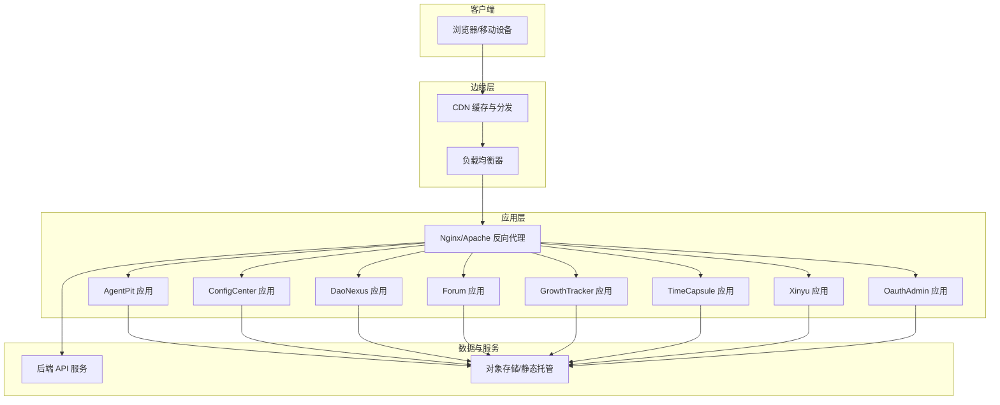
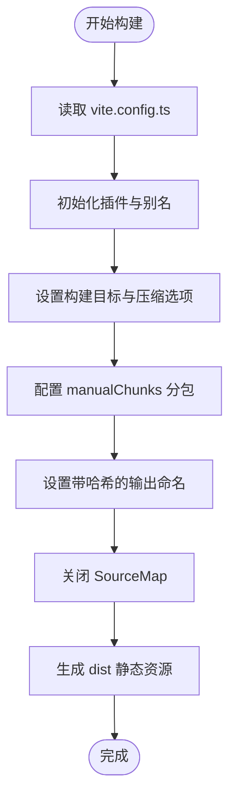
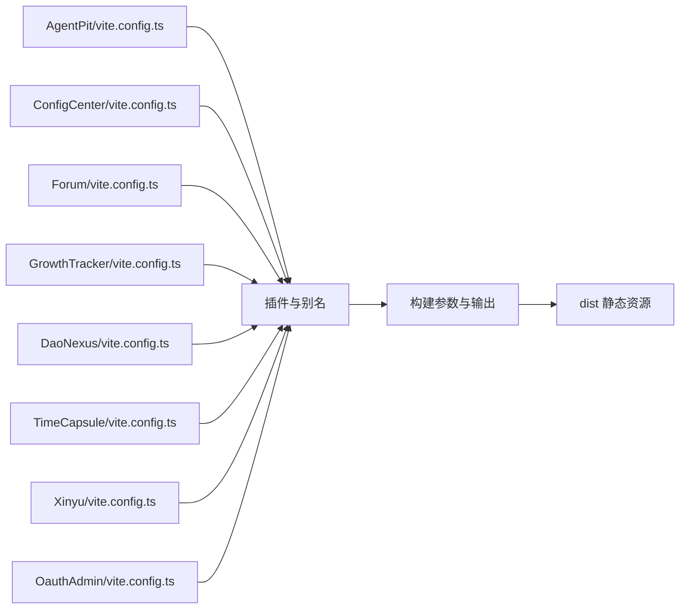

# 生产环境部署

<cite>
**本文引用的文件**
- [apps/AgentPit/vite.config.ts](file://apps/AgentPit/vite.config.ts)
- [apps/AgentPit/package.json](file://apps/AgentPit/package.json)
- [apps/AgentPit/index.html](file://apps/AgentPit/index.html)
- [apps/config-center/vite.config.ts](file://apps/config-center/vite.config.ts)
- [apps/config-center/index.html](file://apps/config-center/index.html)
- [apps/daoNexus/vite.config.ts](file://apps/daoNexus/vite.config.ts)
- [apps/daoNexus/index.html](file://apps/daoNexus/index.html)
- [apps/forum/vite.config.ts](file://apps/forum/vite.config.ts)
- [apps/forum/index.html](file://apps/forum/index.html)
- [apps/growth-tracker/vite.config.ts](file://apps/growth-tracker/vite.config.ts)
- [apps/growth-tracker/index.html](file://apps/growth-tracker/index.html)
- [apps/time-capsule/vite.config.ts](file://apps/time-capsule/vite.config.ts)
- [apps/xinyu/vite.config.ts](file://apps/xinyu/vite.config.ts)
- [apps/oauth-admin/vite.config.ts](file://apps/oauth-admin/vite.config.ts)
</cite>

## 目录
1. [简介](#简介)
2. [项目结构](#项目结构)
3. [核心组件](#核心组件)
4. [架构总览](#架构总览)
5. [详细组件分析](#详细组件分析)
6. [依赖关系分析](#依赖关系分析)
7. [性能考量](#性能考量)
8. [故障排查指南](#故障排查指南)
9. [结论](#结论)
10. [附录](#附录)

## 简介
本指南面向生产环境部署，覆盖前端静态资源构建流程、Vite 打包与产物优化、域名与 HTTPS 配置、CDN 加速与缓存策略、Web 服务器（Nginx/Apache）部署、反向代理与负载均衡、环境变量与密钥管理、以及部署回滚、蓝绿与灰度发布等高级运维实践。文档以仓库中各前端应用的 Vite 配置与入口 HTML 为基础，结合通用生产最佳实践，形成可落地的部署方案。

## 项目结构
本仓库采用多应用（monorepo）组织方式，每个前端应用独立维护其 Vite 配置与构建脚本，并通过统一的构建命令生成静态产物。典型结构包括：
- 每个应用拥有独立的 vite.config.ts、package.json、index.html
- 构建脚本在 package.json 的 scripts 字段定义，如 build、preview 等
- 静态资源由 Vite 在生产模式下打包到 dist 目录（默认行为）

图表来源
- [apps/AgentPit/vite.config.ts:1-15](file://apps/AgentPit/vite.config.ts#L1-L15)
- [apps/config-center/vite.config.ts:1-41](file://apps/config-center/vite.config.ts#L1-L41)
- [apps/daoNexus/vite.config.ts:1-36](file://apps/daoNexus/vite.config.ts#L1-L36)
- [apps/forum/vite.config.ts:1-36](file://apps/forum/vite.config.ts#L1-L36)
- [apps/growth-tracker/vite.config.ts:1-36](file://apps/growth-tracker/vite.config.ts#L1-L36)
- [apps/time-capsule/vite.config.ts:1-36](file://apps/time-capsule/vite.config.ts#L1-L36)
- [apps/xinyu/vite.config.ts:1-36](file://apps/xinyu/vite.config.ts#L1-L36)
- [apps/oauth-admin/vite.config.ts:1-45](file://apps/oauth-admin/vite.config.ts#L1-L45)

章节来源
- [apps/AgentPit/vite.config.ts:1-15](file://apps/AgentPit/vite.config.ts#L1-L15)
- [apps/AgentPit/package.json:1-73](file://apps/AgentPit/package.json#L1-L73)
- [apps/AgentPit/index.html:1-14](file://apps/AgentPit/index.html#L1-L14)
- [apps/config-center/index.html:1-16](file://apps/config-center/index.html#L1-L16)
- [apps/daoNexus/index.html:1-15](file://apps/daoNexus/index.html#L1-L15)
- [apps/forum/index.html:1-15](file://apps/forum/index.html#L1-L15)
- [apps/growth-tracker/index.html:1-14](file://apps/growth-tracker/index.html#L1-L14)

## 核心组件
- Vite 构建配置：集中于各应用的 vite.config.ts，包含插件、别名、开发服务器代理、构建目标、压缩与分包策略、输出命名规则、SourceMap 开关等。
- 包管理与脚本：各应用 package.json 定义了构建、预览、测试、格式化等脚本，确保 CI/CD 流水线可重复执行。
- 入口 HTML：index.html 作为 SPA 入口，挂载根节点并加载应用主入口脚本。

章节来源
- [apps/AgentPit/vite.config.ts:1-15](file://apps/AgentPit/vite.config.ts#L1-L15)
- [apps/AgentPit/package.json:6-18](file://apps/AgentPit/package.json#L6-L18)
- [apps/AgentPit/index.html:10-12](file://apps/AgentPit/index.html#L10-L12)
- [apps/config-center/index.html:11-13](file://apps/config-center/index.html#L11-L13)
- [apps/daoNexus/index.html:10-12](file://apps/daoNexus/index.html#L10-L12)
- [apps/forum/index.html:10-12](file://apps/forum/index.html#L10-L12)
- [apps/growth-tracker/index.html:10-12](file://apps/growth-tracker/index.html#L10-L12)

## 架构总览
生产部署建议采用“静态站点 + 反向代理 + CDN + 负载均衡”的架构。前端应用构建产物部署至对象存储或静态托管服务，由 Nginx/Apache 提供反向代理与缓存，CDN 分发热点资源，后端 API 通过反向代理转发。

图表来源
- [apps/AgentPit/vite.config.ts:1-15](file://apps/AgentPit/vite.config.ts#L1-L15)
- [apps/config-center/vite.config.ts:1-41](file://apps/config-center/vite.config.ts#L1-L41)
- [apps/daoNexus/vite.config.ts:1-36](file://apps/daoNexus/vite.config.ts#L1-L36)
- [apps/forum/vite.config.ts:1-36](file://apps/forum/vite.config.ts#L1-L36)
- [apps/growth-tracker/vite.config.ts:1-36](file://apps/growth-tracker/vite.config.ts#L1-L36)
- [apps/time-capsule/vite.config.ts:1-36](file://apps/time-capsule/vite.config.ts#L1-L36)
- [apps/xinyu/vite.config.ts:1-36](file://apps/xinyu/vite.config.ts#L1-L36)
- [apps/oauth-admin/vite.config.ts:1-45](file://apps/oauth-admin/vite.config.ts#L1-L45)

## 详细组件分析

### 构建与打包流程
- 构建目标与压缩：各应用均使用 Terser 进行代码压缩，并开启 drop_console 与 drop_debugger 以减少体积与风险。
- 分包策略：通过 Rollup 的 manualChunks 将 React 生态与 UI 组件库拆分为独立 vendor 包，提升缓存命中率。
- 输出命名：chunkFileNames、entryFileNames、assetFileNames 使用哈希后缀，便于长期缓存与按需失效。
- SourceMap：生产构建关闭 SourceMap，降低泄露风险与带宽消耗。
- 别名与插件：统一使用路径别名与框架插件，保证开发与生产一致性。

图表来源
- [apps/config-center/vite.config.ts:17-40](file://apps/config-center/vite.config.ts#L17-L40)
- [apps/forum/vite.config.ts:12-35](file://apps/forum/vite.config.ts#L12-L35)
- [apps/growth-tracker/vite.config.ts:12-35](file://apps/growth-tracker/vite.config.ts#L12-L35)
- [apps/daoNexus/vite.config.ts:12-35](file://apps/daoNexus/vite.config.ts#L12-L35)
- [apps/time-capsule/vite.config.ts:12-35](file://apps/time-capsule/vite.config.ts#L12-L35)
- [apps/xinyu/vite.config.ts:12-35](file://apps/xinyu/vite.config.ts#L12-L35)
- [apps/oauth-admin/vite.config.ts:21-43](file://apps/oauth-admin/vite.config.ts#L21-L43)

章节来源
- [apps/config-center/vite.config.ts:1-41](file://apps/config-center/vite.config.ts#L1-L41)
- [apps/forum/vite.config.ts:1-36](file://apps/forum/vite.config.ts#L1-L36)
- [apps/growth-tracker/vite.config.ts:1-36](file://apps/growth-tracker/vite.config.ts#L1-L36)
- [apps/daoNexus/vite.config.ts:1-36](file://apps/daoNexus/vite.config.ts#L1-L36)
- [apps/time-capsule/vite.config.ts:1-36](file://apps/time-capsule/vite.config.ts#L1-L36)
- [apps/xinyu/vite.config.ts:1-36](file://apps/xinyu/vite.config.ts#L1-L36)
- [apps/oauth-admin/vite.config.ts:1-45](file://apps/oauth-admin/vite.config.ts#L1-L45)

### Web 服务器部署（Nginx/Apache）
- 静态资源托管：将 dist 目录内容部署至对象存储或静态托管服务；Nginx/Apache 可直接指向该目录或通过反向代理访问。
- 单页应用路由回退：配置 404 回退至 index.html，确保刷新与直链可用。
- 反向代理：将 /api 前缀转发至后端服务，保持与开发时一致的代理配置。
- 缓存策略：对带哈希的 JS/CSS/媒体资源设置长缓存；HTML 设置短缓存或不缓存；对动态接口禁用缓存。
- 安全头：启用 HSTS、CSP、X-Frame-Options、X-Content-Type-Options 等安全响应头。
- Gzip/Brotli：开启压缩以降低传输体积。

章节来源
- [apps/config-center/vite.config.ts:12-16](file://apps/config-center/vite.config.ts#L12-L16)
- [apps/oauth-admin/vite.config.ts:12-20](file://apps/oauth-admin/vite.config.ts#L12-L20)

### 域名与 HTTPS
- 域名解析：将应用域名解析到负载均衡器或对象存储托管地址。
- 证书申请：通过 ACME（Let’s Encrypt）自动化获取与续期证书；或使用云厂商提供的托管证书服务。
- 强制 HTTPS：重定向 HTTP 至 HTTPS，启用 HSTS。
- 多域名支持：为不同应用准备独立子域或同域多路径，确保证书覆盖范围。

### CDN 加速与缓存
- 全球分发：选择具备边缘节点的 CDN，就近分发静态资源。
- 缓存键：基于文件名哈希的缓存键，避免版本更新不生效。
- 动态资源：对 API 接口与非静态资源不缓存或短缓存。
- 回源策略：合理设置回源超时与失败重试，保障稳定性。

### 环境变量与配置管理
- 环境隔离：区分 dev/staging/prod 的环境变量，避免硬编码在前端。
- 构建注入：通过 Vite 的环境变量机制在构建时注入只读配置。
- 密钥管理：敏感信息不打入前端包；通过后端 API 或服务端渲染暴露必要能力。
- 配置中心：对于运行时可变配置，通过后端配置中心下发，前端按需拉取。

### 部署回滚、蓝绿与灰度
- 回滚策略：保留最近 N 个版本的 dist 版本，快速切换；变更前备份当前版本。
- 蓝绿部署：两套环境交替，新版本先上线至备用环境，验证通过后切换流量。
- 灰度发布：按用户群体或地域逐步放量，结合 CDN/负载均衡的权重或路由规则实现。

## 依赖关系分析
各应用的构建配置高度一致，体现统一的工程化标准。它们共享的依赖点包括：
- 插件生态：React/Vue 插件、路径别名、开发代理
- 构建参数：ES 目标、Terser 压缩、manualChunks、输出命名、SourceMap 关闭
- 入口约定：index.html 中的根节点与入口脚本加载

图表来源
- [apps/AgentPit/vite.config.ts:1-15](file://apps/AgentPit/vite.config.ts#L1-L15)
- [apps/config-center/vite.config.ts:1-41](file://apps/config-center/vite.config.ts#L1-L41)
- [apps/forum/vite.config.ts:1-36](file://apps/forum/vite.config.ts#L1-L36)
- [apps/growth-tracker/vite.config.ts:1-36](file://apps/growth-tracker/vite.config.ts#L1-L36)
- [apps/daoNexus/vite.config.ts:1-36](file://apps/daoNexus/vite.config.ts#L1-L36)
- [apps/time-capsule/vite.config.ts:1-36](file://apps/time-capsule/vite.config.ts#L1-L36)
- [apps/xinyu/vite.config.ts:1-36](file://apps/xinyu/vite.config.ts#L1-L36)
- [apps/oauth-admin/vite.config.ts:1-45](file://apps/oauth-admin/vite.config.ts#L1-L45)

章节来源
- [apps/AgentPit/vite.config.ts:1-15](file://apps/AgentPit/vite.config.ts#L1-L15)
- [apps/config-center/vite.config.ts:1-41](file://apps/config-center/vite.config.ts#L1-L41)
- [apps/forum/vite.config.ts:1-36](file://apps/forum/vite.config.ts#L1-L36)
- [apps/growth-tracker/vite.config.ts:1-36](file://apps/growth-tracker/vite.config.ts#L1-L36)
- [apps/daoNexus/vite.config.ts:1-36](file://apps/daoNexus/vite.config.ts#L1-L36)
- [apps/time-capsule/vite.config.ts:1-36](file://apps/time-capsule/vite.config.ts#L1-L36)
- [apps/xinyu/vite.config.ts:1-36](file://apps/xinyu/vite.config.ts#L1-L36)
- [apps/oauth-admin/vite.config.ts:1-45](file://apps/oauth-admin/vite.config.ts#L1-L45)

## 性能考量
- 资源分包：vendor 拆分与哈希命名提升缓存复用，降低二次加载成本。
- 代码压缩：移除调试与日志代码，减小体积。
- 静态资源缓存：对不可变资源设置长缓存，对可变资源短缓存或不缓存。
- 传输优化：启用 Gzip/Brotli 压缩与 HTTP/2；CDN 边缘缓存与智能回源。
- 启动优化：入口 HTML 精简，避免阻塞渲染；按需加载非关键模块。

## 故障排查指南
- 构建失败
  - 检查 Node 版本与包管理器兼容性
  - 确认依赖安装完整，锁文件未损坏
  - 查看构建日志中的语法错误与类型检查问题
- 预览异常
  - 确认本地预览端口未被占用
  - 检查代理配置是否指向正确的后端地址
- 生产访问异常
  - 检查 index.html 是否正确回退到根路由
  - 核对静态资源路径与 CDN/对象存储映射
  - 验证 HTTPS 证书有效性与 HSTS 配置
- 缓存问题
  - 确认带哈希文件名已更新
  - 清理浏览器与 CDN 缓存
  - 检查响应头缓存控制策略

章节来源
- [apps/AgentPit/package.json:6-18](file://apps/AgentPit/package.json#L6-L18)
- [apps/AgentPit/vite.config.ts:1-15](file://apps/AgentPit/vite.config.ts#L1-L15)
- [apps/config-center/vite.config.ts:12-16](file://apps/config-center/vite.config.ts#L12-L16)
- [apps/oauth-admin/vite.config.ts:12-20](file://apps/oauth-admin/vite.config.ts#L12-L20)

## 结论
通过统一的 Vite 构建配置与严格的生产部署策略，DAO 应用可在保证性能与安全的前提下实现稳定交付。建议结合 CDN、反向代理与负载均衡，配合完善的监控与回滚机制，持续提升可用性与用户体验。

## 附录
- 构建命令参考
  - 开发：vite
  - 预览：vite preview
  - 构建：vite build
- 入口 HTML 约定
  - 各应用的 index.html 均包含根容器与入口脚本加载，确保 SPA 正常运行

章节来源
- [apps/AgentPit/package.json:6-18](file://apps/AgentPit/package.json#L6-L18)
- [apps/AgentPit/index.html:10-12](file://apps/AgentPit/index.html#L10-L12)
- [apps/config-center/index.html:11-13](file://apps/config-center/index.html#L11-L13)
- [apps/daoNexus/index.html:10-12](file://apps/daoNexus/index.html#L10-L12)
- [apps/forum/index.html:10-12](file://apps/forum/index.html#L10-L12)
- [apps/growth-tracker/index.html:10-12](file://apps/growth-tracker/index.html#L10-L12)