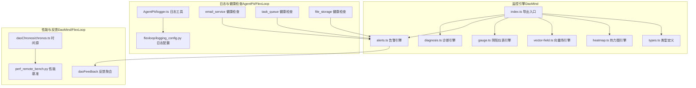
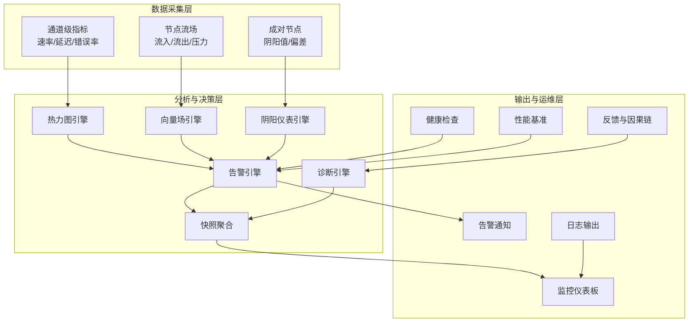
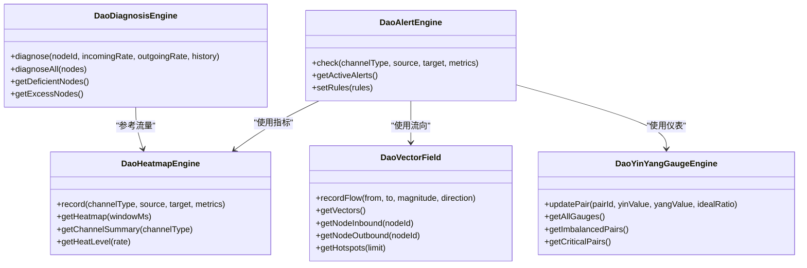
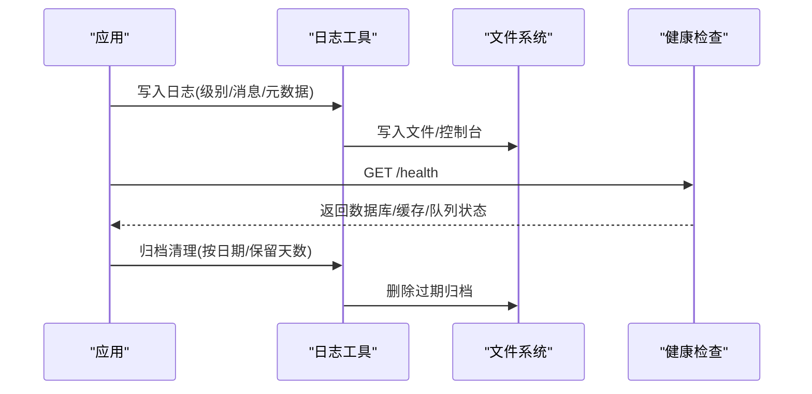
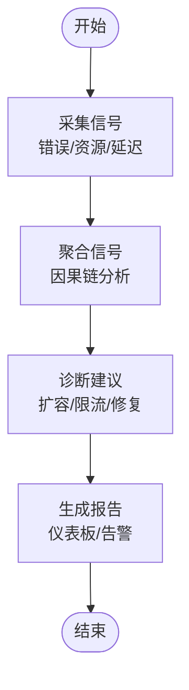
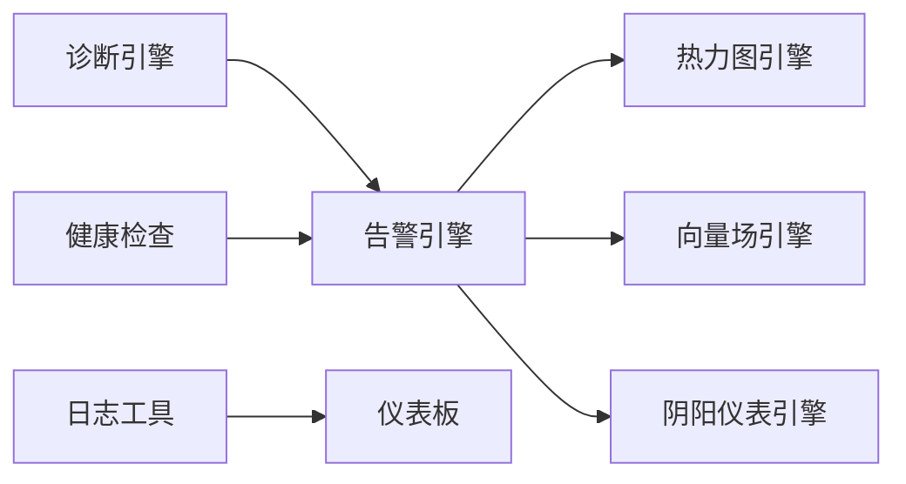

# 监控与日志管理

<cite>
**本文引用的文件**
- [apps/DaoMind/packages/daoMonitor/src/index.ts](file://apps/DaoMind/packages/daoMonitor/src/index.ts)
- [apps/DaoMind/packages/daoMonitor/src/types.ts](file://apps/DaoMind/packages/daoMonitor/src/types.ts)
- [apps/DaoMind/packages/daoMonitor/src/heatmap.ts](file://apps/DaoMind/packages/daoMonitor/src/heatmap.ts)
- [apps/DaoMind/packages/daoMonitor/src/vector-field.ts](file://apps/DaoMind/packages/daoMonitor/src/vector-field.ts)
- [apps/DaoMind/packages/daoMonitor/src/gauge.ts](file://apps/DaoMind/packages/daoMonitor/src/gauge.ts)
- [apps/DaoMind/packages/daoMonitor/src/alerts.ts](file://apps/DaoMind/packages/daoMonitor/src/alerts.ts)
- [apps/DaoMind/packages/daoMonitor/src/diagnosis.ts](file://apps/DaoMind/packages/daoMonitor/src/diagnosis.ts)
- [apps/DaoMind/tests/test-monitor-system.test.ts](file://apps/DaoMind/tests/test-monitor-system.test.ts)
- [apps/AgentPit/src/utils/logger.ts](file://apps/AgentPit/src/utils/logger.ts)
- [tools/flexloop/src/taolib/testing/logging_config.py](file://tools/flexloop/src/taolib/testing/logging_config.py)
- [tools/flexloop/tests/testing/test_logging_config.py](file://tools/flexloop/tests/testing/test_logging_config.py)
- [tools/flexloop/src/taolib/testing/email_service/server/api/health.py](file://tools/flexloop/src/taolib/testing/email_service/server/api/health.py)
- [tools/flexloop/src/taolib/testing/task_queue/server/api/health.py](file://tools/flexloop/src/taolib/testing/task_queue/server/api/health.py)
- [tools/flexloop/src/taolib/testing/file_storage/server/api/health.py](file://tools/flexloop/src/taolib/testing/file_storage/server/api/health.py)
- [tools/flexloop/tests/testing/perf_remote_bench.py](file://tools/flexloop/tests/testing/perf_remote_bench.py)
- [apps/DaoMind/packages/daoFeedback/src/__tests__/stage2-aggregate.test.ts](file://apps/DaoMind/packages/daoFeedback/src/__tests__/stage2-aggregate.test.ts)
- [apps/DaoMind/packages/daoChronos/src/chronos.ts](file://apps/DaoMind/packages/daoChronos/src/chronos.ts)
</cite>

## 目录
1. [引言](#引言)
2. [项目结构](#项目结构)
3. [核心组件](#核心组件)
4. [架构总览](#架构总览)
5. [详细组件分析](#详细组件分析)
6. [依赖关系分析](#依赖关系分析)
7. [性能考量](#性能考量)
8. [故障排查指南](#故障排查指南)
9. [结论](#结论)
10. [附录](#附录)

## 引言
本文件面向“监控与日志管理”的运维保障体系，结合仓库中现有的监控与日志相关模块，系统化梳理应用性能监控指标、业务指标收集、用户行为分析、日志采集与存储、错误追踪与异常告警、性能瓶颈定位、用户体验监控、监控仪表板与告警规则、通知渠道与应急响应，并扩展到 APM 工具集成与分布式追踪的实践路径。文档以实际源码为依据，辅以可视化图表帮助不同背景读者理解。

## 项目结构
本项目的监控与日志相关能力主要分布在以下位置：
- DaoMind 的监控引擎包：提供热力图、向量场、阴阳平衡仪表、告警、诊断与快照聚合等核心能力。
- AgentPit 的前端日志工具：提供统一的日志写入、归档清理与按级别输出。
- FlexLoop 的 Python 日志配置与健康检查：提供可插拔的日志格式化、敏感信息过滤与多服务健康检查。
- DaoMind 的反馈与性能基准测试：提供信号聚合、因果链分析与性能回归对比。
- DaoMind 的计时器与时间源：提供高精度时间测量，支撑性能与延迟分析。

**图表来源**
- [apps/DaoMind/packages/daoMonitor/src/index.ts:1-17](file://apps/DaoMind/packages/daoMonitor/src/index.ts#L1-L17)
- [apps/DaoMind/packages/daoMonitor/src/types.ts:1-72](file://apps/DaoMind/packages/daoMonitor/src/types.ts#L1-L72)
- [apps/DaoMind/packages/daoMonitor/src/heatmap.ts:1-100](file://apps/DaoMind/packages/daoMonitor/src/heatmap.ts#L1-L100)
- [apps/DaoMind/packages/daoMonitor/src/vector-field.ts:1-80](file://apps/DaoMind/packages/daoMonitor/src/vector-field.ts#L1-L80)
- [apps/DaoMind/packages/daoMonitor/src/gauge.ts:1-104](file://apps/DaoMind/packages/daoMonitor/src/gauge.ts#L1-L104)
- [apps/DaoMind/packages/daoMonitor/src/alerts.ts:59-102](file://apps/DaoMind/packages/daoMonitor/src/alerts.ts#L59-L102)
- [apps/DaoMind/packages/daoMonitor/src/diagnosis.ts:1-75](file://apps/DaoMind/packages/daoMonitor/src/diagnosis.ts#L1-L75)
- [apps/AgentPit/src/utils/logger.ts:242-395](file://apps/AgentPit/src/utils/logger.ts#L242-L395)
- [tools/flexloop/src/taolib/testing/logging_config.py:288-327](file://tools/flexloop/src/taolib/testing/logging_config.py#L288-L327)
- [tools/flexloop/src/taolib/testing/email_service/server/api/health.py:1-56](file://tools/flexloop/src/taolib/testing/email_service/server/api/health.py#L1-L56)
- [tools/flexloop/src/taolib/testing/task_queue/server/api/health.py:1-46](file://tools/flexloop/src/taolib/testing/task_queue/server/api/health.py#L1-L46)
- [tools/flexloop/src/taolib/testing/file_storage/server/api/health.py:1-13](file://tools/flexloop/src/taolib/testing/file_storage/server/api/health.py#L1-L13)
- [apps/DaoMind/packages/daoFeedback/src/__tests__/stage2-aggregate.test.ts:149-190](file://apps/DaoMind/packages/daoFeedback/src/__tests__/stage2-aggregate.test.ts#L149-L190)
- [apps/DaoMind/packages/daoChronos/src/chronos.ts:46-82](file://apps/DaoMind/packages/daoChronos/src/chronos.ts#L46-L82)
- [tools/flexloop/tests/testing/perf_remote_bench.py:632-699](file://tools/flexloop/tests/testing/perf_remote_bench.py#L632-L699)

**章节来源**
- [apps/DaoMind/packages/daoMonitor/src/index.ts:1-17](file://apps/DaoMind/packages/daoMonitor/src/index.ts#L1-L17)
- [apps/AgentPit/src/utils/logger.ts:242-395](file://apps/AgentPit/src/utils/logger.ts#L242-L395)
- [tools/flexloop/src/taolib/testing/logging_config.py:288-327](file://tools/flexloop/src/taolib/testing/logging_config.py#L288-L327)

## 核心组件
- 监控引擎（DaoMind）
  - 热力图引擎：记录并聚合通道级消息速率、平均延迟与错误率，支持窗口筛选与通道汇总。
  - 向量场引擎：记录节点间流向、方向与压力，支持热点节点识别与邻接关系查询。
  - 阴阳仪表引擎：对成对节点进行阴阳值建模，计算偏差与状态，识别失衡与临界状态。
  - 告警引擎：基于规则条件触发告警，生成描述与影响节点列表，维护活跃告警集合。
  - 诊断引擎：基于流入/流出速率与趋势判断节点状态（气虚/气盛/调和），给出建议。
  - 快照聚合：整合热力图、向量场、仪表、告警与诊断，形成系统健康快照。
- 日志与健康检查
  - AgentPit 日志工具：统一日志写入、归档清理、开发/生产环境差异化输出。
  - FlexLoop 日志配置：支持文本/JSON 格式、控制台与文件输出、敏感信息过滤、自动目录创建。
  - 多服务健康检查：数据库、缓存、队列与外部提供商状态检查，返回整体健康状态。
- 性能与反馈
  - DaoChronos 时间源：提供单调时钟与系统时间源，支撑高精度计时。
  - 性能基准：功能一致性、并发与高延迟场景、线程安全与历史基线对比。
  - 反馈聚合：信号因果链分析与推荐生成，辅助问题根因定位。

**章节来源**
- [apps/DaoMind/packages/daoMonitor/src/heatmap.ts:1-100](file://apps/DaoMind/packages/daoMonitor/src/heatmap.ts#L1-L100)
- [apps/DaoMind/packages/daoMonitor/src/vector-field.ts:1-80](file://apps/DaoMind/packages/daoMonitor/src/vector-field.ts#L1-L80)
- [apps/DaoMind/packages/daoMonitor/src/gauge.ts:1-104](file://apps/DaoMind/packages/daoMonitor/src/gauge.ts#L1-L104)
- [apps/DaoMind/packages/daoMonitor/src/alerts.ts:59-102](file://apps/DaoMind/packages/daoMonitor/src/alerts.ts#L59-L102)
- [apps/DaoMind/packages/daoMonitor/src/diagnosis.ts:1-75](file://apps/DaoMind/packages/daoMonitor/src/diagnosis.ts#L1-L75)
- [apps/AgentPit/src/utils/logger.ts:242-395](file://apps/AgentPit/src/utils/logger.ts#L242-L395)
- [tools/flexloop/src/taolib/testing/logging_config.py:288-327](file://tools/flexloop/src/taolib/testing/logging_config.py#L288-L327)
- [tools/flexloop/src/taolib/testing/email_service/server/api/health.py:1-56](file://tools/flexloop/src/taolib/testing/email_service/server/api/health.py#L1-L56)
- [tools/flexloop/src/taolib/testing/task_queue/server/api/health.py:1-46](file://tools/flexloop/src/taolib/testing/task_queue/server/api/health.py#L1-L46)
- [tools/flexloop/src/taolib/testing/file_storage/server/api/health.py:1-13](file://tools/flexloop/src/taolib/testing/file_storage/server/api/health.py#L1-L13)
- [apps/DaoMind/packages/daoFeedback/src/__tests__/stage2-aggregate.test.ts:149-190](file://apps/DaoMind/packages/daoFeedback/src/__tests__/stage2-aggregate.test.ts#L149-L190)
- [apps/DaoMind/packages/daoChronos/src/chronos.ts:46-82](file://apps/DaoMind/packages/daoChronos/src/chronos.ts#L46-L82)
- [tools/flexloop/tests/testing/perf_remote_bench.py:632-699](file://tools/flexloop/tests/testing/perf_remote_bench.py#L632-L699)

## 架构总览
下图展示监控与日志在系统中的交互关系：监控引擎负责采集与分析，日志工具负责事件记录与归档，健康检查与性能基准用于系统稳定性评估，反馈与诊断用于根因与建议生成。

**图表来源**
- [apps/DaoMind/packages/daoMonitor/src/heatmap.ts:24-63](file://apps/DaoMind/packages/daoMonitor/src/heatmap.ts#L24-L63)
- [apps/DaoMind/packages/daoMonitor/src/vector-field.ts:20-78](file://apps/DaoMind/packages/daoMonitor/src/vector-field.ts#L20-L78)
- [apps/DaoMind/packages/daoMonitor/src/gauge.ts:17-74](file://apps/DaoMind/packages/daoMonitor/src/gauge.ts#L17-L74)
- [apps/DaoMind/packages/daoMonitor/src/alerts.ts:66-98](file://apps/DaoMind/packages/daoMonitor/src/alerts.ts#L66-L98)
- [apps/DaoMind/packages/daoMonitor/src/diagnosis.ts:10-55](file://apps/DaoMind/packages/daoMonitor/src/diagnosis.ts#L10-L55)
- [apps/AgentPit/src/utils/logger.ts:363-381](file://apps/AgentPit/src/utils/logger.ts#L363-L381)
- [tools/flexloop/src/taolib/testing/email_service/server/api/health.py:8-54](file://tools/flexloop/src/taolib/testing/email_service/server/api/health.py#L8-L54)
- [tools/flexloop/tests/testing/perf_remote_bench.py:654-699](file://tools/flexloop/tests/testing/perf_remote_bench.py#L654-L699)
- [apps/DaoMind/packages/daoFeedback/src/__tests__/stage2-aggregate.test.ts:149-190](file://apps/DaoMind/packages/daoFeedback/src/__tests__/stage2-aggregate.test.ts#L149-L190)

## 详细组件分析

### 监控引擎（DaoMind）
- 热力图引擎
  - 能力：环形缓冲记录通道级指标，支持窗口筛选与排序；按通道类型统计总量/平均/错误率；按速率分级。
  - 复杂度：记录 O(1)，窗口筛选 O(n)；通道汇总 O(n)。
  - 适用：实时流量观察、异常通道识别、容量规划。
- 向量场引擎
  - 能力：记录边的流向、方向与压力，构建邻接关系；支持热点节点识别与出入流查询。
  - 复杂度：记录 O(1)，热点排序 O(m log m)（m 为节点数）。
  - 适用：网络拓扑分析、瓶颈定位、流量路径优化。
- 阴阳仪表引擎
  - 能力：成对节点建模，计算理想比值与偏差，判定平衡/过盛/过衰/危急状态。
  - 复杂度：更新 O(1)，查询 O(p)（p 为配对数）。
  - 适用：系统平衡度监控、负载均衡校验。
- 告警引擎
  - 能力：规则驱动触发，生成描述与影响节点，维护活跃告警集合；支持自定义规则。
  - 复杂度：每次检查 O(r)（r 为规则数）。
  - 适用：异常告警、SLA 触发、自动化处置。
- 诊断引擎
  - 能力：基于流入/流出与趋势判断节点状态，给出建议。
  - 复杂度：诊断 O(1)，批量诊断 O(n)。
  - 适用：节点健康度评估、扩容/降载建议。
- 快照聚合
  - 能力：整合热力图、向量场、仪表、告警与诊断，形成系统健康快照。
  - 适用：仪表板数据源、巡检报告、根因分析。

**图表来源**
- [apps/DaoMind/packages/daoMonitor/src/heatmap.ts:15-99](file://apps/DaoMind/packages/daoMonitor/src/heatmap.ts#L15-L99)
- [apps/DaoMind/packages/daoMonitor/src/vector-field.ts:11-79](file://apps/DaoMind/packages/daoMonitor/src/vector-field.ts#L11-L79)
- [apps/DaoMind/packages/daoMonitor/src/gauge.ts:14-103](file://apps/DaoMind/packages/daoMonitor/src/gauge.ts#L14-L103)
- [apps/DaoMind/packages/daoMonitor/src/alerts.ts:61-102](file://apps/DaoMind/packages/daoMonitor/src/alerts.ts#L61-L102)
- [apps/DaoMind/packages/daoMonitor/src/diagnosis.ts:7-74](file://apps/DaoMind/packages/daoMonitor/src/diagnosis.ts#L7-L74)

**章节来源**
- [apps/DaoMind/packages/daoMonitor/src/heatmap.ts:1-100](file://apps/DaoMind/packages/daoMonitor/src/heatmap.ts#L1-L100)
- [apps/DaoMind/packages/daoMonitor/src/vector-field.ts:1-80](file://apps/DaoMind/packages/daoMonitor/src/vector-field.ts#L1-L80)
- [apps/DaoMind/packages/daoMonitor/src/gauge.ts:1-104](file://apps/DaoMind/packages/daoMonitor/src/gauge.ts#L1-L104)
- [apps/DaoMind/packages/daoMonitor/src/alerts.ts:59-102](file://apps/DaoMind/packages/daoMonitor/src/alerts.ts#L59-L102)
- [apps/DaoMind/packages/daoMonitor/src/diagnosis.ts:1-75](file://apps/DaoMind/packages/daoMonitor/src/diagnosis.ts#L1-L75)

### 日志管理与健康检查
- AgentPit 日志工具
  - 能力：统一日志写入、按级别输出、归档清理（按日期与保留天数）、销毁时刷新缓冲。
  - 适用：前端/Node 环境日志标准化、开发调试与生产落盘。
- FlexLoop 日志配置
  - 能力：文本/JSON 格式切换、控制台与文件处理器、敏感数据过滤、自动创建日志目录。
  - 适用：后端服务日志格式标准化、合规与审计。
- 健康检查
  - 能力：数据库、缓存、队列与提供商状态检查，返回整体健康状态。
  - 适用：容器探针、运维巡检、自动化扩缩容触发。

**图表来源**
- [apps/AgentPit/src/utils/logger.ts:242-395](file://apps/AgentPit/src/utils/logger.ts#L242-L395)
- [tools/flexloop/src/taolib/testing/logging_config.py:288-327](file://tools/flexloop/src/taolib/testing/logging_config.py#L288-L327)
- [tools/flexloop/src/taolib/testing/email_service/server/api/health.py:8-54](file://tools/flexloop/src/taolib/testing/email_service/server/api/health.py#L8-L54)

**章节来源**
- [apps/AgentPit/src/utils/logger.ts:242-395](file://apps/AgentPit/src/utils/logger.ts#L242-L395)
- [tools/flexloop/src/taolib/testing/logging_config.py:288-327](file://tools/flexloop/src/taolib/testing/logging_config.py#L288-L327)
- [tools/flexloop/src/taolib/testing/email_service/server/api/health.py:1-56](file://tools/flexloop/src/taolib/testing/email_service/server/api/health.py#L1-L56)
- [tools/flexloop/src/taolib/testing/task_queue/server/api/health.py:1-46](file://tools/flexloop/src/taolib/testing/task_queue/server/api/health.py#L1-L46)
- [tools/flexloop/src/taolib/testing/file_storage/server/api/health.py:1-13](file://tools/flexloop/src/taolib/testing/file_storage/server/api/health.py#L1-L13)

### 性能与反馈分析
- DaoChronos 时间源
  - 能力：提供单调时钟与系统时间源，支撑高精度计时与性能测量。
  - 适用：延迟测量、吞吐统计、性能回归对比。
- 性能基准
  - 能力：功能一致性验证、并发与高延迟场景、线程安全、历史基线对比。
  - 适用：CI 性能门禁、回归检测、容量评估。
- 反馈与因果链
  - 能力：信号聚合、因果链生成、推荐建议。
  - 适用：根因定位、问题闭环、经验沉淀。

**图表来源**
- [apps/DaoMind/packages/daoFeedback/src/__tests__/stage2-aggregate.test.ts:149-190](file://apps/DaoMind/packages/daoFeedback/src/__tests__/stage2-aggregate.test.ts#L149-L190)
- [tools/flexloop/tests/testing/perf_remote_bench.py:654-699](file://tools/flexloop/tests/testing/perf_remote_bench.py#L654-L699)
- [apps/DaoMind/packages/daoChronos/src/chronos.ts:46-82](file://apps/DaoMind/packages/daoChronos/src/chronos.ts#L46-L82)

**章节来源**
- [apps/DaoMind/packages/daoFeedback/src/__tests__/stage2-aggregate.test.ts:149-190](file://apps/DaoMind/packages/daoFeedback/src/__tests__/stage2-aggregate.test.ts#L149-L190)
- [tools/flexloop/tests/testing/perf_remote_bench.py:632-699](file://tools/flexloop/tests/testing/perf_remote_bench.py#L632-L699)
- [apps/DaoMind/packages/daoChronos/src/chronos.ts:46-82](file://apps/DaoMind/packages/daoChronos/src/chronos.ts#L46-L82)

## 依赖关系分析
- 组件内聚与耦合
  - 监控引擎各模块职责清晰，告警引擎通过类型接口与各分析模块解耦，便于独立演进。
  - 日志工具与健康检查分别独立，通过统一的监控输出对接仪表板。
- 外部依赖与集成点
  - 前端/Node 环境日志写入与归档；Python 环境日志格式化与健康检查。
  - 监控数据可接入第三方仪表板与告警平台，作为数据源。

**图表来源**
- [apps/DaoMind/packages/daoMonitor/src/alerts.ts:61-102](file://apps/DaoMind/packages/daoMonitor/src/alerts.ts#L61-L102)
- [apps/DaoMind/packages/daoMonitor/src/heatmap.ts:15-99](file://apps/DaoMind/packages/daoMonitor/src/heatmap.ts#L15-L99)
- [apps/DaoMind/packages/daoMonitor/src/vector-field.ts:11-79](file://apps/DaoMind/packages/daoMonitor/src/vector-field.ts#L11-L79)
- [apps/DaoMind/packages/daoMonitor/src/gauge.ts:14-103](file://apps/DaoMind/packages/daoMonitor/src/gauge.ts#L14-L103)
- [apps/AgentPit/src/utils/logger.ts:363-381](file://apps/AgentPit/src/utils/logger.ts#L363-L381)
- [tools/flexloop/src/taolib/testing/email_service/server/api/health.py:8-54](file://tools/flexloop/src/taolib/testing/email_service/server/api/health.py#L8-L54)

**章节来源**
- [apps/DaoMind/packages/daoMonitor/src/alerts.ts:59-102](file://apps/DaoMind/packages/daoMonitor/src/alerts.ts#L59-L102)
- [apps/AgentPit/src/utils/logger.ts:242-395](file://apps/AgentPit/src/utils/logger.ts#L242-L395)
- [tools/flexloop/src/taolib/testing/email_service/server/api/health.py:1-56](file://tools/flexloop/src/taolib/testing/email_service/server/api/health.py#L1-L56)

## 性能考量
- 监控引擎
  - 环形缓冲与哈希表查询保证低开销；窗口筛选与热点排序需注意数据规模。
  - 建议：合理设置缓冲容量与窗口大小，避免内存膨胀；对热点节点排序采用分页或阈值过滤。
- 日志系统
  - 文件写入与归档清理需考虑磁盘 IO；JSON 格式利于检索但体积更大。
  - 建议：生产环境启用异步刷盘与压缩归档；控制日志级别与字段数量。
- 健康检查
  - 数据库/缓存探针应设置超时与重试；提供商状态检查避免阻塞主流程。
  - 建议：将探针结果缓存并定期刷新；区分关键/非关键依赖。

[本节为通用指导，无需具体文件分析]

## 故障排查指南
- 告警与诊断联动
  - 使用告警引擎的活跃告警集合定位异常通道/节点；结合诊断引擎建议进行处置。
  - 建议：建立告警升级与处置流程，确保快速闭环。
- 日志与健康检查
  - 通过健康检查确认数据库/缓存/队列状态；结合日志定位异常请求与错误堆栈。
  - 建议：开启敏感信息过滤与结构化日志，提升检索效率。
- 性能回归
  - 使用性能基准对比历史基线，识别退化项；结合 DaoChronos 进行高精度计时分析。
  - 建议：在 CI 中引入性能门禁，防止回归上线。

**章节来源**
- [apps/DaoMind/packages/daoMonitor/src/alerts.ts:100-102](file://apps/DaoMind/packages/daoMonitor/src/alerts.ts#L100-L102)
- [apps/DaoMind/packages/daoMonitor/src/diagnosis.ts:63-73](file://apps/DaoMind/packages/daoMonitor/src/diagnosis.ts#L63-L73)
- [tools/flexloop/src/taolib/testing/logging_config.py:288-327](file://tools/flexloop/src/taolib/testing/logging_config.py#L288-L327)
- [tools/flexloop/tests/testing/perf_remote_bench.py:632-699](file://tools/flexloop/tests/testing/perf_remote_bench.py#L632-L699)

## 结论
本项目已具备完善的监控与日志基础能力：通道级指标采集与可视化、节点流场分析、阴阳平衡度量、规则驱动告警、健康检查与性能基准。建议在此基础上完善仪表板配置、告警规则与通知渠道管理，并逐步引入 APM 工具与分布式追踪，实现端到端的可观测性闭环。

[本节为总结，无需具体文件分析]

## 附录
- 监控仪表板配置建议
  - 数据源：热力图、向量场、仪表、告警、诊断、健康检查。
  - 视图：通道热力图、节点出入流、阴阳平衡趋势、活跃告警看板、健康状态仪表。
- 告警规则设置
  - 示例：消息速率阈值、延迟峰值、错误率突增、节点不平衡阈值。
  - 建议：分层级（警告/严重）与抑制策略，避免告警风暴。
- 通知渠道管理
  - 邮件/IM/Webhook 接入，支持静默时段与订阅管理。
- 应急响应
  - 建立故障分级与处置流程，结合诊断建议与健康检查结果快速恢复。
- APM 与分布式追踪
  - 建议：接入链路追踪（Trace ID）、关键 Span 标注、错误采样与慢调用报警。

[本节为概念性内容，无需具体文件分析]