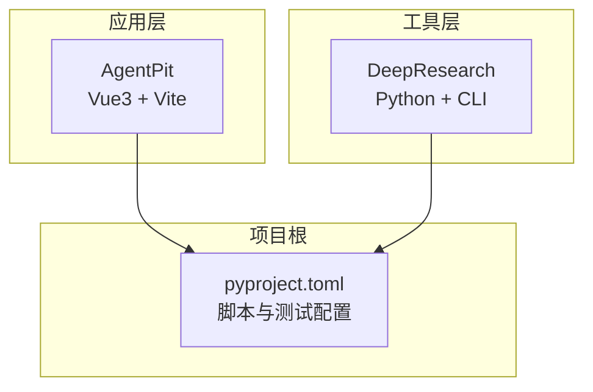
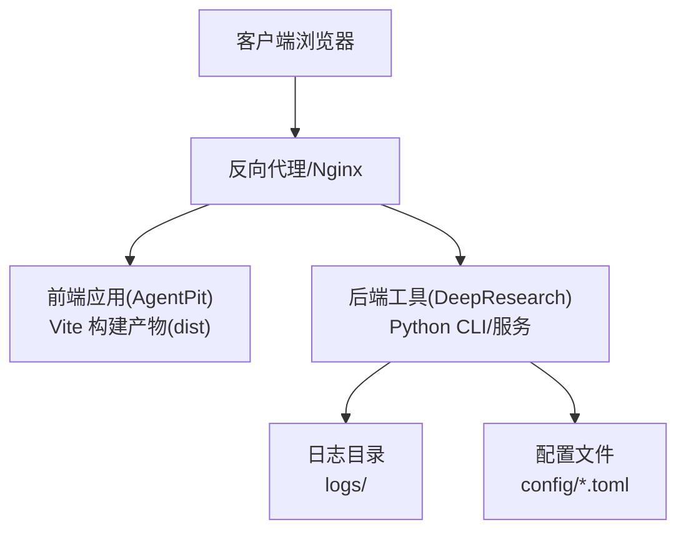
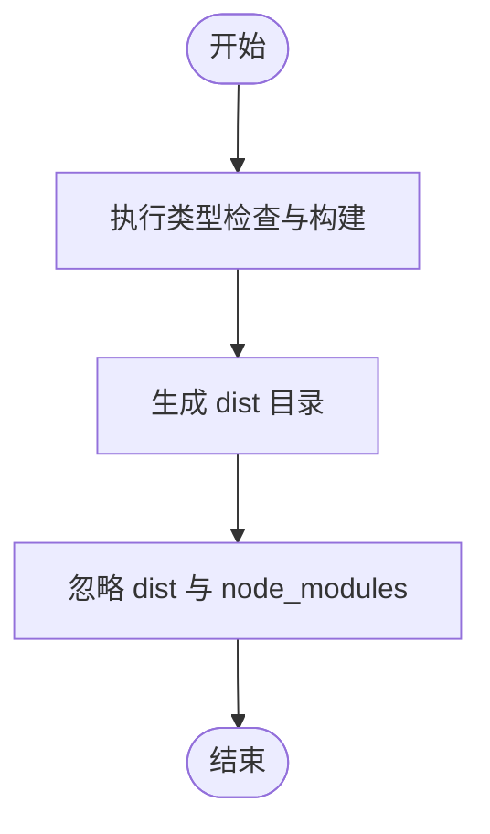
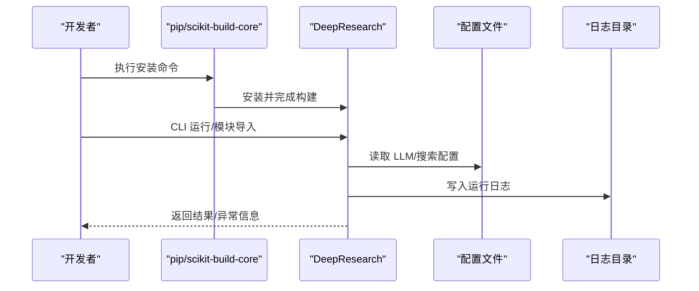
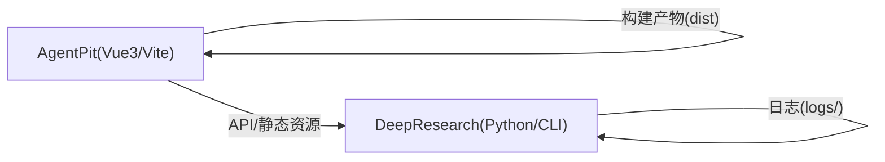

# 部署与运维

<cite>
**本文引用的文件**
- [pyproject.toml](file://pyproject.toml)
- [deployment.md](file://tools/DeepResearch/doc/deployment/deployment.md)
- [package.json](file://apps/AgentPit/package.json)
- [vite.config.ts](file://apps/AgentPit/vite.config.ts)
- [.gitignore](file://apps/AgentPit/.gitignore)
- [dev-environment.yml](file://tools/flexloop/tests/testing/dev-environment.yml)
</cite>

## 目录
1. [简介](#简介)
2. [项目结构](#项目结构)
3. [核心组件](#核心组件)
4. [架构总览](#架构总览)
5. [详细组件分析](#详细组件分析)
6. [依赖关系分析](#依赖关系分析)
7. [性能考虑](#性能考虑)
8. [故障排查指南](#故障排查指南)
9. [结论](#结论)
10. [附录](#附录)

## 简介
本文件面向部署与运维团队，提供从开发环境搭建、生产环境部署、容器化与编排、监控与日志、CI/CD与自动化部署到安全与备份恢复的全栈运维指南。结合仓库中的实际配置与文档，给出可落地的实施步骤、最佳实践与风险控制建议。

## 项目结构
该仓库包含多应用与工具模块，其中与部署运维直接相关的关键点如下：
- 应用层（前端）：AgentPit（Vue3 + Vite），通过包管理脚本与构建配置进行本地开发与打包。
- 工具层（后端/CLI）：DeepResearch（Python + scikit-build-core），提供可执行入口与配置文件，便于独立部署与升级。
- 项目根：统一的 Python 工程配置与脚本，便于测试、格式化、类型检查与覆盖率统计。

**图表来源**
- [package.json:1-73](file://apps/AgentPit/package.json#L1-L73)
- [vite.config.ts:1-15](file://apps/AgentPit/vite.config.ts#L1-L15)
- [pyproject.toml:1-161](file://pyproject.toml#L1-L161)

**章节来源**
- [pyproject.toml:1-161](file://pyproject.toml#L1-L161)
- [package.json:1-73](file://apps/AgentPit/package.json#L1-L73)
- [vite.config.ts:1-15](file://apps/AgentPit/vite.config.ts#L1-L15)

## 核心组件
- 开发与测试脚本
  - 统一通过项目根的脚本定义进行测试、格式化、类型检查与清理，便于 CI/CD 复用。
- 前端应用（AgentPit）
  - 使用 Vite 与 Vue3，提供开发、构建、预览、测试与格式化脚本；构建产物输出至 dist。
- 后端工具（DeepResearch）
  - 提供 Python CLI 与配置文件（LLM、搜索工具），支持独立安装与运行，便于容器化与编排。

**章节来源**
- [pyproject.toml:71-79](file://pyproject.toml#L71-L79)
- [package.json:6-19](file://apps/AgentPit/package.json#L6-L19)
- [deployment.md:1-260](file://tools/DeepResearch/doc/deployment/deployment.md#L1-L260)

## 架构总览
下图展示典型部署架构：前端应用通过反向代理对外提供服务，后端工具以独立进程或容器形式运行，二者通过 API 或共享存储交互。

**图表来源**
- [deployment.md:109-141](file://tools/DeepResearch/doc/deployment/deployment.md#L109-L141)
- [.gitignore:1-29](file://apps/AgentPit/.gitignore#L1-L29)

## 详细组件分析

### AgentPit 前端应用（Vue3 + Vite）
- 开发与构建
  - 开发：通过 Vite 启动本地服务，支持热更新与 TypeScript 类型检查。
  - 构建：先执行类型检查，再进行打包，产物输出至 dist。
- 资源与缓存
  - 构建产物 dist 与 node_modules 在 .gitignore 中被忽略，避免将构建产物纳入版本控制。
- 配置与别名
  - Vite 别名 @ 指向 src，便于模块导入与路径管理。

**图表来源**
- [package.json:6-19](file://apps/AgentPit/package.json#L6-L19)
- [vite.config.ts:9-13](file://apps/AgentPit/vite.config.ts#L9-L13)
- [.gitignore:10-12](file://apps/AgentPit/.gitignore#L10-L12)

**章节来源**
- [package.json:6-19](file://apps/AgentPit/package.json#L6-L19)
- [vite.config.ts:1-15](file://apps/AgentPit/vite.config.ts#L1-L15)
- [.gitignore:1-29](file://apps/AgentPit/.gitignore#L1-L29)

### DeepResearch 后端工具（Python + CLI）
- 环境与硬件要求
  - Python 版本要求与最低硬件资源，满足安装与运行的基础条件。
- 安装与构建
  - 使用 scikit-build-core 作为构建后端，pip 安装即完成 CMake 构建与安装。
- 配置管理
  - LLM 与搜索工具的配置文件（llms.toml、search.toml），用于 API 基础地址、模型、密钥与超时等参数。
- 运行方式
  - 支持命令行直接运行与作为模块导入两种方式。
- 日志与故障排查
  - 日志文件位于 logs 目录；常见问题包括依赖版本、LLM 与搜索工具密钥、系统资源不足等。

**图表来源**
- [deployment.md:20-46](file://tools/DeepResearch/doc/deployment/deployment.md#L20-L46)
- [deployment.md:58-107](file://tools/DeepResearch/doc/deployment/deployment.md#L58-L107)
- [deployment.md:109-141](file://tools/DeepResearch/doc/deployment/deployment.md#L109-L141)
- [deployment.md:207-220](file://tools/DeepResearch/doc/deployment/deployment.md#L207-L220)

**章节来源**
- [deployment.md:5-260](file://tools/DeepResearch/doc/deployment/deployment.md#L5-L260)

### 项目根工程（Python/PDM）
- 脚本与测试
  - 提供统一的测试、格式化、类型检查与清理脚本，便于在 CI/CD 中复用。
- 依赖与分组
  - 开发依赖与可选依赖分组明确，便于在不同环境中按需安装。
- 质量工具
  - Ruff、MyPy、Coverage 等工具配置，确保代码质量与覆盖率门槛。

**章节来源**
- [pyproject.toml:49-80](file://pyproject.toml#L49-L80)
- [pyproject.toml:81-161](file://pyproject.toml#L81-L161)

## 依赖关系分析
- 组件耦合
  - AgentPit 与 DeepResearch 在部署上相对解耦：前端负责静态资源与用户界面，后端负责业务逻辑与数据处理。
- 外部依赖
  - 前端依赖 Vue3 生态与 Vite；后端依赖 Python 生态与 scikit-build-core。
- 配置与环境
  - 前端通过 .env.*.local 与 dist 输出隔离开发与构建；后端通过 config/*.toml 与 logs 目录隔离配置与日志。

**图表来源**
- [package.json:1-73](file://apps/AgentPit/package.json#L1-L73)
- [vite.config.ts:1-15](file://apps/AgentPit/vite.config.ts#L1-L15)
- [.gitignore:15-18](file://apps/AgentPit/.gitignore#L15-L18)
- [deployment.md:58-107](file://tools/DeepResearch/doc/deployment/deployment.md#L58-L107)

**章节来源**
- [package.json:1-73](file://apps/AgentPit/package.json#L1-L73)
- [vite.config.ts:1-15](file://apps/AgentPit/vite.config.ts#L1-L15)
- [.gitignore:1-29](file://apps/AgentPit/.gitignore#L1-L29)
- [deployment.md:58-107](file://tools/DeepResearch/doc/deployment/deployment.md#L58-L107)

## 性能考虑
- 前端构建与缓存
  - 使用 Vite 的快速冷启动与热更新能力；合理配置别名与插件，减少打包体积与加载时间。
- 后端资源与并发
  - 根据硬件资源与业务负载调整 Python 进程数量与线程池大小；对 LLM 与搜索工具的超时与重试策略进行调优。
- 日志与监控
  - 将日志输出到标准输出或集中式日志系统，避免写入磁盘导致 I/O 抖动；对关键接口增加采样与埋点。

[本节为通用指导，无需“章节来源”]

## 故障排查指南
- 常见问题定位
  - 依赖安装失败：确认 Python 版本与 pip 版本满足要求；清理缓存后重试。
  - LLM/搜索工具调用失败：核对配置文件中的 API 基础地址、模型与密钥；检查网络连通性与配额。
  - 系统运行缓慢：提升 CPU/内存资源；优化 LLM 生成长度与搜索工具策略。
- 日志与配置检查
  - 查看 logs 目录下的日志文件；核对 config/*.toml 的配置项是否正确。
- 依赖与版本
  - 确保依赖库版本兼容；必要时锁定版本并重建环境。

**章节来源**
- [deployment.md:178-220](file://tools/DeepResearch/doc/deployment/deployment.md#L178-L220)

## 结论
本仓库提供了清晰的前端与后端部署边界：前端通过 Vite 快速构建并由反向代理对外提供服务，后端通过 Python CLI 与配置文件实现独立部署与扩展。结合统一的工程脚本与质量工具，可在 CI/CD 中实现自动化测试、构建与发布。建议在生产环境中配套完善的监控、日志与告警体系，并制定安全与备份恢复策略以保障系统稳定运行。

[本节为总结性内容，无需“章节来源”]

## 附录

### A. 开发环境搭建
- 前端（AgentPit）
  - 使用包管理器安装依赖后，执行开发脚本启动本地服务；构建前先进行类型检查。
- 后端（DeepResearch）
  - 满足 Python 与构建依赖要求后，通过 pip 安装项目；随后配置 LLM 与搜索工具的密钥与参数。

**章节来源**
- [package.json:6-19](file://apps/AgentPit/package.json#L6-L19)
- [deployment.md:13-46](file://tools/DeepResearch/doc/deployment/deployment.md#L13-L46)

### B. 生产环境部署
- 前端
  - 在反向代理后提供静态资源；将 dist 目录映射到 Web 服务器的静态目录。
- 后端
  - 以独立进程或容器运行 Python CLI；挂载配置目录与日志目录；暴露必要的健康检查端口。

**章节来源**
- [vite.config.ts:1-15](file://apps/AgentPit/vite.config.ts#L1-L15)
- [deployment.md:109-141](file://tools/DeepResearch/doc/deployment/deployment.md#L109-L141)

### C. 容器化与编排（概念性）
- 前端镜像
  - 基于 Nginx 镜像，复制 dist 目录；配置反向代理与静态资源服务。
- 后端镜像
  - 基于 Python 镜像，安装项目依赖与配置文件；以 CLI 方式启动服务。
- 编排
  - 使用 Kubernetes 部署：Deployment/Service/ConfigMap/Secret/PVC；设置健康检查与滚动更新策略。

[本节为概念性说明，无需“章节来源”]

### D. CI/CD 流水线（概念性）
- 触发条件
  - 分支保护与 PR/MR 触发；主分支推送触发发布流程。
- 步骤
  - 代码检出 → 依赖安装 → 质量检查（格式化、类型检查、测试）→ 构建 → 打包 → 推送镜像 → 发布/部署。
- 缓存与制品
  - 缓存依赖与构建产物；上传测试报告与覆盖率；记录构建元数据。

[本节为概念性说明，无需“章节来源”]

### E. 监控与日志（概念性）
- 指标
  - CPU/内存/磁盘/网络；请求延迟与错误率；队列长度与吞吐量。
- 日志
  - 标准输出采集；结构化日志；按天轮转与保留策略。
- 告警
  - 基于阈值与趋势的告警；分级响应与通知渠道。

[本节为概念性说明，无需“章节来源”]

### F. 安全与备份恢复（概念性）
- 安全
  - 最小权限原则；密钥与证书管理；网络隔离与访问控制；定期漏洞扫描。
- 备份
  - 配置文件与日志目录定期备份；数据库与对象存储的快照策略；恢复演练。

[本节为概念性说明，无需“章节来源”]

### G. 环境配置与基础设施（概念性）
- 环境变量
  - 通过 .env.*.local 管理前端环境变量；通过 config/*.toml 管理后端配置。
- 域名与证书
  - 通过 DNS 解析与反向代理配置 HTTPS；使用自动化证书签发与续期。
- 存储
  - 日志与配置持久化；缓存与临时文件分离。

[本节为概念性说明，无需“章节来源”]