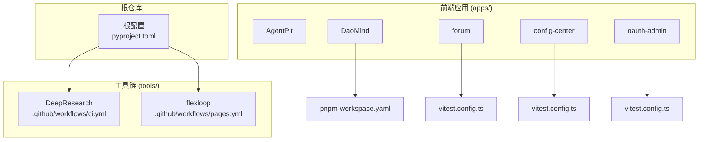
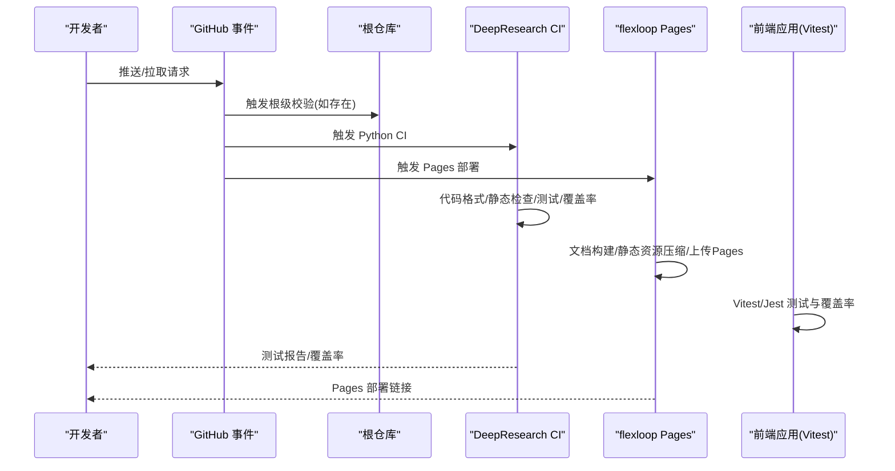
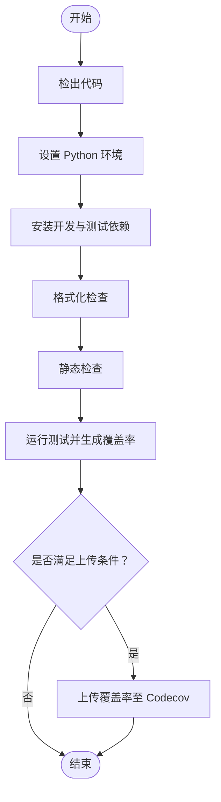
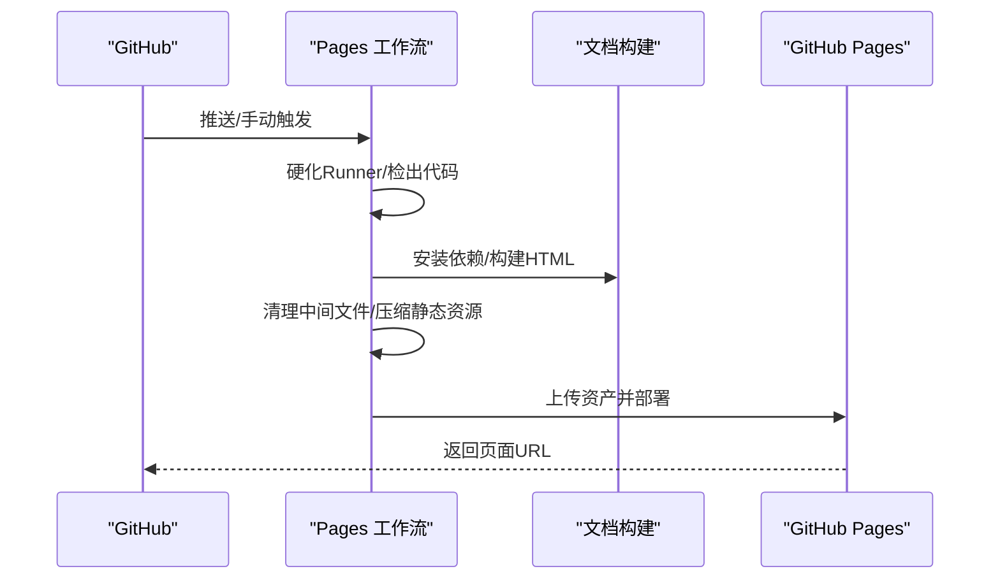
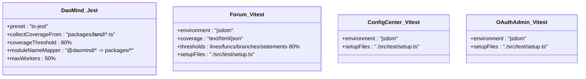
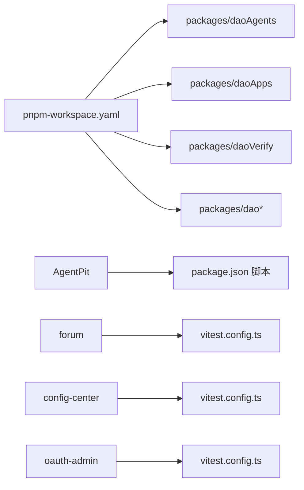
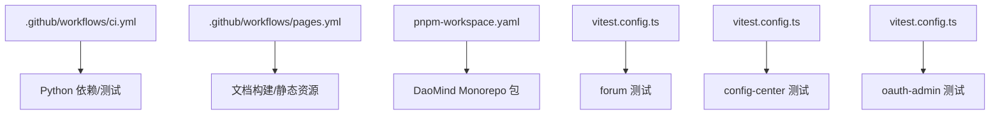

# CI/CD流水线

<cite>
**本文档引用的文件**
- [ci.yml](file://tools/DeepResearch/.github/workflows/ci.yml)
- [pages.yml](file://tools/flexloop/.github/workflows/pages.yml)
- [validate-config.yml](file://tools/DeepResearch/.github/workflows/validate-config.yml)
- [tasks.md](file://tools/flexloop/.trae/specs/container_workflow_fix/tasks.md)
- [package.json](file://apps/AgentPit/package.json)
- [pnpm-workspace.yaml](file://apps/DaoMind/pnpm-workspace.yaml)
- [jest.config.js](file://apps/DaoMind/jest.config.js)
- [vitest.config.ts](file://apps/forum/vitest.config.ts)
- [setup.ts](file://apps/forum/src/test/setup.ts)
- [vitest.config.ts](file://apps/config-center/vitest.config.ts)
- [vitest.config.ts](file://apps/oauth-admin/vitest.config.ts)
- [pyproject.toml](file://pyproject.toml)
- [pyproject.toml](file://tools/DeepResearch/pyproject.toml)
- [pyproject.toml](file://tools/flexloop/pyproject.toml)
- [README.md](file://tools/DeepResearch/README.md)
- [README.md](file://tools/flexloop/README.md)
</cite>

## 目录
1. [简介](#简介)
2. [项目结构](#项目结构)
3. [核心组件](#核心组件)
4. [架构总览](#架构总览)
5. [详细组件分析](#详细组件分析)
6. [依赖关系分析](#依赖关系分析)
7. [性能考虑](#性能考虑)
8. [故障排除指南](#故障排除指南)
9. [结论](#结论)
10. [附录](#附录)

## 简介
本文件为 DAO Collective 项目的 CI/CD 流水线文档，聚焦于 GitHub Actions 工作流配置与多应用项目的自动化构建、测试与发布实践。内容涵盖：
- 代码质量检查（格式化、静态检查）
- 单元测试、集成测试与端到端测试的自动化
- 多应用项目的并行构建策略与依赖管理
- 前端应用的构建优化与后端服务的打包发布流程
- 版本管理与发布策略（语义化版本与标签管理）
- 持续部署配置（蓝绿部署与滚动更新思路）
- 代码覆盖率、性能测试与安全扫描的集成建议
- 环境变量管理、密钥管理与部署权限控制

## 项目结构
DAO Collective 采用多仓库/多工作区的混合结构：
- 前端应用位于 apps/ 下的多个 Vite/React 项目
- 后端/工具链位于 tools/ 下的 Python 项目
- GitHub Actions 工作流分别位于各子模块的 .github/workflows/
- 根目录与子模块均包含 pyproject.toml 等配置文件

图表来源
- [ci.yml:1-55](file://tools/DeepResearch/.github/workflows/ci.yml#L1-L55)
- [pages.yml:1-106](file://tools/flexloop/.github/workflows/pages.yml#L1-L106)
- [pnpm-workspace.yaml:1-3](file://apps/DaoMind/pnpm-workspace.yaml#L1-L3)
- [vitest.config.ts:1-41](file://apps/forum/vitest.config.ts#L1-L41)
- [vitest.config.ts:1-17](file://apps/config-center/vitest.config.ts#L1-L17)
- [vitest.config.ts:1-17](file://apps/oauth-admin/vitest.config.ts#L1-L17)

章节来源
- [ci.yml:1-55](file://tools/DeepResearch/.github/workflows/ci.yml#L1-L55)
- [pages.yml:1-106](file://tools/flexloop/.github/workflows/pages.yml#L1-L106)
- [pnpm-workspace.yaml:1-3](file://apps/DaoMind/pnpm-workspace.yaml#L1-L3)

## 核心组件
- 质量检查与测试流水线：由 DeepResearch 子模块的 CI 工作流负责，覆盖 Python 代码格式化、静态检查与测试覆盖率上传。
- 文档与静态站点部署：由 flexloop 子模块的 Pages 工作流负责，支持文档构建、静态资源压缩与 GitHub Pages 部署。
- 前端测试配置：各前端应用通过 Vitest/Jest 配置实现单元/集成测试与覆盖率阈值控制。

章节来源
- [ci.yml:1-55](file://tools/DeepResearch/.github/workflows/ci.yml#L1-L55)
- [pages.yml:1-106](file://tools/flexloop/.github/workflows/pages.yml#L1-L106)
- [vitest.config.ts:1-41](file://apps/forum/vitest.config.ts#L1-L41)
- [jest.config.js:1-59](file://apps/DaoMind/jest.config.js#L1-L59)

## 架构总览
下图展示了 DAO Collective 的 CI/CD 架构：根仓库触发子模块工作流，前端应用各自维护测试配置，后端工具链通过独立工作流进行质量与部署。

图表来源
- [ci.yml:1-55](file://tools/DeepResearch/.github/workflows/ci.yml#L1-L55)
- [pages.yml:1-106](file://tools/flexloop/.github/workflows/pages.yml#L1-L106)

## 详细组件分析

### Python CI 流水线（DeepResearch）
- 触发条件：推送至 main 或 PR 至 main
- 并发控制：同一工作流同分支仅允许一个运行实例，新实例到达时取消旧实例
- 测试矩阵：跨平台（ubuntu/windows/macos）+ 固定 Python 版本
- 步骤要点：
  - 检出代码、设置 Python、缓存依赖
  - 安装开发与测试依赖
  - 运行格式化检查与静态检查
  - 运行测试并生成覆盖率报告（XML/终端）
  - 在指定矩阵条件下上传覆盖率至 Codecov

图表来源
- [ci.yml:1-55](file://tools/DeepResearch/.github/workflows/ci.yml#L1-L55)

章节来源
- [ci.yml:1-55](file://tools/DeepResearch/.github/workflows/ci.yml#L1-L55)

### 文档与静态站点部署（flexloop）
- 触发条件：推送至 main 或手动触发
- 权限：读取内容、写入 Pages、签发 ID Token
- 步骤要点：
  - 硬化 Runner、检出代码（完整历史以支持版本号）
  - 安装 Python 依赖与文档构建工具
  - 清理中间文件、压缩静态资源
  - 构建 HTML、监控构建体积
  - 上传 Pages 资产并部署到 GitHub Pages

图表来源
- [pages.yml:1-106](file://tools/flexloop/.github/workflows/pages.yml#L1-L106)

章节来源
- [pages.yml:1-106](file://tools/flexloop/.github/workflows/pages.yml#L1-L106)

### 前端测试配置（Vitest/Jest）
- DaoMind（Monorepo）：使用 Jest + ts-jest，启用覆盖率与模块别名映射，测试匹配规则覆盖多包路径。
- forum/config-center/oauth-admin：使用 Vitest，配置 jsdom 环境、覆盖率阈值、JSON 报告输出与全局 setup 文件。

图表来源
- [jest.config.js:1-59](file://apps/DaoMind/jest.config.js#L1-L59)
- [vitest.config.ts:1-41](file://apps/forum/vitest.config.ts#L1-L41)
- [vitest.config.ts:1-17](file://apps/config-center/vitest.config.ts#L1-L17)
- [vitest.config.ts:1-17](file://apps/oauth-admin/vitest.config.ts#L1-L17)

章节来源
- [jest.config.js:1-59](file://apps/DaoMind/jest.config.js#L1-L59)
- [vitest.config.ts:1-41](file://apps/forum/vitest.config.ts#L1-L41)
- [vitest.config.ts:1-17](file://apps/config-center/vitest.config.ts#L1-L17)
- [vitest.config.ts:1-17](file://apps/oauth-admin/vitest.config.ts#L1-L17)

### 多应用项目的并行构建与依赖管理
- 前端应用独立构建：每个应用拥有自己的构建脚本与测试配置，可并行执行。
- DaoMind Monorepo：通过 pnpm-workspace.yaml 统一管理包，使用根级构建命令协调子包构建。
- 依赖缓存：Python 使用 pip 缓存依赖路径；前端应用可结合 pnpm/nvm 等工具进行依赖缓存与加速。

图表来源
- [pnpm-workspace.yaml:1-3](file://apps/DaoMind/pnpm-workspace.yaml#L1-L3)
- [package.json:1-37](file://apps/AgentPit/package.json#L1-L37)
- [vitest.config.ts:1-41](file://apps/forum/vitest.config.ts#L1-L41)
- [vitest.config.ts:1-17](file://apps/config-center/vitest.config.ts#L1-L17)
- [vitest.config.ts:1-17](file://apps/oauth-admin/vitest.config.ts#L1-L17)

章节来源
- [pnpm-workspace.yaml:1-3](file://apps/DaoMind/pnpm-workspace.yaml#L1-L3)
- [package.json:1-37](file://apps/AgentPit/package.json#L1-L37)

### 版本管理与发布策略
- 当前状态：根仓库与子模块均包含 pyproject.toml，用于 Python 项目的依赖与构建配置。
- 建议实践：
  - 语义化版本控制：遵循语义化版本规范，使用标签标记发布版本。
  - 自动化发布：结合 GitHub Releases 与工作流触发，自动上传构建产物。
  - 标签管理：主分支合并后自动生成版本标签，避免重复或遗漏。

章节来源
- [pyproject.toml](file://pyproject.toml)
- [pyproject.toml](file://tools/DeepResearch/pyproject.toml)
- [pyproject.toml](file://tools/flexloop/pyproject.toml)

### 持续部署配置（蓝绿部署与滚动更新）
- 蓝绿部署：通过两套环境（蓝色/绿色）交替切换，降低停机风险。可在部署前进行健康检查与流量切换。
- 滚动更新：分批次更新实例，逐步替换旧版本，减少对用户体验的影响。
- 适配建议：结合 GitHub Pages 的单次部署特性，优先采用蓝绿/金丝雀策略（若迁移到托管平台）。

[本节为概念性指导，无需源码引用]

### 代码覆盖率、性能测试与安全扫描集成
- 覆盖率：Python 使用 pytest + coverage XML 报告，上传至 Codecov；前端使用 Vitest/Jest 的覆盖率报告。
- 性能测试：建议在 CI 中增加基准测试与并发稳定性测试，参考 DeepResearch 的性能测试目录结构。
- 安全扫描：建议引入 SAST（如 ruff、bandit）与依赖扫描（如 safety/dependabot），在工作流中添加专用 Job。

章节来源
- [ci.yml:45-54](file://tools/DeepResearch/.github/workflows/ci.yml#L45-L54)
- [vitest.config.ts:9-20](file://apps/forum/vitest.config.ts#L9-L20)

### 环境变量管理、密钥管理与部署权限控制
- 环境变量：在 GitHub Actions 中通过 secrets 与环境变量注入，避免硬编码敏感信息。
- 密钥管理：使用 GitHub Secrets 存储访问令牌与证书，限制最小权限原则。
- 权限控制：Pages 工作流明确声明所需权限，避免过度授权；Runner 硬化提升安全性。

章节来源
- [pages.yml:19-27](file://tools/flexloop/.github/workflows/pages.yml#L19-L27)
- [pages.yml:37-40](file://tools/flexloop/.github/workflows/pages.yml#L37-L40)

## 依赖关系分析
- 工作流耦合：根仓库与子模块工作流相互独立，通过事件触发；前端应用测试配置彼此独立但共享通用模式。
- 外部依赖：Python 项目依赖 pip 缓存；前端项目依赖包管理器缓存；Pages 工作流依赖 GitHub Pages 服务。
- 潜在循环：当前结构无直接循环依赖；Monorepo 通过 workspace 文件组织包间关系。

图表来源
- [ci.yml:1-55](file://tools/DeepResearch/.github/workflows/ci.yml#L1-L55)
- [pages.yml:1-106](file://tools/flexloop/.github/workflows/pages.yml#L1-L106)
- [pnpm-workspace.yaml:1-3](file://apps/DaoMind/pnpm-workspace.yaml#L1-L3)
- [vitest.config.ts:1-41](file://apps/forum/vitest.config.ts#L1-L41)
- [vitest.config.ts:1-17](file://apps/config-center/vitest.config.ts#L1-L17)
- [vitest.config.ts:1-17](file://apps/oauth-admin/vitest.config.ts#L1-L17)

章节来源
- [ci.yml:1-55](file://tools/DeepResearch/.github/workflows/ci.yml#L1-L55)
- [pages.yml:1-106](file://tools/flexloop/.github/workflows/pages.yml#L1-L106)
- [pnpm-workspace.yaml:1-3](file://apps/DaoMind/pnpm-workspace.yaml#L1-L3)

## 性能考虑
- 并行执行：Python CI 使用矩阵并行测试；前端应用可并行执行各自测试任务。
- 缓存策略：Python 使用 pip 缓存依赖路径；前端可利用包管理器缓存与增量构建。
- 资源清理：Pages 工作流清理中间文件与空目录，减少上传体积。
- 构建优化：前端应用可通过压缩与按需加载优化构建时间与体积。

[本节提供一般性指导，无需源码引用]

## 故障排除指南
- 工作流语法校验：使用 actionlint 对 YAML 语法进行审查，确保工作流文件有效。
- Git 状态核验：在删除不适用的工作流后，确认仅剩预期变更，避免误删其他工作流。
- 测试失败定位：根据测试报告与覆盖率阈值，逐项排查失败用例与覆盖率不足模块。

章节来源
- [validate-config.yml:1-58](file://tools/DeepResearch/.github/workflows/validate-config.yml#L1-L58)
- [tasks.md:1-40](file://tools/flexloop/.trae/specs/container_workflow_fix/tasks.md#L1-L40)

## 结论
DAO Collective 的 CI/CD 流水线已具备基础的质量检查与测试能力，并在文档与静态站点部署方面形成闭环。建议进一步完善：
- 前端应用统一测试与覆盖率策略
- 引入性能与安全扫描
- 明确版本发布与标签管理流程
- 在可扩展平台上实施蓝绿/滚动部署

[本节为总结性内容，无需源码引用]

## 附录
- 前端应用示例脚本与依赖配置可参考各应用的 package.json 与测试配置文件。
- 工具链 README 提供了项目背景与贡献指南，便于理解整体架构与职责划分。

章节来源
- [package.json:1-37](file://apps/AgentPit/package.json#L1-L37)
- [README.md](file://tools/DeepResearch/README.md)
- [README.md](file://tools/flexloop/README.md)