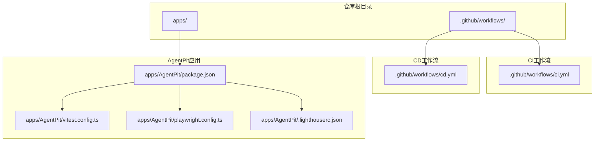
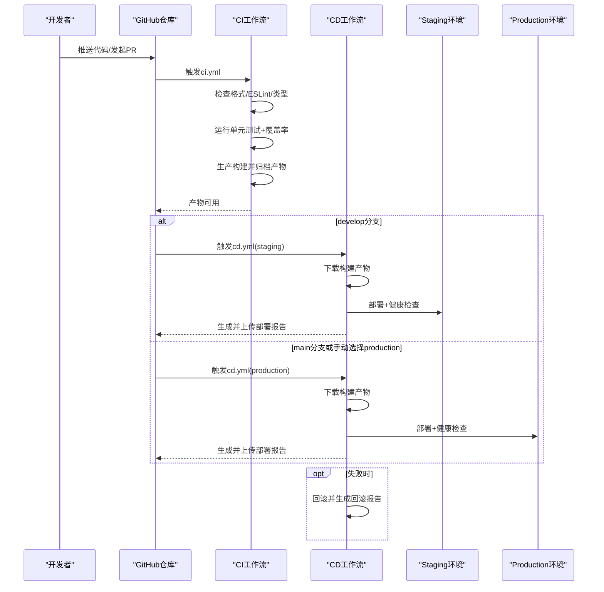
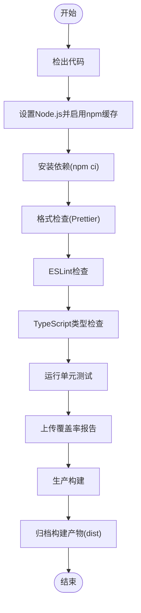
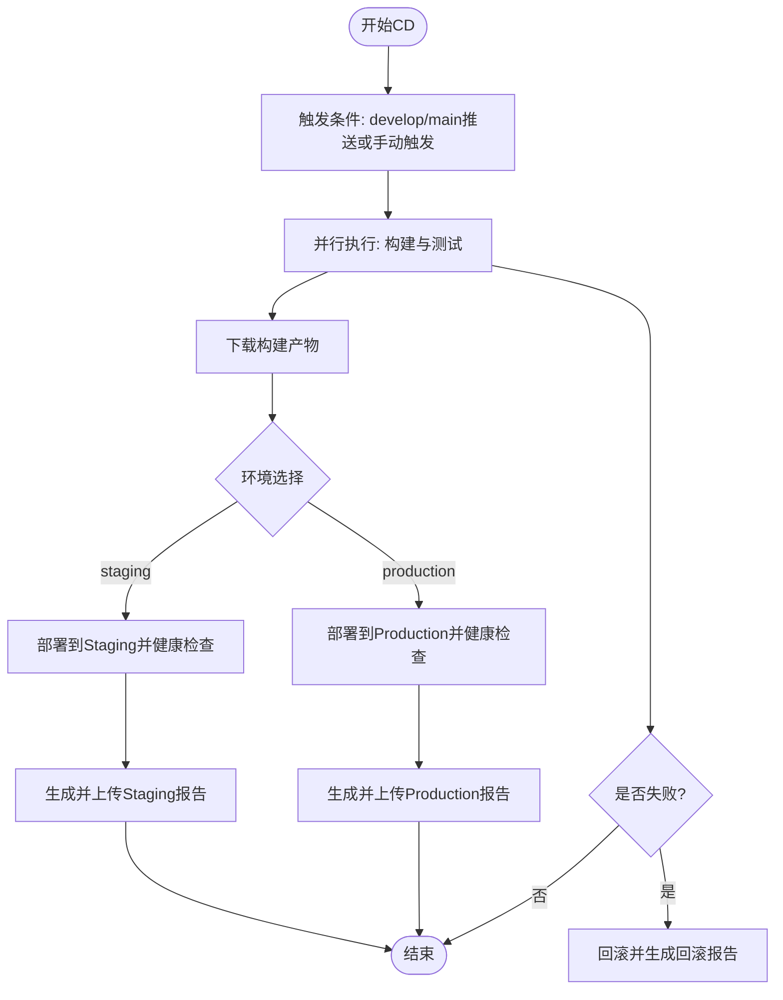
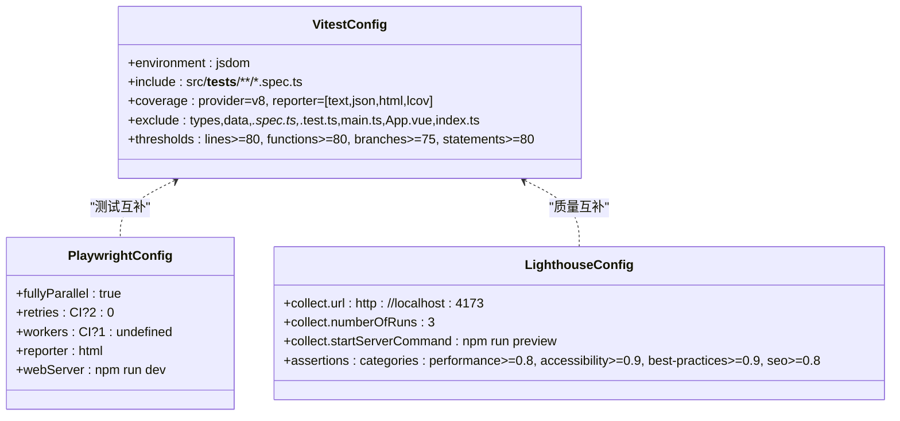
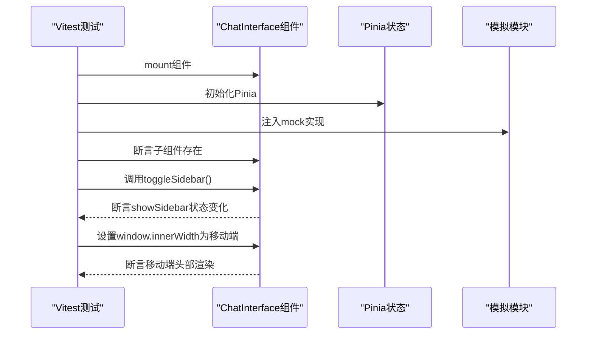
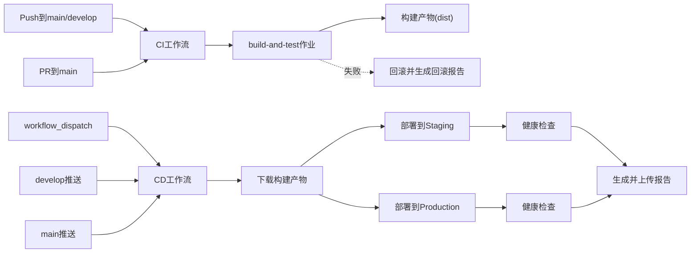

# CI/CD流水线

<cite>
**本文引用的文件**
- [.github/workflows/ci.yml](file://.github/workflows/ci.yml)
- [.github/workflows/cd.yml](file://.github/workflows/cd.yml)
- [apps/AgentPit/package.json](file://apps/AgentPit/package.json)
- [apps/AgentPit/vitest.config.ts](file://apps/AgentPit/vitest.config.ts)
- [apps/AgentPit/playwright.config.ts](file://apps/AgentPit/playwright.config.ts)
- [apps/AgentPit/.lighthouserc.json](file://apps/AgentPit/.lighthouserc.json)
- [apps/AgentPit/src/__tests__/components/chat/ChatInterface.spec.ts](file://apps/AgentPit/src/__tests__/components/chat/ChatInterface.spec.ts)
- [apps/AgentPit/e2e/homepage.spec.ts](file://apps/AgentPit/e2e/homepage.spec.ts)
</cite>

## 目录
1. [简介](#简介)
2. [项目结构](#项目结构)
3. [核心组件](#核心组件)
4. [架构总览](#架构总览)
5. [详细组件分析](#详细组件分析)
6. [依赖关系分析](#依赖关系分析)
7. [性能考虑](#性能考虑)
8. [故障排除指南](#故障排除指南)
9. [结论](#结论)
10. [附录](#附录)

## 简介
本文件面向DAOApps项目的持续集成与持续部署（CI/CD）流水线，系统性阐述GitHub Actions工作流的设计与实现，覆盖以下主题：
- CI与CD两大流程的设计思路与触发条件
- 代码质量检查（格式化、ESLint、TypeScript类型检查）
- 单元测试与覆盖率收集
- 端到端测试（Playwright）与性能测试（Lighthouse CI）
- 构建优化、缓存策略与并行执行
- 部署策略（蓝绿部署、滚动更新、回滚机制）
- 安全扫描与代码覆盖率报告集成
- 调试与故障排除实践指南

## 项目结构
DAOApps采用多应用与多包的Monorepo结构，CI/CD流水线聚焦于AgentPit前端应用，通过GitHub Actions在Ubuntu环境中执行标准化的构建、测试与部署流程。

**图表来源**
- [.github/workflows/ci.yml:1-67](file://.github/workflows/ci.yml#L1-L67)
- [.github/workflows/cd.yml:1-247](file://.github/workflows/cd.yml#L1-L247)
- [apps/AgentPit/package.json:1-74](file://apps/AgentPit/package.json#L1-L74)
- [apps/AgentPit/vitest.config.ts:1-48](file://apps/AgentPit/vitest.config.ts#L1-L48)
- [apps/AgentPit/playwright.config.ts:1-28](file://apps/AgentPit/playwright.config.ts#L1-L28)
- [apps/AgentPit/.lighthouserc.json:1-24](file://apps/AgentPit/.lighthouserc.json#L1-L24)

**章节来源**
- [.github/workflows/ci.yml:1-67](file://.github/workflows/ci.yml#L1-L67)
- [.github/workflows/cd.yml:1-247](file://.github/workflows/cd.yml#L1-L247)
- [apps/AgentPit/package.json:1-74](file://apps/AgentPit/package.json#L1-L74)
- [apps/AgentPit/vitest.config.ts:1-48](file://apps/AgentPit/vitest.config.ts#L1-L48)
- [apps/AgentPit/playwright.config.ts:1-28](file://apps/AgentPit/playwright.config.ts#L1-L28)
- [apps/AgentPit/.lighthouserc.json:1-24](file://apps/AgentPit/.lighthouserc.json#L1-L24)

## 核心组件
- CI工作流（ci.yml）
  - 触发：推送至main或PR至main
  - 步骤：Node.js环境准备、依赖安装、格式化检查、ESLint检查、TypeScript类型检查、单元测试与覆盖率上传、生产构建与产物归档
  - 关键特性：使用npm ci进行确定性安装；启用npm缓存；使用Codecov上传覆盖率；产物归档供CD复用
- CD工作流（cd.yml）
  - 触发：develop/main分支推送或手动触发（选择staging/production）
  - 步骤：下载构建产物、部署到目标环境、健康检查、生成部署报告、上传报告；失败时自动回滚并生成回滚报告
  - 关键特性：按分支/输入选择环境；并行构建与测试；Lighthouse CI性能测试与报告上传
- 测试与质量工具
  - 单元测试：Vitest配置含覆盖率阈值与报告器
  - E2E测试：Playwright配置支持并行与重试
  - 性能测试：LHCI配置与最小分数断言
  - 代码质量：Prettier格式检查、ESLint检查、TypeScript类型检查

**章节来源**
- [.github/workflows/ci.yml:1-67](file://.github/workflows/ci.yml#L1-L67)
- [.github/workflows/cd.yml:1-247](file://.github/workflows/cd.yml#L1-L247)
- [apps/AgentPit/package.json:6-18](file://apps/AgentPit/package.json#L6-L18)
- [apps/AgentPit/vitest.config.ts:7-41](file://apps/AgentPit/vitest.config.ts#L7-L41)
- [apps/AgentPit/playwright.config.ts:4-26](file://apps/AgentPit/playwright.config.ts#L4-L26)
- [apps/AgentPit/.lighthouserc.json:2-22](file://apps/AgentPit/.lighthouserc.json#L2-L22)

## 架构总览
下图展示CI/CD流水线的整体交互：由CI完成质量门禁与构建，CD从CI产物中拉取并部署到staging或production，同时进行健康检查与报告生成；失败时触发回滚流程。

**图表来源**
- [.github/workflows/ci.yml:1-67](file://.github/workflows/ci.yml#L1-L67)
- [.github/workflows/cd.yml:1-247](file://.github/workflows/cd.yml#L1-L247)

## 详细组件分析

### CI工作流设计与执行流程
- 触发与矩阵：基于ubuntu-latest运行，Node版本矩阵固定为24.x；设置FORCE_JAVASCRIPT_ACTIONS_TO_NODE24环境变量确保行为一致
- 缓存与安装：启用npm缓存，缓存路径指向AgentPit的package-lock.json；使用npm ci进行确定性安装
- 质量检查：依次执行Prettier格式检查、ESLint检查、TypeScript类型检查
- 测试与覆盖率：运行Vitest单元测试，上传lcov覆盖率报告至Codecov
- 构建与归档：执行生产构建并将dist目录作为构建产物归档

**图表来源**
- [.github/workflows/ci.yml:20-67](file://.github/workflows/ci.yml#L20-L67)
- [apps/AgentPit/package.json:6-18](file://apps/AgentPit/package.json#L6-L18)

**章节来源**
- [.github/workflows/ci.yml:1-67](file://.github/workflows/ci.yml#L1-L67)
- [apps/AgentPit/package.json:6-18](file://apps/AgentPit/package.json#L6-L18)

### CD工作流设计与执行流程
- 触发策略：develop分支推送或main分支推送，以及workflow_dispatch手动触发（可选staging/production）
- 并行构建与测试：CD工作流内定义独立的build-and-test作业，与部署作业并行执行
- 环境选择：根据ref或用户输入选择staging或production；production环境配置了访问URL
- 部署与健康检查：下载构建产物后执行部署命令与健康检查（当前为占位符，需替换为实际部署脚本）
- 报告生成：生成Markdown部署报告并上传为制品
- 回滚机制：当部署失败时自动触发rollback作业，生成回滚报告并上传

**图表来源**
- [.github/workflows/cd.yml:3-247](file://.github/workflows/cd.yml#L3-L247)

**章节来源**
- [.github/workflows/cd.yml:1-247](file://.github/workflows/cd.yml#L1-L247)

### 测试体系与覆盖率
- 单元测试（Vitest）
  - 环境：jsdom
  - 包含范围：src/components、stores、composables、utils等
  - 排除范围：types、data、*.spec.ts/*.test.ts、main.ts、App.vue、index.ts等
  - 覆盖率阈值：lines、functions、branches、statements均不低于阈值
  - 报告器：text、json、html、lcov
- 端到端测试（Playwright）
  - 并行：fullyParallel开启
  - 重试：CI环境下重试2次
  - workers：CI环境下限制为1（可按需调整）
  - 报告器：HTML
  - Web Server：使用npm run dev启动本地服务
- 覆盖率与报告
  - CI阶段上传lcov至Codecov
  - CD阶段LHCI autorun生成性能报告并归档

**图表来源**
- [apps/AgentPit/vitest.config.ts:5-47](file://apps/AgentPit/vitest.config.ts#L5-L47)
- [apps/AgentPit/playwright.config.ts:3-27](file://apps/AgentPit/playwright.config.ts#L3-L27)
- [apps/AgentPit/.lighthouserc.json:1-24](file://apps/AgentPit/.lighthouserc.json#L1-L24)

**章节来源**
- [apps/AgentPit/vitest.config.ts:1-48](file://apps/AgentPit/vitest.config.ts#L1-L48)
- [apps/AgentPit/playwright.config.ts:1-28](file://apps/AgentPit/playwright.config.ts#L1-L28)
- [apps/AgentPit/.lighthouserc.json:1-24](file://apps/AgentPit/.lighthouserc.json#L1-L24)

### 典型测试用例分析
- 单元测试示例：ChatInterface组件测试，验证子组件渲染、侧边栏切换逻辑、移动端/桌面端头部渲染差异等
- E2E测试示例：首页浏览与导航，断言平台标题、模块卡片数量、跳转到变现/聊天页面、统计信息可见性、返回导航等

**图表来源**
- [apps/AgentPit/src/__tests__/components/chat/ChatInterface.spec.ts:71-171](file://apps/AgentPit/src/__tests__/components/chat/ChatInterface.spec.ts#L71-L171)

**章节来源**
- [apps/AgentPit/src/__tests__/components/chat/ChatInterface.spec.ts:1-172](file://apps/AgentPit/src/__tests__/components/chat/ChatInterface.spec.ts#L1-L172)
- [apps/AgentPit/e2e/homepage.spec.ts:1-52](file://apps/AgentPit/e2e/homepage.spec.ts#L1-L52)

## 依赖关系分析
- 触发依赖
  - CI仅在push到main或PR至main时触发
  - CD在develop/main推送或workflow_dispatch手动触发
- 作业依赖
  - CD中的deploy-staging/production依赖build-and-test作业成功
  - rollback作业依赖deploy-staging/production任一失败
- 工具链依赖
  - Node.js 24.x、npm缓存、Vitest、Playwright、LHCI、Codecov

**图表来源**
- [.github/workflows/ci.yml:3-7](file://.github/workflows/ci.yml#L3-L7)
- [.github/workflows/cd.yml:3-18](file://.github/workflows/cd.yml#L3-L18)
- [.github/workflows/cd.yml:20-135](file://.github/workflows/cd.yml#L20-L135)
- [.github/workflows/cd.yml:209-247](file://.github/workflows/cd.yml#L209-L247)

**章节来源**
- [.github/workflows/ci.yml:1-67](file://.github/workflows/ci.yml#L1-L67)
- [.github/workflows/cd.yml:1-247](file://.github/workflows/cd.yml#L1-L247)

## 性能考虑
- 并行与缓存
  - CI/CD均启用npm缓存，减少重复安装时间
  - Playwright在CI中限制workers为1，避免资源竞争；可在本地开发中开启并行
- 构建优化
  - 使用npm ci确保依赖一致性
  - LHCI在CD阶段运行，结合预览服务器启动，减少对主构建流程的影响
- 测试效率
  - Vitest配置了合理的覆盖率排除规则，聚焦核心业务模块
  - Playwright重试策略在CI中提升稳定性

[本节为通用性能建议，无需特定文件引用]

## 故障排除指南
- 常见问题定位
  - Node版本不匹配：确认FORCE_JAVASCRIPT_ACTIONS_TO_NODE24环境变量与actions/setup-node版本一致
  - 依赖安装失败：检查package-lock.json路径与缓存key是否正确
  - 单元测试失败：查看Vitest报告与覆盖率阈值；必要时调整排除/包含范围
  - E2E测试不稳定：检查Playwright webServer启动命令与超时；适当增加重试次数
  - Lighthouse断言失败：调整最低分数阈值或优化性能指标
- 回滚与恢复
  - CD工作流内置rollback作业，需在实际部署脚本中实现具体回滚逻辑
  - 建议在部署前生成备份快照，回滚时恢复到上一个稳定版本
- 日志与报告
  - CI/CD均生成并上传报告制品，便于事后审计与问题追踪
  - 覆盖率报告上传至Codecov，便于持续监控代码质量

**章节来源**
- [.github/workflows/cd.yml:209-247](file://.github/workflows/cd.yml#L209-L247)
- [apps/AgentPit/vitest.config.ts:11-36](file://apps/AgentPit/vitest.config.ts#L11-L36)
- [apps/AgentPit/playwright.config.ts:7-8](file://apps/AgentPit/playwright.config.ts#L7-L8)
- [apps/AgentPit/.lighthouserc.json:11-17](file://apps/AgentPit/.lighthouserc.json#L11-L17)

## 结论
DAOApps的CI/CD流水线以GitHub Actions为核心，实现了从质量门禁到自动化部署的完整闭环。通过严格的代码质量检查、完善的单元与端到端测试、性能测试与覆盖率报告，以及可扩展的回滚机制，保障了交付质量与稳定性。建议后续在CD阶段补充实际的部署与回滚脚本，并根据团队规模与基础设施选择合适的蓝绿/滚动部署策略。

[本节为总结性内容，无需特定文件引用]

## 附录
- 部署策略建议
  - 蓝绿部署：维护两套环境，切换流量实现零停机发布
  - 滚动更新：分批替换实例，降低单次变更影响面
  - 回滚机制：记录版本与备份，快速恢复至上一个稳定版本
- 安全扫描集成
  - 可在CI中加入npm audit或类似工具，识别高危依赖漏洞
  - 在CD阶段对构建产物进行静态分析与依赖扫描
- 最佳实践
  - 将部署与回滚脚本参数化，支持多环境配置
  - 对关键作业启用通知与告警，缩短故障响应时间
  - 定期审查与优化测试用例，保持测试矩阵的代表性与稳定性

[本节为通用建议，无需特定文件引用]