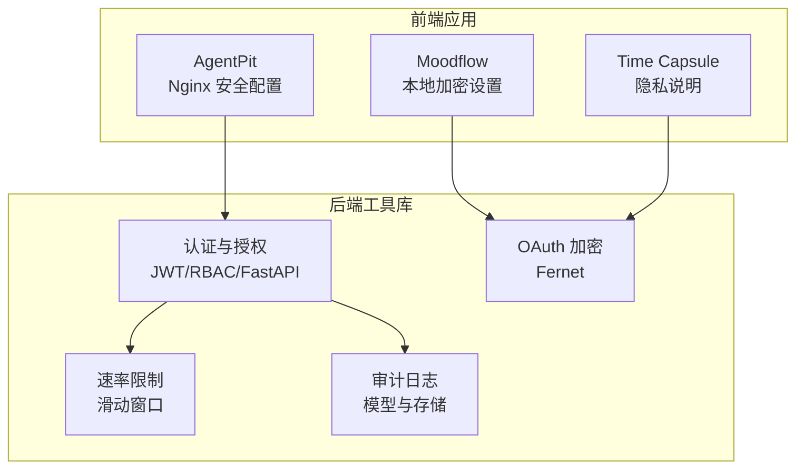
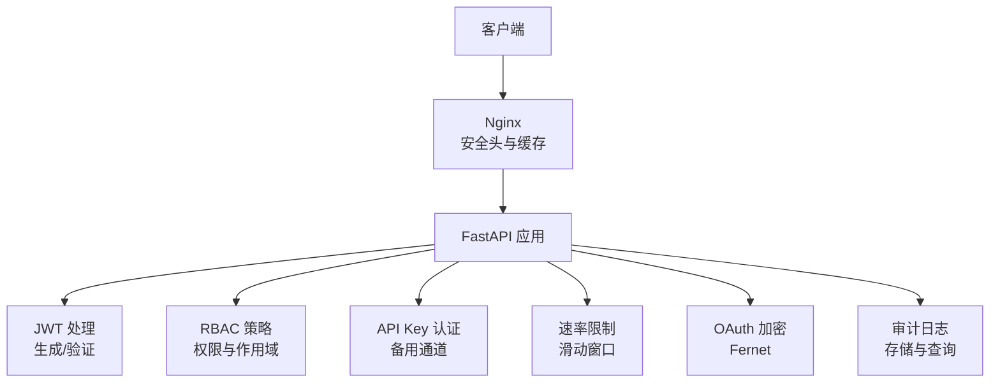
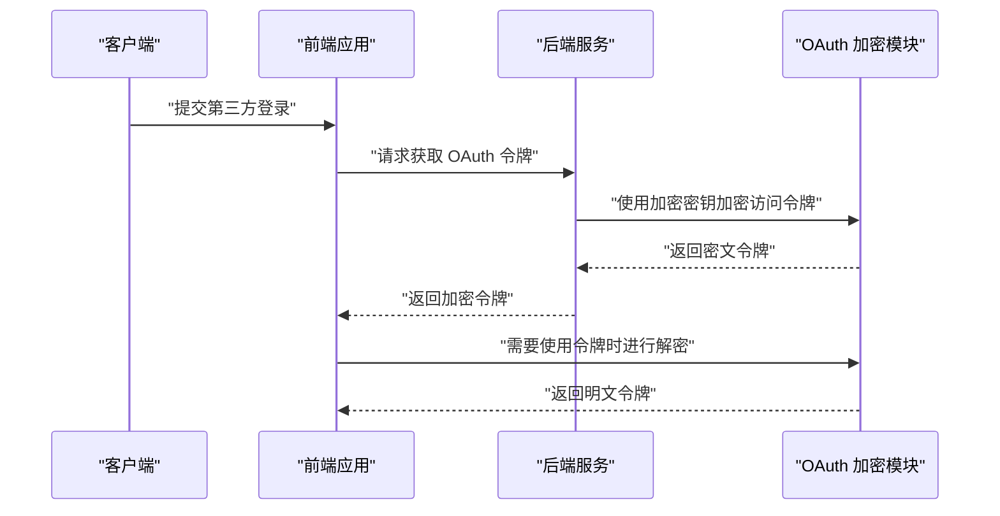
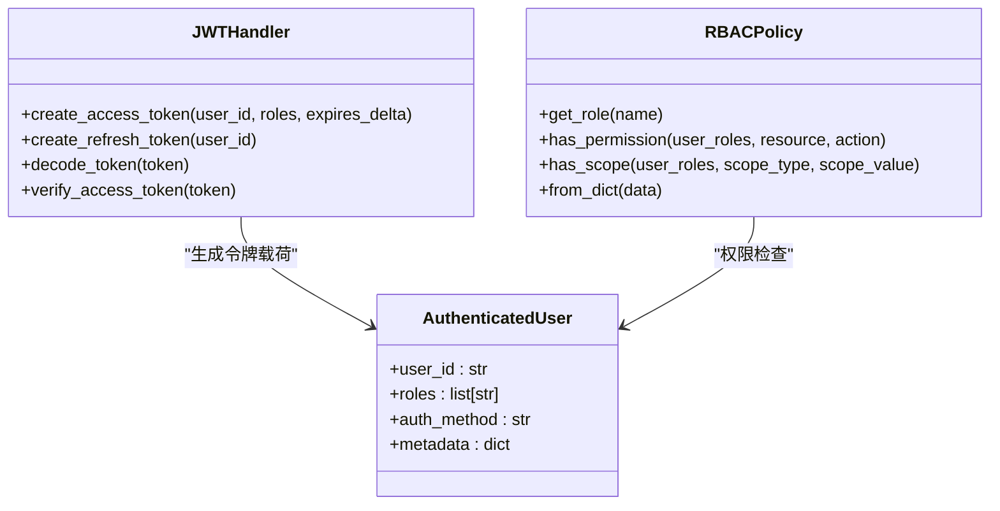
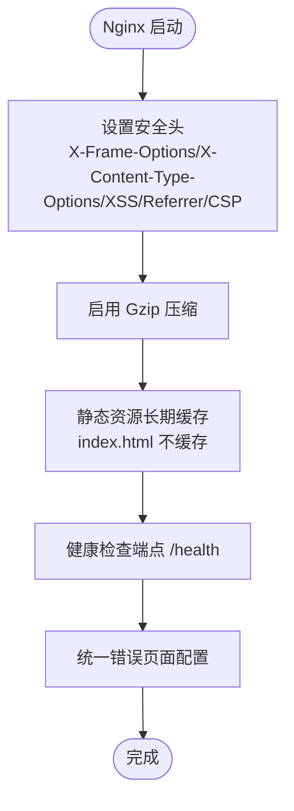
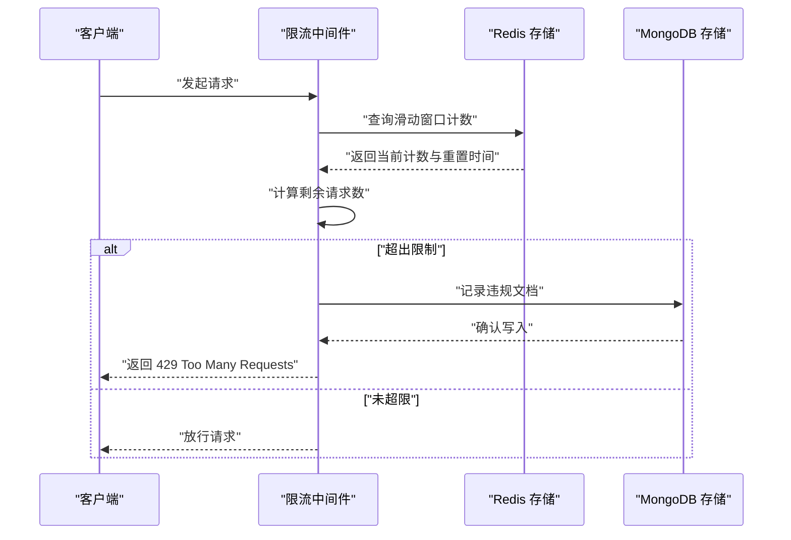
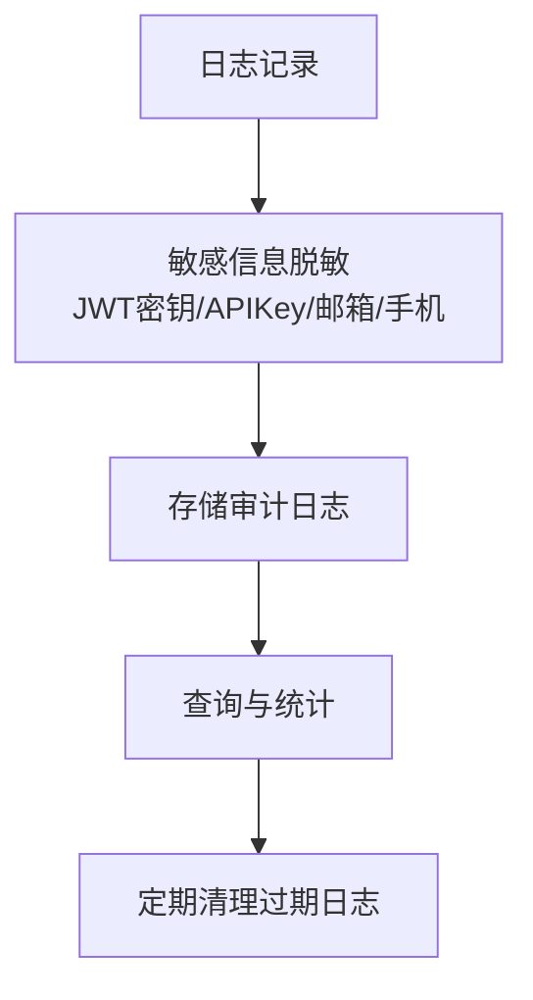
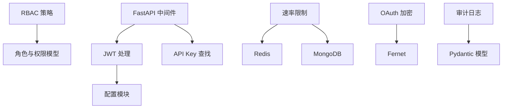

# 安全策略

<cite>
**本文引用的文件**
- [jwt_handler.py](file://tools/flexloop/src/taolib/testing/config_center/server/auth/jwt_handler.py)
- [rbac.py](file://tools/flexloop/src/taolib/testing/auth/rbac.py)
- [models.py（认证模型）](file://tools/flexloop/src/taolib/testing/auth/models.py)
- [middleware.py（FastAPI 中间件）](file://tools/flexloop/src/taolib/testing/auth/fastapi/middleware.py)
- [schemes.py（安全方案工厂）](file://tools/flexloop/src/taolib/testing/auth/fastapi/schemes.py)
- [models.py（限流模型）](file://tools/flexloop/src/taolib/testing/rate_limiter/models.py)
- [__init__.py（限流模块入口）](file://tools/flexloop/src/taolib/testing/rate_limiter/__init__.py)
- [test_auth.py（认证授权测试）](file://tools/flexloop/tests/testing/test_auth/test_auth.py)
- [test_dependencies.py（FastAPI 依赖测试）](file://tools/flexloop/tests/testing/test_auth/test_fastapi/test_dependencies.py)
- [test_middleware.py（中间件测试）](file://tools/flexloop/tests/testing/test_auth/test_fastapi/test_middleware.py)
- [token_encryption.py（OAuth 令牌加密）](file://tools/flexloop/src/taolib/testing/oauth/crypto/token_encryption.py)
- [models.py（审计模型）](file://tools/flexloop/src/taolib/testing/audit/models.py)
- [logger.py（审计日志实现）](file://tools/flexloop/src/taolib/testing/audit/logger.py)
- [nginx.conf（Nginx 安全配置）](file://apps/AgentPit/nginx.conf)
- [SettingsPage.tsx（Time Capsule 设置页）](file://apps/time-capsule/src/pages/SettingsPage.tsx)
- [SettingsPage.tsx（Moodflow 设置页）](file://apps/moodflow/src/pages/SettingsPage.tsx)
- [test_crypto.py（OAuth 加密测试）](file://tools/flexloop/tests/testing/test_oauth/test_crypto.py)
- [test_violation_tracker.py（违规追踪测试）](file://tools/flexloop/tests/testing/test_rate_limiter/test_violation_tracker.py)
- [logging_config.py（日志脱敏配置）](file://tools/flexloop/src/taolib/testing/logging_config.py)
</cite>

## 目录
1. [引言](#引言)
2. [项目结构](#项目结构)
3. [核心组件](#核心组件)
4. [架构概览](#架构概览)
5. [详细组件分析](#详细组件分析)
6. [依赖分析](#依赖分析)
7. [性能考虑](#性能考虑)
8. [故障排除指南](#故障排除指南)
9. [结论](#结论)
10. [附录](#附录)

## 引言
本安全策略文档面向 DAOApps 项目，旨在提供一套完整的安全实施方案，涵盖数据加密（传输加密 TLS、存储加密、密钥管理）、访问控制（JWT 令牌管理、OAuth2.0 集成、RBAC 权限控制）、网络安全配置（防火墙规则、DDoS 防护、WAF 设置）、API 安全最佳实践（输入验证、速率限制、CORS 配置）、隐私保护（数据最小化、匿名化处理、用户同意管理）、安全审计与合规性检查，以及安全事件响应与恢复流程。

## 项目结构
DAOApps 采用多应用架构，包含前端应用（AgentPit、moodflow、time-capsule 等）与后端工具库（flexloop）。安全相关能力主要分布在以下位置：
- 认证与授权：flexloop 工具库中的 JWT 处理、RBAC 策略、FastAPI 安全方案与中间件
- 速率限制：flexloop 工具库中的滑动窗口限流中间件
- OAuth 令牌加密：flexloop 工具库中的 Fernet 对称加密
- 审计日志：flexloop 工具库中的审计模型与存储实现
- 网络安全：AgentPit 应用的 Nginx 配置
- 前端隐私设置：moodflow 与 time-capsule 应用的本地加密与隐私说明

**图表来源**
- [nginx.conf:1-68](file://apps/AgentPit/nginx.conf#L1-L68)
- [jwt_handler.py:1-94](file://tools/flexloop/src/taolib/testing/config_center/server/auth/jwt_handler.py#L1-L94)
- [rbac.py:1-160](file://tools/flexloop/src/taolib/testing/auth/rbac.py#L1-L160)
- [models.py（限流模型）:1-167](file://tools/flexloop/src/taolib/testing/rate_limiter/models.py#L1-L167)
- [token_encryption.py:1-85](file://tools/flexloop/src/taolib/testing/oauth/crypto/token_encryption.py#L1-L85)
- [models.py（审计模型）:1-199](file://tools/flexloop/src/taolib/testing/audit/models.py#L1-L199)

**章节来源**
- [nginx.conf:1-68](file://apps/AgentPit/nginx.conf#L1-L68)
- [jwt_handler.py:1-94](file://tools/flexloop/src/taolib/testing/config_center/server/auth/jwt_handler.py#L1-L94)
- [rbac.py:1-160](file://tools/flexloop/src/taolib/testing/auth/rbac.py#L1-L160)
- [models.py（限流模型）:1-167](file://tools/flexloop/src/taolib/testing/rate_limiter/models.py#L1-L167)
- [token_encryption.py:1-85](file://tools/flexloop/src/taolib/testing/oauth/crypto/token_encryption.py#L1-L85)
- [models.py（审计模型）:1-199](file://tools/flexloop/src/taolib/testing/audit/models.py#L1-L199)

## 核心组件
- JWT 令牌管理：负责访问令牌与刷新令牌的生成、验证与负载解析，支持过期时间与令牌类型校验。
- RBAC 权限控制：提供基于角色的权限检查与作用域验证，支持资源-动作模型与作用域映射。
- OAuth 令牌加密：使用 Fernet 对称加密安全存储第三方平台访问令牌，支持密钥轮换。
- 速率限制：基于 Redis 的滑动窗口限流，支持路径级规则、白名单与违规记录持久化。
- 审计日志：统一的审计日志模型与多种存储实现（内存、文件），支持查询、统计与清理。
- 网络安全：Nginx 层面的安全头、压缩与静态资源缓存策略。
- 前端隐私设置：应用内本地加密开关与隐私说明，强调数据本地存储与算法说明。

**章节来源**
- [jwt_handler.py:14-94](file://tools/flexloop/src/taolib/testing/config_center/server/auth/jwt_handler.py#L14-L94)
- [rbac.py:41-160](file://tools/flexloop/src/taolib/testing/auth/rbac.py#L41-L160)
- [token_encryption.py:20-85](file://tools/flexloop/src/taolib/testing/oauth/crypto/token_encryption.py#L20-L85)
- [models.py（限流模型）:31-167](file://tools/flexloop/src/taolib/testing/rate_limiter/models.py#L31-L167)
- [models.py（审计模型）:37-199](file://tools/flexloop/src/taolib/testing/audit/models.py#L37-L199)
- [nginx.conf:52-68](file://apps/AgentPit/nginx.conf#L52-L68)
- [SettingsPage.tsx（Time Capsule 设置页）:165-190](file://apps/time-capsule/src/pages/SettingsPage.tsx#L165-L190)
- [SettingsPage.tsx（Moodflow 设置页）:141-167](file://apps/moodflow/src/pages/SettingsPage.tsx#L141-L167)

## 架构概览
下图展示了 DAOApps 的安全架构，包括认证授权、速率限制、OAuth 加密与审计日志的关键交互。

**图表来源**
- [nginx.conf:1-68](file://apps/AgentPit/nginx.conf#L1-L68)
- [jwt_handler.py:14-94](file://tools/flexloop/src/taolib/testing/config_center/server/auth/jwt_handler.py#L14-L94)
- [rbac.py:41-160](file://tools/flexloop/src/taolib/testing/auth/rbac.py#L41-L160)
- [middleware.py:144-172](file://tools/flexloop/src/taolib/testing/auth/fastapi/middleware.py#L144-L172)
- [models.py（限流模型）:31-167](file://tools/flexloop/src/taolib/testing/rate_limiter/models.py#L31-L167)
- [token_encryption.py:20-85](file://tools/flexloop/src/taolib/testing/oauth/crypto/token_encryption.py#L20-L85)
- [models.py（审计模型）:37-199](file://tools/flexloop/src/taolib/testing/audit/models.py#L37-L199)

## 详细组件分析

### 数据加密实施方案
- 传输加密（TLS）
  - Nginx 配置包含安全头与压缩设置，建议在生产环境中启用 HTTPS（监听 443 端口并配置 SSL 证书）。
  - 前端应用（AgentPit）提供 SSL 开关与子域名配置，便于自动化 HTTPS 安全连接。
- 存储加密
  - OAuth 令牌加密：使用 Fernet 对称加密，支持密钥生成、加密、解密与密钥轮换，确保第三方访问令牌的安全存储。
  - 前端本地加密：moodflow 与 time-capsule 提供本地加密开关与隐私说明，强调数据本地存储与算法说明。
- 密钥管理
  - JWT 密钥：通过环境变量注入，要求长度满足安全要求；建议使用独立的密钥轮换流程与密钥分层。
  - OAuth 加密密钥：建议与应用主密钥分离，定期轮换并安全存储。

**图表来源**
- [token_encryption.py:20-85](file://tools/flexloop/src/taolib/testing/oauth/crypto/token_encryption.py#L20-L85)
- [SettingsPage.tsx（Moodflow 设置页）:141-167](file://apps/moodflow/src/pages/SettingsPage.tsx#L141-L167)
- [SettingsPage.tsx（Time Capsule 设置页）:165-190](file://apps/time-capsule/src/pages/SettingsPage.tsx#L165-L190)

**章节来源**
- [nginx.conf:52-68](file://apps/AgentPit/nginx.conf#L52-L68)
- [PublishPanel.vue:216-226](file://apps/AgentPit/src/components/sphinx/PublishPanel.vue#L216-L226)
- [SiteWizard.vue:379-403](file://apps/AgentPit/src/components/sphinx/SiteWizard.vue#L379-L403)
- [token_encryption.py:11-85](file://tools/flexloop/src/taolib/testing/oauth/crypto/token_encryption.py#L11-L85)
- [SettingsPage.tsx（Moodflow 设置页）:141-167](file://apps/moodflow/src/pages/SettingsPage.tsx#L141-L167)
- [SettingsPage.tsx（Time Capsule 设置页）:165-190](file://apps/time-capsule/src/pages/SettingsPage.tsx#L165-L190)

### 访问控制机制
- JWT 令牌管理
  - 令牌生成：支持访问令牌与刷新令牌，包含用户 ID、角色列表与过期时间。
  - 令牌验证：区分访问令牌类型，确保令牌有效性与类型正确性。
- OAuth2.0 集成
  - 双通道认证：优先使用 JWT，同时支持 API Key 作为备用认证通道。
  - 安全方案工厂：提供 OAuth2 密码承载与 API Key 头部的安全方案。
- RBAC 权限控制
  - 权限模型：资源-动作模型，支持多角色累加权限。
  - 作用域验证：支持按作用域类型与值进行访问控制，支持无限制作用域。

**图表来源**
- [jwt_handler.py:14-94](file://tools/flexloop/src/taolib/testing/config_center/server/auth/jwt_handler.py#L14-L94)
- [rbac.py:41-160](file://tools/flexloop/src/taolib/testing/auth/rbac.py#L41-L160)
- [models.py（认证模型）:32-68](file://tools/flexloop/src/taolib/testing/auth/models.py#L32-L68)

**章节来源**
- [jwt_handler.py:14-94](file://tools/flexloop/src/taolib/testing/config_center/server/auth/jwt_handler.py#L14-L94)
- [rbac.py:41-160](file://tools/flexloop/src/taolib/testing/auth/rbac.py#L41-L160)
- [models.py（认证模型）:11-68](file://tools/flexloop/src/taolib/testing/auth/models.py#L11-L68)
- [schemes.py:9-40](file://tools/flexloop/src/taolib/testing/auth/fastapi/schemes.py#L9-L40)
- [middleware.py:144-172](file://tools/flexloop/src/taolib/testing/auth/fastapi/middleware.py#L144-L172)

### 网络安全配置
- Nginx 安全头
  - 包含 X-Frame-Options、X-Content-Type-Options、X-XSS-Protection、Referrer-Policy、Content-Security-Policy 等安全头。
  - 隐藏 Nginx 版本号，减少指纹暴露风险。
- 压缩与缓存
  - 启用 Gzip 压缩，提升传输效率。
  - 静态资源长期缓存，index.html 不缓存以确保更新。
- 健康检查与错误页面
  - 提供 /health 健康检查端点与统一错误页面。

**图表来源**
- [nginx.conf:1-68](file://apps/AgentPit/nginx.conf#L1-L68)

**章节来源**
- [nginx.conf:1-68](file://apps/AgentPit/nginx.conf#L1-L68)

### API 安全最佳实践
- 输入验证
  - 使用 Pydantic 模型进行请求与响应验证，确保字段类型与约束符合预期。
- 速率限制
  - 滑动窗口限流中间件，支持按用户/IP 差异化限流、路径级规则与白名单。
  - 违规记录持久化至 MongoDB，并支持 TTL 清理。
- CORS 配置
  - 建议在后端统一配置 CORS 策略，明确允许的来源、方法与头部，避免使用通配符。

**图表来源**
- [models.py（限流模型）:31-167](file://tools/flexloop/src/taolib/testing/rate_limiter/models.py#L31-L167)
- [test_violation_tracker.py:258-280](file://tools/flexloop/tests/testing/test_rate_limiter/test_violation_tracker.py#L258-L280)

**章节来源**
- [models.py（限流模型）:14-167](file://tools/flexloop/src/taolib/testing/rate_limiter/models.py#L14-L167)
- [__init__.py（限流模块入口）:1-27](file://tools/flexloop/src/taolib/testing/rate_limiter/__init__.py#L1-L27)
- [test_violation_tracker.py:258-280](file://tools/flexloop/tests/testing/test_rate_limiter/test_violation_tracker.py#L258-L280)

### 隐私保护措施
- 数据最小化
  - 审计日志仅记录必要字段，避免敏感信息泄露。
- 匿名化处理
  - 日志脱敏配置支持屏蔽 JWT 密钥、API Key、邮箱与手机号等敏感信息。
- 用户同意管理
  - 前端应用提供隐私说明与本地加密开关，确保用户知情与可控。

**图表来源**
- [models.py（审计模型）:37-199](file://tools/flexloop/src/taolib/testing/audit/models.py#L37-L199)
- [logger.py:98-117](file://tools/flexloop/src/taolib/testing/audit/logger.py#L98-L117)
- [logging_config.py:107-146](file://tools/flexloop/src/taolib/testing/logging_config.py#L107-L146)

**章节来源**
- [models.py（审计模型）:37-199](file://tools/flexloop/src/taolib/testing/audit/models.py#L37-L199)
- [logger.py:98-117](file://tools/flexloop/src/taolib/testing/audit/logger.py#L98-L117)
- [logging_config.py:107-146](file://tools/flexloop/src/taolib/testing/logging_config.py#L107-L146)
- [SettingsPage.tsx（Time Capsule 设置页）:165-190](file://apps/time-capsule/src/pages/SettingsPage.tsx#L165-L190)
- [SettingsPage.tsx（Moodflow 设置页）:141-167](file://apps/moodflow/src/pages/SettingsPage.tsx#L141-L167)

### 安全审计与合规性检查
- 审计日志模型
  - 定义操作类型、状态、资源类型与详情等字段，支持统一的审计记录格式。
- 存储实现
  - 内存与文件两种存储实现，支持查询、统计与清理。
- 合规性检查
  - 建议定期审查审计日志，确保操作可追溯、异常可定位，并符合数据保护法规要求。

**章节来源**
- [models.py（审计模型）:14-199](file://tools/flexloop/src/taolib/testing/audit/models.py#L14-L199)
- [logger.py:79-184](file://tools/flexloop/src/taolib/testing/audit/logger.py#L79-L184)

### 安全事件响应与恢复流程
- 事件检测
  - 通过审计日志与速率限制违规记录识别异常行为。
- 响应处置
  - 对高风险事件触发临时封禁、通知与回滚策略。
- 恢复验证
  - 事件解决后进行功能回归测试与日志核对，确保系统恢复正常。

**章节来源**
- [test_dependencies.py:389-465](file://tools/flexloop/tests/testing/test_auth/test_fastapi/test_dependencies.py#L389-L465)
- [test_middleware.py:155-236](file://tools/flexloop/tests/testing/test_auth/test_fastapi/test_middleware.py#L155-L236)
- [test_auth.py:19-44](file://tools/flexloop/tests/testing/test_auth/test_auth.py#L19-L44)

## 依赖分析
- 认证与授权模块
  - JWT 处理依赖配置模块，RBAC 策略依赖角色定义与权限模型。
  - FastAPI 中间件与安全方案工厂提供统一的认证入口。
- 速率限制模块
  - 依赖 Redis 进行计数存储，MongoDB 用于违规记录持久化。
- OAuth 加密模块
  - 依赖 cryptography.Fernet 进行对称加密，支持密钥轮换。
- 审计日志模块
  - 依赖 Pydantic 进行数据建模，支持多种存储后端。

**图表来源**
- [jwt_handler.py:11-11](file://tools/flexloop/src/taolib/testing/config_center/server/auth/jwt_handler.py#L11-L11)
- [rbac.py:41-160](file://tools/flexloop/src/taolib/testing/auth/rbac.py#L41-L160)
- [middleware.py:144-172](file://tools/flexloop/src/taolib/testing/auth/fastapi/middleware.py#L144-L172)
- [models.py（限流模型）:31-46](file://tools/flexloop/src/taolib/testing/rate_limiter/models.py#L31-L46)
- [token_encryption.py:29-35](file://tools/flexloop/src/taolib/testing/oauth/crypto/token_encryption.py#L29-L35)
- [models.py（审计模型）:37-70](file://tools/flexloop/src/taolib/testing/audit/models.py#L37-L70)

**章节来源**
- [jwt_handler.py:11-11](file://tools/flexloop/src/taolib/testing/config_center/server/auth/jwt_handler.py#L11-L11)
- [rbac.py:41-160](file://tools/flexloop/src/taolib/testing/auth/rbac.py#L41-L160)
- [middleware.py:144-172](file://tools/flexloop/src/taolib/testing/auth/fastapi/middleware.py#L144-L172)
- [models.py（限流模型）:31-46](file://tools/flexloop/src/taolib/testing/rate_limiter/models.py#L31-L46)
- [token_encryption.py:29-35](file://tools/flexloop/src/taolib/testing/oauth/crypto/token_encryption.py#L29-L35)
- [models.py（审计模型）:37-70](file://tools/flexloop/src/taolib/testing/audit/models.py#L37-L70)

## 性能考虑
- 传输加密
  - 合理配置 TLS 参数与会话复用，平衡安全性与性能。
- 存储加密
  - 对称加密开销较低，建议在令牌存储场景使用；注意密钥轮换的性能影响。
- 速率限制
  - Redis 作为计数存储，需关注网络延迟与内存占用；合理设置窗口大小与 TTL。
- 审计日志
  - 控制日志级别与字段数量，避免对系统性能造成过大影响。

## 故障排除指南
- JWT 认证失败
  - 检查令牌过期时间与算法配置，确认密钥长度满足要求。
- RBAC 权限不足
  - 核对用户角色与资源-动作映射，确认作用域配置。
- OAuth 令牌解密失败
  - 确认加密密钥正确且未被篡改，执行密钥轮换流程。
- 速率限制误伤
  - 检查白名单配置与路径规则，调整窗口大小与阈值。
- 审计日志缺失
  - 检查存储后端可用性与权限，确认查询过滤条件。

**章节来源**
- [test_auth.py:19-44](file://tools/flexloop/tests/testing/test_auth/test_auth.py#L19-L44)
- [test_dependencies.py:389-465](file://tools/flexloop/tests/testing/test_auth/test_fastapi/test_dependencies.py#L389-L465)
- [test_middleware.py:155-236](file://tools/flexloop/tests/testing/test_auth/test_fastapi/test_middleware.py#L155-L236)
- [test_crypto.py:36-72](file://tools/flexloop/tests/testing/test_oauth/test_crypto.py#L36-L72)
- [test_violation_tracker.py:258-280](file://tools/flexloop/tests/testing/test_rate_limiter/test_violation_tracker.py#L258-L280)

## 结论
DAOApps 的安全策略围绕“传输加密、存储加密、访问控制、速率限制、审计日志与隐私保护”六大支柱构建。通过 JWT 与 RBAC 实现细粒度的访问控制，借助 OAuth 加密保障第三方令牌安全，配合 Nginx 安全头与限流中间件提升整体安全性。建议在生产环境中进一步完善 WAF、DDoS 防护与防火墙规则，并建立持续的安全审计与事件响应机制。

## 附录
- 测试参考
  - 认证授权测试：覆盖 JWT 生成、验证与 RBAC 权限检查。
  - OAuth 加密测试：覆盖加密、解密、密钥轮换与错误处理。
  - 速率限制测试：覆盖违规记录与统计查询。
- 配置建议
  - 在 Nginx 中启用 HTTPS 并配置强密码套件。
  - 在后端统一配置 CORS，严格限定来源与方法。
  - 定期轮换 JWT 与 OAuth 加密密钥，确保密钥安全生命周期管理。