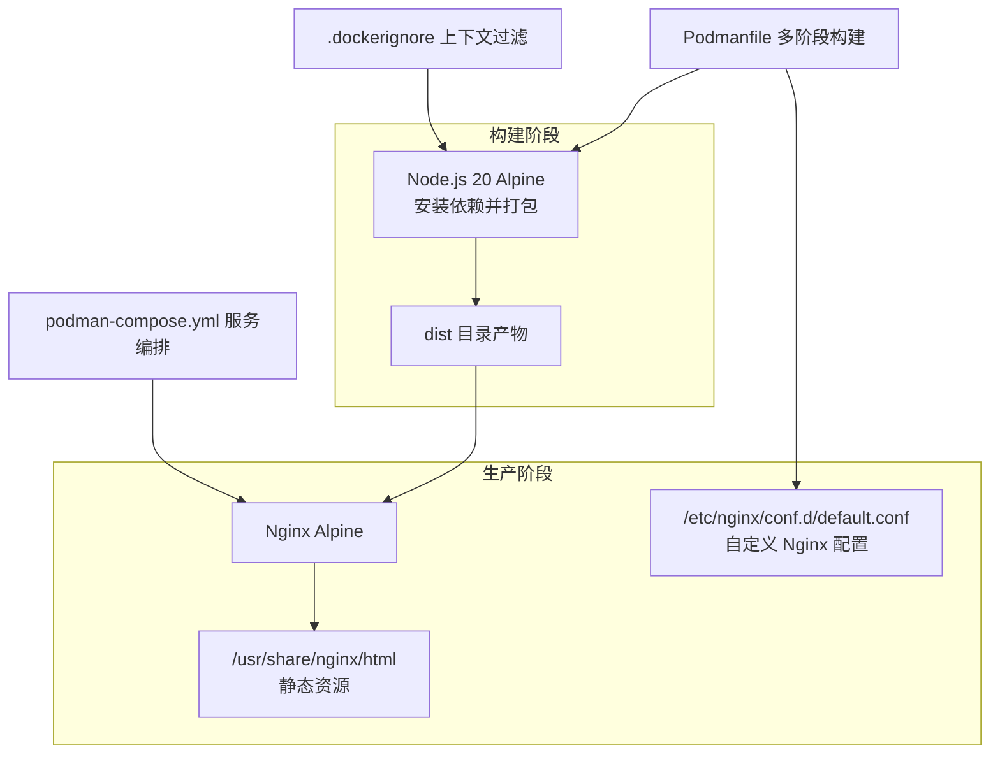
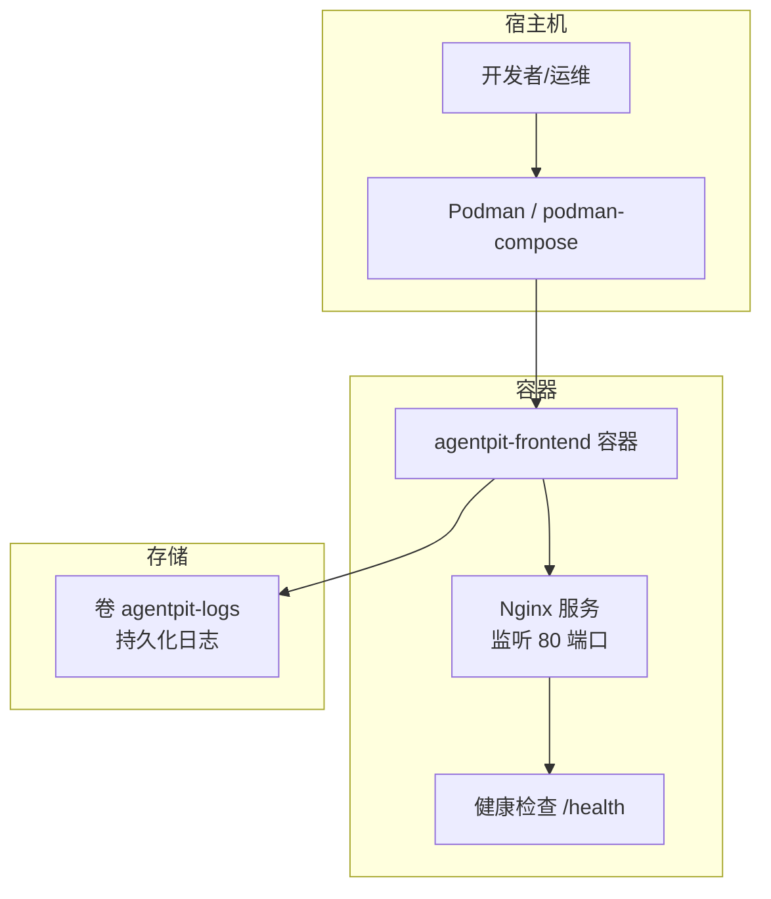
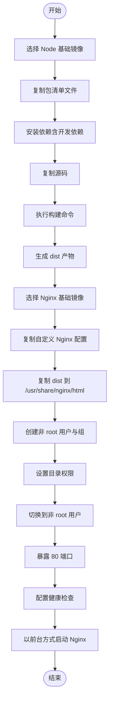
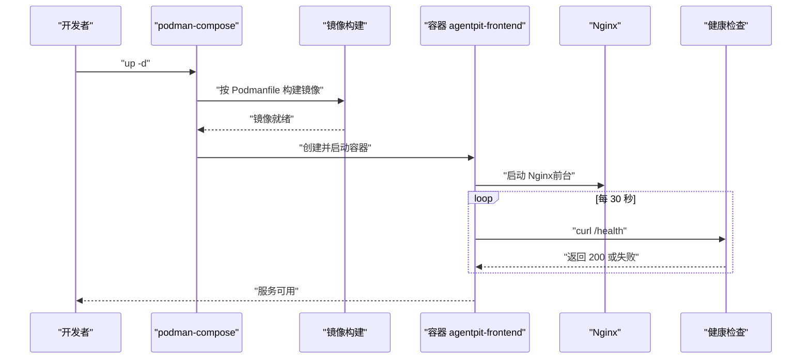
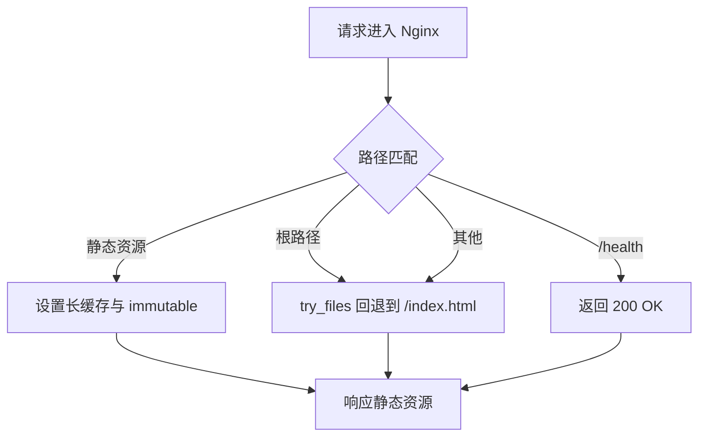
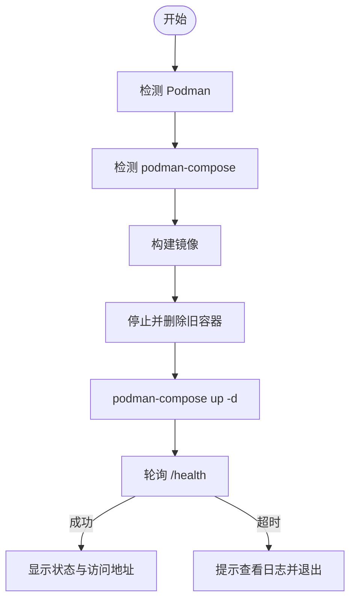
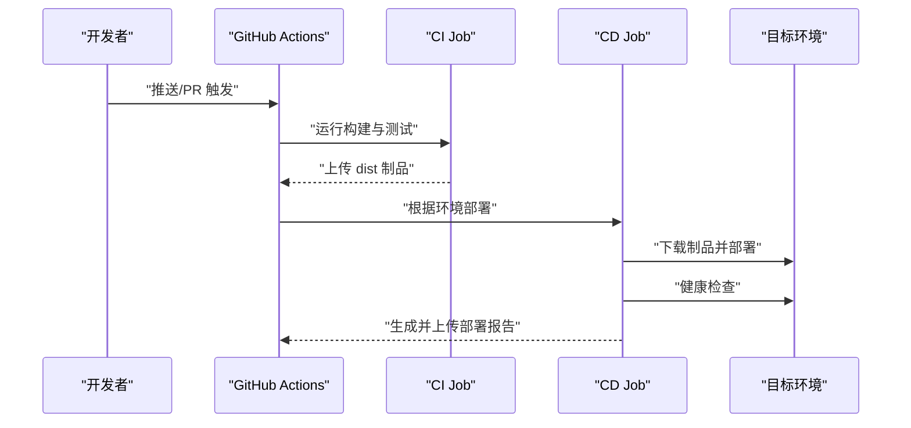
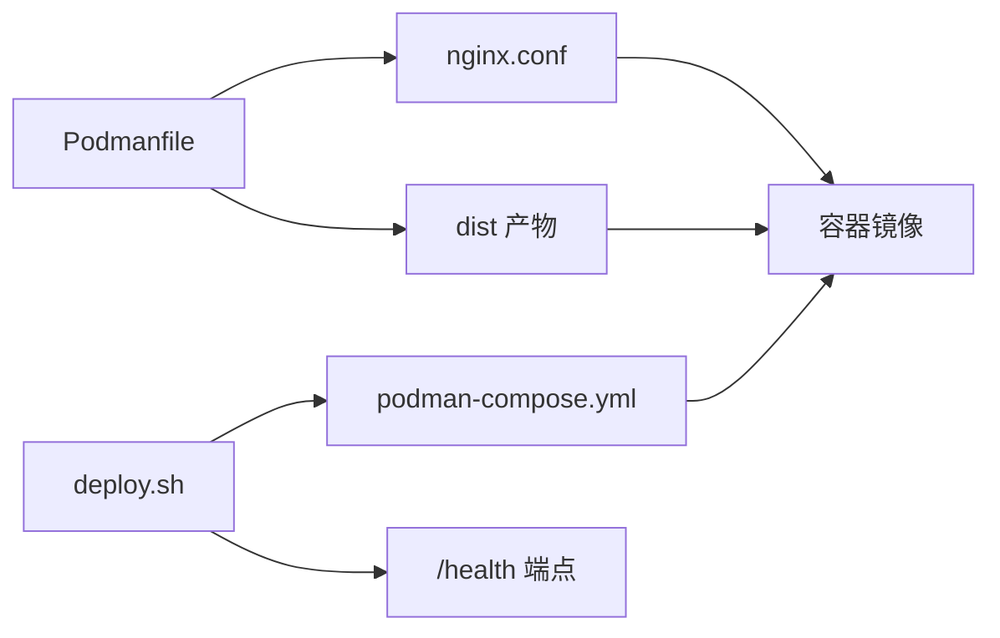

# 容器化部署

<cite>
**本文引用的文件**
- [podman-compose.yml](file://apps/AgentPit/podman-compose.yml)
- [Podmanfile](file://apps/AgentPit/Podmanfile)
- [nginx.conf](file://apps/AgentPit/nginx.conf)
- [.dockerignore](file://apps/AgentPit/.dockerignore)
- [deploy.sh](file://apps/AgentPit/deploy.sh)
- [package.json](file://apps/AgentPit/package.json)
- [cd.yml](file://.github/workflows/cd.yml)
- [ci.yml](file://.github/workflows/ci.yml)
</cite>

## 目录
1. [简介](#简介)
2. [项目结构](#项目结构)
3. [核心组件](#核心组件)
4. [架构总览](#架构总览)
5. [详细组件分析](#详细组件分析)
6. [依赖关系分析](#依赖关系分析)
7. [性能考量](#性能考量)
8. [故障排查指南](#故障排查指南)
9. [结论](#结论)
10. [附录](#附录)

## 简介
本文件面向 DAOApps 项目中的 AgentPit 前端应用，提供完整的容器化部署方案与最佳实践，涵盖以下主题：
- Docker/Podman 多阶段镜像构建流程与优化策略
- Podman Compose 服务编排、网络与卷配置
- Nginx 反向代理配置（静态资源缓存、Gzip 压缩、安全头）
- 容器健康检查、日志聚合、资源限制与安全加固
- 环境变量管理与配置文件挂载
- CI/CD 流水线与自动化部署脚本

## 项目结构
AgentPit 前端应用采用“构建产物 + Nginx 提供服务”的双阶段镜像策略：
- 构建阶段：基于 Node.js Alpine，安装依赖并打包前端产物至 dist 目录
- 生产阶段：基于 Nginx Alpine，复制 dist 至 /usr/share/nginx/html 并提供静态服务
- 通过 Podmanfile 实现多阶段构建；通过 podman-compose.yml 进行服务编排与资源限制；通过 nginx.conf 提供反向代理与静态资源服务；通过 .dockerignore 控制构建上下文与缓存层命中。

图表来源
- [Podmanfile:1-71](file://apps/AgentPit/Podmanfile#L1-L71)
- [podman-compose.yml:14-70](file://apps/AgentPit/podman-compose.yml#L14-L70)
- [nginx.conf:1-68](file://apps/AgentPit/nginx.conf#L1-L68)
- [.dockerignore:1-39](file://apps/AgentPit/.dockerignore#L1-L39)

章节来源
- [Podmanfile:1-71](file://apps/AgentPit/Podmanfile#L1-L71)
- [podman-compose.yml:1-70](file://apps/AgentPit/podman-compose.yml#L1-L70)
- [nginx.conf:1-68](file://apps/AgentPit/nginx.conf#L1-L68)
- [.dockerignore:1-39](file://apps/AgentPit/.dockerignore#L1-L39)

## 核心组件
- 多阶段 Dockerfile（Podmanfile）
  - 构建阶段：Node.js Alpine，安装依赖，执行构建，生成 dist
  - 生产阶段：Nginx Alpine，复制 dist 与自定义 nginx.conf，设置非 root 用户与健康检查
- Podman Compose 编排
  - 定义网络、卷、服务、资源限制、重启策略、健康检查、只读文件系统等
- Nginx 配置
  - Gzip 压缩、静态资源长期缓存、SPA 路由回退、安全头、隐藏版本号、错误页
- 部署脚本（deploy.sh）
  - Podman/podman-compose 检测、镜像构建、旧容器清理、启动、健康检查轮询、状态展示
- CI/CD 工作流
  - GitHub Actions 中的 CI/CD 流水线，包含构建、测试、制品上传与部署报告

章节来源
- [Podmanfile:1-71](file://apps/AgentPit/Podmanfile#L1-L71)
- [podman-compose.yml:14-70](file://apps/AgentPit/podman-compose.yml#L14-L70)
- [nginx.conf:1-68](file://apps/AgentPit/nginx.conf#L1-L68)
- [deploy.sh:1-184](file://apps/AgentPit/deploy.sh#L1-L184)
- [ci.yml:1-67](file://.github/workflows/ci.yml#L1-L67)
- [cd.yml:1-247](file://.github/workflows/cd.yml#L1-L247)

## 架构总览
AgentPit 前端容器化架构由“构建产物 + Nginx 提供服务”组成，Podman Compose 负责编排，Nginx 提供静态资源与路由回退，健康检查保障可用性。

图表来源
- [podman-compose.yml:14-70](file://apps/AgentPit/podman-compose.yml#L14-L70)
- [nginx.conf:27-32](file://apps/AgentPit/nginx.conf#L27-L32)

章节来源
- [podman-compose.yml:14-70](file://apps/AgentPit/podman-compose.yml#L14-L70)
- [nginx.conf:1-68](file://apps/AgentPit/nginx.conf#L1-L68)

## 详细组件分析

### 多阶段镜像构建（Podmanfile）
- 基础镜像与阶段划分
  - 构建阶段：基于 node:20-alpine，安装依赖并执行构建，产物输出至 dist
  - 生产阶段：基于 nginx:alpine，复制自定义 nginx.conf 与 dist 目录
- 依赖管理与缓存优化
  - 先复制 package.json/package-lock.json，利用层缓存；仅在依赖变更时重建依赖层
  - .dockerignore 排除 node_modules、dist、测试、文档、IDE 配置等，缩小构建上下文
- 安全与运行时配置
  - 创建非 root 用户组与用户，设置目录所有权，切换到非 root 用户运行
  - 暴露 80 端口，设置环境变量 NODE_ENV、TZ
  - 健康检查使用 curl 访问 /health，失败重试次数与超时时间合理配置
- 启动方式
  - Nginx 以前台模式运行，便于容器管理与日志采集

图表来源
- [Podmanfile:4-71](file://apps/AgentPit/Podmanfile#L4-L71)
- [.dockerignore:1-39](file://apps/AgentPit/.dockerignore#L1-L39)

章节来源
- [Podmanfile:1-71](file://apps/AgentPit/Podmanfile#L1-L71)
- [.dockerignore:1-39](file://apps/AgentPit/.dockerignore#L1-L39)

### Podman Compose 编排（服务、网络、卷）
- 服务定义
  - 容器名称、镜像名、构建上下文与 Dockerfile、目标阶段
  - 端口映射：容器 80 -> 主机 8080
  - 卷挂载：将日志目录持久化到命名卷
- 网络与安全
  - 自定义桥接网络，隔离服务间通信
  - 非 root 用户运行，启用只读文件系统，使用 tmpfs 提升安全性
- 资源限制
  - 内存上限与保留、CPU 百分比限制，防止资源争用
- 健康检查
  - 每 30 秒检查一次 /health，超时 10 秒，连续失败 3 次判定不健康
- 环境变量与配置文件
  - 设置 NODE_ENV、TZ，支持 env_file 引用外部环境文件

图表来源
- [podman-compose.yml:14-70](file://apps/AgentPit/podman-compose.yml#L14-L70)
- [nginx.conf:27-32](file://apps/AgentPit/nginx.conf#L27-L32)

章节来源
- [podman-compose.yml:1-70](file://apps/AgentPit/podman-compose.yml#L1-L70)

### Nginx 反向代理与静态资源服务（nginx.conf）
- Gzip 压缩
  - 开启 gzip，设置压缩级别与类型，提升传输效率
- 静态资源缓存
  - 对带哈希的静态资源（js/css/png/jpg/gif/ico/svg/字体）设置一年缓存与 immutable
  - 对 index.html 关闭缓存，确保用户获取最新版本
- SPA 路由回退
  - 使用 try_files 回退到 /index.html，支持前端路由
- 安全头与隐私保护
  - 设置 X-Frame-Options、X-Content-Type-Options、X-XSS-Protection、Referrer-Policy、Content-Security-Policy
  - 隐藏 Nginx 版本号
- 错误页
  - 404 回退到 /index.html，50x 错误页指向内置页面

图表来源
- [nginx.conf:10-68](file://apps/AgentPit/nginx.conf#L10-L68)

章节来源
- [nginx.conf:1-68](file://apps/AgentPit/nginx.conf#L1-L68)

### 部署脚本（deploy.sh）
- 功能概览
  - 检测 Podman 与 podman-compose 是否安装
  - 构建镜像、停止并删除旧容器、使用 podman-compose 启动服务
  - 轮询健康检查端点，等待应用可用，输出访问地址与常用命令
- 健康检查轮询
  - 最大等待时间、轮询间隔、失败提示与日志查看指引
- 常用命令
  - 查看日志、查看状态、停止/重启服务

图表来源
- [deploy.sh:47-159](file://apps/AgentPit/deploy.sh#L47-L159)

章节来源
- [deploy.sh:1-184](file://apps/AgentPit/deploy.sh#L1-L184)

### CI/CD 流水线（GitHub Actions）
- CI 阶段
  - Node.js 环境设置、依赖安装、格式检查、ESLint、TypeScript 类型检查、单元测试
  - 构建生产产物并上传为制品
- CD 阶段
  - 根据分支或手动触发选择环境（staging/production），下载制品并执行部署
  - 健康检查与部署报告生成并上传为制品
- 回滚机制
  - 失败时触发回滚流程并生成回滚报告

图表来源
- [ci.yml:10-67](file://.github/workflows/ci.yml#L10-L67)
- [cd.yml:19-135](file://.github/workflows/cd.yml#L19-L135)

章节来源
- [ci.yml:1-67](file://.github/workflows/ci.yml#L1-67)
- [cd.yml:1-247](file://.github/workflows/cd.yml#L1-L247)

## 依赖关系分析
- 组件耦合
  - Podmanfile 与 nginx.conf 强耦合于生产阶段产物与静态资源路径
  - podman-compose.yml 依赖 Podmanfile 构建产物与 nginx.conf
  - deploy.sh 依赖 podman-compose.yml 与健康检查端点
- 外部依赖
  - Node.js 20 Alpine、Nginx Alpine 基础镜像
  - curl 用于健康检查
- 潜在循环依赖
  - 当前结构为单向依赖，无循环

图表来源
- [Podmanfile:27-44](file://apps/AgentPit/Podmanfile#L27-L44)
- [podman-compose.yml:18-26](file://apps/AgentPit/podman-compose.yml#L18-L26)
- [nginx.conf:27-32](file://apps/AgentPit/nginx.conf#L27-L32)

章节来源
- [Podmanfile:1-71](file://apps/AgentPit/Podmanfile#L1-L71)
- [podman-compose.yml:1-70](file://apps/AgentPit/podman-compose.yml#L1-L70)
- [nginx.conf:1-68](file://apps/AgentPit/nginx.conf#L1-L68)

## 性能考量
- 构建性能
  - 通过 .dockerignore 缩小构建上下文，避免无关文件进入缓存层
  - 优先复制包清单文件以复用依赖层缓存
- 静态资源性能
  - 启用 Gzip 压缩与长期缓存，减少带宽与服务器压力
  - SPA 路由回退避免重复加载入口 HTML
- 运行时性能
  - 限制内存与 CPU，防止资源争用
  - 使用只读文件系统与 tmpfs，降低写放大与安全风险

## 故障排查指南
- 健康检查失败
  - 使用脚本提供的轮询逻辑定位问题；查看容器日志与 Nginx 错误日志
  - 确认 /health 端点可达且返回 200
- 端口冲突
  - 检查主机端口映射是否被占用（默认 8080:80）
- 权限问题
  - 确认非 root 用户对 /usr/share/nginx/html 与日志目录有读写权限
- 配置错误
  - 检查 nginx.conf 的路径、try_files 与安全头设置
- CI/CD 失败
  - 查看制品上传与下载步骤，确认 dist 目录存在且内容正确

章节来源
- [deploy.sh:118-141](file://apps/AgentPit/deploy.sh#L118-L141)
- [podman-compose.yml:55-61](file://apps/AgentPit/podman-compose.yml#L55-L61)
- [nginx.conf:27-32](file://apps/AgentPit/nginx.conf#L27-L32)

## 结论
本方案通过多阶段构建与 Nginx 提供静态服务，实现了轻量、安全、可维护的前端容器化部署。结合 Podman Compose 的网络、卷与资源限制配置，以及 Nginx 的缓存与安全头策略，能够满足生产环境的可用性与性能要求。配合 CI/CD 流水线与自动化部署脚本，可实现从构建到上线的全流程自动化与可观测性。

## 附录
- 环境变量建议
  - NODE_ENV：production
  - TZ：Asia/Shanghai
  - 可通过 env_file 注入敏感配置
- 健康检查端点
  - /health 返回 200 OK，用于容器编排与负载均衡探活
- 日志与监控
  - 日志卷持久化至 agentpit-logs，建议接入集中式日志收集系统
- 安全加固
  - 非 root 用户运行、只读文件系统、隐藏 Nginx 版本号、严格 CSP