# 监控告警

<cite>
**本文引用的文件**
- [logger.ts](file://apps/AgentPit/src/utils/logger.ts)
- [errors.ts](file://apps/AgentPit/src/services/errors.ts)
- [alerts.ts](file://apps/DaoMind/packages/daoMonitor/src/alerts.ts)
- [diagnosis.ts](file://apps/DaoMind/packages/daoMonitor/src/diagnosis.ts)
- [snapshot.ts](file://apps/DaoMind/packages/daoMonitor/src/snapshot.ts)
- [types.ts](file://apps/DaoMind/packages/daoMonitor/src/types.ts)
- [gauge.ts](file://apps/DaoMind/packages/daoMonitor/src/gauge.ts)
- [vector-field.ts](file://apps/DaoMind/packages/daoMonitor/src/vector-field.ts)
- [heatmap.ts](file://apps/DaoMind/packages/daoMonitor/src/heatmap.ts)
- [stage1-perceive.test.ts](file://apps/DaoMind/packages/daoFeedback/src/__tests__/stage1-perceive.test.ts)
- [tasks.md](file://.trae/specs/agentpit-performance-cd/tasks.md)
- [checklist.md](file://.trae/specs/agentpit-vue3-rewrite/checklist.md)
- [app.py](file://tools/flexloop/src/taolib/testing/analytics/server/app.py)
- [test_monitor_system.test.ts](file://apps/DaoMind/tests/test-monitor-system.test.ts)
</cite>

## 目录
1. [简介](#简介)
2. [项目结构](#项目结构)
3. [核心组件](#核心组件)
4. [架构总览](#架构总览)
5. [详细组件分析](#详细组件分析)
6. [依赖关系分析](#依赖关系分析)
7. [性能考量](#性能考量)
8. [故障排查指南](#故障排查指南)
9. [结论](#结论)
10. [附录](#附录)

## 简介
本文件面向 DAOApps 项目的监控告警体系，围绕应用性能监控（APM）、日志采集与分析、错误与崩溃报告、告警规则设计、用户体验监控（UXM）以及运维仪表板与响应流程，提供系统化的实施策略与最佳实践。文档以仓库中已有的监控模块为基础，结合前端与后端的可观测性能力，给出可落地的配置与扩展建议。

## 项目结构
DAOApps 由多应用与工具组成，监控相关能力主要分布在以下位置：
- AgentPit 前端应用：提供统一的日志记录器与错误类型定义，支撑前端侧的错误上报与日志采集。
- DaoMind 包：提供完整的监控引擎（告警、诊断、快照聚合、热力图、向量场、阴阳平衡仪表等），用于系统级健康度评估与可视化。
- 工具链 flexloop：提供数据分析与可视化服务端示例，可用于用户行为与转化漏斗分析。
- 规划与规范：.trae 中关于 Lighthouse CI 的任务清单与性能基线检查清单，指导前端性能与 Core Web Vitals 的达标。

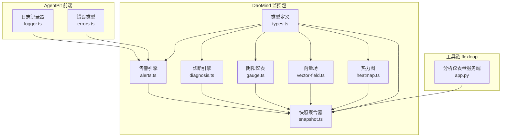

**图表来源**
- [logger.ts:1-412](file://apps/AgentPit/src/utils/logger.ts#L1-L412)
- [errors.ts:1-45](file://apps/AgentPit/src/services/errors.ts#L1-L45)
- [alerts.ts:1-122](file://apps/DaoMind/packages/daoMonitor/src/alerts.ts#L1-L122)
- [diagnosis.ts:1-75](file://apps/DaoMind/packages/daoMonitor/src/diagnosis.ts#L1-L75)
- [snapshot.ts:1-76](file://apps/DaoMind/packages/daoMonitor/src/snapshot.ts#L1-L76)
- [types.ts:1-72](file://apps/DaoMind/packages/daoMonitor/src/types.ts#L1-L72)
- [gauge.ts:1-104](file://apps/DaoMind/packages/daoMonitor/src/gauge.ts#L1-L104)
- [vector-field.ts:1-80](file://apps/DaoMind/packages/daoMonitor/src/vector-field.ts#L1-L80)
- [heatmap.ts:1-100](file://apps/DaoMind/packages/daoMonitor/src/heatmap.ts#L1-L100)
- [app.py:129-222](file://tools/flexloop/src/taolib/testing/analytics/server/app.py#L129-L222)

**章节来源**
- [logger.ts:1-412](file://apps/AgentPit/src/utils/logger.ts#L1-L412)
- [errors.ts:1-45](file://apps/AgentPit/src/services/errors.ts#L1-L45)
- [alerts.ts:1-122](file://apps/DaoMind/packages/daoMonitor/src/alerts.ts#L1-L122)
- [diagnosis.ts:1-75](file://apps/DaoMind/packages/daoMonitor/src/diagnosis.ts#L1-L75)
- [snapshot.ts:1-76](file://apps/DaoMind/packages/daoMonitor/src/snapshot.ts#L1-L76)
- [types.ts:1-72](file://apps/DaoMind/packages/daoMonitor/src/types.ts#L1-L72)
- [gauge.ts:1-104](file://apps/DaoMind/packages/daoMonitor/src/gauge.ts#L1-L104)
- [vector-field.ts:1-80](file://apps/DaoMind/packages/daoMonitor/src/vector-field.ts#L1-L80)
- [heatmap.ts:1-100](file://apps/DaoMind/packages/daoMonitor/src/heatmap.ts#L1-L100)
- [app.py:129-222](file://tools/flexloop/src/taolib/testing/analytics/server/app.py#L129-L222)

## 核心组件
- 日志记录器（AgentPit）：提供结构化日志写入、缓冲、轮转与归档，支持开发环境控制台输出与生产环境文件落盘。
- 错误类型体系（AgentPit）：统一 API/网络/服务端/校验/未授权等错误类型，便于错误分类与上报。
- 监控引擎（DaoMind）：包含告警引擎、诊断引擎、快照聚合器、热力图、向量场、阴阳仪表等，形成系统健康度画像。
- 用户反馈感知（DaoMind）：对性能、错误、行为、需求等信号进行分级评估，辅助告警与运营决策。
- 数据分析仪表（flexloop）：提供事件概览、漏斗分析、用户路径、留存等可视化接口，支撑 UX 分析。

**章节来源**
- [logger.ts:1-412](file://apps/AgentPit/src/utils/logger.ts#L1-L412)
- [errors.ts:1-45](file://apps/AgentPit/src/services/errors.ts#L1-L45)
- [alerts.ts:1-122](file://apps/DaoMind/packages/daoMonitor/src/alerts.ts#L1-L122)
- [diagnosis.ts:1-75](file://apps/DaoMind/packages/daoMonitor/src/diagnosis.ts#L1-L75)
- [snapshot.ts:1-76](file://apps/DaoMind/packages/daoMonitor/src/snapshot.ts#L1-L76)
- [stage1-perceive.test.ts:41-183](file://apps/DaoMind/packages/daoFeedback/src/__tests__/stage1-perceive.test.ts#L41-L183)
- [app.py:129-222](file://tools/flexloop/src/taolib/testing/analytics/server/app.py#L129-L222)

## 架构总览
下图展示从日志与错误到监控引擎与可视化的一体化链路：

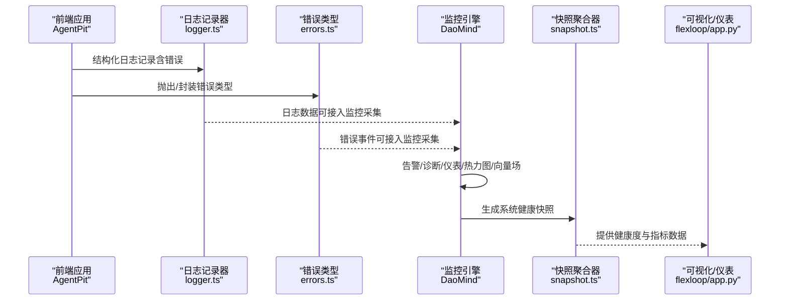

**图表来源**
- [logger.ts:1-412](file://apps/AgentPit/src/utils/logger.ts#L1-L412)
- [errors.ts:1-45](file://apps/AgentPit/src/services/errors.ts#L1-L45)
- [alerts.ts:1-122](file://apps/DaoMind/packages/daoMonitor/src/alerts.ts#L1-L122)
- [diagnosis.ts:1-75](file://apps/DaoMind/packages/daoMonitor/src/diagnosis.ts#L1-L75)
- [snapshot.ts:1-76](file://apps/DaoMind/packages/daoMonitor/src/snapshot.ts#L1-L76)
- [app.py:129-222](file://tools/flexloop/src/taolib/testing/analytics/server/app.py#L129-L222)

## 详细组件分析

### 日志系统（结构化与落盘）
- 结构化日志：统一字段包含时间戳、级别、模块、消息、元数据与错误对象（含堆栈）。
- 缓冲与刷新：按缓冲大小或定时器触发批量写入，避免频繁 IO。
- 文件轮转与归档：按日期生成日志文件，超过阈值进行轮转；定期归档与清理旧文件。
- 开发与生产差异：开发模式直接输出到控制台；生产模式写入文件并支持异步刷新。

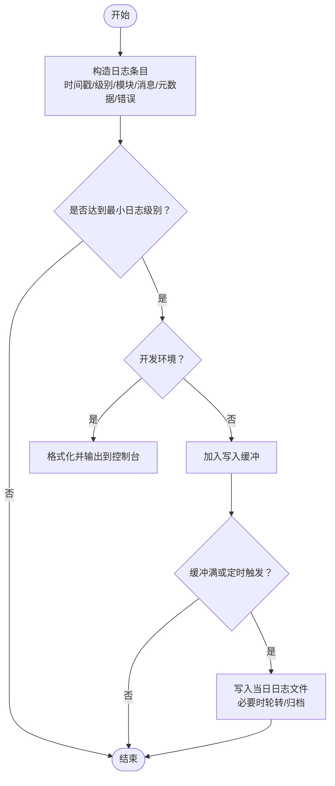

**图表来源**
- [logger.ts:1-412](file://apps/AgentPit/src/utils/logger.ts#L1-L412)

**章节来源**
- [logger.ts:1-412](file://apps/AgentPit/src/utils/logger.ts#L1-L412)

### 错误类型与上报
- 统一错误类型：API 错误、网络错误、服务端错误（带状态码）、参数校验错误、未授权错误。
- 建议上报策略：在前端拦截未处理异常，结合日志记录器输出结构化错误信息，并通过监控引擎上报错误事件，用于计算错误率与告警。

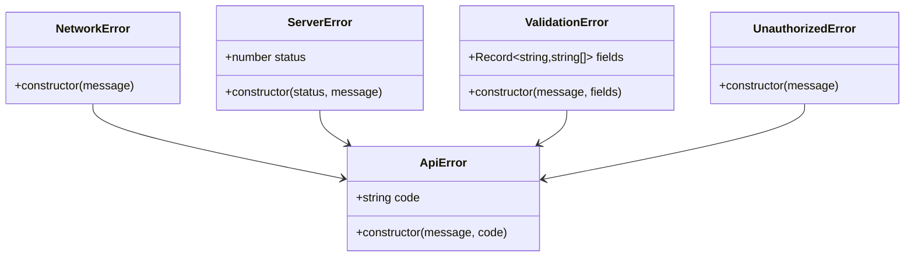

**图表来源**
- [errors.ts:1-45](file://apps/AgentPit/src/services/errors.ts#L1-L45)

**章节来源**
- [errors.ts:1-45](file://apps/AgentPit/src/services/errors.ts#L1-L45)

### 告警引擎（DaoAlertEngine）
- 关键指标：消息速率、延迟（P99）、错误率。
- 规则模板：支持自定义条件函数与严重级别、原因与描述模板。
- 生命周期：检测触发、确认、解决；维护活跃告警集合与最近活动时间。

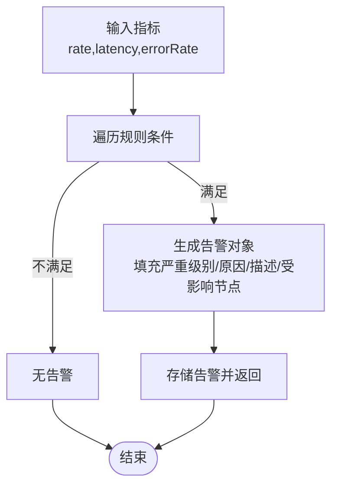

**图表来源**
- [alerts.ts:1-122](file://apps/DaoMind/packages/daoMonitor/src/alerts.ts#L1-L122)

**章节来源**
- [alerts.ts:1-122](file://apps/DaoMind/packages/daoMonitor/src/alerts.ts#L1-L122)
- [test_monitor_system.test.ts:134-212](file://apps/DaoMind/tests/test-monitor-system.test.ts#L134-L212)

### 诊断引擎（DaoDiagnosisEngine）
- 输入：节点入/出速率与历史序列。
- 输出：活动分数、趋势、状态（气虚/气盛/平衡）与建议。
- 适用场景：节点健康度评估与容量规划。

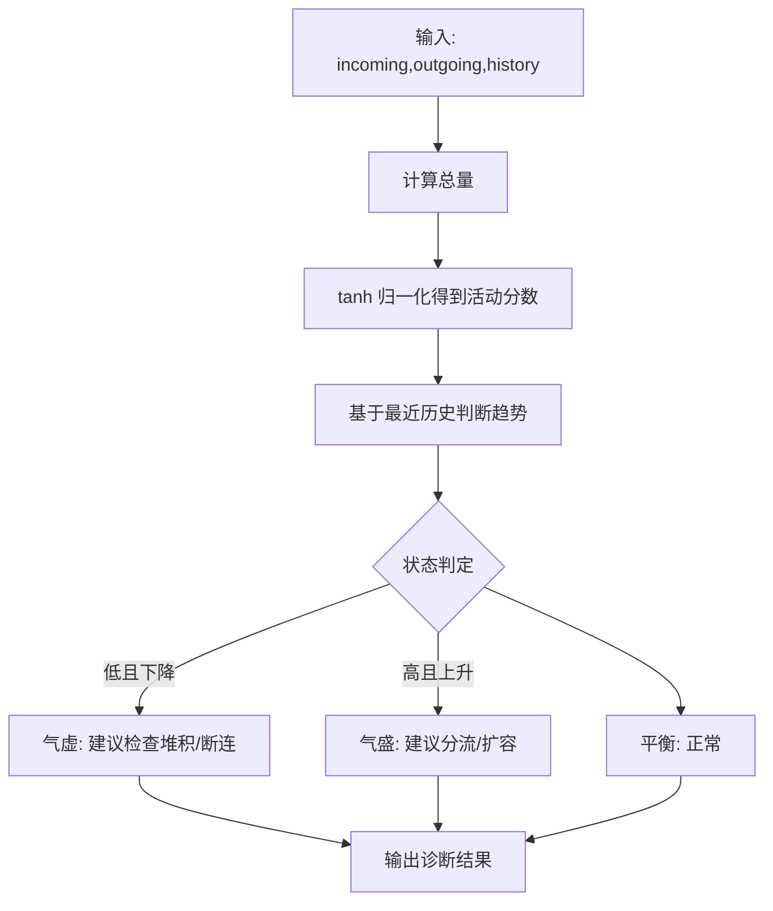

**图表来源**
- [diagnosis.ts:1-75](file://apps/DaoMind/packages/daoMonitor/src/diagnosis.ts#L1-L75)

**章节来源**
- [diagnosis.ts:1-75](file://apps/DaoMind/packages/daoMonitor/src/diagnosis.ts#L1-L75)

### 快照聚合器（DaoSnapshotAggregator）
- 聚合维度：热力图、流向向量、阴阳仪表、活跃告警、诊断结果。
- 健康度计算：综合告警与诊断/仪表状态，扣减权重得到系统健康分。
- 历史保留：固定上限的历史快照，便于回溯与趋势分析。

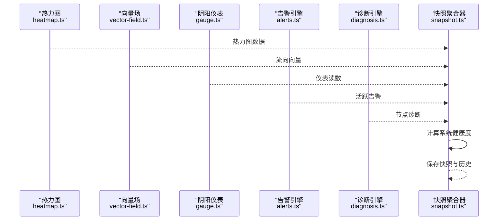

**图表来源**
- [snapshot.ts:1-76](file://apps/DaoMind/packages/daoMonitor/src/snapshot.ts#L1-L76)
- [heatmap.ts:1-100](file://apps/DaoMind/packages/daoMonitor/src/heatmap.ts#L1-L100)
- [vector-field.ts:1-80](file://apps/DaoMind/packages/daoMonitor/src/vector-field.ts#L1-L80)
- [gauge.ts:1-104](file://apps/DaoMind/packages/daoMonitor/src/gauge.ts#L1-L104)
- [alerts.ts:1-122](file://apps/DaoMind/packages/daoMonitor/src/alerts.ts#L1-L122)
- [diagnosis.ts:1-75](file://apps/DaoMind/packages/daoMonitor/src/diagnosis.ts#L1-L75)

**章节来源**
- [snapshot.ts:1-76](file://apps/DaoMind/packages/daoMonitor/src/snapshot.ts#L1-L76)

### 类型与数据模型
- 气通道类型、热力图点、流向向量、阴阳仪表、告警、诊断、监控快照等类型定义，确保各组件间的数据契约一致。

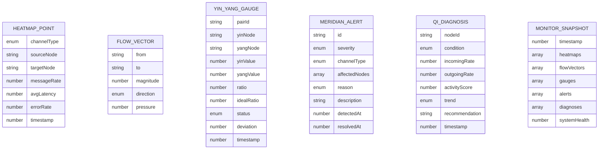

**图表来源**
- [types.ts:1-72](file://apps/DaoMind/packages/daoMonitor/src/types.ts#L1-L72)

**章节来源**
- [types.ts:1-72](file://apps/DaoMind/packages/daoMonitor/src/types.ts#L1-L72)

### 用户反馈感知与信号分级
- 信号类型：性能、错误、资源、行为、需求。
- 评估方法：基于阈值与持续时间/幅度，输出机会/信息/警告/严重等级，辅助告警与运营动作。

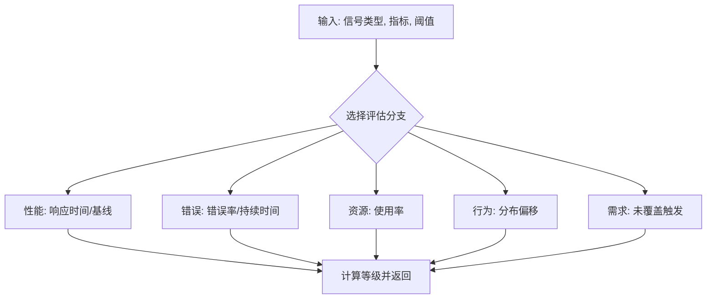

**图表来源**
- [stage1-perceive.test.ts:41-183](file://apps/DaoMind/packages/daoFeedback/src/__tests__/stage1-perceive.test.ts#L41-L183)

**章节来源**
- [stage1-perceive.test.ts:41-183](file://apps/DaoMind/packages/daoFeedback/src/__tests__/stage1-perceive.test.ts#L41-L183)

### 用户行为分析与可视化（flexloop）
- 提供事件概览、会话/用户数、平均时长、跳出率、转化漏斗、功能使用排行、用户路径、留存与事件分布等图表接口。
- 可作为 UX 监控的可视化基础，结合监控快照进行交叉分析。

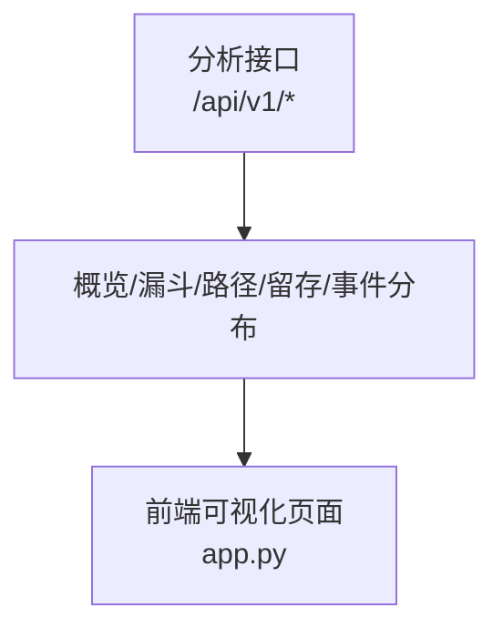

**图表来源**
- [app.py:129-222](file://tools/flexloop/src/taolib/testing/analytics/server/app.py#L129-L222)

**章节来源**
- [app.py:129-222](file://tools/flexloop/src/taolib/testing/analytics/server/app.py#L129-L222)

## 依赖关系分析
- 组件内聚：监控引擎内部通过聚合器统一整合热力图、向量场、仪表、告警与诊断，形成闭环。
- 组件耦合：日志与错误通过统一入口进入监控引擎，便于统一建模与告警。
- 外部集成：前端日志与错误可对接监控引擎；数据分析服务端可消费监控快照与业务指标，形成多维可视化。

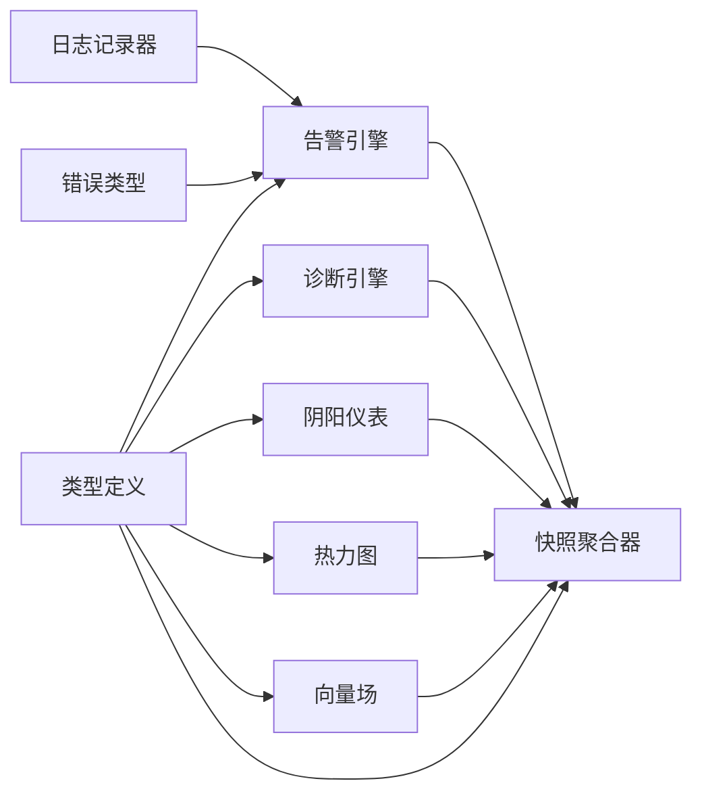

**图表来源**
- [logger.ts:1-412](file://apps/AgentPit/src/utils/logger.ts#L1-L412)
- [errors.ts:1-45](file://apps/AgentPit/src/services/errors.ts#L1-L45)
- [alerts.ts:1-122](file://apps/DaoMind/packages/daoMonitor/src/alerts.ts#L1-L122)
- [diagnosis.ts:1-75](file://apps/DaoMind/packages/daoMonitor/src/diagnosis.ts#L1-L75)
- [snapshot.ts:1-76](file://apps/DaoMind/packages/daoMonitor/src/snapshot.ts#L1-L76)
- [types.ts:1-72](file://apps/DaoMind/packages/daoMonitor/src/types.ts#L1-L72)
- [gauge.ts:1-104](file://apps/DaoMind/packages/daoMonitor/src/gauge.ts#L1-L104)
- [heatmap.ts:1-100](file://apps/DaoMind/packages/daoMonitor/src/heatmap.ts#L1-L100)
- [vector-field.ts:1-80](file://apps/DaoMind/packages/daoMonitor/src/vector-field.ts#L1-L80)

**章节来源**
- [logger.ts:1-412](file://apps/AgentPit/src/utils/logger.ts#L1-L412)
- [errors.ts:1-45](file://apps/AgentPit/src/services/errors.ts#L1-L45)
- [alerts.ts:1-122](file://apps/DaoMind/packages/daoMonitor/src/alerts.ts#L1-L122)
- [diagnosis.ts:1-75](file://apps/DaoMind/packages/daoMonitor/src/diagnosis.ts#L1-L75)
- [snapshot.ts:1-76](file://apps/DaoMind/packages/daoMonitor/src/snapshot.ts#L1-L76)
- [types.ts:1-72](file://apps/DaoMind/packages/daoMonitor/src/types.ts#L1-L72)
- [gauge.ts:1-104](file://apps/DaoMind/packages/daoMonitor/src/gauge.ts#L1-L104)
- [heatmap.ts:1-100](file://apps/DaoMind/packages/daoMonitor/src/heatmap.ts#L1-L100)
- [vector-field.ts:1-80](file://apps/DaoMind/packages/daoMonitor/src/vector-field.ts#L1-L80)

## 性能考量
- 日志写入：采用缓冲与定时刷新，避免高频 IO；生产环境启用异步写入与轮转，降低对业务的影响。
- 监控计算：热力图、向量场与仪表均采用滑动窗口与有限历史，控制内存占用与计算复杂度。
- 健康度评分：按告警与诊断/仪表状态进行扣分，避免过度复杂的权重叠加，保证实时性。
- 前端性能审计：结合 Lighthouse CI 与 Core Web Vitals 基线，确保前端性能达标。

**章节来源**
- [logger.ts:1-412](file://apps/AgentPit/src/utils/logger.ts#L1-L412)
- [heatmap.ts:1-100](file://apps/DaoMind/packages/daoMonitor/src/heatmap.ts#L1-L100)
- [vector-field.ts:1-80](file://apps/DaoMind/packages/daoMonitor/src/vector-field.ts#L1-L80)
- [gauge.ts:1-104](file://apps/DaoMind/packages/daoMonitor/src/gauge.ts#L1-L104)
- [snapshot.ts:1-76](file://apps/DaoMind/packages/daoMonitor/src/snapshot.ts#L1-L76)
- [tasks.md:1-32](file://.trae/specs/agentpit-performance-cd/tasks.md#L1-L32)
- [checklist.md:322-334](file://.trae/specs/agentpit-vue3-rewrite/checklist.md#L322-L334)

## 故障排查指南
- 日志定位：优先查看结构化日志中的错误对象与堆栈，结合模块与时间戳快速定位问题。
- 错误分类：根据错误类型（网络/服务端/校验/未授权）区分问题来源，指导修复优先级。
- 告警核对：确认告警严重级别与原因，结合最近活动时间与受影响节点进行根因分析。
- 诊断参考：查看节点诊断结果与推荐，判断是否存在资源不足或流量异常。
- 快照回溯：对比历史快照的健康度变化，识别异常波动的时间窗口。

**章节来源**
- [logger.ts:1-412](file://apps/AgentPit/src/utils/logger.ts#L1-L412)
- [errors.ts:1-45](file://apps/AgentPit/src/services/errors.ts#L1-L45)
- [alerts.ts:1-122](file://apps/DaoMind/packages/daoMonitor/src/alerts.ts#L1-L122)
- [diagnosis.ts:1-75](file://apps/DaoMind/packages/daoMonitor/src/diagnosis.ts#L1-L75)
- [snapshot.ts:1-76](file://apps/DaoMind/packages/daoMonitor/src/snapshot.ts#L1-L76)

## 结论
DAOApps 的监控告警体系以“前端日志与错误 + DaoMind 监控引擎 + 快照聚合 + 可视化”为核心路径，既覆盖了 APM 的关键指标，也提供了错误与崩溃的可观测性，同时具备用户行为与体验的分析能力。建议在此基础上进一步完善：
- 将前端日志与错误接入监控引擎，统一建模与告警。
- 设计可配置的告警规则与通知渠道，明确响应流程。
- 引入用户行为埋点与 Core Web Vitals 持续监测，完善 UXM。
- 优化日志与指标的采样与压缩策略，保障大规模场景下的性能与成本。

## 附录
- 前端性能与 Core Web Vitals 基线：参考 Lighthouse CI 任务清单与 Vue3 重写检查清单。
- 用户行为分析：利用 flexloop 仪表接口进行漏斗、路径与留存分析。

**章节来源**
- [tasks.md:1-32](file://.trae/specs/agentpit-performance-cd/tasks.md#L1-L32)
- [checklist.md:322-334](file://.trae/specs/agentpit-vue3-rewrite/checklist.md#L322-L334)
- [app.py:129-222](file://tools/flexloop/src/taolib/testing/analytics/server/app.py#L129-L222)