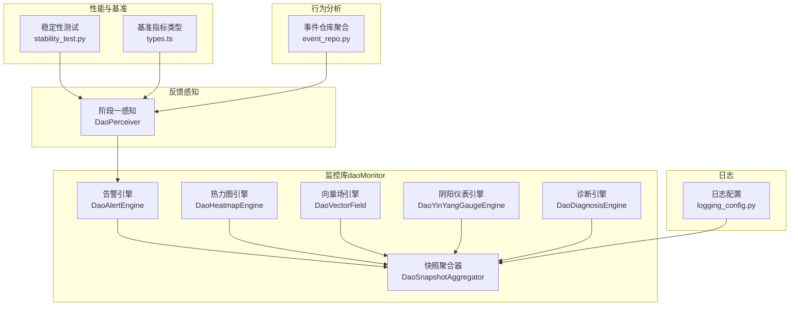
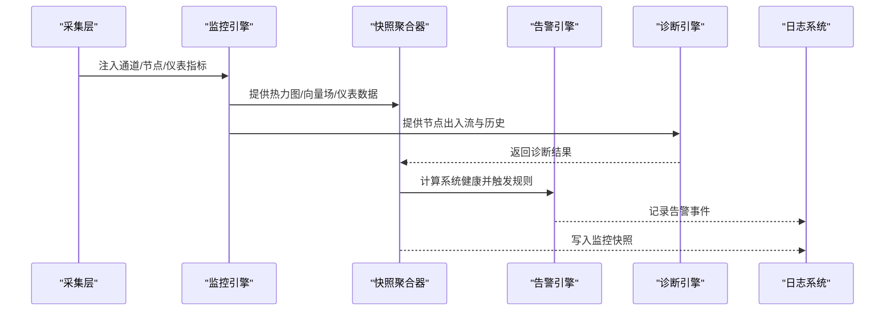
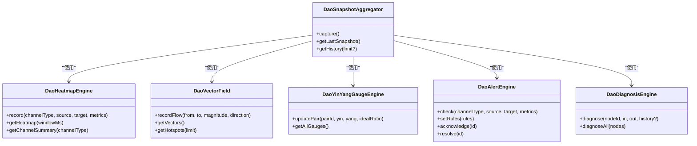
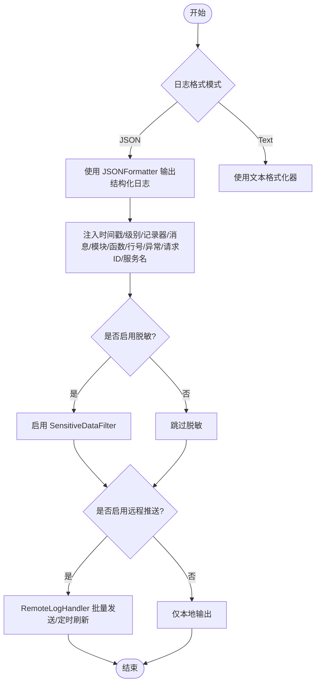
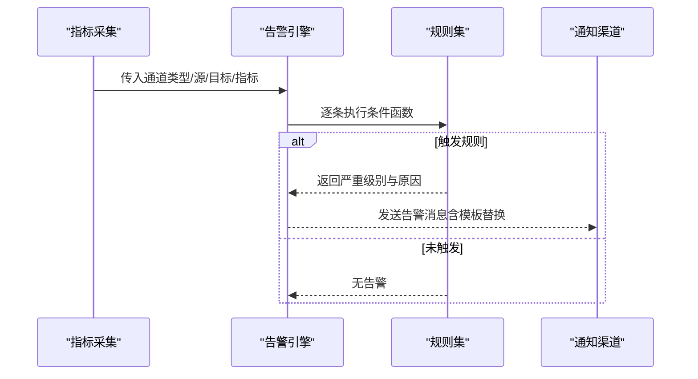
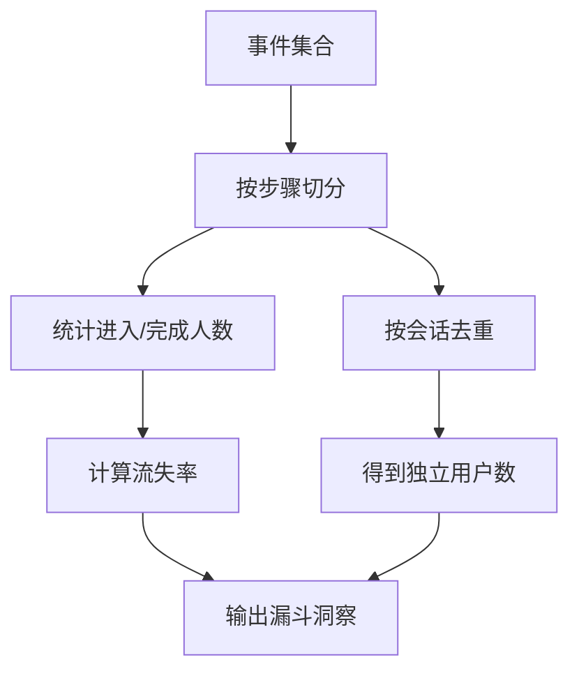
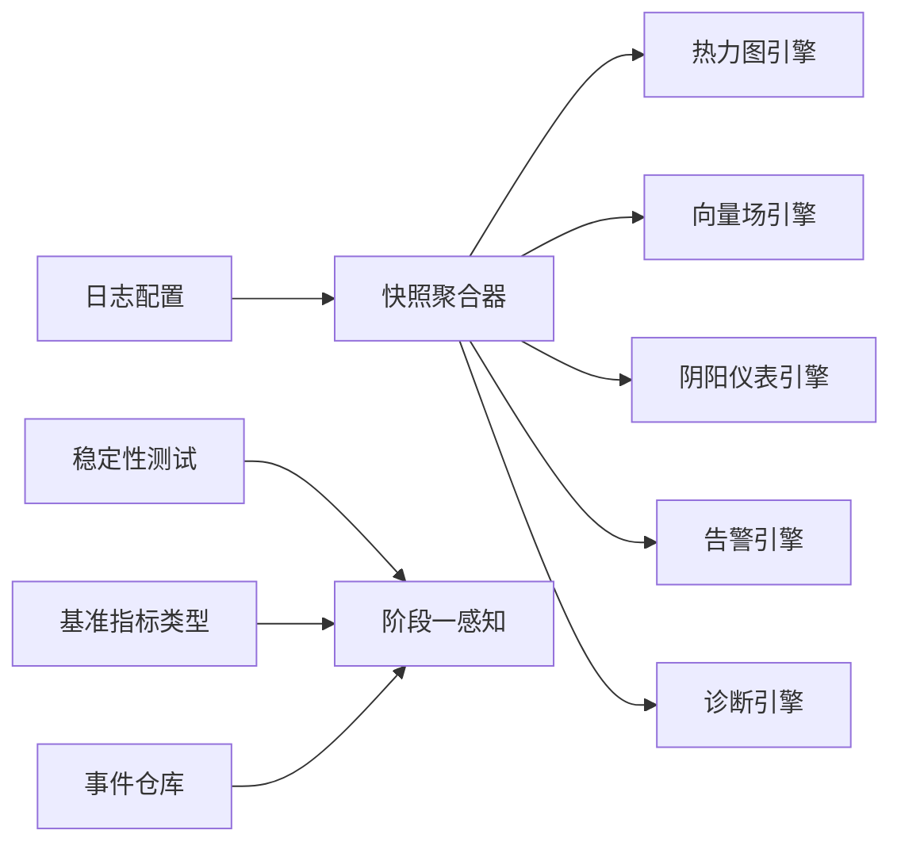

# 监控告警

<cite>
**本文引用的文件**
- [apps/DaoMind/packages/daoMonitor/src/index.ts](file://apps/DaoMind/packages/daoMonitor/src/index.ts)
- [apps/DaoMind/packages/daoMonitor/src/types.ts](file://apps/DaoMind/packages/daoMonitor/src/types.ts)
- [apps/DaoMind/packages/daoMonitor/src/heatmap.ts](file://apps/DaoMind/packages/daoMonitor/src/heatmap.ts)
- [apps/DaoMind/packages/daoMonitor/src/vector-field.ts](file://apps/DaoMind/packages/daoMonitor/src/vector-field.ts)
- [apps/DaoMind/packages/daoMonitor/src/gauge.ts](file://apps/DaoMind/packages/daoMonitor/src/gauge.ts)
- [apps/DaoMind/packages/daoMonitor/src/alerts.ts](file://apps/DaoMind/packages/daoMonitor/src/alerts.ts)
- [apps/DaoMind/packages/daoMonitor/src/diagnosis.ts](file://apps/DaoMind/packages/daoMonitor/src/diagnosis.ts)
- [apps/DaoMind/packages/daoMonitor/src/snapshot.ts](file://apps/DaoMind/packages/daoMonitor/src/snapshot.ts)
- [apps/DaoMind/tests/test-monitor-system.test.ts](file://apps/DaoMind/tests/test-monitor-system.test.ts)
- [apps/DaoMind/packages/daoFeedback/src/stage1-perceive.ts](file://apps/DaoMind/packages/daoFeedback/src/stage1-perceive.ts)
- [tools/flexloop/src/taolib/testing/logging_config.py](file://tools/flexloop/src/taolib/testing/logging_config.py)
- [tools/DeepResearch/tests/performance/stability_test.py](file://tools/DeepResearch/tests/performance/stability_test.py)
- [apps/DaoMind/packages/daoBenchmark/src/types.ts](file://apps/DaoMind/packages/daoBenchmark/src/types.ts)
- [tools/flexloop/src/taolib/testing/analytics/repository/event_repo.py](file://tools/flexloop/src/taolib/testing/analytics/repository/event_repo.py)
</cite>

## 目录
1. [简介](#简介)
2. [项目结构](#项目结构)
3. [核心组件](#核心组件)
4. [架构总览](#架构总览)
5. [详细组件分析](#详细组件分析)
6. [依赖关系分析](#依赖关系分析)
7. [性能考量](#性能考量)
8. [故障排查指南](#故障排查指南)
9. [结论](#结论)
10. [附录](#附录)

## 简介
本文件面向 DAO Collective 项目的监控与告警体系，围绕应用性能监控（APM）、日志聚合与分析、告警规则配置、分布式追踪思路、数据库监控、用户行为与业务指标、健康检查与可用性保障等方面，结合仓库中已有的监控组件与工具，给出可落地的实施方案与最佳实践。

## 项目结构
DAO Collective 的监控与可观测性能力主要分布在以下位置：
- 前端/通用监控库：apps/DaoMind/packages/daoMonitor（热力图、向量场、阴阳仪表、告警引擎、诊断引擎、快照聚合）
- 反馈感知与阈值：apps/DaoMind/packages/daoFeedback（阶段一感知）
- 日志配置与远程推送：tools/flexloop/src/taolib/testing/logging_config.py
- 性能基准与稳定性测试：tools/DeepResearch/tests/performance/stability_test.py
- 基准指标类型定义：apps/DaoMind/packages/daoBenchmark/src/types.ts
- 用户行为分析示例：tools/flexloop/src/taolib/testing/analytics/repository/event_repo.py
- 监控系统集成测试：apps/DaoMind/tests/test-monitor-system.test.ts

图表来源
- [apps/DaoMind/packages/daoMonitor/src/index.ts:1-17](file://apps/DaoMind/packages/daoMonitor/src/index.ts#L1-L17)
- [apps/DaoMind/packages/daoMonitor/src/heatmap.ts:1-100](file://apps/DaoMind/packages/daoMonitor/src/heatmap.ts#L1-L100)
- [apps/DaoMind/packages/daoMonitor/src/vector-field.ts:1-80](file://apps/DaoMind/packages/daoMonitor/src/vector-field.ts#L1-L80)
- [apps/DaoMind/packages/daoMonitor/src/gauge.ts:1-104](file://apps/DaoMind/packages/daoMonitor/src/gauge.ts#L1-L104)
- [apps/DaoMind/packages/daoMonitor/src/alerts.ts:1-122](file://apps/DaoMind/packages/daoMonitor/src/alerts.ts#L1-L122)
- [apps/DaoMind/packages/daoMonitor/src/diagnosis.ts:1-75](file://apps/DaoMind/packages/daoMonitor/src/diagnosis.ts#L1-L75)
- [apps/DaoMind/packages/daoMonitor/src/snapshot.ts:1-76](file://apps/DaoMind/packages/daoMonitor/src/snapshot.ts#L1-L76)
- [apps/DaoMind/packages/daoFeedback/src/stage1-perceive.ts:1-129](file://apps/DaoMind/packages/daoFeedback/src/stage1-perceive.ts#L1-L129)
- [tools/flexloop/src/taolib/testing/logging_config.py:1-540](file://tools/flexloop/src/taolib/testing/logging_config.py#L1-L540)
- [tools/DeepResearch/tests/performance/stability_test.py:154-201](file://tools/DeepResearch/tests/performance/stability_test.py#L154-L201)
- [apps/DaoMind/packages/daoBenchmark/src/types.ts:1-28](file://apps/DaoMind/packages/daoBenchmark/src/types.ts#L1-L28)
- [tools/flexloop/src/taolib/testing/analytics/repository/event_repo.py:327-366](file://tools/flexloop/src/taolib/testing/analytics/repository/event_repo.py#L327-L366)

章节来源
- [apps/DaoMind/packages/daoMonitor/src/index.ts:1-17](file://apps/DaoMind/packages/daoMonitor/src/index.ts#L1-L17)
- [apps/DaoMind/packages/daoMonitor/src/types.ts:1-72](file://apps/DaoMind/packages/daoMonitor/src/types.ts#L1-L72)

## 核心组件
- 热力图引擎（DaoHeatmapEngine）：记录通道（四通道：天、地、人、冲脉）的消息速率、延迟、错误率等，支持窗口期查询与通道汇总统计。
- 向量场引擎（DaoVectorField）：记录节点间流向、压力与总吞吐，识别热点节点。
- 阴阳仪表引擎（DaoYinYangGaugeEngine）：对成对节点进行阴阳平衡度量，判定失衡状态。
- 告警引擎（DaoAlertEngine）：基于规则对速率、延迟、错误率进行判定，生成告警并支持确认/解决。
- 诊断引擎（DaoDiagnosisEngine）：对单节点活动度与趋势进行诊断，给出“气虚/气盛/平衡”判断。
- 快照聚合器（DaoSnapshotAggregator）：整合热力图、向量场、仪表、告警、诊断，计算系统健康分，形成监控快照历史。
- 阶段一感知（DaoPerceiver）：根据阈值评估性能/错误/资源/行为/需求信号等级，产出反馈信号。
- 日志配置（logging_config.py）：统一控制台/文件/远程日志输出，支持 JSON 结构化日志与敏感信息脱敏。
- 性能基准与稳定性测试：提供响应时间、CPU/内存统计与泄漏检测等指标采集模板。
- 用户行为分析：基于事件集合的漏斗转化与会话去重统计。

章节来源
- [apps/DaoMind/packages/daoMonitor/src/heatmap.ts:1-100](file://apps/DaoMind/packages/daoMonitor/src/heatmap.ts#L1-L100)
- [apps/DaoMind/packages/daoMonitor/src/vector-field.ts:1-80](file://apps/DaoMind/packages/daoMonitor/src/vector-field.ts#L1-L80)
- [apps/DaoMind/packages/daoMonitor/src/gauge.ts:1-104](file://apps/DaoMind/packages/daoMonitor/src/gauge.ts#L1-L104)
- [apps/DaoMind/packages/daoMonitor/src/alerts.ts:1-122](file://apps/DaoMind/packages/daoMonitor/src/alerts.ts#L1-L122)
- [apps/DaoMind/packages/daoMonitor/src/diagnosis.ts:1-75](file://apps/DaoMind/packages/daoMonitor/src/diagnosis.ts#L1-L75)
- [apps/DaoMind/packages/daoMonitor/src/snapshot.ts:1-76](file://apps/DaoMind/packages/daoMonitor/src/snapshot.ts#L1-L76)
- [apps/DaoMind/packages/daoFeedback/src/stage1-perceive.ts:1-129](file://apps/DaoMind/packages/daoFeedback/src/stage1-perceive.ts#L1-L129)
- [tools/flexloop/src/taolib/testing/logging_config.py:1-540](file://tools/flexloop/src/taolib/testing/logging_config.py#L1-L540)
- [tools/DeepResearch/tests/performance/stability_test.py:154-201](file://tools/DeepResearch/tests/performance/stability_test.py#L154-L201)
- [apps/DaoMind/packages/daoBenchmark/src/types.ts:1-28](file://apps/DaoMind/packages/daoBenchmark/src/types.ts#L1-L28)
- [tools/flexloop/src/taolib/testing/analytics/repository/event_repo.py:327-366](file://tools/flexloop/src/taolib/testing/analytics/repository/event_repo.py#L327-L366)

## 架构总览
监控系统以“数据采集-规则判定-可视化与存储-诊断与告警-反馈闭环”为主线，形成闭环观测与治理。

图表来源
- [apps/DaoMind/packages/daoMonitor/src/snapshot.ts:22-59](file://apps/DaoMind/packages/daoMonitor/src/snapshot.ts#L22-L59)
- [apps/DaoMind/packages/daoMonitor/src/alerts.ts:66-98](file://apps/DaoMind/packages/daoMonitor/src/alerts.ts#L66-L98)
- [apps/DaoMind/packages/daoMonitor/src/diagnosis.ts:10-55](file://apps/DaoMind/packages/daoMonitor/src/diagnosis.ts#L10-L55)
- [tools/flexloop/src/taolib/testing/logging_config.py:350-486](file://tools/flexloop/src/taolib/testing/logging_config.py#L350-L486)

## 详细组件分析

### 应用性能监控（APM）与关键性能指标（KPI）
- KPI 定义
  - 通道级：消息速率、平均延迟、错误率
  - 节点级：流入/流出速率、活动度、趋势、热点识别
  - 平衡度：阴阳仪表比值与偏差、理想比例
  - 健康度：综合告警与诊断影响下的系统健康分
- 数据采集与处理
  - 通道指标由热力图引擎记录并按窗口期聚合
  - 节点流向由向量场引擎记录，支持热点排序
  - 阴阳仪表引擎对成对节点进行平衡度量
  - 快照聚合器汇总上述指标并计算健康分
- 基准与稳定性
  - 基准指标类型定义用于统一报告结构
  - 稳定性测试提供响应时间、CPU/内存统计与泄漏检测模板

图表来源
- [apps/DaoMind/packages/daoMonitor/src/heatmap.ts:24-98](file://apps/DaoMind/packages/daoMonitor/src/heatmap.ts#L24-L98)
- [apps/DaoMind/packages/daoMonitor/src/vector-field.ts:20-78](file://apps/DaoMind/packages/daoMonitor/src/vector-field.ts#L20-L78)
- [apps/DaoMind/packages/daoMonitor/src/gauge.ts:17-102](file://apps/DaoMind/packages/daoMonitor/src/gauge.ts#L17-L102)
- [apps/DaoMind/packages/daoMonitor/src/alerts.ts:61-121](file://apps/DaoMind/packages/daoMonitor/src/alerts.ts#L61-L121)
- [apps/DaoMind/packages/daoMonitor/src/diagnosis.ts:10-74](file://apps/DaoMind/packages/daoMonitor/src/diagnosis.ts#L10-L74)
- [apps/DaoMind/packages/daoMonitor/src/snapshot.ts:14-75](file://apps/DaoMind/packages/daoMonitor/src/snapshot.ts#L14-L75)

章节来源
- [apps/DaoMind/packages/daoMonitor/src/heatmap.ts:1-100](file://apps/DaoMind/packages/daoMonitor/src/heatmap.ts#L1-L100)
- [apps/DaoMind/packages/daoMonitor/src/vector-field.ts:1-80](file://apps/DaoMind/packages/daoMonitor/src/vector-field.ts#L1-L80)
- [apps/DaoMind/packages/daoMonitor/src/gauge.ts:1-104](file://apps/DaoMind/packages/daoMonitor/src/gauge.ts#L1-L104)
- [apps/DaoMind/packages/daoMonitor/src/snapshot.ts:1-76](file://apps/DaoMind/packages/daoMonitor/src/snapshot.ts#L1-L76)
- [apps/DaoMind/packages/daoBenchmark/src/types.ts:1-28](file://apps/DaoMind/packages/daoBenchmark/src/types.ts#L1-L28)
- [tools/DeepResearch/tests/performance/stability_test.py:154-201](file://tools/DeepResearch/tests/performance/stability_test.py#L154-L201)

### 日志聚合与分析（结构化日志与查询优化）
- 结构化日志
  - JSONFormatter 输出每行一条 JSON，包含时间戳、级别、记录器、消息、模块、函数、行号、异常、请求 ID 等字段，便于 ELK/Loki 等系统解析
  - 支持服务名注入与环境变量 LOG_FORMAT 控制输出格式
- 敏感信息脱敏
  - SensitiveDataFilter 支持密码、JWT 密钥、API Key、邮箱、手机号、IP 等多类敏感数据的脱敏策略
- 远程日志推送
  - RemoteLogHandler 支持批量发送、定时刷新、优雅降级与缓冲区保护，避免远程不可用影响应用
- 查询优化建议
  - 在日志中固定注入 service、module、function、request_id 等维度字段
  - 使用 JSON 结构化日志，配合索引字段提升查询效率
  - 对高频错误与异常单独建立索引，缩短检索路径

图表来源
- [tools/flexloop/src/taolib/testing/logging_config.py:21-54](file://tools/flexloop/src/taolib/testing/logging_config.py#L21-L54)
- [tools/flexloop/src/taolib/testing/logging_config.py:256-336](file://tools/flexloop/src/taolib/testing/logging_config.py#L256-L336)
- [tools/flexloop/src/taolib/testing/logging_config.py:350-486](file://tools/flexloop/src/taolib/testing/logging_config.py#L350-L486)

章节来源
- [tools/flexloop/src/taolib/testing/logging_config.py:1-540](file://tools/flexloop/src/taolib/testing/logging_config.py#L1-L540)

### 告警规则配置（阈值、级别与通知）
- 规则构成
  - 条件函数：基于速率、延迟、错误率判定
  - 严重级别：warning/critical/info
  - 原因标签：拥塞、断连、延迟尖峰、错误激增
  - 消息模板：支持占位符替换（速率、延迟、错误率、源/目标节点）
- 默认规则
  - 速率阈值：严重>5000，预警>1000
  - 延迟阈值：严重>10000ms，预警>5000ms
  - 错误率阈值：严重>20%，预警>5%
  - 断连规则：连续无消息触发
- 动态配置
  - 支持 setRules 替换默认规则集
  - 支持 ack/resolve 对告警进行确认与解决
- 通知渠道
  - 建议在告警产生后，通过 RemoteLogHandler 或外部告警平台推送（如钉钉、企业微信、Slack 等）

图表来源
- [apps/DaoMind/packages/daoMonitor/src/alerts.ts:3-57](file://apps/DaoMind/packages/daoMonitor/src/alerts.ts#L3-L57)
- [apps/DaoMind/packages/daoMonitor/src/alerts.ts:66-98](file://apps/DaoMind/packages/daoMonitor/src/alerts.ts#L66-L98)
- [apps/DaoMind/tests/test-monitor-system.test.ts:133-174](file://apps/DaoMind/tests/test-monitor-system.test.ts#L133-L174)

章节来源
- [apps/DaoMind/packages/daoMonitor/src/alerts.ts:1-122](file://apps/DaoMind/packages/daoMonitor/src/alerts.ts#L1-L122)
- [apps/DaoMind/tests/test-monitor-system.test.ts:133-174](file://apps/DaoMind/tests/test-monitor-system.test.ts#L133-L174)

### 分布式追踪与性能瓶颈分析
- 追踪思路
  - 以通道（QiChannelType）与节点（source/target）为追踪单元，结合向量场的方向与压力，定位瓶颈链路
  - 结合热力图的速率与延迟，识别高负载与高延迟区域
  - 通过诊断引擎对节点活动度与趋势进行诊断，辅助判断是否为资源不足或流量洪峰
- 实践建议
  - 在请求链路中注入 traceId/request_id，与日志结构化字段关联
  - 将关键节点的出入流与仪表读数纳入快照，形成跨组件的全局视图
  - 对热点节点与异常通道建立告警联动，快速定位根因

章节来源
- [apps/DaoMind/packages/daoMonitor/src/vector-field.ts:20-78](file://apps/DaoMind/packages/daoMonitor/src/vector-field.ts#L20-L78)
- [apps/DaoMind/packages/daoMonitor/src/heatmap.ts:24-98](file://apps/DaoMind/packages/daoMonitor/src/heatmap.ts#L24-L98)
- [apps/DaoMind/packages/daoMonitor/src/diagnosis.ts:10-74](file://apps/DaoMind/packages/daoMonitor/src/diagnosis.ts#L10-L74)

### 数据库监控（连接池、查询性能、索引使用）
- 连接池监控
  - 建议在数据库访问层埋点，记录连接获取/释放、等待时间、活跃连接数、空闲连接数
  - 与告警引擎联动：当等待时间/活跃率超过阈值时触发告警
- 查询性能监控
  - 记录慢查询数量、P95/P99 响应时间、错误率
  - 与稳定性测试模板结合，定期评估 CPU/内存占用与泄漏风险
- 索引使用情况
  - 通过 EXPLAIN/ANALYZE 分析查询计划，识别全表扫描与缺失索引
  - 建立索引变更审计与回归测试流程

章节来源
- [tools/DeepResearch/tests/performance/stability_test.py:154-201](file://tools/DeepResearch/tests/performance/stability_test.py#L154-L201)

### 用户行为分析与业务指标监控
- 行为分析
  - 基于事件集合的漏斗转化：统计各步骤进入/完成人数与流失率
  - 会话去重：通过 session_id 去重计算独立用户
- 业务指标
  - 基于阶段一感知（DaoPerceiver）的阈值评估，将用户行为变化转化为信号等级
  - 与告警联动：当分布偏移/未覆盖触发器超过阈值时触发业务告警

图表来源
- [tools/flexloop/src/taolib/testing/analytics/repository/event_repo.py:327-366](file://tools/flexloop/src/taolib/testing/analytics/repository/event_repo.py#L327-L366)

章节来源
- [apps/DaoMind/packages/daoFeedback/src/stage1-perceive.ts:55-108](file://apps/DaoMind/packages/daoFeedback/src/stage1-perceive.ts#L55-L108)
- [tools/flexloop/src/taolib/testing/analytics/repository/event_repo.py:327-366](file://tools/flexloop/src/taolib/testing/analytics/repository/event_repo.py#L327-L366)

### 健康检查接口、可用性监控与自动恢复
- 健康检查
  - 通过快照聚合器的系统健康分作为健康状态指标
  - 建议暴露 /health 接口，返回健康分、活跃告警数、诊断异常节点数
- 可用性监控
  - 告警引擎与诊断引擎协同：critical 级告警触发紧急预案
  - 日志系统记录健康状态与告警事件，便于回溯
- 自动恢复
  - 建议与运维自动化结合：当健康分持续低于阈值时，触发扩缩容/重启/切换等动作
  - 告警解决（resolve）后，健康分逐步回升，形成闭环

章节来源
- [apps/DaoMind/packages/daoMonitor/src/snapshot.ts:31-42](file://apps/DaoMind/packages/daoMonitor/src/snapshot.ts#L31-L42)
- [apps/DaoMind/packages/daoMonitor/src/alerts.ts:104-116](file://apps/DaoMind/packages/daoMonitor/src/alerts.ts#L104-L116)
- [tools/flexloop/src/taolib/testing/logging_config.py:350-486](file://tools/flexloop/src/taolib/testing/logging_config.py#L350-L486)

## 依赖关系分析
- 组件内聚与耦合
  - 快照聚合器集中协调多个子引擎，降低上层耦合
  - 告警引擎与诊断引擎独立，便于扩展规则与策略
- 外部依赖
  - 日志系统依赖 HTTP 客户端库进行远程推送
  - 基准与稳定性测试提供指标采集模板，便于统一上报

图表来源
- [apps/DaoMind/packages/daoMonitor/src/snapshot.ts:14-20](file://apps/DaoMind/packages/daoMonitor/src/snapshot.ts#L14-L20)
- [tools/flexloop/src/taolib/testing/logging_config.py:256-336](file://tools/flexloop/src/taolib/testing/logging_config.py#L256-L336)
- [tools/DeepResearch/tests/performance/stability_test.py:154-201](file://tools/DeepResearch/tests/performance/stability_test.py#L154-L201)
- [apps/DaoMind/packages/daoBenchmark/src/types.ts:1-28](file://apps/DaoMind/packages/daoBenchmark/src/types.ts#L1-L28)
- [tools/flexloop/src/taolib/testing/analytics/repository/event_repo.py:327-366](file://tools/flexloop/src/taolib/testing/analytics/repository/event_repo.py#L327-L366)

## 性能考量
- 缓冲与窗口
  - 热力图采用环形缓冲，容量可配置，避免内存膨胀
  - 向量场与仪表维护有限历史，控制空间复杂度
- 计算复杂度
  - 快照聚合在 O(N) 级别内完成，适合高频采集场景
- 日志性能
  - RemoteLogHandler 异步批量发送，避免阻塞主线程
  - 缓冲区上限与降级策略保证系统稳定性

章节来源
- [apps/DaoMind/packages/daoMonitor/src/heatmap.ts:3-42](file://apps/DaoMind/packages/daoMonitor/src/heatmap.ts#L3-L42)
- [apps/DaoMind/packages/daoMonitor/src/gauge.ts:3-39](file://apps/DaoMind/packages/daoMonitor/src/gauge.ts#L3-L39)
- [tools/flexloop/src/taolib/testing/logging_config.py:350-486](file://tools/flexloop/src/taolib/testing/logging_config.py#L350-L486)

## 故障排查指南
- 告警排查
  - 使用 getActiveAlerts 获取当前活跃告警，核对严重级别与原因
  - 通过 setRules 自定义规则，验证阈值是否合理
  - 对断连类告警，检查 lastActivity 与通道活跃度
- 日志排查
  - 确认日志格式模式（JSON/Text），必要时开启脱敏与远程推送
  - 检查 RemoteLogHandler 的缓冲区大小与刷新间隔，避免丢失
- 行为分析
  - 核对事件仓库的漏斗统计逻辑，确保会话去重与步骤切分正确
- 基准与稳定性
  - 对照稳定性测试的统计项（成功率、响应时间、CPU/内存），定位异常波动

章节来源
- [apps/DaoMind/packages/daoMonitor/src/alerts.ts:100-121](file://apps/DaoMind/packages/daoMonitor/src/alerts.ts#L100-L121)
- [apps/DaoMind/packages/daoMonitor/src/snapshot.ts:61-68](file://apps/DaoMind/packages/daoMonitor/src/snapshot.ts#L61-L68)
- [tools/flexloop/src/taolib/testing/logging_config.py:350-537](file://tools/flexloop/src/taolib/testing/logging_config.py#L350-L537)
- [tools/flexloop/src/taolib/testing/analytics/repository/event_repo.py:327-366](file://tools/flexloop/src/taolib/testing/analytics/repository/event_repo.py#L327-L366)
- [tools/DeepResearch/tests/performance/stability_test.py:154-201](file://tools/DeepResearch/tests/performance/stability_test.py#L154-L201)

## 结论
DAO Collective 的监控体系以“通道-节点-仪表-告警-诊断-快照”为核心，结合结构化日志与行为分析，形成从指标采集到告警处置再到健康治理的闭环。通过可配置的规则与阈值、异步日志推送与远程聚合，能够满足生产环境的可观测性与可运维性需求。建议在此基础上进一步完善数据库监控、分布式追踪与自动恢复机制，持续提升系统稳定性与可维护性。

## 附录
- 关键类型与职责
  - 通道类型：tian/di/ren/chong 四通道
  - 告警原因：congestion/disconnection/latency_spike/error_surge
  - 诊断状态：deficient/excess/balanced
  - 仪表状态：balanced/yin_excess/yang_excess/critical

章节来源
- [apps/DaoMind/packages/daoMonitor/src/types.ts:1-72](file://apps/DaoMind/packages/daoMonitor/src/types.ts#L1-L72)