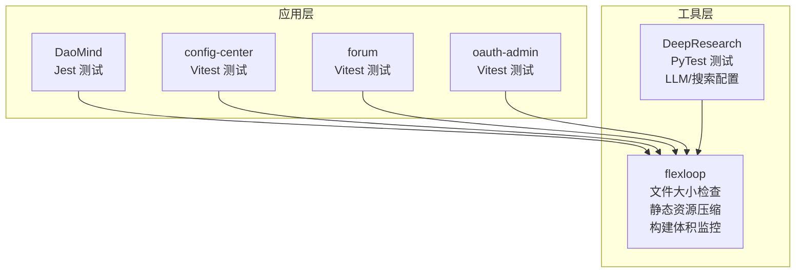
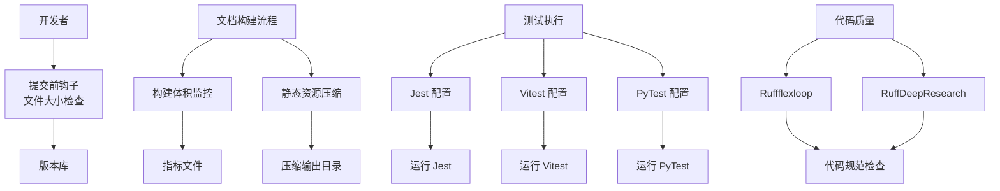
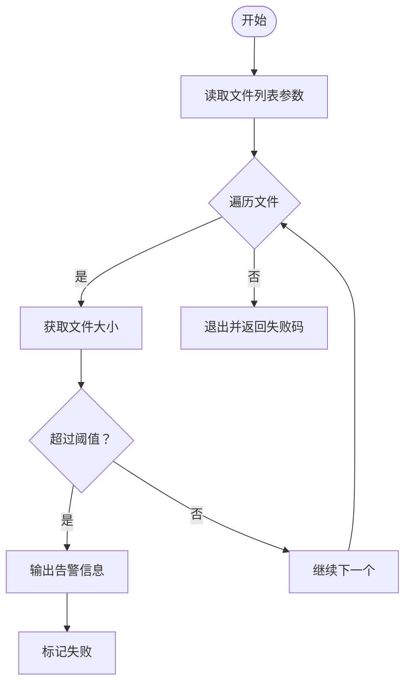
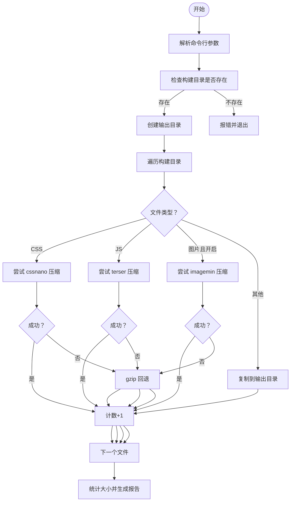
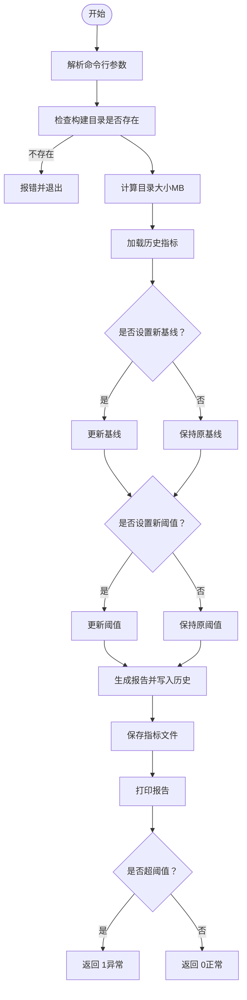
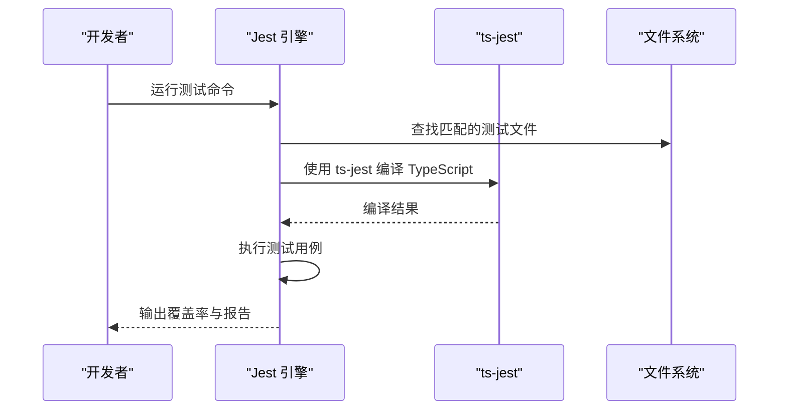
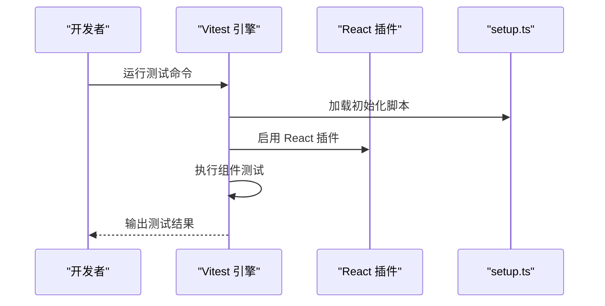
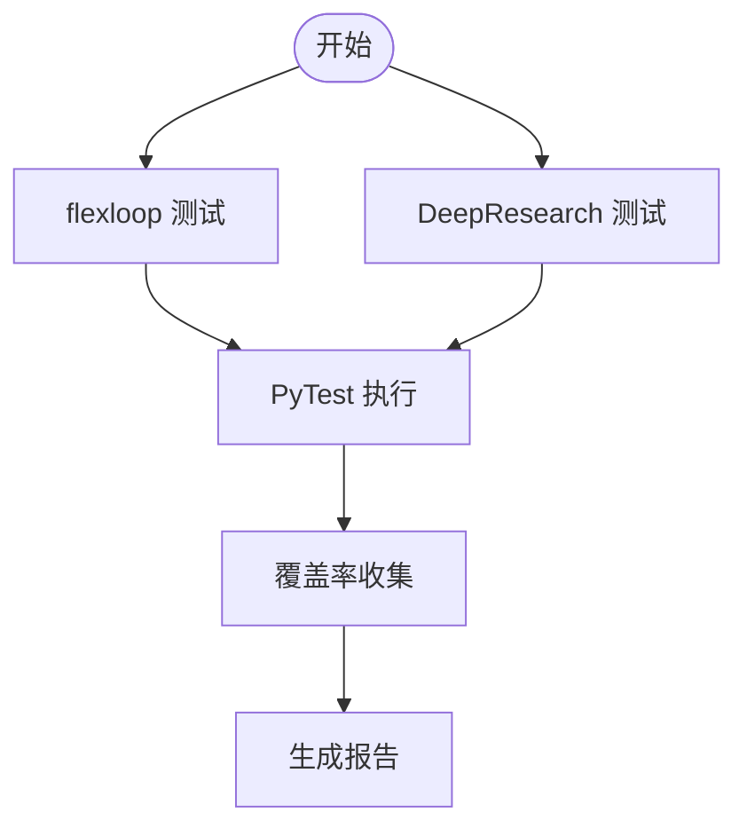
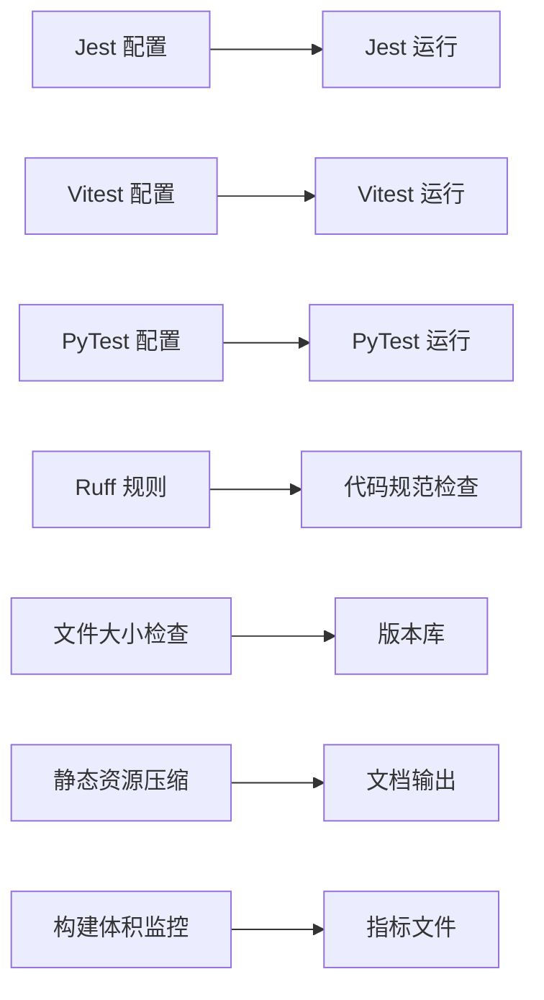

# 运维工具

<cite>
**本文引用的文件**
- [check_file_size.py](file://tools/flexloop/scripts/check_file_size.py)
- [compress_static.py](file://tools/flexloop/doc/scripts/compress_static.py)
- [monitor_build_size.py](file://tools/flexloop/doc/scripts/monitor_build_size.py)
- [jest.config.js](file://apps/DaoMind/jest.config.js)
- [vitest.config.ts](file://apps/config-center/vitest.config.ts)
- [pytest.ini](file://tools/flexloop/pytest.ini)
- [pyproject.toml（DeepResearch）](file://tools/DeepResearch/pyproject.toml)
- [pyproject.toml（flexloop）](file://tools/flexloop/pyproject.toml)
- [llms.toml](file://tools/DeepResearch/config/llms.toml)
- [search.toml](file://tools/DeepResearch/config/search.toml)
</cite>

## 目录
1. [简介](#简介)
2. [项目结构](#项目结构)
3. [核心组件](#核心组件)
4. [架构总览](#架构总览)
5. [详细组件分析](#详细组件分析)
6. [依赖关系分析](#依赖关系分析)
7. [性能考虑](#性能考虑)
8. [故障排查指南](#故障排查指南)
9. [结论](#结论)
10. [附录](#附录)

## 简介
本文件面向 DAO Collective 项目的运维与开发团队，系统化梳理并说明以下运维工具与自动化脚本的使用方法与最佳实践：
- 文件大小检查与静态资源压缩、构建体积监控脚本
- 测试工具配置与运行方式（Jest、Vitest、PyTest）
- 数据库迁移与备份恢复思路（基于现有配置与模块能力）
- 性能分析与代码质量检查工具的使用建议
- 开发与生产环境切换的工具与策略
- 日志清理、缓存清理与临时文件管理
- 运维命令行工具与批量操作脚本的使用示例

## 项目结构
DAO Collective 仓库采用多应用与多工具并存的组织方式：
- 应用层：多个前端应用（如 DaoMind、config-center、forum 等），各自拥有独立的构建与测试配置
- 工具层：flexloop 提供文档构建与体积监控脚本；DeepResearch 提供研究框架与测试配置
- 配置层：各工具与应用通过 pyproject.toml、jest.config.js、vitest.config.ts 等集中管理依赖与测试行为

## 核心组件
本节对运维工具的核心组件进行分门别类的说明，并给出使用入口与关键参数。

- 文件大小检查脚本
  - 功能：在提交前检查文件大小，超过阈值则拒绝提交
  - 典型用途：防止大文件进入版本控制
  - 使用入口：[check_file_size.py:1-27](file://tools/flexloop/scripts/check_file_size.py#L1-L27)

- 静态资源压缩脚本
  - 功能：压缩 CSS、JS、图片等静态资源，支持回退到 gzip
  - 输出：生成压缩后的目录并统计压缩率
  - 使用入口：[compress_static.py:1-191](file://tools/flexloop/doc/scripts/compress_static.py#L1-L191)

- 构建体积监控脚本
  - 功能：监控构建输出目录大小，支持设置基线与阈值，生成历史趋势
  - 输出：报告当前大小、差异、阈值状态与历史记录
  - 使用入口：[monitor_build_size.py:1-153](file://tools/flexloop/doc/scripts/monitor_build_size.py#L1-L153)

- 测试工具配置
  - Jest（TypeScript 单元/集成测试）：[jest.config.js:1-59](file://apps/DaoMind/jest.config.js#L1-L59)
  - Vitest（React 组件测试）：[vitest.config.ts:1-18](file://apps/config-center/vitest.config.ts#L1-L18)
  - PyTest（Python 测试）：[pytest.ini:1-10](file://tools/flexloop/pytest.ini#L1-L10)，[pyproject.toml（flexloop）:297-318](file://tools/flexloop/pyproject.toml#L297-L318)，[pyproject.toml（DeepResearch）:68-71](file://tools/DeepResearch/pyproject.toml#L68-L71)

- 代码质量与格式化
  - Ruff（Python）：[pyproject.toml（flexloop）:245-296](file://tools/flexloop/pyproject.toml#L245-L296)，[pyproject.toml（DeepResearch）:54-78](file://tools/DeepResearch/pyproject.toml#L54-L78)

- LLM/搜索配置（用于研究与文档生成）
  - LLM 配置：[llms.toml:1-29](file://tools/DeepResearch/config/llms.toml#L1-L29)
  - 搜索引擎配置：[search.toml:1-6](file://tools/DeepResearch/config/search.toml#L1-L6)

**章节来源**
- [check_file_size.py:1-27](file://tools/flexloop/scripts/check_file_size.py#L1-L27)
- [compress_static.py:1-191](file://tools/flexloop/doc/scripts/compress_static.py#L1-L191)
- [monitor_build_size.py:1-153](file://tools/flexloop/doc/scripts/monitor_build_size.py#L1-L153)
- [jest.config.js:1-59](file://apps/DaoMind/jest.config.js#L1-L59)
- [vitest.config.ts:1-18](file://apps/config-center/vitest.config.ts#L1-L18)
- [pytest.ini:1-10](file://tools/flexloop/pytest.ini#L1-L10)
- [pyproject.toml（flexloop）:297-318](file://tools/flexloop/pyproject.toml#L297-L318)
- [pyproject.toml（DeepResearch）:54-78](file://tools/DeepResearch/pyproject.toml#L54-L78)
- [llms.toml:1-29](file://tools/DeepResearch/config/llms.toml#L1-L29)
- [search.toml:1-6](file://tools/DeepResearch/config/search.toml#L1-L6)

## 架构总览
下图展示运维工具在整体项目中的位置与交互关系：

**图表来源**
- [check_file_size.py:1-27](file://tools/flexloop/scripts/check_file_size.py#L1-L27)
- [monitor_build_size.py:1-153](file://tools/flexloop/doc/scripts/monitor_build_size.py#L1-L153)
- [compress_static.py:1-191](file://tools/flexloop/doc/scripts/compress_static.py#L1-L191)
- [jest.config.js:1-59](file://apps/DaoMind/jest.config.js#L1-L59)
- [vitest.config.ts:1-18](file://apps/config-center/vitest.config.ts#L1-L18)
- [pytest.ini:1-10](file://tools/flexloop/pytest.ini#L1-L10)
- [pyproject.toml（flexloop）:245-318](file://tools/flexloop/pyproject.toml#L245-L318)
- [pyproject.toml（DeepResearch）:54-78](file://tools/DeepResearch/pyproject.toml#L54-L78)

## 详细组件分析

### 文件大小检查脚本
- 功能要点
  - 遍历传入文件列表，检查每个文件大小
  - 超过阈值（默认 10MB）时输出告警并返回失败码
  - 对无法读取的文件也视为失败
- 使用场景
  - 作为 pre-commit 钩子，阻止大文件进入仓库
  - 在 CI 中作为质量门禁步骤
- 关键参数
  - 输入：待检查的文件路径列表（由钩子或脚本调用传入）
  - 行为：逐个检查并累计失败标志
- 注意事项
  - 若需要调整阈值，请在脚本中修改常量
  - 确保脚本具备执行权限

**图表来源**
- [check_file_size.py:7-22](file://tools/flexloop/scripts/check_file_size.py#L7-L22)

**章节来源**
- [check_file_size.py:1-27](file://tools/flexloop/scripts/check_file_size.py#L1-L27)

### 静态资源压缩脚本
- 功能要点
  - 支持 CSS、JS、图片压缩；CSS 使用 cssnano，JS 使用 terser，图片使用 imagemin
  - 不支持的文件回退到 gzip 压缩
  - 递归扫描构建目录，按原路径结构输出到目标目录
  - 统计原始大小、压缩后大小与压缩率
- 使用场景
  - 文档构建后进行静态资源优化
  - CI 中自动压缩并生成报告
- 关键参数
  - --build-dir：构建输出目录（默认 doc/_build/html）
  - --output-dir：压缩输出目录（默认 doc/_build/html_compressed）
  - --compress-images：是否压缩图片
- 输出
  - 成功压缩数量、原始大小、压缩后大小、压缩率
  - 失败时打印错误信息并继续处理其他文件

**图表来源**
- [compress_static.py:89-187](file://tools/flexloop/doc/scripts/compress_static.py#L89-L187)

**章节来源**
- [compress_static.py:1-191](file://tools/flexloop/doc/scripts/compress_static.py#L1-L191)

### 构建体积监控脚本
- 功能要点
  - 计算构建目录总大小（MB）
  - 与历史基线对比，根据阈值判断是否触发告警
  - 将每次报告写入指标文件，保留最近 100 条记录
  - 支持设置新基线与阈值
- 使用场景
  - CI 中作为体积回归检测
  - 定期生成体积趋势报告
- 关键参数
  - --build-dir：构建输出目录（默认 doc/_build/html）
  - --metrics-file：指标数据文件（默认 doc/scripts/build_metrics.json）
  - --set-baseline：将当前大小设为新基线
  - --threshold：设置新的告警阈值（MB）
- 输出
  - 当前大小、基线、差异、阈值
  - 是否触发告警（返回码 1 表示异常）

**图表来源**
- [monitor_build_size.py:80-149](file://tools/flexloop/doc/scripts/monitor_build_size.py#L80-L149)

**章节来源**
- [monitor_build_size.py:1-153](file://tools/flexloop/doc/scripts/monitor_build_size.py#L1-L153)

### 测试工具配置与使用

#### Jest（DaoMind）
- 覆盖范围与报告
  - 收集覆盖率并输出文本、lcov、html 报告
  - 全局覆盖率阈值：分支、函数、行、语句均不低于 80%
- 匹配规则
  - 支持 packages/**/src/**/*.ts 与根目录下的 test/spec 文件
- 运行环境
  - Node 环境，TypeScript 编译器启用 ESM
- 并行与超时
  - 最大工作进程为 50%，单测超时 30 秒

**图表来源**
- [jest.config.js:18-59](file://apps/DaoMind/jest.config.js#L18-L59)

**章节来源**
- [jest.config.js:1-59](file://apps/DaoMind/jest.config.js#L1-L59)

#### Vitest（config-center）
- 环境与插件
  - jsdom 环境，React 插件，全局测试启用
- 路径别名
  - @ 指向 src 目录
- 初始化
  - 自动加载 setupFiles 中的初始化脚本

**图表来源**
- [vitest.config.ts:5-17](file://apps/config-center/vitest.config.ts#L5-L17)

**章节来源**
- [vitest.config.ts:1-18](file://apps/config-center/vitest.config.ts#L1-L18)

#### PyTest（flexloop 与 DeepResearch）
- flexloop
  - 测试路径：tests
  - Python 文件/类/函数命名规则：test_*.py、Test*、test_*
  - asyncio 模式：auto
  - 覆盖率：pytest-cov、coverage
- DeepResearch
  - 测试路径：tests
  - 依赖：pytest、pytest-cov、coverage
  - 代码质量：Ruff 规则与格式化

**图表来源**
- [pytest.ini:1-10](file://tools/flexloop/pytest.ini#L1-L10)
- [pyproject.toml（flexloop）:297-318](file://tools/flexloop/pyproject.toml#L297-L318)
- [pyproject.toml（DeepResearch）:48-52](file://tools/DeepResearch/pyproject.toml#L48-L52)

**章节来源**
- [pytest.ini:1-10](file://tools/flexloop/pytest.ini#L1-L10)
- [pyproject.toml（flexloop）:297-318](file://tools/flexloop/pyproject.toml#L297-L318)
- [pyproject.toml（DeepResearch）:48-52](file://tools/DeepResearch/pyproject.toml#L48-L52)

### 代码质量与格式化
- Ruff（Python）
  - flexloop：统一的 lint 与格式化规则，忽略部分规则以适配项目风格
  - DeepResearch：lint 选择与忽略规则，格式化双引号
- 使用建议
  - 在本地与 CI 中统一执行 ruff lint/format
  - 结合 PyTest 覆盖率，确保质量门禁

**章节来源**
- [pyproject.toml（flexloop）:245-296](file://tools/flexloop/pyproject.toml#L245-L296)
- [pyproject.toml（DeepResearch）:54-78](file://tools/DeepResearch/pyproject.toml#L54-L78)

### 数据库迁移与备份恢复（基于现有配置）
- 现状说明
  - 项目中未发现通用的数据库迁移脚本或备份恢复脚本
  - 部分模块（如 data-sync、file-storage、oauth 等）依赖 MongoDB 与 Redis，但未提供迁移/备份工具
- 建议方案
  - 使用 MongoDB 自带工具进行备份与恢复（mongodump/mongorestore）
  - Redis 使用 BGSAVE/AOF/RDB 策略配合持久化
  - 在 CI 中增加备份任务与校验流程
- 与现有配置的关系
  - 模块依赖在 pyproject.toml 中声明，便于在不同环境安装对应组件

**章节来源**
- [pyproject.toml（flexloop）:82-235](file://tools/flexloop/pyproject.toml#L82-L235)

### 性能分析工具与建议
- 前端性能
  - 使用 Vite 构建产物进行体积分析（结合构建体积监控脚本）
  - 对静态资源使用压缩脚本，减少传输体积
- Python 性能
  - 使用 pytest-performance 或自定义基准测试脚本
  - 在 CI 中引入并发稳定性测试（参考现有 tests/performance）
- 建议
  - 将性能测试纳入 CI，设置阈值告警

**章节来源**
- [monitor_build_size.py:1-153](file://tools/flexloop/doc/scripts/monitor_build_size.py#L1-L153)
- [compress_static.py:1-191](file://tools/flexloop/doc/scripts/compress_static.py#L1-L191)

### 开发与生产环境切换工具
- 现状说明
  - 项目未提供专门的环境切换 CLI 工具
  - 建议通过环境变量与配置文件实现环境隔离
- 实施建议
  - 使用 dotenv 或环境变量区分开发/生产配置
  - 在 CI 中通过矩阵作业分别运行测试与构建
  - 对于文档与静态资源，使用构建体积监控与压缩脚本保障生产质量

**章节来源**
- [monitor_build_size.py:80-149](file://tools/flexloop/doc/scripts/monitor_build_size.py#L80-L149)
- [compress_static.py:89-187](file://tools/flexloop/doc/scripts/compress_static.py#L89-L187)

### 日志清理、缓存清理与临时文件管理
- 日志平台
  - 项目提供日志平台相关依赖（Elasticsearch、Redis、Mongo 等）
  - 建议在生产环境中配置日志轮转与过期清理策略
- 缓存与临时文件
  - 构建目录与压缩输出目录需定期清理
  - 使用脚本统计大小并清理旧产物，避免磁盘占用增长

**章节来源**
- [pyproject.toml（flexloop）:97-114](file://tools/flexloop/pyproject.toml#L97-L114)

### 运维命令行工具与批量操作脚本
- 文件大小检查
  - 作为 pre-commit 钩子使用，或在 CI 中调用
- 静态资源压缩
  - 批量压缩构建产物，生成报告
- 构建体积监控
  - 定期运行，输出告警并记录历史
- 测试执行
  - Jest/Vitest/PyTest 分别针对不同语言与场景

**章节来源**
- [check_file_size.py:1-27](file://tools/flexloop/scripts/check_file_size.py#L1-L27)
- [compress_static.py:1-191](file://tools/flexloop/doc/scripts/compress_static.py#L1-L191)
- [monitor_build_size.py:1-153](file://tools/flexloop/doc/scripts/monitor_build_size.py#L1-L153)
- [jest.config.js:1-59](file://apps/DaoMind/jest.config.js#L1-L59)
- [vitest.config.ts:1-18](file://apps/config-center/vitest.config.ts#L1-L18)
- [pytest.ini:1-10](file://tools/flexloop/pytest.ini#L1-L10)

## 依赖关系分析
- 工具与应用的耦合
  - flexloop 的脚本服务于文档构建与体积优化，与各应用的构建产物解耦
  - 测试工具（Jest/Vitest/PyTest）与应用代码解耦，通过配置文件指定根目录与匹配规则
- 外部依赖
  - Python 侧：pytest、ruff、coverage
  - 前端侧：cssnano、terser、imagemin（通过 npx 调用）

**图表来源**
- [jest.config.js:18-59](file://apps/DaoMind/jest.config.js#L18-L59)
- [vitest.config.ts:12-17](file://apps/config-center/vitest.config.ts#L12-L17)
- [pytest.ini:1-10](file://tools/flexloop/pytest.ini#L1-L10)
- [pyproject.toml（flexloop）:245-318](file://tools/flexloop/pyproject.toml#L245-L318)
- [check_file_size.py:7-22](file://tools/flexloop/scripts/check_file_size.py#L7-L22)
- [compress_static.py:138-156](file://tools/flexloop/doc/scripts/compress_static.py#L138-L156)
- [monitor_build_size.py:131-134](file://tools/flexloop/doc/scripts/monitor_build_size.py#L131-L134)

**章节来源**
- [pyproject.toml（flexloop）:245-318](file://tools/flexloop/pyproject.toml#L245-L318)
- [pyproject.toml（DeepResearch）:54-78](file://tools/DeepResearch/pyproject.toml#L54-L78)

## 性能考虑
- 前端构建
  - 使用构建体积监控脚本持续跟踪体积变化
  - 对静态资源进行压缩，减少传输时间
- Python 测试
  - 使用覆盖率与性能测试相结合的方式评估质量
  - 在 CI 中设置并发与超时策略，避免长时间阻塞
- 代码质量
  - 通过 Ruff 统一格式化与规则检查，降低维护成本

[本节为通用指导，无需特定文件引用]

## 故障排查指南
- 文件大小检查失败
  - 确认文件是否超过阈值
  - 检查文件权限与路径是否正确
- 静态资源压缩失败
  - 检查 npx 工具链（cssnano、terser、imagemin）是否可用
  - 确认构建目录路径与输出目录权限
- 构建体积监控告警
  - 更新基线或阈值以适应合理增长
  - 检查历史指标文件是否损坏
- 测试执行异常
  - 检查 Jest/Vitest/PyTest 的配置路径与模块映射
  - 确认覆盖率阈值与报告输出目录

**章节来源**
- [check_file_size.py:13-22](file://tools/flexloop/scripts/check_file_size.py#L13-L22)
- [compress_static.py:38-87](file://tools/flexloop/doc/scripts/compress_static.py#L38-L87)
- [monitor_build_size.py:105-113](file://tools/flexloop/doc/scripts/monitor_build_size.py#L105-L113)
- [jest.config.js:35-59](file://apps/DaoMind/jest.config.js#L35-L59)
- [vitest.config.ts:12-17](file://apps/config-center/vitest.config.ts#L12-L17)
- [pytest.ini:1-10](file://tools/flexloop/pytest.ini#L1-L10)

## 结论
DAO Collective 的运维工具体系围绕“提交前质量门禁、构建体积监控、静态资源优化、测试与覆盖率、代码质量检查”五大维度展开。通过将这些工具嵌入本地开发与 CI 流程，可以有效提升交付质量与效率。对于数据库迁移与备份恢复，建议结合现有模块依赖，补充专用脚本与流程，确保生产环境的稳定与可追溯。

[本节为总结性内容，无需特定文件引用]

## 附录
- LLM/搜索配置
  - LLM 配置文件：[llms.toml:1-29](file://tools/DeepResearch/config/llms.toml#L1-L29)
  - 搜索引擎配置：[search.toml:1-6](file://tools/DeepResearch/config/search.toml#L1-L6)
- PyTest 配置
  - flexloop：[pytest.ini:1-10](file://tools/flexloop/pytest.ini#L1-L10)，[pyproject.toml（flexloop）:297-318](file://tools/flexloop/pyproject.toml#L297-L318)
  - DeepResearch：[pyproject.toml（DeepResearch）:68-71](file://tools/DeepResearch/pyproject.toml#L68-L71)

**章节来源**
- [llms.toml:1-29](file://tools/DeepResearch/config/llms.toml#L1-L29)
- [search.toml:1-6](file://tools/DeepResearch/config/search.toml#L1-L6)
- [pytest.ini:1-10](file://tools/flexloop/pytest.ini#L1-L10)
- [pyproject.toml（flexloop）:297-318](file://tools/flexloop/pyproject.toml#L297-L318)
- [pyproject.toml（DeepResearch）:68-71](file://tools/DeepResearch/pyproject.toml#L68-L71)